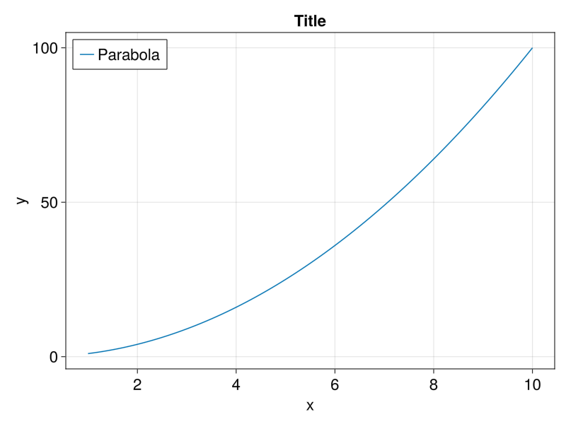
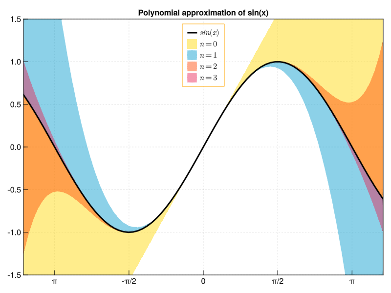
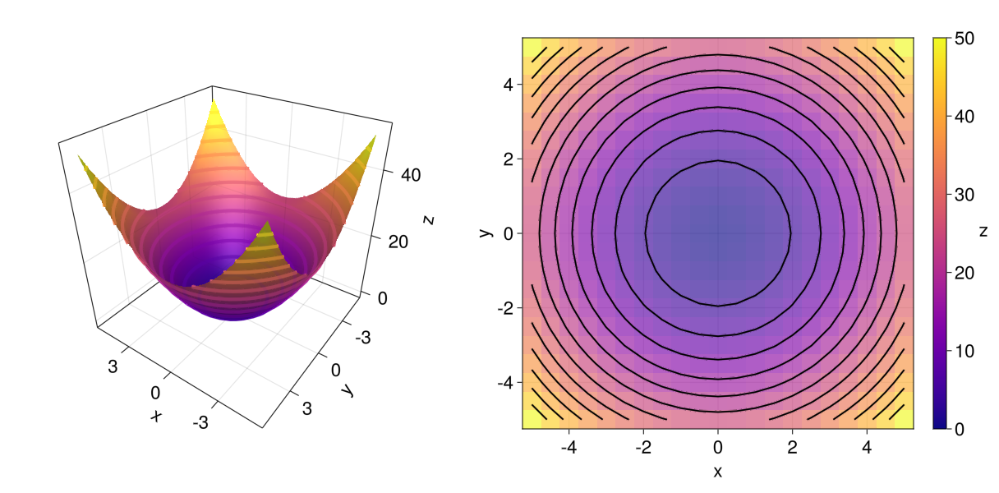

<div align="center">
    <picture>
      <source media="(prefers-color-scheme: dark)"
        srcset="/images/logo_with_text_dark.svg" >
      
    </picture>
</div>

<div align="center">

[![][docs-stable-img]][docs-stable-url]
[![][docs-master-img]][docs-master-url]

[](https://github.com/MakieOrg/Makie.jl/actions/workflows/ci.yml?query=branch%3Amaster)
[](https://github.com/MakieOrg/Makie.jl/blob/main/LICENSE)
[](http://juliapkgstats.com/pkg/Makie)

[![JOSS][joss-img]][joss-url]

[](https://mastodon.social/@makieorg)

[![chat][discord-img]][discord-url]

</div>

Makie is an interactive data visualization and plotting ecosystem for the [Julia programming language](https://julialang.org/), available on Windows, Linux and Mac.
The backend packages **GLMakie**, **WGLMakie**, **CairoMakie** and **RPRMakie** add different functionalities:
You can use Makie to interactively explore your data and create simple GUIs
in native windows or web browsers, export high-quality vector graphics or even raytrace with physically accurate lighting.

The name Makie (we pronounce it Mah-kee) is derived from the japanese word [_Maki-e_](https://en.wikipedia.org/wiki/Maki-e), which is a technique to sprinkle lacquer with gold and silver powder.
Data is the gold and silver of our age, so let's spread it out beautifully on the screen!

To learn more, we invite you to visit the documentation at [docs.makie.org](http://docs.makie.org/stable/).

[gitlab-img]: https://gitlab.com/JuliaGPU/Makie.jl/badges/master/pipeline.svg
[gitlab-url]: https://gitlab.com/JuliaGPU/Makie.jl/pipelines
[docs-stable-img]: https://img.shields.io/badge/Docs-Stable-lightgrey.svg
[docs-stable-url]: http://docs.makie.org/stable/
[docs-master-img]: https://img.shields.io/badge/Docs-Dev-blue.svg
[docs-master-url]: http://docs.makie.org/dev/
[joss-url]: https://doi.org/10.21105/joss.03349
[joss-img]: http://joss.theoj.org/papers/10.21105/joss.03349/status.svg

[discord-url]: https://discord.com/invite/2FBjYAT3cY
[discord-img]: https://img.shields.io/discord/996787732149981214.svg?logo=discord&colorB=7289DA&label=Discord

## Citing Makie

If you use Makie for a scientific publication, please acknowledge and support our work by citing [our JOSS paper](https://joss.theoj.org/papers/10.21105/joss.03349) the following way:

```
Danisch & Krumbiegel, (2021). Makie.jl: Flexible high-performance data visualization for Julia.
Journal of Open Source Software, 6(65), 3349, https://doi.org/10.21105/joss.03349
```


<details>
  <summary>BibTeX entry:</summary>

```bib
@article{DanischKrumbiegel2021,
  doi = {10.21105/joss.03349},
  url = {https://doi.org/10.21105/joss.03349},
  year = {2021},
  publisher = {The Open Journal},
  volume = {6},
  number = {65},
  pages = {3349},
  author = {Simon Danisch and Julius Krumbiegel},
  title = {{Makie.jl}: Flexible high-performance data visualization for {Julia}},
  journal = {Journal of Open Source Software}
}
```
</details>

or [Download the BibTeX file](./DanischKrumbiegel2021.bibtex).

## Community Channels

We are on [Discord](https://discord.com/invite/2FBjYAT3cY) and [Discourse](https://discourse.julialang.org/c/17?tags=Makie)! Community channels are a great way for you to ask questions and get help. Please join us!

## Installation

Choose one or more backend packages: **GLMakie** (interactive OpenGL in native OS windows), **WGLMakie** (interactive WebGL in browsers, IDEs, notebooks), **CairoMakie** (static 2D vector graphics and images) and **RPRMakie** (raytracing).
Each backend re-exports all of Makie.jl so you don't have to install or load it explicitly.

Install:

```julia
julia>]
pkg> add GLMakie
```

Check the installed version:

```julia
]st GLMakie
```

Start using the package:

```julia
using GLMakie
```

## Developing Makie

<details>
  <summary><span style="color:red"> 🔥 Click for more 🔥</span></summary>

Makie and its backends all live in the Makie monorepo.
This makes it easier to change code across all packages.
Therefore, dev'ing Makie almost works as with other Julia packages, just, that one needs to also dev the sub packages:

```julia
# local will clone the repository at ./dev/Makie
# Pkg is smart enough to dev the backends at `/dev/Makie/GLMakie` for the below
]dev --local Makie GLMakie CairoMakie WGLMakie RPRMakie
```

To run the tests, you also should add:
```julia
]dev dev/Makie/ReferenceTests
```
For more info about ReferenceTests, check out its [README](./ReferenceUpdater/README.md)
</details>

## Examples

The following examples are supposed to be self-explanatory. For further information [check out the documentation!](http://docs.makie.org/stable/)

### A simple parabola

```julia
x = 1:0.1:10
fig = lines(x, x.^2; label = "Parabola",
    axis = (; xlabel = "x", ylabel = "y", title ="Title"),
    figure = (; size = (800,600), fontsize = 22))
axislegend(; position = :lt)
save("./images/parabola.png", fig)
fig
```



### A more complex plot with unicode characters and LaTeX strings:
[Similar to the one on this link](<https://github.com/gcalderone/Gnuplot.jl#a-slightly-more-complex-plot-with-unicode-on-x-tics>)

<details>
  <summary>Show Code</summary>

```julia
x = -2pi:0.1:2pi
approx = fill(0.0, length(x))
cmap = [:gold, :deepskyblue3, :orangered, "#e82051"]
with_theme(palette = (; patchcolor = cgrad(cmap, alpha=0.45))) do
    fig, axis, lineplot = lines(x, sin.(x); label = L"sin(x)", linewidth = 3, color = :black,
        axis = (; title = "Polynomial approximation of sin(x)",
            xgridstyle = :dash, ygridstyle = :dash,
            xticksize = 10, yticksize = 10, xtickalign = 1, ytickalign = 1,
            xticks = (-π:π/2:π, ["π", "-π/2", "0", "π/2", "π"])
        ))
    translate!(lineplot, 0, 0, 2) # move line to foreground
    band!(x, sin.(x), approx .+= x; label = L"n = 0")
    band!(x, sin.(x), approx .+= -x .^ 3 / 6; label = L"n = 1")
    band!(x, sin.(x), approx .+= x .^ 5 / 120; label = L"n = 2")
    band!(x, sin.(x), approx .+= -x .^ 7 / 5040; label = L"n = 3")
    limits!(-3.8, 3.8, -1.5, 1.5)
    axislegend(; position = :ct, backgroundcolor = (:white, 0.75), framecolor = :orange)
    save("./images/approxsin.png", fig, size = (800, 600))
    fig
end
```
</details>



### Simple layout: Heatmap, contour and 3D surface plot

<details>
  <summary>Show Code</summary>

```julia
x = y = -5:0.5:5
z = x .^ 2 .+ y' .^ 2
cmap = :plasma
with_theme(colormap = cmap) do
    fig = Figure(fontsize = 22)
    ax3d = Axis3(fig[1, 1]; aspect = (1, 1, 1),
        perspectiveness = 0.5, azimuth = 2.19, elevation = 0.57)
    ax2d = Axis(fig[1, 2]; aspect = 1, xlabel = "x", ylabel="y")
    pltobj = surface!(ax3d, x, y, z; transparency = true)
    heatmap!(ax2d, x, y, z; colormap = (cmap, 0.65))
    contour!(ax2d, x, y, z; linewidth = 2, levels = 12, color = :black)
    contour3d!(ax3d, x, y, z; linewidth = 4, levels = 12,
        transparency = true)
    Colorbar(fig[1, 3], pltobj; label="z", labelrotation=pi)
    colsize!(fig.layout, 1, Aspect(1, 1.0))
    colsize!(fig.layout, 2, Aspect(1, 1.0))
    resize_to_layout!(fig)
    save("./images/simpleLayout.png", fig)
    fig
end
```
</details>



Interactive example by [AlexisRenchon](https://github.com/AlexisRenchon):


Example from [InteractiveChaos.jl](https://github.com/JuliaDynamics/InteractiveChaos.jl)

[
](https://github.com/JuliaDynamics/InteractiveChaos.jl)


## Sponsors


Förderkennzeichen: 01IS10S27, 2020
