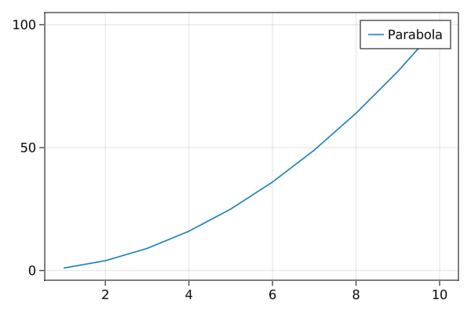
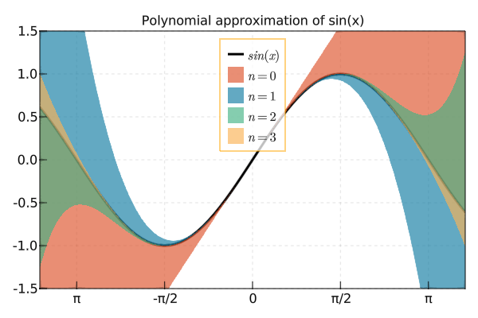
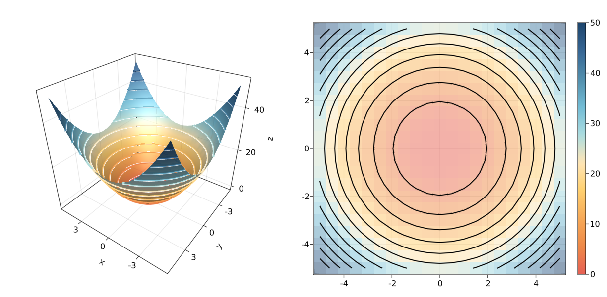

<div align="center">
    
</div>

From the japanese word [_Maki-e_](https://en.wikipedia.org/wiki/Maki-e), which is a technique to sprinkle lacquer with gold and silver powder.
Data is the gold and silver of our age, so let's spread it out beautifully on the screen!

[Check out the documentation here!](http://docs.makie.org/stable/)

[![][docs-stable-img]][docs-stable-url] [![][docs-master-img]][docs-master-url] [](https://twitter.com/MakiePlots)


[gitlab-img]: https://gitlab.com/JuliaGPU/Makie.jl/badges/master/pipeline.svg
[gitlab-url]: https://gitlab.com/JuliaGPU/Makie.jl/pipelines
[docs-stable-img]: https://img.shields.io/badge/docs-stable-lightgrey.svg
[docs-stable-url]: http://docs.makie.org/stable/
[docs-master-img]: https://img.shields.io/badge/docs-master-blue.svg
[docs-master-url]: http://docs.makie.org/dev/

# Citing Makie

If you use Makie for a scientific publication, please cite [our JOSS paper](https://joss.theoj.org/papers/10.21105/joss.03349) the following way:

> Danisch & Krumbiegel, (2021). Makie.jl: Flexible high-performance data visualization for Julia. Journal of Open Source Software, 6(65), 3349, https://doi.org/10.21105/joss.03349

BibTeX entry:

```bib
@article{DanischKrumbiegel2021,
  doi = {10.21105/joss.03349},
  url = {https://doi.org/10.21105/joss.03349},
  year = {2021},
  publisher = {The Open Journal},
  volume = {6},
  number = {65},
  pages = {3349},
  author = {Simon Danisch and Julius Krumbiegel},
  title = {Makie.jl: Flexible high-performance data visualization for Julia},
  journal = {Journal of Open Source Software}
}
```

or [Download the BibTeX file](./assets/DanischKrumbiegel2021.bibtex).

# Installation

Please consider using the backends directly. As explained in the documentation, they re-export all of Makie's functionality.
So, instead of installing Makie, just install e.g. GLMakie directly:

```julia
julia>]
pkg> add GLMakie
```

You may check the installed version with:

```julia
]st GLMakie
```

Start using the package:

```julia
using GLMakie
```

## Developing Makie

Makie and its backends all live in the Makie monorepo.
This makes it easier to change code across all packages.
Therefore, dev'ing Makie almost works as with other Julia packages, just, that one needs to also dev the sub packages:

```julia
]dev --local Makie # local will clone the repository at ./dev/Makie
]dev dev/Makie/MakieCore dev/Makie/GLMakie dev/Makie/CairoMakie dev/Makie/WGLMakie dev/Makie/RPRMakie
```

To run the tests, you also should add:
```julia
]dev dev/Makie/ReferenceTests
```
For more info about ReferenceTests, check out its [README](./ReferenceUpdater/README.md)

# Quick start

The following examples are supposed to be self-explanatory. For further information [check out the documentation!](http://docs.makie.org/stable/)

### A simple parabola

```julia
x = 1:10
fig = lines(x, x.^2; label = "Parabola")
axislegend()
save("./assets/parabola.png", fig, resolution = (600, 400))
fig
```



### A more complex plot with unicode characters and LaTeX strings:
[Similar to the one on this link](<https://github.com/gcalderone/Gnuplot.jl#a-slightly-more-complex-plot-with-unicode-on-x-tics>)

```julia
x = -2pi:0.1:2pi
approx = fill(0.0, length(x))
set_theme!(palette = (; patchcolor = cgrad(:Egypt, alpha=0.65)))
fig, axis, lineplot = lines(x, sin.(x); label = L"sin(x)", linewidth = 3, color = :black,
    axis = (; title = "Polynomial approximation of sin(x)",
        xgridstyle = :dash, ygridstyle = :dash,
        xticksize = 10, yticksize = 10, xtickalign = 1, ytickalign = 1,
        xticks = (-π:π/2:π, ["π", "-π/2", "0", "π/2", "π"])
    ))
translate!(lineplot, 0, 0, 2) # move line to foreground
band!(x, sin.(x), approx .+= x; label = L"n = 0")
band!(x, sin.(x), approx .+= -x .^ 3 / 6; label = L"n = 1")
band!(x, sin.(x), approx .+= x .^ 5 / 120; label = L"n = 2")
band!(x, sin.(x), approx .+= -x .^ 7 / 5040; label = L"n = 3")
limits!(-3.8, 3.8, -1.5, 1.5)
axislegend(; position = :ct, bgcolor = (:white, 0.75), framecolor = :orange)
save("./assets/approxsin.png", fig, resolution = (600, 400))
fig
```



### Simple layout: Heatmap, contour and 3D surface plot

```julia
x = y = -5:0.5:5
z = x .^ 2 .+ y' .^ 2
set_theme!(colormap = :Hiroshige)
fig = Figure()
ax3d = Axis3(fig[1, 1]; aspect = (1, 1, 1),
    perspectiveness = 0.5, azimuth = 2.19, elevation = 0.57)
ax2d = Axis(fig[1, 2]; aspect = 1)
pltobj = surface!(ax3d, x, y, z; transparency = true)
heatmap!(ax2d, x, y, z; colormap = (:Hiroshige, 0.5))
contour!(ax2d, x, y, z; linewidth = 2, levels = 12, color = :black)
contour3d!(ax3d, x, y, z; linewidth = 4, levels = 12,
    transparency = true)
Colorbar(fig[1, 3], pltobj)
colsize!(fig.layout, 1, Aspect(1, 1.0))
colsize!(fig.layout, 2, Aspect(1, 1.0))
resize_to_layout!(fig)
save("./assets/simpleLayout.png", fig)
fig
```



⚠️WARNING⚠️. Don't forget to reset to the default Makie settings by doing `set_theme!()`.

Interactive example by [AlexisRenchon](https://github.com/AlexisRenchon):


Example from [InteractiveChaos.jl](https://github.com/JuliaDynamics/InteractiveChaos.jl)

[
](https://github.com/JuliaDynamics/InteractiveChaos.jl)


You can follow Makie on [twitter](https://twitter.com/MakiePlots) to get the latest, outstanding examples:
[](https://twitter.com/MakiePlots)


## Sponsors


Förderkennzeichen: 01IS10S27, 2020
