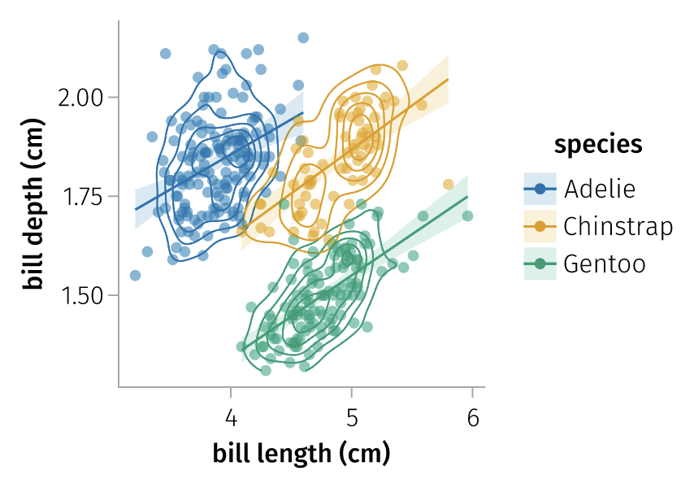
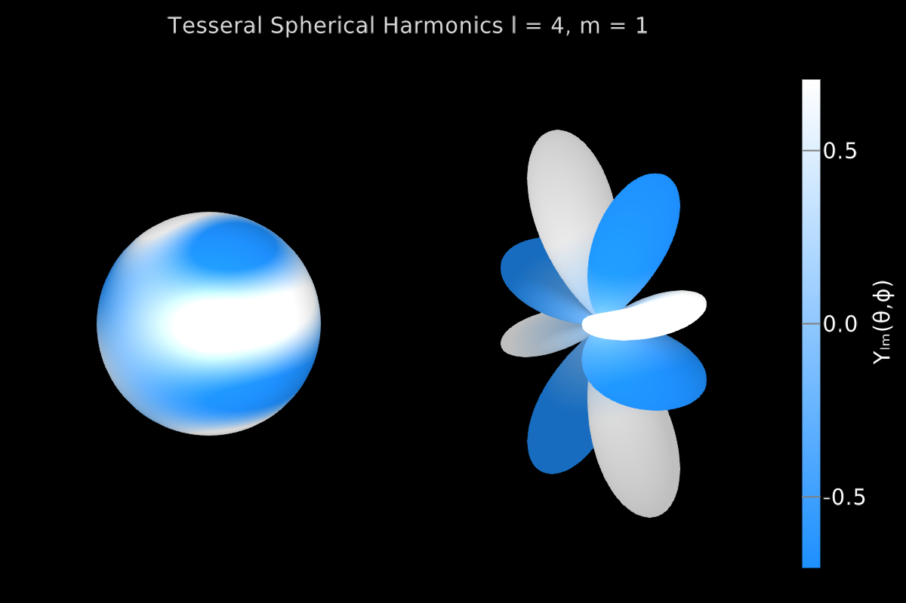
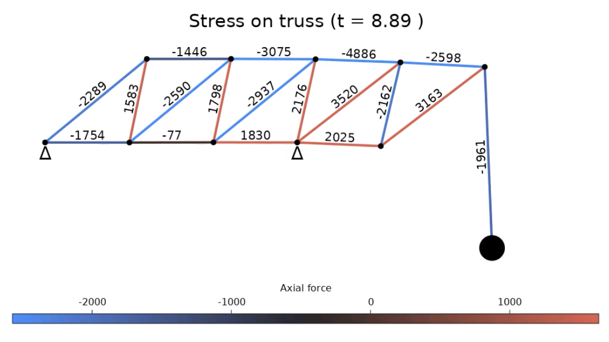
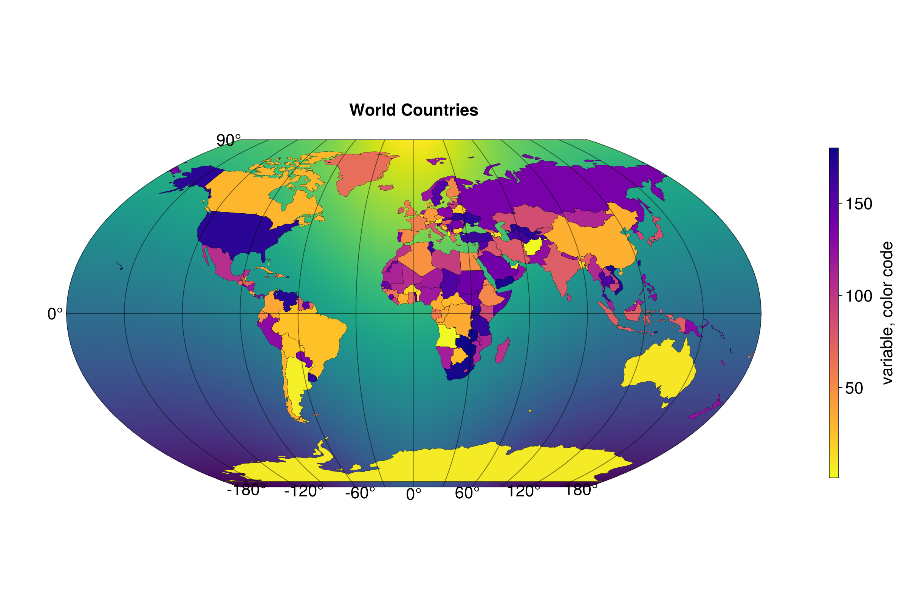
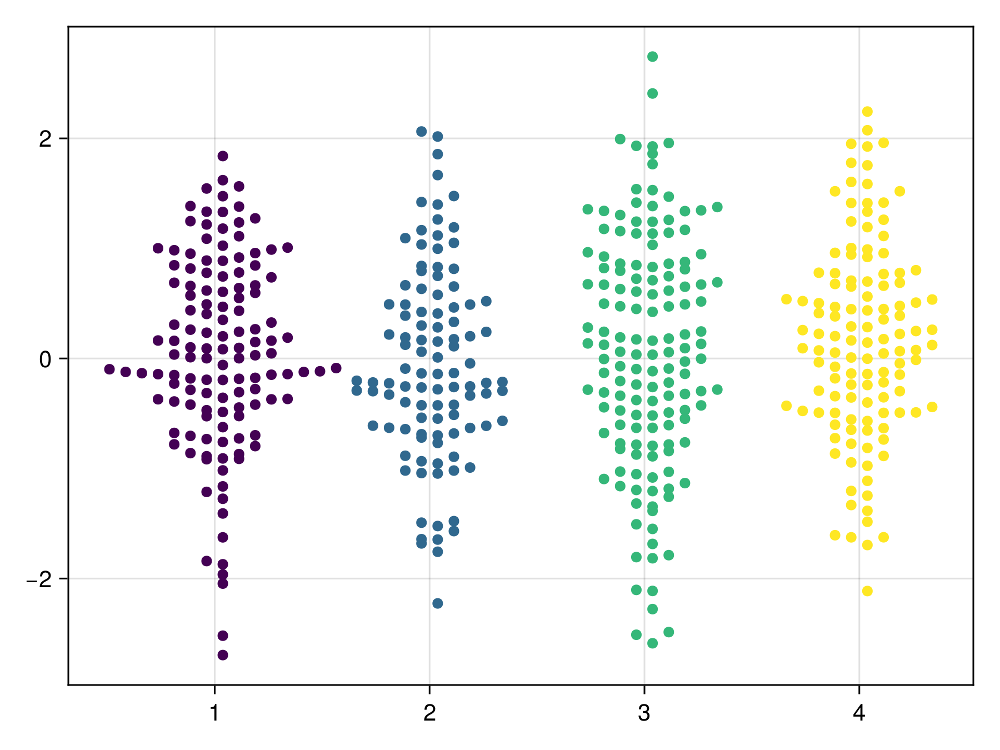

# Ecosystem {#Ecosystem}

These packages and sites are maintained by third parties. If you install packages, keep an eye on version conflicts or downgrades as the Makie ecosystem is developing quickly so things break occasionally.

## [AlgebraOfGraphics.jl](https://github.com/MakieOrg/AlgebraOfGraphics.jl) {#AlgebraOfGraphics.jlhttps://github.com/MakieOrg/AlgebraOfGraphics.jl}

Grammar-of-graphics style plotting, inspired by ggplot2.

## [Beautiful Makie](https://beautiful.makie.org/dev/) {#Beautiful-Makiehttps://beautiful.makie.org/dev/}

This third-party gallery contains many advanced examples.

## [GraphMakie.jl](https://github.com/MakieOrg/GraphMakie.jl) {#GraphMakie.jlhttps://github.com/MakieOrg/GraphMakie.jl}

Graphs with two- and three-dimensional layout algorithms.

## [GeoMakie.jl](https://github.com/MakieOrg/GeoMakie.jl) {#GeoMakie.jlhttps://github.com/MakieOrg/GeoMakie.jl}

Geographic plotting utilities including projections.

## [SwarmMakie.jl](https://github.com/MakieOrg/SwarmMakie.jl) {#SwarmMakie.jlhttps://github.com/MakieOrg/SwarmMakie.jl}

Beeswarm plots for Makie.jl! 

