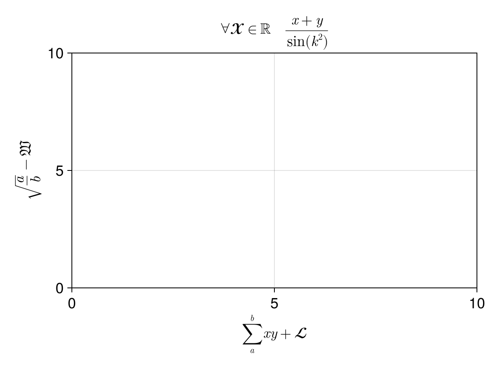
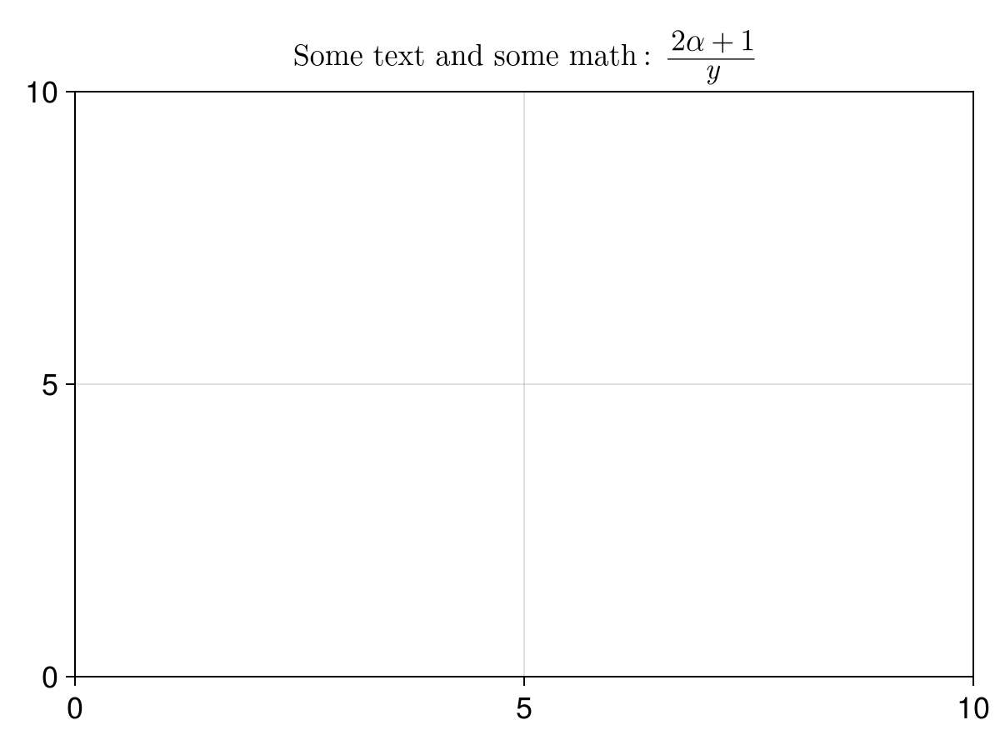
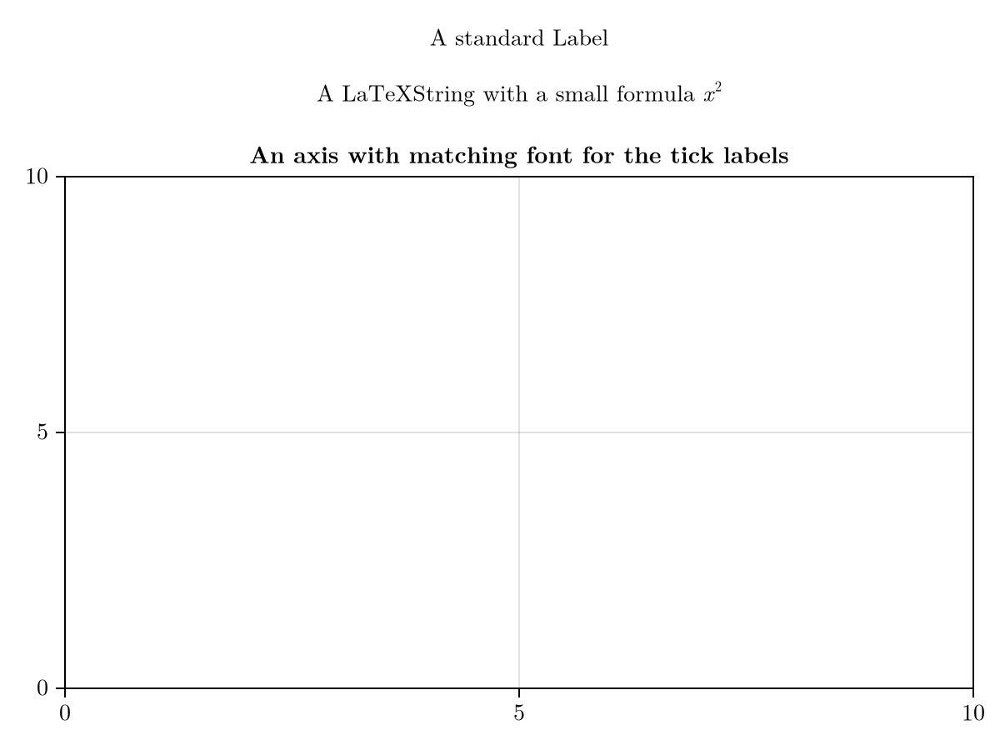

# LaTeX {#LaTeX}

Makie can render LaTeX strings from the [LaTeXStrings.jl](https://github.com/stevengj/LaTeXStrings.jl) package using [MathTeXEngine.jl](https://github.com/Kolaru/MathTeXEngine.jl/).

While this engine is responsive enough for use in GLMakie, it only supports a subset of LaTeX&#39;s most used commands.

## Using L-strings {#Using-L-strings}

You can pass `LaTeXString` objects to almost any object with text labels. They are constructed using the `L` string macro prefix. The whole string is interpreted as an equation if it doesn&#39;t contain an unescaped `$`.
<a id="example-dd8e10b" />


```julia
using CairoMakie
f = Figure(fontsize = 18)

Axis(f[1, 1],
    title = L"\forall \mathcal{X} \in \mathbb{R} \quad \frac{x + y}{\sin(k^2)}",
    xlabel = L"\sum_a^b{xy} + \mathscr{L}",
    ylabel = L"\sqrt{\frac{a}{b}} - \mathfrak{W}"
)

f
```




You can also mix math-mode and text-mode. For [string interpolation](https://docs.julialang.org/en/v1/manual/strings/#string-interpolation) use `%$`instead of `$`:
<a id="example-54b846b" />


```julia
using CairoMakie
f = Figure(fontsize = 18)
t = "text"
Axis(f[1,1], title=L"Some %$(t) and some math: $\frac{2\alpha+1}{y}$")

f
```




## Uniformizing the fonts {#Uniformizing-the-fonts}

We provide a LaTeX theme to easily switch to the LaTeX default fonts for all the text.
<a id="example-11d0149" />


```julia
using CairoMakie
with_theme(theme_latexfonts()) do
    fig = Figure()
    Label(fig[1, 1], "A standard Label", tellwidth = false)
    Label(fig[2, 1], L"A LaTeXString with a small formula $x^2$", tellwidth = false)
    Axis(fig[3, 1], title = "An axis with matching font for the tick labels")
    fig
end
```



