# Axis {#Axis}

## Creating an Axis {#Creating-an-Axis}

The `Axis` is a 2D axis that works well with automatic layouts. Here&#39;s how you create one
<a id="example-fbdbcb1" />


```julia
using CairoMakie

f = Figure()

ax = Axis(f[1, 1], xlabel = "x label", ylabel = "y label",
    title = "Title")

f
```

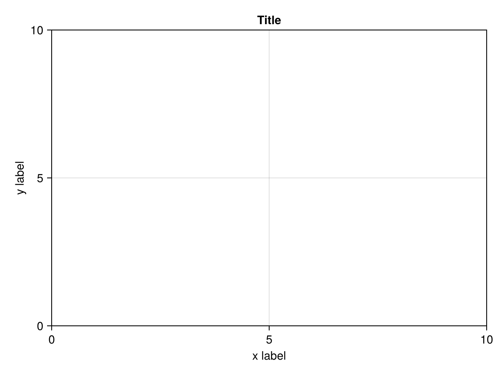


## Plotting into an Axis {#Plotting-into-an-Axis}

You can use all the normal mutating 2D plotting functions with an `Axis`. These functions return the created plot object. Omitting the `ax` argument plots into the `current_axis()`, which is usually the axis that was last created.
<a id="example-39a60c3" />


```julia
lineobject = lines!(ax, 0..10, sin, color = :red)
scatobject = scatter!(0:0.5:10, cos, color = :orange)

f
```

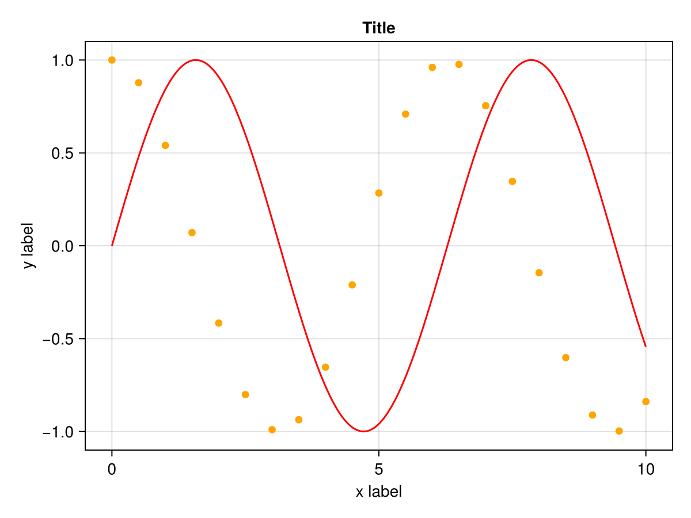


## Deleting plots {#Deleting-plots}

You can delete a plot object directly via `delete!(ax, plotobj)`. You can also remove all plots with `empty!(ax)`.
<a id="example-88c1a83" />


```julia
using CairoMakie
f = Figure()

axs = [Axis(f[1, i]) for i in 1:3]

scatters = map(axs) do ax
    [scatter!(ax, 0:0.1:10, x -> sin(x) + i) for i in 1:3]
end

delete!(axs[2], scatters[2][2])
empty!(axs[3])

f
```

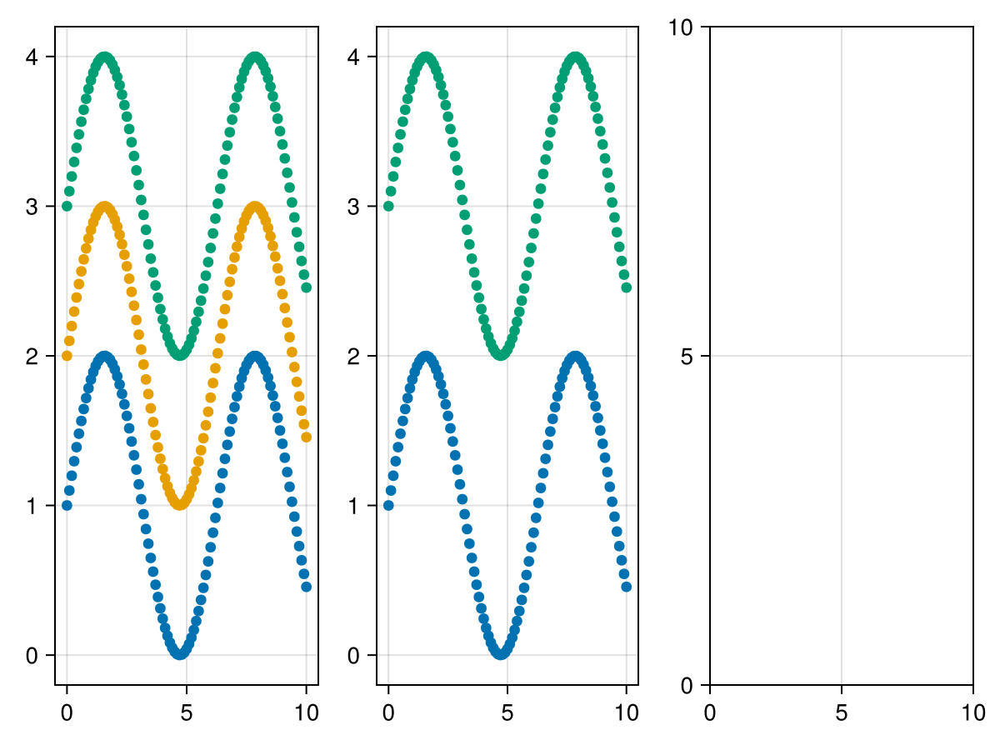


## Hiding Axis spines and decorations {#Hiding-Axis-spines-and-decorations}

You can hide all axis elements manually, by setting their specific visibility attributes to `false`, like `xticklabelsvisible`, but that can be tedious. There are a couple of convenience functions for this.

To hide spines, you can use `hidespines!`.
<a id="example-5d1d747" />


```julia
using CairoMakie
f = Figure()

ax1 = Axis(f[1, 1], title = "Axis 1")
ax2 = Axis(f[1, 2], title = "Axis 2")

hidespines!(ax1)
hidespines!(ax2, :t, :r) # only top and right

f
```

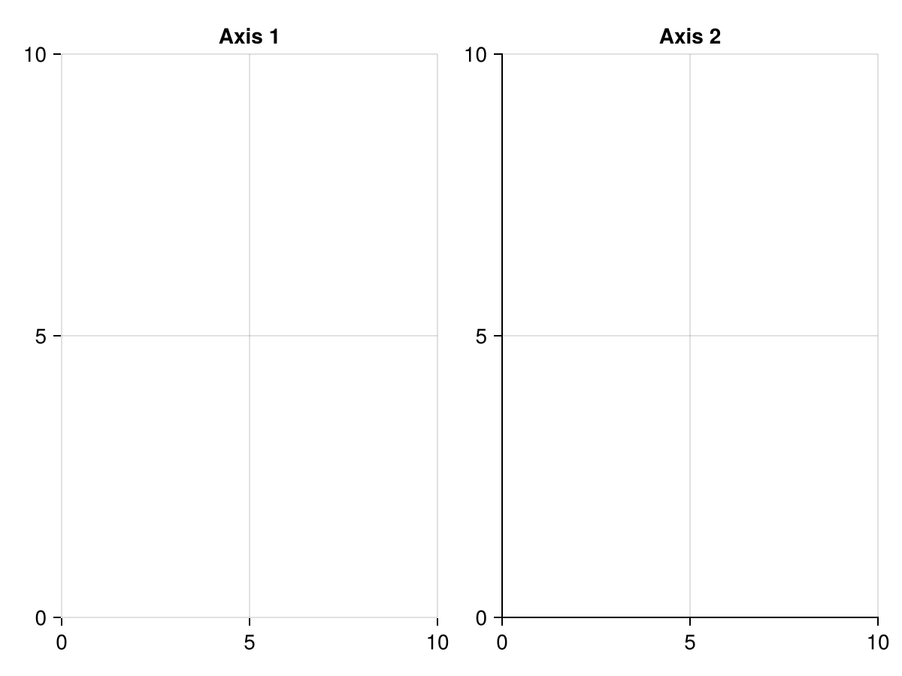


To hide decorations, you can use `hidedecorations!`, or the specific `hidexdecorations!` and `hideydecorations!`. When hiding, you can set `label = false`, `ticklabels = false`, `ticks = false`, `grid = false`, `minorgrid = false` or `minorticks = false` as keyword arguments if you want to keep those elements. It&#39;s common, e.g., to hide everything but the grid lines in facet plots.
<a id="example-c2e2848" />


```julia
using CairoMakie

f = Figure()

ax1 = Axis(f[1, 1], title = "Axis 1")
ax2 = Axis(f[1, 2], title = "Axis 2")
ax3 = Axis(f[1, 3], title = "Axis 3")

hidedecorations!(ax1)
hidexdecorations!(ax2, grid = false)
hideydecorations!(ax3, ticks = false)

f
```

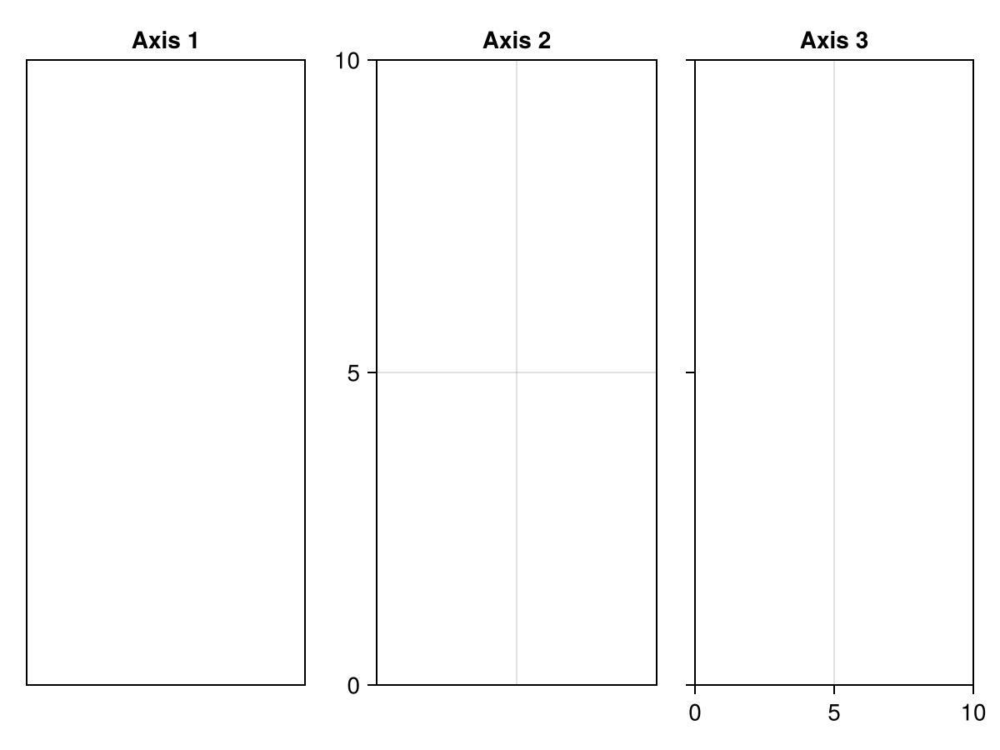


## Linking axes {#Linking-axes}

You can link axes to each other. Every axis simply keeps track of a list of other axes which it updates when it is changed itself. You can link x and y dimensions separately.
<a id="example-b95d27f" />


```julia
using CairoMakie

f = Figure()

ax1 = Axis(f[1, 1])
ax2 = Axis(f[1, 2])
ax3 = Axis(f[2, 2])

linkyaxes!(ax1, ax2)
linkxaxes!(ax2, ax3)

ax1.title = "y linked"
ax2.title = "x & y linked"
ax3.title = "x linked"

for (i, ax) in enumerate([ax1, ax2, ax3])
    lines!(ax, 1:10, 1:10, color = "green")
    if i != 1
        lines!(ax, 11:20, 1:10, color = "red")
    end
    if i != 3
        lines!(ax, 1:10, 11:20, color = "blue")
    end
end

f
```

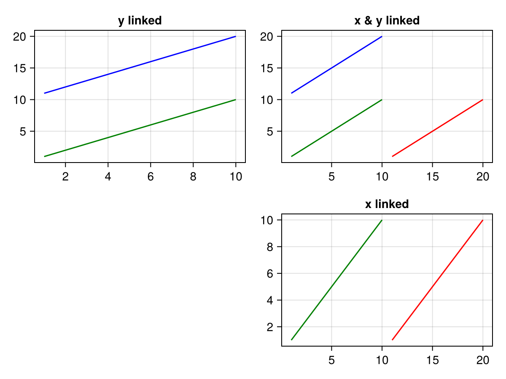


## Aligning neighboring axis labels {#Aligning-neighboring-axis-labels}

When placing axes with different ticks next to each other it can be desirable to visually align the labels of these axes. By default, the space allocated for the ticklabels is minimized. This value can be fixed by using the functions [`tight_xticklabel_spacing!`](/api#Makie.tight_xticklabel_spacing!), [`tight_yticklabel_spacing!`](/api#Makie.tight_yticklabel_spacing!) or [`tight_ticklabel_spacing!`](/api#Makie.tight_ticklabel_spacing!) for both.

Note how x and y labels are misaligned in this figure due to different tick label lengths.
<a id="example-308634d" />


```julia
using CairoMakie

f = Figure()

ax1 = Axis(f[1, 1], title = "Axis 1", ylabel = "y label", ytickformat = "{:.3f}")
ax2 = Axis(f[2, 1], title = "Axis 2", ylabel = "y label", xlabel = "x label")
ax3 = Axis(f[2, 2], title = "Axis 3", xlabel = "x label", xtickformat = "{:.3f}", xticklabelrotation = pi/4)

f
```

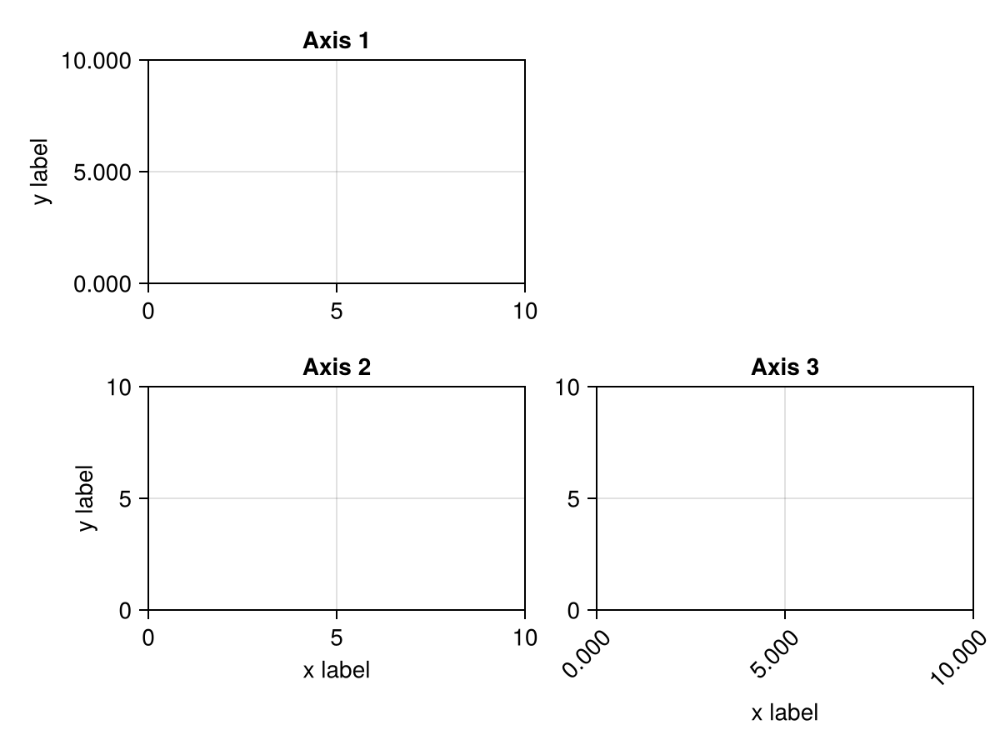


To align the labels, we can set the `xticklabelspace` or `yticklabelspace` attributes of the linked axes to the maximum space.
<a id="example-903f807" />


```julia
yspace = maximum(tight_yticklabel_spacing!, [ax1, ax2])
xspace = maximum(tight_xticklabel_spacing!, [ax2, ax3])

ax1.yticklabelspace = yspace
ax2.yticklabelspace = yspace

ax2.xticklabelspace = xspace
ax3.xticklabelspace = xspace

f
```

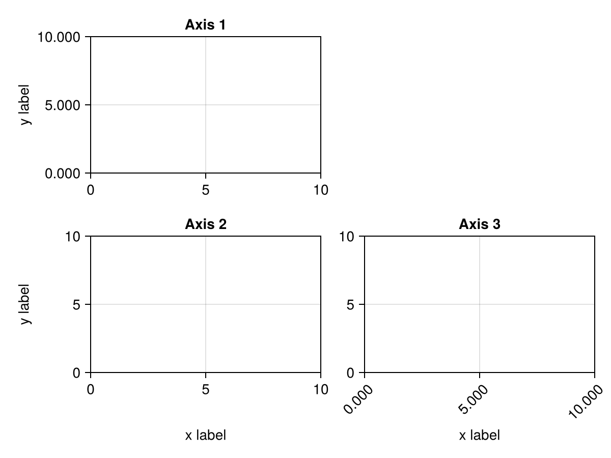


## Creating a twin axis {#Creating-a-twin-axis}

There is currently no dedicated function to do this, but you can simply add an Axis on top of another, then hide everything but the second axis.

Here&#39;s an example how to do this with a second y axis on the right.
<a id="example-665d019" />


```julia
using CairoMakie

f = Figure()

ax1 = Axis(f[1, 1], yticklabelcolor = :blue)
ax2 = Axis(f[1, 1], yticklabelcolor = :red, yaxisposition = :right)
hidespines!(ax2)
hidexdecorations!(ax2)

lines!(ax1, 0..10, sin, color = :blue)
lines!(ax2, 0..10, x -> 100 * cos(x), color = :red)

f
```

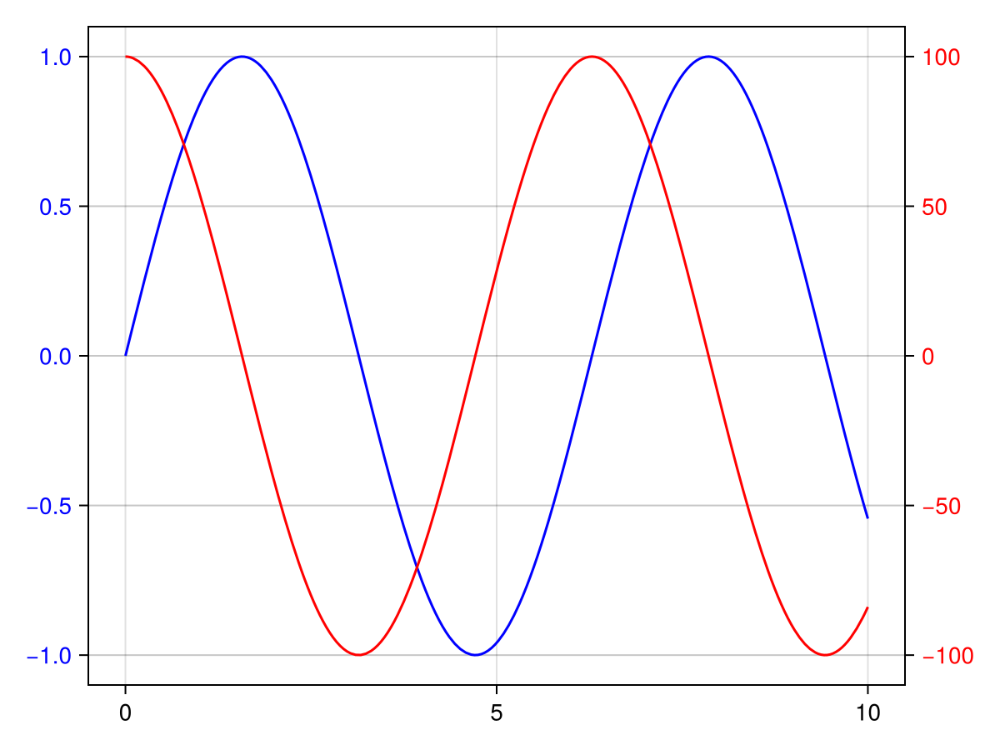


## Axis interaction {#Axis-interaction}

An Axis has a couple of predefined interactions enabled.

### Scroll zoom {#Scroll-zoom}

You can zoom in an axis by scrolling in and out. If you press x or y while scrolling, the zoom movement is restricted to that dimension. These keys can be changed with the attributes `xzoomkey` and `yzoomkey`. You can also restrict the zoom dimensions all the time by setting the axis attributes `xzoomlock` or `yzoomlock` to `true`.

### Drag pan {#Drag-pan}

You can pan around the axis by right-clicking and dragging. If you press x or y while panning, the pan movement is restricted to that dimension. These keys can be changed with the attributes `xpankey` and `ypankey`. You can also restrict the pan dimensions all the time by setting the axis attributes `xpanlock` or `ypanlock` to `true`.

### Limit reset {#Limit-reset}

You can reset the limits with `ctrl + leftclick`. This is the same as doing `reset_limits!(ax)`. This sets the limits back to the values stored in `ax.limits`, and if they are `nothing`, computes them automatically. If you have previously called `limits!`, `xlims!` or `ylims!`, these settings therefore stay intact when doing a limit reset.

You can alternatively press `ctrl + shift + leftclick`, which is the same as calling `autolimits!(ax)`. This function ignores previously set limits and computes them all anew given the axis content.

### Rectangle selection zoom {#Rectangle-selection-zoom}

Left-click and drag zooms into the selected rectangular area. If you press x or y while panning, only the respective dimension is affected. You can also restrict the selection zoom dimensions all the time by setting the axis attributes `xrectzoom` or `yrectzoom` to `true`.

### Custom interactions {#Custom-interactions}

The interaction system is an additional abstraction upon Makie&#39;s low-level event system to make it easier to quickly create your own interaction patterns.

#### Registering and deregistering interactions {#Registering-and-deregistering-interactions}

To register a new interaction, call `register_interaction!(ax, name::Symbol, interaction)`. The `interaction` argument can be of any type.

To remove an existing interaction completely, call `deregister_interaction!(ax, name::Symbol)`. You can check which interactions are currently active by calling `interactions(ax)`. The default interactions are `:dragpan`, `:limitreset`, `:rectanglezoom` and `:scrollzoom`.

#### Activating and deactivating interactions {#Activating-and-deactivating-interactions}

Often, you don&#39;t want to remove an interaction entirely but only disable it for a moment, then re-enable it again. You can use the functions `activate_interaction!(ax, name::Symbol)` and `deactivate_interaction!(ax, name::Symbol)` for that.

#### `Function` interaction {#Function-interaction}

If `interaction` is a `Function`, it should accept two arguments, which correspond to an event and the axis. This function will then be called whenever the axis generates an event.

Here&#39;s an example of such a function. Note that we use the special dispatch signature for Functions that allows to use the `do`-syntax:

```julia
register_interaction!(ax, :my_interaction) do event::MouseEvent, axis
    if event.type === MouseEventTypes.leftclick
        println("You clicked on the axis!")
    end
end
```


As you can see, it&#39;s possible to restrict the type parameter of the event argument. Choices are one of `MouseEvent`, `KeysEvent` or `ScrollEvent` if you only want to handle a specific class. Your function can also have multiple methods dealing with each type.

#### Custom object interaction {#Custom-object-interaction}

The function option is most suitable for interactions that don&#39;t involve much state. A more verbose but flexible option is available. For this, you define a new type which typically holds all the state variables you&#39;re interested in.

Whenever the axis generates an event, it calls `process_interaction(interaction, event, axis)` on all stored interactions. By defining `process_interaction` for specific types of interaction and event, you can create more complex interaction patterns.

Here&#39;s an example with simple state handling where we allow left clicks while l is pressed, and right clicks while r is pressed:

```julia
mutable struct MyInteraction
    allow_left_click::Bool
    allow_right_click::Bool
end

function Makie.process_interaction(interaction::MyInteraction, event::MouseEvent, axis)
    if interaction.allow_left_click && event.type === MouseEventTypes.leftclick
        println("Left click in correct mode")
    end
    if interaction.allow_right_click && event.type === MouseEventTypes.rightclick
        println("Right click in correct mode")
    end
end

function Makie.process_interaction(interaction::MyInteraction, event::KeysEvent, axis)
    interaction.allow_left_click = Keyboard.l in event.keys
    interaction.allow_right_click = Keyboard.r in event.keys
end

register_interaction!(ax, :left_and_right, MyInteraction(false, false))
```


#### Setup and cleanup {#Setup-and-cleanup}

Some interactions might have more complex state involving plot objects that need to be setup or removed. For those purposes, you can overload the methods `registration_setup!(parent, interaction)` and `deregistration_cleanup!(parent, interaction)` which are called during registration and deregistration, respectively.

## Attributes {#Attributes}

### alignmode {#alignmode}

Defaults to `Inside()`

The align mode of the axis in its parent GridLayout.

### aspect {#aspect}

Defaults to `nothing`

Controls the forced aspect ratio of the axis.

The default `nothing` will not constrain the aspect ratio. The axis area will span the available width and height in the layout.

`DataAspect()` reduces the effective axis size within the available layout space so that the axis aspect ratio width/height matches that of the data limits. For example, if the x limits range from 0 to 300 and the y limits from 100 to 250, `DataAspect()` will result in an aspect ratio of `(300 - 0) / (250 - 100) = 2`. This can be useful when plotting images, because the image will be displayed unsquished.

`AxisAspect(ratio)` reduces the effective axis size within the available layout space so that the axis aspect ratio width/height matches `ratio`.

Note that both `DataAspect` and `AxisAspect` can result in excess whitespace around the axis. To make a `GridLayout` aware of aspect ratio constraints, refer to the `Aspect` column or row size setting.
<a id="example-9af84b5" />


```julia
using CairoMakie
using FileIO

f = Figure()

ax1 = Axis(f[1, 1], aspect = nothing, title = "nothing")
ax2 = Axis(f[1, 2], aspect = DataAspect(), title = "DataAspect()")
ax3 = Axis(f[2, 1], aspect = AxisAspect(1), title = "AxisAspect(1)")
ax4 = Axis(f[2, 2], aspect = AxisAspect(2), title = "AxisAspect(2)")

img = rotr90(load(assetpath("cow.png")))
for ax in [ax1, ax2, ax3, ax4]
    image!(ax, img)
end

f
```

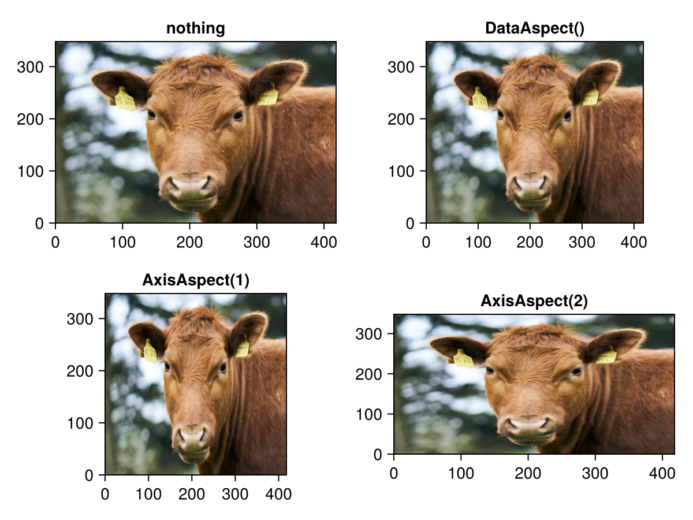


### autolimitaspect {#autolimitaspect}

Defaults to `nothing`

If `autolimitaspect` is set to a number, the limits of the axis will autoadjust such that the ratio of the limits to the axis size equals that number.

For example, if the axis size is 100 x 200, then with `autolimitaspect = 1`, the autolimits will also have a ratio of 1 to 2. The setting `autolimitaspect = 1` is the complement to `aspect = AxisAspect(1)`, but while `aspect` changes the axis size, `autolimitaspect` changes the limits to achieve the desired ratio.

::: warning Warning

`autolimitaspect` can introduce cyclical updates which result in stack overflow errors. This happens when the expanded limits have different ticks than the unexpanded ones. The difference in size causes a relayout which might again result in different autolimits to match the new aspect ratio, new ticks and again a relayout.

You can hide the ticklabels or fix `xticklabelspace` and `yticklabelspace` to avoid the relayouts. You can choose the amount of space manually or pick the current automatic one with `tight_ticklabel_spacing!`.

:::
<a id="example-3bdabc3" />


```julia
using CairoMakie
f = Figure()

ax1 = Axis(f[1, 1], autolimitaspect = nothing)
ax2 = Axis(f[1, 2], autolimitaspect = 1)

for ax in [ax1, ax2]
    lines!(ax, 0..10, sin)
end

f
```

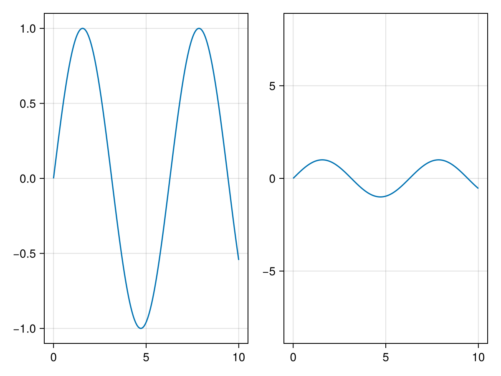


### backgroundcolor {#backgroundcolor}

Defaults to `:white`

The background color of the axis.
<a id="example-ec8a3ed" />


```julia
using CairoMakie
    f = Figure()

    ax1 = Axis(f[1, 1])
    ax2 = Axis(f[1, 2], backgroundcolor = :gray80)

    f
```

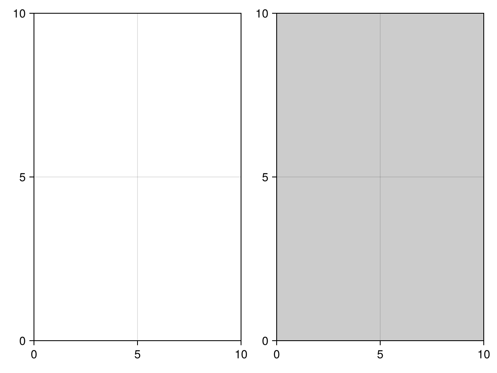


### bottomspinecolor {#bottomspinecolor}

Defaults to `:black`

The color of the bottom axis spine.

### bottomspinevisible {#bottomspinevisible}

Defaults to `true`

Controls if the bottom axis spine is visible.

### dim1_conversion {#dim1_conversion}

Defaults to `nothing`

Global state for the x dimension conversion.

### dim2_conversion {#dim2_conversion}

Defaults to `nothing`

Global state for the y dimension conversion.

### flip_ylabel {#flip_ylabel}

Defaults to `false`

Controls if the ylabel&#39;s rotation is flipped.

### halign {#halign}

Defaults to `:center`

The horizontal alignment of the axis within its suggested bounding box.

### height {#height}

Defaults to `nothing`

The height of the axis.

### leftspinecolor {#leftspinecolor}

Defaults to `:black`

The color of the left axis spine.

### leftspinevisible {#leftspinevisible}

Defaults to `true`

Controls if the left axis spine is visible.

### limits {#limits}

Defaults to `(nothing, nothing)`

Can be used to manually specify which axis limits are desired.

The `limits` attribute cannot be used to read out the actual limits of the axis. The value of `limits` does not change when interactively zooming and panning and the axis can be reset accordingly using the function `reset_limits!`.

The function `autolimits!` resets the value of `limits` to `(nothing, nothing)` and adjusts the axis limits according to the extents of the plots added to the axis.

The value of `limits` can be a four-element tuple `(xlow, xhigh, ylow, yhigh)` where each value can be a real number or `nothing`. It can also be a tuple `(x, y)` where `x` and `y` can be `nothing` or a tuple `(low, high)`. In all cases, `nothing` means that the respective limit values will be automatically determined.

Automatically determined limits are also influenced by `xautolimitmargin` and `yautolimitmargin`.

The convenience functions `xlims!` and `ylims!` allow to set only the x or y part of `limits`. The function `limits!` is another option to set both x and y simultaneously.
<a id="example-bcdd70a" />


```julia
using CairoMakie
f = Figure()

ax1 = Axis(f[1, 1], limits = (nothing, nothing), title = "(nothing, nothing)")
ax2 = Axis(f[1, 2], limits = (0, 4pi, -1, 1), title = "(0, 4pi, -1, 1)")
ax3 = Axis(f[2, 1], limits = ((0, 4pi), nothing), title = "((0, 4pi), nothing)")
ax4 = Axis(f[2, 2], limits = (nothing, 4pi, nothing, 1), title = "(nothing, 4pi, nothing, 1)")

for ax in [ax1, ax2, ax3, ax4]
    lines!(ax, 0..4pi, sin)
end

f
```

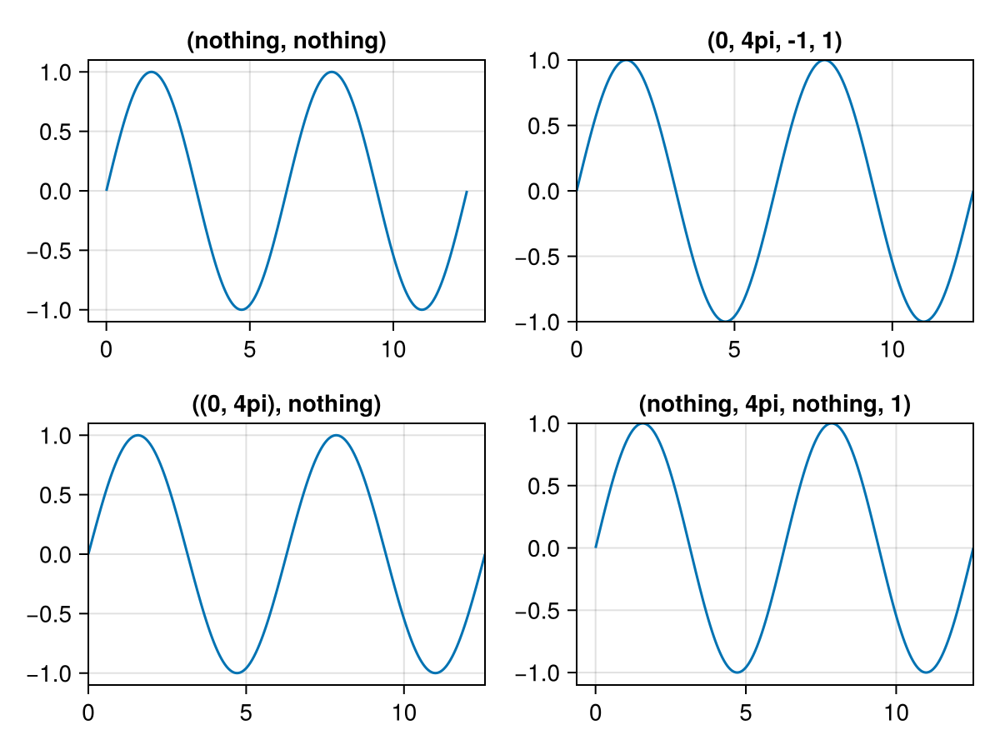


### panbutton {#panbutton}

Defaults to `Makie.Mouse.right`

The button for panning.

### rightspinecolor {#rightspinecolor}

Defaults to `:black`

The color of the right axis spine.

### rightspinevisible {#rightspinevisible}

Defaults to `true`

Controls if the right axis spine is visible.

### spinewidth {#spinewidth}

Defaults to `1.0`

The width of the axis spines.

### subtitle {#subtitle}

Defaults to `""`

The content of the axis subtitle. The value can be any non-vector-valued object that the `text` primitive supports.
<a id="example-548ff3b" />


```julia
using CairoMakie
f = Figure()

Axis(f[1, 1], title = "Title", subtitle = "Subtitle")
Axis(f[2, 1], title = "Title", subtitle = L"\sum_i{x_i \times y_i}")
Axis(f[3, 1], title = "Title", subtitle = rich(
    "Rich text subtitle",
    subscript(" with subscript", color = :slategray)
))

f
```

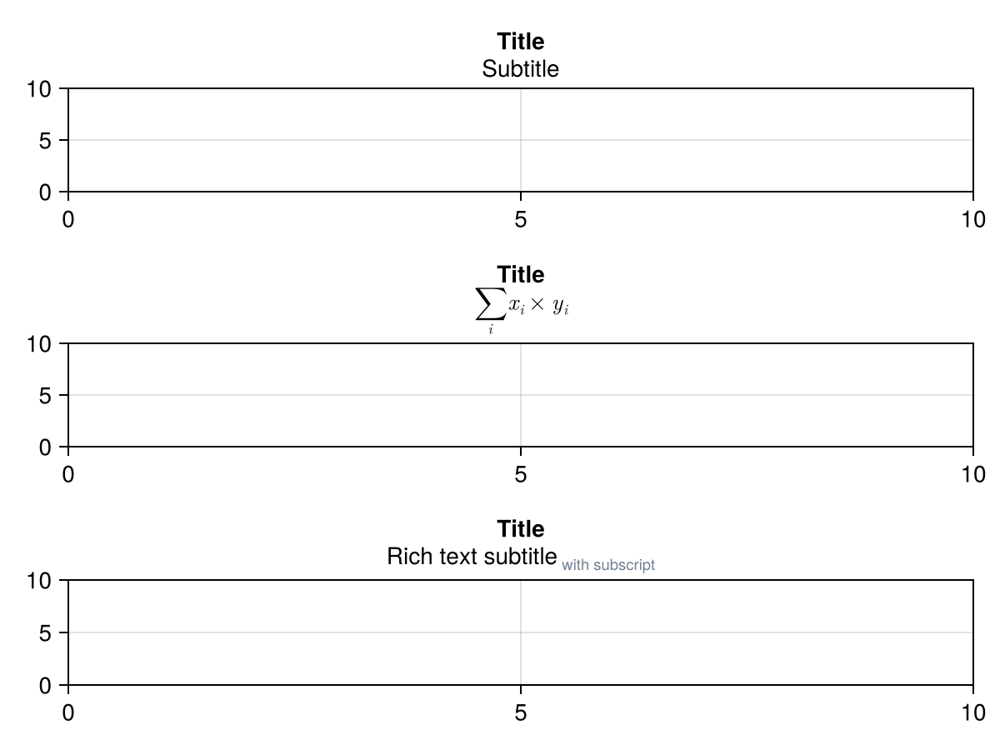


### subtitlecolor {#subtitlecolor}

Defaults to `@inherit :textcolor :black`

The color of the subtitle

### subtitlefont {#subtitlefont}

Defaults to `:regular`

The font family of the subtitle.

### subtitlegap {#subtitlegap}

Defaults to `0`

The gap between subtitle and title.

### subtitlelineheight {#subtitlelineheight}

Defaults to `1`

The axis subtitle line height multiplier.

### subtitlesize {#subtitlesize}

Defaults to `@inherit :fontsize 16.0f0`

The subtitle&#39;s font size.

### subtitlevisible {#subtitlevisible}

Defaults to `true`

Controls if the subtitle is visible.

### tellheight {#tellheight}

Defaults to `true`

Controls if the parent layout can adjust to this element&#39;s height

### tellwidth {#tellwidth}

Defaults to `true`

Controls if the parent layout can adjust to this element&#39;s width

### title {#title}

Defaults to `""`

The content of the axis title. The value can be any non-vector-valued object that the `text` primitive supports.
<a id="example-cac167a" />


```julia
using CairoMakie
f = Figure()

Axis(f[1, 1], title = "Title")
Axis(f[2, 1], title = L"\sum_i{x_i \times y_i}")
Axis(f[3, 1], title = rich(
    "Rich text title",
    subscript(" with subscript", color = :slategray)
))

f
```

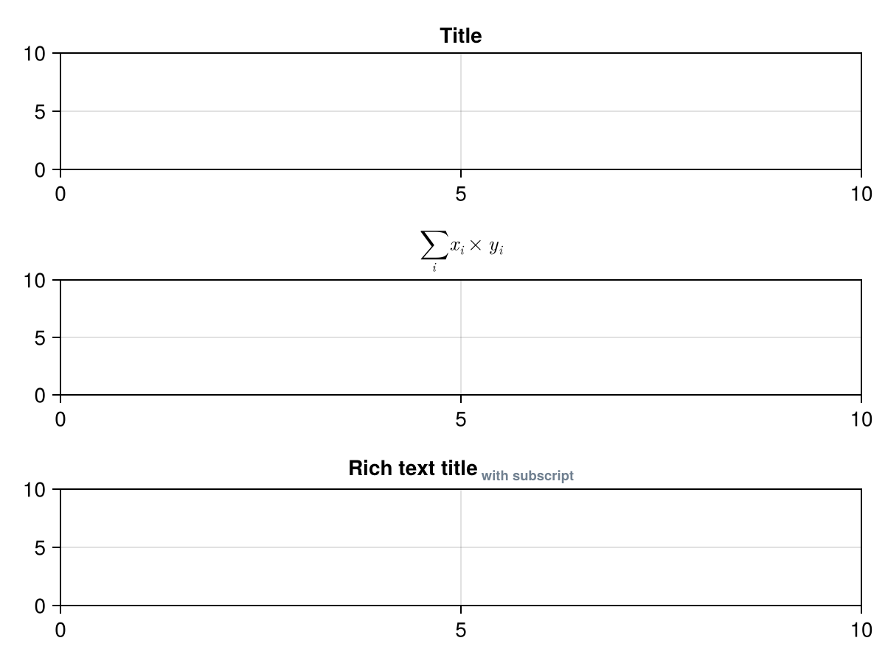


### titlealign {#titlealign}

Defaults to `:center`

The horizontal alignment of the title. The subtitle always follows this alignment setting.

Options are `:center`, `:left` or `:right`.
<a id="example-eb942b1" />


```julia
using CairoMakie
f = Figure()

Axis(f[1, 1], titlealign = :left, title = "Left aligned title")
Axis(f[2, 1], titlealign = :center, title = "Center aligned title")
Axis(f[3, 1], titlealign = :right, title = "Right aligned title")

f
```

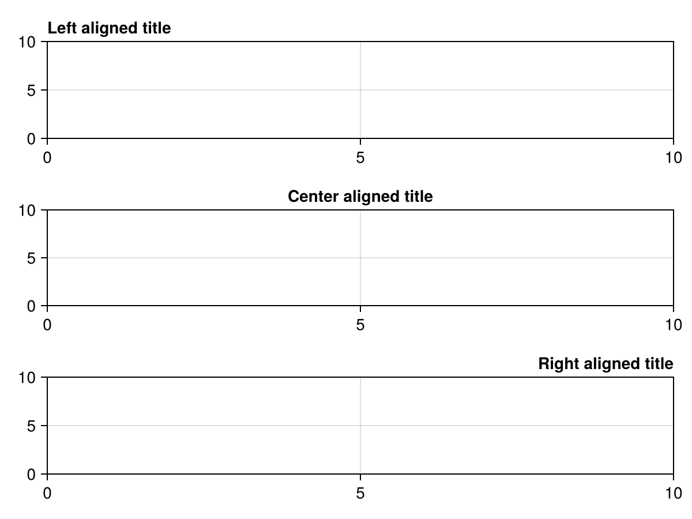


### titlecolor {#titlecolor}

Defaults to `@inherit :textcolor :black`

The color of the title

### titlefont {#titlefont}

Defaults to `:bold`

The font family of the title.

### titlegap {#titlegap}

Defaults to `4.0`

The gap between axis and title.

### titlelineheight {#titlelineheight}

Defaults to `1`

The axis title line height multiplier.

### titlesize {#titlesize}

Defaults to `@inherit :fontsize 16.0f0`

The title&#39;s font size.

### titlevisible {#titlevisible}

Defaults to `true`

Controls if the title is visible.

### topspinecolor {#topspinecolor}

Defaults to `:black`

The color of the top axis spine.

### topspinevisible {#topspinevisible}

Defaults to `true`

Controls if the top axis spine is visible.

### valign {#valign}

Defaults to `:center`

The vertical alignment of the axis within its suggested bounding box.

### width {#width}

Defaults to `nothing`

The width of the axis.

### xautolimitmargin {#xautolimitmargin}

Defaults to `(0.05f0, 0.05f0)`

The relative margins added to the autolimits in x direction.
<a id="example-f7621a8" />


```julia
using CairoMakie
    f = Figure()

    data = 0:1

    ax1 = Axis(f[1, 1], xautolimitmargin = (0, 0), title = "xautolimitmargin = (0, 0)")
    ax2 = Axis(f[2, 1], xautolimitmargin = (0.05, 0.05), title = "xautolimitmargin = (0.05, 0.05)")
    ax3 = Axis(f[3, 1], xautolimitmargin = (0, 0.2), title = "xautolimitmargin = (0, 0.2)")

    for ax in [ax1, ax2, ax3]
        lines!(ax, data)
    end

    f
```

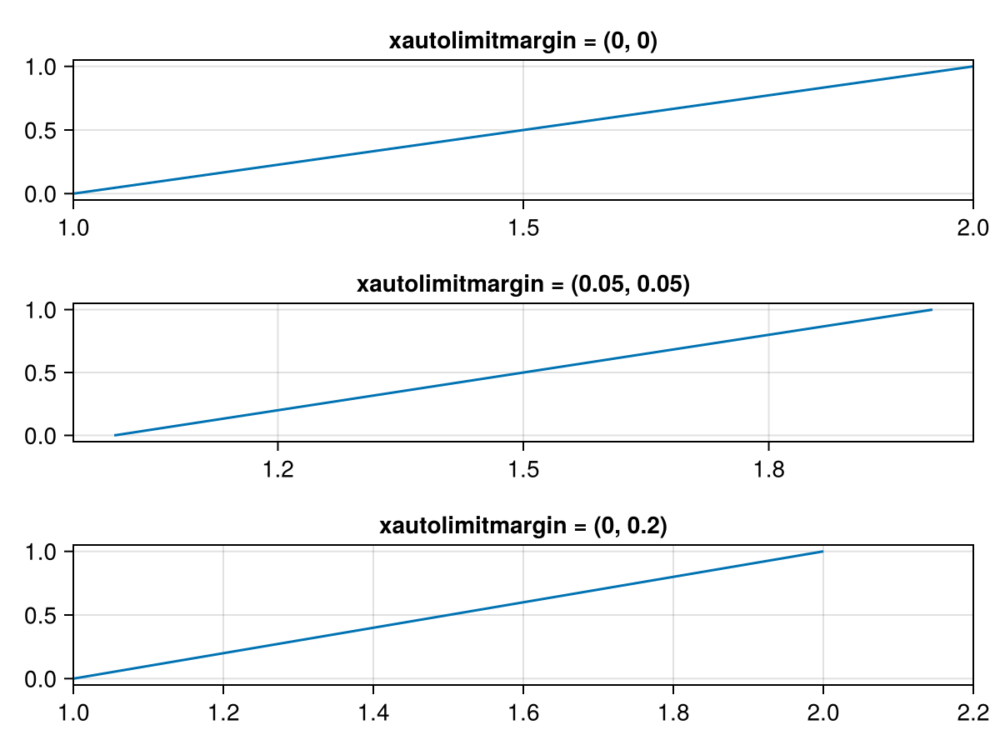


### xaxisposition {#xaxisposition}

Defaults to `:bottom`

The position of the x axis (`:bottom` or `:top`).
<a id="example-4660da6" />


```julia
using CairoMakie
f = Figure()

Axis(f[1, 1], xaxisposition = :bottom)
Axis(f[1, 2], xaxisposition = :top)

f
```

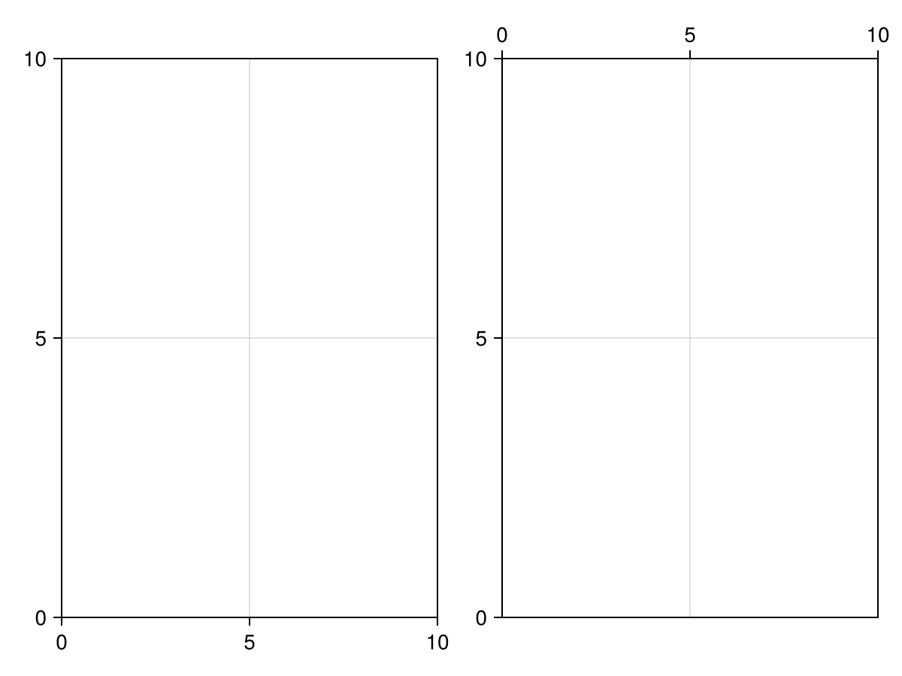


### xgridcolor {#xgridcolor}

Defaults to `RGBAf(0, 0, 0, 0.12)`

The color of the x grid lines.

### xgridstyle {#xgridstyle}

Defaults to `nothing`

The linestyle of the x grid lines.

### xgridvisible {#xgridvisible}

Defaults to `true`

Controls if the x grid lines are visible.

### xgridwidth {#xgridwidth}

Defaults to `1.0`

The width of the x grid lines.

### xlabel {#xlabel}

Defaults to `""`

The content of the x axis label. The value can be any non-vector-valued object that the `text` primitive supports.
<a id="example-b64e3af" />


```julia
using CairoMakie
f = Figure()

Axis(f[1, 1], xlabel = "X Label")
Axis(f[2, 1], xlabel = L"\sum_i{x_i \times y_i}")
Axis(f[3, 1], xlabel = rich(
    "X Label",
    subscript(" with subscript", color = :slategray)
))

f
```

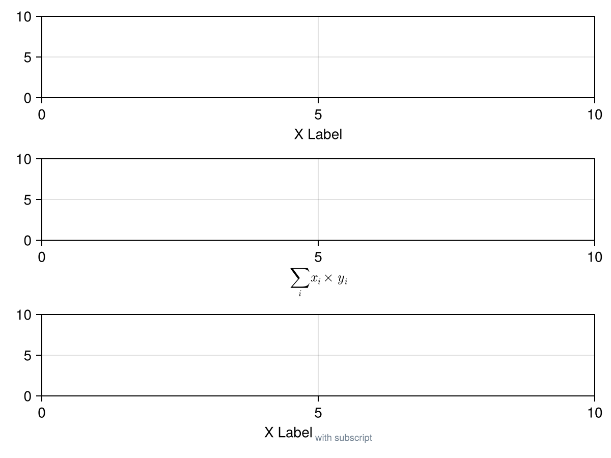


### xlabelcolor {#xlabelcolor}

Defaults to `@inherit :textcolor :black`

The color of the xlabel.

### xlabelfont {#xlabelfont}

Defaults to `:regular`

The font family of the xlabel.

### xlabelpadding {#xlabelpadding}

Defaults to `3.0`

The additional padding between the xlabel and the ticks or axis.
<a id="example-b6d344d" />


```julia
using CairoMakie
    f = Figure()

    Axis(f[1, 1], xlabel = "X Label", xlabelpadding = 0, title = "xlabelpadding = 0")
    Axis(f[1, 2], xlabel = "X Label", xlabelpadding = 5, title = "xlabelpadding = 5")
    Axis(f[1, 3], xlabel = "X Label", xlabelpadding = 10, title = "xlabelpadding = 10")

    f
```

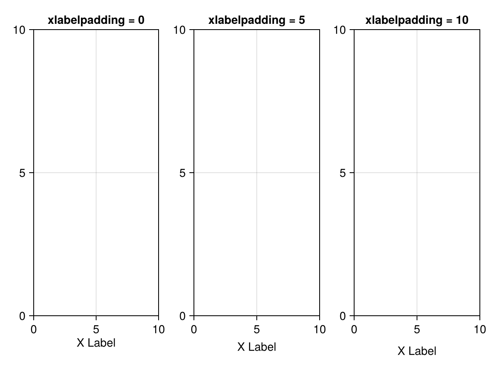


### xlabelrotation {#xlabelrotation}

Defaults to `Makie.automatic`

The xlabel rotation in radians.

### xlabelsize {#xlabelsize}

Defaults to `@inherit :fontsize 16.0f0`

The font size of the xlabel.

### xlabelvisible {#xlabelvisible}

Defaults to `true`

Controls if the xlabel is visible.

### xminorgridcolor {#xminorgridcolor}

Defaults to `RGBAf(0, 0, 0, 0.05)`

The color of the x minor grid lines.

### xminorgridstyle {#xminorgridstyle}

Defaults to `nothing`

The linestyle of the x minor grid lines.

### xminorgridvisible {#xminorgridvisible}

Defaults to `false`

Controls if the x minor grid lines are visible.

### xminorgridwidth {#xminorgridwidth}

Defaults to `1.0`

The width of the x minor grid lines.

### xminortickalign {#xminortickalign}

Defaults to `0.0`

The alignment of x minor ticks on the axis spine

### xminortickcolor {#xminortickcolor}

Defaults to `:black`

The tick color of x minor ticks

### xminorticks {#xminorticks}

Defaults to `IntervalsBetween(2)`

The tick locator for the minor ticks of the x axis.

Common objects that can be used are:
- `IntervalsBetween`, divides the space between two adjacent major ticks into `n` intervals for `n-1` minor ticks
  
- A vector of numbers
  
<a id="example-1bf780d" />


```julia
using CairoMakie
f = Figure()

kwargs = (; xminorticksvisible = true, xminorgridvisible = true)
Axis(f[1, 1]; xminorticks = IntervalsBetween(2), kwargs...)
Axis(f[2, 1]; xminorticks = IntervalsBetween(5), kwargs...)
Axis(f[3, 1]; xminorticks = [1, 2, 3, 4], kwargs...)

f
```

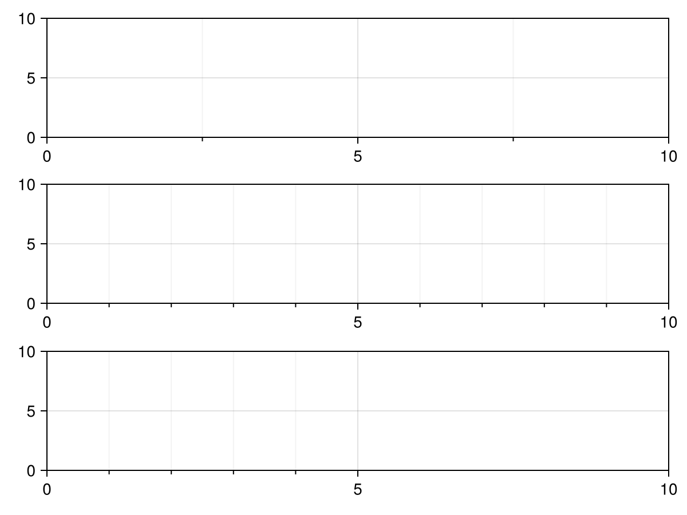


### xminorticksize {#xminorticksize}

Defaults to `3.0`

The tick size of x minor ticks

### xminorticksvisible {#xminorticksvisible}

Defaults to `false`

Controls if minor ticks on the x axis are visible

### xminortickwidth {#xminortickwidth}

Defaults to `1.0`

The tick width of x minor ticks

### xpankey {#xpankey}

Defaults to `Makie.Keyboard.x`

The key for limiting panning to the x direction.

### xpanlock {#xpanlock}

Defaults to `false`

Locks interactive panning in the x direction.

### xrectzoom {#xrectzoom}

Defaults to `true`

Controls if rectangle zooming affects the x dimension.

### xreversed {#xreversed}

Defaults to `false`

Controls if the x axis goes rightwards (false) or leftwards (true)

### xscale {#xscale}

Defaults to `identity`

The scaling function for the x axis.

Can be any invertible function, some predefined options are `identity`, `log`, `log2`, `log10`, `sqrt`, `logit`, `Makie.pseudolog10` and `Makie.Symlog10`. To use a custom function, you have to define appropriate methods for `Makie.inverse_transform`, `Makie.defaultlimits` and `Makie.defined_interval`.

If the scaling function is only defined over a limited interval, no plot object may have a source datum that lies outside of that range. For example, there may be no x value lower than or equal to 0 when `log` is selected for `xscale`. What matters are the source data, not the user-selected limits, because all data have to be transformed, irrespective of whether they lie inside or outside of the current limits.

The axis scale may affect tick finding and formatting, depending on the values of `xticks` and `xtickformat`.
<a id="example-2c8d977" />


```julia
using CairoMakie
f = Figure()

for (i, scale) in enumerate([identity, log10, log2, log, sqrt, Makie.logit])
    row, col = fldmod1(i, 2)
    Axis(f[row, col], xscale = scale, title = string(scale),
        xminorticksvisible = true, xminorgridvisible = true,
        xminorticks = IntervalsBetween(5))

    lines!(range(0.01, 0.99, length = 200), 1:200)
end

f
```

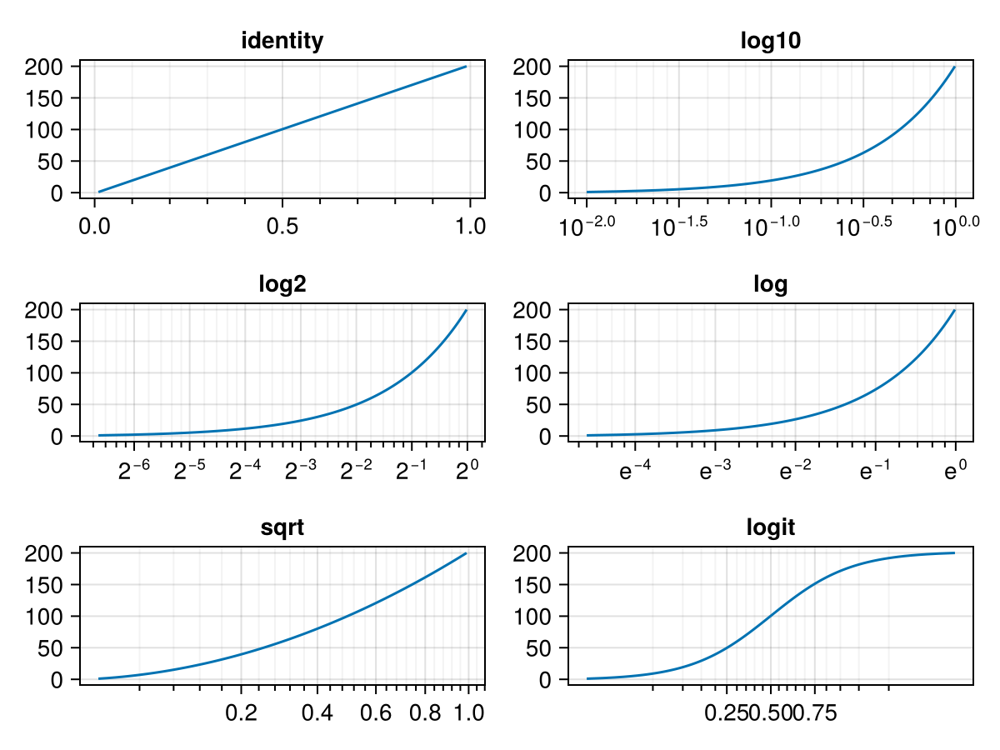

<a id="example-7771d4a" />


```julia
using CairoMakie
f = Figure()

ax1 = Axis(f[1, 1],
    xscale = Makie.pseudolog10,
    title = "Pseudolog scale",
    xticks = [-100, -10, -1, 0, 1, 10, 100]
)

ax2 = Axis(f[1, 2],
    xscale = Makie.Symlog10(10.0),
    title = "Symlog10 with linear scaling
between -10 and 10",
    xticks = [-100, -10, 0, 10, 100]
)

for ax in [ax1, ax2]
    lines!(ax, -100:0.1:100, -100:0.1:100)
end

f
```

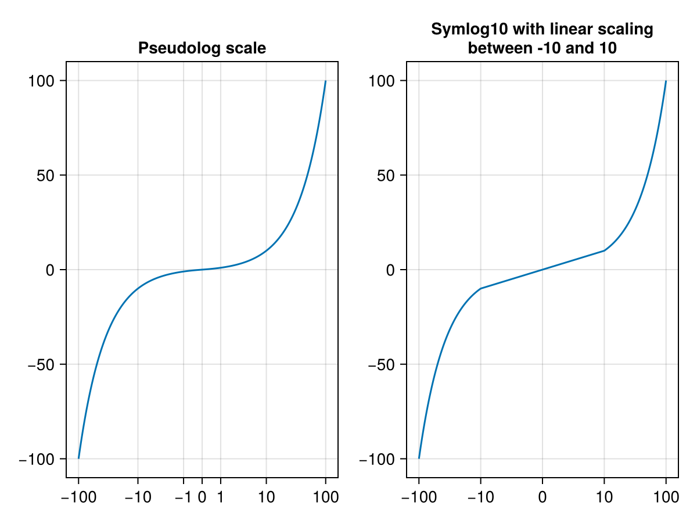


### xtickalign {#xtickalign}

Defaults to `0.0`

The alignment of the xtick marks relative to the axis spine (0 = out, 1 = in).

### xtickcolor {#xtickcolor}

Defaults to `RGBf(0, 0, 0)`

The color of the xtick marks.

### xtickformat {#xtickformat}

Defaults to `Makie.automatic`

The formatter for the ticks on the x axis.

Usually, the tick values are determined first using `Makie.get_tickvalues`, after which `Makie.get_ticklabels(xtickformat, xtickvalues)` is called. If there is a special method defined, tick values and labels can be determined together using `Makie.get_ticks` instead. Check the docstring for `xticks` for more information.

Common objects that can be used for tick formatting are:
- A `Function` that takes a vector of numbers and returns a vector of labels. A label can be anything that can be plotted by the `text` primitive.
  
- A `String` which is used as a format specifier for `Format.jl`. For example, `"{:.2f}kg"` formats numbers rounded to 2 decimal digits and with the suffix `kg`.
  
<a id="example-9fa4717" />


```julia
using CairoMakie
f = Figure(figure_padding = 50)

Axis(f[1, 1], xtickformat = values -> ["$(value)kg" for value in values])
Axis(f[2, 1], xtickformat = "{:.2f}ms")
Axis(f[3, 1], xtickformat = values -> [L"\sqrt{%$(value^2)}" for value in values])
Axis(f[4, 1], xtickformat = values -> [rich("$value", superscript("XY", color = :red))
                                       for value in values])

f
```

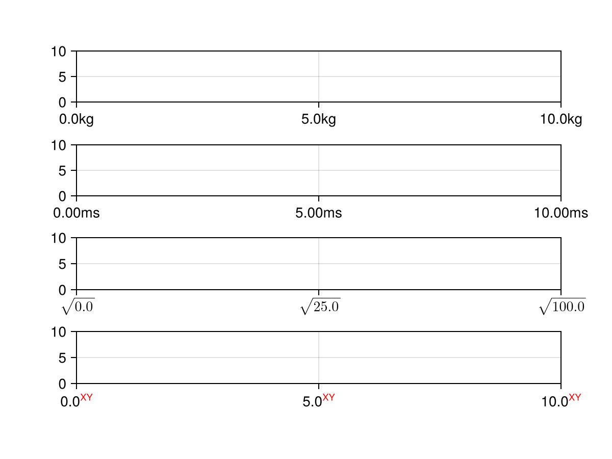


### xticklabelalign {#xticklabelalign}

Defaults to `Makie.automatic`

The horizontal and vertical alignment of the xticklabels.

### xticklabelcolor {#xticklabelcolor}

Defaults to `@inherit :textcolor :black`

The color of xticklabels.

### xticklabelfont {#xticklabelfont}

Defaults to `:regular`

The font family of the xticklabels.

### xticklabelpad {#xticklabelpad}

Defaults to `2.0`

The space between xticks and xticklabels.
<a id="example-629249e" />


```julia
using CairoMakie
    f = Figure()

    Axis(f[1, 1], xticklabelpad = 0, title = "xticklabelpad = 0")
    Axis(f[1, 2], xticklabelpad = 5, title = "xticklabelpad = 5")
    Axis(f[1, 3], xticklabelpad = 15, title = "xticklabelpad = 15")

    f
```

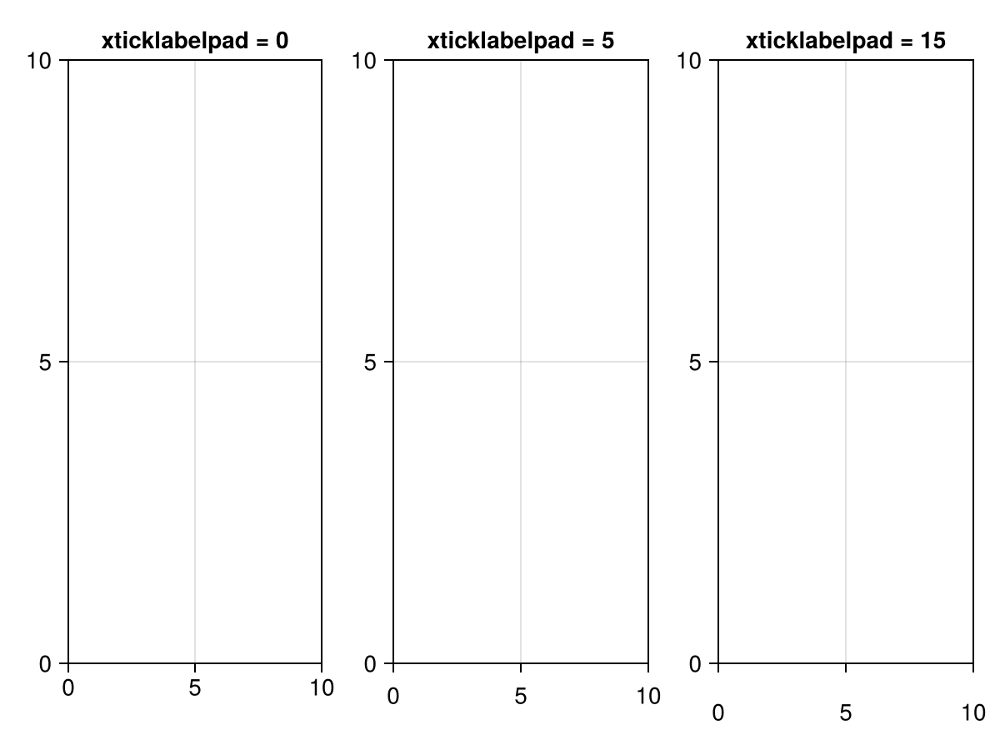


### xticklabelrotation {#xticklabelrotation}

Defaults to `0.0`

The counterclockwise rotation of the xticklabels in radians.

### xticklabelsize {#xticklabelsize}

Defaults to `@inherit :fontsize 16.0f0`

The font size of the xticklabels.

### xticklabelspace {#xticklabelspace}

Defaults to `Makie.automatic`

The space reserved for the xticklabels. Can be set to `Makie.automatic` to automatically determine the space needed, `:max_auto` to only ever grow to fit the current ticklabels, or a specific value.
<a id="example-f314e13" />


```julia
using CairoMakie
    f = Figure()

    Axis(f[1, 1], xlabel = "X Label", xticklabelspace = 0.0, title = "xticklabelspace = 0.0")
    Axis(f[1, 2], xlabel = "X Label", xticklabelspace = 30.0, title = "xticklabelspace = 30.0")
    Axis(f[1, 3], xlabel = "X Label", xticklabelspace = Makie.automatic, title = "xticklabelspace = automatic")

    f
```

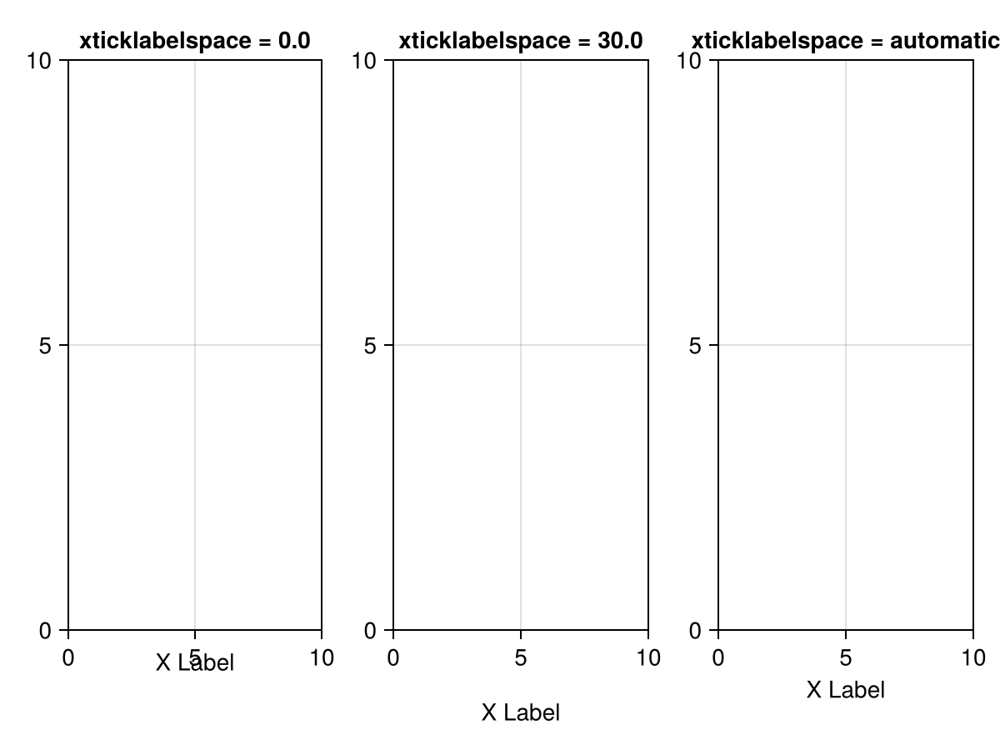


### xticklabelsvisible {#xticklabelsvisible}

Defaults to `true`

Controls if the xticklabels are visible.

### xticks {#xticks}

Defaults to `Makie.automatic`

Controls what numerical tick values are calculated for the x axis.

To determine tick values and labels, Makie first calls `Makie.get_ticks(xticks, xscale, xtickformat, xmin, xmax)`. If there is no special method defined for the current combination of ticks, scale and formatter which returns both tick values and labels at once, then the numerical tick values will be determined using `xtickvalues = Makie.get_tickvalues(xticks, xscale, xmin, xmax)` after which the labels are determined using `Makie.get_ticklabels(xtickformat, xtickvalues)`.

Common objects that can be used as ticks are:
- A vector of numbers
  
- A tuple with two vectors `(numbers, labels)` where `labels` can be any objects that `text` can handle.
  
- `WilkinsonTicks`, the default tick finder for linear ticks
  
- `LinearTicks`, an alternative tick finder for linear ticks
  
- `LogTicks`, a wrapper that applies any other wrapped tick finder on log-transformed values
  
- `MultiplesTicks`, for finding ticks at multiples of a given value, such as `π`
  
<a id="example-4b01329" />


```julia
using CairoMakie
fig = Figure()
Axis(fig[1, 1], xticks = 1:10)
Axis(fig[2, 1], xticks = (1:2:9, ["A", "B", "C", "D", "E"]))
Axis(fig[3, 1], xticks = WilkinsonTicks(5))
fig
```

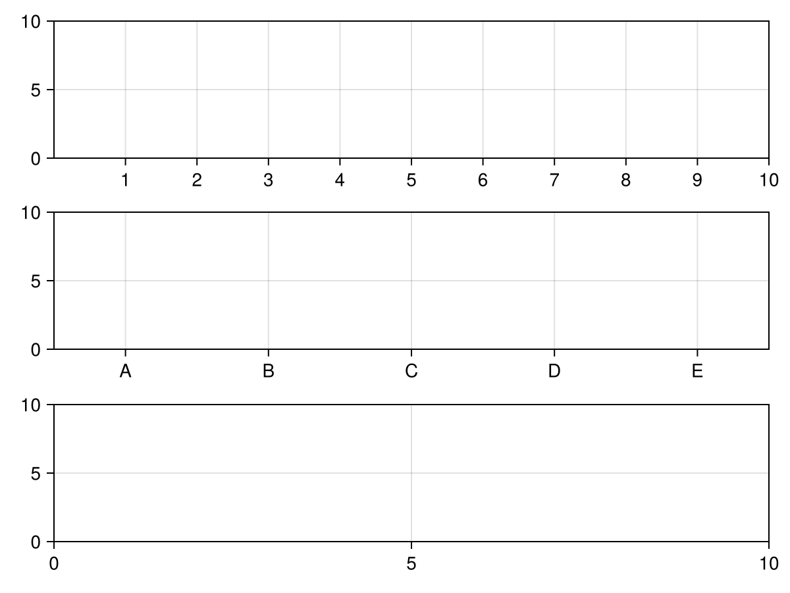


### xticksize {#xticksize}

Defaults to `5.0`

The size of the xtick marks.

### xticksmirrored {#xticksmirrored}

Defaults to `false`

Controls if the x ticks and minor ticks are mirrored on the other side of the Axis.
<a id="example-b85d9ff" />


```julia
using CairoMakie
f = Figure()

Axis(f[1, 1], xticksmirrored = false, xminorticksvisible = true)
Axis(f[1, 2], xticksmirrored = true, xminorticksvisible = true)

f
```

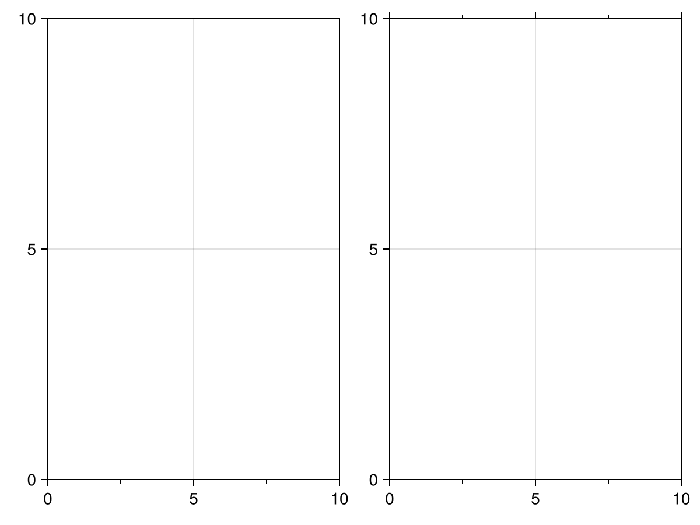


### xticksvisible {#xticksvisible}

Defaults to `true`

Controls if the xtick marks are visible.

### xtickwidth {#xtickwidth}

Defaults to `1.0`

The width of the xtick marks.

### xtrimspine {#xtrimspine}

Defaults to `false`

If `true`, limits the x axis spine&#39;s extent to the outermost major tick marks. Can also be set to a `Tuple{Bool,Bool}` to control each side separately.
<a id="example-9cca375" />


```julia
using CairoMakie
f = Figure()

ax1 = Axis(f[1, 1], xtrimspine = false)
ax2 = Axis(f[2, 1], xtrimspine = true)
ax3 = Axis(f[3, 1], xtrimspine = (true, false))
ax4 = Axis(f[4, 1], xtrimspine = (false, true))

for ax in [ax1, ax2, ax3, ax4]
    ax.xgridvisible = false
    ax.ygridvisible = false
    ax.rightspinevisible = false
    ax.topspinevisible = false
    xlims!(ax, 0.5, 5.5)
end

f
```

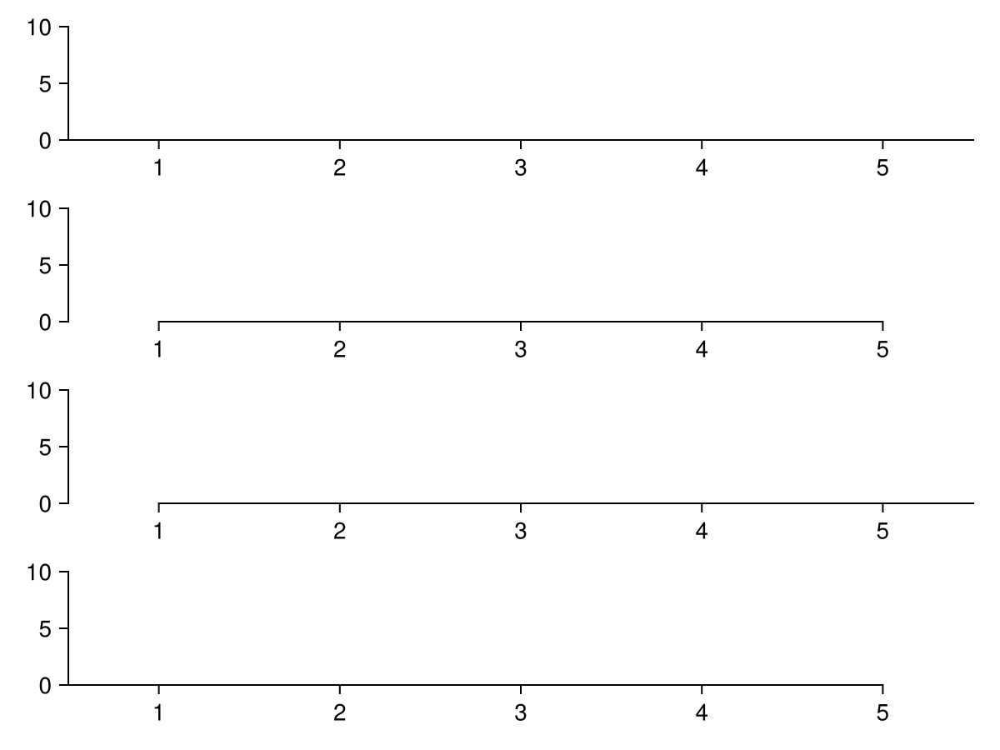


### xzoomkey {#xzoomkey}

Defaults to `Makie.Keyboard.x`

The key for limiting zooming to the x direction.

### xzoomlock {#xzoomlock}

Defaults to `false`

Locks interactive zooming in the x direction.

### yautolimitmargin {#yautolimitmargin}

Defaults to `(0.05f0, 0.05f0)`

The relative margins added to the autolimits in y direction.
<a id="example-b8a10ce" />


```julia
using CairoMakie
    f = Figure()

    data = 0:1

    ax1 = Axis(f[1, 1], yautolimitmargin = (0, 0), title = "yautolimitmargin = (0, 0)")
    ax2 = Axis(f[1, 2], yautolimitmargin = (0.05, 0.05), title = "yautolimitmargin = (0.05, 0.05)")
    ax3 = Axis(f[1, 3], yautolimitmargin = (0, 0.2), title = "yautolimitmargin = (0, 0.2)")

    for ax in [ax1, ax2, ax3]
        lines!(ax, data)
    end

    f
```

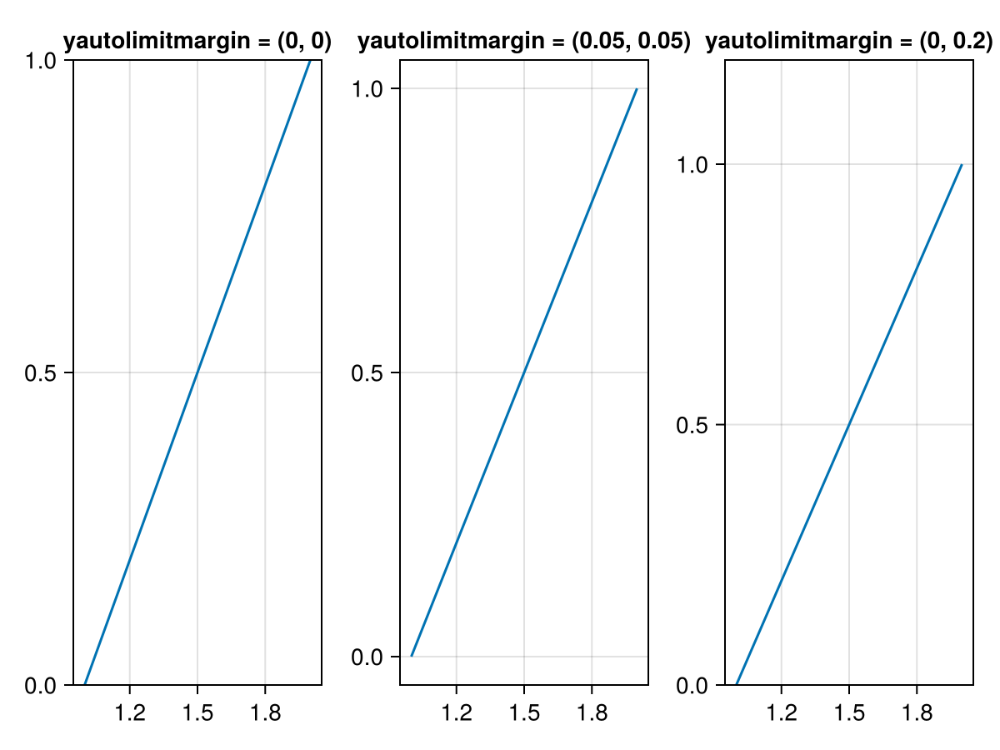


### yaxisposition {#yaxisposition}

Defaults to `:left`

The position of the y axis (`:left` or `:right`).
<a id="example-eec9d77" />


```julia
using CairoMakie
f = Figure()

Axis(f[1, 1], yaxisposition = :left)
Axis(f[2, 1], yaxisposition = :right)

f
```

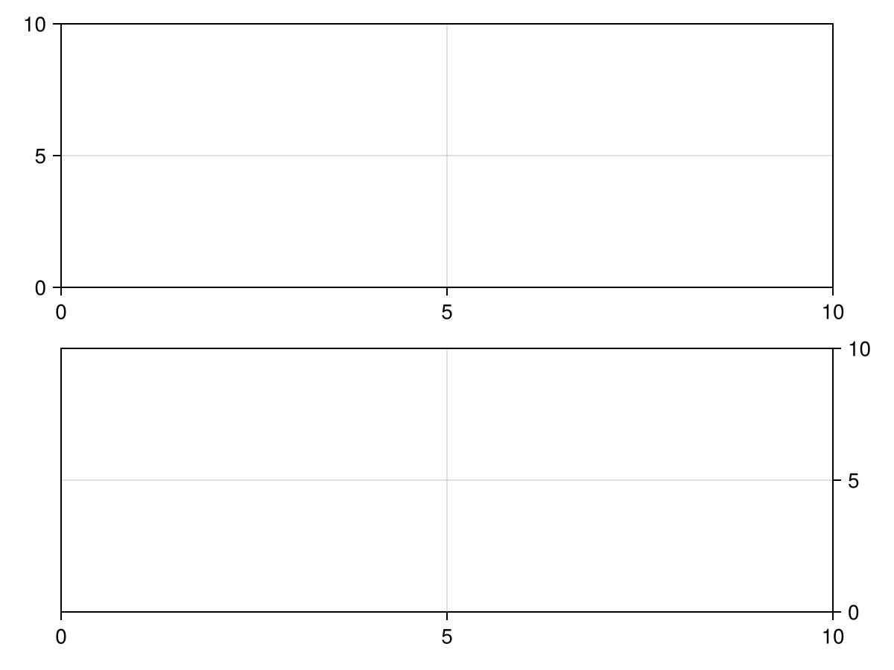


### ygridcolor {#ygridcolor}

Defaults to `RGBAf(0, 0, 0, 0.12)`

The color of the y grid lines.

### ygridstyle {#ygridstyle}

Defaults to `nothing`

The linestyle of the y grid lines.

### ygridvisible {#ygridvisible}

Defaults to `true`

Controls if the y grid lines are visible.

### ygridwidth {#ygridwidth}

Defaults to `1.0`

The width of the y grid lines.

### ylabel {#ylabel}

Defaults to `""`

The content of the y axis label. The value can be any non-vector-valued object that the `text` primitive supports.
<a id="example-cff0e30" />


```julia
using CairoMakie
f = Figure()

Axis(f[1, 1], ylabel = "Y Label")
Axis(f[2, 1], ylabel = L"\sum_i{x_i \times y_i}")
Axis(f[3, 1], ylabel = rich(
    "Y Label",
    subscript(" with subscript", color = :slategray)
))

f
```

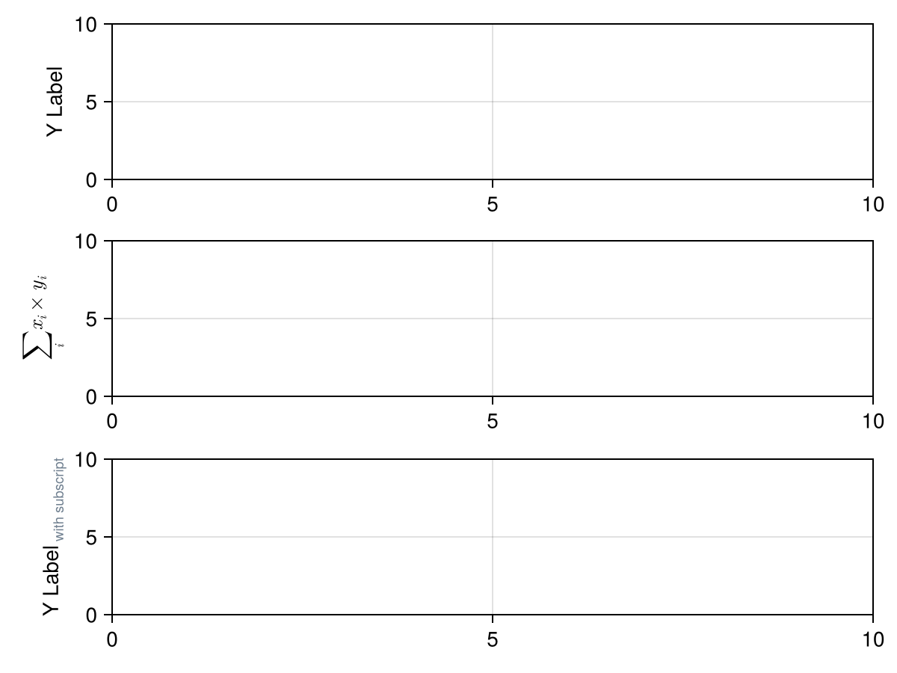


### ylabelcolor {#ylabelcolor}

Defaults to `@inherit :textcolor :black`

The color of the ylabel.

### ylabelfont {#ylabelfont}

Defaults to `:regular`

The font family of the ylabel.

### ylabelpadding {#ylabelpadding}

Defaults to `5.0`

The additional padding between the ylabel and the ticks or axis.
<a id="example-4daf287" />


```julia
using CairoMakie
    f = Figure()

    Axis(f[1, 1], ylabel = "Y Label", ylabelpadding = 0, title = "ylabelpadding = 0")
    Axis(f[2, 1], ylabel = "Y Label", ylabelpadding = 5, title = "ylabelpadding = 5")
    Axis(f[3, 1], ylabel = "Y Label", ylabelpadding = 10, title = "ylabelpadding = 10")

    f
```

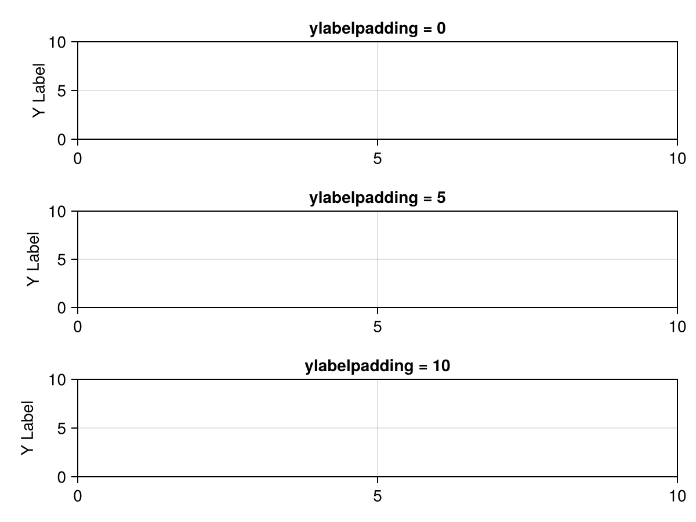


### ylabelrotation {#ylabelrotation}

Defaults to `Makie.automatic`

The ylabel rotation in radians.

### ylabelsize {#ylabelsize}

Defaults to `@inherit :fontsize 16.0f0`

The font size of the ylabel.

### ylabelvisible {#ylabelvisible}

Defaults to `true`

Controls if the ylabel is visible.

### yminorgridcolor {#yminorgridcolor}

Defaults to `RGBAf(0, 0, 0, 0.05)`

The color of the y minor grid lines.

### yminorgridstyle {#yminorgridstyle}

Defaults to `nothing`

The linestyle of the y minor grid lines.

### yminorgridvisible {#yminorgridvisible}

Defaults to `false`

Controls if the y minor grid lines are visible.

### yminorgridwidth {#yminorgridwidth}

Defaults to `1.0`

The width of the y minor grid lines.

### yminortickalign {#yminortickalign}

Defaults to `0.0`

The alignment of y minor ticks on the axis spine

### yminortickcolor {#yminortickcolor}

Defaults to `:black`

The tick color of y minor ticks

### yminorticks {#yminorticks}

Defaults to `IntervalsBetween(2)`

The tick locator for the minor ticks of the y axis.

Common objects that can be used are:
- `IntervalsBetween`, divides the space between two adjacent major ticks into `n` intervals for `n-1` minor ticks
  
- A vector of numbers
  
<a id="example-24e88fd" />


```julia
using CairoMakie
f = Figure()

kwargs = (; yminorticksvisible = true, yminorgridvisible = true)
Axis(f[1, 1]; yminorticks = IntervalsBetween(2), kwargs...)
Axis(f[1, 2]; yminorticks = IntervalsBetween(5), kwargs...)
Axis(f[1, 3]; yminorticks = [1, 2, 3, 4], kwargs...)

f
```

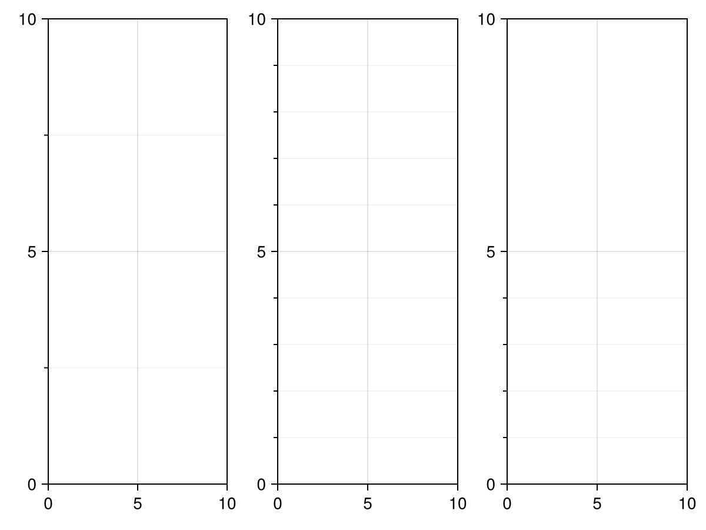


### yminorticksize {#yminorticksize}

Defaults to `3.0`

The tick size of y minor ticks

### yminorticksvisible {#yminorticksvisible}

Defaults to `false`

Controls if minor ticks on the y axis are visible

### yminortickwidth {#yminortickwidth}

Defaults to `1.0`

The tick width of y minor ticks

### ypankey {#ypankey}

Defaults to `Makie.Keyboard.y`

The key for limiting panning to the y direction.

### ypanlock {#ypanlock}

Defaults to `false`

Locks interactive panning in the y direction.

### yrectzoom {#yrectzoom}

Defaults to `true`

Controls if rectangle zooming affects the y dimension.

### yreversed {#yreversed}

Defaults to `false`

Controls if the y axis goes upwards (false) or downwards (true)

### yscale {#yscale}

Defaults to `identity`

The scaling function for the y axis.

Can be any invertible function, some predefined options are `identity`, `log`, `log2`, `log10`, `sqrt`, `logit`, `Makie.pseudolog10` and `Makie.Symlog10`. To use a custom function, you have to define appropriate methods for `Makie.inverse_transform`, `Makie.defaultlimits` and `Makie.defined_interval`.

If the scaling function is only defined over a limited interval, no plot object may have a source datum that lies outside of that range. For example, there may be no y value lower than or equal to 0 when `log` is selected for `yscale`. What matters are the source data, not the user-selected limits, because all data have to be transformed, irrespective of whether they lie inside or outside of the current limits.

The axis scale may affect tick finding and formatting, depending on the values of `yticks` and `ytickformat`.
<a id="example-b2f8192" />


```julia
using CairoMakie
f = Figure()

for (i, scale) in enumerate([identity, log10, log2, log, sqrt, Makie.logit])
    row, col = fldmod1(i, 3)
    Axis(f[row, col], yscale = scale, title = string(scale),
        yminorticksvisible = true, yminorgridvisible = true,
        yminorticks = IntervalsBetween(5))

    lines!(range(0.01, 0.99, length = 200))
end

f
```

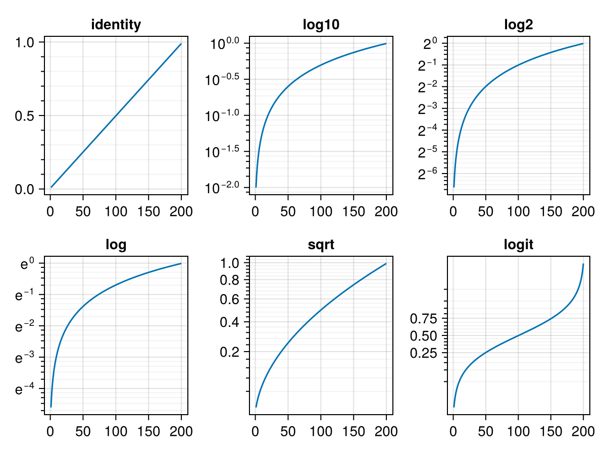

<a id="example-7a66135" />


```julia
using CairoMakie
f = Figure()

ax1 = Axis(f[1, 1],
    yscale = Makie.pseudolog10,
    title = "Pseudolog scale",
    yticks = [-100, -10, -1, 0, 1, 10, 100]
)

ax2 = Axis(f[2, 1],
    yscale = Makie.Symlog10(10.0),
    title = "Symlog10 with linear scaling between -10 and 10",
    yticks = [-100, -10, 0, 10, 100]
)

for ax in [ax1, ax2]
    lines!(ax, -100:0.1:100)
end

f
```

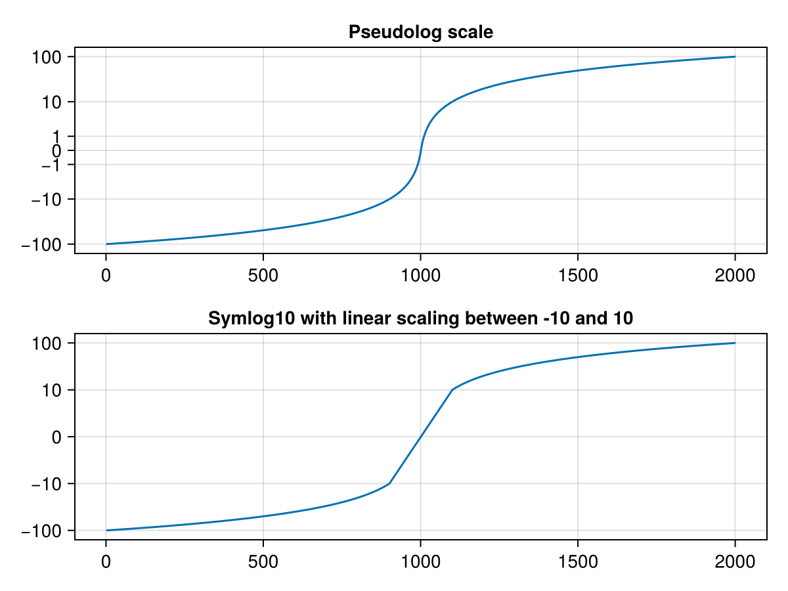


### ytickalign {#ytickalign}

Defaults to `0.0`

The alignment of the ytick marks relative to the axis spine (0 = out, 1 = in).

### ytickcolor {#ytickcolor}

Defaults to `RGBf(0, 0, 0)`

The color of the ytick marks.

### ytickformat {#ytickformat}

Defaults to `Makie.automatic`

The formatter for the ticks on the y axis.

Usually, the tick values are determined first using `Makie.get_tickvalues`, after which `Makie.get_ticklabels(ytickformat, ytickvalues)` is called. If there is a special method defined, tick values and labels can be determined together using `Makie.get_ticks` instead. Check the docstring for `yticks` for more information.

Common objects that can be used for tick formatting are:
- A `Function` that takes a vector of numbers and returns a vector of labels. A label can be anything that can be plotted by the `text` primitive.
  
- A `String` which is used as a format specifier for `Format.jl`. For example, `"{:.2f}kg"` formats numbers rounded to 2 decimal digits and with the suffix `kg`.
  
<a id="example-9390b82" />


```julia
using CairoMakie
f = Figure()

Axis(f[1, 1], ytickformat = values -> ["$(value)kg" for value in values])
Axis(f[1, 2], ytickformat = "{:.2f}ms")
Axis(f[1, 3], ytickformat = values -> [L"\sqrt{%$(value^2)}" for value in values])
Axis(f[1, 4], ytickformat = values -> [rich("$value", superscript("XY", color = :red))
                                       for value in values])

f
```

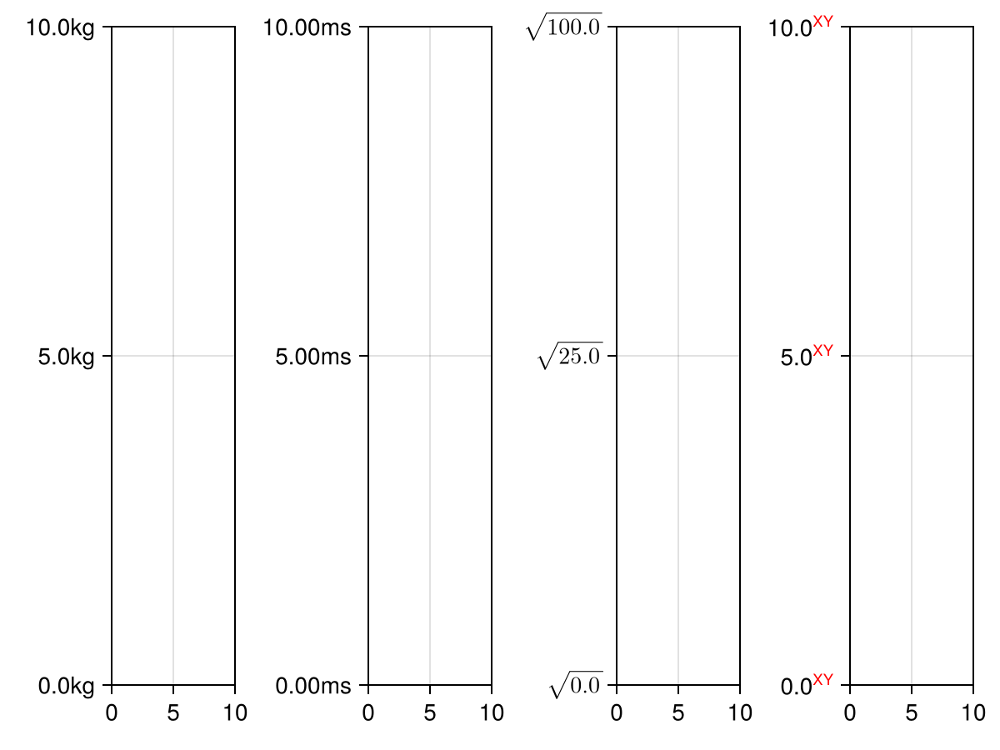


### yticklabelalign {#yticklabelalign}

Defaults to `Makie.automatic`

The horizontal and vertical alignment of the yticklabels.

### yticklabelcolor {#yticklabelcolor}

Defaults to `@inherit :textcolor :black`

The color of yticklabels.

### yticklabelfont {#yticklabelfont}

Defaults to `:regular`

The font family of the yticklabels.

### yticklabelpad {#yticklabelpad}

Defaults to `4.0`

The space between yticks and yticklabels.
<a id="example-6df6799" />


```julia
using CairoMakie
    f = Figure()

    Axis(f[1, 1], yticklabelpad = 0, title = "yticklabelpad = 0")
    Axis(f[2, 1], yticklabelpad = 5, title = "yticklabelpad = 5")
    Axis(f[3, 1], yticklabelpad = 15, title = "yticklabelpad = 15")

    f
```

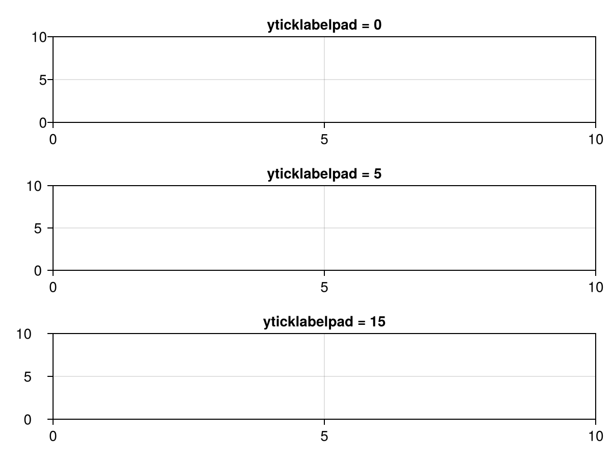


### yticklabelrotation {#yticklabelrotation}

Defaults to `0.0`

The counterclockwise rotation of the yticklabels in radians.

### yticklabelsize {#yticklabelsize}

Defaults to `@inherit :fontsize 16.0f0`

The font size of the yticklabels.

### yticklabelspace {#yticklabelspace}

Defaults to `Makie.automatic`

The space reserved for the yticklabels. Can be set to `Makie.automatic` to automatically determine the space needed, `:max_auto` to only ever grow to fit the current ticklabels, or a specific value.
<a id="example-30778f0" />


```julia
using CairoMakie
    f = Figure()

    Axis(f[1, 1], ylabel = "Y Label", yticklabelspace = 0.0, title = "yticklabelspace = 0.0")
    Axis(f[2, 1], ylabel = "Y Label", yticklabelspace = 30.0, title = "yticklabelspace = 30.0")
    Axis(f[3, 1], ylabel = "Y Label", yticklabelspace = Makie.automatic, title = "yticklabelspace = automatic")

    f
```

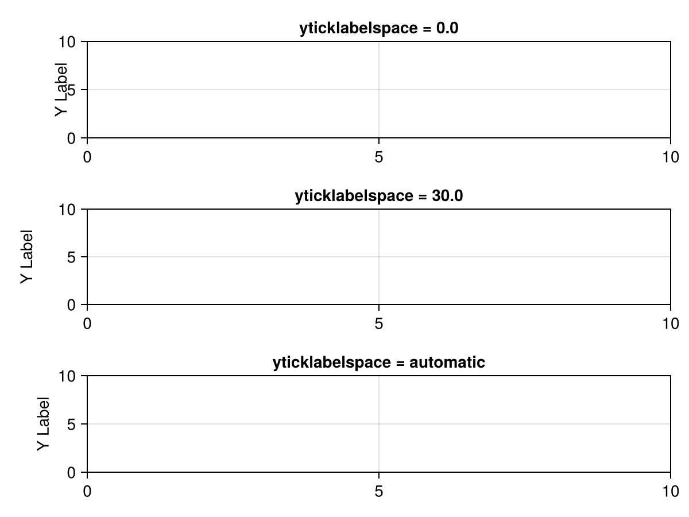


### yticklabelsvisible {#yticklabelsvisible}

Defaults to `true`

Controls if the yticklabels are visible.

### yticks {#yticks}

Defaults to `Makie.automatic`

Controls what numerical tick values are calculated for the y axis.

To determine tick values and labels, Makie first calls `Makie.get_ticks(yticks, yscale, ytickformat, ymin, ymax)`. If there is no special method defined for the current combination of ticks, scale and formatter which returns both tick values and labels at once, then the numerical tick values will be determined using `ytickvalues = Makie.get_tickvalues(yticks, yscale, ymin, ymax)` after which the labels are determined using `Makie.get_ticklabels(ytickformat, ytickvalues)`.

Common objects that can be used as ticks are:
- A vector of numbers
  
- A tuple with two vectors `(numbers, labels)` where `labels` can be any objects that `text` can handle.
  
- `WilkinsonTicks`, the default tick finder for linear ticks
  
- `LinearTicks`, an alternative tick finder for linear ticks
  
- `LogTicks`, a wrapper that applies any other wrapped tick finder on log-transformed values
  
- `MultiplesTicks`, for finding ticks at multiples of a given value, such as `π`
  
<a id="example-9cc35e4" />


```julia
using CairoMakie
fig = Figure()
Axis(fig[1, 1], yticks = 1:10)
Axis(fig[1, 2], yticks = (1:2:9, ["A", "B", "C", "D", "E"]))
Axis(fig[1, 3], yticks = WilkinsonTicks(5))
fig
```

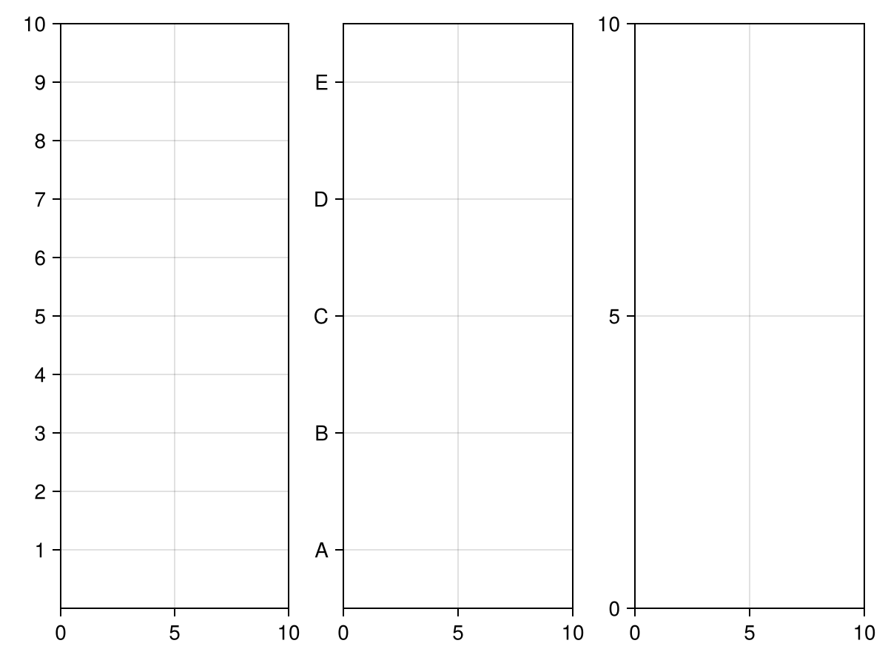


### yticksize {#yticksize}

Defaults to `5.0`

The size of the ytick marks.

### yticksmirrored {#yticksmirrored}

Defaults to `false`

Controls if the y ticks and minor ticks are mirrored on the other side of the Axis.
<a id="example-69d79b5" />


```julia
using CairoMakie
f = Figure()

Axis(f[1, 1], yticksmirrored = false, yminorticksvisible = true)
Axis(f[2, 1], yticksmirrored = true, yminorticksvisible = true)

f
```

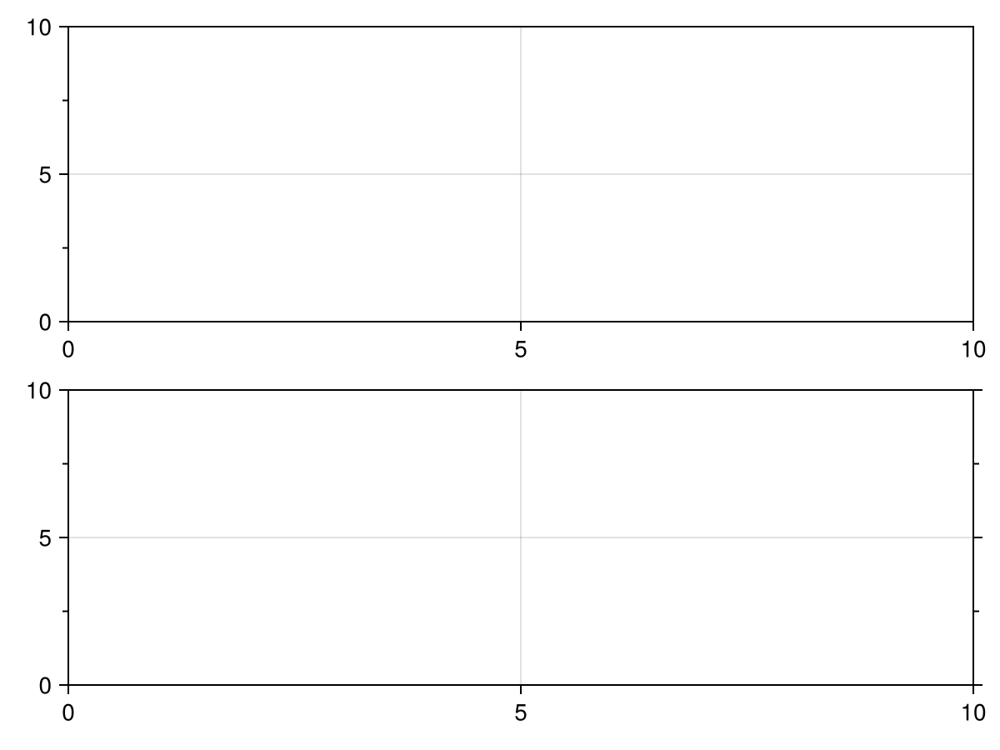


### yticksvisible {#yticksvisible}

Defaults to `true`

Controls if the ytick marks are visible.

### ytickwidth {#ytickwidth}

Defaults to `1.0`

The width of the ytick marks.

### ytrimspine {#ytrimspine}

Defaults to `false`

If `true`, limits the y axis spine&#39;s extent to the outermost major tick marks. Can also be set to a `Tuple{Bool,Bool}` to control each side separately.
<a id="example-7dfc3d7" />


```julia
using CairoMakie
f = Figure()

ax1 = Axis(f[1, 1], ytrimspine = false)
ax2 = Axis(f[1, 2], ytrimspine = true)
ax3 = Axis(f[1, 3], ytrimspine = (true, false))
ax4 = Axis(f[1, 4], ytrimspine = (false, true))

for ax in [ax1, ax2, ax3, ax4]
    ax.xgridvisible = false
    ax.ygridvisible = false
    ax.rightspinevisible = false
    ax.topspinevisible = false
    ylims!(ax, 0.5, 5.5)
end

f
```

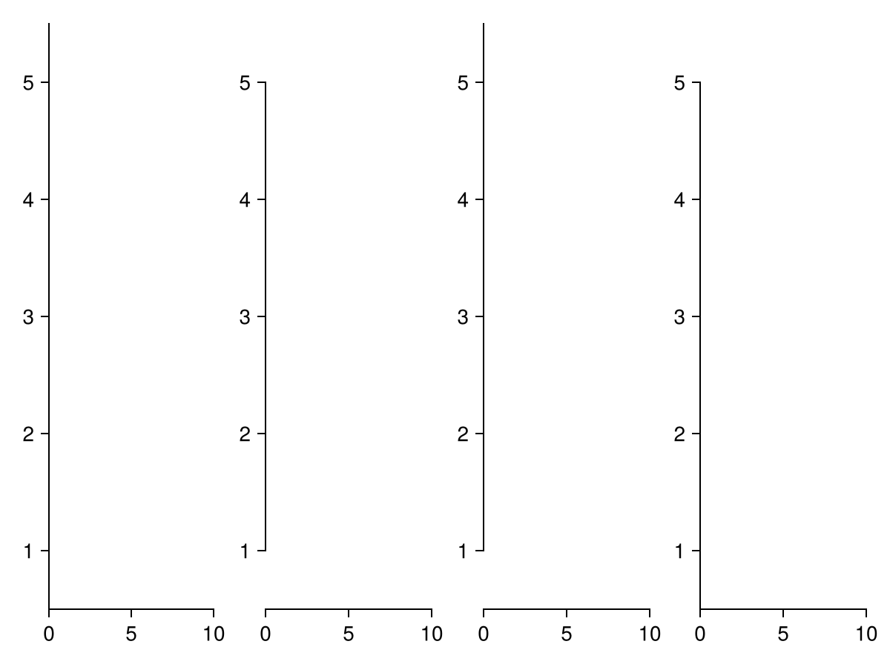


### yzoomkey {#yzoomkey}

Defaults to `Makie.Keyboard.y`

The key for limiting zooming to the y direction.

### yzoomlock {#yzoomlock}

Defaults to `false`

Locks interactive zooming in the y direction.

### zoombutton {#zoombutton}

Defaults to `true`

Button that needs to be pressed to allow scroll zooming.
