# Axis3 {#Axis3}

## Axis3 interactions {#Axis3-interactions}

Like Axis, Axis3 has a few predefined interactions enabled.

### Rotation {#Rotation}

You can rotate the view by left-clicking and dragging. This interaction is registered as `:dragrotate` and uses the `DragRotate` type.

### Zoom {#Zoom}

You can zoom in an axis by scrolling in and out. By default, the zoom is focused on the center of the Axis. You can set `zoommode = :cursor` to focus the zoom on the cursor instead. If you press `x`, `y` or `z` while scrolling, the zoom is restricted to that dimension. If you press two keys simultaneously, the zoom will be restricted to the corresponding plane instead. These keys can be changed with the attributes `xzoomkey`, `yzoomkey` and `zzoomkey`. You can also restrict the zoom dimensions all the time by setting the axis attributes `xzoomlock`, `yzoomlock` or `zzoomlock` to `true`.

With `viewmode = :free` the behavior of the zoom changes. Instead of affecting just the content of the axis, zooming affects the axis as a whole. It also disables `zoommode = :cursor`. This interaction is registered as `:scrollzoom` and uses the `ScrollZoom` type.

### Translation {#Translation}

You can translate the view of the Axis3 by right-clicking and dragging. If you press `x`, `y` or `z` while translating, the translation is restricted to that dimension. If you press two keys simultaneously, the translation will be restricted to the corresponding plane instead. These keys can be changed with the attributes `xtranslationkey`, `ytranslationkey` and `ztranslationkey`. You can also restrict the translation all the time by setting the axis attributes `xtranslationlock`, `ytranslationlock` or `ztranslationlock` to `true`.

With `viewmode = :free` another option for translation is added. By pressing `control` while right-click dragging, the translation will affect the placement of the axis in the window instead of the content within the axis. This interaction is registered as `:translation` and uses the `DragPan` type.

### Limit reset {#Limit-reset}

You can reset the limits, i.e. zoom and translation with `ctrl + left click`. This is the same as calling `reset_limits!(ax)`. It sets the limits back to the values stored in `ax.limits`. If they are `nothing` this computes automatic limits. If you have previously called `limits!`, `xlims!`, `ylims!` or `zlims!` then `ax.limits` will be set and kept by this interaction. You can reset the rotation of the axis with `shift + left click`. If `viewmode = :free` this will also reset the translation of the axis (not just of the content). If you trigger both simultaneously, i.e. press `ctrl + shift + leftclick`, the axis will be fully reset. This includes `ax.limits` which are reset to `nothing` via `autolimits!(ax)` This interaction is registered as `:limitreset` and uses the `LimitReset` type.

### Center on point {#Center-on-point}

You can center the axis on your cursor with `alt + left click`. Note that depending on the plot type, this may mean different things. For most, a point on the surface of the plot is used. For `meshscatter`, `scatter` and derived plots the position of the scattered mesh/marker is used. This interaction is registered as `:cursorfocus` and uses the `FocusOnCursor` type.

## Attributes {#Attributes}

### alignmode {#alignmode}

Defaults to `Inside()`

The alignment of the scene in its suggested bounding box.

### aspect {#aspect}

Defaults to `(1.0, 1.0, 2 / 3)`

Controls the lengths of the three axes relative to each other.

Options are:
- A three-tuple of numbers, which sets the relative lengths of the x, y and z axes directly
  
- `:data` which sets the length ratios equal to the limit ratios of the axes. This results in an &quot;unsquished&quot; look where a cube in data space looks like a cube and not a cuboid.
  
- `:equal` which is a shorthand for `(1, 1, 1)`
  
<a id="example-266f3bf" />


```julia
using CairoMakie
fig = Figure()

Axis3(fig[1, 1], aspect = (1, 1, 1), title = "aspect = (1, 1, 1)")
Axis3(fig[1, 2], aspect = (2, 1, 1), title = "aspect = (2, 1, 1)")
Axis3(fig[2, 1], aspect = (1, 2, 1), title = "aspect = (1, 2, 1)")
Axis3(fig[2, 2], aspect = (1, 1, 2), title = "aspect = (1, 1, 2)")

fig
```

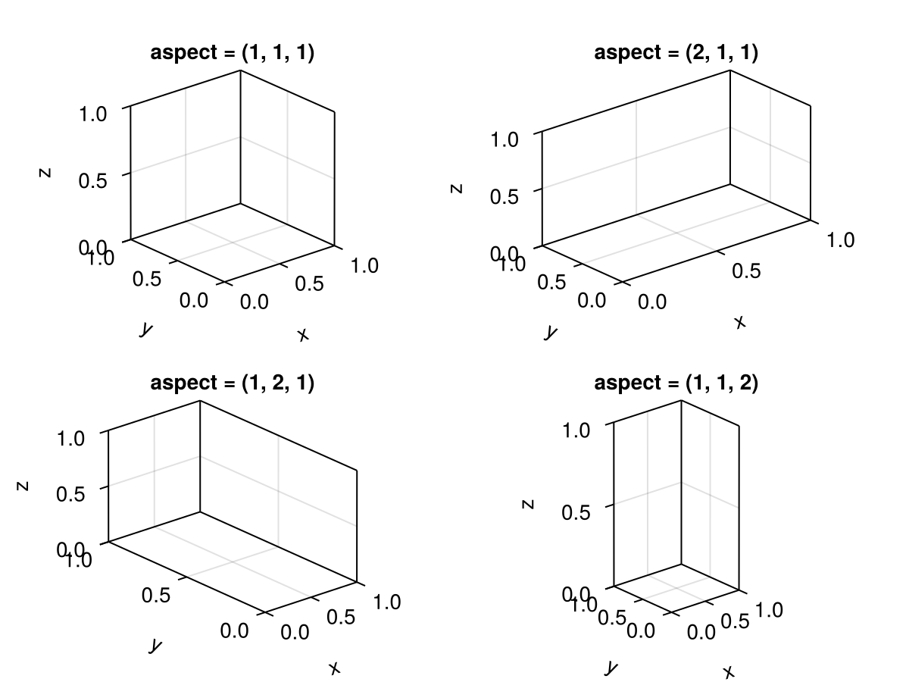

<a id="example-1da2f4f" />


```julia
using CairoMakie
using FileIO

fig = Figure()

brain = load(assetpath("brain.stl"))

ax1 = Axis3(fig[1, 1], aspect = :equal, title = "aspect = :equal")
ax2 = Axis3(fig[1, 2], aspect = :data, title = "aspect = :data")

for ax in [ax1, ax2]
    mesh!(ax, brain, color = :gray80)
end

fig
```

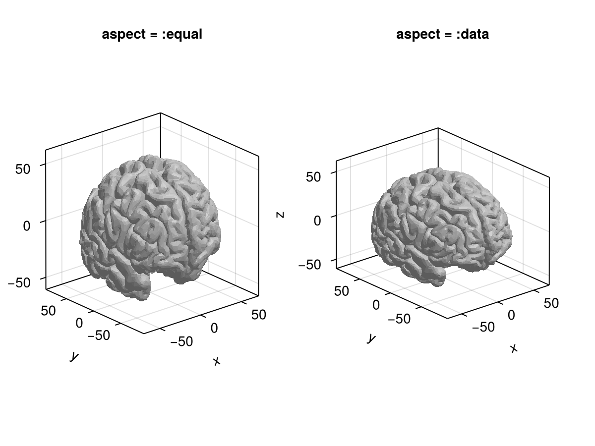


### axis_translation_mod {#axis_translation_mod}

Defaults to `Keyboard.left_control | Keyboard.right_control`

Sets the key that must be pressed to translate the whole axis (as opposed to the content) with `viewmode = :free`.

### azimuth {#azimuth}

Defaults to `1.275pi`

The azimuth (left / right) angle of the camera.

At `azimuth = 0`, the camera looks at the axis from a point on the positive x axis, and rotates to the right from there with increasing values. At the default value 1.275π, the x axis goes to the right and the y axis to the left.
<a id="example-35df3d5" />


```julia
using CairoMakie
fig = Figure()

for (i, azimuth) in enumerate([0, 0.1, 0.2, 0.3, 0.4, 0.5])
    Axis3(fig[fldmod1(i, 3)...], azimuth = azimuth * pi,
        title = "azimuth = $(azimuth)π", viewmode = :fit)
end

fig
```

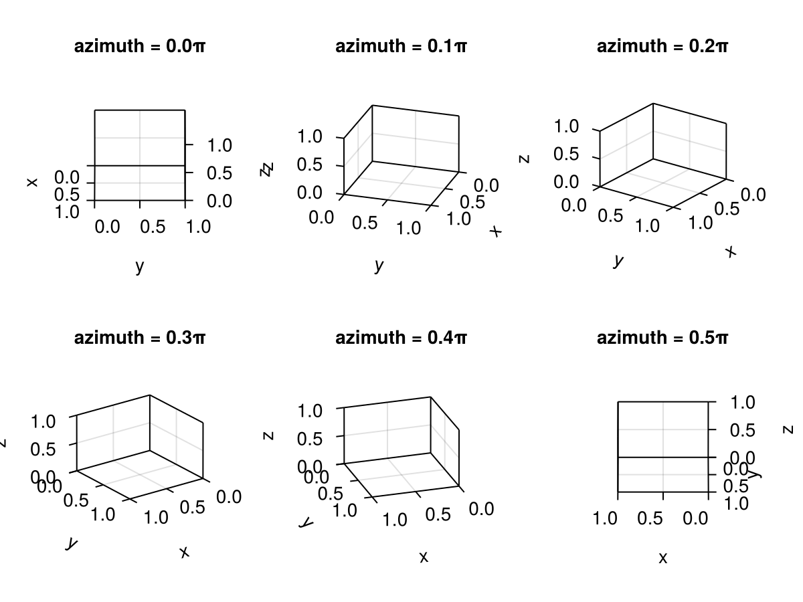


### backgroundcolor {#backgroundcolor}

Defaults to `:transparent`

The background color

### clip {#clip}

Defaults to `true`

Controls whether content is clipped at the axis frame. Note that you can also overwrite clipping per plot by setting `clip_planes = Plane3f[]`.

### clip_decorations {#clip_decorations}

Defaults to `false`

Controls whether decorations are cut off outside the layout area assigned to the axis.

### cursorfocuskey {#cursorfocuskey}

Defaults to `Keyboard.left_alt & Mouse.left`

Sets the key/button for centering the Axis3 on the currently hovered position.

### dim1_conversion {#dim1_conversion}

Defaults to `nothing`

Global state for the x dimension conversion.

### dim2_conversion {#dim2_conversion}

Defaults to `nothing`

Global state for the y dimension conversion.

### dim3_conversion {#dim3_conversion}

Defaults to `nothing`

Global state for the z dimension conversion.

### elevation {#elevation}

Defaults to `pi / 8`

The elevation (up / down) angle of the camera. Possible values are between -pi/2 (looking from the bottom up) and +pi/2 (looking from the top down).
<a id="example-f4c91c1" />


```julia
using CairoMakie
fig = Figure()

for (i, elevation) in enumerate([0, 0.05, 0.1, 0.15, 0.2, 0.25])
    Axis3(fig[fldmod1(i, 3)...], elevation = elevation * pi,
        title = "elevation = $(elevation)π", viewmode = :fit)
end

fig
```

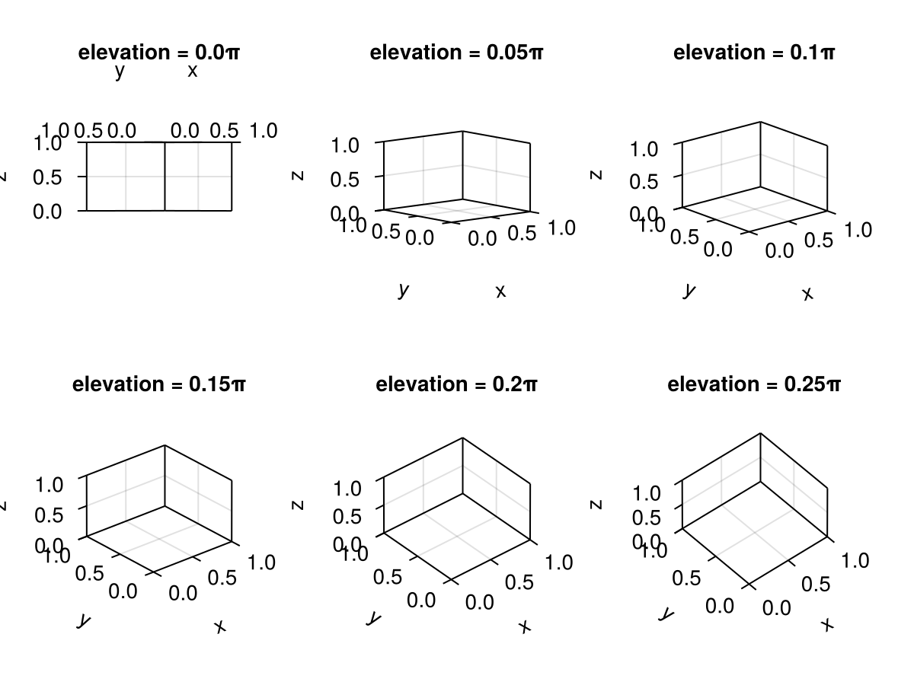


### front_spines {#front_spines}

Defaults to `false`

Controls if the 4. Spines are created to close the outline box

### halign {#halign}

Defaults to `:center`

The horizontal alignment of the scene in its suggested bounding box.

### height {#height}

Defaults to `nothing`

The height setting of the scene.

### limits {#limits}

Defaults to `(nothing, nothing, nothing)`

The limits that the user has manually set. They are reinstated when calling `reset_limits!` and are set to nothing by `autolimits!`. Can be either a tuple (xlow, xhigh, ylow, yhigh, zlow, zhigh) or a tuple (nothing_or_xlims, nothing_or_ylims, nothing_or_zlims). Are set by `xlims!`, `ylims!`, `zlims!` and `limits!`.

### near {#near}

Defaults to `0.001`

Sets the minimum value for `near`. Increasing this value will make objects close to the camera clip earlier. Reducing this value too much results in depth values becoming inaccurate. Must be &gt; 0.

### perspectiveness {#perspectiveness}

Defaults to `0.0`

This setting offers a simple scale from 0 to 1, where 0 looks like an orthographic projection (no perspective) and 1 is a strong perspective look. For most data visualization applications, perspective should be avoided because it makes interpreting the data correctly harder. It can be of use, however, if aesthetics are more important than neutral presentation.
<a id="example-8345ae0" />


```julia
using CairoMakie
fig = Figure()

for (i, perspectiveness) in enumerate(range(0, 1, length = 6))
    ax = Axis3(fig[fldmod1(i, 3)...]; perspectiveness, protrusions = (0, 0, 0, 15),
        title = ":perspectiveness = $(perspectiveness)")
    hidedecorations!(ax)
end

fig
```

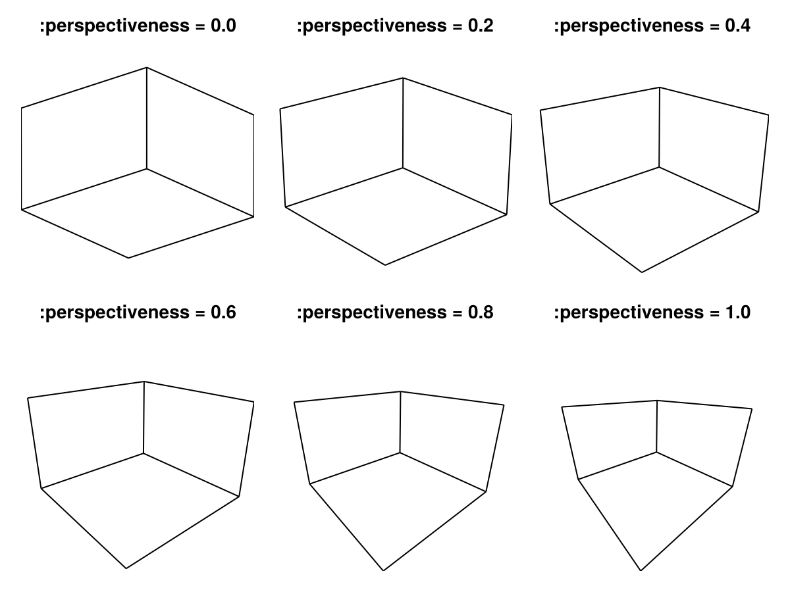


### protrusions {#protrusions}

Defaults to `30`

The protrusions control how much gap space is reserved for labels etc. on the sides of the `Axis3`. Unlike `Axis`, `Axis3` currently does not set these values automatically depending on the properties of ticks and labels. This is because the effective protrusions also depend on the rotation and scaling of the axis cuboid, which changes whenever the `Axis3` shifts in the layout. Therefore, auto-updating protrusions could lead to an endless layout update cycle.

The default value of `30` for all sides is just a heuristic and might lead to collisions of axis decorations with the `Figure` boundary or other plot elements. If that&#39;s the case, you can try increasing the value(s).

The `protrusions` attribute accepts a single number for all sides, or a tuple of `(left, right, bottom, top)`.
<a id="example-ff74f41" />


```julia
using CairoMakie
    fig = Figure(backgroundcolor = :gray97)
    Box(fig[1, 1], strokewidth = 0) # visualizes the layout cell
    Axis3(fig[1, 1], protrusions = 100, viewmode = :stretch,
        title = "protrusions = 100")
    fig
```

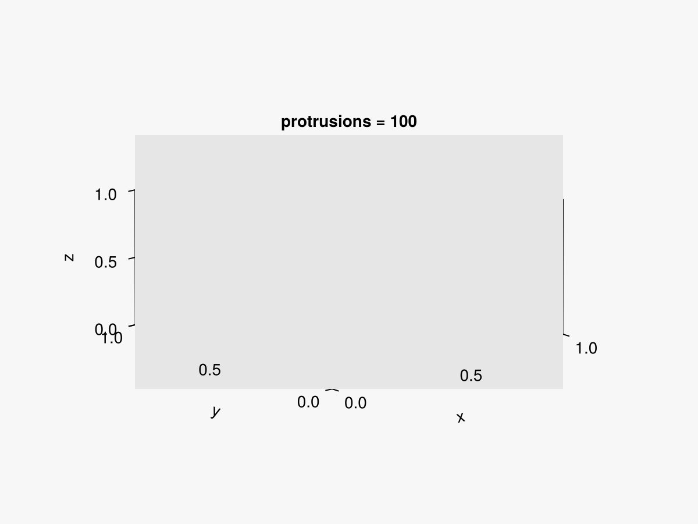

<a id="example-2949107" />


```julia
using CairoMakie
    fig = Figure(backgroundcolor = :gray97)
    Box(fig[1, 1], strokewidth = 0) # visualizes the layout cell
    ax = Axis3(fig[1, 1], protrusions = (0, 0, 0, 20), viewmode = :stretch,
        title = "protrusions = (0, 0, 0, 20)")
    hidedecorations!(ax)
    fig
```

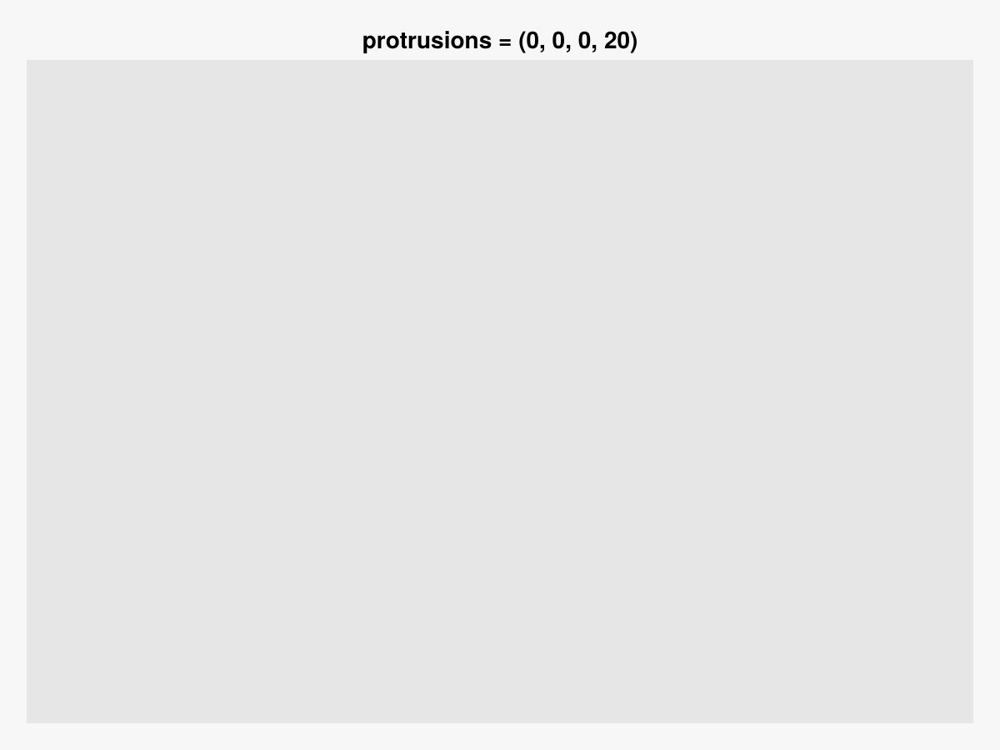


### targetlimits {#targetlimits}

Defaults to `Rect3d(Vec3d(0), Vec3d(1))`

The limits that the axis tries to set given other constraints like aspect. Don&#39;t set this directly, use `xlims!`, `ylims!` or `limits!` instead.

### tellheight {#tellheight}

Defaults to `true`

Controls if the parent layout can adjust to this element&#39;s height

### tellwidth {#tellwidth}

Defaults to `true`

Controls if the parent layout can adjust to this element&#39;s width

### title {#title}

Defaults to `""`

The axis title string.

### titlealign {#titlealign}

Defaults to `:center`

The horizontal alignment of the title.

### titlecolor {#titlecolor}

Defaults to `@inherit :textcolor :black`

The color of the title

### titlefont {#titlefont}

Defaults to `:bold`

The font family of the title.

### titlegap {#titlegap}

Defaults to `4.0`

The gap between axis and title.

### titlesize {#titlesize}

Defaults to `@inherit :fontsize 16.0f0`

The title&#39;s font size.

### titlevisible {#titlevisible}

Defaults to `true`

Controls if the title is visible.

### valign {#valign}

Defaults to `:center`

The vertical alignment of the scene in its suggested bounding box.

### viewmode {#viewmode}

Defaults to `:fitzoom`

The view mode affects the final projection of the axis by fitting the axis cuboid into the available space in different ways.
- `:fit` uses a fixed scaling such that a tight sphere around the cuboid touches the frame edge. This means that the scaling doesn&#39;t change when rotating the axis (the apparent size of the axis stays the same), but not all available space is used. The chosen `aspect` is maintained using this setting.
  
- `:fitzoom` uses a variable scaling such that the closest cuboid corner touches the frame edge. When rotating the axis, the apparent size of the axis changes which can result in a &quot;pumping&quot; visual effect. The chosen `aspect` is also maintained using this setting.
  
- `:stretch` pulls the cuboid corners to the frame edges such that the available space is filled completely. The chosen `aspect` is not maintained using this setting, so `:stretch` should not be used if a particular aspect is needed.
  
- `:free` behaves like `:fit` but changes some interactions. Zooming affects the whole axis rather than just the content. This allows you to zoom in on content without it getting clipped by the 3D bounding box of the Axis3. `zoommode = :cursor` is disabled. Translations can no also affect the axis as a whole with `control + right drag`.
  
<a id="example-8834f91" />


```julia
using CairoMakie
fig = Figure()

for (i, viewmode) in enumerate([:fit, :fitzoom, :stretch])
    for (j, elevation) in enumerate([0.1, 0.2, 0.3] .* pi)

        Label(fig[i, 1:3, Top()], "viewmode = $(repr(viewmode))", font = :bold)

        # show the extent of each cell using a box
        Box(fig[i, j], strokewidth = 0, color = :gray95)

        ax = Axis3(fig[i, j]; viewmode, elevation, protrusions = 0, aspect = :equal)
        hidedecorations!(ax)

    end
end

fig
```

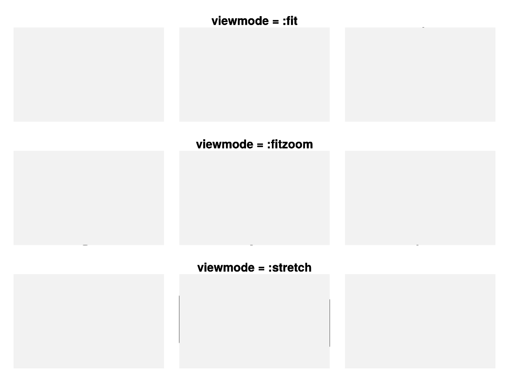


### width {#width}

Defaults to `nothing`

The width setting of the scene.

### xautolimitmargin {#xautolimitmargin}

Defaults to `(0.05, 0.05)`

The relative margins added to the autolimits in x direction.

### xgridcolor {#xgridcolor}

Defaults to `RGBAf(0, 0, 0, 0.12)`

The x grid color

### xgridvisible {#xgridvisible}

Defaults to `true`

Controls if the x grid is visible

### xgridwidth {#xgridwidth}

Defaults to `1`

The x grid width

### xlabel {#xlabel}

Defaults to `"x"`

The x label

### xlabelalign {#xlabelalign}

Defaults to `Makie.automatic`

The x label align

### xlabelcolor {#xlabelcolor}

Defaults to `@inherit :textcolor :black`

The x label color

### xlabelfont {#xlabelfont}

Defaults to `:regular`

The x label font

### xlabeloffset {#xlabeloffset}

Defaults to `40`

The x label offset

### xlabelrotation {#xlabelrotation}

Defaults to `Makie.automatic`

The x label rotation in radians

### xlabelsize {#xlabelsize}

Defaults to `@inherit :fontsize 16.0f0`

The x label size

### xlabelvisible {#xlabelvisible}

Defaults to `true`

Controls if the x label is visible

### xreversed {#xreversed}

Defaults to `false`

Controls if the x axis goes rightwards (false) or leftwards (true) in default camera orientation.
<a id="example-f26b6eb" />


```julia
using CairoMakie
using FileIO

fig = Figure()

brain = load(assetpath("brain.stl"))

ax1 = Axis3(fig[1, 1], title = "xreversed = false")
ax2 = Axis3(fig[2, 1], title = "xreversed = true", xreversed = true)
for ax in [ax1, ax2]
    mesh!(ax, brain, color = getindex.(brain.position, 1))
end

fig
```

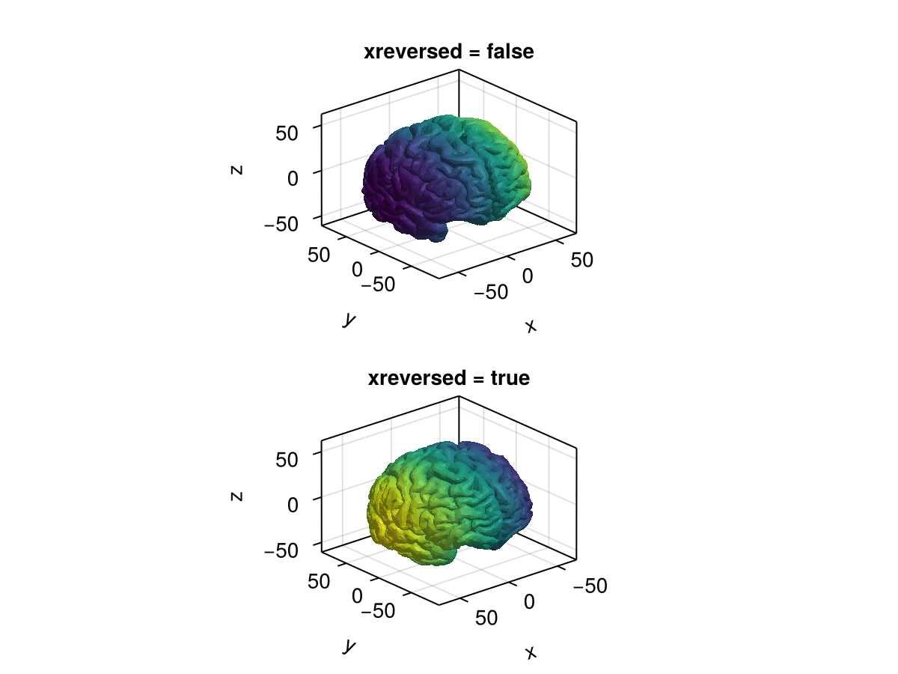


### xspinecolor_1 {#xspinecolor_1}

Defaults to `:black`

The color of x spine 1 where the ticks are displayed

### xspinecolor_2 {#xspinecolor_2}

Defaults to `:black`

The color of x spine 2 towards the center

### xspinecolor_3 {#xspinecolor_3}

Defaults to `:black`

The color of x spine 3 opposite of the ticks

### xspinecolor_4 {#xspinecolor_4}

Defaults to `:black`

The color of x spine 4

### xspinesvisible {#xspinesvisible}

Defaults to `true`

Controls if the x spine is visible

### xspinewidth {#xspinewidth}

Defaults to `1`

The x spine width

### xtickcolor {#xtickcolor}

Defaults to `:black`

The x tick color

### xtickformat {#xtickformat}

Defaults to `Makie.automatic`

The x tick format

### xticklabelcolor {#xticklabelcolor}

Defaults to `@inherit :textcolor :black`

The x ticklabel color

### xticklabelfont {#xticklabelfont}

Defaults to `:regular`

The x ticklabel font

### xticklabelpad {#xticklabelpad}

Defaults to `5`

The x ticklabel pad

### xticklabelsize {#xticklabelsize}

Defaults to `@inherit :fontsize 16.0f0`

The x ticklabel size

### xticklabelsvisible {#xticklabelsvisible}

Defaults to `true`

Controls if the x ticklabels are visible

### xticks {#xticks}

Defaults to `WilkinsonTicks(5; k_min = 3)`

The x ticks

### xticksize {#xticksize}

Defaults to `6`

The size of the xtick marks.

### xticksvisible {#xticksvisible}

Defaults to `true`

Controls if the x ticks are visible

### xtickwidth {#xtickwidth}

Defaults to `1`

The x tick width

### xtranslationkey {#xtranslationkey}

Defaults to `Keyboard.x`

The key for limiting translation to the x direction.

### xtranslationlock {#xtranslationlock}

Defaults to `false`

Locks interactive translation in the x direction.

### xypanelcolor {#xypanelcolor}

Defaults to `:transparent`

The color of the xy panel

### xypanelvisible {#xypanelvisible}

Defaults to `true`

Controls if the xy panel is visible

### xzoomkey {#xzoomkey}

Defaults to `Keyboard.x`

The key for limiting zooming to the x direction.

### xzoomlock {#xzoomlock}

Defaults to `false`

Locks interactive zooming in the x direction.

### xzpanelcolor {#xzpanelcolor}

Defaults to `:transparent`

The color of the xz panel

### xzpanelvisible {#xzpanelvisible}

Defaults to `true`

Controls if the xz panel is visible

### yautolimitmargin {#yautolimitmargin}

Defaults to `(0.05, 0.05)`

The relative margins added to the autolimits in y direction.

### ygridcolor {#ygridcolor}

Defaults to `RGBAf(0, 0, 0, 0.12)`

The y grid color

### ygridvisible {#ygridvisible}

Defaults to `true`

Controls if the y grid is visible

### ygridwidth {#ygridwidth}

Defaults to `1`

The y grid width

### ylabel {#ylabel}

Defaults to `"y"`

The y label

### ylabelalign {#ylabelalign}

Defaults to `Makie.automatic`

The y label align

### ylabelcolor {#ylabelcolor}

Defaults to `@inherit :textcolor :black`

The y label color

### ylabelfont {#ylabelfont}

Defaults to `:regular`

The y label font

### ylabeloffset {#ylabeloffset}

Defaults to `40`

The y label offset

### ylabelrotation {#ylabelrotation}

Defaults to `Makie.automatic`

The y label rotation in radians

### ylabelsize {#ylabelsize}

Defaults to `@inherit :fontsize 16.0f0`

The y label size

### ylabelvisible {#ylabelvisible}

Defaults to `true`

Controls if the y label is visible

### yreversed {#yreversed}

Defaults to `false`

Controls if the y axis goes leftwards (false) or rightwards (true) in default camera orientation.
<a id="example-dbe6807" />


```julia
using CairoMakie
using FileIO

fig = Figure()

brain = load(assetpath("brain.stl"))

ax1 = Axis3(fig[1, 1], title = "yreversed = false")
ax2 = Axis3(fig[2, 1], title = "yreversed = true", yreversed = true)
for ax in [ax1, ax2]
    mesh!(ax, brain, color = getindex.(brain.position, 2))
end

fig
```

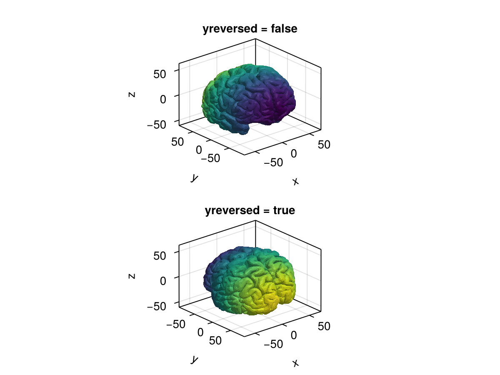


### yspinecolor_1 {#yspinecolor_1}

Defaults to `:black`

The color of y spine 1 where the ticks are displayed

### yspinecolor_2 {#yspinecolor_2}

Defaults to `:black`

The color of y spine 2 towards the center

### yspinecolor_3 {#yspinecolor_3}

Defaults to `:black`

The color of y spine 3 opposite of the ticks

### yspinecolor_4 {#yspinecolor_4}

Defaults to `:black`

The color of y spine 4

### yspinesvisible {#yspinesvisible}

Defaults to `true`

Controls if the y spine is visible

### yspinewidth {#yspinewidth}

Defaults to `1`

The y spine width

### ytickcolor {#ytickcolor}

Defaults to `:black`

The y tick color

### ytickformat {#ytickformat}

Defaults to `Makie.automatic`

The y tick format

### yticklabelcolor {#yticklabelcolor}

Defaults to `@inherit :textcolor :black`

The y ticklabel color

### yticklabelfont {#yticklabelfont}

Defaults to `:regular`

The y ticklabel font

### yticklabelpad {#yticklabelpad}

Defaults to `5`

The y ticklabel pad

### yticklabelsize {#yticklabelsize}

Defaults to `@inherit :fontsize 16.0f0`

The y ticklabel size

### yticklabelsvisible {#yticklabelsvisible}

Defaults to `true`

Controls if the y ticklabels are visible

### yticks {#yticks}

Defaults to `WilkinsonTicks(5; k_min = 3)`

The y ticks

### yticksize {#yticksize}

Defaults to `6`

The size of the ytick marks.

### yticksvisible {#yticksvisible}

Defaults to `true`

Controls if the y ticks are visible

### ytickwidth {#ytickwidth}

Defaults to `1`

The y tick width

### ytranslationkey {#ytranslationkey}

Defaults to `Keyboard.y`

The key for limiting translations to the y direction.

### ytranslationlock {#ytranslationlock}

Defaults to `false`

Locks interactive translation in the y direction.

### yzoomkey {#yzoomkey}

Defaults to `Keyboard.y`

The key for limiting zooming to the y direction.

### yzoomlock {#yzoomlock}

Defaults to `false`

Locks interactive zooming in the y direction.

### yzpanelcolor {#yzpanelcolor}

Defaults to `:transparent`

The color of the yz panel

### yzpanelvisible {#yzpanelvisible}

Defaults to `true`

Controls if the yz panel is visible

### zautolimitmargin {#zautolimitmargin}

Defaults to `(0.05, 0.05)`

The relative margins added to the autolimits in z direction.

### zgridcolor {#zgridcolor}

Defaults to `RGBAf(0, 0, 0, 0.12)`

The z grid color

### zgridvisible {#zgridvisible}

Defaults to `true`

Controls if the z grid is visible

### zgridwidth {#zgridwidth}

Defaults to `1`

The z grid width

### zlabel {#zlabel}

Defaults to `"z"`

The z label

### zlabelalign {#zlabelalign}

Defaults to `Makie.automatic`

The z label align

### zlabelcolor {#zlabelcolor}

Defaults to `@inherit :textcolor :black`

The z label color

### zlabelfont {#zlabelfont}

Defaults to `:regular`

The z label font

### zlabeloffset {#zlabeloffset}

Defaults to `50`

The z label offset

### zlabelrotation {#zlabelrotation}

Defaults to `Makie.automatic`

The z label rotation in radians

### zlabelsize {#zlabelsize}

Defaults to `@inherit :fontsize 16.0f0`

The z label size

### zlabelvisible {#zlabelvisible}

Defaults to `true`

Controls if the z label is visible

### zoommode {#zoommode}

Defaults to `:center`

Controls what reference point is used when zooming. Can be `:center` for centered zooming or `:cursor` for zooming centered approximately where the cursor is. This is disabled with `viewmode = :free`.

### zreversed {#zreversed}

Defaults to `false`

Controls if the z axis goes upwards (false) or downwards (true) in default camera orientation.
<a id="example-777684a" />


```julia
using CairoMakie
using FileIO

fig = Figure()

brain = load(assetpath("brain.stl"))

ax1 = Axis3(fig[1, 1], title = "zreversed = false")
ax2 = Axis3(fig[2, 1], title = "zreversed = true", zreversed = true)
for ax in [ax1, ax2]
    mesh!(ax, brain, color = getindex.(brain.position, 3))
end

fig
```

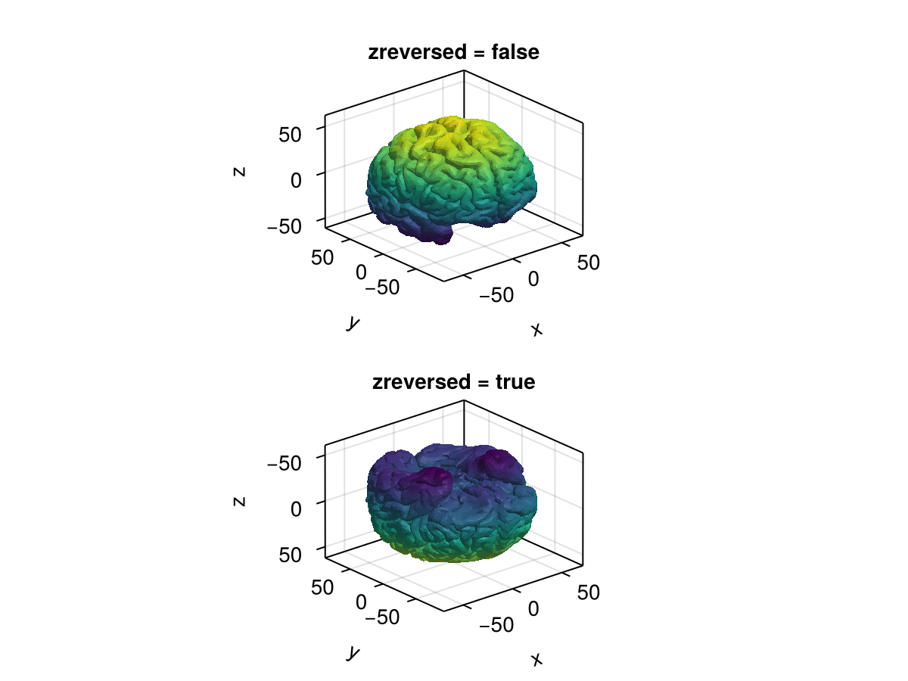


### zspinecolor_1 {#zspinecolor_1}

Defaults to `:black`

The color of z spine 1 where the ticks are displayed

### zspinecolor_2 {#zspinecolor_2}

Defaults to `:black`

The color of z spine 2 towards the center

### zspinecolor_3 {#zspinecolor_3}

Defaults to `:black`

The color of z spine 3 opposite of the ticks

### zspinecolor_4 {#zspinecolor_4}

Defaults to `:black`

The color of z spine 4

### zspinesvisible {#zspinesvisible}

Defaults to `true`

Controls if the z spine is visible

### zspinewidth {#zspinewidth}

Defaults to `1`

The z spine width

### ztickcolor {#ztickcolor}

Defaults to `:black`

The z tick color

### ztickformat {#ztickformat}

Defaults to `Makie.automatic`

The z tick format

### zticklabelcolor {#zticklabelcolor}

Defaults to `@inherit :textcolor :black`

The z ticklabel color

### zticklabelfont {#zticklabelfont}

Defaults to `:regular`

The z ticklabel font

### zticklabelpad {#zticklabelpad}

Defaults to `10`

The z ticklabel pad

### zticklabelsize {#zticklabelsize}

Defaults to `@inherit :fontsize 16.0f0`

The z ticklabel size

### zticklabelsvisible {#zticklabelsvisible}

Defaults to `true`

Controls if the z ticklabels are visible

### zticks {#zticks}

Defaults to `WilkinsonTicks(5; k_min = 3)`

The z ticks

### zticksize {#zticksize}

Defaults to `6`

The size of the ztick marks.

### zticksvisible {#zticksvisible}

Defaults to `true`

Controls if the z ticks are visible

### ztickwidth {#ztickwidth}

Defaults to `1`

The z tick width

### ztranslationkey {#ztranslationkey}

Defaults to `Keyboard.z`

The key for limiting translations to the y direction.

### ztranslationlock {#ztranslationlock}

Defaults to `false`

Locks interactive translation in the z direction.

### zzoomkey {#zzoomkey}

Defaults to `Keyboard.z`

The key for limiting zooming to the z direction.

### zzoomlock {#zzoomlock}

Defaults to `false`

Locks interactive zooming in the z direction.
