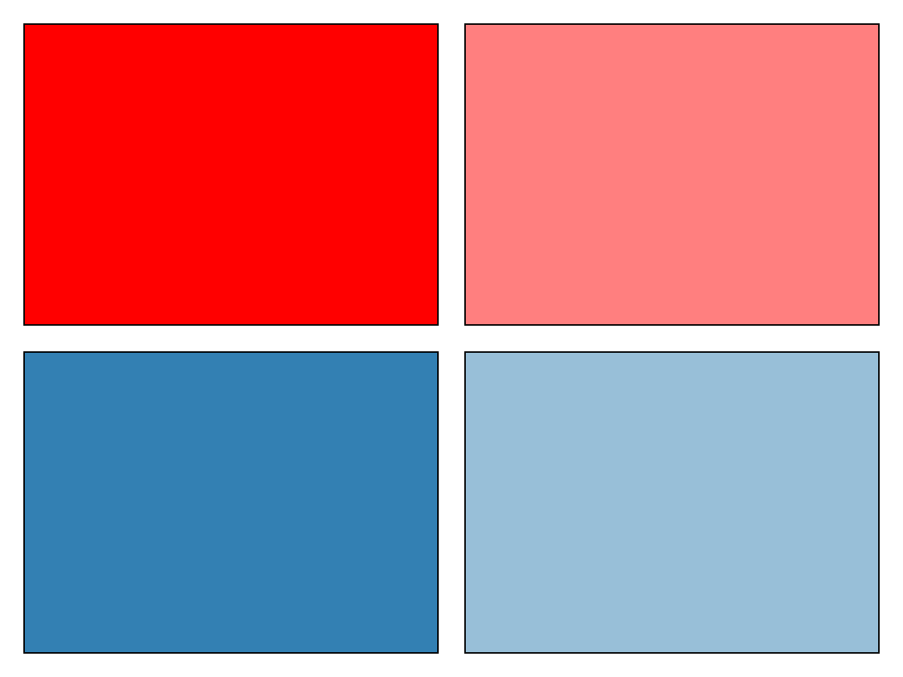
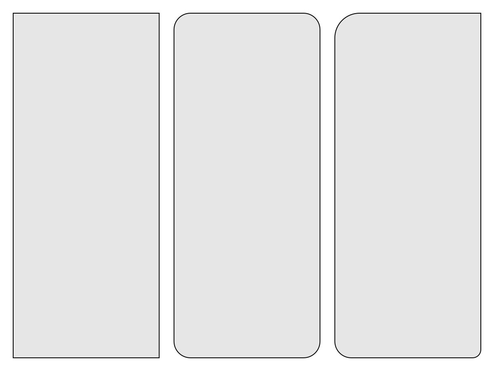
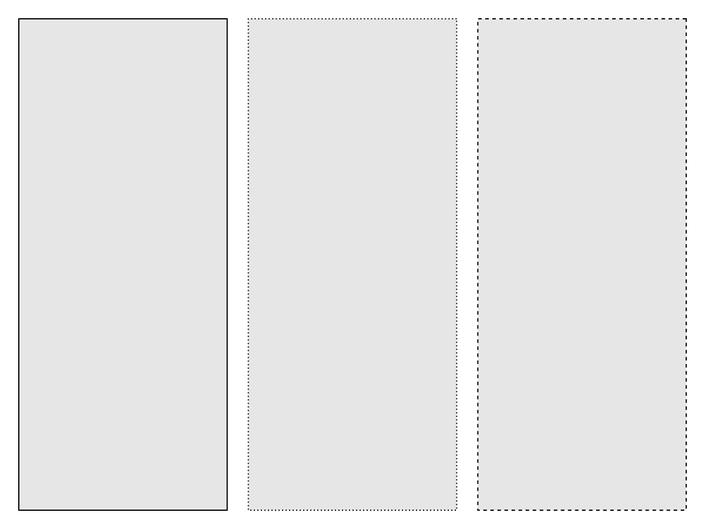
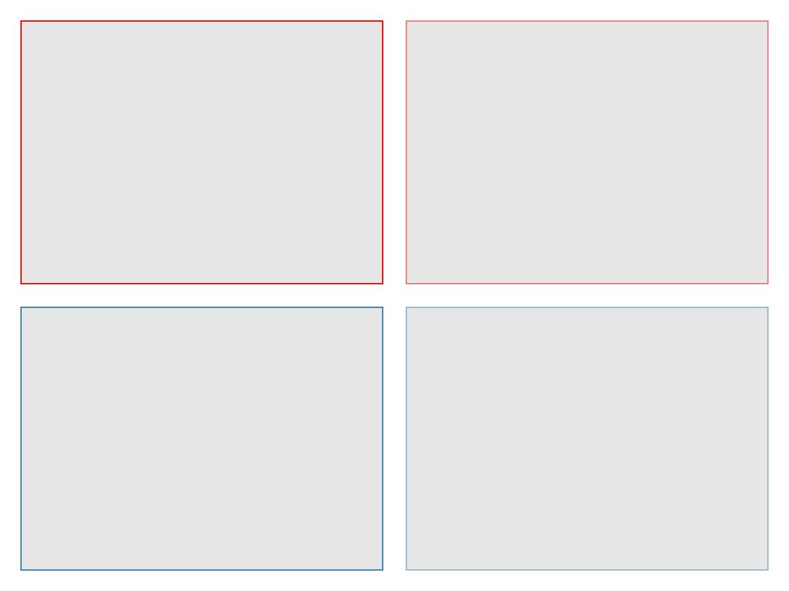
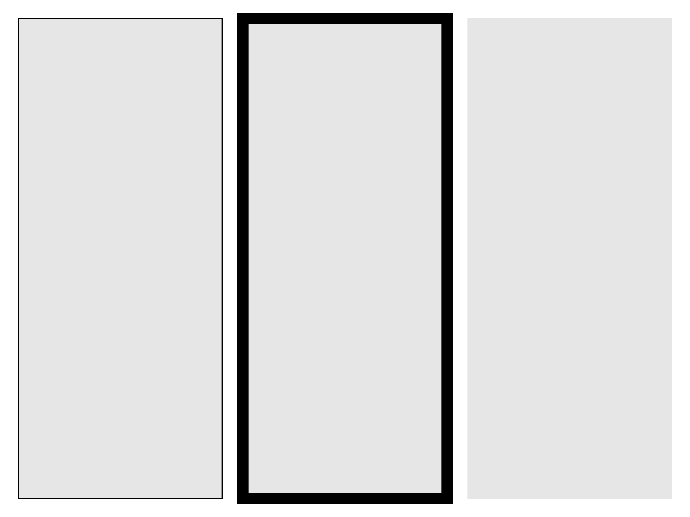

# Box {#Box}

A simple rectangle with optionally rounded corners. This can be useful to visually group parts of a layout, or as a placeholder.

## Attributes {#Attributes}

### alignmode {#alignmode}

Defaults to `Inside()`

The align mode of the rectangle in its parent GridLayout.

### color {#color}

Defaults to `RGBf(0.9, 0.9, 0.9)`

The color of the rectangle.
<a id="example-423e835" />


```julia
using CairoMakie
fig = Figure()
Box(fig[1, 1], color = :red)
Box(fig[1, 2], color = (:red, 0.5))
Box(fig[2, 1], color = RGBf(0.2, 0.5, 0.7))
Box(fig[2, 2], color = RGBAf(0.2, 0.5, 0.7, 0.5))
fig
```




### cornerradius {#cornerradius}

Defaults to `0.0`

The radius of the rounded corner. One number is for all four corners, four numbers for going clockwise from top-right.
<a id="example-30fc3e0" />


```julia
using CairoMakie
fig = Figure()
Box(fig[1, 1], cornerradius = 0)
Box(fig[1, 2], cornerradius = 20)
Box(fig[1, 3], cornerradius = (0, 10, 20, 30))
fig
```




### halign {#halign}

Defaults to `:center`

The horizontal alignment of the rectangle in its suggested boundingbox

### height {#height}

Defaults to `nothing`

The height setting of the rectangle.

### linestyle {#linestyle}

Defaults to `nothing`

The linestyle of the rectangle border
<a id="example-a96f640" />


```julia
using CairoMakie
fig = Figure()
Box(fig[1, 1], linestyle = :solid)
Box(fig[1, 2], linestyle = :dot)
Box(fig[1, 3], linestyle = :dash)
fig
```




### strokecolor {#strokecolor}

Defaults to `RGBf(0, 0, 0)`

The color of the border.
<a id="example-50c6955" />


```julia
using CairoMakie
fig = Figure()
Box(fig[1, 1], strokecolor = :red)
Box(fig[1, 2], strokecolor = (:red, 0.5))
Box(fig[2, 1], strokecolor = RGBf(0.2, 0.5, 0.7))
Box(fig[2, 2], strokecolor = RGBAf(0.2, 0.5, 0.7, 0.5))
fig
```




### strokevisible {#strokevisible}

Defaults to `true`

Controls if the border of the rectangle is visible.

### strokewidth {#strokewidth}

Defaults to `1.0`

The line width of the rectangle&#39;s border.
<a id="example-ed8c160" />


```julia
using CairoMakie
fig = Figure()
Box(fig[1, 1], strokewidth = 1)
Box(fig[1, 2], strokewidth = 10)
Box(fig[1, 3], strokewidth = 0)
fig
```




### tellheight {#tellheight}

Defaults to `true`

Controls if the parent layout can adjust to this element&#39;s height

### tellwidth {#tellwidth}

Defaults to `true`

Controls if the parent layout can adjust to this element&#39;s width

### valign {#valign}

Defaults to `:center`

The vertical alignment of the rectangle in its suggested boundingbox

### visible {#visible}

Defaults to `true`

Controls if the rectangle is visible.

### width {#width}

Defaults to `nothing`

The width setting of the rectangle.

### z {#z}

Defaults to `0.0`

Sets the z value of the Box
