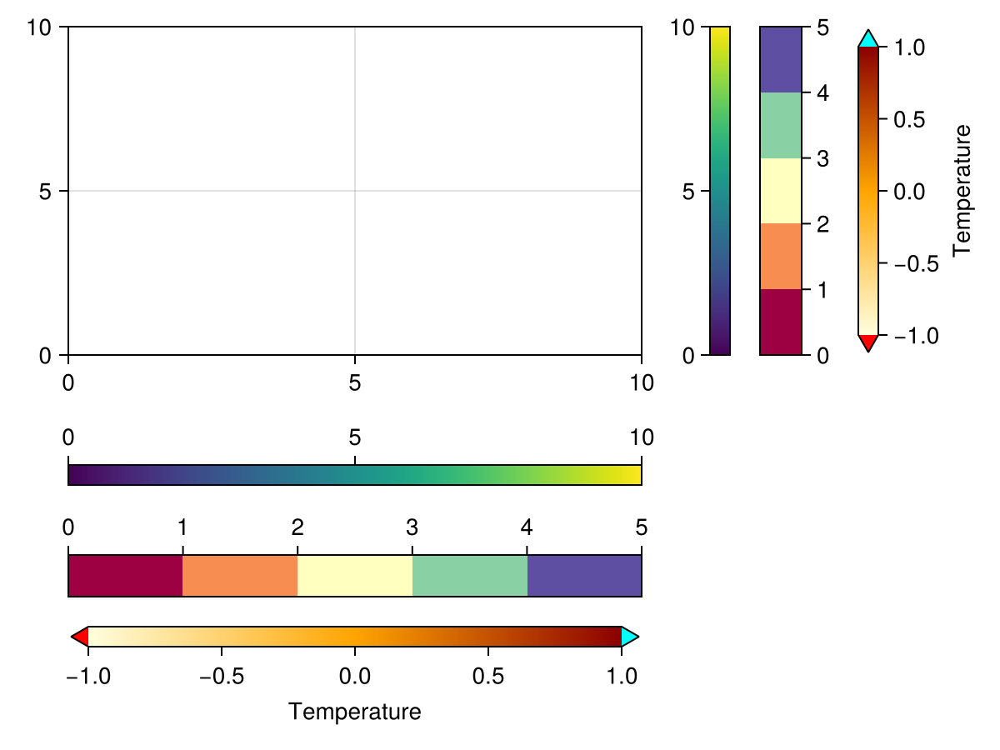
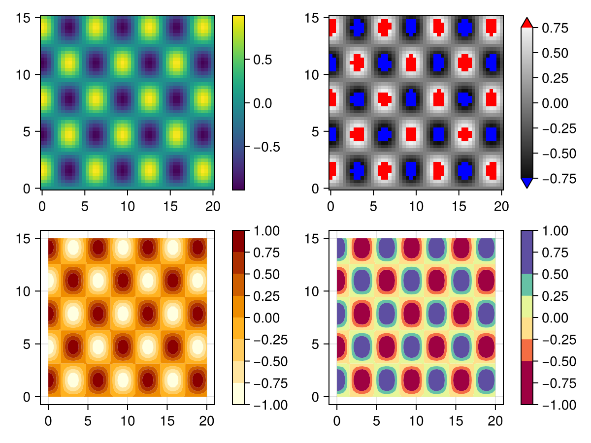
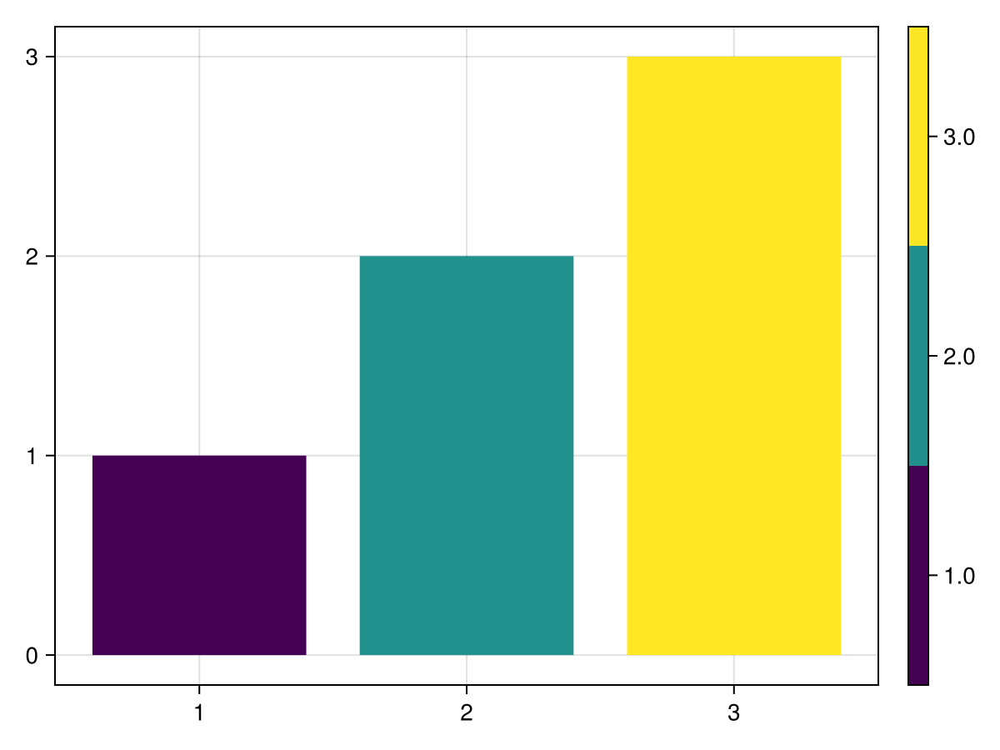

# Colorbar {#Colorbar}

A Colorbar needs a colormap and a tuple of low/high limits. The colormap&#39;s axis will then span from low to high along the visual representation of the colormap. You can set ticks in a similar way to `Axis`.

Here&#39;s how you can create Colorbars manually.
<a id="example-aefa94c" />


```julia
using CairoMakie

fig = Figure()

Axis(fig[1, 1])

# vertical colorbars
Colorbar(fig[1, 2], limits = (0, 10), colormap = :viridis,
    flipaxis = false)
Colorbar(fig[1, 3], limits = (0, 5),
    colormap = cgrad(:Spectral, 5, categorical = true), size = 25)
Colorbar(fig[1, 4], limits = (-1, 1), colormap = :heat,
    highclip = :cyan, lowclip = :red, label = "Temperature")

# horizontal colorbars
Colorbar(fig[2, 1], limits = (0, 10), colormap = :viridis,
    vertical = false)
Colorbar(fig[3, 1], limits = (0, 5), size = 25,
    colormap = cgrad(:Spectral, 5, categorical = true), vertical = false)
Colorbar(fig[4, 1], limits = (-1, 1), colormap = :heat,
    label = "Temperature", vertical = false, flipaxis = false,
    highclip = :cyan, lowclip = :red)

fig
```




If you pass a `plotobject`, a `heatmap` or `contourf`, the Colorbar is set up automatically such that it tracks these objects&#39; relevant attributes like `colormap`, `colorrange`, `highclip` and `lowclip`. If you want to adjust these attributes afterwards, change them in the plot object, otherwise the Colorbar and the plot object will go out of sync.
<a id="example-babc705" />


```julia
using CairoMakie

xs = LinRange(0, 20, 50)
ys = LinRange(0, 15, 50)
zs = [cos(x) * sin(y) for x in xs, y in ys]

fig = Figure()

ax, hm = heatmap(fig[1, 1][1, 1], xs, ys, zs)
Colorbar(fig[1, 1][1, 2], hm)

ax, hm = heatmap(fig[1, 2][1, 1], xs, ys, zs, colormap = :grays,
    colorrange = (-0.75, 0.75), highclip = :red, lowclip = :blue)
Colorbar(fig[1, 2][1, 2], hm)

ax, hm = contourf(fig[2, 1][1, 1], xs, ys, zs,
    levels = -1:0.25:1, colormap = :heat)
Colorbar(fig[2, 1][1, 2], hm, ticks = -1:0.25:1)

ax, hm = contourf(fig[2, 2][1, 1], xs, ys, zs,
    colormap = :Spectral, levels = [-1, -0.5, -0.25, 0, 0.25, 0.5, 1])
Colorbar(fig[2, 2][1, 2], hm, ticks = -1:0.25:1)

fig
```




### Experimental Categorical support {#Experimental-Categorical-support}

::: warning Warning

This feature might change outside breaking releases, since the API is not yet finalized

:::

You can create a true categorical map with good default ticks, by wrapping a colormap into `Makie.Categorical(cmap)`:
<a id="example-7e0b270" />


```julia
using CairoMakie
fig, ax, pl = barplot(1:3; color=1:3, colormap=Makie.Categorical(:viridis))
Colorbar(fig[1, 2], pl)
fig
```




We can&#39;t use `cgrad(...; categorical=true)` for this, since it has an ambiguous meaning for true categorical values.

## Attributes {#Attributes}

### alignmode {#alignmode}

Defaults to `Inside()`

The align mode of the colorbar in its parent GridLayout.

### bottomspinecolor {#bottomspinecolor}

Defaults to `RGBf(0, 0, 0)`

The color of the bottom spine.

### bottomspinevisible {#bottomspinevisible}

Defaults to `true`

Controls if the bottom spine is visible.

### colormap {#colormap}

Defaults to `@inherit :colormap :viridis`

The colormap that the colorbar uses.

### colorrange {#colorrange}

Defaults to `nothing`

The range of values depicted in the colorbar.

### flip_vertical_label {#flip_vertical_label}

Defaults to `false`

Flips the colorbar label if the axis is vertical.

### flipaxis {#flipaxis}

Defaults to `true`

Flips the axis to the right if vertical and to the top if horizontal.

### halign {#halign}

Defaults to `:center`

The horizontal alignment of the colorbar in its suggested bounding box.

### height {#height}

Defaults to `Auto()`

The height setting of the colorbar.

### highclip {#highclip}

Defaults to `nothing`

The color of the high clip triangle.

### label {#label}

Defaults to `""`

The color bar label string.

### labelcolor {#labelcolor}

Defaults to `@inherit :textcolor :black`

The label color.

### labelfont {#labelfont}

Defaults to `:regular`

The label font family.

### labelpadding {#labelpadding}

Defaults to `5.0`

The gap between the label and the ticks.

### labelrotation {#labelrotation}

Defaults to `Makie.automatic`

The label rotation in radians.

### labelsize {#labelsize}

Defaults to `@inherit :fontsize 16.0f0`

The label font size.

### labelvisible {#labelvisible}

Defaults to `true`

Controls if the label is visible.

### leftspinecolor {#leftspinecolor}

Defaults to `RGBf(0, 0, 0)`

The color of the left spine.

### leftspinevisible {#leftspinevisible}

Defaults to `true`

Controls if the left spine is visible.

### limits {#limits}

Defaults to `nothing`

The range of values depicted in the colorbar.

### lowclip {#lowclip}

Defaults to `nothing`

The color of the low clip triangle.

### minortickalign {#minortickalign}

Defaults to `0.0`

The alignment of minor ticks on the axis spine

### minortickcolor {#minortickcolor}

Defaults to `:black`

The tick color of minor ticks

### minorticks {#minorticks}

Defaults to `IntervalsBetween(5)`

The tick locator for the minor ticks

### minorticksize {#minorticksize}

Defaults to `3.0`

The tick size of minor ticks

### minorticksvisible {#minorticksvisible}

Defaults to `false`

Controls if minor ticks are visible

### minortickwidth {#minortickwidth}

Defaults to `1.0`

The tick width of minor ticks

### nsteps {#nsteps}

Defaults to `100`

The number of steps in the heatmap underlying the colorbar gradient.

### rightspinecolor {#rightspinecolor}

Defaults to `RGBf(0, 0, 0)`

The color of the right spine.

### rightspinevisible {#rightspinevisible}

Defaults to `true`

Controls if the right spine is visible.

### scale {#scale}

Defaults to `identity`

The axis scale

### size {#size}

Defaults to `12`

The width or height of the colorbar, depending on if it&#39;s vertical or horizontal, unless overridden by `width` / `height`

### spinewidth {#spinewidth}

Defaults to `1.0`

The line width of the spines.

### tellheight {#tellheight}

Defaults to `true`

Controls if the parent layout can adjust to this element&#39;s height

### tellwidth {#tellwidth}

Defaults to `true`

Controls if the parent layout can adjust to this element&#39;s width

### tickalign {#tickalign}

Defaults to `0.0`

The alignment of the tick marks relative to the axis spine (0 = out, 1 = in).

### tickcolor {#tickcolor}

Defaults to `RGBf(0, 0, 0)`

The color of the tick marks.

### tickformat {#tickformat}

Defaults to `Makie.automatic`

Format for ticks.

### ticklabelalign {#ticklabelalign}

Defaults to `Makie.automatic`

The horizontal and vertical alignment of the tick labels.

### ticklabelcolor {#ticklabelcolor}

Defaults to `@inherit :textcolor :black`

The color of the tick labels.

### ticklabelfont {#ticklabelfont}

Defaults to `:regular`

The font family of the tick labels.

### ticklabelpad {#ticklabelpad}

Defaults to `3.0`

The gap between tick labels and tick marks.

### ticklabelrotation {#ticklabelrotation}

Defaults to `0.0`

The rotation of the ticklabels.

### ticklabelsize {#ticklabelsize}

Defaults to `@inherit :fontsize 16.0f0`

The font size of the tick labels.

### ticklabelspace {#ticklabelspace}

Defaults to `Makie.automatic`

The space reserved for the tick labels. Can be set to `Makie.automatic` to automatically determine the space needed, `:max_auto` to only ever grow to fit the current ticklabels, or a specific value.

### ticklabelsvisible {#ticklabelsvisible}

Defaults to `true`

Controls if the tick labels are visible.

### ticks {#ticks}

Defaults to `Makie.automatic`

The ticks.

### ticksize {#ticksize}

Defaults to `5.0`

The size of the tick marks.

### ticksvisible {#ticksvisible}

Defaults to `true`

Controls if the tick marks are visible.

### tickwidth {#tickwidth}

Defaults to `1.0`

The line width of the tick marks.

### topspinecolor {#topspinecolor}

Defaults to `RGBf(0, 0, 0)`

The color of the top spine.

### topspinevisible {#topspinevisible}

Defaults to `true`

Controls if the top spine is visible.

### valign {#valign}

Defaults to `:center`

The vertical alignment of the colorbar in its suggested bounding box.

### vertical {#vertical}

Defaults to `true`

Controls if the colorbar is oriented vertically.

### width {#width}

Defaults to `Auto()`

The width setting of the colorbar. Use `size` to set width or height relative to colorbar orientation instead.
