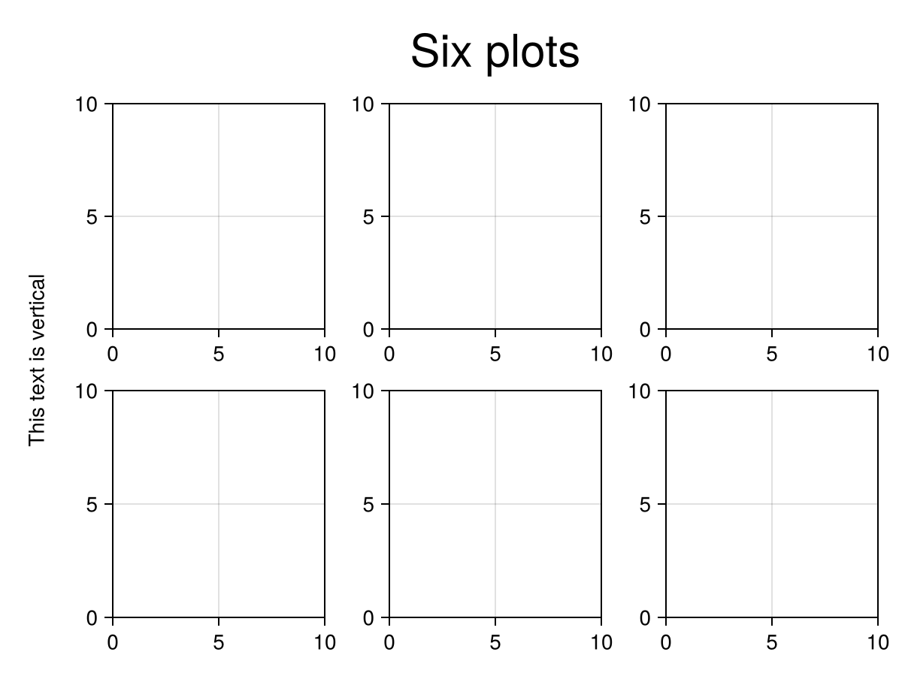
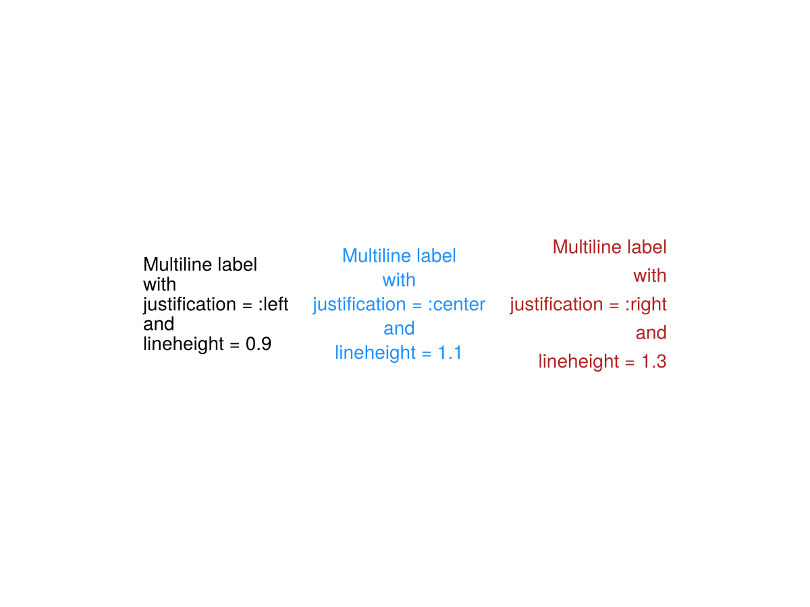

# Label {#Label}

A Label is text within a rectangular boundingbox. The `halign` and `valign` attributes always refer to unrotated horizontal and vertical. This is different from `text`, where alignment is relative to text flow direction.

A Label&#39;s size is known, so if `tellwidth` and `tellheight` are set to `true` (the default values) a GridLayout with `Auto` column or row sizes can shrink to fit.
<a id="example-d70f666" />


```julia
using CairoMakie

fig = Figure()

fig[1:2, 1:3] = [Axis(fig) for _ in 1:6]

supertitle = Label(fig[0, :], "Six plots", fontsize = 30)

sideinfo = Label(fig[1:2, 0], "This text is vertical", rotation = pi/2)

fig
```




Justification and lineheight of a label can be controlled just like with normal text.
<a id="example-25ef030" />


```julia
using CairoMakie

f = Figure()

Label(f[1, 1],
    "Multiline label\nwith\njustification = :left\nand\nlineheight = 0.9",
    justification = :left,
    lineheight = 0.9
)
Label(f[1, 2],
    "Multiline label\nwith\njustification = :center\nand\nlineheight = 1.1",
    justification = :center,
    lineheight = 1.1,
    color = :dodgerblue,
)
Label(f[1, 3],
    "Multiline label\nwith\njustification = :right\nand\nlineheight = 1.3",
    justification = :right,
    lineheight = 1.3,
    color = :firebrick
)

f
```




## Attributes {#Attributes}

### alignmode {#alignmode}

Defaults to `Inside()`

The align mode of the text in its parent GridLayout.

### color {#color}

Defaults to `@inherit :textcolor :black`

The color of the text.

### font {#font}

Defaults to `:regular`

The font family of the text.

### fontsize {#fontsize}

Defaults to `@inherit :fontsize 16.0f0`

The font size of the text.

### halign {#halign}

Defaults to `:center`

The horizontal alignment of the text in its suggested boundingbox

### height {#height}

Defaults to `Auto()`

The height setting of the text.

### justification {#justification}

Defaults to `:center`

The justification of the text (:left, :right, :center).

### lineheight {#lineheight}

Defaults to `1.0`

The lineheight multiplier for the text.

### padding {#padding}

Defaults to `(0.0f0, 0.0f0, 0.0f0, 0.0f0)`

The extra space added to the sides of the text boundingbox.

### rotation {#rotation}

Defaults to `0.0`

The counterclockwise rotation of the text in radians.

### tellheight {#tellheight}

Defaults to `true`

Controls if the parent layout can adjust to this element&#39;s height

### tellwidth {#tellwidth}

Defaults to `true`

Controls if the parent layout can adjust to this element&#39;s width

### text {#text}

Defaults to `"Text"`

The displayed text string.

### valign {#valign}

Defaults to `:center`

The vertical alignment of the text in its suggested boundingbox

### visible {#visible}

Defaults to `true`

Controls if the text is visible.

### width {#width}

Defaults to `Auto()`

The width setting of the text.

### word_wrap {#word_wrap}

Defaults to `false`

Enable word wrapping to the suggested width of the Label.
