# Legend {#Legend}

## Creating A Legend From Elements {#Creating-A-Legend-From-Elements}

You can create a basic Legend by passing a vector of legend entries and a vector of labels, plus an optional title as the third argument.

The elements in the vector of legend entries can either be plot objects or LegendElements like LineElement, MarkerElement and PolyElement. Or they can be vectors of such objects that will be layered together as one.

### Legend element attributes {#Legend-element-attributes}

The standard plot objects like `Scatter` or `Lines` have predefined conversions to `MarkerElement`s and `LineElement`s that copy the relevant plot attributes to the legend element. If an attribute has a vector-like value, it falls back to the scalar default of the legend. The legend defaults themselves are by default inherited from the main theme. For example, `polystrokewidth` of the legend falls back to `patchstrokewidth` of the main theme. In the following example, you can see that the legend for `sca2` copies the `:rect` marker but not the vector-valued color.
<a id="example-1f7747e" />


```julia
using CairoMakie

f = Figure()

Axis(f[1, 1])

xs = 0:0.5:10
ys = sin.(xs)
lin = lines!(xs, ys, color = :blue)
sca = scatter!(xs, ys, color = :red)
sca2 = scatter!(xs, ys .+ 0.5, color = 1:length(xs), marker = :rect)

Legend(f[1, 2],
    [lin, sca, [lin, sca], sca2],
    ["a line", "some dots", "both together", "rect markers"])

f
```

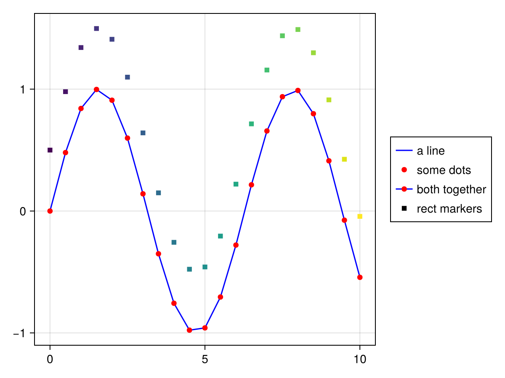


## Creating A Legend From An Axis {#Creating-A-Legend-From-An-Axis}

You can also create a Legend by passing it an axis object, like `Axis`, `LScene` or `Scene`. All plots that have a `label` attribute set will be put into the legend, in the order that they appear in the axis, and you can optionally pass a title as the third argument.
<a id="example-2f8ee39" />


```julia
using CairoMakie

f = Figure()

ax = f[1, 1] = Axis(f)

lines!(0..15, sin, label = "sin", color = :blue)
lines!(0..15, cos, label = "cos", color = :red)
lines!(0..15, x -> -cos(x), label = "-cos", color = :green)

f[1, 2] = Legend(f, ax, "Trig Functions", framevisible = false)

f
```

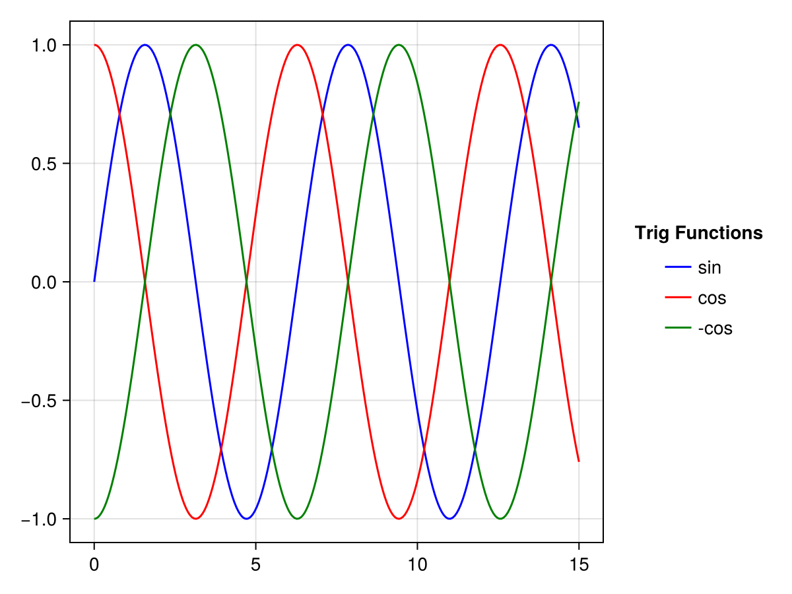


With the keywords `merge` and `unique` you can control how plot objects with the same labels are treated. If `merge` is `true`, all plot objects with the same label will be layered on top of each other into one legend entry. If `unique` is `true`, all plot objects with the same plot type and label will be reduced to one occurrence.
<a id="example-674be45" />


```julia
using CairoMakie

f = Figure()

traces = cumsum(randn(10, 5), dims = 1)

for (i, (merge, unique)) in enumerate(
        Iterators.product([false, true], [false true]))

    axis = Axis(f[fldmod1(i, 2)...],
        title = "merge = $merge, unique = $unique")

    for trace in eachcol(traces)
        lines!(trace, label = "single", color = (:black, 0.2))
    end

    mu = vec(sum(traces, dims = 2) ./ 5)
    lines!(mu, label = "mean")
    scatter!(mu, label = "mean")

    axislegend(axis, merge = merge, unique = unique)

end

f
```

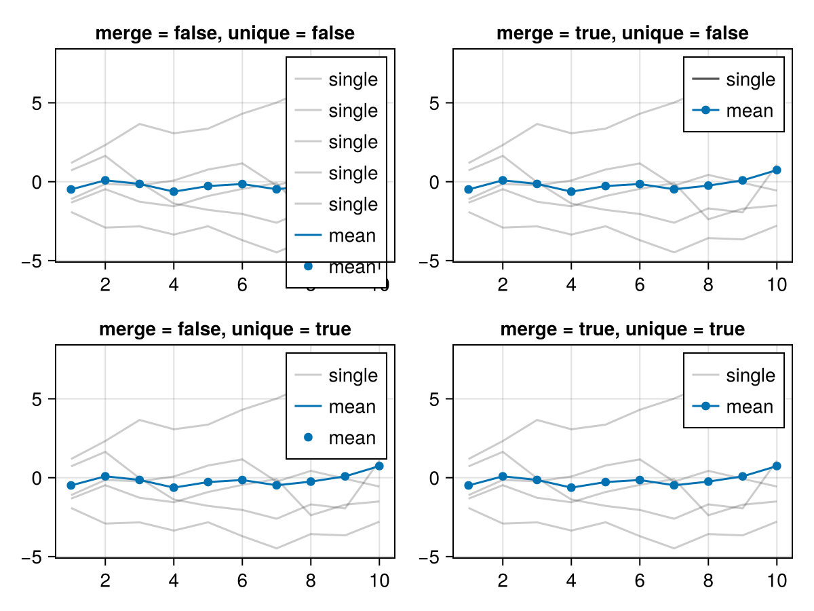


## Legend Inside An Axis {#Legend-Inside-An-Axis}

The `axislegend` function is a quick way to add a legend to an Axis. You can pass a selected axis plus arguments which are forwarded to the `Legend` constructor, or the current axis is used by default. If you pass only a string, it&#39;s used as the title with the current axis.

The position can be set via a shortcut symbol, first halign (l, r, c) then valign (b, t, c), such as :lt for left, top and :cb for center bottom. Or you can set position with tuple (halign, valign) with elements from 0 to 1: `position = (0.1, 0.9)`
<a id="example-3632d22" />


```julia
using CairoMakie

f = Figure()

ax = Axis(f[1, 1])

sc1 = scatter!(randn(10, 2), color = :red, label = "Red Dots")
sc2 = scatter!(randn(10, 2), color = :blue, label = "Blue Dots")
scatter!(randn(10, 2), color = :orange, label = "Orange Dots")
scatter!(randn(10, 2), color = :cyan, label = "Cyan Dots")

axislegend()

axislegend("Titled Legend", position = :lb)

axislegend(ax, [sc1, sc2], ["One", "Two"], "Selected Dots", position = :rb,
    orientation = :horizontal)

f
```

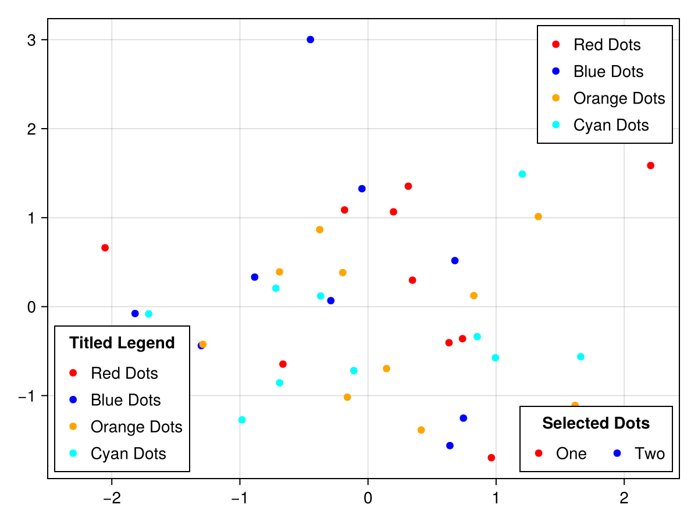


Alternatively, you can simply add a Legend to the same layout slot that an axis lives in. As long as the axis is bigger than the legend you can set the legend&#39;s `tellheight` and `tellwidth` to `false` and position it using the align variables. You can use the margin keyword to keep the legend from touching the axis spines.
<a id="example-be2d297" />


```julia
using CairoMakie

haligns = [:left, :right, :center]
valigns = [:top, :bottom, :center]

f = Figure()

Axis(f[1, 1])

xs = 0:0.1:10
lins = [lines!(xs, sin.(xs .* i), color = color)
    for (i, color) in zip(1:3, [:red, :blue, :green])]

for (j, ha, va) in zip(1:3, haligns, valigns)
    Legend(
        f[1, 1], lins, ["Line $i" for i in 1:3],
        "$ha & $va",
        tellheight = false,
        tellwidth = false,
        margin = (10, 10, 10, 10),
        halign = ha, valign = va, orientation = :horizontal
    )
end

f
```

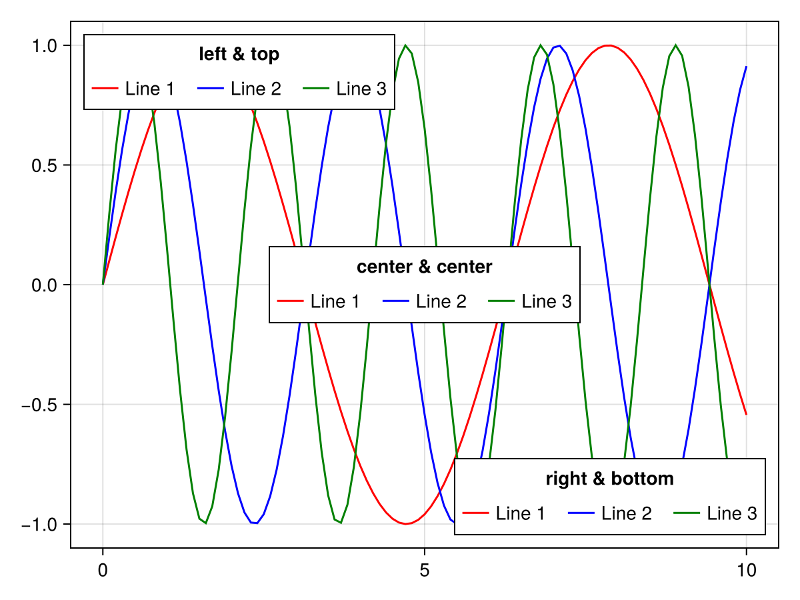


## Creating Legend Entries Manually {#Creating-Legend-Entries-Manually}

Sometimes you might want to construct legend entries from scratch to have maximum control. So far you can use `LineElement`s, `MarkerElement`s or `PolyElement`s. The attributes for these elements are the following (the `[]` parts can be left out when constructing these elements directly, but have to be fully written out for the attributes that the legend holds):

```julia
# LineElement
[line]points, [line]color, linestyle, linewidth

# MarkerElement
[marker]points, marker, markersize, [marker]color,
[marker]strokewidth, [marker]strokecolor

# PolyElement
[poly]points, [poly]color, [poly]strokewidth, [poly]strokecolor
```


The attributes `linepoints`, `markerpoints` and `polypoints` decide where in the legend entry patch rectangle the plot objects are placed. These values should be normalized to a 1 by 1 rectangle, and the final shape depends on the `patchsize` of the legend. For example, if you want wider line and poly markers, you could set the `patchsize` of the legend to `(50, 30)`.
<a id="example-728f62a" />


```julia
using CairoMakie

f = Figure()

Axis(f[1, 1])

elem_1 = [LineElement(color = :red, linestyle = nothing),
          MarkerElement(color = :blue, marker = 'x', markersize = 15,
          strokecolor = :black)]

elem_2 = [PolyElement(color = :red, strokecolor = :blue, strokewidth = 1),
          LineElement(color = :black, linestyle = :dash)]

elem_3 = LineElement(color = :green, linestyle = nothing,
        points = Point2f[(0, 0), (0, 1), (1, 0), (1, 1)])

elem_4 = MarkerElement(color = :blue, marker = 'π', markersize = 15,
        points = Point2f[(0.2, 0.2), (0.5, 0.8), (0.8, 0.2)])

elem_5 = PolyElement(color = :green, strokecolor = :black, strokewidth = 2,
        points = Point2f[(0, 0), (1, 0), (0, 1)])

Legend(f[1, 2],
    [elem_1, elem_2, elem_3, elem_4, elem_5],
    ["Line & Marker", "Poly & Line", "Line", "Marker", "Poly"],
    patchsize = (35, 35), rowgap = 10)

f
```

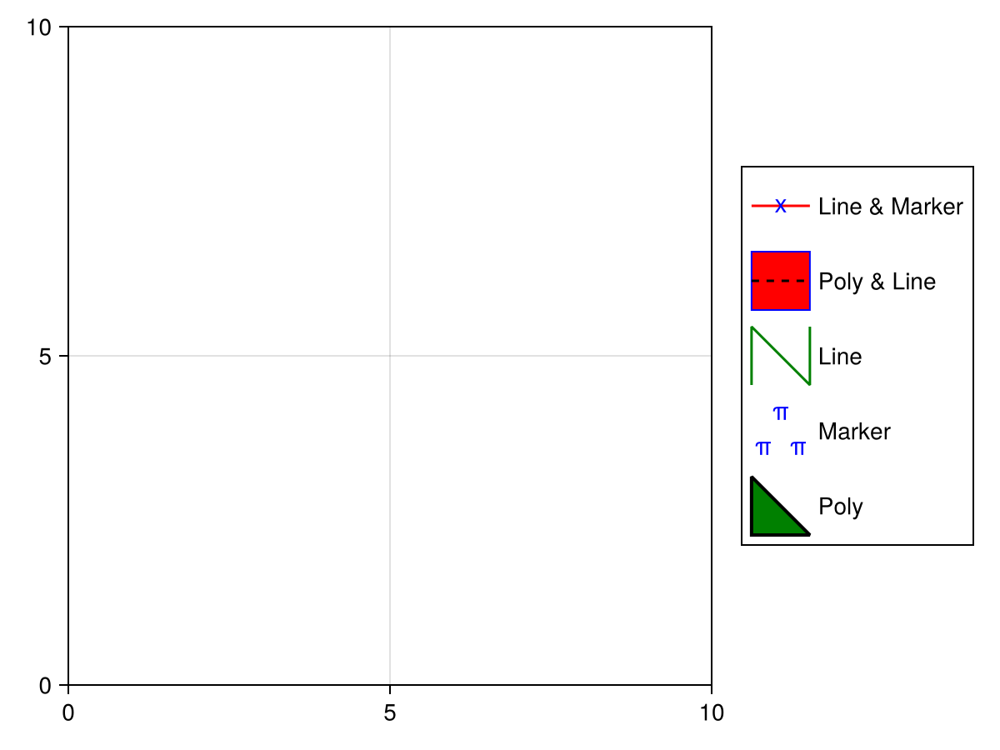


## Overriding legend entry attributes {#Overriding-legend-entry-attributes}

By default, legends inherit the visual attributes of the plots they belong to. Sometimes, it is necessary to override some of these attributes to make the legend more legible. You can pair a key-value object like a `NamedTuple` or a `Dict{Symbol}` to a plot&#39;s `label` to override its automatic legend entry, for example to increase the marker size of a `Scatter`:
<a id="example-ab60c21" />


```julia
using CairoMakie
f, ax, sc = scatter(
    cos.(range(0, 7pi, 100)),
    color = :black,
    markersize = 8,
    label = "cos" => (; markersize = 15)
)
scatter!(
    sin.(range(0, 7pi, 100)),
    color = :black,
    marker = :utriangle,
    markersize = 8,
    label = "sin" => (; markersize = 15)
)
Legend(f[1, 2], ax)
f
```

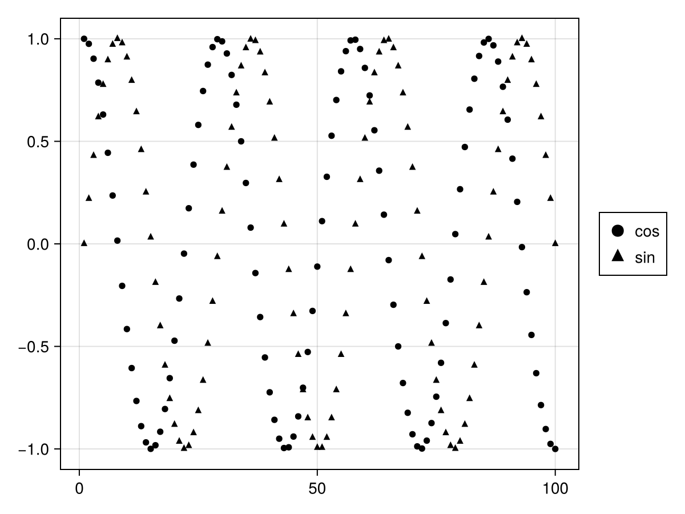


These are the attributes you can override (note that some of them have convenience aliases like `color` which applies to all elements while `polycolor` only applies to `PolyElement`s):
- `MarkerElement`
  - `[marker]points`, `markersize`, `[marker]strokewidth`, `[marker]color`, `[marker]strokecolor`, `[marker]colorrange`, `[marker]colormap`
    
  
- `LineElement`
  - `[line]points`, `linewidth`, `[line]color`, `linestyle`, `[line]colorrange`, `[line]colormap`
    
  
- `PolyElement`
  - `[poly]points`, `[poly]strokewidth`, `[poly]color`, `[poly]strokecolor`, `[poly]colorrange`, `[poly]colormap`
    
  
- `MeshElement`
  - `mesh`, `color`, `colormap`, `colorrange`, `uv_transform`
    
  
- `ImageElement`
  - `limits`, `data`, `colormap`, `colorrange`, `interpolate`
    
  
- `MeshScatterElement`
  - `position`, `color`, `marker`, `markersize`, `rotation`, `colormap`, `colorrange`
    
  

Another common case is when you want to create a legend for a plot with a categorical colormap. By passing a vector of labels paired with overrides, you can create multiple entries with the correct colors:
<a id="example-2bcd8a9" />


```julia
using CairoMakie
f, ax, bp = barplot(
    1:5,
    [1, 3, 2, 5, 4],
    color = 1:5,
    colorrange = (1, 5),
    colormap = :Set1_5,
    label = [label => (; color = i)
        for (i, label) in enumerate(["red", "blue", "green", "purple", "orange"])]
)
Legend(f[1, 2], ax)
f
```

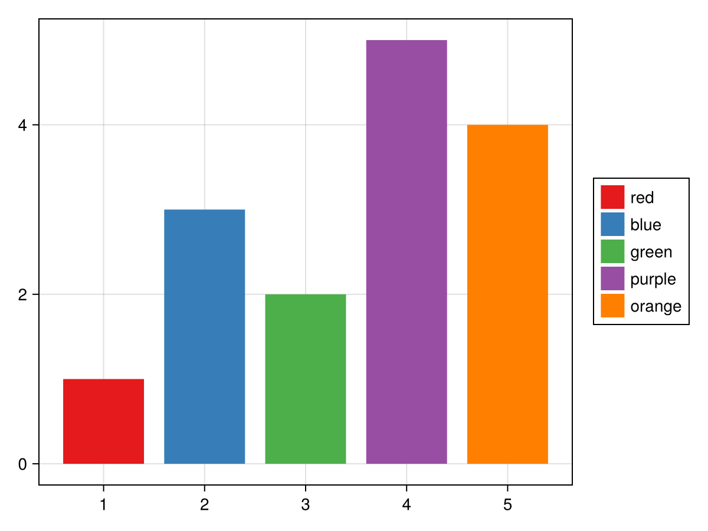


You may also override plots in the `Legend` constructor itself, in this case, you pair the overrides with the plots whose legend entries you want to override:
<a id="example-9c9bc43" />


```julia
using CairoMakie
f = Figure()
ax = Axis(f[1, 1])
li = lines!(ax, 1:5, linestyle = :dot)
sc = scatter!(ax, 1:5, markersize = 10)
Legend(
    f[1, 2],
    [
        sc => (; markersize = 20),
        li => (; linewidth = 3),
        [li, sc] => (; color = :red),
        [li => (; linewidth = 3), sc => (; markersize = 20)],
    ],
    ["Scatter", "Line", "Both", "Both 2"],
    patchsize = (40, 20),
)
f
```

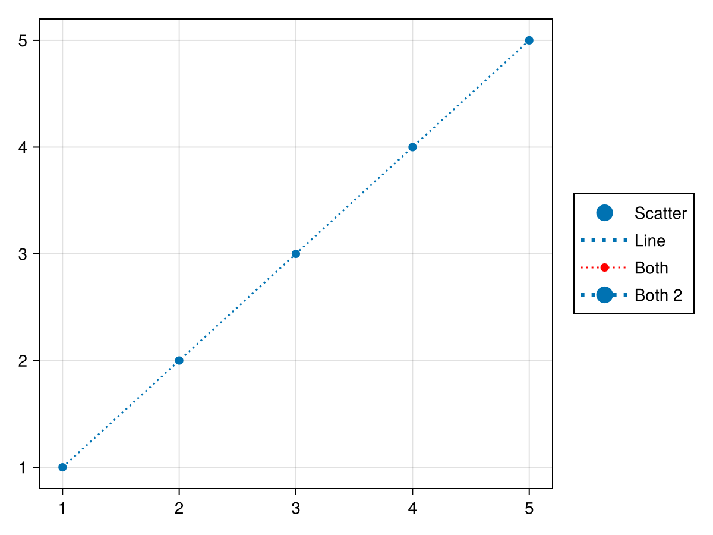


## Multi-Group Legends {#Multi-Group-Legends}

Sometimes a legend consists of multiple groups, for example in a plot where both marker size and color are varied and those properties need to be visualized separately, but still together in one legend. Each group&#39;s content is given as an array of elements and an array of labels, each within one collective array. You can shift the position of the titles relative to each group with the `titleposition` attribute, either `:left` or `:top`.
<a id="example-487f416" />


```julia
using CairoMakie

f = Figure()

markersizes = [5, 10, 15, 20]
colors = [:red, :green, :blue, :orange]

group_size = [MarkerElement(marker = :circle, color = :black,
    strokecolor = :transparent,
    markersize = ms) for ms in markersizes]

group_color = [PolyElement(color = color, strokecolor = :transparent)
    for color in colors]

legends = [Legend(f,
    [group_size, group_color],
    [string.(markersizes), string.(colors)],
    ["Size", "Color"], tellheight = true) for _ in 1:4]

f[1, 1:2] = legends[1:2]
f[2, :] = legends[3]
f[3, :] = legends[4]

for l in legends[3:4]
    l.orientation = :horizontal
    l.tellheight = true
    l.tellwidth = false
end

legends[2].titleposition = :left
legends[4].titleposition = :left

legends[1].nbanks = 2
legends[4].nbanks = 2

Label(f[1, 1, Left()], "titleposition = :top\norientation = :vertical\nnbanks = 2", font = :italic, padding = (0, 10, 0, 0))
Label(f[1, 2, Right()], "titleposition = :left\norientation = :vertical\nnbanks = 1", font = :italic, padding = (10, 0, 0, 0))
Label(f[2, 1:2, Top()], "titleposition = :top, orientation = :horizontal\nnbanks = 1", font = :italic)
Label(f[3, 1:2, Top()], "titleposition = :left, orientation = :horizontal\nnbanks = 2", font = :italic)

f
```

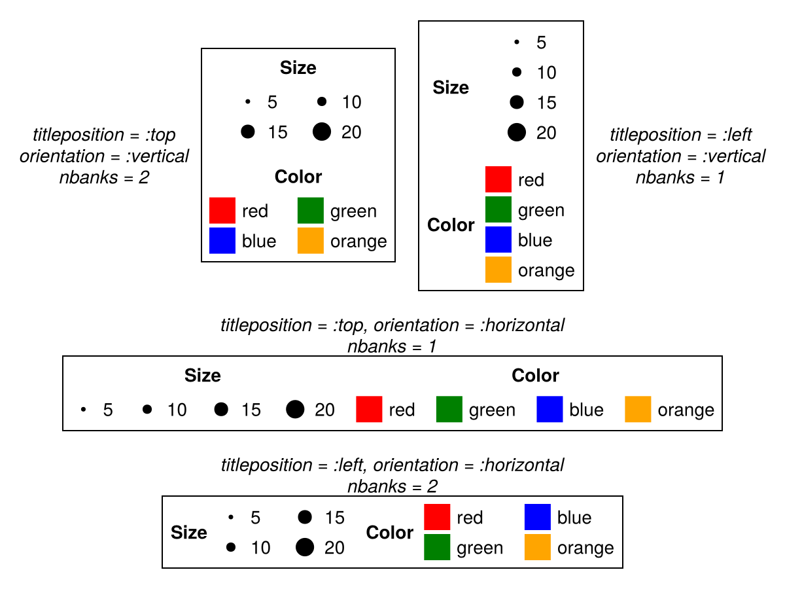


## Legend Interactivity {#Legend-Interactivity}

The Legend can be interacted with to show or hide connected plots. A left click on a specific element will toggle the visibility of the connected plots. A right click anywhere in the Legend will toggle the visibility of all plots associated with every element. A middle click will toggle all plots if they have the same visibility state or make all visible if they do not. Note that if you construct elements (MarkerElement, PolyElement, etc.) yourself, you need to also pass a plot or vector of plots as the first argument to enable these interactions.

```julia
using GLMakie

fig = Figure(size = (600, 450))
ax = Axis(fig[1, 1])
lines!(ax, Rect2f(-1,-1,2,2), linewidth = 5, color = RGBf(0.3, 0.5, 1), label = "blue line")
scatter!(ax, Rect2f(-1,-1,2,2), markersize = 30, color = :orange, label = "orange scatter")
lines!(ax, Circle(Point2f(0), 1), linewidth = 5, color = :darkgreen, label = "green circle")
leg = axislegend(ax, position = (:center, :center))
fig
```

<video autoplay loop muted playsinline src="./legend_interaction_example.mp4" width="600"/>


## Attributes {#Attributes}

### alignmode {#alignmode}

Defaults to `Inside()`

The align mode of the legend in its parent GridLayout.

### alpha {#alpha}

Defaults to `1`

The default alpha for legend elements

### backgroundcolor {#backgroundcolor}

Defaults to `:white`

The background color of the legend.

### bgcolor {#bgcolor}

Defaults to `nothing`

The background color of the legend. DEPRECATED - use `backgroundcolor` instead.

### colgap {#colgap}

Defaults to `16`

The gap between the label of one legend entry and the patch of the next.
<a id="example-ec51dd9" />


```julia
using CairoMakie
fig = Figure()
ax = Axis(fig[1, 1])
lines!(ax, 1:10, linestyle = :dash, label = "Line")
poly!(ax, [(5, 0), (10, 0), (7.5, 5)], label = "Poly")
scatter!(ax, 4:13, label = "Scatter")
Legend(fig[1, 2], ax, "Default", nbanks = 2)
Legend(fig[1, 3], ax, "colgap = 40", nbanks = 2, colgap = 40)
fig
```

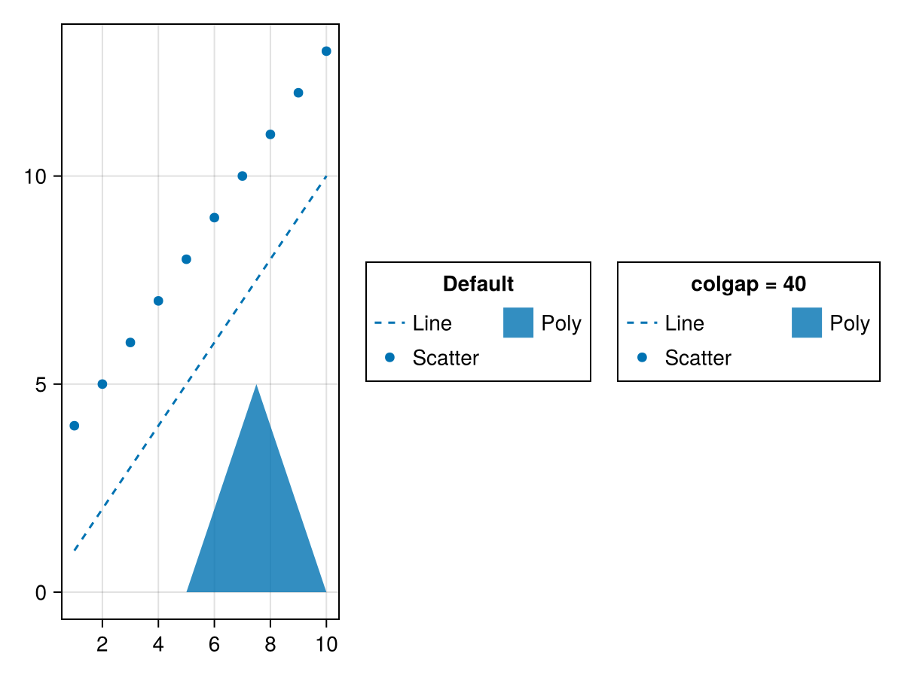


### framecolor {#framecolor}

Defaults to `:black`

The color of the legend border.

### framevisible {#framevisible}

Defaults to `true`

Controls if the legend border is visible.

### framewidth {#framewidth}

Defaults to `1.0`

The line width of the legend border.

### gridshalign {#gridshalign}

Defaults to `:center`

The horizontal alignment of entry groups in their parent GridLayout.

### gridsvalign {#gridsvalign}

Defaults to `:center`

The vertical alignment of entry groups in their parent GridLayout.

### groupgap {#groupgap}

Defaults to `16`

The gap between each group and the next.
<a id="example-c8ccb89" />


```julia
using CairoMakie
fig = Figure()
ax = Axis(fig[1, 1])
lin = lines!(ax, 1:10, linestyle = :dash)
pol = poly!(ax, [(5, 0), (10, 0), (7.5, 5)])
sca = scatter!(ax, 4:13)
Legend(fig[1, 2],
    [[lin], [pol], [sca]],
    [["Line"], ["Poly"], ["Scatter"]],
    ["Default", "Group 2", "Group 3"];

)
Legend(fig[1, 3],
    [[lin], [pol], [sca]],
    [["Line"], ["Poly"], ["Scatter"]],
    ["groupgap = 30", "Group 2", "Group 3"];
    groupgap = 30,
)
fig
```

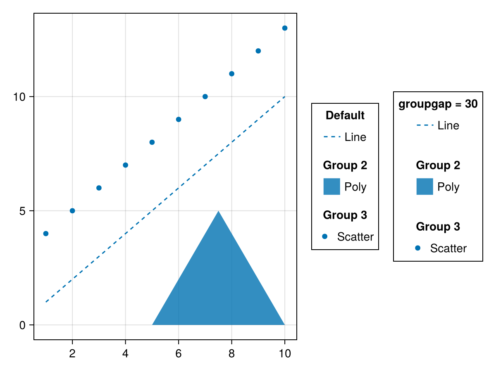


### halign {#halign}

Defaults to `:center`

The horizontal alignment of the legend in its suggested bounding box.

### heatmapcolorrange {#heatmapcolorrange}

Defaults to `automatic`

The default colorrange for HeatmapElements. If not set this will be derived from heatmapvalues.

### heatmaplimits {#heatmaplimits}

Defaults to `(0 .. 1, 0 .. 1)`

The default (x, y) limits (or vectors) used for HeatmapElements in normalized coordinates relative to each label patch.

### heatmapvalues {#heatmapvalues}

Defaults to `[0 0.3; 0.6 1]`

The default values used for HeatmapElements.

### height {#height}

Defaults to `Auto()`

The height setting of the legend.

### imagecolorrange {#imagecolorrange}

Defaults to `automatic`

The default colorrange for ImageElements. If not set this will be derived from imagevalues.

### imagelimits {#imagelimits}

Defaults to `(0 .. 1, 0 .. 1)`

The default (x, y) limits used for ImageElements in normalized coordinates relative to each label patch.

### imagevalues {#imagevalues}

Defaults to `[0 0.3; 0.6 1]`

The default values (or colors) used for ImageElements.

### label {#label}

Defaults to `"undefined"`

The default entry label.

### labelcolor {#labelcolor}

Defaults to `@inherit :textcolor :black`

The color of the entry labels.

### labelfont {#labelfont}

Defaults to `:regular`

The font family of the entry labels.

### labelhalign {#labelhalign}

Defaults to `:left`

The horizontal alignment of the entry labels.

### labeljustification {#labeljustification}

Defaults to `automatic`

The justification of the label text. Default is `automatic`, which will set the justification to labelhalign.

### labelsize {#labelsize}

Defaults to `@inherit :fontsize 16.0f0`

The font size of the entry labels.

### labelvalign {#labelvalign}

Defaults to `:center`

The vertical alignment of the entry labels.

### linecolor {#linecolor}

Defaults to `theme(scene, :linecolor)`

The default line color used for LineElements

### linecolormap {#linecolormap}

Defaults to `theme(scene, :colormap)`

The default colormap for LineElements

### linecolorrange {#linecolorrange}

Defaults to `automatic`

The default colorrange for LineElements

### linepoints {#linepoints}

Defaults to `[Point2f(0, 0.5), Point2f(1, 0.5)]`

The default points used for LineElements in normalized coordinates relative to each label patch.

### linestyle {#linestyle}

Defaults to `:solid`

The default line style used for LineElements

### linewidth {#linewidth}

Defaults to `theme(scene, :linewidth)`

The default line width used for LineElements.

### margin {#margin}

Defaults to `(0.0f0, 0.0f0, 0.0f0, 0.0f0)`

The additional space between the legend and its suggested boundingbox.

### marker {#marker}

Defaults to `theme(scene, :marker)`

The default marker for MarkerElements

### markercolor {#markercolor}

Defaults to `theme(scene, :markercolor)`

The default marker color for MarkerElements

### markercolormap {#markercolormap}

Defaults to `theme(scene, :colormap)`

The default marker colormap for MarkerElements

### markercolorrange {#markercolorrange}

Defaults to `automatic`

The default marker colorrange for MarkerElements

### markerpoints {#markerpoints}

Defaults to `[Point2f(0.5, 0.5)]`

The default marker points used for MarkerElements in normalized coordinates relative to each label patch.

### markersize {#markersize}

Defaults to `theme(scene, :markersize)`

The default marker size used for MarkerElements.

### markerstrokecolor {#markerstrokecolor}

Defaults to `theme(scene, :markerstrokecolor)`

The default marker stroke color used for MarkerElements.

### markerstrokewidth {#markerstrokewidth}

Defaults to `theme(scene, :markerstrokewidth)`

The default marker stroke width used for MarkerElements.

### mesh {#mesh}

Defaults to `Rect3f(Point3f(-0.7), Vec3f(1.4))`

The default mesh used for MeshElements. For 3D elements the camera is positioned at (1, 1, 1), looking towards (0, 0, 0) with z being up.

### meshcolor {#meshcolor}

Defaults to `(wong_colors())[1]`

The default mesh color used for MeshElements.

### meshcolormap {#meshcolormap}

Defaults to `theme(scene, :colormap)`

The default colormap for MeshElements

### meshcolorrange {#meshcolorrange}

Defaults to `automatic`

The default colorrange for MeshElements.

### meshscattercolor {#meshscattercolor}

Defaults to `theme(scene, :markercolor)`

The default marker color for MeshScatterElements

### meshscattercolormap {#meshscattercolormap}

Defaults to `theme(scene, :colormap)`

The default marker colormap for MeshScatterElements

### meshscattercolorrange {#meshscattercolorrange}

Defaults to `automatic`

The default marker colorrange for MeshScatterElements

### meshscattermarker {#meshscattermarker}

Defaults to `Sphere(Point3f(0), 1.0f0)`

The default marker for MeshScatterElements

### meshscatterpoints {#meshscatterpoints}

Defaults to `[Point3f(0)]`

The default marker points used for MeshScatterElements. For 3D elements the camera is positioned at (1, 1, 1), looking towards (0, 0, 0) with z being up.

### meshscatterrotation {#meshscatterrotation}

Defaults to `Quaternionf(0, 0, 0, 1)`

The default marker rotation used for MeshScatterElements.

### meshscattersize {#meshscattersize}

Defaults to `0.8`

The default marker size used for MeshScatterElements.

### nbanks {#nbanks}

Defaults to `1`

The number of banks in which the legend entries are grouped. Columns if the legend is vertically oriented, otherwise rows.
<a id="example-f3088ee" />


```julia
using CairoMakie
fig = Figure()
ax = Axis(fig[1, 1])
lines!(ax, 1:10, linestyle = :dash, label = "Line")
poly!(ax, [(5, 0), (10, 0), (7.5, 5)], label = "Poly")
scatter!(ax, 4:13, label = "Scatter")
grid = GridLayout(fig[1, 2], tellheight = false)
Legend(grid[1, 1], ax, "nbanks = 1", nbanks = 1, tellheight = true)
Legend(grid[1, 2], ax, "nbanks = 2", nbanks = 2, tellheight = true)
Legend(grid[2, :], ax, "nbanks = 3", nbanks = 3, tellheight = true)
fig
```

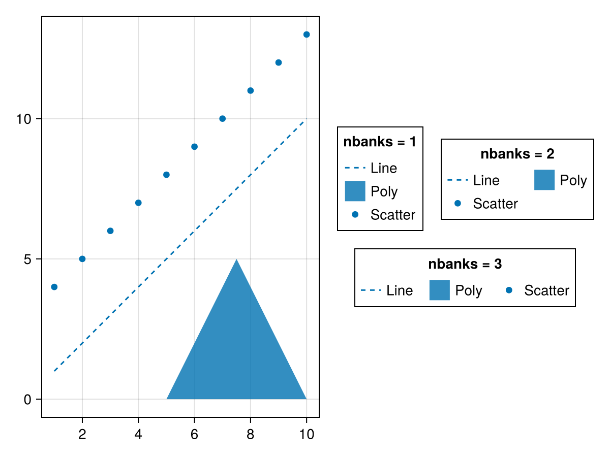

<a id="example-190c9de" />


```julia
using CairoMakie
fig = Figure()
ax = Axis(fig[1, 1])
lines!(ax, 1:10, linestyle = :dash, label = "Line")
poly!(ax, [(5, 0), (10, 0), (7.5, 5)], label = "Poly")
scatter!(ax, 4:13, label = "Scatter")
grid = GridLayout(fig[2, 1], tellwidth = false)
Legend(grid[1, 1], ax, "nbanks = 1", nbanks = 1,
    orientation = :horizontal, tellwidth = true)
Legend(grid[2, 1], ax, "nbanks = 2", nbanks = 2,
    orientation = :horizontal, tellwidth = true)
Legend(grid[:, 2], ax, "nbanks = 3", nbanks = 3,
    orientation = :horizontal, tellwidth = true)
fig
```

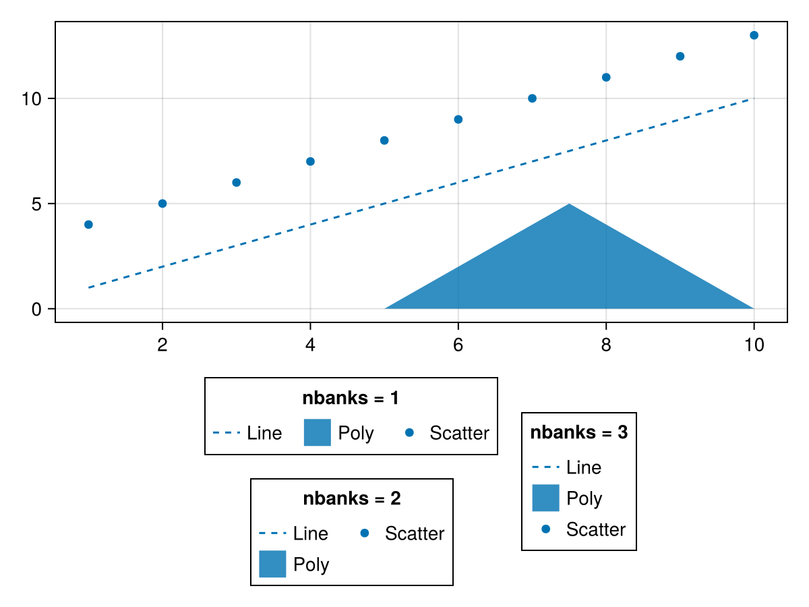


### orientation {#orientation}

Defaults to `:vertical`

The orientation of the legend (:horizontal or :vertical).
<a id="example-fddfe34" />


```julia
using CairoMakie
fig = Figure()
ax = Axis(fig[1, 1])
lines!(ax, 1:10, linestyle = :dash, label = "Line")
poly!(ax, [(5, 0), (10, 0), (7.5, 5)], label = "Poly")
scatter!(ax, 4:13, label = "Scatter")
Legend(fig[2, 1], ax, "orientation
= :horizontal", orientation = :horizontal)
Legend(fig[1, 2], ax, "orientation
= :vertical", orientation = :vertical)
fig
```

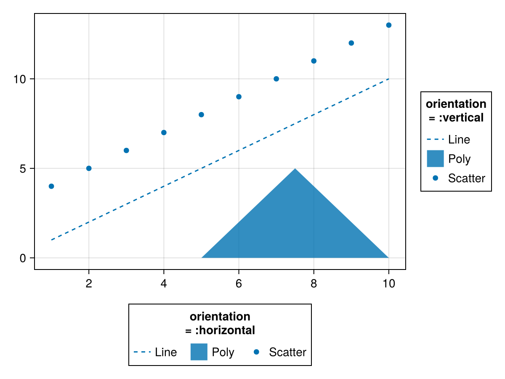


### padding {#padding}

Defaults to `(6.0f0, 6.0f0, 6.0f0, 6.0f0)`

The additional space between the legend content and the border.

### patchcolor {#patchcolor}

Defaults to `:transparent`

The color of the patches containing the legend markers.

### patchlabelgap {#patchlabelgap}

Defaults to `5`

The gap between the patch and the label of each legend entry.
<a id="example-f0be106" />


```julia
using CairoMakie
fig = Figure()
ax = Axis(fig[1, 1])
lines!(ax, 1:10, linestyle = :dash, label = "Line")
poly!(ax, [(5, 0), (10, 0), (7.5, 5)], label = "Poly")
scatter!(ax, 4:13, label = "Scatter")
Legend(fig[1, 2], ax, "Default")
Legend(fig[1, 3], ax, "patchlabelgap
= 20", patchlabelgap = 20)
fig
```

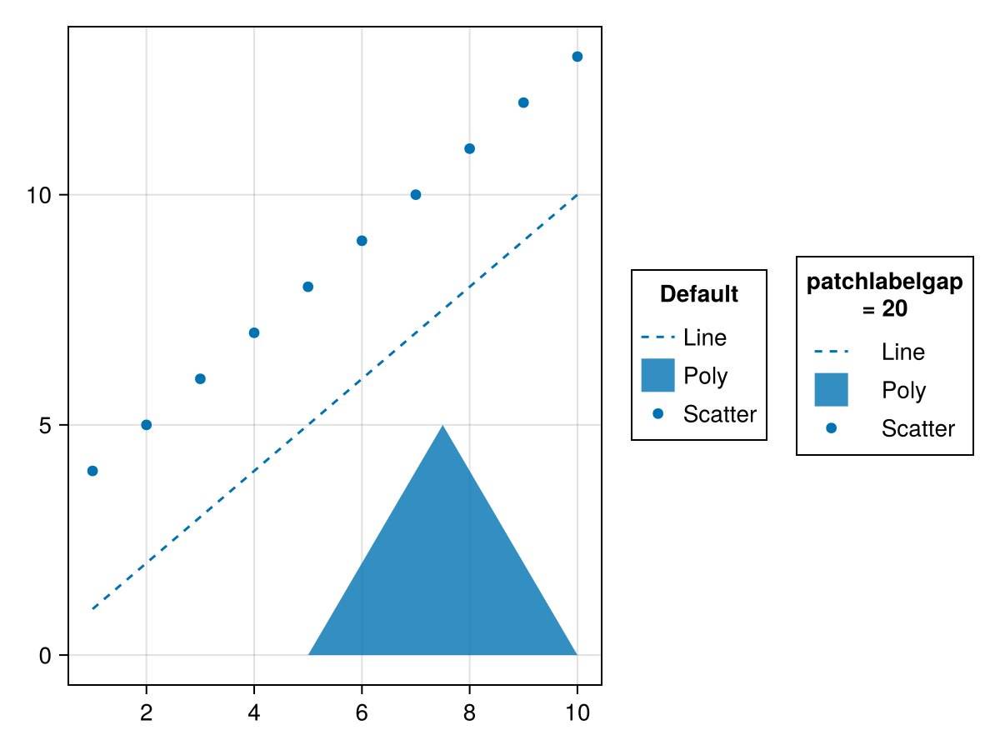


### patchsize {#patchsize}

Defaults to `(20.0f0, 20.0f0)`

The size of the rectangles containing the legend markers. It can help to increase the width if line patterns are not clearly visible with the default size.
<a id="example-fb371f6" />


```julia
using CairoMakie
fig = Figure()
ax = Axis(fig[1, 1])
lines!(ax, 1:10, linestyle = :dash, label = "Line")
poly!(ax, [(5, 0), (10, 0), (7.5, 5)], label = "Poly")
scatter!(ax, 4:13, label = "Scatter")
Legend(fig[1, 2], ax, "Default")
Legend(fig[1, 3], ax, "(40, 20)", patchsize = (40, 20))
fig
```

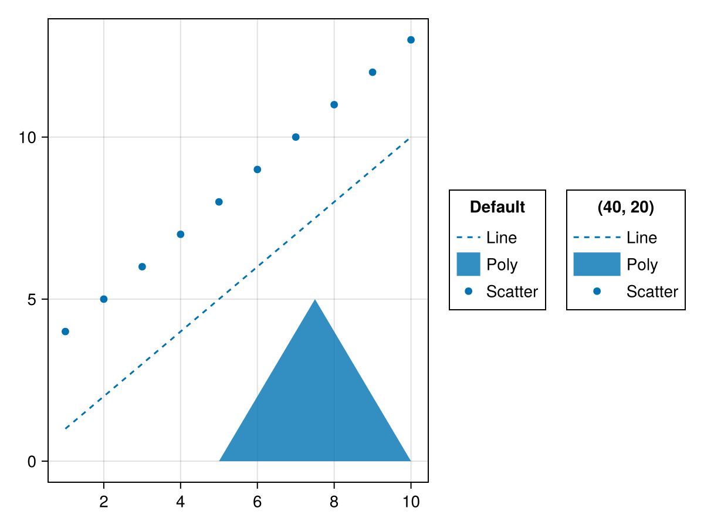


### patchstrokecolor {#patchstrokecolor}

Defaults to `:transparent`

The color of the border of the patches containing the legend markers.

### patchstrokewidth {#patchstrokewidth}

Defaults to `1.0`

The line width of the border of the patches containing the legend markers.

### polycolor {#polycolor}

Defaults to `theme(scene, :patchcolor)`

The default poly color used for PolyElements.

### polycolormap {#polycolormap}

Defaults to `theme(scene, :colormap)`

The default colormap for PolyElements

### polycolorrange {#polycolorrange}

Defaults to `automatic`

The default colorrange for PolyElements

### polypoints {#polypoints}

Defaults to `[Point2f(0, 0), Point2f(1, 0), Point2f(1, 1), Point2f(0, 1)]`

The default poly points used for PolyElements in normalized coordinates relative to each label patch.

### polystrokecolor {#polystrokecolor}

Defaults to `theme(scene, :patchstrokecolor)`

The default poly stroke color used for PolyElements.

### polystrokewidth {#polystrokewidth}

Defaults to `theme(scene, :patchstrokewidth)`

The default poly stroke width used for PolyElements.

### rowgap {#rowgap}

Defaults to `3`

The gap between the entry rows.
<a id="example-cbc4cfd" />


```julia
using CairoMakie
fig = Figure()
ax = Axis(fig[1, 1])
lines!(ax, 1:10, linestyle = :dash, label = "Line")
poly!(ax, [(5, 0), (10, 0), (7.5, 5)], label = "Poly")
scatter!(ax, 4:13, label = "Scatter")
Legend(fig[1, 2], ax, "Default")
Legend(fig[1, 3], ax, "rowgap = 10", rowgap = 10)
fig
```

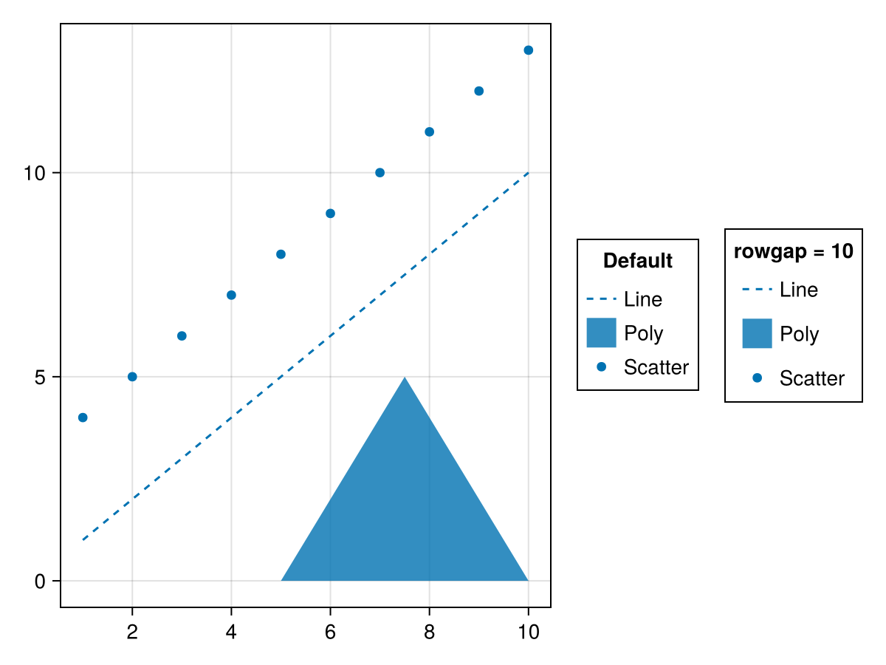


### surfacecolormap {#surfacecolormap}

Defaults to `theme(scene, :colormap)`

The default colormap for surface-based MeshElements

### surfacecolorrange {#surfacecolorrange}

Defaults to `automatic`

The default colorrange for surface-based MeshElements. If not set this will be derived from surfacevalues.

### surfacedata {#surfacedata}

Defaults to `(-0.7 .. 0.7, -0.7 .. 0.7, [-0.007 * x ^ 3 * (1 - 0.05 * y ^ 2) for x = -5:5, y = -5:5])`

The default (x, y, z) data used for surface-based MeshElements. For 3D elements the camera is positioned at (1, 1, 1), looking towards (0, 0, 0) with z being up.

### surfacevalues {#surfacevalues}

Defaults to `automatic`

The default values/colors used for surface-based MeshElements. These need to match the size of zs. If not set the z values will be used.

### tellheight {#tellheight}

Defaults to `automatic`

Controls if the parent layout can adjust to this element&#39;s height

### tellwidth {#tellwidth}

Defaults to `automatic`

Controls if the parent layout can adjust to this element&#39;s width

### titlecolor {#titlecolor}

Defaults to `@inherit :textcolor :black`

The color of the legend titles

### titlefont {#titlefont}

Defaults to `:bold`

The font family of the legend group titles.

### titlegap {#titlegap}

Defaults to `8`

The gap between each group title and its group.

### titlehalign {#titlehalign}

Defaults to `:center`

The horizontal alignment of the legend group titles.

### titleposition {#titleposition}

Defaults to `:top`

The group title positions relative to their groups. Can be `:top` or `:left`.
<a id="example-ec1c01a" />


```julia
using CairoMakie
fig = Figure()
ax = Axis(fig[1, 1])
lines!(ax, 1:10, linestyle = :dash, label = "Line")
poly!(ax, [(5, 0), (10, 0), (7.5, 5)], label = "Poly")
scatter!(ax, 4:13, label = "Scatter")
Legend(fig[1, 2], ax, "titleposition
= :top", titleposition = :top)
Legend(fig[1, 3], ax, "titleposition
= :left", titleposition = :left)
fig
```

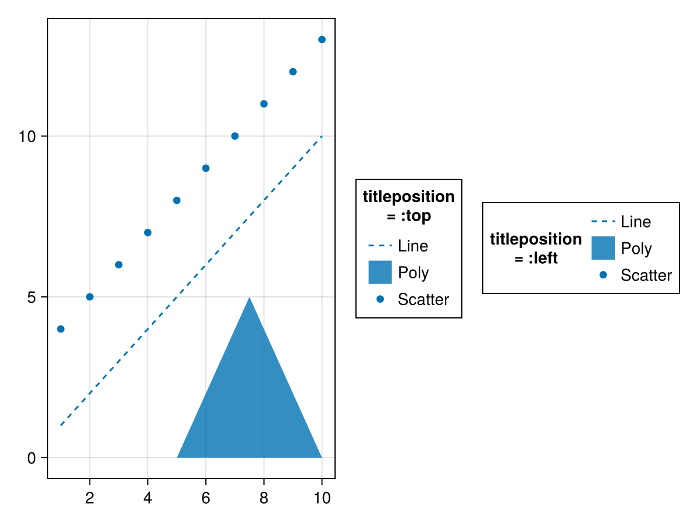


### titlesize {#titlesize}

Defaults to `@inherit :fontsize 16.0f0`

The font size of the legend group titles.

### titlevalign {#titlevalign}

Defaults to `:center`

The vertical alignment of the legend group titles.

### titlevisible {#titlevisible}

Defaults to `true`

Controls if the legend titles are visible.

### valign {#valign}

Defaults to `:center`

The vertical alignment of the legend in its suggested bounding box.

### width {#width}

Defaults to `Auto()`

The width setting of the legend.
