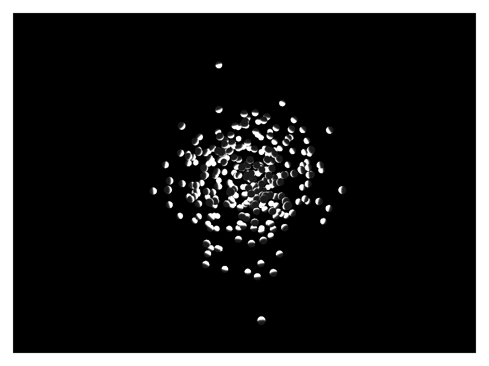

# LScene {#LScene}

If you need a normal Makie scene in a layout, for example for 3D plots, you have to use `LScene` right now. It&#39;s just a wrapper around the normal `Scene` that makes it block. The underlying Scene is accessible via the `scene` field. You can plot into the `LScene` directly, though.

You can pass keyword arguments to the underlying `Scene` object to the `scenekw` keyword. Currently, it can be necessary to pass a couple of attributes explicitly to make sure they are not inherited from the main scene. To see what parameters are applicable, have a look at the [scene docs](/explanations/scenes#Scenes)
<a id="example-77dcd42" />


```julia
using GLMakie

fig = Figure()
pl = PointLight(Point3f(0), RGBf(20, 20, 20))
al = AmbientLight(RGBf(0.2, 0.2, 0.2))
lscene = LScene(fig[1, 1], show_axis=false, scenekw = (lights = [pl, al], backgroundcolor=:black, clear=true))
# now you can plot into lscene like you're used to
p = meshscatter!(lscene, randn(300, 3), color=:gray)
fig
```




## Attributes {#Attributes}

### alignmode {#alignmode}

Defaults to `Inside()`

The alignment of the scene in its suggested bounding box.

### dim1_conversion {#dim1_conversion}

Defaults to `nothing`

Global state for the x dimension conversion.

### dim2_conversion {#dim2_conversion}

Defaults to `nothing`

Global state for the y dimension conversion.

### dim3_conversion {#dim3_conversion}

Defaults to `nothing`

Global state for the z dimension conversion.

### halign {#halign}

Defaults to `:center`

The horizontal alignment of the scene in its suggested bounding box.

### height {#height}

Defaults to `nothing`

The height setting of the scene.

### show_axis {#show_axis}

Defaults to `true`

Controls the visibility of the 3D axis plot object.

### tellheight {#tellheight}

Defaults to `true`

Controls if the parent layout can adjust to this element&#39;s height

### tellwidth {#tellwidth}

Defaults to `true`

Controls if the parent layout can adjust to this element&#39;s width

### valign {#valign}

Defaults to `:center`

The vertical alignment of the scene in its suggested bounding box.

### width {#width}

Defaults to `nothing`

The width setting of the scene.
