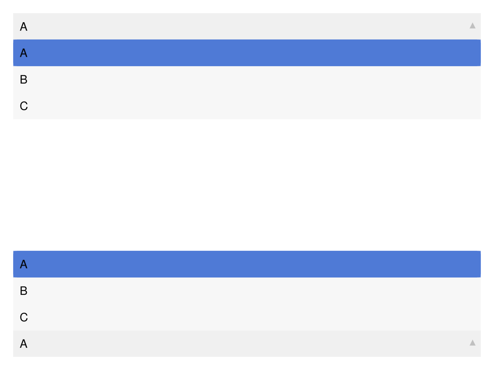

# Menu {#Menu}

```julia
using GLMakie

fig = Figure()

menu = Menu(fig, options = ["viridis", "heat", "blues"], default = "blues")

funcs = [sqrt, x->x^2, sin, cos]

menu2 = Menu(fig,
    options = zip(["Square Root", "Square", "Sine", "Cosine"], funcs),
    default = "Square")

fig[1, 1] = vgrid!(
    Label(fig, "Colormap", width = nothing),
    menu,
    Label(fig, "Function", width = nothing),
    menu2;
    tellheight = false, width = 200)

ax = Axis(fig[1, 2])

func = Observable{Any}(funcs[1])

ys = lift(func) do f
    f.(0:0.3:10)
end
scat = scatter!(ax, ys, markersize = 10px, color = ys)

cb = Colorbar(fig[1, 3], scat)

on(menu.selection) do s
    scat.colormap = s
end
notify(menu.selection)

on(menu2.selection) do s
    func[] = s
    autolimits!(ax)
end
notify(menu2.selection)

fig
```

<video autoplay loop muted playsinline src="./menu_example.mp4" width="600"/>


## Menu direction {#Menu-direction}

You can change the direction of the menu with `direction = :up` or `direction = :down`. By default, the direction is determined automatically to avoid cutoff at the figure boundaries.
<a id="example-c7a7ab9" />


```julia
using GLMakie

fig = Figure()

menu = Menu(fig[1, 1], options = ["A", "B", "C"])
menu2 = Menu(fig[3, 1], options = ["A", "B", "C"])

menu.is_open = true
menu2.is_open = true

fig
```




## Attributes {#Attributes}

### alignmode {#alignmode}

Defaults to `Inside()`

The alignment of the menu in its suggested bounding box.

### cell_color_active {#cell_color_active}

Defaults to `COLOR_ACCENT[]`

Cell color when active

### cell_color_hover {#cell_color_hover}

Defaults to `COLOR_ACCENT_DIMMED[]`

Cell color when hovered

### cell_color_inactive_even {#cell_color_inactive_even}

Defaults to `RGBf(0.97, 0.97, 0.97)`

Cell color when inactive even

### cell_color_inactive_odd {#cell_color_inactive_odd}

Defaults to `RGBf(0.97, 0.97, 0.97)`

Cell color when inactive odd

### direction {#direction}

Defaults to `automatic`

The opening direction of the menu (:up or :down)

### dropdown_arrow_color {#dropdown_arrow_color}

Defaults to `(:black, 0.2)`

Color of the dropdown arrow

### dropdown_arrow_size {#dropdown_arrow_size}

Defaults to `10`

Size of the dropdown arrow

### fontsize {#fontsize}

Defaults to `@inherit :fontsize 16.0f0`

Font size of the cell texts

### halign {#halign}

Defaults to `:center`

The horizontal alignment of the menu in its suggested bounding box.

### height {#height}

Defaults to `Auto()`

The height setting of the menu.

### i_selected {#i_selected}

Defaults to `0`

Index of selected item. Should not be set by the user.

### is_open {#is_open}

Defaults to `false`

Is the menu showing the available options

### options {#options}

Defaults to `["no options"]`

The list of options selectable in the menu. This can be any iterable of a mixture of strings and containers with one string and one other value. If an entry is just a string, that string is both label and selection. If an entry is a container with one string and one other value, the string is the label and the other value is the selection.

### prompt {#prompt}

Defaults to `"Select..."`

The default message prompting a selection when i == 0

### scroll_speed {#scroll_speed}

Defaults to `15.0`

Speed of scrolling in large Menu lists.

### selection {#selection}

Defaults to `nothing`

Selected item value. This is the output observable that you should listen to to react to menu interaction. Should not be set by the user.

### selection_cell_color_inactive {#selection_cell_color_inactive}

Defaults to `RGBf(0.94, 0.94, 0.94)`

Selection cell color when inactive

### tellheight {#tellheight}

Defaults to `true`

Controls if the parent layout can adjust to this element&#39;s height

### tellwidth {#tellwidth}

Defaults to `true`

Controls if the parent layout can adjust to this element&#39;s width

### textcolor {#textcolor}

Defaults to `:black`

Color of entry texts

### textpadding {#textpadding}

Defaults to `(8, 10, 8, 8)`

Padding of entry texts

### valign {#valign}

Defaults to `:center`

The vertical alignment of the menu in its suggested bounding box.

### width {#width}

Defaults to `nothing`

The width setting of the menu.
