# PolarAxis {#PolarAxis}

The `PolarAxis` is an axis for data given in polar coordinates, i.e a radius and an angle. It is currently an experimental feature, meaning that some functionality might be missing or broken, and that the `PolarAxis` is (more) open to breaking changes.

## Creating a PolarAxis {#Creating-a-PolarAxis}

Creating a `PolarAxis` works the same way as creating an `Axis`.
<a id="example-16b8e8e" />


```julia
using CairoMakie

f = Figure()

ax = PolarAxis(f[1, 1], title = "Title")

f
```

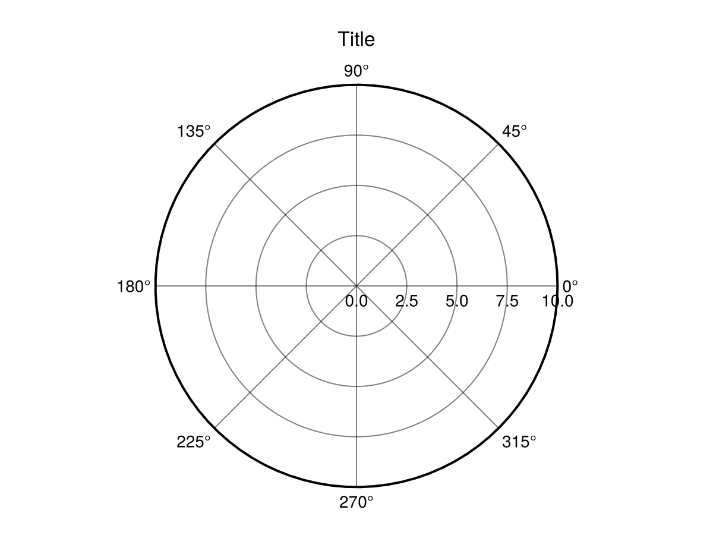


## Plotting into an PolarAxis {#Plotting-into-an-PolarAxis}

Like with an `Axis` you can use mutating 2D plot functions directly on a `PolarAxis`. The input arguments of the plot functions will then be interpreted in polar coordinates, i.e. as an angle (in radians) and a radius. The order of a arguments can be changed with `ax.theta_as_x`.
<a id="example-3619ffb" />


```julia
using CairoMakie
f = Figure(size = (800, 400))

ax = PolarAxis(f[1, 1], title = "Theta as x")
lineobject = lines!(ax, 0..2pi, sin, color = :red)

ax = PolarAxis(f[1, 2], title = "R as x", theta_as_x = false)
scatobject = scatter!(range(0, 10, length=100), cos, color = :orange)

f
```

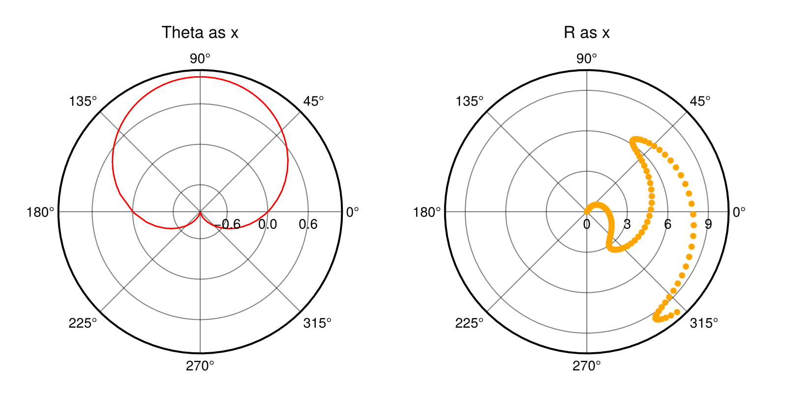


## PolarAxis Limits {#PolarAxis-Limits}

By default the PolarAxis will assume `po.rlimits[] = (0.0, nothing)` and `po.thetalimits[] = (0.0, 2pi)`, showing a full circle. You can adjust these limits to show different cut-outs of the PolarAxis. For example, we can limit `thetalimits` to a smaller range to generate a circle sector and further limit rmin through `rlimits` to cut out the center to an arc.
<a id="example-fabb71e" />


```julia
using CairoMakie
f = Figure(size = (600, 600))

ax = PolarAxis(f[1, 1], title = "Default")
lines!(ax, range(0, 8pi, length=300), range(0, 10, length=300))
ax = PolarAxis(f[1, 2], title = "thetalimits", thetalimits = (-pi/6, pi/6))
lines!(ax, range(0, 8pi, length=300), range(0, 10, length=300))

ax = PolarAxis(f[2, 1], title = "rlimits", rlimits = (5, 10))
lines!(ax, range(0, 8pi, length=300), range(0, 10, length=300))
ax = PolarAxis(f[2, 2], title = "both")
lines!(ax, range(0, 8pi, length=300), range(0, 10, length=300))
thetalims!(ax, -pi/6, pi/6)
rlims!(ax, 5, 10)

f
```

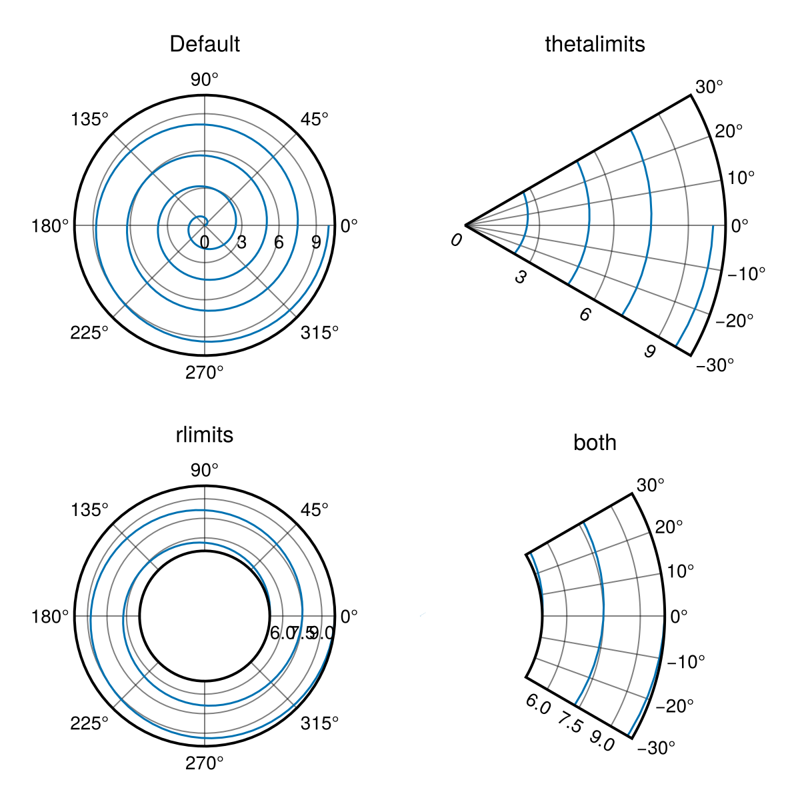


You can make further adjustments to the orientation of the PolarAxis by adjusting `ax.theta_0` and `ax.direction`. These adjust how angles are interpreted by the polar transform following the formula `output_angle = direction * (input_angle + theta_0)`.
<a id="example-abe5ff4" />


```julia
using CairoMakie
f = Figure()

ax = PolarAxis(f[1, 1], title = "Reoriented Axis", theta_0 = -pi/2, direction = -1)
lines!(ax, range(0, 8pi, length=300), range(0, 10, length=300))
thetalims!(ax, -pi/6, pi/6)
rlims!(ax, 5, 10)

f
```

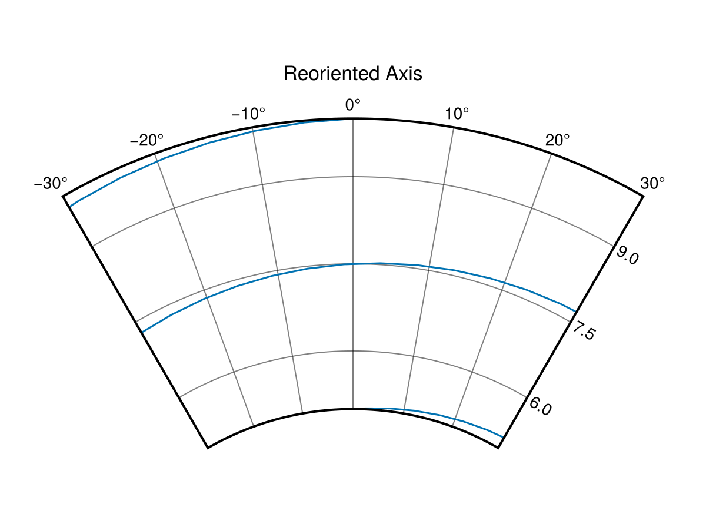


Note that by default translations in adjustments of rmin and thetalimits are blocked. These can be unblocked by calling `autolimits!(ax[, true])` which also tells the PolarAxis to derive r- and thetalimits freely from data, or by setting `ax.fixrmin[] = false` and `ax.thetazoomlock[] = false`.

## Plot type compatibility {#Plot-type-compatibility}

Not every plot type is compatible with the polar transform. For example `image` is not as it expects to be drawn on a rectangle. `heatmap` works to a degree in CairoMakie, but not GLMakie due to differences in the backend implementation. `surface` can be used as a replacement for `image` as it generates a triangle mesh. To avoid having the `surface` plot extend in z-direction and thus messing with render order it is recommended to pass the color-data through the `color` attribute and use a matrix of zeros for the z-data. As a replacement for `heatmap` you can use `voronoiplot`, which generates cells of arbitrary shape around points given to it. Here you will generally need to set `rlims!(ax, rmax)` yourself.
<a id="example-ef89054" />


```julia
using CairoMakie
f = Figure(size = (800, 500))

ax = PolarAxis(f[1, 1], title = "Surface")
rs = 0:10
phis = range(0, 2pi, 37)
cs = [r+cos(4phi) for phi in phis, r in rs]
p = surface!(ax, 0..2pi, 0..10, zeros(size(cs)), color = cs, shading = NoShading, colormap = :coolwarm)
ax.gridz[] = 100
tightlimits!(ax) # surface plots include padding by default
Colorbar(f[2, 1], p, vertical = false, flipaxis = false)

ax = PolarAxis(f[1, 2], title = "Voronoi")
rs = 1:10
phis = range(0, 2pi, 37)[1:36]
cs = [r+cos(4phi) for phi in phis, r in rs]
p = voronoiplot!(ax, phis, rs, cs, show_generators = false, strokewidth = 0)
rlims!(ax, 0.0, 10.5)
Colorbar(f[2, 2], p, vertical = false, flipaxis = false)

f
```

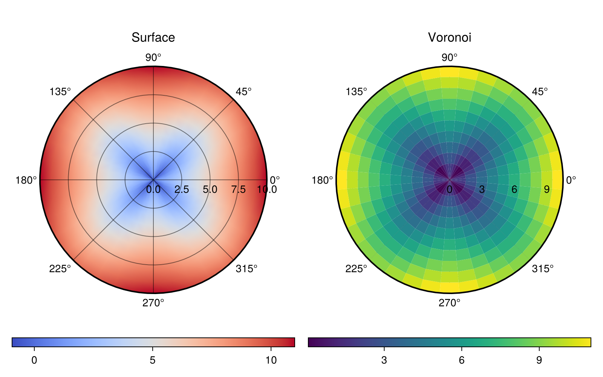


Note that in order to see the grid we need to adjust its depth with `ax.gridz[] = 100` (higher z means lower depth). The hard limits for `ax.gridz` are `(-10_000, 10_000)` with `9000` being a soft limit where axis components may order incorrectly.

## Hiding spines and decorations {#Hiding-spines-and-decorations}

For a `PolarAxis` we interpret the outer ring limiting the plotting area as the axis spine. You can manipulate it with the `spine...` attributes.
<a id="example-563d4cf" />


```julia
using CairoMakie
f = Figure(size = (800, 400))
ax1 = PolarAxis(f[1, 1], title = "No spine", spinevisible = false)
scatterlines!(ax1, range(0, 1, length=100), range(0, 10pi, length=100), color = 1:100)

ax2 = PolarAxis(f[1, 2], title = "Modified spine")
ax2.spinecolor[] = :red
ax2.spinestyle[] = :dash
ax2.spinewidth[] = 5
scatterlines!(ax2, range(0, 1, length=100), range(0, 10pi, length=100), color = 1:100)

f
```

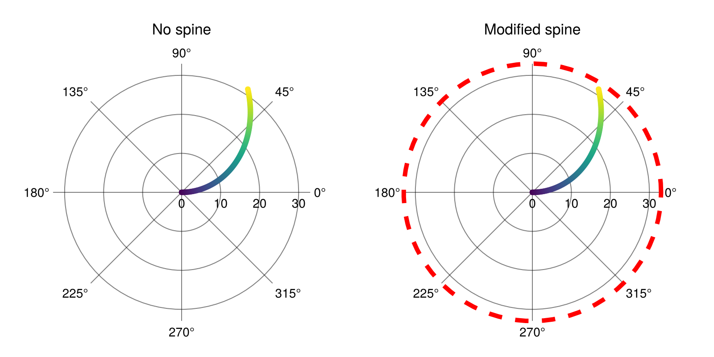


Decorations such as grid lines and tick labels can be adjusted through attributes in much the same way.
<a id="example-abf5100" />


```julia
using CairoMakie
f = Figure(size = (600, 600), backgroundcolor = :black)
ax = PolarAxis(
    f[1, 1],
    backgroundcolor = :black,
    # r minor grid
    rminorgridvisible = true, rminorgridcolor = :red,
    rminorgridwidth = 1.0, rminorgridstyle = :dash,
    # theta minor grid
    thetaminorgridvisible = true, thetaminorgridcolor = :lightblue,
    thetaminorgridwidth = 1.0, thetaminorgridstyle = :dash,
    # major grid
    rgridwidth = 2, rgridcolor = :red,
    thetagridwidth = 2, thetagridcolor = :lightblue,
    # r labels
    rticklabelsize = 18, rticklabelcolor = :red,
    rticklabelstrokewidth = 1.0, rticklabelstrokecolor = :white,
    # theta labels
    thetaticklabelsize = 18, thetaticklabelcolor = :lightblue
)

f
```

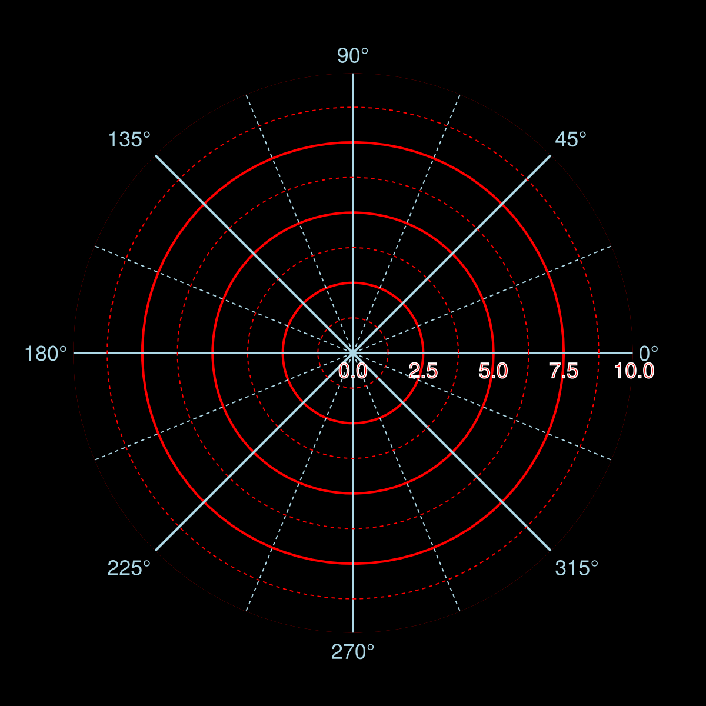


We can also hide the spine after creation with `hidespines!(ax)`. And, hide the ticklabels, grid, and/or minorgrid with `hidedecorations!`, `hiderdecorations`, and `hidethetadecorations!`.
<a id="example-7cc4c5c" />


```julia
using CairoMakie
fig = Figure()
fullaxis(figpos, title) = PolarAxis(figpos;
                                    title,
                                    thetaminorgridvisible=true,
                                    rminorgridvisible=true,
                                    rticklabelrotation=deg2rad(-90),
                                    rticklabelsize=12,
                                    )
ax1 = fullaxis(fig[1, 1][1, 1], "all decorations")
ax2 = fullaxis(fig[1, 1][1, 2], "hide spine")
hidespines!(ax2)
ax3 = fullaxis(fig[2, 1][1, 1], "hide r decorations")
hiderdecorations!(ax3)
ax4 = fullaxis(fig[2, 1][1, 2], "hide theta decorations")
hidethetadecorations!(ax4)
ax5 = fullaxis(fig[2, 1][1, 3], "hide all decorations")
hidedecorations!(ax5)
fig
```

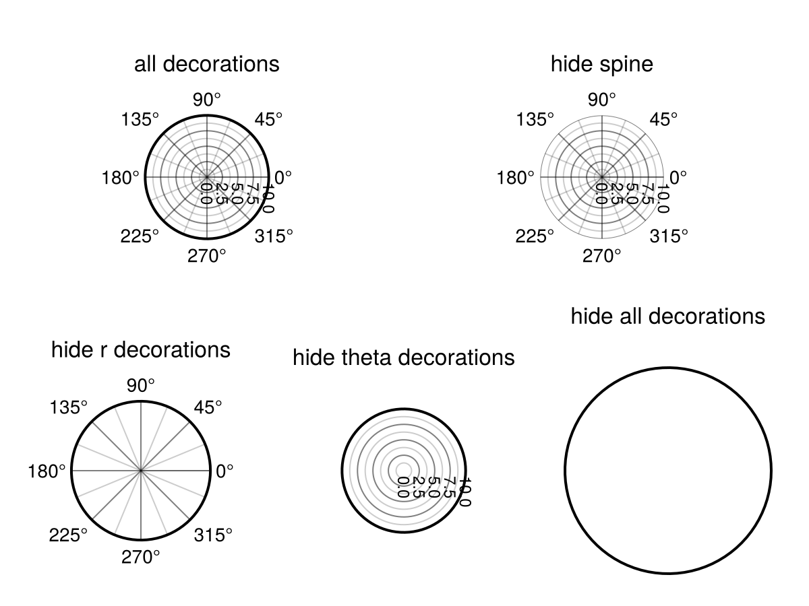


## Ticks and Minorticks {#Ticks-and-Minorticks}

Ticks and minor ticks are hidden by default. They are made visible with the `tickvisible` attributes.
<a id="example-3e03fef" />


```julia
using CairoMakie
f = Figure()
a = PolarAxis(f[1,1],
    rticksvisible = true, thetaticksvisible = true,
    rminorticksvisible = true,
    thetaminorticksvisible = true,
)
f
```

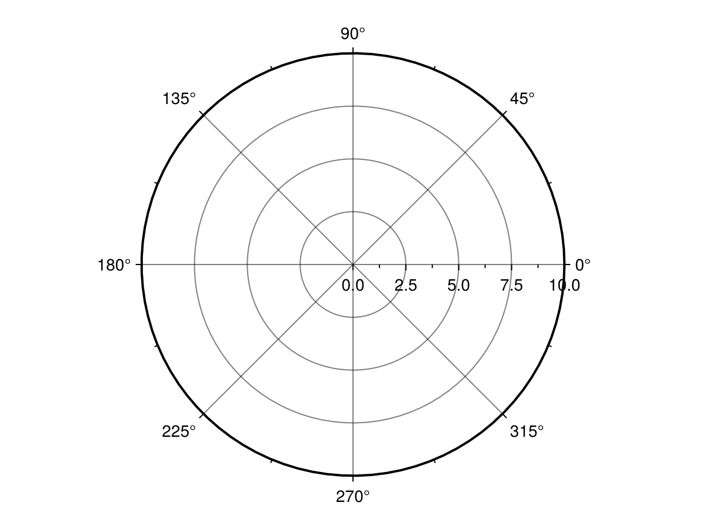


They can be styled with various other `tick` attributes. They can also be mirrored to the other side of a sector-style PolarAxis with `ticksmirrored`.
<a id="example-30b085e" />


```julia
using CairoMakie
f = Figure(size = (800, 400))
kwargs = (
    rticksvisible = true, rticksize = 12, rtickwidth = 4, rtickcolor = :red, rtickalign = 0.5,
    thetaticksvisible = true, thetaticksize = 12, thetatickwidth = 4, thetatickcolor = :blue, thetatickalign = 0.5,
    rminorticksvisible = true, rminorticksize = 8, rminortickwidth = 3, rminortickcolor = :orange, rminortickalign = 1.0,
    thetaminorticksvisible = true, thetaminorticksize = 8, thetaminortickwidth = 3, thetaminortickcolor = :cyan, thetaminortickalign = 1.0,
)
a = PolarAxis(f[1,1], title = "normal", rticksmirrored = false, thetaticksmirrored = false; kwargs...)
rlims!(a, 0.5, 0.9)
thetalims!(a, 1pi/5, 2pi/5)
a = PolarAxis(f[1,2], title = "mirrored", rticksmirrored = true, thetaticksmirrored = true; kwargs...)
rlims!(a, 0.5, 0.9)
thetalims!(a, 1pi/5, 2pi/5)
f
```

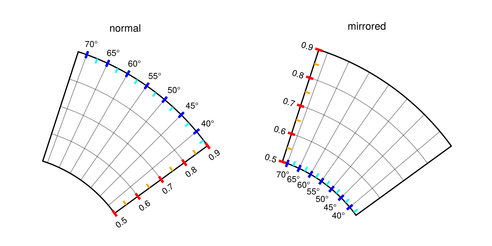


## Interactivity {#Interactivity}

The `PolarAxis` currently implements zooming, translation and resetting. Zooming is implemented via scrolling, with `ax.rzoomkey = Keyboard.r` restricting zooming to the radial direction and `ax.thetazoomkey = Keyboard.t` restring to angular zooming. You can block zooming in the r-direction by setting `ax.rzoomlock = true` and `ax.thetazoomlock = true` for theta direction. Furthermore you can disable zooming from changing just rmin with `ax.fixrmin = true` and adjust its speed with `ax.zoomspeed = 0.1`.

Translations are implemented with mouse drag. By default radial translations use `ax.r_translation_button = Mouse.right` and angular translations also use `ax.theta_translation_button = Mouse.right`. If `ax.fixrmin = true` translation in the r direction are not allowed. If you want to disable one of these interaction you can set corresponding button to `false`.

There is also an interaction for rotating the whole axis using `ax.axis_rotation_button = Keyboard.left_control & Mouse.right` and resetting the axis view uses `ax.reset_button = Keyboard.left_control & Mouse.left`, matching `Axis`. You can adjust whether this resets the rotation of the axis with `ax.reset_axis_orientation = false`.

Note that `PolarAxis` currently does not implement the interaction interface used by `Axis`.

## Other Notes {#Other-Notes}

### Plotting outside a PolarAxis {#Plotting-outside-a-PolarAxis}

Currently there are two poly plots outside the area of the `PolarAxis` which clip the content to the relevant area. If you want to draw outside the clip limiting the polar axis but still within it&#39;s scene area, you need to translate those plots to a z range between `9000` and `10_000` or disable clipping via the `clip` attribute.

For reference, the z values used by `PolarAxis` are `po.griddepth[] = 8999` for grid lines, 9000 for the clip polygons, 9001 for spines and 9002 for tick labels.

### Radial Offset {#Radial-Offset}

If you have a plot with rlimits far away from 0 you will end up with a lot of empty space in the PolarAxis. Consider for example:
<a id="example-38706e3" />


```julia
using CairoMakie
fig = Figure()
ax = PolarAxis(fig[1, 1], thetalimits = (0, pi))
lines!(ax, range(0, pi, length=100), 10 .+ sin.(0.3 .* (1:100)))
fig
```

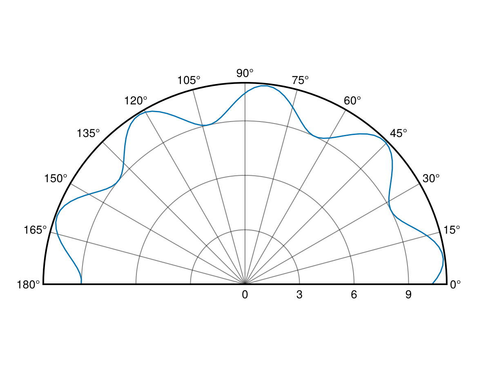


In this case you may want to offset the r-direction to make more of your data visible. This can be done by setting `ax.radius_at_origin` which translates radii as `r_out = r_in - radius_at_origin`.
<a id="example-c99ceaf" />


```julia
using CairoMakie
fig = Figure()
ax = PolarAxis(fig[1, 1], thetalimits = (0, pi), radius_at_origin = 8)
lines!(ax, range(0, pi, length=100), 10 .+ sin.(0.3 .* (1:100)))
fig
```

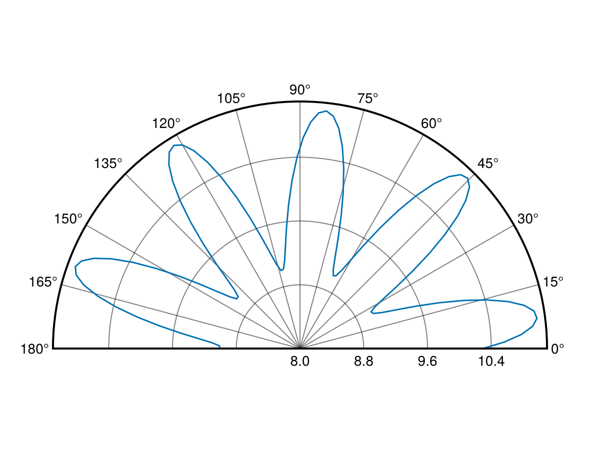


This can also be used to show a plot with negative radii:
<a id="example-3031e41" />


```julia
using CairoMakie
fig = Figure()
ax = PolarAxis(fig[1, 1], thetalimits = (0, pi), radius_at_origin = -12)
lines!(ax, range(0, pi, length=100), sin.(0.3 .* (1:100)) .- 10)
fig
```

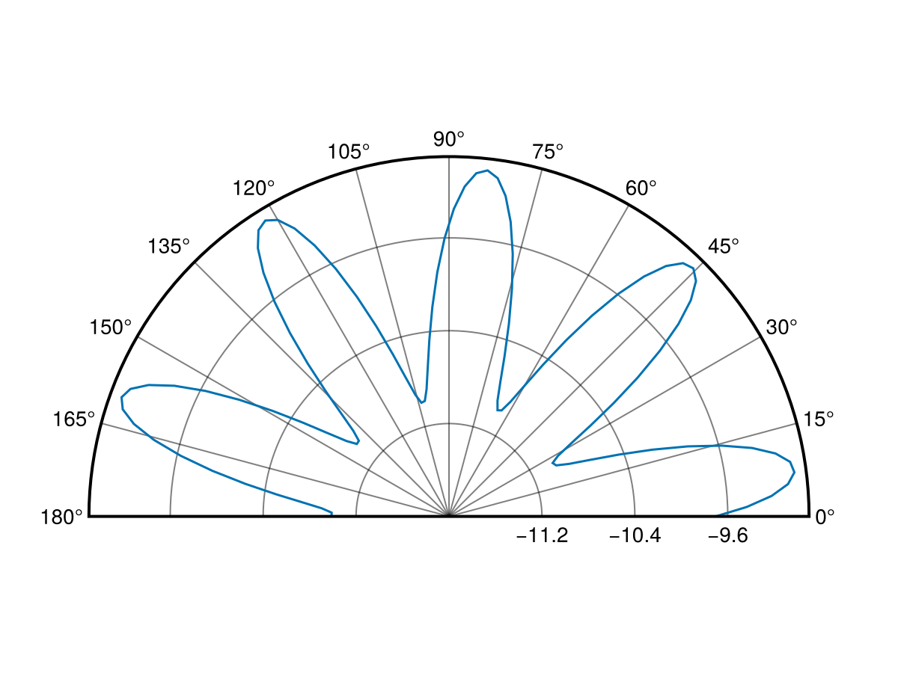


Note however that translating radii results in some level of distortion:
<a id="example-57c1636" />


```julia
using CairoMakie
phis = range(pi/4, 9pi/4, length=201)
rs = 1.0 ./ sin.(range(pi/4, 3pi/4, length=51)[1:end-1])
rs = vcat(rs, rs, rs, rs, rs[1])

fig = Figure(size = (900, 300))
ax1 = PolarAxis(fig[1, 1], radius_at_origin = -2,  title = "radius_at_origin = -2")
ax2 = PolarAxis(fig[1, 2], radius_at_origin = 0,   title = "radius_at_origin = 0")
ax3 = PolarAxis(fig[1, 3], radius_at_origin = 0.5, title = "radius_at_origin = 0.5")
for ax in (ax1, ax2, ax3)
    lines!(ax, phis, rs .- 2, color = :red, linewidth = 4)
    lines!(ax, phis, rs, color = :black, linewidth = 4)
    lines!(ax, phis, rs .+ 0.5, color = :blue, linewidth = 4)
end
fig
```

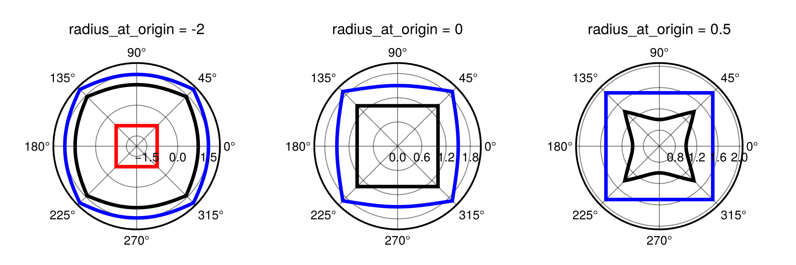


### Radial clipping {#Radial-clipping}

By default radii `r_out = r_in - radius_at_origin < 0` are clipped by the Polar transform. This can be disabled by setting `ax.clip_r = false`. With that setting `r_out < 0` will pass through the polar transform as is, resulting in a coordinate at $(|r_{out}|, \theta - pi)$.
<a id="example-809e09e" />


```julia
using CairoMakie
fig = Figure(size = (600, 300))
ax1 = PolarAxis(fig[1, 1], radius_at_origin = 0.0, clip_r = true, title = "clip_r = true")
ax2 = PolarAxis(fig[1, 2], radius_at_origin = 0.0, clip_r = false, title = "clip_r = false")
for ax in (ax1, ax2)
    lines!(ax, 0..2pi, phi -> cos(2phi) - 0.5, color = :red, linewidth = 4)
    lines!(ax, 0..2pi, phi -> sin(2phi), color = :black, linewidth = 4)
end
fig
```

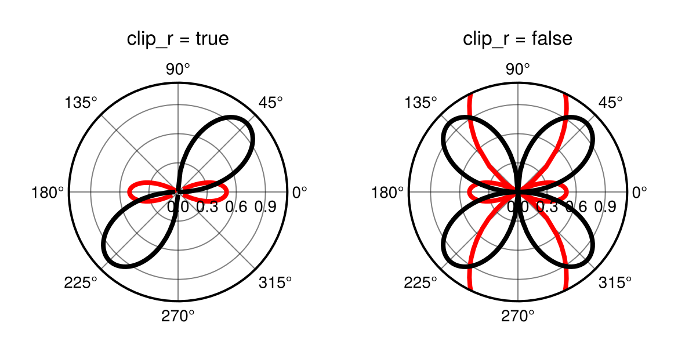


## Attributes {#Attributes}

### alignmode {#alignmode}

Defaults to `Inside()`

The alignment of the scene in its suggested bounding box.

### axis_rotation_button {#axis_rotation_button}

Defaults to `Keyboard.left_control & Mouse.right`

Sets the button for rotating the PolarAxis as a whole. This replaces theta translation when triggered and must include a mouse button.

### backgroundcolor {#backgroundcolor}

Defaults to `inherit(scene, :backgroundcolor, :white)`

The background color of the axis.

### clip {#clip}

Defaults to `true`

Controls whether to activate the nonlinear clip feature. Note that this should not be used when the background is ultimately transparent.

### clip_r {#clip_r}

Defaults to `true`

Controls whether `r < 0` (after applying `radius_at_origin`) gets clipped (true) or not (false).

### clipcolor {#clipcolor}

Defaults to `automatic`

Sets the color of the clip polygon. Mainly for debug purposes.

### dim1_conversion {#dim1_conversion}

Defaults to `nothing`

Global state for the x dimension conversion.

### dim2_conversion {#dim2_conversion}

Defaults to `nothing`

Global state for the y dimension conversion.

### direction {#direction}

Defaults to `1`

The direction of rotation. Can be -1 (clockwise) or 1 (counterclockwise).

### fixrmin {#fixrmin}

Defaults to `true`

Controls whether rmin remains fixed during zooming and translation. (The latter will be turned off by setting this to true.)

### gridz {#gridz}

Defaults to `-100`

Sets the z value of grid lines. To place the grid above plots set this to a value between 1 and 8999.

### halign {#halign}

Defaults to `:center`

The horizontal alignment of the scene in its suggested bounding box.

### height {#height}

Defaults to `nothing`

The height setting of the scene.

### normalize_theta_ticks {#normalize_theta_ticks}

Defaults to `true`

Sets whether shown theta ticks get normalized to a -2pi to 2pi range. If not, the limits such as (2pi, 4pi) will be shown as that range.

### r_translation_button {#r_translation_button}

Defaults to `Mouse.right`

Sets the mouse button for translating the plot in r-direction.

### radius_at_origin {#radius_at_origin}

Defaults to `automatic`

Sets the radius at the origin of the PolarAxis such that `r_out = r_in - radius_at_origin`. Can be set to `automatic` to match rmin. Note that this will affect the shape of plotted objects.

### rautolimitmargin {#rautolimitmargin}

Defaults to `(0.05, 0.05)`

The relative margins added to the autolimits in r direction.

### reset_axis_orientation {#reset_axis_orientation}

Defaults to `false`

Sets whether the axis orientation (changed with the axis_rotation_button) gets reset when resetting the axis. If set to false only the limits will reset.

### reset_button {#reset_button}

Defaults to `Keyboard.left_control & Mouse.left`

Sets the button or button combination for resetting the axis view. (This should be compatible with `ispressed`.)

### rgridcolor {#rgridcolor}

Defaults to `inherit(scene, (:Axis, :xgridcolor), (:black, 0.5))`

The color of the `r` grid.

### rgridstyle {#rgridstyle}

Defaults to `inherit(scene, (:Axis, :xgridstyle), nothing)`

The linestyle of the `r` grid.

### rgridvisible {#rgridvisible}

Defaults to `inherit(scene, (:Axis, :xgridvisible), true)`

Controls if the `r` grid is visible.

### rgridwidth {#rgridwidth}

Defaults to `inherit(scene, (:Axis, :xgridwidth), 1)`

The linewidth of the `r` grid.

### rlimits {#rlimits}

Defaults to `(:origin, nothing)`

The radial limits of the PolarAxis. 

### rminorgridcolor {#rminorgridcolor}

Defaults to `inherit(scene, (:Axis, :xminorgridcolor), (:black, 0.2))`

The color of the `r` minor grid.

### rminorgridstyle {#rminorgridstyle}

Defaults to `inherit(scene, (:Axis, :xminorgridstyle), nothing)`

The linestyle of the `r` minor grid.

### rminorgridvisible {#rminorgridvisible}

Defaults to `inherit(scene, (:Axis, :xminorgridvisible), false)`

Controls if the `r` minor grid is visible.

### rminorgridwidth {#rminorgridwidth}

Defaults to `inherit(scene, (:Axis, :xminorgridwidth), 1)`

The linewidth of the `r` minor grid.

### rminortickalign {#rminortickalign}

Defaults to `0.0`

The alignment of r minor ticks on the axis spine

### rminortickcolor {#rminortickcolor}

Defaults to `:black`

The tick color of r minor ticks

### rminorticks {#rminorticks}

Defaults to `IntervalsBetween(2)`

The specifier for the minor `r` ticks.

### rminorticksize {#rminorticksize}

Defaults to `3.0`

The tick size of r minor ticks

### rminorticksvisible {#rminorticksvisible}

Defaults to `false`

Controls if minor ticks on the r axis are visible

### rminortickwidth {#rminortickwidth}

Defaults to `1.0`

The tick width of r minor ticks

### rtickalign {#rtickalign}

Defaults to `0.0`

The alignment of the rtick marks relative to the axis spine (0 = out, 1 = in).

### rtickangle {#rtickangle}

Defaults to `automatic`

The angle in radians along which the `r` ticks are printed.

### rtickcolor {#rtickcolor}

Defaults to `RGBf(0, 0, 0)`

The color of the rtick marks.

### rtickformat {#rtickformat}

Defaults to `Makie.automatic`

The formatter for the `r` ticks

### rticklabelcolor {#rticklabelcolor}

Defaults to `inherit(scene, (:Axis, :xticklabelcolor), inherit(scene, :textcolor, :black))`

The color of the `r` tick labels.

### rticklabelfont {#rticklabelfont}

Defaults to `inherit(scene, (:Axis, :xticklabelfont), inherit(scene, :font, Makie.defaultfont()))`

The font of the `r` tick labels.

### rticklabelpad {#rticklabelpad}

Defaults to `4.0`

Padding of the `r` ticks label.

### rticklabelrotation {#rticklabelrotation}

Defaults to `automatic`

Sets the rotation of `r` tick labels.

Options:
- `:radial` rotates labels based on the angle they appear at
  
- `:horizontal` keeps labels at a horizontal orientation
  
- `:aligned` rotates labels based on the angle they appear at but keeps them up-right and close to horizontal
  
- `automatic` uses `:horizontal` when theta limits span &gt;1.9pi and `:aligned` otherwise
  
- `::Real` sets the label rotation to a specific value
  

### rticklabelsize {#rticklabelsize}

Defaults to `inherit(scene, (:Axis, :yticklabelsize), inherit(scene, :fontsize, 16))`

The fontsize of the `r` tick labels.

### rticklabelstrokecolor {#rticklabelstrokecolor}

Defaults to `automatic`

The color of the outline of `r` ticks. By default this uses the background color.

### rticklabelstrokewidth {#rticklabelstrokewidth}

Defaults to `0.0`

The width of the outline of `r` ticks. Setting this to 0 will remove the outline.

### rticklabelsvisible {#rticklabelsvisible}

Defaults to `inherit(scene, (:Axis, :xticklabelsvisible), true)`

Controls if the `r` ticks are visible.

### rticks {#rticks}

Defaults to `LinearTicks(4)`

The specifier for the radial (`r`) ticks, similar to `xticks` for a normal Axis.

### rticksize {#rticksize}

Defaults to `5.0`

The size of the rtick marks.

### rticksmirrored {#rticksmirrored}

Defaults to `false`

If set to true and theta range is below 2pi, mirrors r ticks to the other side in a PolarAxis.

### rticksvisible {#rticksvisible}

Defaults to `false`

Controls if the rtick marks are visible.

### rtickwidth {#rtickwidth}

Defaults to `1.0`

The width of the rtick marks.

### rzoomkey {#rzoomkey}

Defaults to `Keyboard.r`

Sets the key used to restrict zooming to the r-direction. Can be set to `true` to always restrict zooming or `false` to disable the interaction.

### rzoomlock {#rzoomlock}

Defaults to `false`

Controls whether adjusting the rlimits through interactive zooming is blocked.

### sample_density {#sample_density}

Defaults to `90`

The density at which curved lines are sampled. (grid lines, spine lines, clip)

### spinecolor {#spinecolor}

Defaults to `:black`

The color of the spine.

### spinestyle {#spinestyle}

Defaults to `nothing`

The linestyle of the spine.

### spinevisible {#spinevisible}

Defaults to `true`

Controls whether the spine is visible.

### spinewidth {#spinewidth}

Defaults to `2`

The width of the spine.

### tellheight {#tellheight}

Defaults to `true`

Controls if the parent layout can adjust to this element&#39;s height

### tellwidth {#tellwidth}

Defaults to `true`

Controls if the parent layout can adjust to this element&#39;s width

### theta_0 {#theta_0}

Defaults to `0.0`

The angular offset for (1, 0) in the PolarAxis. This rotates the axis.

### theta_as_x {#theta_as_x}

Defaults to `true`

Controls the argument order of the Polar transform. If `theta_as_x = true` it is (θ, r), otherwise (r, θ).

### theta_translation_button {#theta_translation_button}

Defaults to `Mouse.right`

Sets the mouse button for translating the plot in theta-direction. Note that this can be the same as `radial_translation_button`.

### thetaautolimitmargin {#thetaautolimitmargin}

Defaults to `(0.05, 0.05)`

The relative margins added to the autolimits in theta direction.

### thetagridcolor {#thetagridcolor}

Defaults to `inherit(scene, (:Axis, :ygridcolor), (:black, 0.5))`

The color of the `theta` grid.

### thetagridstyle {#thetagridstyle}

Defaults to `inherit(scene, (:Axis, :ygridstyle), nothing)`

The linestyle of the `theta` grid.

### thetagridvisible {#thetagridvisible}

Defaults to `inherit(scene, (:Axis, :ygridvisible), true)`

Controls if the `theta` grid is visible.

### thetagridwidth {#thetagridwidth}

Defaults to `inherit(scene, (:Axis, :ygridwidth), 1)`

The linewidth of the `theta` grid.

### thetalimits {#thetalimits}

Defaults to `(0.0, 2pi)`

The angle limits of the PolarAxis. (0.0, 2pi) results a full circle. (nothing, nothing) results in limits picked based on plot limits.

### thetaminorgridcolor {#thetaminorgridcolor}

Defaults to `inherit(scene, (:Axis, :yminorgridcolor), (:black, 0.2))`

The color of the `theta` minor grid.

### thetaminorgridstyle {#thetaminorgridstyle}

Defaults to `inherit(scene, (:Axis, :yminorgridstyle), nothing)`

The linestyle of the `theta` minor grid.

### thetaminorgridvisible {#thetaminorgridvisible}

Defaults to `inherit(scene, (:Axis, :yminorgridvisible), false)`

Controls if the `theta` minor grid is visible.

### thetaminorgridwidth {#thetaminorgridwidth}

Defaults to `inherit(scene, (:Axis, :yminorgridwidth), 1)`

The linewidth of the `theta` minor grid.

### thetaminortickalign {#thetaminortickalign}

Defaults to `0.0`

The alignment of theta minor ticks on the axis spine

### thetaminortickcolor {#thetaminortickcolor}

Defaults to `:black`

The tick color of theha minor ticks

### thetaminorticks {#thetaminorticks}

Defaults to `IntervalsBetween(2)`

The specifier for the minor `theta` ticks.

### thetaminorticksize {#thetaminorticksize}

Defaults to `3.0`

The tick size of theta minor ticks

### thetaminorticksvisible {#thetaminorticksvisible}

Defaults to `false`

Controls if minor ticks on the theta axis are visible

### thetaminortickwidth {#thetaminortickwidth}

Defaults to `1.0`

The tick width of theta minor ticks

### thetatickalign {#thetatickalign}

Defaults to `0.0`

The alignment of the theta tick marks relative to the axis spine (0 = out, 1 = in).

### thetatickcolor {#thetatickcolor}

Defaults to `RGBf(0, 0, 0)`

The color of the theta tick marks.

### thetatickformat {#thetatickformat}

Defaults to `Makie.automatic`

The formatter for the `theta` ticks.

### thetaticklabelcolor {#thetaticklabelcolor}

Defaults to `inherit(scene, (:Axis, :yticklabelcolor), inherit(scene, :textcolor, :black))`

The color of the `theta` tick labels.

### thetaticklabelfont {#thetaticklabelfont}

Defaults to `inherit(scene, (:Axis, :yticklabelfont), inherit(scene, :font, Makie.defaultfont()))`

The font of the `theta` tick labels.

### thetaticklabelpad {#thetaticklabelpad}

Defaults to `4.0`

Padding of the `theta` ticks label.

### thetaticklabelsize {#thetaticklabelsize}

Defaults to `inherit(scene, (:Axis, :xticklabelsize), inherit(scene, :fontsize, 16))`

The fontsize of the `theta` tick labels.

### thetaticklabelstrokecolor {#thetaticklabelstrokecolor}

Defaults to `automatic`

The color of the outline of `theta` ticks. By default this uses the background color.

### thetaticklabelstrokewidth {#thetaticklabelstrokewidth}

Defaults to `0.0`

The width of the outline of `theta` ticks. Setting this to 0 will remove the outline.

### thetaticklabelsvisible {#thetaticklabelsvisible}

Defaults to `inherit(scene, (:Axis, :yticklabelsvisible), true)`

Controls if the `theta` ticks are visible.

### thetaticks {#thetaticks}

Defaults to `AngularTicks(180 / pi, "°")`

The specifier for the angular (`theta`) ticks, similar to `yticks` for a normal Axis.

### thetaticksize {#thetaticksize}

Defaults to `5.0`

The size of the theta tick marks.

### thetaticksmirrored {#thetaticksmirrored}

Defaults to `false`

If set to true and rmin &gt; 0, mirrors theta ticks to the other side of the PolarAxis.

### thetaticksvisible {#thetaticksvisible}

Defaults to `false`

Controls if the theta tick marks are visible.

### thetatickwidth {#thetatickwidth}

Defaults to `1.0`

The width of the theta tick marks.

### thetazoomkey {#thetazoomkey}

Defaults to `Keyboard.t`

Sets the key used to restrict zooming to the theta-direction. Can be set to `true` to always restrict zooming or `false` to disable the interaction.

### thetazoomlock {#thetazoomlock}

Defaults to `true`

Controls whether adjusting the thetalimits through interactive zooming is blocked.

### title {#title}

Defaults to `""`

The title of the plot

### titlealign {#titlealign}

Defaults to `:center`

The alignment of the title.  Can be any of `:center`, `:left`, or `:right`.

### titlecolor {#titlecolor}

Defaults to `inherit(scene, (:Axis, :titlecolor), inherit(scene, :textcolor, :black))`

The color of the title.

### titlefont {#titlefont}

Defaults to `inherit(scene, (:Axis, :titlefont), inherit(scene, :font, Makie.defaultfont()))`

The font of the title.

### titlegap {#titlegap}

Defaults to `inherit(scene, (:Axis, :titlesize), map((x->begin
                x / 2
            end), inherit(scene, :fontsize, 16)))`

The gap between the title and the top of the axis

### titlesize {#titlesize}

Defaults to `inherit(scene, (:Axis, :titlesize), map((x->begin
                1.2x
            end), inherit(scene, :fontsize, 16)))`

The fontsize of the title.

### titlevisible {#titlevisible}

Defaults to `inherit(scene, (:Axis, :titlevisible), true)`

Controls if the title is visible.

### valign {#valign}

Defaults to `:center`

The vertical alignment of the scene in its suggested bounding box.

### width {#width}

Defaults to `nothing`

The width setting of the scene.

### zoomspeed {#zoomspeed}

Defaults to `0.1`

Sets the speed of scroll based zooming. Setting this to 0 effectively disables zooming.
