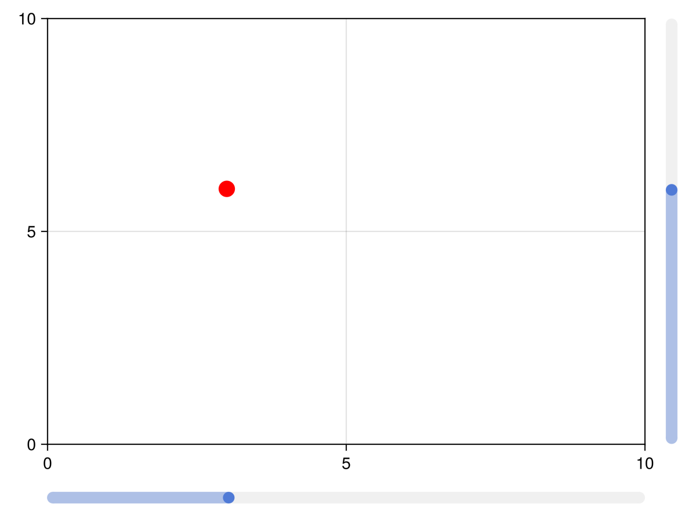

# Slider {#Slider}

A simple slider without a label. You can create a label using a `Label` object, for example. You need to specify a range that constrains the slider&#39;s possible values.

The currently selected value is in the attribute `value`. Don&#39;t change this value manually, but use the function `set_close_to!(slider, value)`. This is necessary to ensure the value is actually present in the `range` attribute.

You can double-click the slider to reset it (approximately) to the value present in `startvalue`.

If you set the attribute `snap = false`, the slider will move continuously while dragging and only jump to the closest available value when releasing the mouse.
<a id="example-865970f" />


```julia
using GLMakie

fig = Figure()

ax = Axis(fig[1, 1])

sl_x = Slider(fig[2, 1], range = 0:0.01:10, startvalue = 3, update_while_dragging=false)
sl_y = Slider(fig[1, 2], range = 0:0.01:10, horizontal = false, startvalue = 6)

point = lift(sl_x.value, sl_y.value) do x, y
    Point2f(x, y)
end

scatter!(point, color = :red, markersize = 20)

limits!(ax, 0, 10, 0, 10)

fig
```




## Labelled sliders and grids {#Labelled-sliders-and-grids}

The functions [`labelslider!`](/api#Makie.labelslider!-Tuple{Any,%20Any,%20Any}) and [`labelslidergrid!`](/api#Makie.labelslidergrid!-Tuple{Any,%20Any,%20Any}) are deprecated, use [`SliderGrid`](/reference/blocks/slidergrid#SliderGrid) instead.

## Attributes {#Attributes}

### alignmode {#alignmode}

Defaults to `Inside()`

The align mode of the slider in its parent GridLayout.

### color_active {#color_active}

Defaults to `COLOR_ACCENT[]`

The color of the slider when the mouse clicks and drags the slider.

### color_active_dimmed {#color_active_dimmed}

Defaults to `COLOR_ACCENT_DIMMED[]`

The color of the slider when the mouse hovers over it.

### color_inactive {#color_inactive}

Defaults to `RGBf(0.94, 0.94, 0.94)`

The color of the slider when it is not interacted with.

### halign {#halign}

Defaults to `:center`

The horizontal alignment of the element in its suggested bounding box.

### height {#height}

Defaults to `Auto()`

The height setting of the element.

### horizontal {#horizontal}

Defaults to `true`

Controls if the slider has a horizontal orientation or not.

### linewidth {#linewidth}

Defaults to `10`

The width of the slider line

### range {#range}

Defaults to `0:0.01:10`

The range of values that the slider can pick from.

### snap {#snap}

Defaults to `true`

Controls if the button snaps to valid positions or moves freely

### startvalue {#startvalue}

Defaults to `0`

The start value of the slider or the value that is closest in the slider range.

### tellheight {#tellheight}

Defaults to `true`

Controls if the parent layout can adjust to this element&#39;s height

### tellwidth {#tellwidth}

Defaults to `true`

Controls if the parent layout can adjust to this element&#39;s width

### update_while_dragging {#update_while_dragging}

Defaults to `true`

If false, slider only updates value once dragging stops

### valign {#valign}

Defaults to `:center`

The vertical alignment of the element in its suggested bounding box.

### value {#value}

Defaults to `0`

The current value of the slider. Don&#39;t set this manually, use the function `set_close_to!`.

### width {#width}

Defaults to `Auto()`

The width setting of the element.
