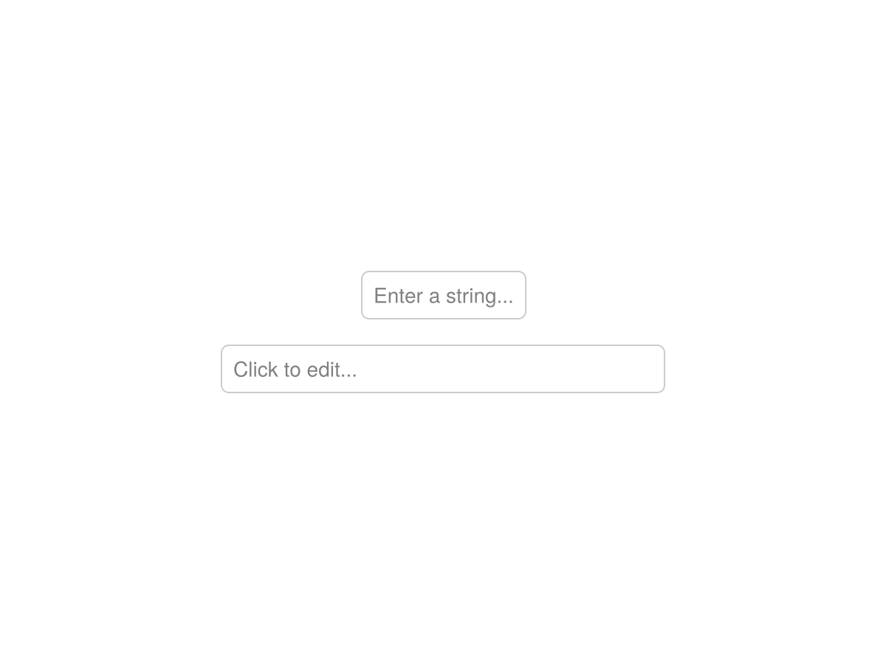
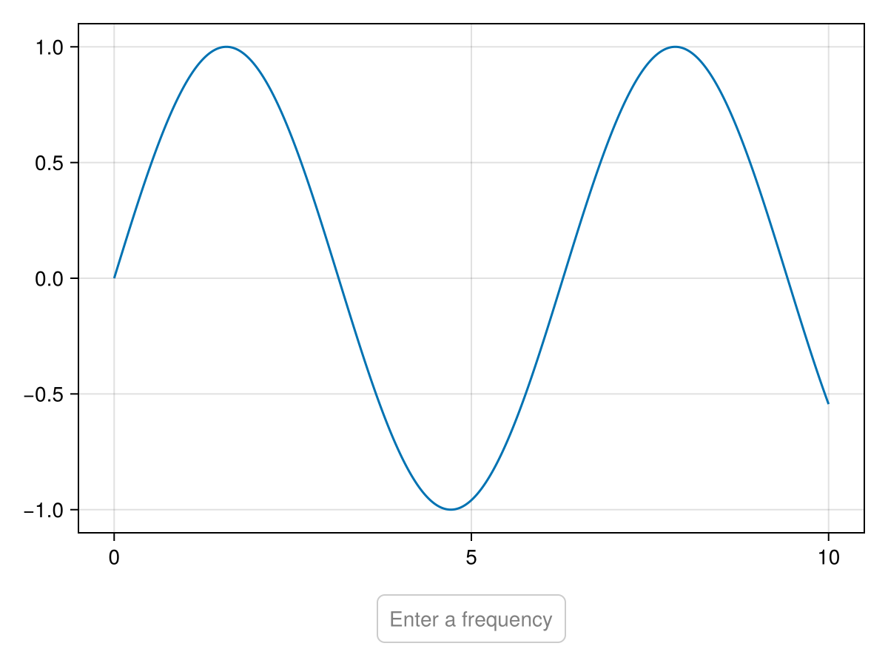

# Textbox {#Textbox}

The `Textbox` supports entry of a simple, single-line string, with optional validation logic.
<a id="example-e59ea89" />


```julia
using CairoMakie

f = Figure()
Textbox(f[1, 1], placeholder = "Enter a string...")
Textbox(f[2, 1], width = 300)

f
```




## Validation {#Validation}

The `validator` attribute is used with `validate_textbox(string, validator)` to determine if the current string is valid. It can be a `Regex` that needs to match the complete string, or a `Function` taking a `String` as input and returning a `Bool`. If the validator is a type T (for example `Float64`), validation will be `tryparse(T, string)`. The textbox will not allow submitting the currently entered value if the validator doesn&#39;t pass.
<a id="example-1c5b5b9" />


```julia
using CairoMakie

f = Figure()

tb = Textbox(f[2, 1], placeholder = "Enter a frequency",
    validator = Float64, tellwidth = false)

frequency = Observable(1.0)

on(tb.stored_string) do s
    frequency[] = parse(Float64, s)
end

xs = 0:0.01:10
sinecurve = @lift(sin.($frequency .* xs))

lines(f[1, 1], xs, sinecurve)

f
```




## Attributes {#Attributes}

### alignmode {#alignmode}

Defaults to `Inside()`

The alignment of the textbox in its suggested bounding box.

### bordercolor {#bordercolor}

Defaults to `RGBf(0.8, 0.8, 0.8)`

Color of the box border.

### bordercolor_focused {#bordercolor_focused}

Defaults to `COLOR_ACCENT[]`

Color of the box border when focused.

### bordercolor_focused_invalid {#bordercolor_focused_invalid}

Defaults to `RGBf(1, 0, 0)`

Color of the box border when focused and invalid.

### bordercolor_hover {#bordercolor_hover}

Defaults to `COLOR_ACCENT_DIMMED[]`

Color of the box border when hovered.

### borderwidth {#borderwidth}

Defaults to `1.0`

Width of the box border.

### boxcolor {#boxcolor}

Defaults to `:transparent`

Color of the box.

### boxcolor_focused {#boxcolor_focused}

Defaults to `:transparent`

Color of the box when focused.

### boxcolor_focused_invalid {#boxcolor_focused_invalid}

Defaults to `RGBAf(1, 0, 0, 0.3)`

Color of the box when focused.

### boxcolor_hover {#boxcolor_hover}

Defaults to `:transparent`

Color of the box when hovered.

### cornerradius {#cornerradius}

Defaults to `5`

Corner radius of text box.

### cornersegments {#cornersegments}

Defaults to `20`

Corner segments of one rounded corner.

### cursorcolor {#cursorcolor}

Defaults to `:transparent`

The color of the cursor.

### defocus_on_submit {#defocus_on_submit}

Defaults to `true`

Controls if the textbox is defocused when a string is submitted.

### displayed_string {#displayed_string}

Defaults to `nothing`

The currently displayed string (for internal use).

### focused {#focused}

Defaults to `false`

If the textbox is focused and receives text input.

### font {#font}

Defaults to `:regular`

Font family.

### fontsize {#fontsize}

Defaults to `@inherit :fontsize 16.0f0`

Text size.

### halign {#halign}

Defaults to `:center`

The horizontal alignment of the textbox in its suggested bounding box.

### height {#height}

Defaults to `Auto()`

The height setting of the textbox.

### placeholder {#placeholder}

Defaults to `"Click to edit..."`

A placeholder text that is displayed when the saved string is nothing.

### reset_on_defocus {#reset_on_defocus}

Defaults to `false`

Controls if the displayed text is reset to the stored text when defocusing the textbox without submitting.

### restriction {#restriction}

Defaults to `nothing`

Restricts the allowed unicode input via is_allowed(char, restriction).

### stored_string {#stored_string}

Defaults to `nothing`

The currently stored string.

### tellheight {#tellheight}

Defaults to `true`

Controls if the parent layout can adjust to this element&#39;s height.

### tellwidth {#tellwidth}

Defaults to `true`

Controls if the parent layout can adjust to this element&#39;s width.

### textcolor {#textcolor}

Defaults to `@inherit :textcolor :black`

Text color.

### textcolor_placeholder {#textcolor_placeholder}

Defaults to `RGBf(0.5, 0.5, 0.5)`

Text color for the placeholder.

### textpadding {#textpadding}

Defaults to `(8, 8, 8, 8)`

Padding of the text against the box.

### validator {#validator}

Defaults to `str->begin
        true
    end`

Validator that is called with validate_textbox(string, validator) to determine if the current string is valid. Can by default be a RegEx that needs to match the complete string, or a function taking a string as input and returning a Bool. If the validator is a type T (for example Float64), validation will be `tryparse(T, string)`.

### valign {#valign}

Defaults to `:center`

The vertical alignment of the textbox in its suggested bounding box.

### width {#width}

Defaults to `Auto()`

The width setting of the textbox.
