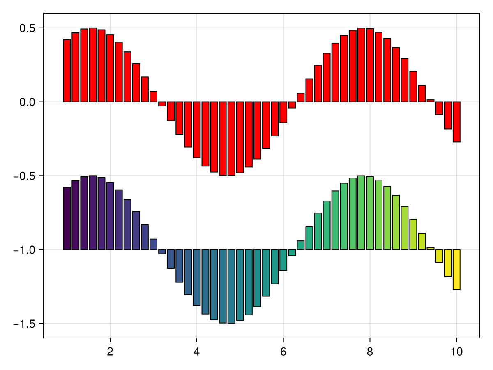
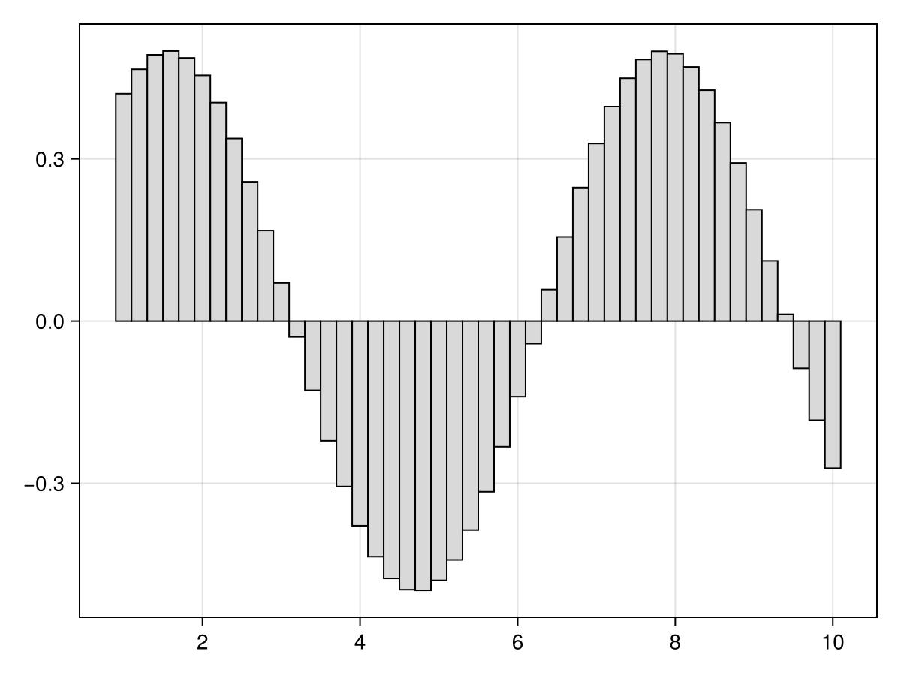
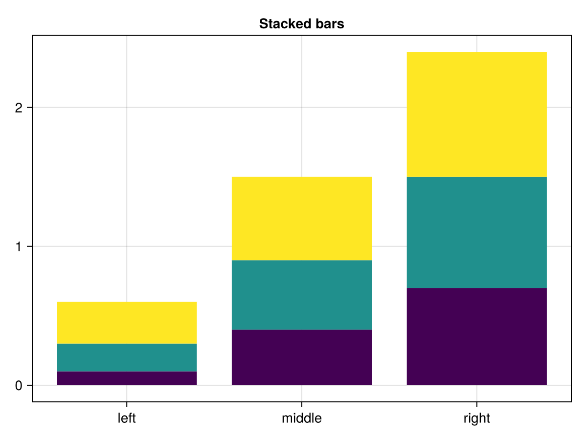
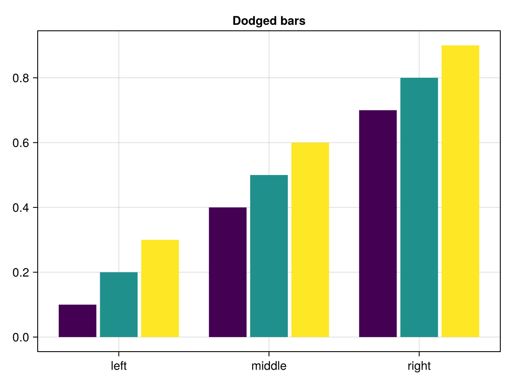
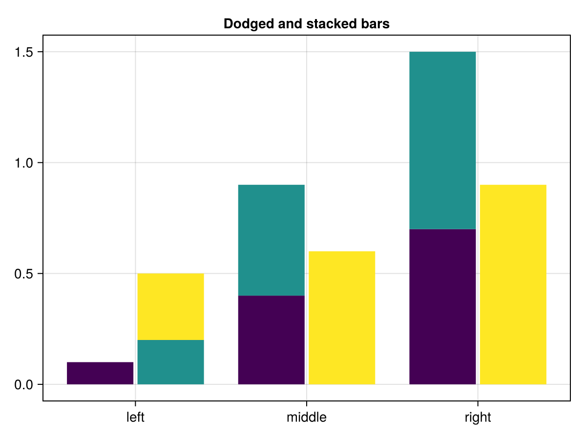
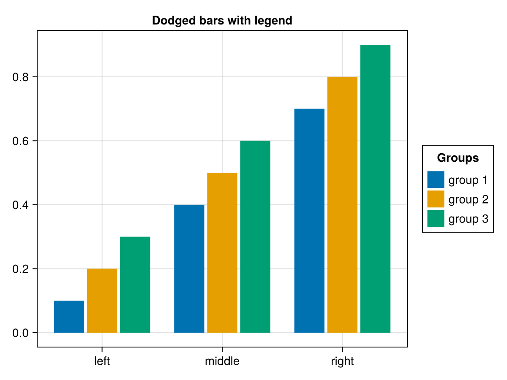
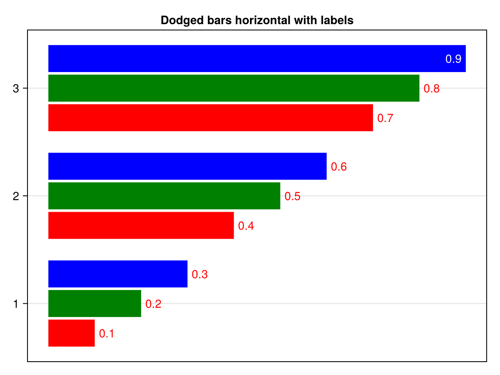
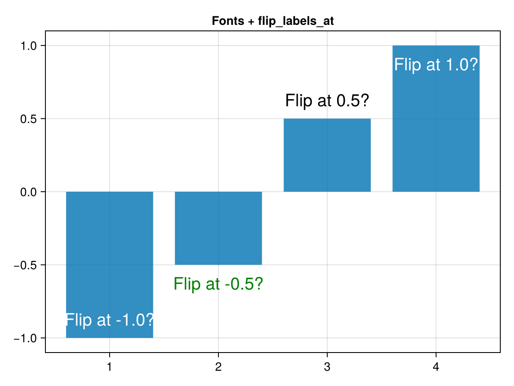
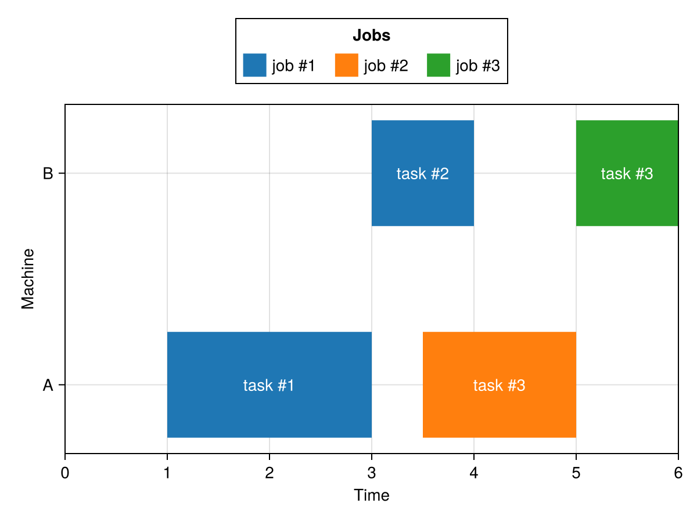

# barplot {#barplot}
<details class='jldocstring custom-block' open>
<summary><a id='Makie.barplot-reference-plots-barplot' href='#Makie.barplot-reference-plots-barplot'><span class="jlbinding">Makie.barplot</span></a> <Badge type="info" class="jlObjectType jlFunction" text="Function" /></summary>


```julia
barplot(positions, heights; kwargs...)
```


Plots a barplot.

**Plot type**

The plot type alias for the `barplot` function is `BarPlot`.


<Badge type="info" class="source-link" text="source"><a href="https://github.com/MakieOrg/Makie.jl/blob/cefec3bc07a829ab04fb7edfbd5ae240496109fa/MakieCore/src/recipes.jl#L520-L635" target="_blank" rel="noreferrer">source</a></Badge>

</details>


## Examples {#Examples}
<a id="example-285e102" />


```julia
using CairoMakie
f = Figure()
Axis(f[1, 1])

xs = 1:0.2:10
ys = 0.5 .* sin.(xs)

barplot!(xs, ys, color = :red, strokecolor = :black, strokewidth = 1)
barplot!(xs, ys .- 1, fillto = -1, color = xs, strokecolor = :black, strokewidth = 1)

f
```



<a id="example-ecf0f05" />


```julia
using CairoMakie
xs = 1:0.2:10
ys = 0.5 .* sin.(xs)

barplot(xs, ys, gap = 0, color = :gray85, strokecolor = :black, strokewidth = 1)
```



<a id="example-2e9870e" />


```julia
using CairoMakie
tbl = (cat = [1, 1, 1, 2, 2, 2, 3, 3, 3],
       height = 0.1:0.1:0.9,
       grp = [1, 2, 3, 1, 2, 3, 1, 2, 3],
       grp1 = [1, 2, 2, 1, 1, 2, 1, 1, 2],
       grp2 = [1, 1, 2, 1, 2, 1, 1, 2, 1]
       )

barplot(tbl.cat, tbl.height,
        stack = tbl.grp,
        color = tbl.grp,
        axis = (xticks = (1:3, ["left", "middle", "right"]),
                title = "Stacked bars"),
        )
```



<a id="example-59e17a1" />


```julia
barplot(tbl.cat, tbl.height,
        dodge = tbl.grp,
        color = tbl.grp,
        axis = (xticks = (1:3, ["left", "middle", "right"]),
                title = "Dodged bars"),
        )
```



<a id="example-148eaf5" />


```julia
barplot(tbl.cat, tbl.height,
        dodge = tbl.grp1,
        stack = tbl.grp2,
        color = tbl.grp,
        axis = (xticks = (1:3, ["left", "middle", "right"]),
                title = "Dodged and stacked bars"),
        )
```



<a id="example-d76426b" />


```julia
colors = Makie.wong_colors()

# Figure and Axis
fig = Figure()
ax = Axis(fig[1,1], xticks = (1:3, ["left", "middle", "right"]),
        title = "Dodged bars with legend")

# Plot
barplot!(ax, tbl.cat, tbl.height,
        dodge = tbl.grp,
        color = colors[tbl.grp])

# Legend
labels = ["group 1", "group 2", "group 3"]
elements = [PolyElement(polycolor = colors[i]) for i in 1:length(labels)]
title = "Groups"

Legend(fig[1,2], elements, labels, title)

fig
```



<a id="example-a0af111" />


```julia
barplot(
    tbl.cat, tbl.height,
    dodge = tbl.grp,
    color = tbl.grp,
    bar_labels = :y,
    axis = (xticks = (1:3, ["left", "middle", "right"]),
            title = "Dodged bars horizontal with labels"),
    colormap = [:red, :green, :blue],
    color_over_background=:red,
    color_over_bar=:white,
    flip_labels_at=0.85,
    direction=:x,
)
```



<a id="example-6f03de4" />


```julia
using CairoMakie
barplot([-1, -0.5, 0.5, 1],
    bar_labels = :y,
    axis = (title="Fonts + flip_labels_at",),
    label_size = 20,
    flip_labels_at=(-0.8, 0.8),
    label_color=[:white, :green, :black, :white],
    label_formatter = x-> "Flip at $(x)?",
    label_offset = 10
)
```



<a id="example-40006eb" />


```julia
using CairoMakie
gantt = (
    machine = [1, 2, 1, 2],
    job = [1, 1, 2, 3],
    task = [1, 2, 3, 3],
    start = [1, 3, 3.5, 5],
    stop = [3, 4, 5, 6]
)

fig = Figure()
ax = Axis(
    fig[2,1],
    yticks = (1:2, ["A","B"]),
    ylabel = "Machine",
    xlabel = "Time"
)
xlims!(ax, 0, maximum(gantt.stop))

cmap = Makie.to_colormap(:tab10)

barplot!(
    gantt.machine,
    gantt.stop,
    fillto = gantt.start,
    direction = :x,
    color = gantt.job,
    colormap = cmap,
    colorrange = (1, length(cmap)),
    gap = 0.5,
    bar_labels = ["task #$i" for i in gantt.task],
    label_position = :center,
    label_color = :white,
    label = ["job #$i" => (; color = i) for i in unique(gantt.job)]
)

Legend(fig[1,1], ax, "Jobs", orientation=:horizontal, tellwidth = false, tellheight = true)

fig
```




## Attributes {#Attributes}

### alpha {#alpha}

Defaults to `1.0`

The alpha value of the colormap or color attribute. Multiple alphas like in `plot(alpha=0.2, color=(:red, 0.5)`, will get multiplied.

### bar_labels {#bar_labels}

Defaults to `nothing`

Labels added at the end of each bar.

### clip_planes {#clip_planes}

Defaults to `automatic`

Clip planes offer a way to do clipping in 3D space. You can set a Vector of up to 8 `Plane3f` planes here, behind which plots will be clipped (i.e. become invisible). By default clip planes are inherited from the parent plot or scene. You can remove parent `clip_planes` by passing `Plane3f[]`.

### color {#color}

Defaults to `@inherit patchcolor`

No docs available.

### color_over_background {#color_over_background}

Defaults to `automatic`

No docs available.

### color_over_bar {#color_over_bar}

Defaults to `automatic`

No docs available.

### colormap {#colormap}

Defaults to `@inherit colormap :viridis`

Sets the colormap that is sampled for numeric `color`s. `PlotUtils.cgrad(...)`, `Makie.Reverse(any_colormap)` can be used as well, or any symbol from ColorBrewer or PlotUtils. To see all available color gradients, you can call `Makie.available_gradients()`.

### colorrange {#colorrange}

Defaults to `automatic`

The values representing the start and end points of `colormap`.

### colorscale {#colorscale}

Defaults to `identity`

The color transform function. Can be any function, but only works well together with `Colorbar` for `identity`, `log`, `log2`, `log10`, `sqrt`, `logit`, `Makie.pseudolog10` and `Makie.Symlog10`.

### cycle {#cycle}

Defaults to `[:color => :patchcolor]`

No docs available.

### depth_shift {#depth_shift}

Defaults to `0.0`

Adjusts the depth value of a plot after all other transformations, i.e. in clip space, where `-1 <= depth <= 1`. This only applies to GLMakie and WGLMakie and can be used to adjust render order (like a tunable overdraw).

### direction {#direction}

Defaults to `:y`

Controls the direction of the bars, can be `:y` (vertical) or `:x` (horizontal).

### dodge {#dodge}

Defaults to `automatic`

No docs available.

### dodge_gap {#dodge_gap}

Defaults to `0.03`

No docs available.

### fillto {#fillto}

Defaults to `automatic`

Controls the baseline of the bars. This is zero in the default `automatic` case unless the barplot is in a log-scaled `Axis`. With a log scale, the automatic default is half the minimum value because zero is an invalid value for a log scale.

### flip_labels_at {#flip_labels_at}

Defaults to `Inf`

No docs available.

### fxaa {#fxaa}

Defaults to `true`

Adjusts whether the plot is rendered with fxaa (anti-aliasing, GLMakie only).

### gap {#gap}

Defaults to `0.2`

The final width of the bars is calculated as `w * (1 - gap)` where `w` is the width of each bar as determined with the `width` attribute.

### highclip {#highclip}

Defaults to `automatic`

The color for any value above the colorrange.

### inspectable {#inspectable}

Defaults to `@inherit inspectable`

Sets whether this plot should be seen by `DataInspector`. The default depends on the theme of the parent scene.

### inspector_clear {#inspector_clear}

Defaults to `automatic`

Sets a callback function `(inspector, plot) -> ...` for cleaning up custom indicators in DataInspector.

### inspector_hover {#inspector_hover}

Defaults to `automatic`

Sets a callback function `(inspector, plot, index) -> ...` which replaces the default `show_data` methods.

### inspector_label {#inspector_label}

Defaults to `automatic`

Sets a callback function `(plot, index, position) -> string` which replaces the default label generated by DataInspector.

### label_align {#label_align}

Defaults to `automatic`

No docs available.

### label_color {#label_color}

Defaults to `@inherit textcolor`

No docs available.

### label_font {#label_font}

Defaults to `@inherit font`

The font of the bar labels.

### label_formatter {#label_formatter}

Defaults to `bar_label_formatter`

No docs available.

### label_offset {#label_offset}

Defaults to `5`

The distance of the labels from the bar ends in screen units. Does not apply when `label_position = :center`.

### label_position {#label_position}

Defaults to `:end`

The position of each bar&#39;s label relative to the bar. Possible values are `:end` or `:center`.

### label_rotation {#label_rotation}

Defaults to `0π`

No docs available.

### label_size {#label_size}

Defaults to `@inherit fontsize`

The font size of the bar labels.

### lowclip {#lowclip}

Defaults to `automatic`

The color for any value below the colorrange.

### model {#model}

Defaults to `automatic`

Sets a model matrix for the plot. This overrides adjustments made with `translate!`, `rotate!` and `scale!`.

### n_dodge {#n_dodge}

Defaults to `automatic`

No docs available.

### nan_color {#nan_color}

Defaults to `:transparent`

The color for NaN values.

### offset {#offset}

Defaults to `0.0`

No docs available.

### overdraw {#overdraw}

Defaults to `false`

Controls if the plot will draw over other plots. This specifically means ignoring depth checks in GL backends

### space {#space}

Defaults to `:data`

Sets the transformation space for box encompassing the plot. See `Makie.spaces()` for possible inputs.

### ssao {#ssao}

Defaults to `false`

Adjusts whether the plot is rendered with ssao (screen space ambient occlusion). Note that this only makes sense in 3D plots and is only applicable with `fxaa = true`.

### stack {#stack}

Defaults to `automatic`

No docs available.

### strokecolor {#strokecolor}

Defaults to `@inherit patchstrokecolor`

No docs available.

### strokewidth {#strokewidth}

Defaults to `@inherit patchstrokewidth`

No docs available.

### transformation {#transformation}

Defaults to `:automatic`

No docs available.

### transparency {#transparency}

Defaults to `false`

Adjusts how the plot deals with transparency. In GLMakie `transparency = true` results in using Order Independent Transparency.

### visible {#visible}

Defaults to `true`

Controls whether the plot will be rendered or not.

### width {#width}

Defaults to `automatic`

The gapless width of the bars. If `automatic`, the width `w` is calculated as `minimum(diff(sort(unique(positions)))`. The actual width of the bars is calculated as `w * (1 - gap)`.
