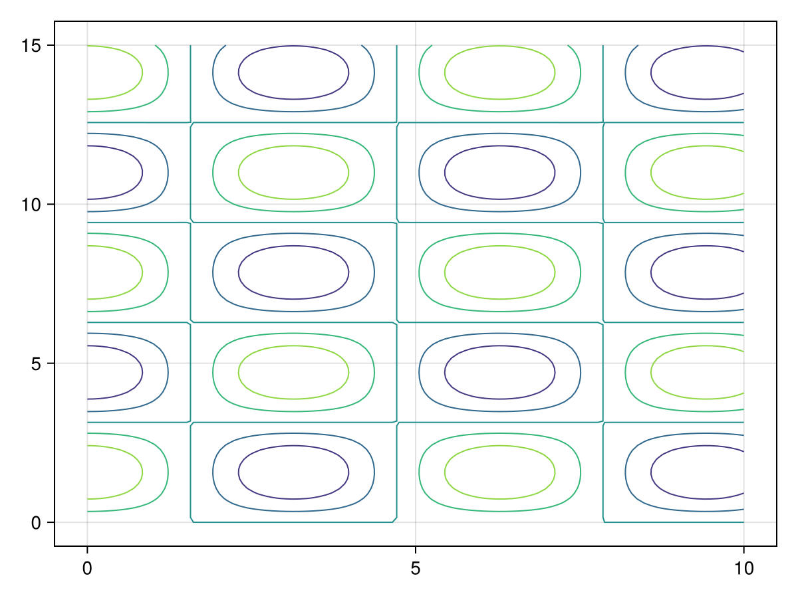
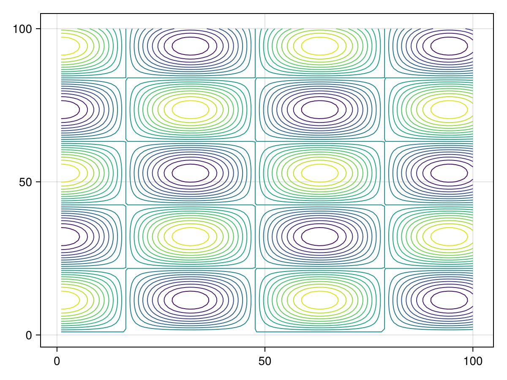
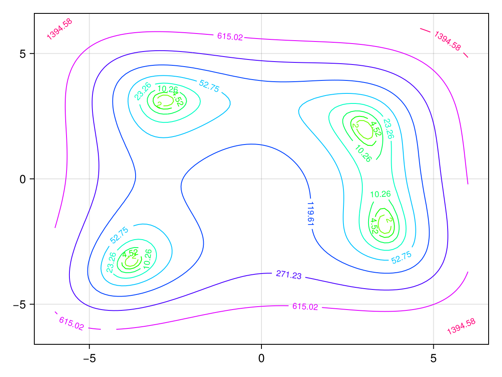
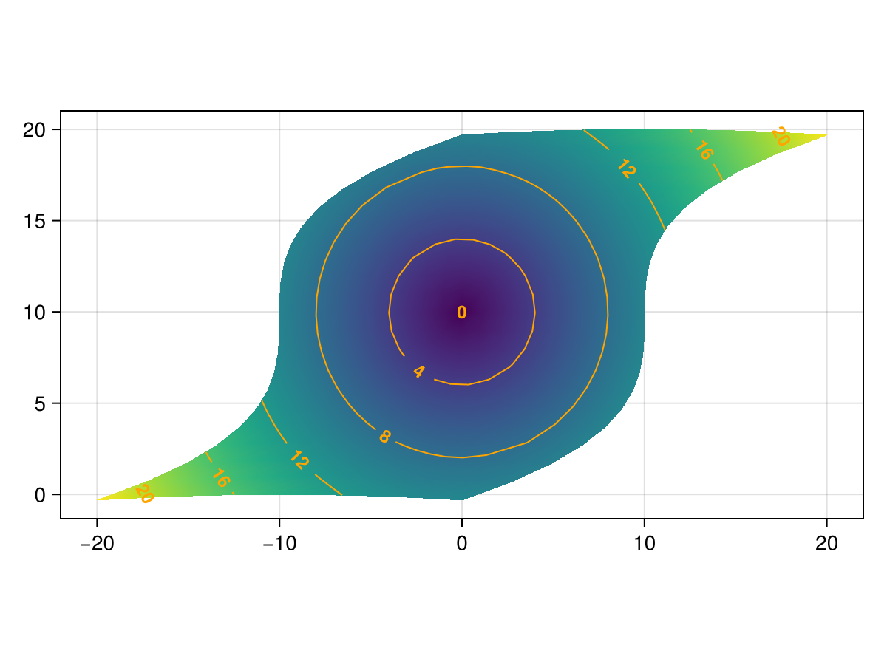

# contour {#contour}
<details class='jldocstring custom-block' open>
<summary><a id='Makie.contour-reference-plots-contour' href='#Makie.contour-reference-plots-contour'><span class="jlbinding">Makie.contour</span></a> <Badge type="info" class="jlObjectType jlFunction" text="Function" /></summary>


```julia
contour(x, y, z)
contour(z::Matrix)
```


Creates a contour plot of the plane spanning `x::Vector`, `y::Vector`, `z::Matrix`. If only `z::Matrix` is supplied, the indices of the elements in `z` will be used as the `x` and `y` locations when plotting the contour.

`x` and `y` can also be Matrices that define a curvilinear grid, similar to how [`surface`](/reference/plots/surface#surface) works.

**Plot type**

The plot type alias for the `contour` function is `Contour`.


<Badge type="info" class="source-link" text="source"><a href="https://github.com/MakieOrg/Makie.jl/blob/cefec3bc07a829ab04fb7edfbd5ae240496109fa/MakieCore/src/recipes.jl#L520-L616" target="_blank" rel="noreferrer">source</a></Badge>

</details>


## Examples {#Examples}
<a id="example-c9197db" />


```julia
using CairoMakie
f = Figure()
Axis(f[1, 1])

xs = LinRange(0, 10, 100)
ys = LinRange(0, 15, 100)
zs = [cos(x) * sin(y) for x in xs, y in ys]

contour!(xs, ys, zs)

f
```




Omitting the `xs` and `ys` results in the indices of `zs` being used. We can also set arbitrary contour-levels using `levels`
<a id="example-18a30ec" />


```julia
using CairoMakie
f = Figure()
Axis(f[1, 1])

xs = LinRange(0, 10, 100)
ys = LinRange(0, 15, 100)
zs = [cos(x) * sin(y) for x in xs, y in ys]

contour!(zs,levels=-1:0.1:1)

f
```




One can also add labels and control label attributes such as `labelsize`, `labelcolor` or `labelfont`.
<a id="example-2f37fca" />


```julia
using CairoMakie
himmelblau(x, y) = (x^2 + y - 11)^2 + (x + y^2 - 7)^2
x = y = range(-6, 6; length=100)
z = himmelblau.(x, y')

levels = 10.0.^range(0.3, 3.5; length=10)
colorscale = ReversibleScale(x -> x^(1 / 10), x -> x^10)
f, ax, ct = contour(x, y, z; labels=true, levels, colormap=:hsv, colorscale)
f
```




### Curvilinear grids {#Curvilinear-grids}

`contour` also supports _curvilinear_ grids, where `x` and `y` are both matrices of the same size as `z`. This is similar to the input that [`surface`](/reference/plots/surface#surface) accepts.

Let&#39;s warp a regular grid of `x` and `y` by some nonlinear function, and plot its contours:
<a id="example-cfc1caa" />


```julia
using CairoMakie
x = -10:10
y = -10:10
# The curvilinear grid:
xs = [x + 0.01y^3 for x in x, y in y]
ys = [y + 10cos(x/40) for x in x, y in y]

# Now, for simplicity, we calculate the `zs` values to be
# the radius from the center of the grid (0, 10).
zs = sqrt.(xs .^ 2 .+ (ys .- 10) .^ 2)

# We can use Makie's tick finders to get some nice looking contour levels:
levels = Makie.get_tickvalues(Makie.LinearTicks(7), extrema(zs)...)

# and now, we plot!
fig, ax, srf = surface(xs, ys, fill(0f0, size(zs)); color=zs, shading = NoShading, axis = (; type = Axis, aspect = DataAspect()))
ctr = contour!(ax, xs, ys, zs; color = :orange, levels = levels, labels = true, labelfont = :bold, labelsize = 12)

fig
```




## Attributes {#Attributes}

### alpha {#alpha}

Defaults to `1.0`

The alpha value of the colormap or color attribute. Multiple alphas like in `plot(alpha=0.2, color=(:red, 0.5)`, will get multiplied.

### clip_planes {#clip_planes}

Defaults to `automatic`

Clip planes offer a way to do clipping in 3D space. You can set a Vector of up to 8 `Plane3f` planes here, behind which plots will be clipped (i.e. become invisible). By default clip planes are inherited from the parent plot or scene. You can remove parent `clip_planes` by passing `Plane3f[]`.

### color {#color}

Defaults to `nothing`

The color of the contour lines. If `nothing`, the color is determined by the numerical values of the contour levels in combination with `colormap` and `colorrange`.

### colormap {#colormap}

Defaults to `@inherit colormap :viridis`

Sets the colormap that is sampled for numeric `color`s. `PlotUtils.cgrad(...)`, `Makie.Reverse(any_colormap)` can be used as well, or any symbol from ColorBrewer or PlotUtils. To see all available color gradients, you can call `Makie.available_gradients()`.

### colorrange {#colorrange}

Defaults to `automatic`

The values representing the start and end points of `colormap`.

### colorscale {#colorscale}

Defaults to `identity`

The color transform function. Can be any function, but only works well together with `Colorbar` for `identity`, `log`, `log2`, `log10`, `sqrt`, `logit`, `Makie.pseudolog10` and `Makie.Symlog10`.

### depth_shift {#depth_shift}

Defaults to `0.0`

Adjusts the depth value of a plot after all other transformations, i.e. in clip space, where `-1 <= depth <= 1`. This only applies to GLMakie and WGLMakie and can be used to adjust render order (like a tunable overdraw).

### enable_depth {#enable_depth}

Defaults to `true`

No docs available.

### fxaa {#fxaa}

Defaults to `true`

Adjusts whether the plot is rendered with fxaa (anti-aliasing, GLMakie only).

### highclip {#highclip}

Defaults to `automatic`

The color for any value above the colorrange.

### inspectable {#inspectable}

Defaults to `@inherit inspectable`

Sets whether this plot should be seen by `DataInspector`. The default depends on the theme of the parent scene.

### inspector_clear {#inspector_clear}

Defaults to `automatic`

Sets a callback function `(inspector, plot) -> ...` for cleaning up custom indicators in DataInspector.

### inspector_hover {#inspector_hover}

Defaults to `automatic`

Sets a callback function `(inspector, plot, index) -> ...` which replaces the default `show_data` methods.

### inspector_label {#inspector_label}

Defaults to `automatic`

Sets a callback function `(plot, index, position) -> string` which replaces the default label generated by DataInspector.

### joinstyle {#joinstyle}

Defaults to `@inherit joinstyle`

No docs available.

### labelcolor {#labelcolor}

Defaults to `nothing`

Color of the contour labels, if `nothing` it matches `color` by default.

### labelfont {#labelfont}

Defaults to `@inherit font`

The font of the contour labels.

### labelformatter {#labelformatter}

Defaults to `contour_label_formatter`

Formats the numeric values of the contour levels to strings.

### labels {#labels}

Defaults to `false`

If `true`, adds text labels to the contour lines.

### labelsize {#labelsize}

Defaults to `10`

Font size of the contour labels

### levels {#levels}

Defaults to `5`

Controls the number and location of the contour lines. Can be either
- an `Int` that produces n equally wide levels or bands
  
- an `AbstractVector{<:Real}` that lists n consecutive edges from low to high, which result in n-1 levels or bands
  

### linecap {#linecap}

Defaults to `@inherit linecap`

No docs available.

### linestyle {#linestyle}

Defaults to `nothing`

No docs available.

### linewidth {#linewidth}

Defaults to `1.0`

No docs available.

### lowclip {#lowclip}

Defaults to `automatic`

The color for any value below the colorrange.

### miter_limit {#miter_limit}

Defaults to `@inherit miter_limit`

No docs available.

### model {#model}

Defaults to `automatic`

Sets a model matrix for the plot. This overrides adjustments made with `translate!`, `rotate!` and `scale!`.

### nan_color {#nan_color}

Defaults to `:transparent`

The color for NaN values.

### overdraw {#overdraw}

Defaults to `false`

Controls if the plot will draw over other plots. This specifically means ignoring depth checks in GL backends

### space {#space}

Defaults to `:data`

Sets the transformation space for box encompassing the plot. See `Makie.spaces()` for possible inputs.

### ssao {#ssao}

Defaults to `false`

Adjusts whether the plot is rendered with ssao (screen space ambient occlusion). Note that this only makes sense in 3D plots and is only applicable with `fxaa = true`.

### transformation {#transformation}

Defaults to `:automatic`

No docs available.

### transparency {#transparency}

Defaults to `false`

Adjusts how the plot deals with transparency. In GLMakie `transparency = true` results in using Order Independent Transparency.

### visible {#visible}

Defaults to `true`

Controls whether the plot will be rendered or not.
