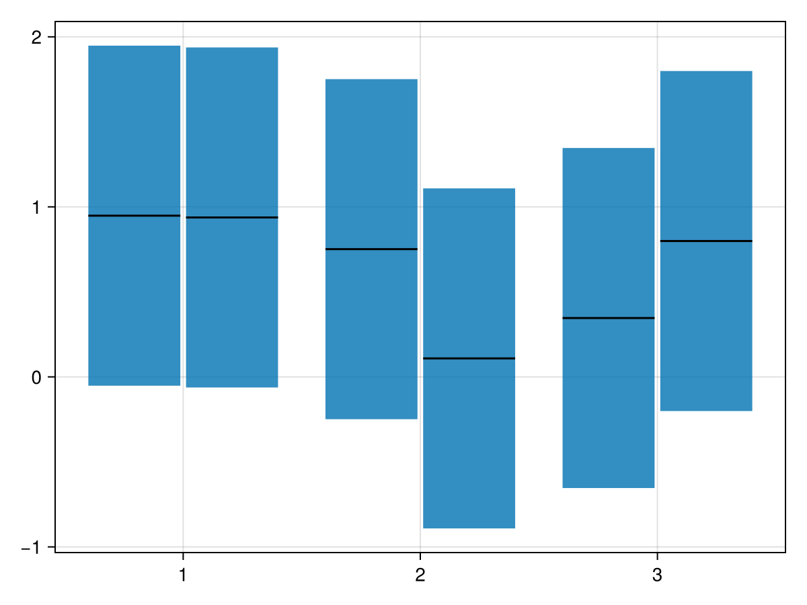

# crossbar {#crossbar}
<details class='jldocstring custom-block' open>
<summary><a id='Makie.crossbar-reference-plots-crossbar' href='#Makie.crossbar-reference-plots-crossbar'><span class="jlbinding">Makie.crossbar</span></a> <Badge type="info" class="jlObjectType jlFunction" text="Function" /></summary>


```julia
crossbar(x, y, ymin, ymax; kwargs...)
```


Draw a crossbar. A crossbar represents a range with a (potentially notched) box. It is most commonly used as part of the `boxplot`.

**Arguments**
- `x`: position of the box
  
- `y`: position of the midline within the box
  
- `ymin`: lower limit of the box
  
- `ymax`: upper limit of the box
  

**Plot type**

The plot type alias for the `crossbar` function is `CrossBar`.


<Badge type="info" class="source-link" text="source"><a href="https://github.com/MakieOrg/Makie.jl/blob/c1ff276792827f16c26b5ad51ea371f8a3759971/MakieCore/src/recipes.jl#L520-L579" target="_blank" rel="noreferrer">source</a></Badge>

</details>


## Examples {#Examples}
<a id="example-bc64da9" />


```julia
using CairoMakie
xs = [1, 1, 2, 2, 3, 3]
ys = rand(6)
ymins = ys .- 1
ymaxs = ys .+ 1
dodge = [1, 2, 1, 2, 1, 2]

crossbar(xs, ys, ymins, ymaxs, dodge = dodge, show_notch = true)
```




## Attributes {#Attributes}

### color {#color}

Defaults to `@inherit patchcolor`

No docs available.

### colormap {#colormap}

Defaults to `@inherit colormap`

No docs available.

### colorrange {#colorrange}

Defaults to `automatic`

No docs available.

### colorscale {#colorscale}

Defaults to `identity`

No docs available.

### cycle {#cycle}

Defaults to `[:color => :patchcolor]`

No docs available.

### dodge {#dodge}

Defaults to `automatic`

No docs available.

### dodge_gap {#dodge_gap}

Defaults to `0.03`

No docs available.

### gap {#gap}

Defaults to `0.2`

Shrinking factor, `width -> width * (1 - gap)`.

### inspectable {#inspectable}

Defaults to `@inherit inspectable`

No docs available.

### midlinecolor {#midlinecolor}

Defaults to `automatic`

No docs available.

### midlinewidth {#midlinewidth}

Defaults to `@inherit linewidth`

No docs available.

### n_dodge {#n_dodge}

Defaults to `automatic`

No docs available.

### notchmax {#notchmax}

Defaults to `automatic`

Upper limit of the notch.

### notchmin {#notchmin}

Defaults to `automatic`

Lower limit of the notch.

### notchwidth {#notchwidth}

Defaults to `0.5`

Multiplier of `width` for narrowest width of notch.

### orientation {#orientation}

Defaults to `:vertical`

Orientation of box (`:vertical` or `:horizontal`).

### show_midline {#show_midline}

Defaults to `true`

Show midline.

### show_notch {#show_notch}

Defaults to `false`

Whether to draw the notch.

### strokecolor {#strokecolor}

Defaults to `@inherit patchstrokecolor`

No docs available.

### strokewidth {#strokewidth}

Defaults to `@inherit patchstrokewidth`

No docs available.

### width {#width}

Defaults to `automatic`

Width of the box before shrinking.
