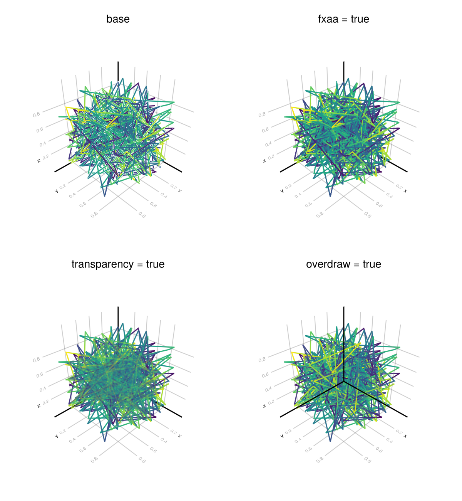
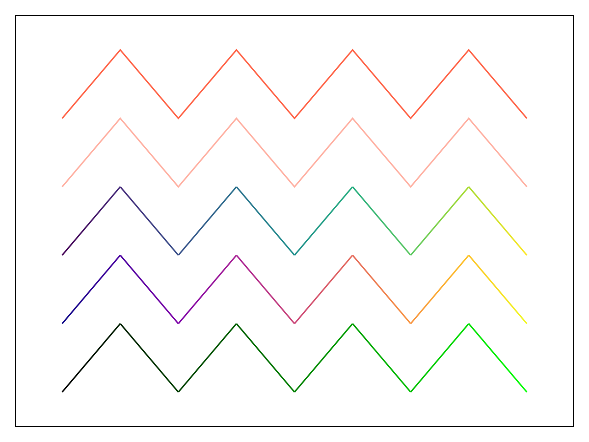
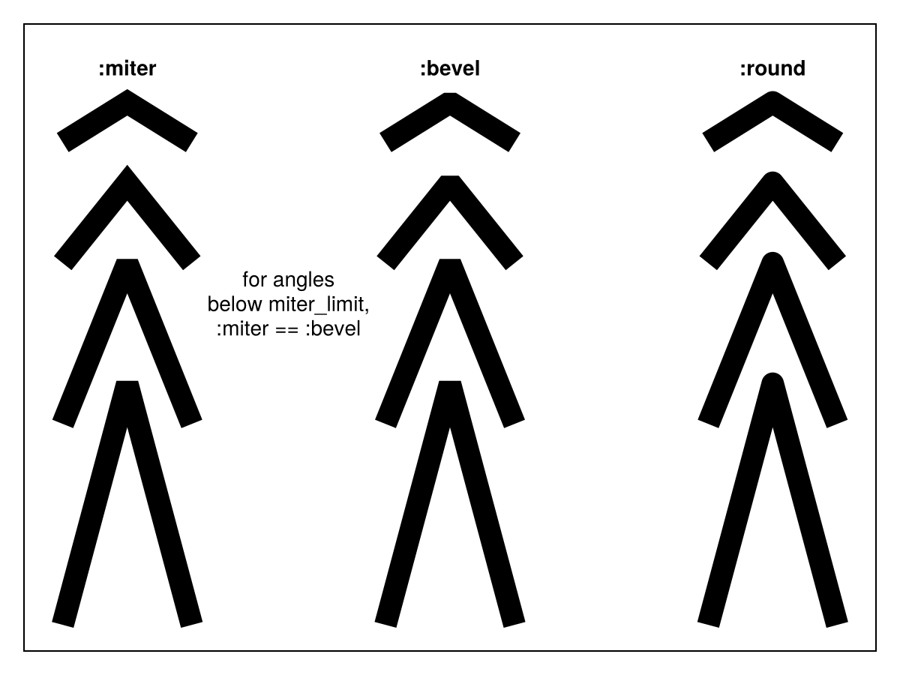
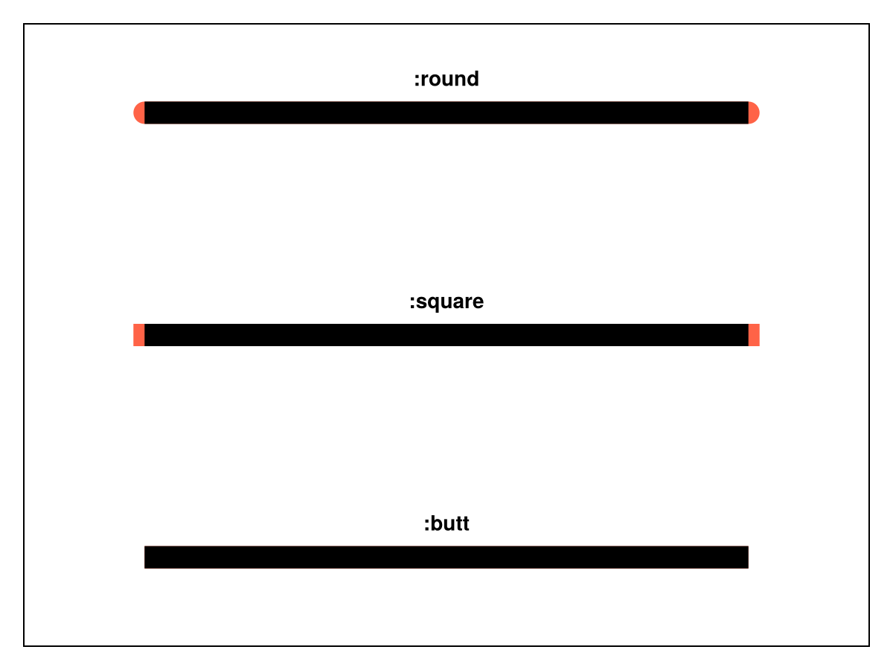
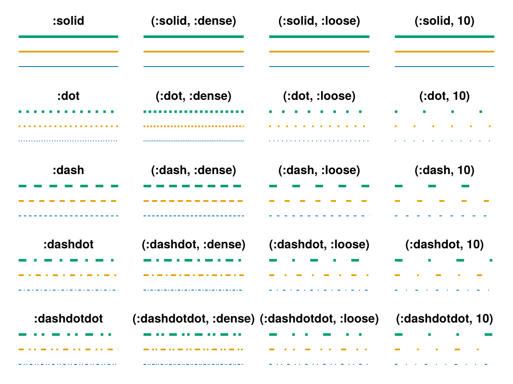
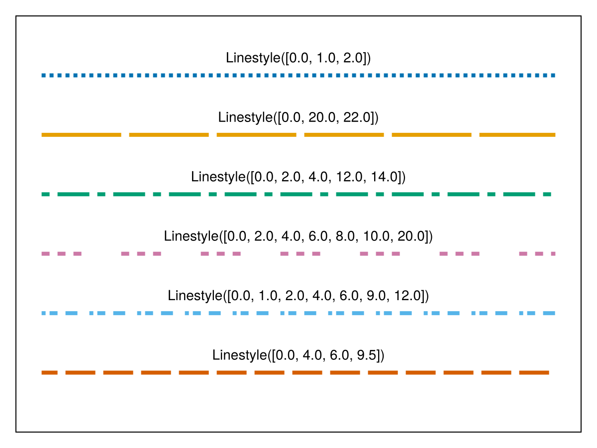
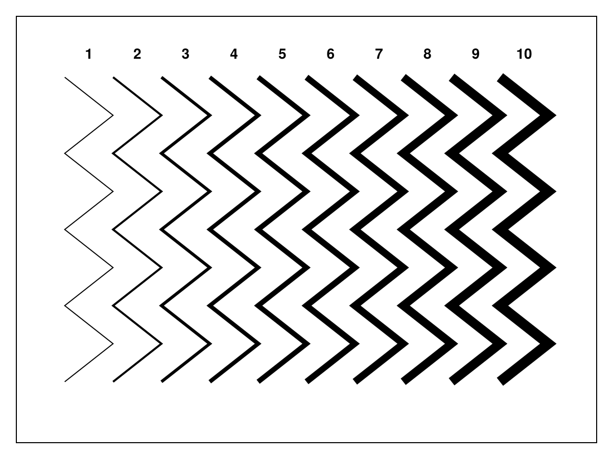

# lines {#lines}
<details class='jldocstring custom-block' open>
<summary><a id='MakieCore.lines-reference-plots-lines' href='#MakieCore.lines-reference-plots-lines'><span class="jlbinding">MakieCore.lines</span></a> <Badge type="info" class="jlObjectType jlFunction" text="Function" /></summary>


```julia
lines(positions)
lines(x, y)
lines(x, y, z)
```


Creates a connected line plot for each element in `(x, y, z)`, `(x, y)` or `positions`.

`NaN` values are displayed as gaps in the line.

**Plot type**

The plot type alias for the `lines` function is `Lines`.


<Badge type="info" class="source-link" text="source"><a href="https://github.com/MakieOrg/Makie.jl/blob/cefec3bc07a829ab04fb7edfbd5ae240496109fa/MakieCore/src/recipes.jl#L520-L605" target="_blank" rel="noreferrer">source</a></Badge>

</details>


### Dealing with outline artifacts in GLMakie {#Dealing-with-outline-artifacts-in-GLMakie}

In GLMakie 3D line plots can generate outline artifacts depending on the order line segments are rendered in. Currently there are a few ways to mitigate this problem, but they all come at a cost:
- `fxaa = true` will disable the native anti-aliasing of line segments and use fxaa instead. This results in less detailed lines.
  
- `transparency = true` will disable depth testing to a degree, resulting in all lines being rendered without artifacts. However with this lines will always have some level of transparency.
  
- `overdraw = true` will disable depth testing entirely (read and write) for the plot, removing artifacts. This will however change the z-order of line segments and allow plots rendered later to show up on top of the lines plot.
  
<a id="example-cfee0fd" />


```julia
using GLMakie
ps = rand(Point3f, 500)
cs = rand(500)
f = Figure(size = (600, 650))
Label(f[1, 1], "base", tellwidth = false)
lines(f[2, 1], ps, color = cs, fxaa = false)
Label(f[1, 2], "fxaa = true", tellwidth = false)
lines(f[2, 2], ps, color = cs, fxaa = true)
Label(f[3, 1], "transparency = true", tellwidth = false)
lines(f[4, 1], ps, color = cs, transparency = true)
Label(f[3, 2], "overdraw = true", tellwidth = false)
lines(f[4, 2], ps, color = cs, overdraw = true)
f
```




## Attributes {#Attributes}

### alpha {#alpha}

Defaults to `1.0`

The alpha value of the colormap or color attribute. Multiple alphas like in `plot(alpha=0.2, color=(:red, 0.5)`, will get multiplied.

### clip_planes {#clip_planes}

Defaults to `automatic`

Clip planes offer a way to do clipping in 3D space. You can set a Vector of up to 8 `Plane3f` planes here, behind which plots will be clipped (i.e. become invisible). By default clip planes are inherited from the parent plot or scene. You can remove parent `clip_planes` by passing `Plane3f[]`.

### color {#color}

Defaults to `@inherit linecolor`

The color of the line.
<a id="example-f897e66" />


```julia
using CairoMakie
fig = Figure()
ax = Axis(fig[1, 1], yautolimitmargin = (0.1, 0.1), xautolimitmargin = (0.1, 0.1))
hidedecorations!(ax)

lines!(ax, 1:9, iseven.(1:9) .- 0; color = :tomato)
lines!(ax, 1:9, iseven.(1:9) .- 1; color = (:tomato, 0.5))
lines!(ax, 1:9, iseven.(1:9) .- 2; color = 1:9)
lines!(ax, 1:9, iseven.(1:9) .- 3; color = 1:9, colormap = :plasma)
lines!(ax, 1:9, iseven.(1:9) .- 4; color = RGBf.(0, (0:8) ./ 8, 0))
fig
```




### colormap {#colormap}

Defaults to `@inherit colormap :viridis`

Sets the colormap that is sampled for numeric `color`s. `PlotUtils.cgrad(...)`, `Makie.Reverse(any_colormap)` can be used as well, or any symbol from ColorBrewer or PlotUtils. To see all available color gradients, you can call `Makie.available_gradients()`.

### colorrange {#colorrange}

Defaults to `automatic`

The values representing the start and end points of `colormap`.

### colorscale {#colorscale}

Defaults to `identity`

The color transform function. Can be any function, but only works well together with `Colorbar` for `identity`, `log`, `log2`, `log10`, `sqrt`, `logit`, `Makie.pseudolog10` and `Makie.Symlog10`.

### cycle {#cycle}

Defaults to `[:color]`

Sets which attributes to cycle when creating multiple plots.

### depth_shift {#depth_shift}

Defaults to `0.0`

Adjusts the depth value of a plot after all other transformations, i.e. in clip space, where `-1 <= depth <= 1`. This only applies to GLMakie and WGLMakie and can be used to adjust render order (like a tunable overdraw).

### fxaa {#fxaa}

Defaults to `false`

Adjusts whether the plot is rendered with fxaa (anti-aliasing, GLMakie only).

### highclip {#highclip}

Defaults to `automatic`

The color for any value above the colorrange.

### inspectable {#inspectable}

Defaults to `@inherit inspectable`

Sets whether this plot should be seen by `DataInspector`. The default depends on the theme of the parent scene.

### inspector_clear {#inspector_clear}

Defaults to `automatic`

Sets a callback function `(inspector, plot) -> ...` for cleaning up custom indicators in DataInspector.

### inspector_hover {#inspector_hover}

Defaults to `automatic`

Sets a callback function `(inspector, plot, index) -> ...` which replaces the default `show_data` methods.

### inspector_label {#inspector_label}

Defaults to `automatic`

Sets a callback function `(plot, index, position) -> string` which replaces the default label generated by DataInspector.

### joinstyle {#joinstyle}

Defaults to `@inherit joinstyle`

Controls the rendering at corners. Options are `:miter` for sharp corners, `:bevel` for &quot;cut off&quot; corners, and `:round` for rounded corners. If the corner angle is below `miter_limit`, `:miter` is equivalent to `:bevel` to avoid long spikes.
<a id="example-3ef5419" />


```julia
using CairoMakie

fig = Figure()
ax = Axis(fig[1, 1], yautolimitmargin = (0.05, 0.15))
hidedecorations!(ax)

joinstyles = [:miter, :bevel, :round]
for (i, joinstyle) in enumerate(joinstyles)
    x = (1:3) .+ 5 * (i - 1)
    ys = [[0.5, 3.5, 0.5], [3, 5, 3], [5, 6, 5], [6.5, 7, 6.5]]
    for y in ys
        lines!(ax, x, y; linewidth = 15, joinstyle, color = :black)
    end
    text!(ax, x[2], ys[end][2], text = ":$joinstyle",
        align = (:center, :bottom), offset = (0, 15), font = :bold)
end

text!(ax, 4.5, 4.5, text = "for angles
below miter_limit,
:miter == :bevel",
    align = (:center, :center))

fig
```




### linecap {#linecap}

Defaults to `@inherit linecap`

Sets the type of line cap used. Options are `:butt` (flat without extrusion), `:square` (flat with half a linewidth extrusion) or `:round`.
<a id="example-2bd4868" />


```julia
using CairoMakie
fig = Figure()
ax = Axis(fig[1, 1], yautolimitmargin = (0.2, 0.2), xautolimitmargin = (0.2, 0.2))
hidedecorations!(ax)

linecaps = [:butt, :square, :round]
for (i, linecap) in enumerate(linecaps)
    lines!(ax, [i, i]; color = :tomato, linewidth = 15, linecap)
    lines!(ax, [i, i]; color = :black, linewidth = 15, linecap = :butt)
    text!(1.5, i, text = ":$linecap", font = :bold,
        align = (:center, :bottom), offset = (0, 15))
end
fig
```




### linestyle {#linestyle}

Defaults to `nothing`

Sets the dash pattern of the line. Options are `:solid` (equivalent to `nothing`), `:dot`, `:dash`, `:dashdot` and `:dashdotdot`. These can also be given in a tuple with a gap style modifier, either `:normal`, `:dense` or `:loose`. For example, `(:dot, :loose)` or `(:dashdot, :dense)`.

For custom patterns have a look at [`Makie.Linestyle`](/api#Makie.Linestyle).
<a id="example-af3630d" />


```julia
using CairoMakie
linestyles = [:solid, :dot, :dash, :dashdot, :dashdotdot]
gapstyles = [:normal, :dense, :loose, 10]
fig = Figure()
with_updates_suspended(fig.layout) do
    for (i, ls) in enumerate(linestyles)
        for (j, gs) in enumerate(gapstyles)
            title = gs === :normal ? repr(ls) : "$((ls, gs))"
            ax = Axis(fig[i, j]; title, yautolimitmargin = (0.2, 0.2))
            hidedecorations!(ax)
            hidespines!(ax)
            linestyle = (ls, gs)
            for linewidth in 1:3
                lines!(ax, 1:10, fill(linewidth, 10); linestyle, linewidth)
            end
        end
    end
end
fig
```



<a id="example-cdd0323" />


```julia
using CairoMakie
fig = Figure()
patterns = [
    [0, 1, 2],
    [0, 20, 22],
    [0, 2, 4, 12, 14],
    [0, 2, 4, 6, 8, 10, 20],
    [0, 1, 2, 4, 6, 9, 12],
    [0.0, 4.0, 6.0, 9.5],
]
ax = Axis(fig[1, 1], yautolimitmargin = (0.2, 0.2))
for (i, pattern) in enumerate(patterns)
    lines!(ax, [-i, -i], linestyle = Linestyle(pattern), linewidth = 4)
    text!(ax, (1.5, -i), text = "Linestyle($pattern)",
        align = (:center, :bottom), offset = (0, 10))
end
hidedecorations!(ax)
fig
```




### linewidth {#linewidth}

Defaults to `@inherit linewidth`

Sets the width of the line in screen units
<a id="example-8fa4f3c" />


```julia
using CairoMakie
fig = Figure()
ax = Axis(fig[1, 1], yautolimitmargin = (0.2, 0.2), xautolimitmargin = (0.1, 0.1))
hidedecorations!(ax)

for linewidth in 1:10
    lines!(ax, iseven.(1:9) .+ linewidth, 1:9; color = :black, linewidth)
    text!(ax, linewidth + 0.5, 9; text = "$linewidth", font = :bold,
        align = (:center, :bottom), offset = (0, 15))
end
fig
```




### lowclip {#lowclip}

Defaults to `automatic`

The color for any value below the colorrange.

### miter_limit {#miter_limit}

Defaults to `@inherit miter_limit`

Sets the minimum inner join angle below which miter joins truncate. See also `Makie.miter_distance_to_angle`.

### model {#model}

Defaults to `automatic`

Sets a model matrix for the plot. This overrides adjustments made with `translate!`, `rotate!` and `scale!`.

### nan_color {#nan_color}

Defaults to `:transparent`

The color for NaN values.

### overdraw {#overdraw}

Defaults to `false`

Controls if the plot will draw over other plots. This specifically means ignoring depth checks in GL backends

### space {#space}

Defaults to `:data`

Sets the transformation space for box encompassing the plot. See `Makie.spaces()` for possible inputs.

### ssao {#ssao}

Defaults to `false`

Adjusts whether the plot is rendered with ssao (screen space ambient occlusion). Note that this only makes sense in 3D plots and is only applicable with `fxaa = true`.

### transformation {#transformation}

Defaults to `:automatic`

No docs available.

### transparency {#transparency}

Defaults to `false`

Adjusts how the plot deals with transparency. In GLMakie `transparency = true` results in using Order Independent Transparency.

### visible {#visible}

Defaults to `true`

Controls whether the plot will be rendered or not.
