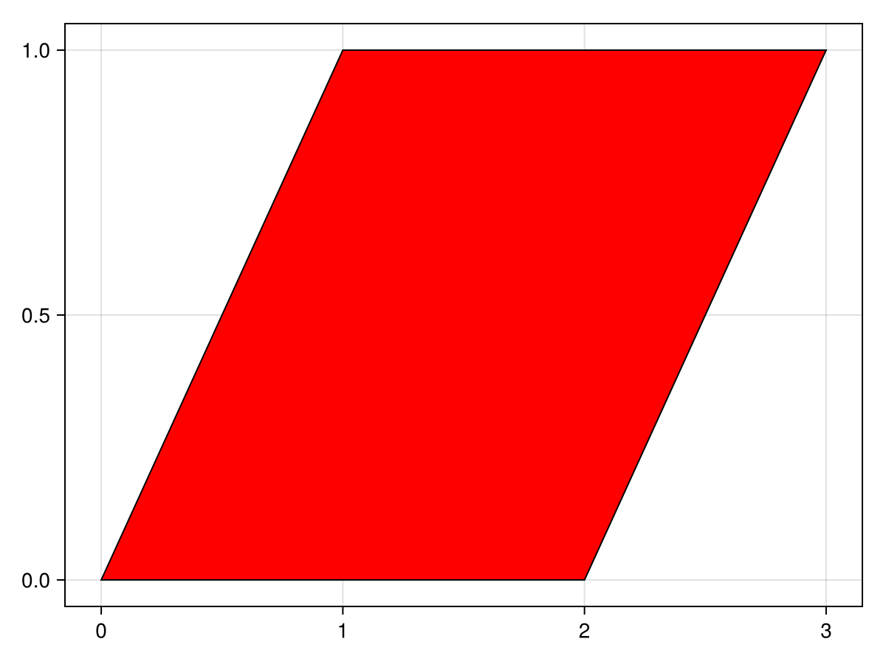
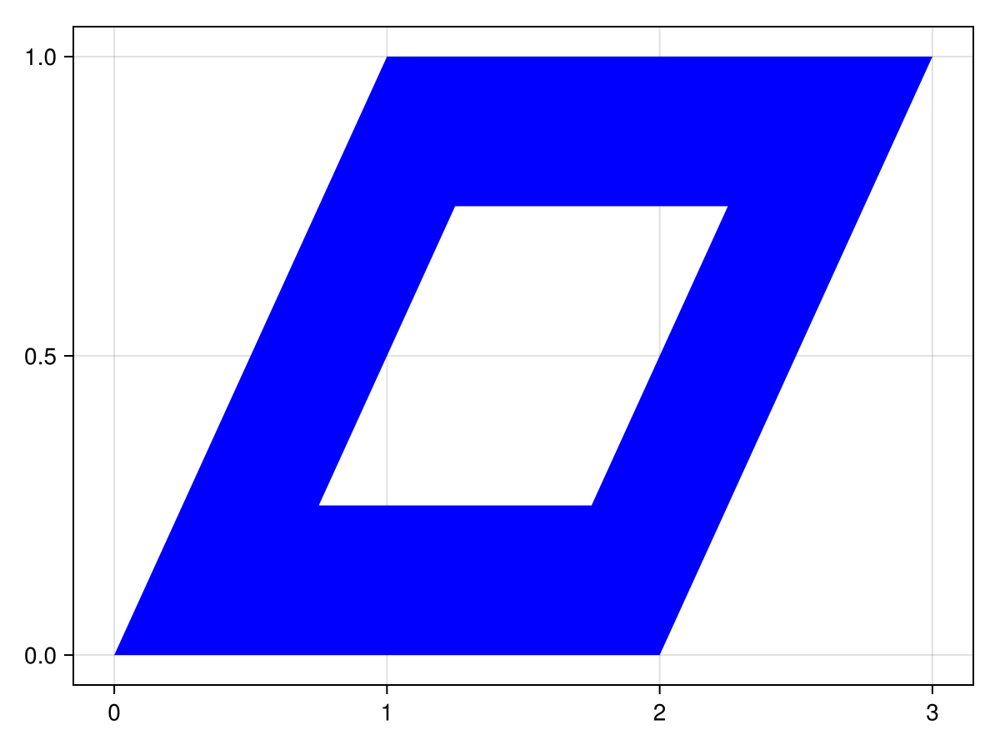
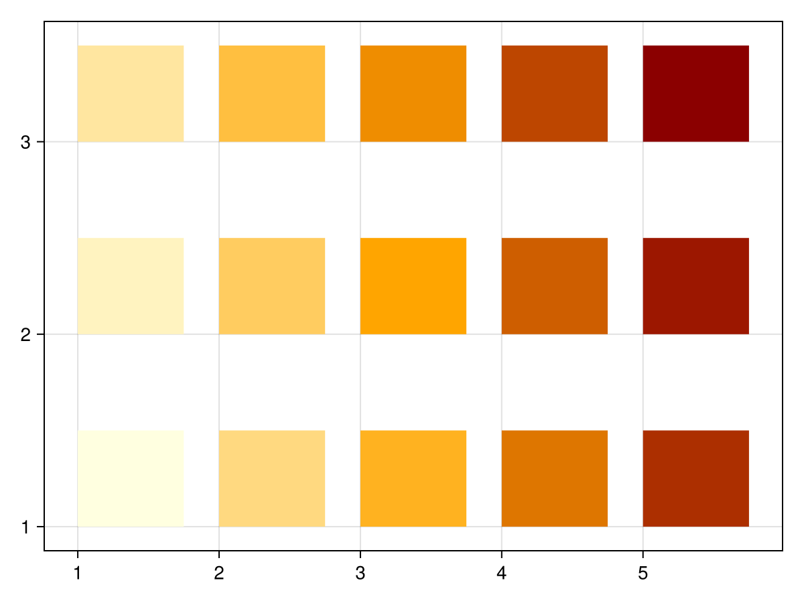
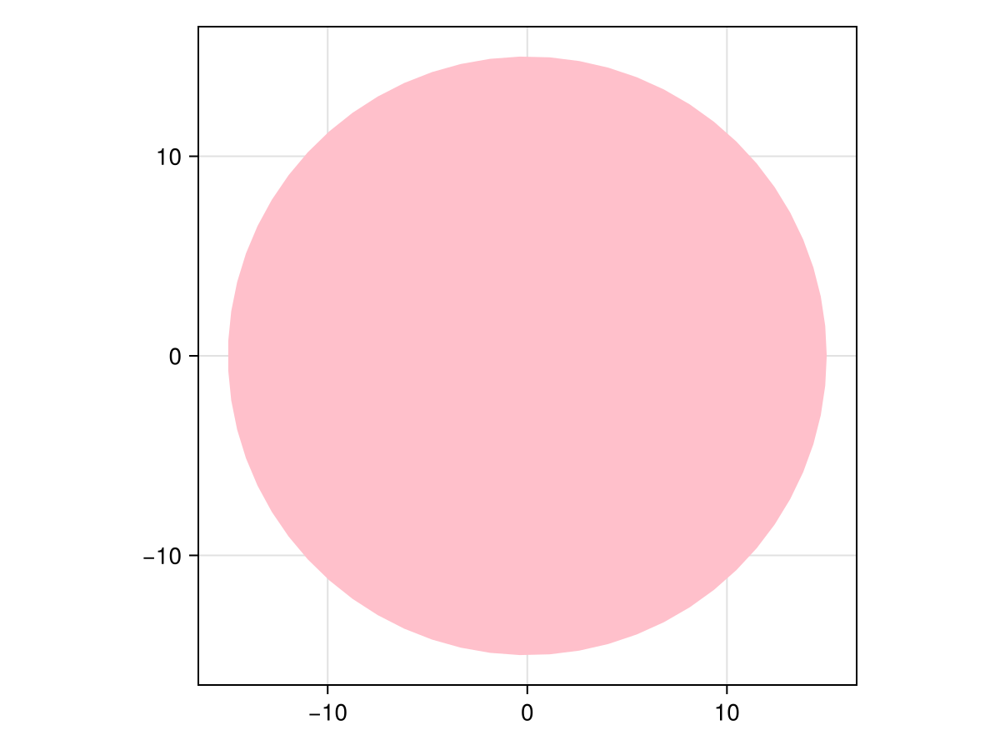
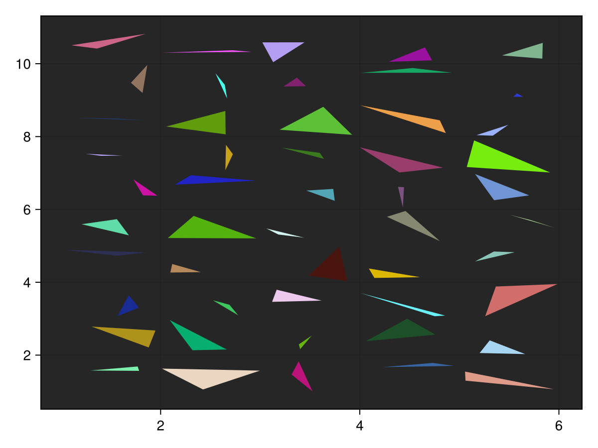
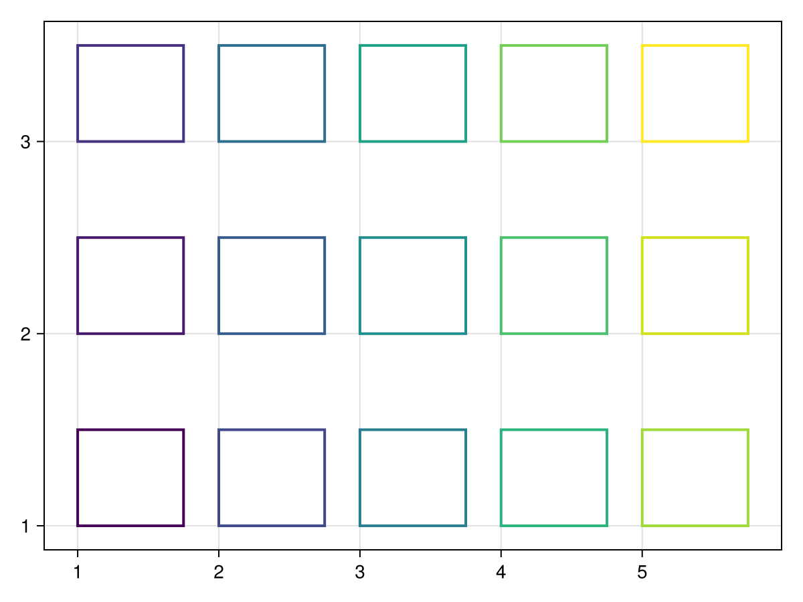

# poly {#poly}
<details class='jldocstring custom-block' open>
<summary><a id='MakieCore.poly-reference-plots-poly' href='#MakieCore.poly-reference-plots-poly'><span class="jlbinding">MakieCore.poly</span></a> <Badge type="info" class="jlObjectType jlFunction" text="Function" /></summary>


```julia
poly(vertices, indices; kwargs...)
poly(points; kwargs...)
poly(shape; kwargs...)
poly(mesh; kwargs...)
```


Plots a polygon based on the arguments given. When vertices and indices are given, it functions similarly to `mesh`. When points are given, it draws one polygon that connects all the points in order. When a shape is given (essentially anything decomposable by `GeometryBasics`), it will plot `decompose(shape)`.

```
poly(coordinates, connectivity; kwargs...)
```


Plots polygons, which are defined by `coordinates` (the coordinates of the vertices) and `connectivity` (the edges between the vertices).

**Plot type**

The plot type alias for the `poly` function is `Poly`.


<Badge type="info" class="source-link" text="source"><a href="https://github.com/MakieOrg/Makie.jl/blob/c1ff276792827f16c26b5ad51ea371f8a3759971/MakieCore/src/recipes.jl#L520-L621" target="_blank" rel="noreferrer">source</a></Badge>

</details>


## Examples {#Examples}
<a id="example-6dec16d" />


```julia
using CairoMakie
using Makie.GeometryBasics


f = Figure()
Axis(f[1, 1])

poly!(Point2f[(0, 0), (2, 0), (3, 1), (1, 1)], color = :red, strokecolor = :black, strokewidth = 1)

f
```



<a id="example-6a2ef28" />


```julia
using CairoMakie
using Makie.GeometryBasics


f = Figure()
Axis(f[1, 1])

# polygon with hole
p = Polygon(
    Point2f[(0, 0), (2, 0), (3, 1), (1, 1)],
    [Point2f[(0.75, 0.25), (1.75, 0.25), (2.25, 0.75), (1.25, 0.75)]]
)

poly!(p, color = :blue)

f
```



<a id="example-dc63959" />


```julia
using CairoMakie
using Makie.GeometryBasics


f = Figure()
Axis(f[1, 1])

# vector of shapes
poly!(
    [Rect(i, j, 0.75, 0.5) for i in 1:5 for j in 1:3],
    color = 1:15,
    colormap = :heat
)

f
```



<a id="example-c30fc9a" />


```julia
using CairoMakie
using Makie.GeometryBasics


f = Figure()
Axis(f[1, 1], aspect = DataAspect())

# shape decomposition
poly!(Circle(Point2f(0, 0), 15f0), color = :pink)

f
```



<a id="example-84b122e" />


```julia
using CairoMakie
using Makie.GeometryBasics


f = Figure()
Axis(f[1, 1]; backgroundcolor = :gray15)

# vector of polygons
ps = [Polygon(rand(Point2f, 3) .+ Point2f(i, j))
    for i in 1:5 for j in 1:10]

poly!(ps, color = rand(RGBf, length(ps)))

f
```



<a id="example-4d9ddf2" />


```julia
using CairoMakie
using Makie.GeometryBasics


f = Figure()
Axis(f[1, 1])

# vector of shapes
poly!(
    [Rect(i, j, 0.75, 0.5) for i in 1:5 for j in 1:3],
    color = :white,
    strokewidth = 2,
    strokecolor = 1:15,
    strokecolormap=:plasma,
)

f
```




## Attributes {#Attributes}

### alpha {#alpha}

Defaults to `1.0`

The alpha value of the colormap or color attribute. Multiple alphas like in `plot(alpha=0.2, color=(:red, 0.5)`, will get multiplied.

### clip_planes {#clip_planes}

Defaults to `automatic`

Clip planes offer a way to do clipping in 3D space. You can set a Vector of up to 8 `Plane3f` planes here, behind which plots will be clipped (i.e. become invisible). By default clip planes are inherited from the parent plot or scene. You can remove parent `clip_planes` by passing `Plane3f[]`.

### color {#color}

Defaults to `@inherit patchcolor`

Sets the color of the poly. Can be a `Vector{<:Colorant}` for per vertex colors or a single `Colorant`. A `Matrix{<:Colorant}` can be used to color the mesh with a texture, which requires the mesh to contain texture coordinates. Vector or Matrices of numbers can be used as well, which will use the colormap arguments to map the numbers to colors. One can also use a `<: AbstractPattern`, to cover the poly with a regular pattern, e.g. for hatching.

### colormap {#colormap}

Defaults to `@inherit colormap :viridis`

Sets the colormap that is sampled for numeric `color`s. `PlotUtils.cgrad(...)`, `Makie.Reverse(any_colormap)` can be used as well, or any symbol from ColorBrewer or PlotUtils. To see all available color gradients, you can call `Makie.available_gradients()`.

### colorrange {#colorrange}

Defaults to `automatic`

The values representing the start and end points of `colormap`.

### colorscale {#colorscale}

Defaults to `identity`

The color transform function. Can be any function, but only works well together with `Colorbar` for `identity`, `log`, `log2`, `log10`, `sqrt`, `logit`, `Makie.pseudolog10` and `Makie.Symlog10`.

### cycle {#cycle}

Defaults to `[:color => :patchcolor]`

No docs available.

### depth_shift {#depth_shift}

Defaults to `0.0`

Adjusts the depth value of a plot after all other transformations, i.e. in clip space, where `-1 <= depth <= 1`. This only applies to GLMakie and WGLMakie and can be used to adjust render order (like a tunable overdraw).

### fxaa {#fxaa}

Defaults to `true`

Adjusts whether the plot is rendered with fxaa (anti-aliasing, GLMakie only).

### highclip {#highclip}

Defaults to `automatic`

The color for any value above the colorrange.

### inspectable {#inspectable}

Defaults to `@inherit inspectable`

Sets whether this plot should be seen by `DataInspector`. The default depends on the theme of the parent scene.

### inspector_clear {#inspector_clear}

Defaults to `automatic`

Sets a callback function `(inspector, plot) -> ...` for cleaning up custom indicators in DataInspector.

### inspector_hover {#inspector_hover}

Defaults to `automatic`

Sets a callback function `(inspector, plot, index) -> ...` which replaces the default `show_data` methods.

### inspector_label {#inspector_label}

Defaults to `automatic`

Sets a callback function `(plot, index, position) -> string` which replaces the default label generated by DataInspector.

### joinstyle {#joinstyle}

Defaults to `@inherit joinstyle`

No docs available.

### linecap {#linecap}

Defaults to `@inherit linecap`

No docs available.

### linestyle {#linestyle}

Defaults to `nothing`

Sets the dash pattern of the line. Options are `:solid` (equivalent to `nothing`), `:dot`, `:dash`, `:dashdot` and `:dashdotdot`. These can also be given in a tuple with a gap style modifier, either `:normal`, `:dense` or `:loose`. For example, `(:dot, :loose)` or `(:dashdot, :dense)`.

For custom patterns have a look at [`Makie.Linestyle`](/api#Makie.Linestyle).

### lowclip {#lowclip}

Defaults to `automatic`

The color for any value below the colorrange.

### miter_limit {#miter_limit}

Defaults to `@inherit miter_limit`

No docs available.

### model {#model}

Defaults to `automatic`

Sets a model matrix for the plot. This overrides adjustments made with `translate!`, `rotate!` and `scale!`.

### nan_color {#nan_color}

Defaults to `:transparent`

The color for NaN values.

### overdraw {#overdraw}

Defaults to `false`

Controls if the plot will draw over other plots. This specifically means ignoring depth checks in GL backends

### shading {#shading}

Defaults to `NoShading`

No docs available.

### space {#space}

Defaults to `:data`

Sets the transformation space for box encompassing the plot. See `Makie.spaces()` for possible inputs.

### ssao {#ssao}

Defaults to `false`

Adjusts whether the plot is rendered with ssao (screen space ambient occlusion). Note that this only makes sense in 3D plots and is only applicable with `fxaa = true`.

### stroke_depth_shift {#stroke_depth_shift}

Defaults to `-1.0e-5`

Depth shift of stroke plot. This is useful to avoid z-fighting between the stroke and the fill.

### strokecolor {#strokecolor}

Defaults to `@inherit patchstrokecolor`

Sets the color of the outline around a marker.

### strokecolormap {#strokecolormap}

Defaults to `@inherit colormap`

Sets the colormap that is sampled for numeric `color`s.

### strokewidth {#strokewidth}

Defaults to `@inherit patchstrokewidth`

Sets the width of the outline.

### transformation {#transformation}

Defaults to `:automatic`

No docs available.

### transparency {#transparency}

Defaults to `false`

Adjusts how the plot deals with transparency. In GLMakie `transparency = true` results in using Order Independent Transparency.

### visible {#visible}

Defaults to `true`

Controls whether the plot will be rendered or not.
