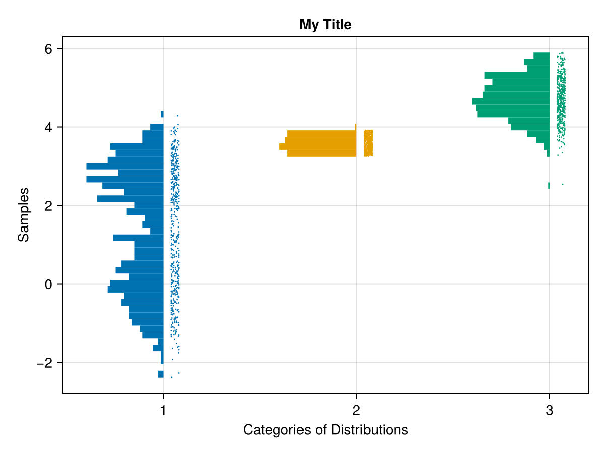
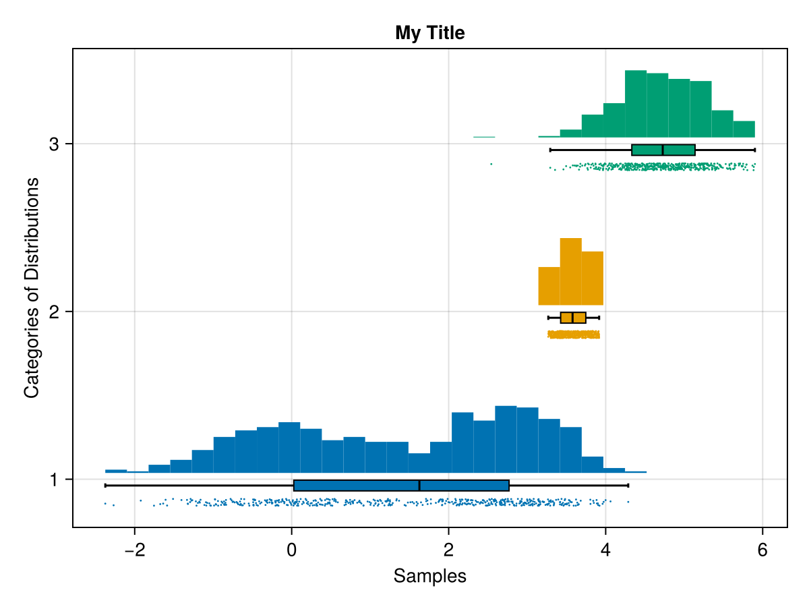
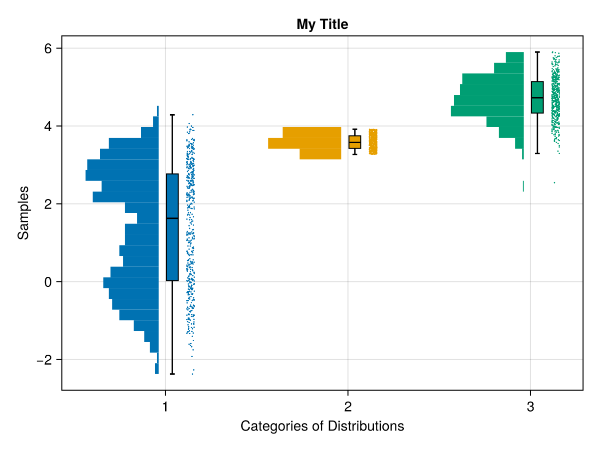
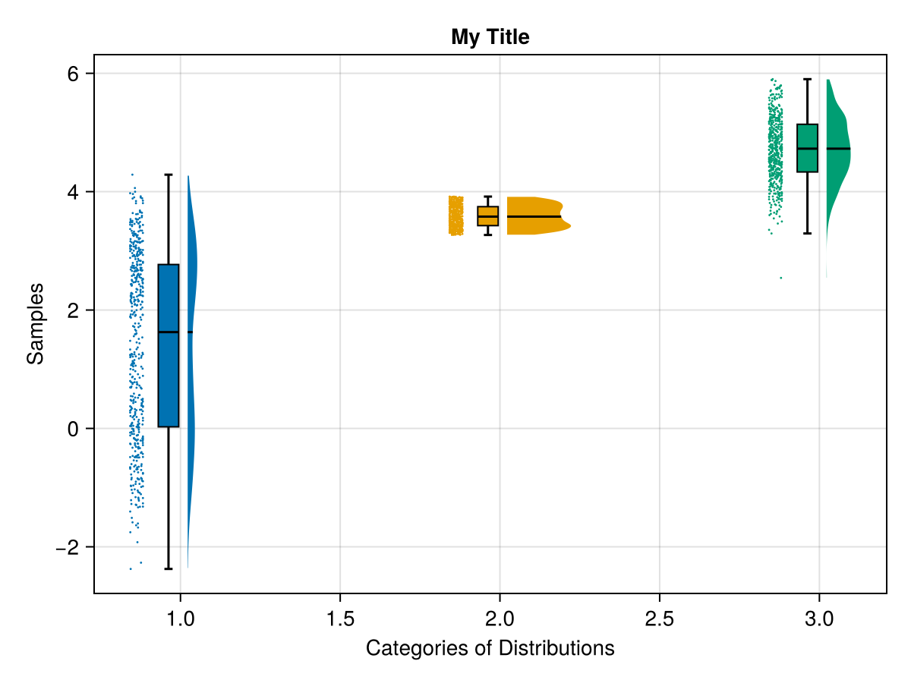
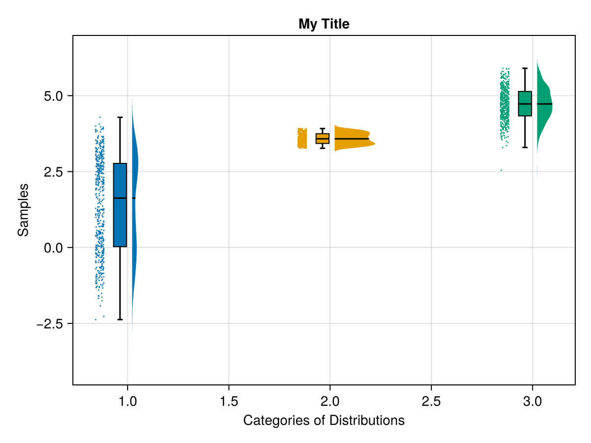
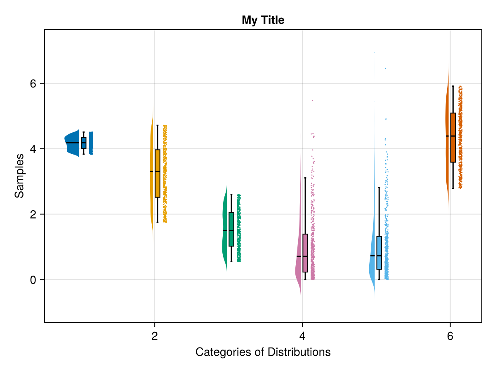
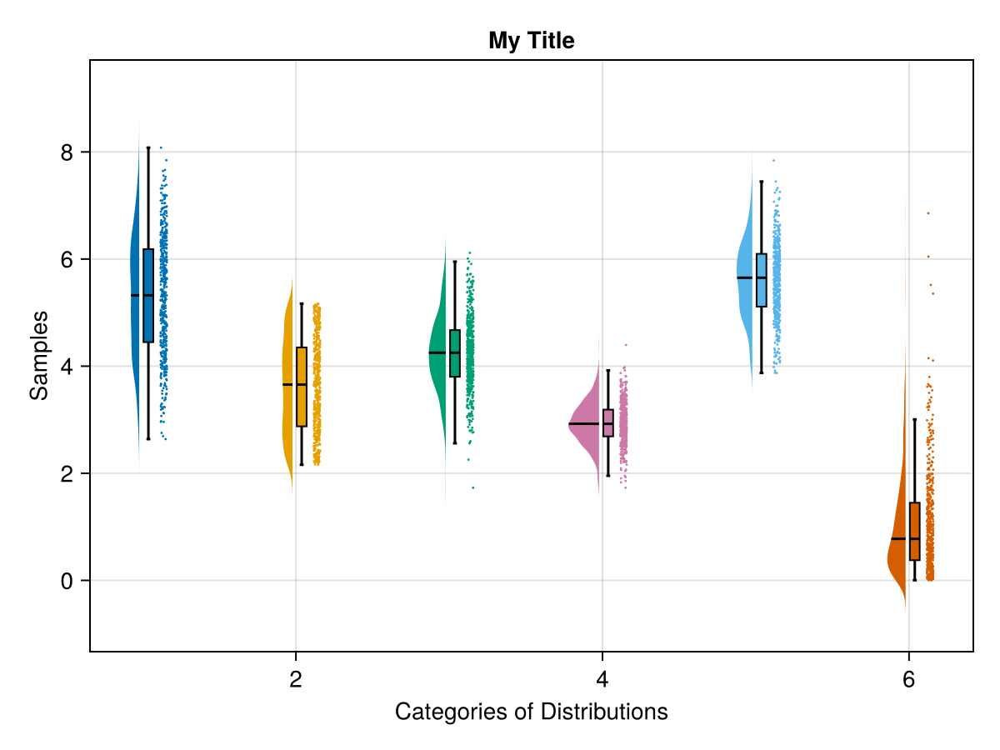
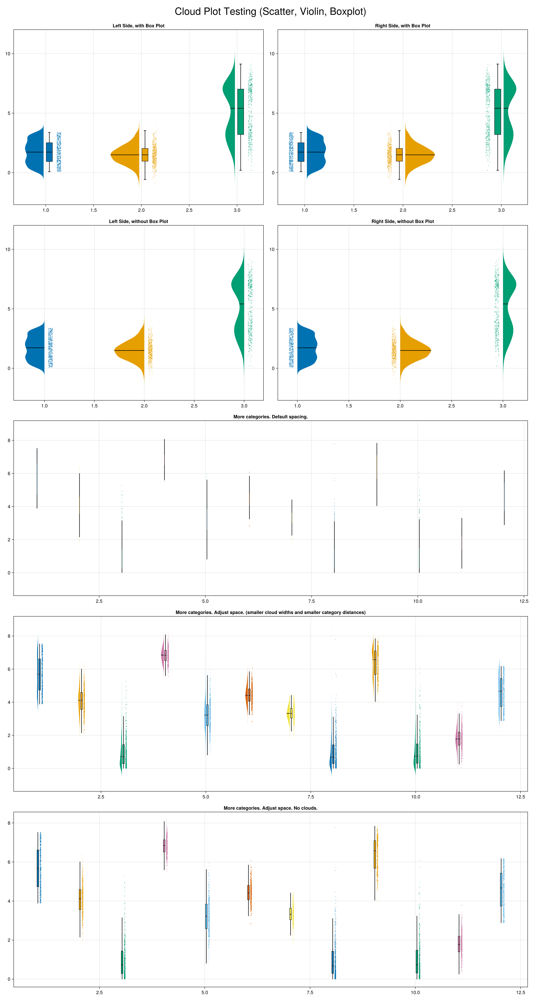

# rainclouds {#rainclouds}
<details class='jldocstring custom-block' open>
<summary><a id='Makie.rainclouds-reference-plots-rainclouds' href='#Makie.rainclouds-reference-plots-rainclouds'><span class="jlbinding">Makie.rainclouds</span></a> <Badge type="info" class="jlObjectType jlFunction" text="Function" /></summary>


```julia
rainclouds!(ax, category_labels, data_array; plot_boxplots=true, plot_clouds=true, kwargs...)
```


Plot a violin (/histogram), boxplot and individual data points with appropriate spacing between each.

**Arguments**
- `ax`: Axis used to place all these plots onto.
  
- `category_labels`: Typically `Vector{String}` with a label for each element in `data_array`
  
- `data_array`: Typically `Vector{Float64}` used for to represent the datapoints to plot.
  

**Keywords**

**Plot type**

The plot type alias for the `rainclouds` function is `RainClouds`.


<Badge type="info" class="source-link" text="source"><a href="https://github.com/MakieOrg/Makie.jl/blob/cefec3bc07a829ab04fb7edfbd5ae240496109fa/MakieCore/src/recipes.jl#L520-L608" target="_blank" rel="noreferrer">source</a></Badge>

</details>


&quot;Raincloud&quot; plots are a combination of a (half) violin plot, box plot and scatter plots. The three together can make an appealing and informative visual, particularly for large N datasets.
<a id="example-52bdc5c" />


```julia
using CairoMakie
using Random
using Makie: rand_localized

####
#### Below is used for testing the plotting functionality.
####

function mockup_distribution(N)
    all_possible_labels = ["Single Mode", "Double Mode", "Random Exp", "Uniform"]
    category_type = rand(all_possible_labels)

    if category_type == "Single Mode"
        random_mean = rand_localized(0, 8)
        random_spread_coef = rand_localized(0.3, 1)
        data_points = random_spread_coef*randn(N) .+ random_mean

    elseif category_type == "Double Mode"
        random_mean = rand_localized(0, 8)
        random_spread_coef = rand_localized(0.3, 1)
        data_points = random_spread_coef*randn(Int(round(N/2.0))) .+ random_mean

        random_mean = rand_localized(0, 8)
        random_spread_coef = rand_localized(0.3, 1)
        data_points = vcat(data_points, random_spread_coef*randn(Int(round(N/2.0))) .+ random_mean)

    elseif category_type == "Random Exp"
        data_points = randexp(N)

    elseif category_type == "Uniform"
        min = rand_localized(0, 4)
        max = min + rand_localized(0.5, 4)
        data_points = [rand_localized(min, max) for _ in 1:N]

    else
        error("Unidentified category.")
    end

    return data_points
end

function mockup_categories_and_data_array(num_categories; N = 500)
    category_labels = String[]
    data_array = Float64[]

    for category_label in string.(('A':'Z')[1:min(num_categories, end)])
        data_points = mockup_distribution(N)

        append!(category_labels, fill(category_label, N))
        append!(data_array, data_points)
    end
    return category_labels, data_array
end

category_labels, data_array = mockup_categories_and_data_array(3)

colors = Makie.wong_colors()
rainclouds(category_labels, data_array;
    axis = (; xlabel = "Categories of Distributions", ylabel = "Samples", title = "My Title"),
    plot_boxplots = false, cloud_width=0.5, clouds=hist, hist_bins=50,
    color = colors[indexin(category_labels, unique(category_labels))])
```



<a id="example-f165b9a" />


```julia
rainclouds(category_labels, data_array;
    axis = (; ylabel = "Categories of Distributions",
    xlabel = "Samples", title = "My Title"),
    orientation = :horizontal,
    plot_boxplots = true, cloud_width=0.5, clouds=hist,
    color = colors[indexin(category_labels, unique(category_labels))])
```



<a id="example-567c5b4" />


```julia
rainclouds(category_labels, data_array;
    axis = (;
        xlabel = "Categories of Distributions",
        ylabel = "Samples",
        title = "My Title"
    ),
    plot_boxplots = true, cloud_width=0.5, clouds=hist,
    color = colors[indexin(category_labels, unique(category_labels))])
```



<a id="example-bd38c6b" />


```julia
rainclouds(category_labels, data_array;
    axis = (;
        xlabel = "Categories of Distributions",
        ylabel = "Samples",
        title = "My Title"
    ),
    plot_boxplots = true, cloud_width=0.5, side = :right,
    violin_limits = extrema, color = colors[indexin(category_labels, unique(category_labels))])
```



<a id="example-73cea56" />


```julia
rainclouds(category_labels, data_array;
    axis = (;
        xlabel = "Categories of Distributions",
        ylabel = "Samples",
        title = "My Title",
    ),
    plot_boxplots = true, cloud_width=0.5, side = :right,
    color = colors[indexin(category_labels, unique(category_labels))])
```



<a id="example-c5b14c3" />


```julia
more_category_labels, more_data_array = mockup_categories_and_data_array(6)

rainclouds(more_category_labels, more_data_array;
    axis = (;
        xlabel = "Categories of Distributions",
        ylabel = "Samples",
        title = "My Title",
    ),
    plot_boxplots = true, cloud_width=0.5,
    color = colors[indexin(more_category_labels, unique(more_category_labels))])
```



<a id="example-6face86" />


```julia
category_labels, data_array = mockup_categories_and_data_array(6)
rainclouds(category_labels, data_array;
    axis = (;
        xlabel = "Categories of Distributions",
        ylabel = "Samples",
        title = "My Title",
    ),
    plot_boxplots = true, cloud_width=0.5,
    color = colors[indexin(category_labels, unique(category_labels))])
```




4 of these, between 3 distributions Left and Right example With and Without Box Plot
<a id="example-cd4e254" />


```julia
fig = Figure(size = (800*2, 600*5))
colors = [Makie.wong_colors(); Makie.wong_colors()]

category_labels, data_array = mockup_categories_and_data_array(3)
rainclouds!(
    Axis(fig[1, 1], title = "Left Side, with Box Plot"),
    category_labels, data_array;
    side = :left,
    plot_boxplots = true,
    color = colors[indexin(category_labels, unique(category_labels))])

rainclouds!(
    Axis(fig[2, 1], title = "Left Side, without Box Plot"),
    category_labels, data_array;
    side = :left,
    plot_boxplots = false,
    color = colors[indexin(category_labels, unique(category_labels))])

rainclouds!(
    Axis(fig[1, 2], title = "Right Side, with Box Plot"),
    category_labels, data_array;
    side = :right,
    plot_boxplots = true,
    color = colors[indexin(category_labels, unique(category_labels))])

rainclouds!(
    Axis(fig[2, 2], title = "Right Side, without Box Plot"),
    category_labels, data_array;
    side = :right,
    plot_boxplots = false,
    color = colors[indexin(category_labels, unique(category_labels))])

# Plots with more categories
# dist_between_categories (0.6, 1.0)
# with and without clouds

category_labels, data_array = mockup_categories_and_data_array(12)
rainclouds!(
    Axis(fig[3, 1:2], title = "More categories. Default spacing."),
    category_labels, data_array;
    plot_boxplots = true,
    gap = 1.0,
    color = colors[indexin(category_labels, unique(category_labels))])

rainclouds!(
    Axis(fig[4, 1:2], title = "More categories. Adjust space. (smaller cloud widths and smaller category distances)"),
    category_labels, data_array;
    plot_boxplots = true,
    cloud_width = 0.3,
    gap = 0.5,
    color = colors[indexin(category_labels, unique(category_labels))])

rainclouds!(
    Axis(fig[5, 1:2], title = "More categories. Adjust space. No clouds."),
    category_labels, data_array;
    plot_boxplots = true,
    clouds = nothing,
    gap = 0.5,
    color = colors[indexin(category_labels, unique(category_labels))])

supertitle = Label(fig[0, :], "Cloud Plot Testing (Scatter, Violin, Boxplot)", fontsize=30)
fig
```




## Attributes {#Attributes}

### boxplot_nudge {#boxplot_nudge}

Defaults to `0.075`

Determines the distance away the boxplot should be placed from the center line when `center_boxplot` is `false`. This is the value used to recentering the boxplot.

### boxplot_width {#boxplot_width}

Defaults to `0.1`

Width of the boxplot on the category axis.

### center_boxplot {#center_boxplot}

Defaults to `true`

Whether or not to center the boxplot on the category.

### cloud_width {#cloud_width}

Defaults to `0.75`

Determines size of violin plot. Corresponds to `width` keyword arg in `violin`.

### clouds {#clouds}

Defaults to `violin`

[`violin`, `hist`, `nothing`] how to show cloud plots, either as violin or histogram plots, or not at all.

### color {#color}

Defaults to `@inherit patchcolor`

A single color, or a vector of colors, one for each point.

### cycle {#cycle}

Defaults to `[:color => :patchcolor]`

No docs available.

### dodge {#dodge}

Defaults to `automatic`

Vector of `Integer` (length of data) of grouping variable to create multiple side-by-side boxes at the same x position

### dodge_gap {#dodge_gap}

Defaults to `0.01`

Spacing between dodged boxes.

### gap {#gap}

Defaults to `0.2`

Distance between elements on the main axis (depending on `orientation`).

### hist_bins {#hist_bins}

Defaults to `30`

If `clouds=hist`, this passes down the number of bins to the histogram call.

### jitter_width {#jitter_width}

Defaults to `0.05`

Determines the width of the scatter-plot bar in category x-axis absolute terms.

### markersize {#markersize}

Defaults to `2.0`

Size of marker used for the scatter plot.

### n_dodge {#n_dodge}

Defaults to `automatic`

The number of categories to dodge (defaults to `maximum(dodge)`)

### orientation {#orientation}

Defaults to `:vertical`

Orientation of rainclouds (`:vertical` or `:horizontal`)

### plot_boxplots {#plot_boxplots}

Defaults to `true`

Whether to show boxplots to summarize distribution of data.

### show_boxplot_outliers {#show_boxplot_outliers}

Defaults to `false`

Show outliers in the boxplot as points (usually confusing when paired with the scatter plot so the default is to not show them)

### show_median {#show_median}

Defaults to `true`

Determines whether or not to have a line for the median value in the boxplot.

### side {#side}

Defaults to `:left`

Can take values of `:left`, `:right`, determines where the violin plot will be, relative to the scatter points

### side_nudge {#side_nudge}

Defaults to `automatic`

Scatter plot specific.  Default value is 0.02 if `plot_boxplots` is true, otherwise `0.075` default.

### strokewidth {#strokewidth}

Defaults to `1.0`

Determines the stroke width for the outline of the boxplot.

### violin_limits {#violin_limits}

Defaults to `(-Inf, Inf)`

Specify values to trim the `violin`. Can be a `Tuple` or a `Function` (e.g. `datalimits=extrema`)

### whiskerwidth {#whiskerwidth}

Defaults to `0.5`

The width of the Q1, Q3 whisker in the boxplot. Value as a portion of the `boxplot_width`.
