# scatter {#scatter}
<details class='jldocstring custom-block' open>
<summary><a id='MakieCore.scatter-reference-plots-scatter' href='#MakieCore.scatter-reference-plots-scatter'><span class="jlbinding">MakieCore.scatter</span></a> <Badge type="info" class="jlObjectType jlFunction" text="Function" /></summary>


```julia
scatter(positions)
scatter(x, y)
scatter(x, y, z)
```


Plots a marker for each element in `(x, y, z)`, `(x, y)`, or `positions`.

**Plot type**

The plot type alias for the `scatter` function is `Scatter`.


<Badge type="info" class="source-link" text="source"><a href="https://github.com/MakieOrg/Makie.jl/blob/cefec3bc07a829ab04fb7edfbd5ae240496109fa/MakieCore/src/recipes.jl#L520-L617" target="_blank" rel="noreferrer">source</a></Badge>

</details>


## Examples {#Examples}

### Using x and y vectors {#Using-x-and-y-vectors}

Scatters can be constructed by passing a list of x and y coordinates.
<a id="example-46f0df4" />


```julia
using CairoMakie
xs = range(0, 10, length = 30)
ys = 0.5 .* sin.(xs)

scatter(xs, ys)
```

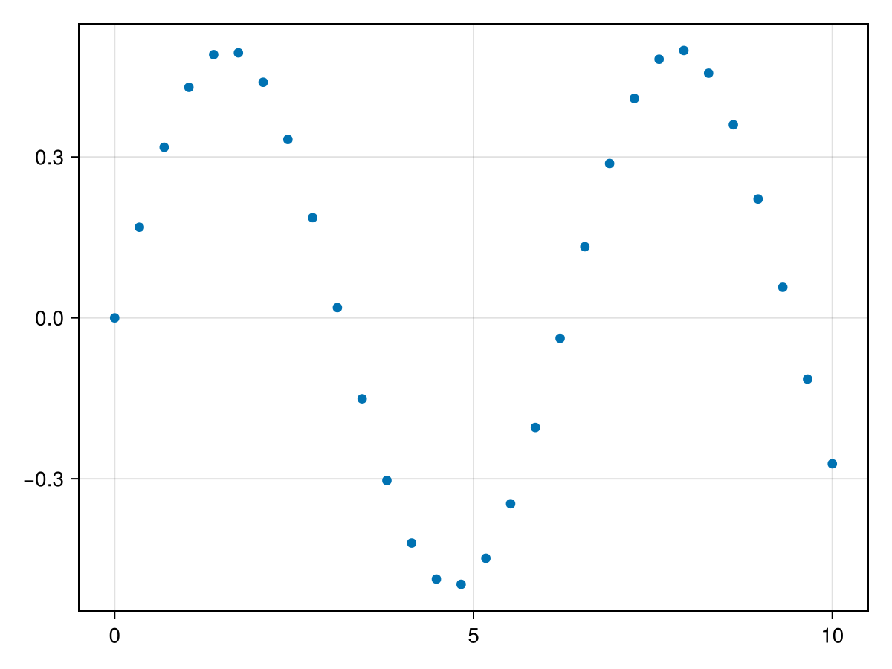


### Using points {#Using-points}

It is also possible to pass coordinates as a vector of points, which is preferred if the coordinates should be updated later, to avoid different lengths of x and y.

Attributes like `color` and `markersize` can be set in scalar or vector form. If you pass a vector of numbers for `color`, the attribute `colorrange` which is by default automatically equal to the extrema of the color values, decides how colors are looked up in the `colormap`.
<a id="example-73361a3" />


```julia
using CairoMakie
xs = range(0, 10, length = 30)
ys = 0.5 .* sin.(xs)
points = Point2f.(xs, ys)

scatter(points, color = 1:30, markersize = range(5, 30, length = 30),
    colormap = :thermal)
```

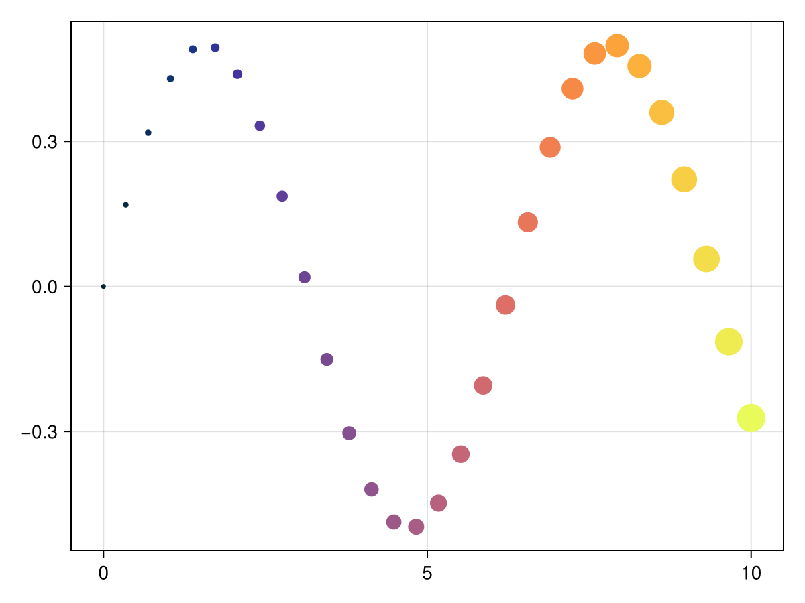


### Markers {#Markers}

There are a couple different categories of markers you can use with `scatter`:
- `Char`s like `'x'` or `'α'`. The glyphs are taken from Makie&#39;s default font `TeX Gyre Heros Makie`.
  
- `BezierPath` objects which can be used to create custom marker shapes. Most default markers which are accessed by symbol such as `:circle` or `:rect` convert to `BezierPath`s internally.
  
- `Polygon`s, which are equivalent to constructing `BezierPath`s exclusively out of `LineTo` commands.
  
- `Matrix{<:Colorant}` objects which are plotted as image scatters.
  
- Special markers like `Circle` and `Rect` which have their own backend implementations and can be faster to display.
  

#### Default markers {#Default-markers}

Here is an example plot showing different shapes that are accessible by `Symbol`s, as well as a few characters.
<a id="example-9a22400" />


```julia
using CairoMakie
markers_labels = [
    (:circle, ":circle"),
    (:rect, ":rect"),
    (:diamond, ":diamond"),
    (:hexagon, ":hexagon"),
    (:cross, ":cross"),
    (:xcross, ":xcross"),
    (:utriangle, ":utriangle"),
    (:dtriangle, ":dtriangle"),
    (:ltriangle, ":ltriangle"),
    (:rtriangle, ":rtriangle"),
    (:pentagon, ":pentagon"),
    (:star4, ":star4"),
    (:star5, ":star5"),
    (:star6, ":star6"),
    (:star8, ":star8"),
    (:vline, ":vline"),
    (:hline, ":hline"),
    ('a', "'a'"),
    ('B', "'B'"),
    ('↑', "'\\uparrow'"),
    ('😄', "'\\:smile:'"),
    ('✈', "'\\:airplane:'"),
]

f = Figure()
ax = Axis(f[1, 1], yreversed = true,
    xautolimitmargin = (0.15, 0.15),
    yautolimitmargin = (0.15, 0.15)
)
hidedecorations!(ax)

for (i, (marker, label)) in enumerate(markers_labels)
    p = Point2f(fldmod1(i, 6)...)

    scatter!(p, marker = marker, markersize = 20, color = :black)
    text!(p, text = label, color = :gray70, offset = (0, 20),
        align = (:center, :bottom))
end

f
```

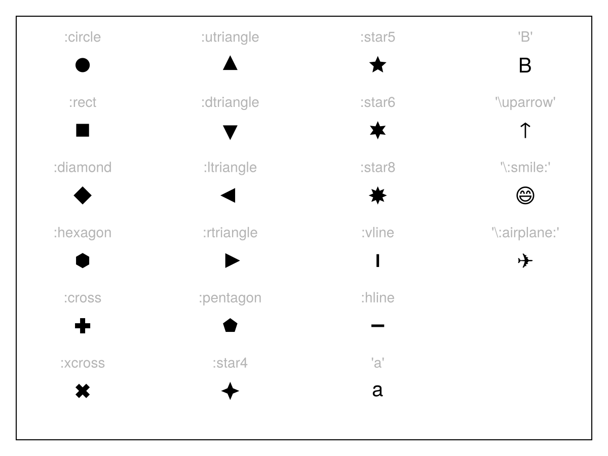


#### Markersize {#Markersize}

The `markersize` attribute scales the scatter size relative to the scatter marker&#39;s base size. Therefore, `markersize` cannot be directly understood in terms of a unit like `px`, it depends on _what_ is scaled.

For `Char` markers, `markersize` is equivalent to the font size when displaying the same characters using `text`.
<a id="example-a0e5bb8" />


```julia
using CairoMakie
f, ax, sc = scatter(1, 1, marker = 'A', markersize = 50)
text!(2, 1, text = "A", fontsize = 50, align = (:center, :center))
xlims!(ax, -1, 4)
f
```

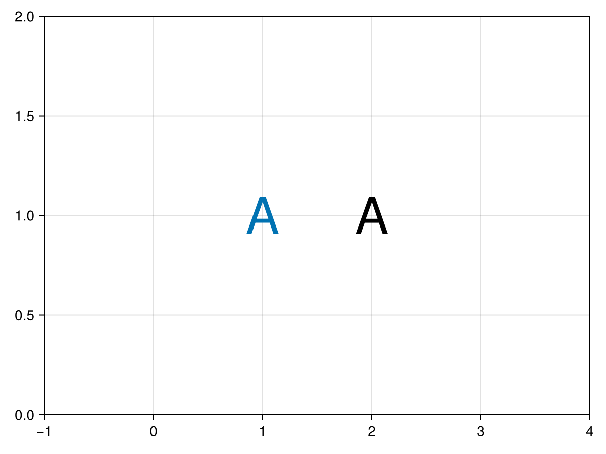


The default `BezierPath` markers like `:circle`, `:rect`, `:utriangle`, etc. have been chosen such that they approximately match `Char` markers of the same markersize. This makes it easier to switch out markers without the overall look changing too much. However, both `Char` and `BezierPath` markers are not exactly `markersize` high or wide. We can visualize this by plotting some `Char`s, `BezierPath`s, `Circle` and `Rect` in front of a line of width `50`. You can see that only the special markers `Circle` and `Rect` match the line width because their base size is 1 x 1, however they don&#39;t match the `Char`s or `BezierPath`s very well.
<a id="example-5cb20c8" />


```julia
using CairoMakie
f, ax, l = lines([0, 1], [1, 1], linewidth = 50, color = :gray80)
for (marker, x) in zip(['X', 'x', :circle, :rect, :utriangle, Circle, Rect], range(0.1, 0.9, length = 7))
    scatter!(ax, x, 1, marker = marker, markersize = 50, color = :black)
end
f
```

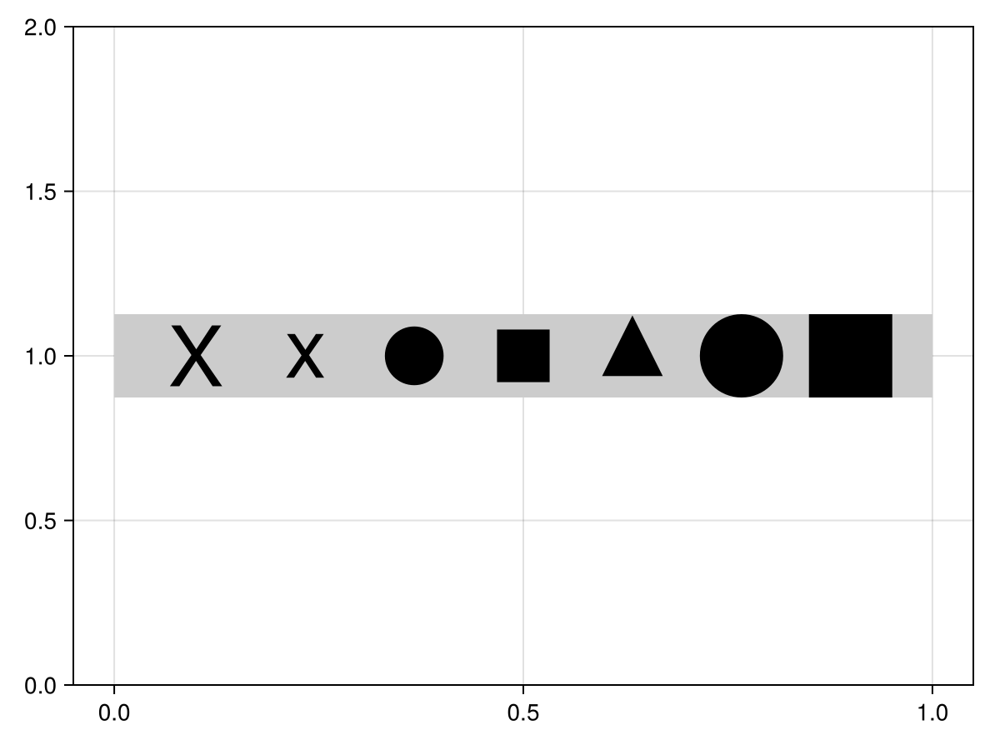


If you need a marker that has some exact base size, so that you can match it with lines or other plot objects of known size, or because you want to use the marker in data space, you can construct it yourself using `BezierPath` or `Polygon`. A marker with a base size of 1 x 1, e.g., will be scaled like `lines` when `markersize` and `linewidth` are the same, just like `Circle` and `Rect` markers.

Here, we construct a hexagon polygon with radius `1`, which we can then use to tile a surface in data coordinates by setting `markerspace = :data`.
<a id="example-7b25d6d" />


```julia
using CairoMakie
hexagon = Makie.Polygon([Point2f(cos(a), sin(a)) for a in range(1/6 * pi, 13/6 * pi, length = 7)])

points = Point2f[(0, 0), (sqrt(3), 0), (sqrt(3)/2, 1.5)]

scatter(points,
    marker = hexagon,
    markersize = 1,
    markerspace = :data,
    color = 1:3,
    axis = (; aspect = 1, limits = (-2, 4, -2, 4)))
```

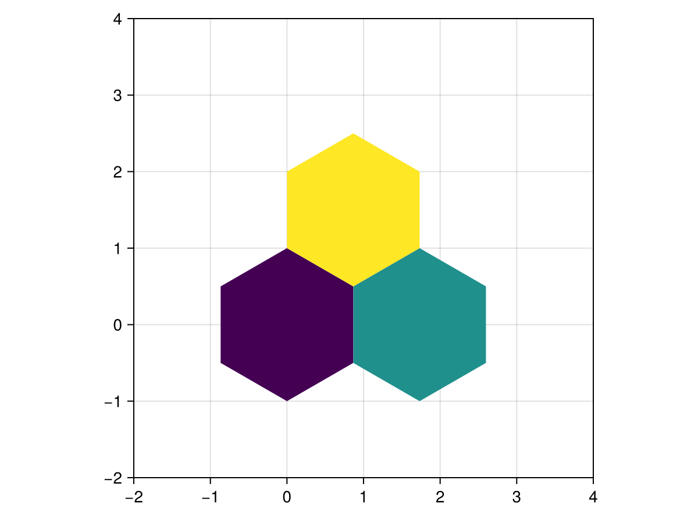


### Bezier path markers {#Bezier-path-markers}

Bezier paths are the basis for vector graphic formats such as svg and pdf and consist of a couple different operations that can define complex shapes.

A [`BezierPath`](/api#Makie.BezierPath) contains a vector of path commands, these are [`MoveTo`](/api#Makie.MoveTo), [`LineTo`](/api#Makie.LineTo), [`CurveTo`](/api#Makie.CurveTo), [`EllipticalArc`](/api#Makie.EllipticalArc) and [`ClosePath`](/api#Makie.ClosePath). A filled shape should start with [`MoveTo`](/api#Makie.MoveTo) and end with [`ClosePath`](/api#Makie.ClosePath).

::: tip Note

Unfilled markers (like a single line or curve) are possible in CairoMakie but not in GLMakie and WGLMakie, because these backends have to render the marker as a filled shape to a texture first. If no filling can be rendered, the marker will be invisible. CairoMakie, on the other hand can stroke such markers without problem.

:::

Here is an example with a simple arrow that is centered on its tip, built from path elements.
<a id="example-dd457b3" />


```julia
using CairoMakie
arrow_path = BezierPath([
    MoveTo(Point(0, 0)),
    LineTo(Point(0.3, -0.3)),
    LineTo(Point(0.15, -0.3)),
    LineTo(Point(0.3, -1)),
    LineTo(Point(0, -0.9)),
    LineTo(Point(-0.3, -1)),
    LineTo(Point(-0.15, -0.3)),
    LineTo(Point(-0.3, -0.3)),
    ClosePath()
])

scatter(1:5,
    marker = arrow_path,
    markersize = range(20, 50, length = 5),
    rotation = range(0, 2pi, length = 6)[1:end-1],
)
```

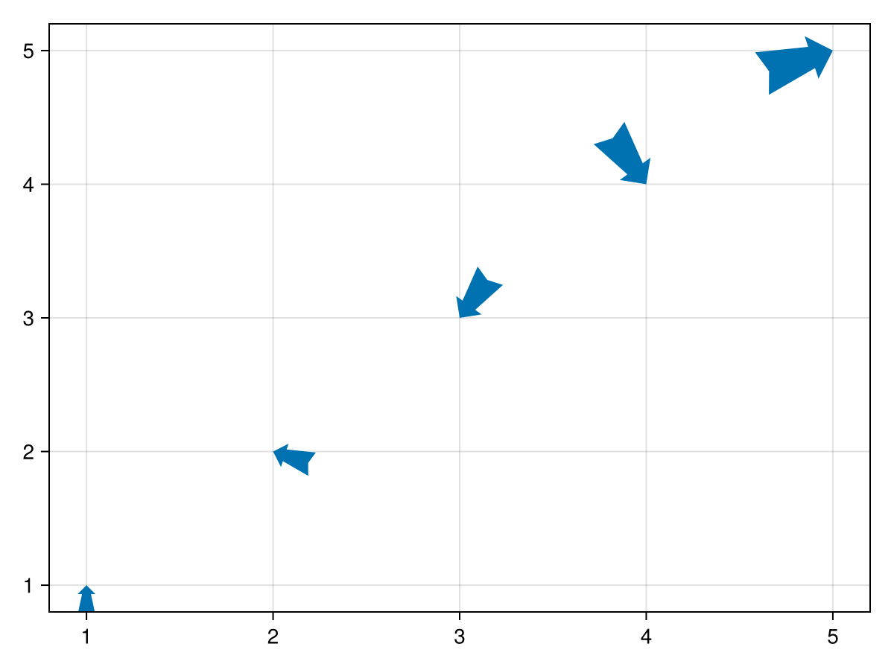


#### Holes {#Holes}

Paths can have holes, just start a new subpath with `MoveTo` that is inside the main path. The holes have to be in clockwise direction if the outside is in anti-clockwise direction, or vice versa. For example, a circle with a square cut out can be made by one `EllipticalArc` that goes anticlockwise, and a square inside which goes clockwise:
<a id="example-18220e3" />


```julia
using CairoMakie
circle_with_hole = BezierPath([
    MoveTo(Point(1, 0)),
    EllipticalArc(Point(0, 0), 1, 1, 0, 0, 2pi),
    MoveTo(Point(0.5, 0.5)),
    LineTo(Point(0.5, -0.5)),
    LineTo(Point(-0.5, -0.5)),
    LineTo(Point(-0.5, 0.5)),
    ClosePath(),
])

scatter(1:5,
    marker = circle_with_hole,
    markersize = 30,
)
```

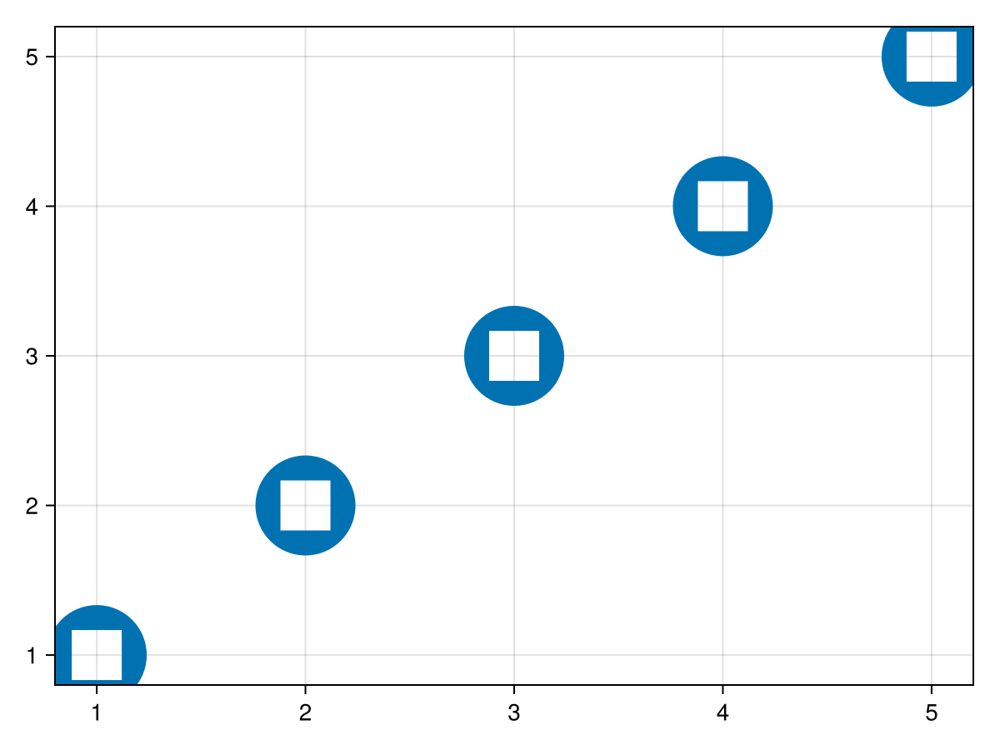


#### Construction from svg path strings {#Construction-from-svg-path-strings}

You can also create a bezier path from an [svg path specification string](https://developer.mozilla.org/en-US/docs/Web/SVG/Attribute/d#path_commands). You can automatically resize the path and flip the y- and x-axes (svgs usually have a coordinate system where y increases downwards) with the keywords `fit`, `flipy`, and `flipx`. By default, the bounding box for the fitted path is a square of width 1 centered on zero. You can pass a different bounding `Rect` with the `bbox` keyword argument. By default, the aspect of the path is left intact, and if it&#39;s not matching the new bounding box, the path is centered so it fits inside. Set `keep_aspect = false` to squeeze the path into the bounding box, disregarding its original aspect ratio.

Here&#39;s an example with an svg string that contains the bat symbol:
<a id="example-8b60892" />


```julia
using CairoMakie
batsymbol_string = "M96.84 141.998c-4.947-23.457-20.359-32.211-25.862-13.887-11.822-22.963-37.961-16.135-22.041 6.289-3.005-1.295-5.872-2.682-8.538-4.191-8.646-5.318-15.259-11.314-19.774-17.586-3.237-5.07-4.994-10.541-4.994-16.229 0-19.774 21.115-36.758 50.861-43.694.446-.078.909-.154 1.372-.231-22.657 30.039 9.386 50.985 15.258 24.645l2.528-24.367 5.086 6.52H103.205l5.07-6.52 2.543 24.367c5.842 26.278 37.746 5.502 15.414-24.429 29.777 6.951 50.891 23.936 50.891 43.709 0 15.136-12.406 28.651-31.609 37.267 14.842-21.822-10.867-28.266-22.549-5.549-5.502-18.325-21.147-9.341-26.125 13.886z"

batsymbol = BezierPath(batsymbol_string, fit = true, flipy = true)

scatter(1:10, marker = batsymbol, markersize = 50, color = :black)
```

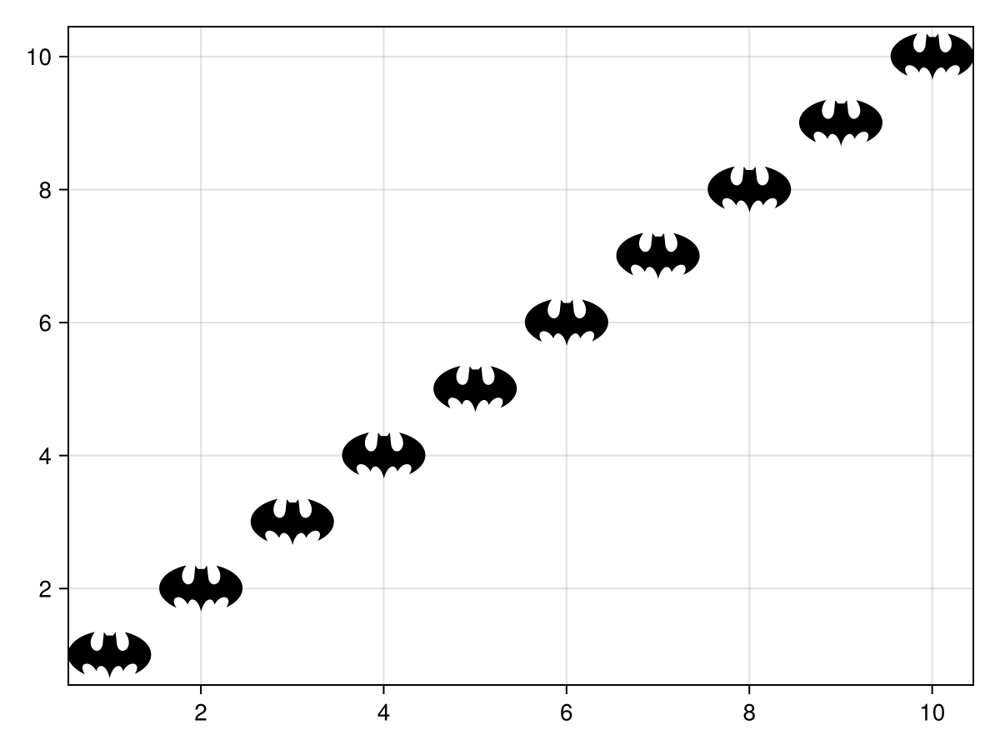


### Polygon markers {#Polygon-markers}

One can also use `GeometryBasics.Polgyon` as a marker. A polygon always needs one vector of points which forms the outline. It can also take an optional vector of vectors of points, each of which forms a hole in the outlined shape.

In this example, a small circle is cut out of a larger circle:
<a id="example-d993cdd" />


```julia
using CairoMakie
using GeometryBasics
p_big = decompose(Point2f, Circle(Point2f(0), 1))
p_small = decompose(Point2f, Circle(Point2f(0), 0.5))
scatter(1:4, fill(0, 4), marker=Polygon(p_big, [p_small]), markersize=100, color=1:4, axis=(limits=(0, 5, -1, 1),))
```

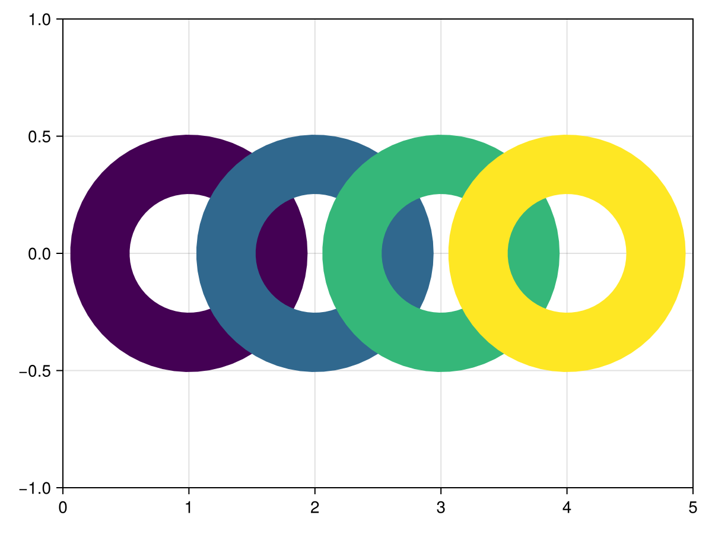


### Vec markersize {#Vec-markersize}

You can scale x and y dimension of markers separately by passing a `Vec`.
<a id="example-fc3271c" />


```julia
using CairoMakie
f = Figure()
ax = Axis(f[1, 1])

scales = range(0.5, 1.5, length = 10)

for (i, sx) in enumerate(scales)
    for (j, sy) in enumerate(scales)
        scatter!(ax, Point2f(i, j),
            marker = '✈',
            markersize = 30 .* Vec2f(sx, sy),
            color = :black)
    end
end

f
```

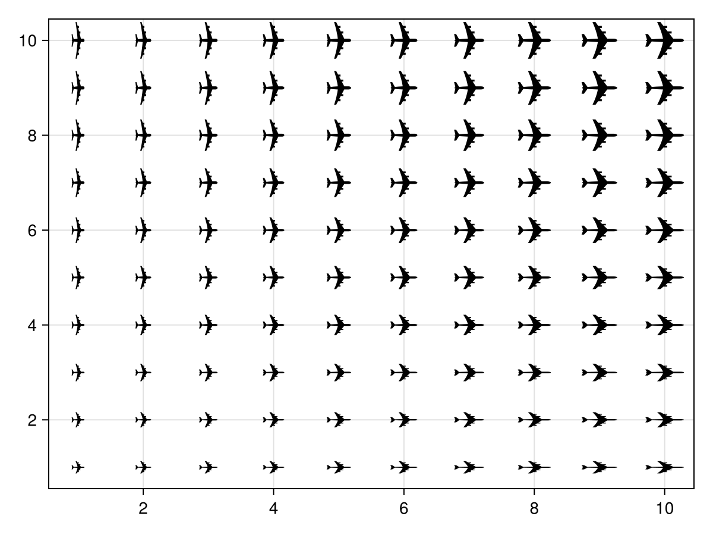


### Marker space {#Marker-space}

By default marker sizes are given in pixel units. You can change this by adjusting `markerspace`. For example, you can have a marker scaled in data units by setting `markerspace = :data`.
<a id="example-91f36d5" />


```julia
using CairoMakie
f = Figure()
ax = Axis(f[1, 1])
limits!(ax, -10, 10, -10, 10)

scatter!(ax, Point2f(0, 0), markersize = 20, markerspace = :data,
    marker = '✈', label = "markerspace = :data")
scatter!(ax, Point2f(0, 0), markersize = 20, markerspace = :pixel,
    marker = '✈', label = "markerspace = :pixel")

axislegend(ax)

f
```

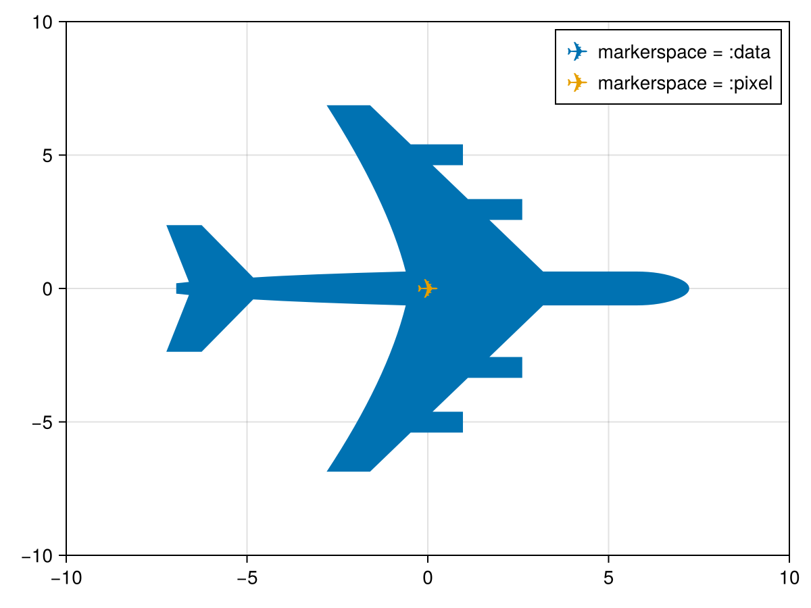


### Airport locations example {#Airport-locations-example}
<a id="example-575a121" />


```julia
using CairoMakie
using DelimitedFiles


a = readdlm(assetpath("airportlocations.csv"))

scatter(a[1:50:end, :], marker = '✈',
    markersize = 20, color = :black)
```

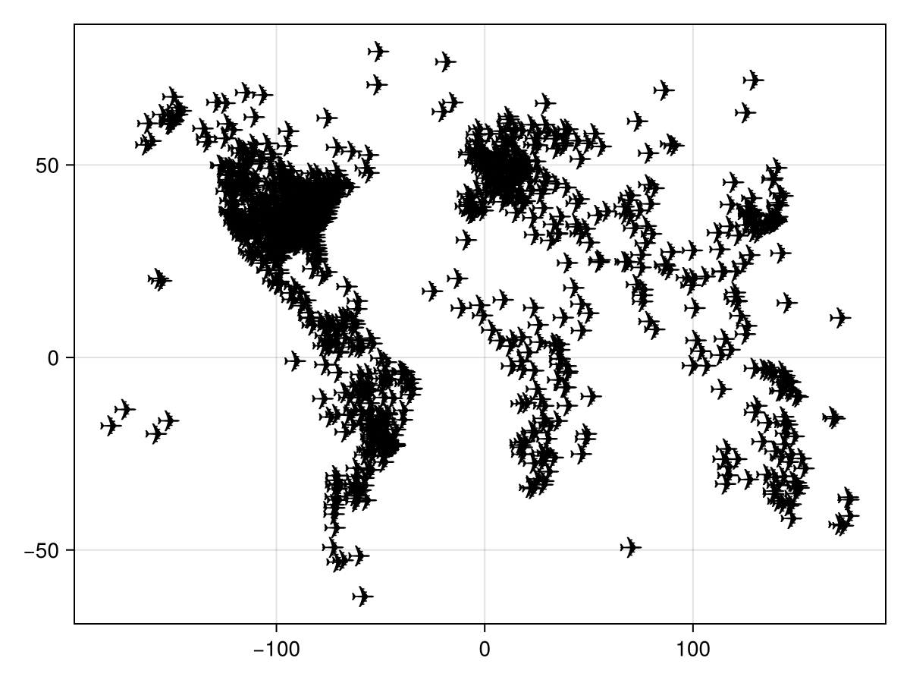


### Dealing with outline artifacts in GLMakie {#Dealing-with-outline-artifacts-in-GLMakie}

In GLMakie 3D scatter plots can generate outline artifacts depending on the order markers are rendered in. Currently there are a few ways to mitigate this problem, but they all come at a cost:
- `fxaa = true` will disable the native anti-aliasing of scatter markers and use fxaa instead. This results in less detailed markers, especially for thin markers like characters.
  
- `transparency = true` will disable depth testing to a degree, resulting in all markers being rendered without artifacts. However with this markers always have some level of transparency
  
- `overdraw = true` will disable depth testing entirely (read and write) for the plot, removing artifacts. This will however change the z-order of markers and allow plots rendered later to show up on top of the scatter plot
  
- `depthsorting = true` will sort markers by depth before rendering to fix the issue. This only works within a plot call, so when other plots are involved the issue may reappear.
  
<a id="example-9c72838" />


```julia
using GLMakie
ps = rand(Point3f, 500)
cs = rand(500)
f = Figure(size = (900, 650))
Label(f[1, 1], "base", tellwidth = false)
scatter(f[2, 1], ps, color = cs, markersize = 20, fxaa = false)
Label(f[1, 2], "fxaa = true", tellwidth = false)
scatter(f[2, 2], ps, color = cs, markersize = 20, fxaa = true)

Label(f[3, 1], "transparency = true", tellwidth = false)
scatter(f[4, 1], ps, color = cs, markersize = 20, transparency = true)
Label(f[3, 2], "overdraw = true", tellwidth = false)
scatter(f[4, 2], ps, color = cs, markersize = 20, overdraw = true)

Label(f[1, 3], "depthsorting = true", tellwidth = false)
scatter(f[2, 3], ps, color = cs, markersize = 20, depthsorting = true)
Label(f[3, 3], "depthsorting = true", tellwidth = false)
scatter(f[4, 3], ps, color = cs, markersize = 20, depthsorting = true)
mesh!(Rect3f(Point3f(0), Vec3f(0.9, 0.9, 0.9)), color = :orange)
f
```

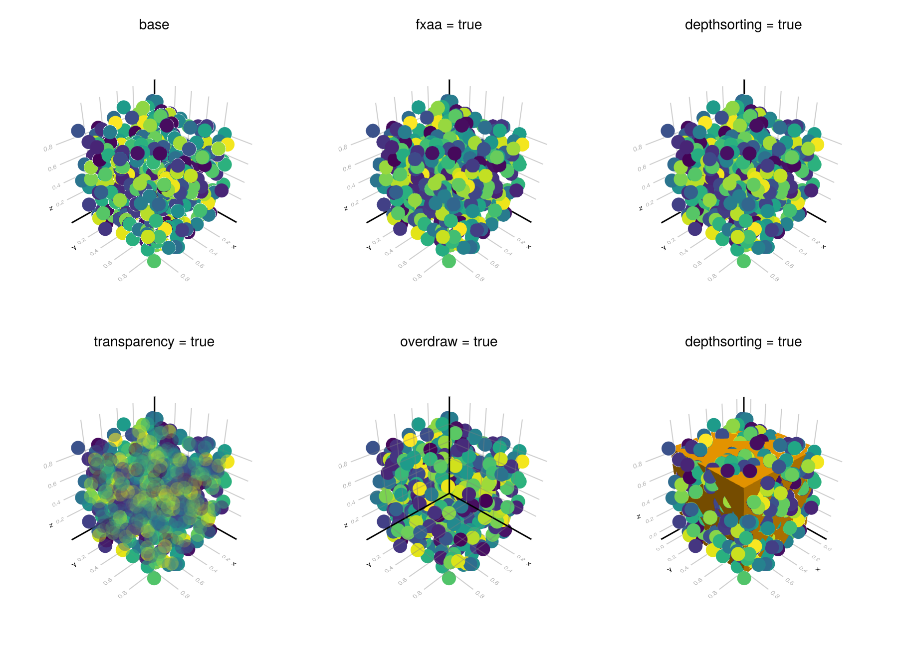


## Attributes {#Attributes}

### alpha {#alpha}

Defaults to `1.0`

The alpha value of the colormap or color attribute. Multiple alphas like in `plot(alpha=0.2, color=(:red, 0.5)`, will get multiplied.

### clip_planes {#clip_planes}

Defaults to `automatic`

Clip planes offer a way to do clipping in 3D space. You can set a Vector of up to 8 `Plane3f` planes here, behind which plots will be clipped (i.e. become invisible). By default clip planes are inherited from the parent plot or scene. You can remove parent `clip_planes` by passing `Plane3f[]`.

### color {#color}

Defaults to `@inherit markercolor`

Sets the color of the marker. If no color is set, multiple calls to `scatter!` will cycle through the axis color palette.
<a id="example-c16a9de" />


```julia
using CairoMakie
fig = Figure()
kwargs = (; markersize = 30, axis = (; limits = (0, 4, 0, 4)))
scatter(fig[1, 1], 1:3; kwargs..., color = :tomato)
scatter(fig[1, 2], 1:3; kwargs..., color = [RGBf(1, 0, 0), RGBf(0, 1, 0), RGBf(0, 0, 1)])
scatter(fig[2, 1], 1:3; kwargs..., color = [10, 20, 30])
scatter(fig[2, 2], 1:3; kwargs..., color = [10, 20, 30], colormap = :plasma)
fig
```

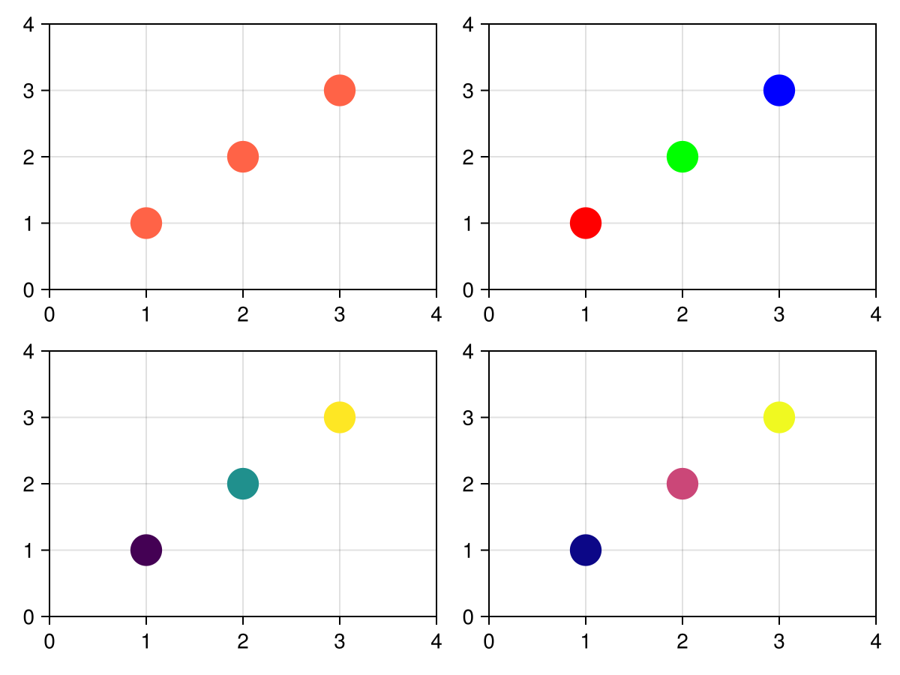


### colormap {#colormap}

Defaults to `@inherit colormap :viridis`

Sets the colormap that is sampled for numeric `color`s. `PlotUtils.cgrad(...)`, `Makie.Reverse(any_colormap)` can be used as well, or any symbol from ColorBrewer or PlotUtils. To see all available color gradients, you can call `Makie.available_gradients()`.
<a id="example-c011b8c" />


```julia
using CairoMakie
fig = Figure()
kwargs = (; markersize = 30, axis = (; limits = (0, 6, 0, 6)))
scatter(fig[1, 1], 1:5; kwargs..., color = 1:5, colormap = :viridis)
scatter(fig[1, 2], 1:5; kwargs..., color = 1:5, colormap = :plasma)
scatter(fig[2, 1], 1:5; kwargs..., color = 1:5, colormap = Reverse(:viridis))
scatter(fig[2, 2], 1:5; kwargs..., color = 1:5, colormap = [:tomato, :slategray2])
fig
```

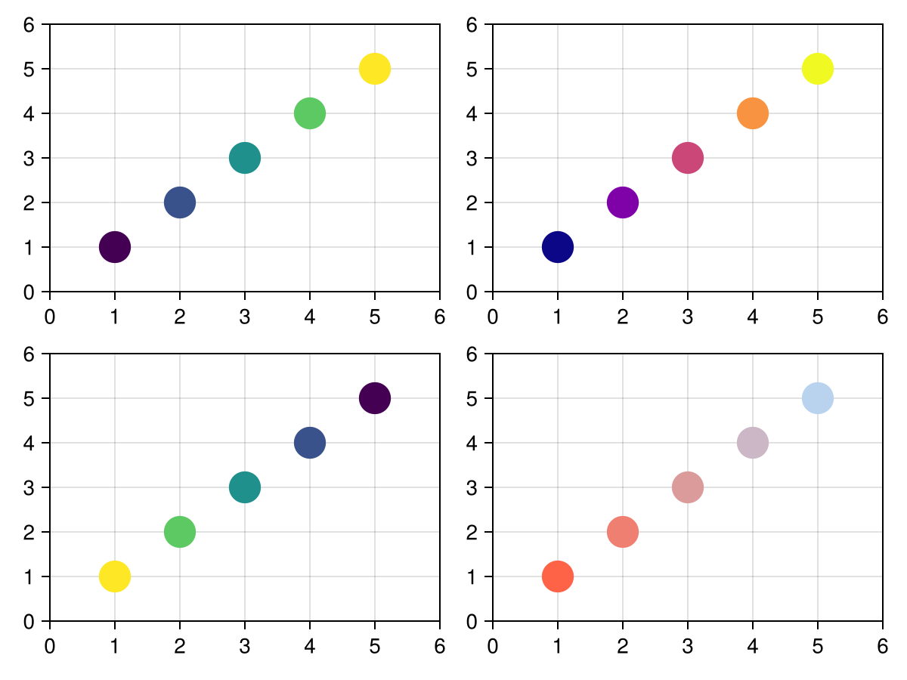


### colorrange {#colorrange}

Defaults to `automatic`

The values representing the start and end points of `colormap`.

### colorscale {#colorscale}

Defaults to `identity`

The color transform function. Can be any function, but only works well together with `Colorbar` for `identity`, `log`, `log2`, `log10`, `sqrt`, `logit`, `Makie.pseudolog10` and `Makie.Symlog10`.

### cycle {#cycle}

Defaults to `[:color]`

Sets which attributes to cycle when creating multiple plots

### depth_shift {#depth_shift}

Defaults to `0.0`

Adjusts the depth value of a plot after all other transformations, i.e. in clip space, where `-1 <= depth <= 1`. This only applies to GLMakie and WGLMakie and can be used to adjust render order (like a tunable overdraw).

### depthsorting {#depthsorting}

Defaults to `false`

Enables depth-sorting of markers which can improve border artifacts. Currently supported in GLMakie only.

### distancefield {#distancefield}

Defaults to `nothing`

Optional distancefield used for e.g. font and bezier path rendering. Will get set automatically.

### font {#font}

Defaults to `@inherit markerfont`

Sets the font used for character markers. Can be a `String` specifying the (partial) name of a font or the file path of a font file

### fxaa {#fxaa}

Defaults to `false`

Adjusts whether the plot is rendered with fxaa (anti-aliasing, GLMakie only).

### glowcolor {#glowcolor}

Defaults to `(:black, 0.0)`

Sets the color of the glow effect around the marker.

### glowwidth {#glowwidth}

Defaults to `0.0`

Sets the size of a glow effect around the marker.

### highclip {#highclip}

Defaults to `automatic`

The color for any value above the colorrange.

### inspectable {#inspectable}

Defaults to `@inherit inspectable`

Sets whether this plot should be seen by `DataInspector`. The default depends on the theme of the parent scene.

### inspector_clear {#inspector_clear}

Defaults to `automatic`

Sets a callback function `(inspector, plot) -> ...` for cleaning up custom indicators in DataInspector.

### inspector_hover {#inspector_hover}

Defaults to `automatic`

Sets a callback function `(inspector, plot, index) -> ...` which replaces the default `show_data` methods.

### inspector_label {#inspector_label}

Defaults to `automatic`

Sets a callback function `(plot, index, position) -> string` which replaces the default label generated by DataInspector.

### lowclip {#lowclip}

Defaults to `automatic`

The color for any value below the colorrange.

### marker {#marker}

Defaults to `@inherit marker`

Sets the scatter marker.

### marker_offset {#marker_offset}

Defaults to `Vec3f(0)`

The offset of the marker from the given position in `markerspace` units. An offset of 0 corresponds to a centered marker.
<a id="example-d2e183d" />


```julia
using CairoMakie
fig = Figure()
scatter(fig[1, 1], [Point2f(0) for _ in 1:5]; marker = Circle, markersize = 30,
    marker_offset = [(0, 0), (-50, 0), (0, -50), (50, 0), (0, 50)],
    color = [:black, :blue, :green, :red, :orange])
scatter(fig[1, 2], [Point3f(0) for _ in 1:7]; marker = :ltriangle, markersize = 0.2, markerspace = :data,
    marker_offset = Vec3f[(0, 0, 0), (-1, 0, 0), (0, -1, 0), (1, 0, 0), (0, 1, 0), (0, 0, -1), (0, 0, 1)],
    color = [:black, :blue, :green, :red, :orange, :cyan, :purple])
fig
```

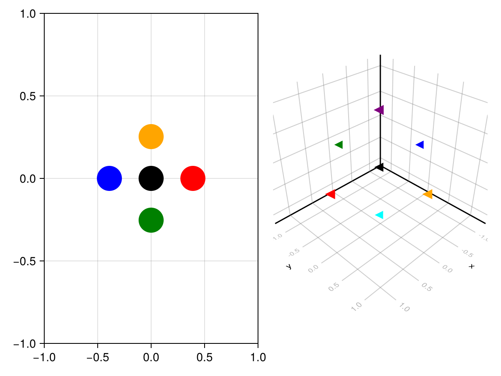


### markersize {#markersize}

Defaults to `@inherit markersize`

Sets the size of the marker by scaling it relative to its base size which can differ for each marker. A `Real` scales x and y dimensions by the same amount. A `Vec` or `Tuple` with two elements scales x and y separately. An array of either scales each marker separately. Humans perceive the area of a marker as its size which grows quadratically with `markersize`, so multiplying `markersize` by 2 results in a marker that is 4 times as large, visually.
<a id="example-9fd3201" />


```julia
using CairoMakie
fig = Figure()
kwargs = (; marker = Rect, axis = (; limits = (0, 4, 0, 4)))
scatter(fig[1, 1], 1:3; kwargs..., markersize = 30)
scatter(fig[1, 2], 1:3; kwargs..., markersize = (30, 20))
scatter(fig[2, 1], 1:3; kwargs..., markersize = [10, 20, 30])
scatter(fig[2, 2], 1:3; kwargs..., markersize = [(10, 20), (20, 30), (40, 30)])
fig
```

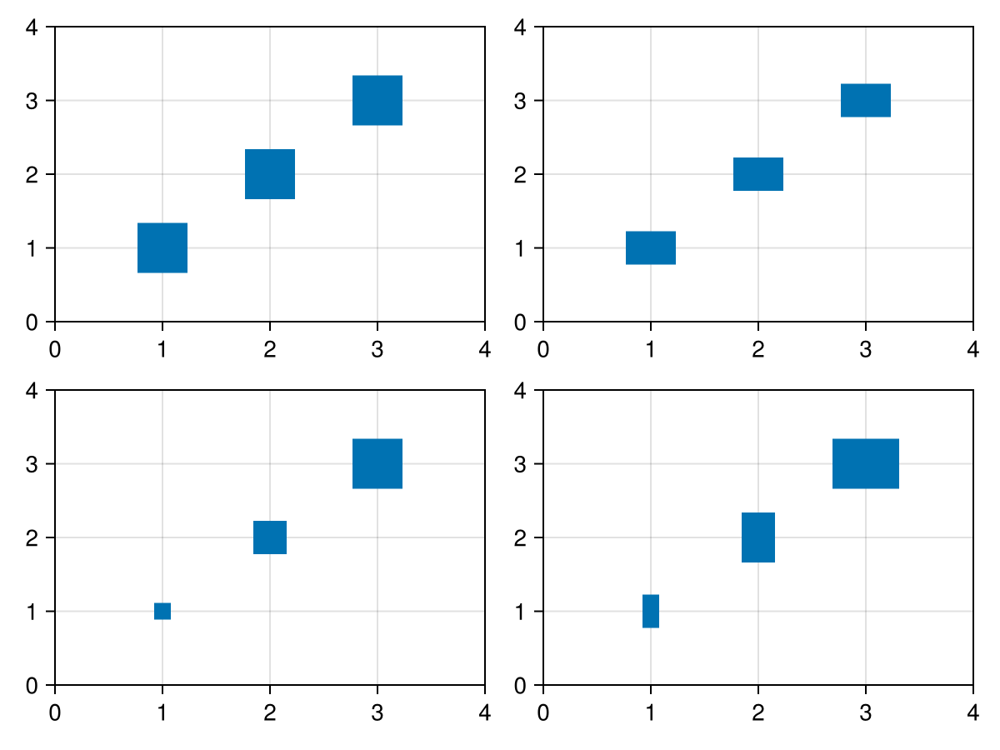


### markerspace {#markerspace}

Defaults to `:pixel`

Sets the space in which `markersize` is given. See `Makie.spaces()` for possible inputs

### model {#model}

Defaults to `automatic`

Sets a model matrix for the plot. This overrides adjustments made with `translate!`, `rotate!` and `scale!`.

### nan_color {#nan_color}

Defaults to `:transparent`

The color for NaN values.

### overdraw {#overdraw}

Defaults to `false`

Controls if the plot will draw over other plots. This specifically means ignoring depth checks in GL backends

### rotation {#rotation}

Defaults to `Billboard()`

Sets the rotation of the marker. A `Billboard` rotation is always around the depth axis.
<a id="example-713bd68" />


```julia
using CairoMakie
fig = Figure()
kwargs = (; marker = :utriangle, markersize = 30, axis = (; limits = (0, 4, 0, 4)))
scatter(fig[1, 1], 1:3; kwargs...)
scatter(fig[1, 2], 1:3; kwargs..., rotation = deg2rad(45))
scatter(fig[1, 3], 1:3; kwargs..., rotation = deg2rad.([0, 45, 90]))
fig
```

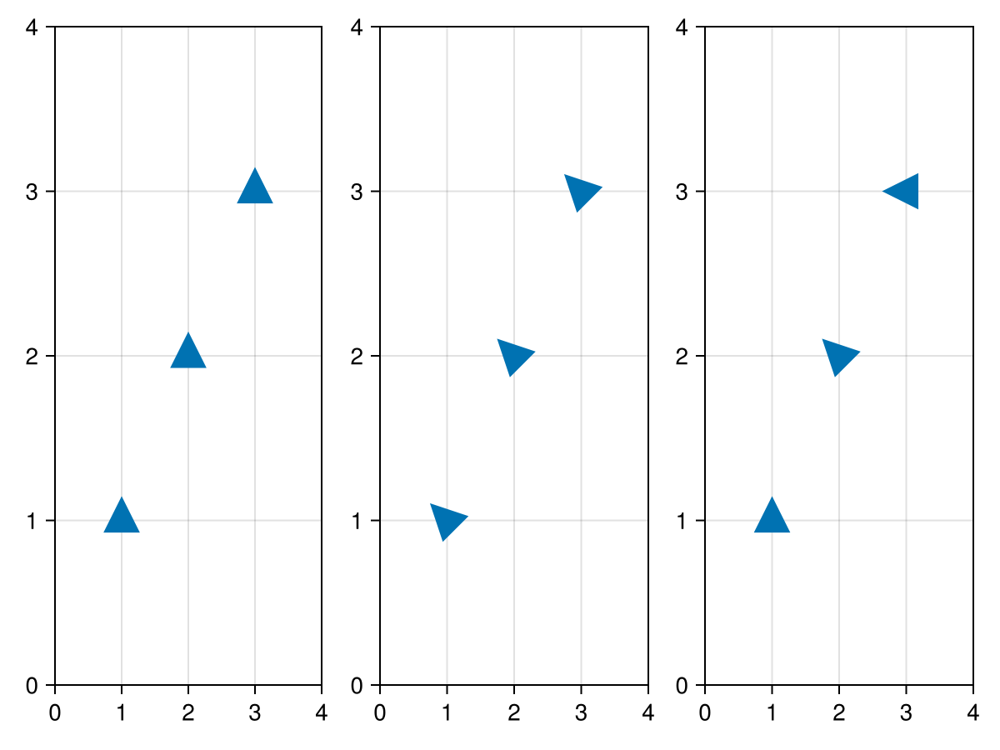


### space {#space}

Defaults to `:data`

Sets the transformation space for box encompassing the plot. See `Makie.spaces()` for possible inputs.

### ssao {#ssao}

Defaults to `false`

Adjusts whether the plot is rendered with ssao (screen space ambient occlusion). Note that this only makes sense in 3D plots and is only applicable with `fxaa = true`.

### strokecolor {#strokecolor}

Defaults to `@inherit markerstrokecolor`

Sets the color of the outline around a marker.
<a id="example-228c037" />


```julia
using CairoMakie
fig = Figure()
kwargs = (; markersize = 30, strokewidth = 3)
scatter(fig[1, 1], 1:3; kwargs..., strokecolor = :tomato)
scatter(fig[1, 2], 1:3; kwargs..., strokecolor = [RGBf(1, 0, 0), RGBf(0, 1, 0), RGBf(0, 0, 1)])
fig
```

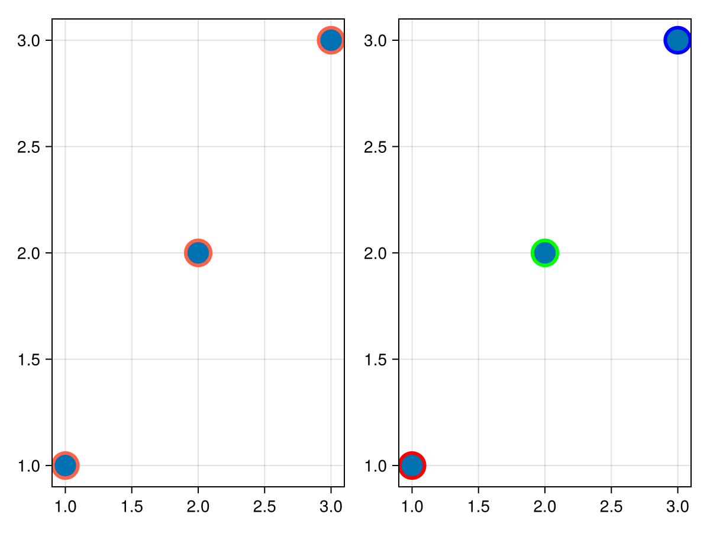


### strokewidth {#strokewidth}

Defaults to `@inherit markerstrokewidth`

Sets the width of the outline around a marker.
<a id="example-d3f6726" />


```julia
using CairoMakie
fig = Figure()
kwargs = (; markersize = 30, strokecolor = :tomato)
scatter(fig[1, 1], 1:3; kwargs..., strokewidth = 3)
scatter(fig[1, 2], 1:3; kwargs..., strokewidth = [0, 3, 6])
fig
```

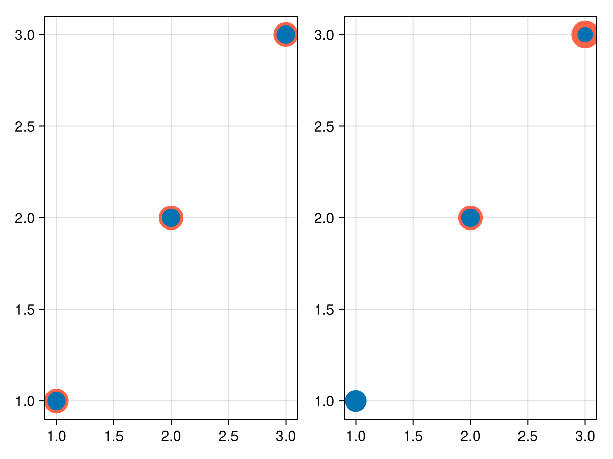


### transform_marker {#transform_marker}

Defaults to `false`

Controls whether the model matrix (without translation) applies to the marker itself, rather than just the positions. (If this is true, `scale!` and `rotate!` will affect the marker.

### transformation {#transformation}

Defaults to `:automatic`

No docs available.

### transparency {#transparency}

Defaults to `false`

Adjusts how the plot deals with transparency. In GLMakie `transparency = true` results in using Order Independent Transparency.

### uv_offset_width {#uv_offset_width}

Defaults to `(0.0, 0.0, 0.0, 0.0)`

No docs available.

### visible {#visible}

Defaults to `true`

Controls whether the plot will be rendered or not.
