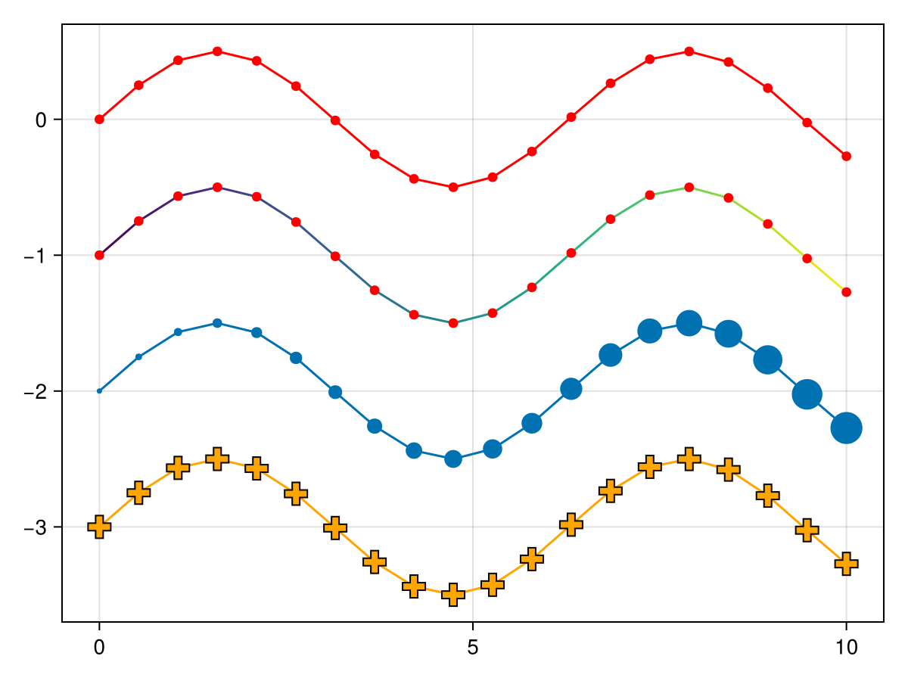

# scatterlines {#scatterlines}
<details class='jldocstring custom-block' open>
<summary><a id='Makie.scatterlines-reference-plots-scatterlines' href='#Makie.scatterlines-reference-plots-scatterlines'><span class="jlbinding">Makie.scatterlines</span></a> <Badge type="info" class="jlObjectType jlFunction" text="Function" /></summary>


```julia
scatterlines(xs, ys, [zs]; kwargs...)
```


Plots `scatter` markers and `lines` between them.

**Plot type**

The plot type alias for the `scatterlines` function is `ScatterLines`.


<Badge type="info" class="source-link" text="source"><a href="https://github.com/MakieOrg/Makie.jl/blob/cefec3bc07a829ab04fb7edfbd5ae240496109fa/MakieCore/src/recipes.jl#L520-L607" target="_blank" rel="noreferrer">source</a></Badge>

</details>


## Examples {#Examples}
<a id="example-1fef9dd" />


```julia
using CairoMakie
f = Figure()
Axis(f[1, 1])

xs = LinRange(0, 10, 20)
ys = 0.5 .* sin.(xs)

scatterlines!(xs, ys, color = :red)
scatterlines!(xs, ys .- 1, color = xs, markercolor = :red)
scatterlines!(xs, ys .- 2, markersize = LinRange(5, 30, 20))
scatterlines!(xs, ys .- 3, marker = :cross, strokewidth = 1,
    markersize = 20, color = :orange, strokecolor = :black)

f
```




## Attributes {#Attributes}

### alpha {#alpha}

Defaults to `1.0`

The alpha value of the colormap or color attribute. Multiple alphas like in `plot(alpha=0.2, color=(:red, 0.5)`, will get multiplied.

### clip_planes {#clip_planes}

Defaults to `automatic`

Clip planes offer a way to do clipping in 3D space. You can set a Vector of up to 8 `Plane3f` planes here, behind which plots will be clipped (i.e. become invisible). By default clip planes are inherited from the parent plot or scene. You can remove parent `clip_planes` by passing `Plane3f[]`.

### color {#color}

Defaults to `@inherit linecolor`

The color of the line, and by default also of the scatter markers.

### colormap {#colormap}

Defaults to `@inherit colormap :viridis`

Sets the colormap that is sampled for numeric `color`s. `PlotUtils.cgrad(...)`, `Makie.Reverse(any_colormap)` can be used as well, or any symbol from ColorBrewer or PlotUtils. To see all available color gradients, you can call `Makie.available_gradients()`.

### colorrange {#colorrange}

Defaults to `automatic`

The values representing the start and end points of `colormap`.

### colorscale {#colorscale}

Defaults to `identity`

The color transform function. Can be any function, but only works well together with `Colorbar` for `identity`, `log`, `log2`, `log10`, `sqrt`, `logit`, `Makie.pseudolog10` and `Makie.Symlog10`.

### cycle {#cycle}

Defaults to `[:color]`

No docs available.

### depth_shift {#depth_shift}

Defaults to `0.0`

Adjusts the depth value of a plot after all other transformations, i.e. in clip space, where `-1 <= depth <= 1`. This only applies to GLMakie and WGLMakie and can be used to adjust render order (like a tunable overdraw).

### fxaa {#fxaa}

Defaults to `true`

Adjusts whether the plot is rendered with fxaa (anti-aliasing, GLMakie only).

### highclip {#highclip}

Defaults to `automatic`

The color for any value above the colorrange.

### inspectable {#inspectable}

Defaults to `@inherit inspectable`

Sets whether this plot should be seen by `DataInspector`. The default depends on the theme of the parent scene.

### inspector_clear {#inspector_clear}

Defaults to `automatic`

Sets a callback function `(inspector, plot) -> ...` for cleaning up custom indicators in DataInspector.

### inspector_hover {#inspector_hover}

Defaults to `automatic`

Sets a callback function `(inspector, plot, index) -> ...` which replaces the default `show_data` methods.

### inspector_label {#inspector_label}

Defaults to `automatic`

Sets a callback function `(plot, index, position) -> string` which replaces the default label generated by DataInspector.

### joinstyle {#joinstyle}

Defaults to `@inherit joinstyle`

No docs available.

### linecap {#linecap}

Defaults to `@inherit linecap`

No docs available.

### linestyle {#linestyle}

Defaults to `nothing`

Sets the pattern of the line e.g. `:solid`, `:dot`, `:dashdot`. For custom patterns look at `Linestyle(Number[...])`

### linewidth {#linewidth}

Defaults to `@inherit linewidth`

Sets the width of the line in screen units

### lowclip {#lowclip}

Defaults to `automatic`

The color for any value below the colorrange.

### marker {#marker}

Defaults to `@inherit marker`

Sets the scatter marker.

### markercolor {#markercolor}

Defaults to `automatic`

No docs available.

### markercolormap {#markercolormap}

Defaults to `automatic`

No docs available.

### markercolorrange {#markercolorrange}

Defaults to `automatic`

No docs available.

### markersize {#markersize}

Defaults to `@inherit markersize`

Sets the size of the marker.

### miter_limit {#miter_limit}

Defaults to `@inherit miter_limit`

No docs available.

### model {#model}

Defaults to `automatic`

Sets a model matrix for the plot. This overrides adjustments made with `translate!`, `rotate!` and `scale!`.

### nan_color {#nan_color}

Defaults to `:transparent`

The color for NaN values.

### overdraw {#overdraw}

Defaults to `false`

Controls if the plot will draw over other plots. This specifically means ignoring depth checks in GL backends

### space {#space}

Defaults to `:data`

Sets the transformation space for box encompassing the plot. See `Makie.spaces()` for possible inputs.

### ssao {#ssao}

Defaults to `false`

Adjusts whether the plot is rendered with ssao (screen space ambient occlusion). Note that this only makes sense in 3D plots and is only applicable with `fxaa = true`.

### strokecolor {#strokecolor}

Defaults to `@inherit markerstrokecolor`

Sets the color of the outline around a marker.

### strokewidth {#strokewidth}

Defaults to `@inherit markerstrokewidth`

Sets the width of the outline around a marker.

### transformation {#transformation}

Defaults to `:automatic`

No docs available.

### transparency {#transparency}

Defaults to `false`

Adjusts how the plot deals with transparency. In GLMakie `transparency = true` results in using Order Independent Transparency.

### visible {#visible}

Defaults to `true`

Controls whether the plot will be rendered or not.
