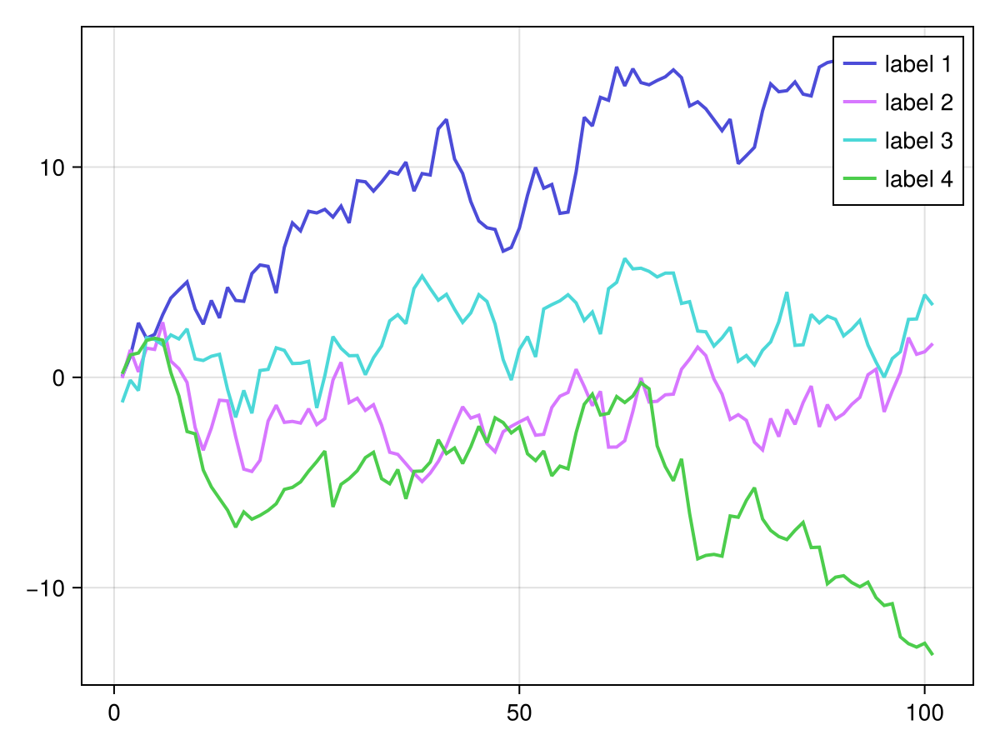
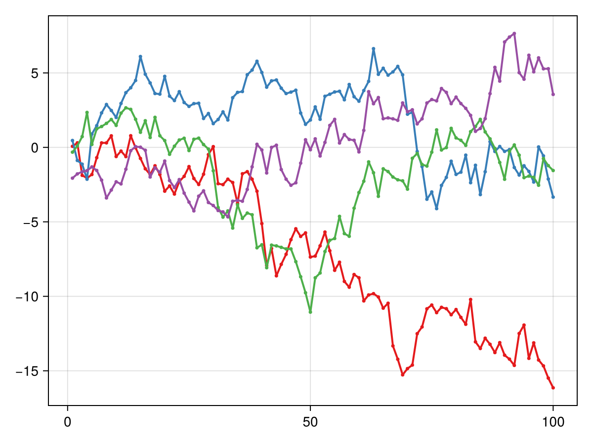
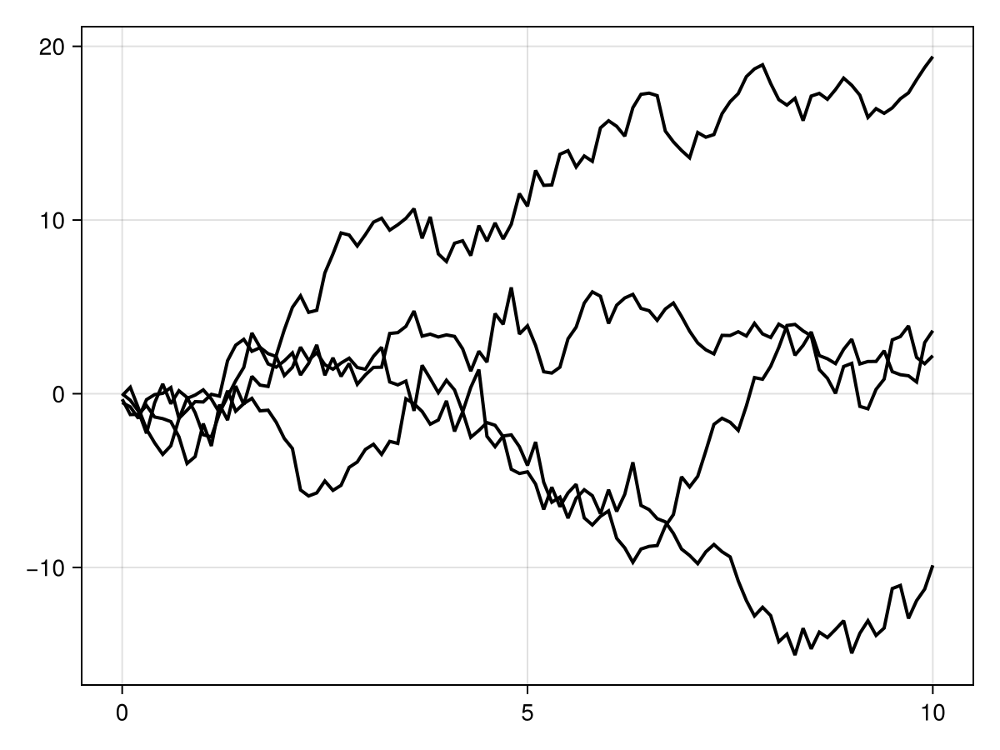

# series {#series}
<details class='jldocstring custom-block' open>
<summary><a id='Makie.series-reference-plots-series' href='#Makie.series-reference-plots-series'><span class="jlbinding">Makie.series</span></a> <Badge type="info" class="jlObjectType jlFunction" text="Function" /></summary>


```julia
series(curves)
```


Curves can be:
- `AbstractVector{<: AbstractVector{<: Point2}}`: the native representation of a series as a vector of lines
  
- `AbstractMatrix`: each row represents y coordinates of the line, while `x` goes from `1:size(curves, 1)`
  
- `AbstractVector, AbstractMatrix`: the same as the above, but the first argument sets the x values for all lines
  
- `AbstractVector{<: Tuple{X<: AbstractVector, Y<: AbstractVector}}`: A vector of tuples, where each tuple contains a vector for the x and y coordinates
  

If any of `marker`, `markersize`, `markercolor`, `strokecolor` or `strokewidth` is set != nothing, a scatterplot is added.

**Plot type**

The plot type alias for the `series` function is `Series`.


<Badge type="info" class="source-link" text="source"><a href="https://github.com/MakieOrg/Makie.jl/blob/c1ff276792827f16c26b5ad51ea371f8a3759971/MakieCore/src/recipes.jl#L520-L565" target="_blank" rel="noreferrer">source</a></Badge>

</details>


## Examples {#Examples}

### Matrix {#Matrix}
<a id="example-77b93e7" />


```julia
using CairoMakie
data = cumsum(randn(4, 101), dims = 2)

fig, ax, sp = series(data, labels=["label $i" for i in 1:4])
axislegend(ax)
fig
```




### Vector of vectors {#Vector-of-vectors}
<a id="example-6f806e5" />


```julia
using CairoMakie
pointvectors = [Point2f.(1:100, cumsum(randn(100))) for i in 1:4]

series(pointvectors, markersize=5, color=:Set1)
```




### Vector and matrix {#Vector-and-matrix}
<a id="example-b1a2250" />


```julia
using CairoMakie
data = cumsum(randn(4, 101), dims = 2)

series(0:0.1:10, data, solid_color=:black)
```




## Attributes {#Attributes}

### color {#color}

Defaults to `:lighttest`

No docs available.

### joinstyle {#joinstyle}

Defaults to `@inherit joinstyle`

No docs available.

### labels {#labels}

Defaults to `nothing`

No docs available.

### linecap {#linecap}

Defaults to `@inherit linecap`

No docs available.

### linestyle {#linestyle}

Defaults to `:solid`

No docs available.

### linewidth {#linewidth}

Defaults to `2`

No docs available.

### marker {#marker}

Defaults to `nothing`

No docs available.

### markercolor {#markercolor}

Defaults to `automatic`

No docs available.

### markersize {#markersize}

Defaults to `nothing`

No docs available.

### miter_limit {#miter_limit}

Defaults to `@inherit miter_limit`

No docs available.

### solid_color {#solid_color}

Defaults to `nothing`

No docs available.

### space {#space}

Defaults to `:data`

No docs available.

### strokecolor {#strokecolor}

Defaults to `nothing`

No docs available.

### strokewidth {#strokewidth}

Defaults to `nothing`

No docs available.
