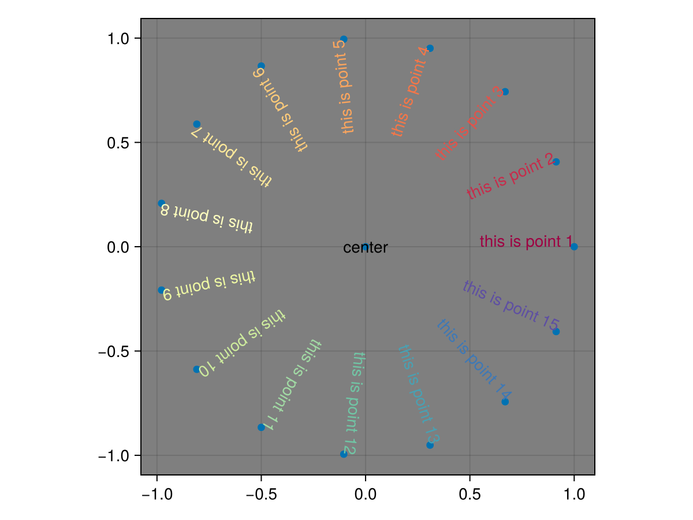
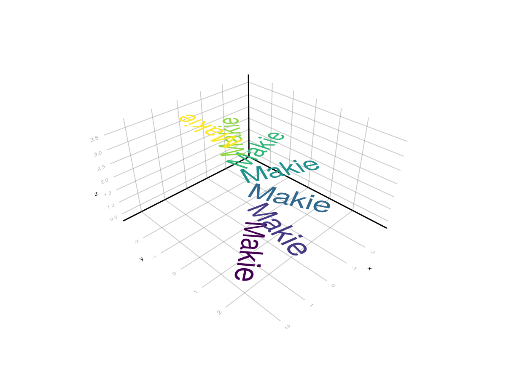
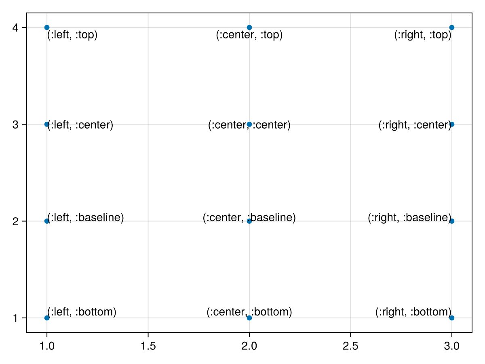
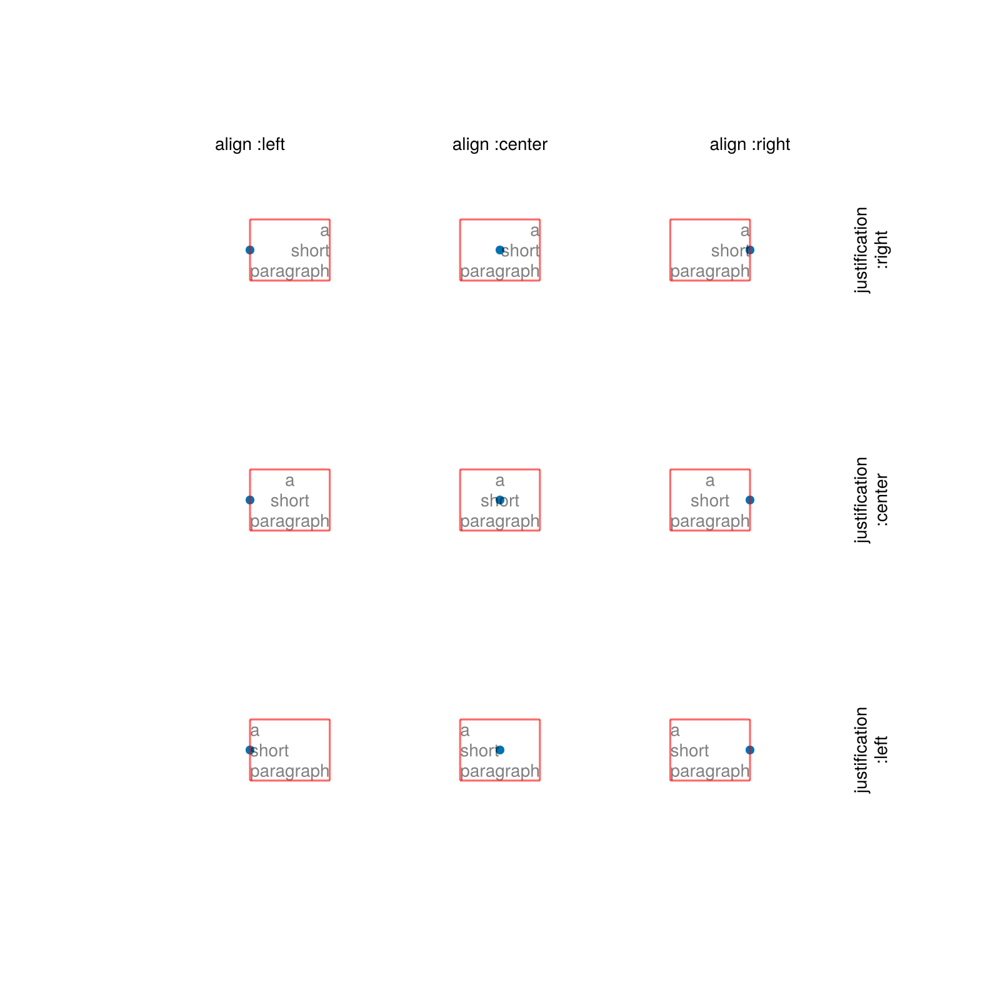
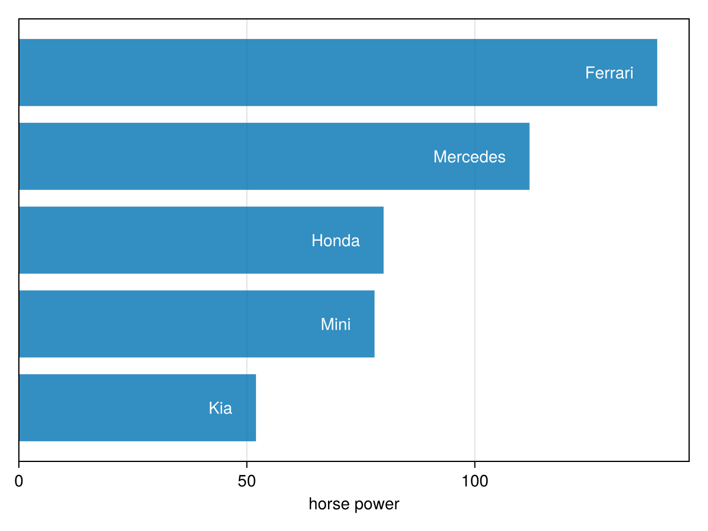
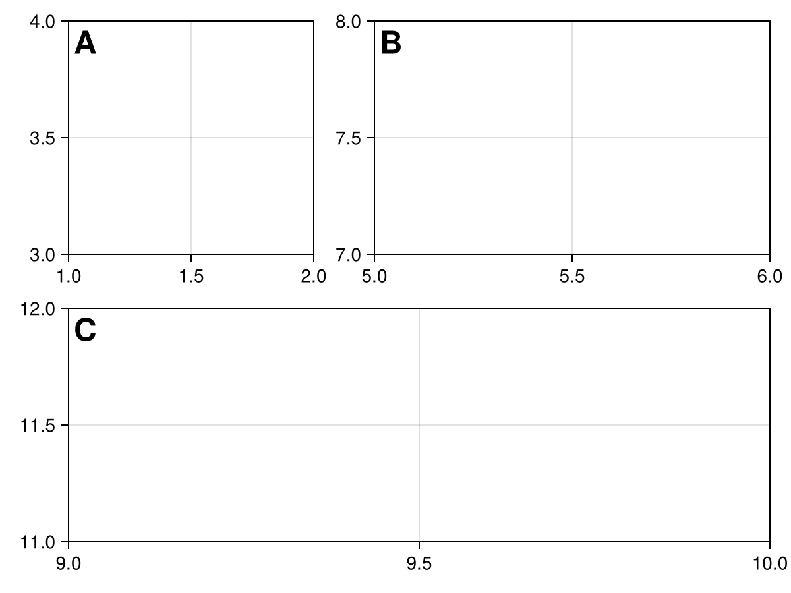
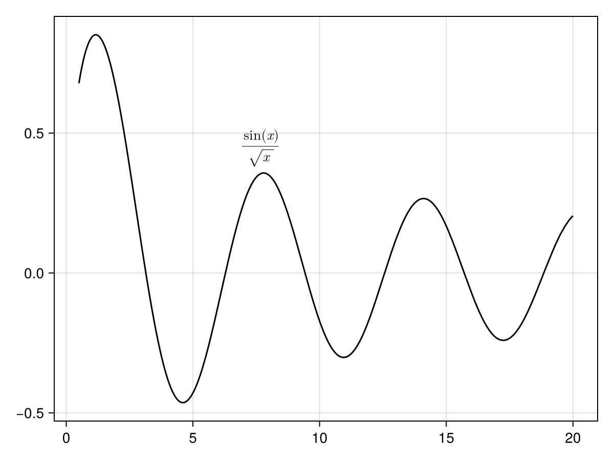
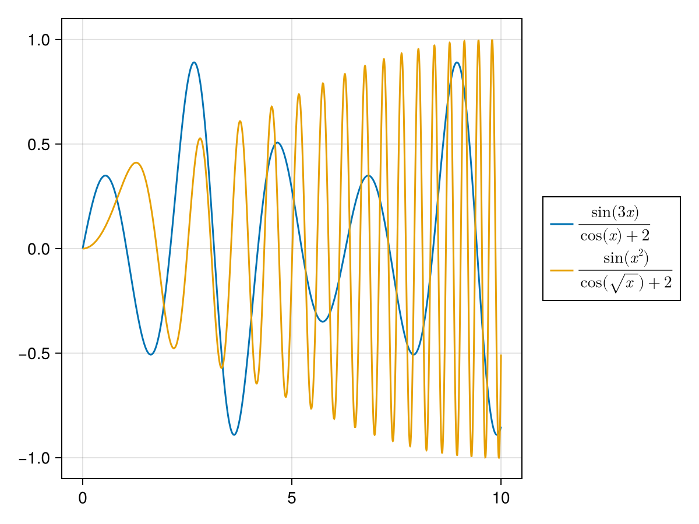
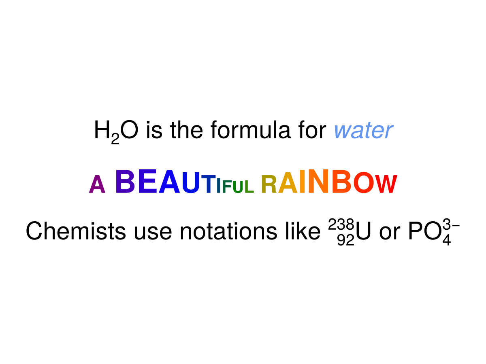
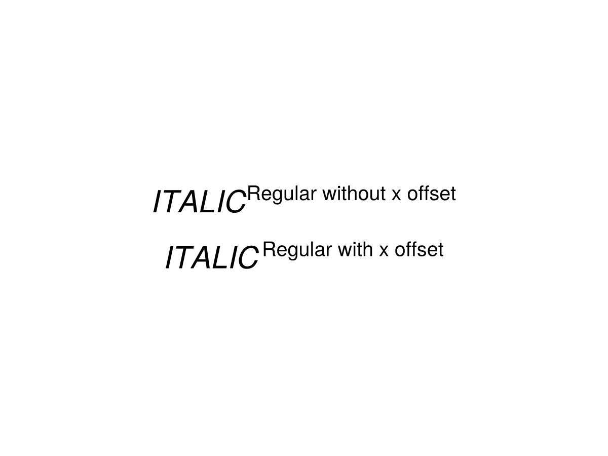

# text {#text}
<details class='jldocstring custom-block' open>
<summary><a id='MakieCore.text-reference-plots-text' href='#MakieCore.text-reference-plots-text'><span class="jlbinding">MakieCore.text</span></a> <Badge type="info" class="jlObjectType jlFunction" text="Function" /></summary>


```julia
text(positions; text, kwargs...)
text(x, y; text, kwargs...)
text(x, y, z; text, kwargs...)
```


Plots one or multiple texts passed via the `text` keyword. `Text` uses the `PointBased` conversion trait.

**Plot type**

The plot type alias for the `text` function is `Text`.


<Badge type="info" class="source-link" text="source"><a href="https://github.com/MakieOrg/Makie.jl/blob/cefec3bc07a829ab04fb7edfbd5ae240496109fa/MakieCore/src/recipes.jl#L520-L616" target="_blank" rel="noreferrer">source</a></Badge>

</details>


## Marker space pixel {#Marker-space-pixel}

By default, text is drawn with `markerspace = :pixel`, which means that the text size is interpreted in pixel space. (The space of the text position is determined by the `space` attribute instead.)

The boundingbox of text with `markerspace = :pixel` will include every data point or every text anchor point but not the text itself, because its extent depends on the current projection of the axis it is in. This also means that `autolimits!` might cut off your text, because the glyphs don&#39;t have a meaningful size in data coordinates (the size is independent of zoom level), and you have to take some care to manually place the text or set data limits such that it is fully visible.

You can either plot one string with one position, or a vector of strings with a vector of positions.
<a id="example-9757625" />


```julia
using CairoMakie
f = Figure()

Axis(f[1, 1], aspect = DataAspect(), backgroundcolor = :gray50)

scatter!(Point2f(0, 0))
text!(0, 0, text = "center", align = (:center, :center))

circlepoints = [(cos(a), sin(a)) for a in LinRange(0, 2pi, 16)[1:end-1]]
scatter!(circlepoints)
text!(
    circlepoints,
    text = "this is point " .* string.(1:15),
    rotation = LinRange(0, 2pi, 16)[1:end-1],
    align = (:right, :baseline),
    color = cgrad(:Spectral)[LinRange(0, 1, 15)]
)

f
```




## Marker space data {#Marker-space-data}

For text whose dimensions are meaningful in data space, set `markerspace = :data`. This means that the boundingbox of the text in data coordinates will include every glyph.
<a id="example-3a20d0f" />


```julia
using CairoMakie
f = Figure()
LScene(f[1, 1])

text!(
    [Point3f(0, 0, i/2) for i in 1:7],
    text = fill("Makie", 7),
    rotation = [i / 7 * 1.5pi for i in 1:7],
    color = [cgrad(:viridis)[x] for x in LinRange(0, 1, 7)],
    align = (:left, :baseline),
    fontsize = 1,
    markerspace = :data
)

f
```




## Alignment {#Alignment}

Text can be aligned with the horizontal alignments `:left`, `:center`, `:right` and the vertical alignments `:bottom`, `:baseline`, `:center`, `:top`.
<a id="example-3b873b7" />


```julia
using CairoMakie
aligns = [(h, v) for v in [:bottom, :baseline, :center, :top]
                 for h in [:left, :center, :right]]
x = repeat(1:3, 4)
y = repeat(1:4, inner = 3)
scatter(x, y)
text!(x, y, text = string.(aligns), align = aligns)
current_figure()
```




## Justification {#Justification}

By default, justification of multiline text follows alignment. Text that is left aligned is also left justified. You can override this with the `justification` attribute.
<a id="example-66a8363" />


```julia
using CairoMakie
scene = Scene(camera = campixel!, size = (800, 800))

points = [Point(x, y) .* 200 for x in 1:3 for y in 1:3]
scatter!(scene, points, marker = :circle, markersize = 10px)

symbols = (:left, :center, :right)

for ((justification, halign), point) in zip(Iterators.product(symbols, symbols), points)

    t = text!(scene,
        point,
        text = "a\nshort\nparagraph",
        color = (:black, 0.5),
        align = (halign, :center),
        justification = justification)

    bb = boundingbox(t, :pixel)
    wireframe!(scene, bb, color = (:red, 0.2))
end

for (p, al) in zip(points[3:3:end], (:left, :center, :right))
    text!(scene, p .+ (0, 80), text = "align :" * string(al),
        align = (:center, :baseline))
end

for (p, al) in zip(points[7:9], (:left, :center, :right))
    text!(scene, p .+ (80, 0), text = "justification\n:" * string(al),
        align = (:center, :top), rotation = pi/2)
end

scene
```




## Offset {#Offset}

The offset attribute can be used to shift text away from its position. This is especially useful with `space = :pixel`, for example to place text together with barplots. You can specify the end of the barplots in data coordinates, and then offset the text a little bit to the left.
<a id="example-6882553" />


```julia
using CairoMakie
f = Figure()

horsepower = [52, 78, 80, 112, 140]
cars = ["Kia", "Mini", "Honda", "Mercedes", "Ferrari"]

ax = Axis(f[1, 1], xlabel = "horse power")
tightlimits!(ax, Left())
hideydecorations!(ax)

barplot!(horsepower, direction = :x)
text!(Point.(horsepower, 1:5), text = cars, align = (:right, :center),
    offset = (-20, 0), color = :white)

f
```




## Relative space {#Relative-space}

The default setting of `text` is `space = :data`, which means the final position depends on the axis limits and scaling. However, it can be useful to place text relative to the axis itself, independent of scaling. With `space = :relative`, the position `(0, 0)` refers to the lower left corner and `(1, 1)` the upper right of the `Scene` that a plot object is in (for an `Axis` that is equivalent to the plotting area, which is implemented using a `Scene`).

A common scenario is to place labels within axes:
<a id="example-f4c7b65" />


```julia
using CairoMakie
f = Figure()

ax1 = Axis(f[1, 1], limits = (1, 2, 3, 4))
ax2 = Axis(f[1, 2], width = 300, limits = (5, 6, 7, 8))
ax3 = Axis(f[2, 1:2], limits = (9, 10, 11, 12))

for (ax, label) in zip([ax1, ax2, ax3], ["A", "B", "C"])
    text!(
        ax, 0, 1,
        text = label,
        font = :bold,
        align = (:left, :top),
        offset = (4, -2),
        space = :relative,
        fontsize = 24
    )
end

f
```




## MathTeX {#MathTeX}

Makie can render LaTeX strings from the LaTeXStrings.jl package using [MathTeXEngine.jl](https://github.com/Kolaru/MathTeXEngine.jl/).
<a id="example-22dd77c" />


```julia
using CairoMakie
lines(0.5..20, x -> sin(x) / sqrt(x), color = :black)
text!(7, 0.38, text = L"\frac{\sin(x)}{\sqrt{x}}", color = :black)
current_figure()
```




You can also pass L-strings to many objects that use text, for example as labels in the legend.
<a id="example-350ad5c" />


```julia
using CairoMakie
f = Figure()
ax = Axis(f[1, 1])

lines!(0..10, x -> sin(3x) / (cos(x) + 2),
    label = L"\frac{\sin(3x)}{\cos(x) + 2}")
lines!(0..10, x -> sin(x^2) / (cos(sqrt(x)) + 2),
    label = L"\frac{\sin(x^2)}{\cos(\sqrt{x}) + 2}")

Legend(f[1, 2], ax)

f
```




## Rich text {#Rich-text}

With rich text, you can conveniently plot text whose parts have different colors or fonts, and you can position sections as subscripts and superscripts. You can create such rich text objects using the functions `rich`, `superscript`, `subscript`, `subsup` and `left_subsup`, all of which create `RichText` objects.

Each of these functions takes a variable number of arguments (except `subsup` and `left_subsup` which take exactly two arguments), each of which can be a `String` or `RichText`. Each can also take keyword arguments such as `color` or `font`, to set these attributes for the given part. The top-level settings for font, color, etc. are taken from the `text` attributes as usual.
<a id="example-421dacf" />


```julia
using CairoMakie
f = Figure(fontsize = 30)
Label(
    f[1, 1],
    rich(
        "H", subscript("2"), "O is the formula for ",
        rich("water", color = :cornflowerblue, font = :italic)
    )
)

str = "A BEAUTIFUL RAINBOW"
rainbow = cgrad(:rainbow, length(str), categorical = true)
fontsizes = 30 .+ 10 .* sin.(range(0, 3pi, length = length(str)))

rainbow_chars = map(enumerate(str)) do (i, c)
    rich("$c", color = rainbow[i], fontsize = fontsizes[i])
end

Label(f[2, 1], rich(rainbow_chars...), font = :bold)

Label(f[3, 1], rich("Chemists use notations like ", left_subsup("92", "238"), "U or PO", subsup("4", "3−")))

f
```




### Tweaking offsets {#Tweaking-offsets}

Sometimes, when using regular and italic fonts next to each other, the gaps between glyphs are too narrow or too wide. You can use the `offset` value for rich text to shift glyphs by an amount proportional to the fontsize.
<a id="example-db58d36" />


```julia
using CairoMakie
f = Figure(fontsize = 30)
Label(
    f[1, 1],
    rich(
        "ITALIC",
        superscript("Regular without x offset", font = :regular),
        font = :italic
    )
)

Label(
    f[2, 1],
    rich(
        "ITALIC",
        superscript("Regular with x offset", font = :regular, offset = (0.15, 0)),
        font = :italic
    )
)

f
```




## Attributes {#Attributes}

### align {#align}

Defaults to `(:left, :bottom)`

Sets the alignment of the string w.r.t. `position`. Uses `:left, :center, :right, :top, :bottom, :baseline` or fractions.

### alpha {#alpha}

Defaults to `1.0`

The alpha value of the colormap or color attribute. Multiple alphas like in `plot(alpha=0.2, color=(:red, 0.5)`, will get multiplied.

### clip_planes {#clip_planes}

Defaults to `automatic`

Clip planes offer a way to do clipping in 3D space. You can set a Vector of up to 8 `Plane3f` planes here, behind which plots will be clipped (i.e. become invisible). By default clip planes are inherited from the parent plot or scene. You can remove parent `clip_planes` by passing `Plane3f[]`.

### color {#color}

Defaults to `@inherit textcolor`

Sets the color of the text. One can set one color per glyph by passing a `Vector{<:Colorant}`, or one colorant for the whole text. If color is a vector of numbers, the colormap args are used to map the numbers to colors.

### colormap {#colormap}

Defaults to `@inherit colormap :viridis`

Sets the colormap that is sampled for numeric `color`s. `PlotUtils.cgrad(...)`, `Makie.Reverse(any_colormap)` can be used as well, or any symbol from ColorBrewer or PlotUtils. To see all available color gradients, you can call `Makie.available_gradients()`.

### colorrange {#colorrange}

Defaults to `automatic`

The values representing the start and end points of `colormap`.

### colorscale {#colorscale}

Defaults to `identity`

The color transform function. Can be any function, but only works well together with `Colorbar` for `identity`, `log`, `log2`, `log10`, `sqrt`, `logit`, `Makie.pseudolog10` and `Makie.Symlog10`.

### depth_shift {#depth_shift}

Defaults to `0.0`

Adjusts the depth value of a plot after all other transformations, i.e. in clip space, where `-1 <= depth <= 1`. This only applies to GLMakie and WGLMakie and can be used to adjust render order (like a tunable overdraw).

### font {#font}

Defaults to `@inherit font`

Sets the font. Can be a `Symbol` which will be looked up in the `fonts` dictionary or a `String` specifying the (partial) name of a font or the file path of a font file

### fonts {#fonts}

Defaults to `@inherit fonts`

Used as a dictionary to look up fonts specified by `Symbol`, for example `:regular`, `:bold` or `:italic`.

### fontsize {#fontsize}

Defaults to `@inherit fontsize`

The fontsize in units depending on `markerspace`.

### fxaa {#fxaa}

Defaults to `false`

Adjusts whether the plot is rendered with fxaa (anti-aliasing, GLMakie only).

### glowcolor {#glowcolor}

Defaults to `(:black, 0.0)`

Sets the color of the glow effect around the text.

### glowwidth {#glowwidth}

Defaults to `0.0`

Sets the size of a glow effect around the text.

### highclip {#highclip}

Defaults to `automatic`

The color for any value above the colorrange.

### inspectable {#inspectable}

Defaults to `@inherit inspectable`

Sets whether this plot should be seen by `DataInspector`. The default depends on the theme of the parent scene.

### inspector_clear {#inspector_clear}

Defaults to `automatic`

Sets a callback function `(inspector, plot) -> ...` for cleaning up custom indicators in DataInspector.

### inspector_hover {#inspector_hover}

Defaults to `automatic`

Sets a callback function `(inspector, plot, index) -> ...` which replaces the default `show_data` methods.

### inspector_label {#inspector_label}

Defaults to `automatic`

Sets a callback function `(plot, index, position) -> string` which replaces the default label generated by DataInspector.

### justification {#justification}

Defaults to `automatic`

Sets the alignment of text w.r.t its bounding box. Can be `:left, :center, :right` or a fraction. Will default to the horizontal alignment in `align`.

### lineheight {#lineheight}

Defaults to `1.0`

The lineheight multiplier.

### lowclip {#lowclip}

Defaults to `automatic`

The color for any value below the colorrange.

### markerspace {#markerspace}

Defaults to `:pixel`

Sets the space in which `fontsize` acts. See `Makie.spaces()` for possible inputs.

### model {#model}

Defaults to `automatic`

Sets a model matrix for the plot. This overrides adjustments made with `translate!`, `rotate!` and `scale!`.

### nan_color {#nan_color}

Defaults to `:transparent`

The color for NaN values.

### offset {#offset}

Defaults to `(0.0, 0.0)`

The offset of the text from the given position in `markerspace` units.

### overdraw {#overdraw}

Defaults to `false`

Controls if the plot will draw over other plots. This specifically means ignoring depth checks in GL backends

### position {#position}

Defaults to `(0.0, 0.0)`

Deprecated: Specifies the position of the text. Use the positional argument to `text` instead.

### rotation {#rotation}

Defaults to `0.0`

Rotates text around the given position

### space {#space}

Defaults to `:data`

Sets the transformation space for box encompassing the plot. See `Makie.spaces()` for possible inputs.

### ssao {#ssao}

Defaults to `false`

Adjusts whether the plot is rendered with ssao (screen space ambient occlusion). Note that this only makes sense in 3D plots and is only applicable with `fxaa = true`.

### strokecolor {#strokecolor}

Defaults to `(:black, 0.0)`

Sets the color of the outline around a marker.

### strokewidth {#strokewidth}

Defaults to `0`

Sets the width of the outline around a marker.

### text {#text-2}

Defaults to `""`

Specifies one piece of text or a vector of texts to show, where the number has to match the number of positions given. Makie supports `String` which is used for all normal text and `LaTeXString` which layouts mathematical expressions using `MathTeXEngine.jl`.

### transform_marker {#transform_marker}

Defaults to `false`

Controls whether the model matrix (without translation) applies to the glyph itself, rather than just the positions. (If this is true, `scale!` and `rotate!` will affect the text glyphs.)

### transformation {#transformation}

Defaults to `:automatic`

No docs available.

### transparency {#transparency}

Defaults to `false`

Adjusts how the plot deals with transparency. In GLMakie `transparency = true` results in using Order Independent Transparency.

### visible {#visible}

Defaults to `true`

Controls whether the plot will be rendered or not.

### word_wrap_width {#word_wrap_width}

Defaults to `-1`

Specifies a linewidth limit for text. If a word overflows this limit, a newline is inserted before it. Negative numbers disable word wrapping.
