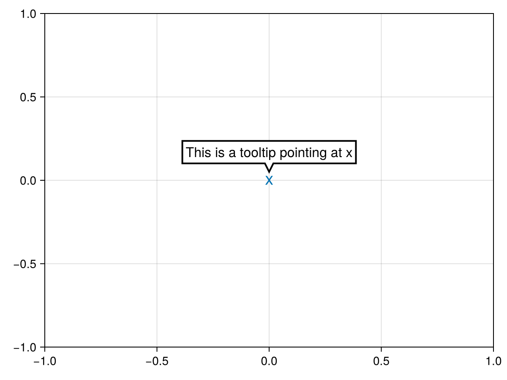

# tooltip {#tooltip}
<details class='jldocstring custom-block' open>
<summary><a id='Makie.tooltip-reference-plots-tooltip' href='#Makie.tooltip-reference-plots-tooltip'><span class="jlbinding">Makie.tooltip</span></a> <Badge type="info" class="jlObjectType jlFunction" text="Function" /></summary>


```julia
tooltip(position, string)
tooltip(x, y, string)
```


Creates a tooltip pointing at `position` displaying the given `string

**Plot type**

The plot type alias for the `tooltip` function is `Tooltip`.


<Badge type="info" class="source-link" text="source"><a href="https://github.com/MakieOrg/Makie.jl/blob/c1ff276792827f16c26b5ad51ea371f8a3759971/MakieCore/src/recipes.jl#L520-L600" target="_blank" rel="noreferrer">source</a></Badge>

</details>


## Examples {#Examples}

### Basic tooltip {#Basic-tooltip}
<a id="example-a000f31" />


```julia
using CairoMakie
fig, ax, p = scatter(Point2f(0), marker = 'x', markersize = 20)
tooltip!(Point2f(0), "This is a tooltip pointing at x")
fig
```




## Attributes {#Attributes}

### align {#align}

Defaults to `0.5`

Sets the alignment of the tooltip relative `position`. With `align = 0.5` the tooltip is centered above/below/left/right the `position`.

### backgroundcolor {#backgroundcolor}

Defaults to `:white`

Sets the background color of the tooltip.

### clip_planes {#clip_planes}

Defaults to `automatic`

Clip planes offer a way to do clipping in 3D space. You can set a Vector of up to 8 `Plane3f` planes here, behind which plots will be clipped (i.e. become invisible). By default clip planes are inherited from the parent plot or scene. You can remove parent `clip_planes` by passing `Plane3f[]`.

### depth_shift {#depth_shift}

Defaults to `0.0`

Adjusts the depth value of a plot after all other transformations, i.e. in clip space, where `-1 <= depth <= 1`. This only applies to GLMakie and WGLMakie and can be used to adjust render order (like a tunable overdraw).

### font {#font}

Defaults to `@inherit font`

Sets the font.

### fontsize {#fontsize}

Defaults to `16`

Sets the text size in screen units.

### fxaa {#fxaa}

Defaults to `true`

Adjusts whether the plot is rendered with fxaa (anti-aliasing, GLMakie only).

### inspectable {#inspectable}

Defaults to `false`

Sets whether this plot should be seen by `DataInspector`. The default depends on the theme of the parent scene.

### inspector_clear {#inspector_clear}

Defaults to `automatic`

Sets a callback function `(inspector, plot) -> ...` for cleaning up custom indicators in DataInspector.

### inspector_hover {#inspector_hover}

Defaults to `automatic`

Sets a callback function `(inspector, plot, index) -> ...` which replaces the default `show_data` methods.

### inspector_label {#inspector_label}

Defaults to `automatic`

Sets a callback function `(plot, index, position) -> string` which replaces the default label generated by DataInspector.

### justification {#justification}

Defaults to `:left`

Sets whether text is aligned to the `:left`, `:center` or `:right` within its bounding box.

### model {#model}

Defaults to `automatic`

Sets a model matrix for the plot. This overrides adjustments made with `translate!`, `rotate!` and `scale!`.

### offset {#offset}

Defaults to `10`

Sets the offset between the given `position` and the tip of the triangle pointing at that position.

### outline_color {#outline_color}

Defaults to `:black`

Sets the color of the tooltip outline.

### outline_linestyle {#outline_linestyle}

Defaults to `nothing`

Sets the linestyle of the tooltip outline.

### outline_linewidth {#outline_linewidth}

Defaults to `2.0`

Sets the linewidth of the tooltip outline.

### overdraw {#overdraw}

Defaults to `false`

Controls if the plot will draw over other plots. This specifically means ignoring depth checks in GL backends

### placement {#placement}

Defaults to `:above`

Sets where the tooltip should be placed relative to `position`. Can be `:above`, `:below`, `:left`, `:right`.

### space {#space}

Defaults to `:data`

Sets the transformation space for box encompassing the plot. See `Makie.spaces()` for possible inputs.

### ssao {#ssao}

Defaults to `false`

Adjusts whether the plot is rendered with ssao (screen space ambient occlusion). Note that this only makes sense in 3D plots and is only applicable with `fxaa = true`.

### strokecolor {#strokecolor}

Defaults to `:white`

Sets the text outline color.

### strokewidth {#strokewidth}

Defaults to `0`

Gives text an outline if set to a positive value.

### text {#text}

Defaults to `""`

No docs available.

### textcolor {#textcolor}

Defaults to `@inherit textcolor`

Sets the text color.

### textpadding {#textpadding}

Defaults to `(4, 4, 4, 4)`

Sets the padding around text in the tooltip. This is given as `(left, right, bottom, top)` offsets.

### transformation {#transformation}

Defaults to `:automatic`

No docs available.

### transparency {#transparency}

Defaults to `false`

Adjusts how the plot deals with transparency. In GLMakie `transparency = true` results in using Order Independent Transparency.

### triangle_size {#triangle_size}

Defaults to `10`

Sets the size of the triangle pointing at `position`.

### visible {#visible}

Defaults to `true`

Controls whether the plot will be rendered or not.

### xautolimits {#xautolimits}

Defaults to `false`

No docs available.

### yautolimits {#yautolimits}

Defaults to `false`

No docs available.

### zautolimits {#zautolimits}

Defaults to `false`

No docs available.
