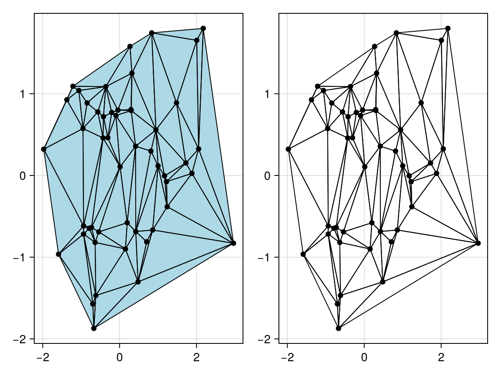
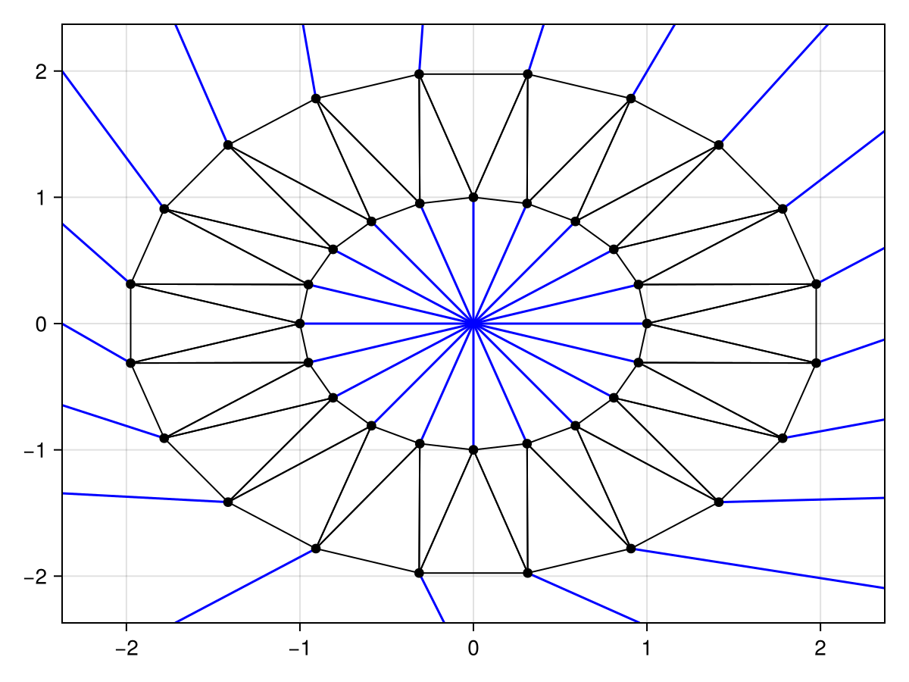
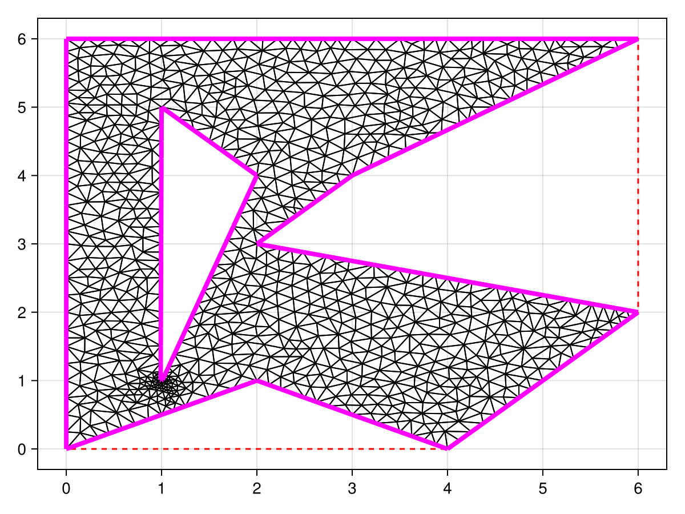

# triplot {#triplot}
<details class='jldocstring custom-block' open>
<summary><a id='Makie.triplot-reference-plots-triplot' href='#Makie.triplot-reference-plots-triplot'><span class="jlbinding">Makie.triplot</span></a> <Badge type="info" class="jlObjectType jlFunction" text="Function" /></summary>


```julia
triplot(x, y; kwargs...)
triplot(positions; kwargs...)
triplot(triangles::Triangulation; kwargs...)
```


Plots a triangulation based on the provided position or `Triangulation` from DelaunayTriangulation.jl.

**Plot type**

The plot type alias for the `triplot` function is `Triplot`.


<Badge type="info" class="source-link" text="source"><a href="https://github.com/MakieOrg/Makie.jl/blob/c1ff276792827f16c26b5ad51ea371f8a3759971/MakieCore/src/recipes.jl#L520-L584" target="_blank" rel="noreferrer">source</a></Badge>

</details>


## Examples {#Examples}

A `triplot` plots a triangle mesh generated from an arbitrary set of points. The input data can either be point based (like `scatter` or `lines`) or a `Triangulation` from [DelaunayTriangulation.jl](https://github.com/DanielVandH/DelaunayTriangulation.jl).
<a id="example-8cc5063" />


```julia
using CairoMakie
using DelaunayTriangulation

using Random
Random.seed!(1234)

points = randn(Point2f, 50)
f, ax, tr = triplot(points, show_points = true, triangle_color = :lightblue)

tri = triangulate(points)
ax, tr = triplot(f[1, 2], tri, show_points = true)
f
```




You can use `triplot` to visualise the [ghost edges](https://juliageometry.github.io/DelaunayTriangulation.jl/stable/manual/ghost_triangles/) surrounding the boundary.
<a id="example-8515305" />


```julia
using CairoMakie
using DelaunayTriangulation

n = 20
angles = range(0, 2pi, length = n+1)[1:end-1]
x = [cos.(angles); 2 .* cos.(angles .+ pi/n)]
y = [sin.(angles); 2 .* sin.(angles .+ pi/n)]
inner = [n:-1:1; n] # clockwise inner
outer = [(n+1):(2n); n+1] # counter-clockwise outer
boundary_nodes = [[outer], [inner]]
points = [x'; y']
tri = triangulate(points; boundary_nodes = boundary_nodes)

f, ax, tr = triplot(tri; show_ghost_edges = true, show_points = true)
f
```




You can also highlight the constrained edges and display the convex hull, which is especially useful when the triangulation is no longer convex.
<a id="example-3fd0015" />


```julia
using CairoMakie
using DelaunayTriangulation

using Random
Random.seed!(1234)

outer = [
    (0.0,0.0),(2.0,1.0),(4.0,0.0),
    (6.0,2.0),(2.0,3.0),(3.0,4.0),
    (6.0,6.0),(0.0,6.0),(0.0,0.0)
]
inner = [
    (1.0,5.0),(2.0,4.0),(1.01,1.01),
    (1.0,1.0),(0.99,1.01),(1.0,5.0)
]
boundary_points = [[outer], [inner]]
boundary_nodes, points = convert_boundary_points_to_indices(boundary_points)
tri = triangulate(points; boundary_nodes = boundary_nodes)
refine!(tri; max_area=1e-3*get_area(tri))

f, ax, tr = triplot(tri, show_constrained_edges = true, constrained_edge_linewidth = 4, show_convex_hull = true)
f
```




## Attributes {#Attributes}

### bounding_box {#bounding_box}

Defaults to `automatic`

Sets the bounding box for truncating ghost edges which can be a `Rect2` (or `BBox`) or a tuple of the form `(xmin, xmax, ymin, ymax)`. By default, the rectangle will be given by `[a - eΔx, b + eΔx] × [c - eΔy, d + eΔy]` where `e` is the `ghost_edge_extension_factor`, `Δx = b - a` and `Δy = d - c` are the lengths of the sides of the rectangle, and `[a, b] × [c, d]` is the bounding box of the points in the triangulation.

### constrained_edge_color {#constrained_edge_color}

Defaults to `:magenta`

Sets the color of the constrained edges.

### constrained_edge_linestyle {#constrained_edge_linestyle}

Defaults to `@inherit linestyle`

Sets the linestyle of the constrained edges.

### constrained_edge_linewidth {#constrained_edge_linewidth}

Defaults to `@inherit linewidth`

Sets the width of the constrained edges.

### convex_hull_color {#convex_hull_color}

Defaults to `:red`

Sets the color of the convex hull.

### convex_hull_linestyle {#convex_hull_linestyle}

Defaults to `:dash`

Sets the linestyle of the convex hull.

### convex_hull_linewidth {#convex_hull_linewidth}

Defaults to `@inherit linewidth`

Sets the width of the convex hull.

### ghost_edge_color {#ghost_edge_color}

Defaults to `:blue`

Sets the color of the ghost edges.

### ghost_edge_extension_factor {#ghost_edge_extension_factor}

Defaults to `0.1`

Sets the extension factor for the rectangle that the exterior ghost edges are extended onto.

### ghost_edge_linestyle {#ghost_edge_linestyle}

Defaults to `@inherit linestyle`

Sets the linestyle of the ghost edges.

### ghost_edge_linewidth {#ghost_edge_linewidth}

Defaults to `@inherit linewidth`

Sets the width of the ghost edges.

### joinstyle {#joinstyle}

Defaults to `@inherit joinstyle`

No docs available.

### linecap {#linecap}

Defaults to `@inherit linecap`

No docs available.

### linestyle {#linestyle}

Defaults to `:solid`

Sets the linestyle of triangle edges.

### marker {#marker}

Defaults to `@inherit marker`

Sets the shape of the points.

### markercolor {#markercolor}

Defaults to `@inherit markercolor`

Sets the color of the points.

### markersize {#markersize}

Defaults to `@inherit markersize`

Sets the size of the points.

### miter_limit {#miter_limit}

Defaults to `@inherit miter_limit`

No docs available.

### recompute_centers {#recompute_centers}

Defaults to `false`

Determines whether to recompute the representative points for the ghost edge orientation. Note that this will mutate `tri.representative_point_list` directly.

### show_constrained_edges {#show_constrained_edges}

Defaults to `false`

Determines whether to plot the constrained edges.

### show_convex_hull {#show_convex_hull}

Defaults to `false`

Determines whether to plot the convex hull.

### show_ghost_edges {#show_ghost_edges}

Defaults to `false`

Determines whether to plot the ghost edges.

### show_points {#show_points}

Defaults to `false`

Determines whether to plot the individual points. Note that this will only plot points included in the triangulation.

### strokecolor {#strokecolor}

Defaults to `@inherit patchstrokecolor`

Sets the color of triangle edges.

### strokewidth {#strokewidth}

Defaults to `1`

Sets the linewidth of triangle edges.

### triangle_color {#triangle_color}

Defaults to `:transparent`

Sets the color of the triangles.
