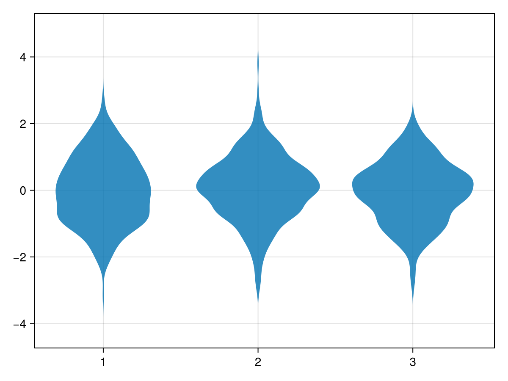
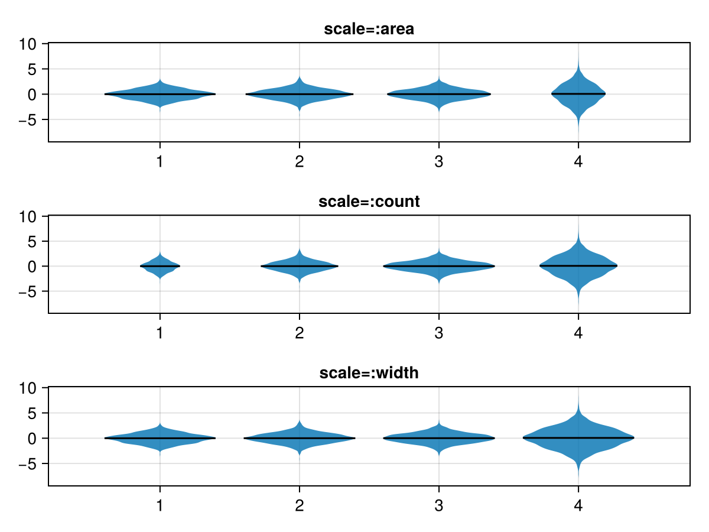
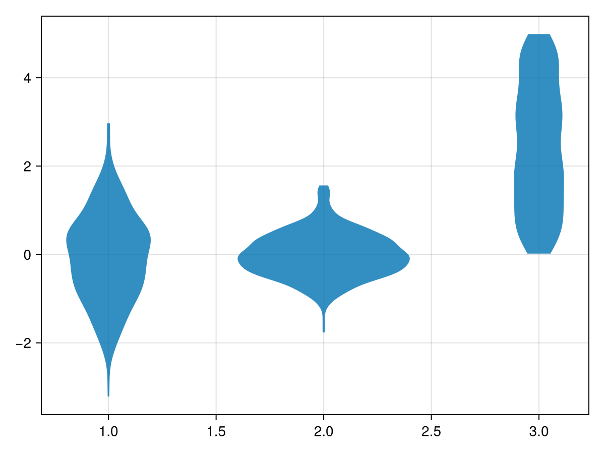
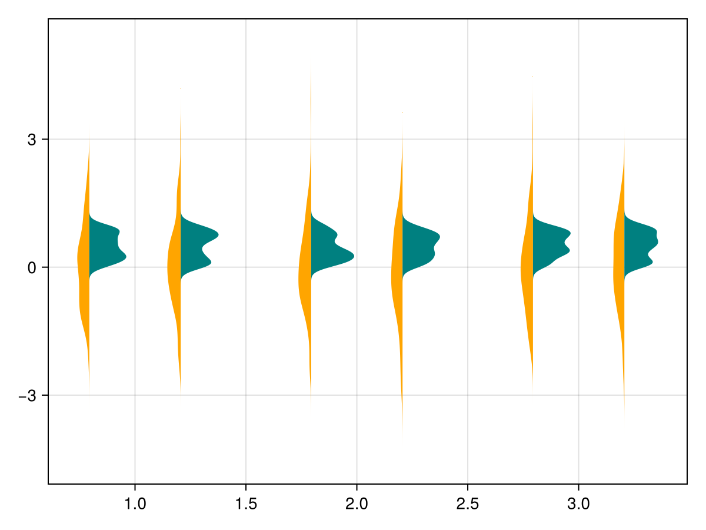
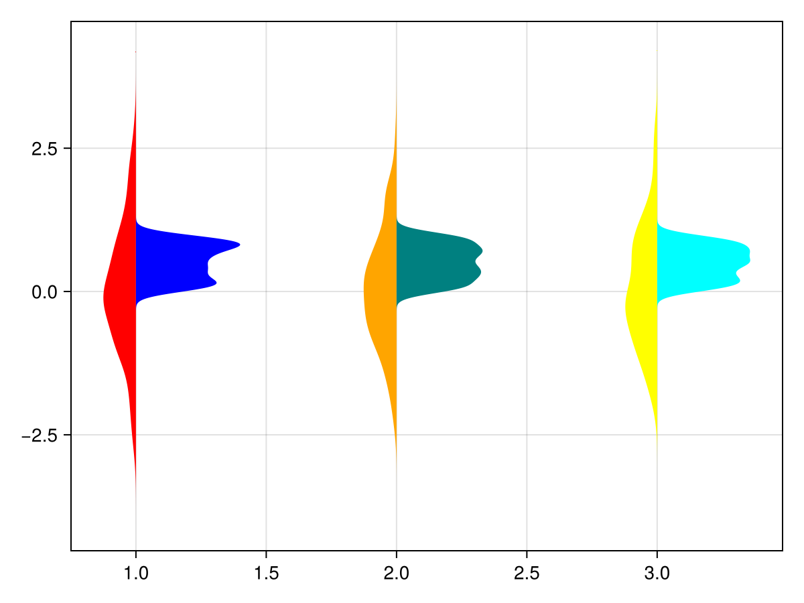
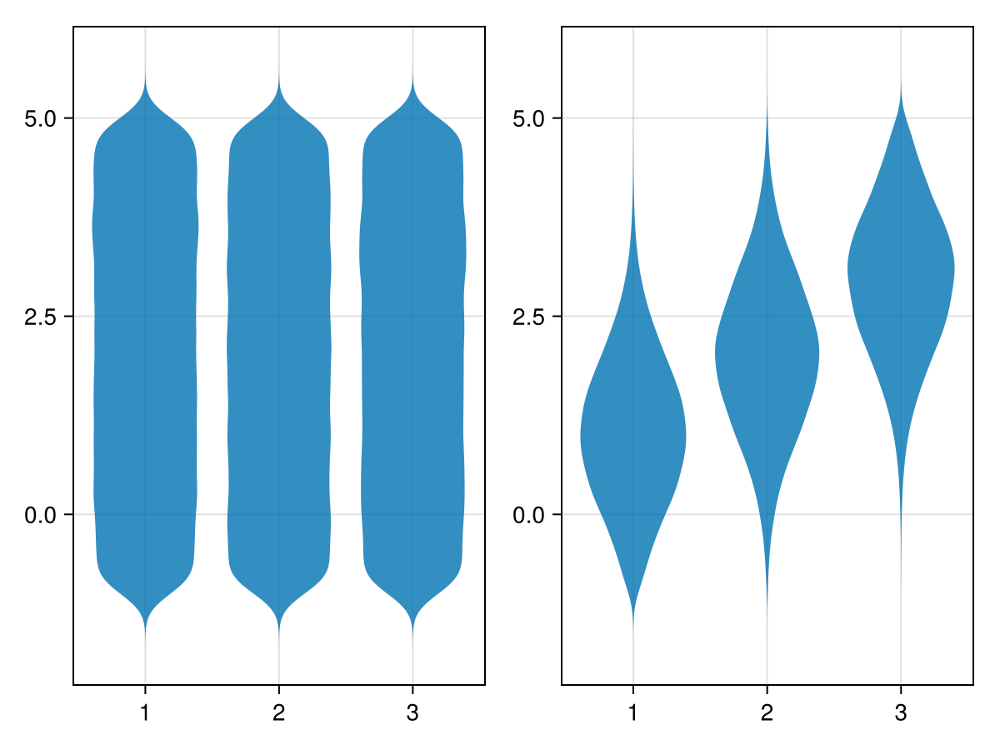
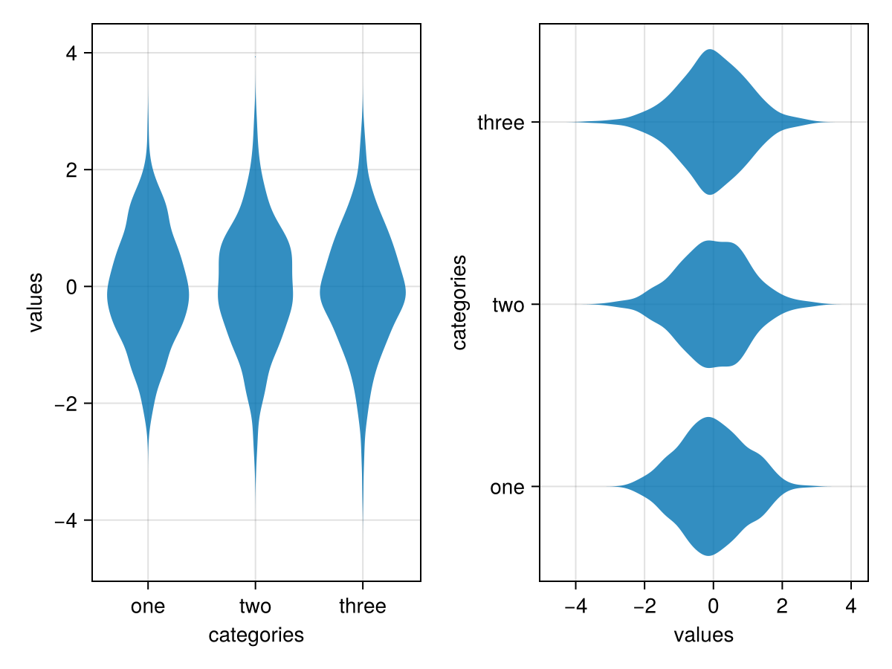

# violin {#violin}
<details class='jldocstring custom-block' open>
<summary><a id='Makie.violin-reference-plots-violin' href='#Makie.violin-reference-plots-violin'><span class="jlbinding">Makie.violin</span></a> <Badge type="info" class="jlObjectType jlFunction" text="Function" /></summary>


```julia
violin(x, y)
```


Draw a violin plot.

**Arguments**
- `x`: positions of the categories
  
- `y`: variables whose density is computed
  

**Plot type**

The plot type alias for the `violin` function is `Violin`.


<Badge type="info" class="source-link" text="source"><a href="https://github.com/MakieOrg/Makie.jl/blob/c1ff276792827f16c26b5ad51ea371f8a3759971/MakieCore/src/recipes.jl#L520-L608" target="_blank" rel="noreferrer">source</a></Badge>

</details>


## Examples {#Examples}
<a id="example-67ddc80" />


```julia
using CairoMakie
categories = rand(1:3, 1000)
values = randn(1000)

violin(categories, values)
```



<a id="example-b4b84cf" />


```julia
using CairoMakie
fig = Figure()
xs = vcat([fill(i, i * 1000) for i in 1:4]...)
ys = vcat(randn(6000), randn(4000) * 2)
for (i, scale) in enumerate([:area, :count, :width])
    ax = Axis(fig[i, 1])
    violin!(ax, xs, ys; scale, show_median=true)
    Makie.xlims!(0.2, 4.8)
    ax.title = "scale=:$(scale)"
end
fig
```



<a id="example-87c1bd5" />


```julia
using CairoMakie
categories = rand(1:3, 1000)
values = map(categories) do x
    return x == 1 ? randn() : x == 2 ? 0.5 * randn() : 5 * rand()
end

violin(categories, values, datalimits = extrema)
```



<a id="example-97fed86" />


```julia
using CairoMakie
N = 1000
categories = rand(1:3, N)
dodge = rand(1:2, N)
side = rand([:left, :right], N)
color = @. ifelse(side === :left, :orange, :teal)
values = map(side) do s
    return s === :left ? randn() : rand()
end

violin(categories, values, dodge = dodge, side = side, color = color)
```



<a id="example-d89f572" />


```julia
using CairoMakie
N = 1000
categories = rand(1:3, N)
side = rand([:left, :right], N)
color = map(categories, side) do x, s
    colors = s === :left ? [:red, :orange, :yellow] : [:blue, :teal, :cyan]
    return colors[x]
end
values = map(side) do s
    return s === :left ? randn() : rand()
end

violin(categories, values, side = side, color = color)
```




#### Using statistical weights {#Using-statistical-weights}
<a id="example-34f58f3" />


```julia
using CairoMakie
using Distributions

N = 100_000
categories = rand(1:3, N)
values = rand(Uniform(-1, 5), N)

w = pdf.(Normal(), categories .- values)

fig = Figure()

violin(fig[1,1], categories, values)
violin(fig[1,2], categories, values, weights = w)

fig
```




#### Horizontal axis {#Horizontal-axis}
<a id="example-2dd5167" />


```julia
using CairoMakie
fig = Figure()

categories = rand(1:3, 1000)
values = randn(1000)

ax_vert = Axis(fig[1,1];
    xlabel = "categories",
    ylabel = "values",
    xticks = (1:3, ["one", "two", "three"])
)
ax_horiz = Axis(fig[1,2];
    xlabel="values", # note that x/y still correspond to horizontal/vertical axes respectively
    ylabel="categories",
    yticks=(1:3, ["one", "two", "three"])
)

# Note: same order of category/value, despite different axes
violin!(ax_vert, categories, values) # `orientation=:vertical` is default
violin!(ax_horiz, categories, values; orientation=:horizontal)

fig
```




## Attributes {#Attributes}

### bandwidth {#bandwidth}

Defaults to `automatic`

No docs available.

### boundary {#boundary}

Defaults to `automatic`

No docs available.

### clip_planes {#clip_planes}

Defaults to `automatic`

Clip planes offer a way to do clipping in 3D space. You can set a Vector of up to 8 `Plane3f` planes here, behind which plots will be clipped (i.e. become invisible). By default clip planes are inherited from the parent plot or scene. You can remove parent `clip_planes` by passing `Plane3f[]`.

### color {#color}

Defaults to `@inherit patchcolor`

No docs available.

### cycle {#cycle}

Defaults to `[:color => :patchcolor]`

No docs available.

### datalimits {#datalimits}

Defaults to `(-Inf, Inf)`

Specify values to trim the `violin`. Can be a `Tuple` or a `Function` (e.g. `datalimits=extrema`).

### depth_shift {#depth_shift}

Defaults to `0.0`

Adjusts the depth value of a plot after all other transformations, i.e. in clip space, where `-1 <= depth <= 1`. This only applies to GLMakie and WGLMakie and can be used to adjust render order (like a tunable overdraw).

### dodge {#dodge}

Defaults to `automatic`

No docs available.

### dodge_gap {#dodge_gap}

Defaults to `0.03`

No docs available.

### fxaa {#fxaa}

Defaults to `true`

Adjusts whether the plot is rendered with fxaa (anti-aliasing, GLMakie only).

### gap {#gap}

Defaults to `0.2`

Shrinking factor, `width -> width * (1 - gap)`.

### inspectable {#inspectable}

Defaults to `@inherit inspectable`

Sets whether this plot should be seen by `DataInspector`. The default depends on the theme of the parent scene.

### inspector_clear {#inspector_clear}

Defaults to `automatic`

Sets a callback function `(inspector, plot) -> ...` for cleaning up custom indicators in DataInspector.

### inspector_hover {#inspector_hover}

Defaults to `automatic`

Sets a callback function `(inspector, plot, index) -> ...` which replaces the default `show_data` methods.

### inspector_label {#inspector_label}

Defaults to `automatic`

Sets a callback function `(plot, index, position) -> string` which replaces the default label generated by DataInspector.

### max_density {#max_density}

Defaults to `automatic`

No docs available.

### mediancolor {#mediancolor}

Defaults to `@inherit linecolor`

No docs available.

### medianlinewidth {#medianlinewidth}

Defaults to `@inherit linewidth`

No docs available.

### model {#model}

Defaults to `automatic`

Sets a model matrix for the plot. This overrides adjustments made with `translate!`, `rotate!` and `scale!`.

### n_dodge {#n_dodge}

Defaults to `automatic`

No docs available.

### npoints {#npoints}

Defaults to `200`

No docs available.

### orientation {#orientation}

Defaults to `:vertical`

Orientation of the violins (`:vertical` or `:horizontal`)

### overdraw {#overdraw}

Defaults to `false`

Controls if the plot will draw over other plots. This specifically means ignoring depth checks in GL backends

### scale {#scale}

Defaults to `:area`

Scale density by area (`:area`), count (`:count`), or width (`:width`).

### show_median {#show_median}

Defaults to `false`

Show median as midline.

### side {#side}

Defaults to `:both`

Specify `:left` or `:right` to only plot the violin on one side.

### space {#space}

Defaults to `:data`

Sets the transformation space for box encompassing the plot. See `Makie.spaces()` for possible inputs.

### ssao {#ssao}

Defaults to `false`

Adjusts whether the plot is rendered with ssao (screen space ambient occlusion). Note that this only makes sense in 3D plots and is only applicable with `fxaa = true`.

### strokecolor {#strokecolor}

Defaults to `@inherit patchstrokecolor`

No docs available.

### strokewidth {#strokewidth}

Defaults to `@inherit patchstrokewidth`

No docs available.

### transformation {#transformation}

Defaults to `:automatic`

No docs available.

### transparency {#transparency}

Defaults to `false`

Adjusts how the plot deals with transparency. In GLMakie `transparency = true` results in using Order Independent Transparency.

### visible {#visible}

Defaults to `true`

Controls whether the plot will be rendered or not.

### weights {#weights}

Defaults to `automatic`

vector of statistical weights (length of data). By default, each observation has weight `1`.

### width {#width}

Defaults to `automatic`

Width of the box before shrinking.
