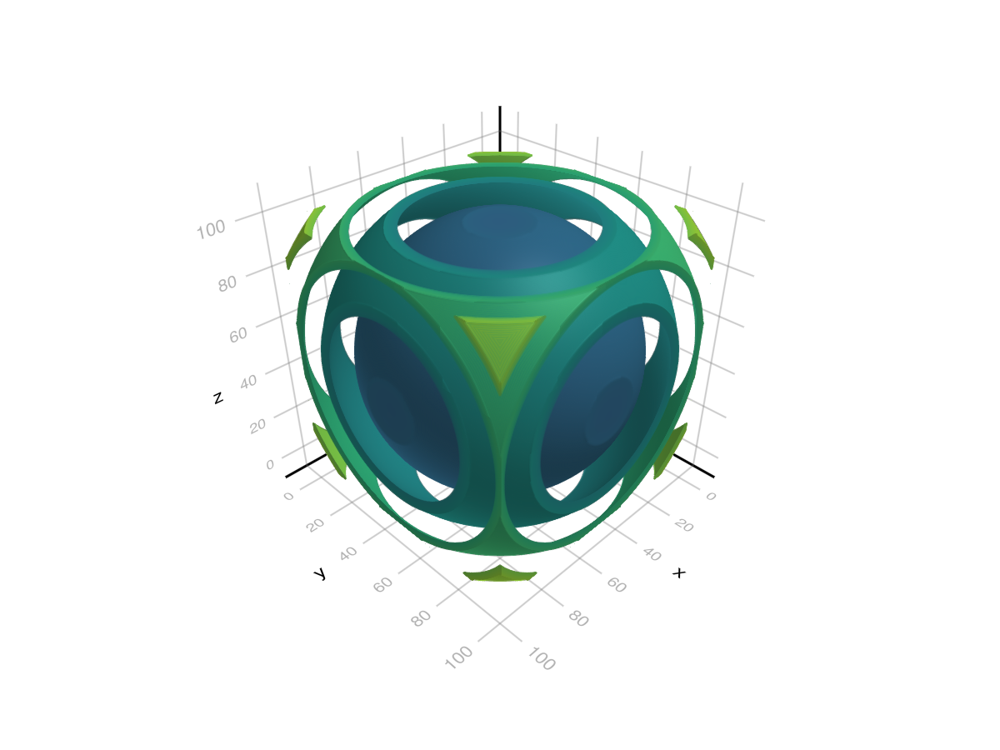
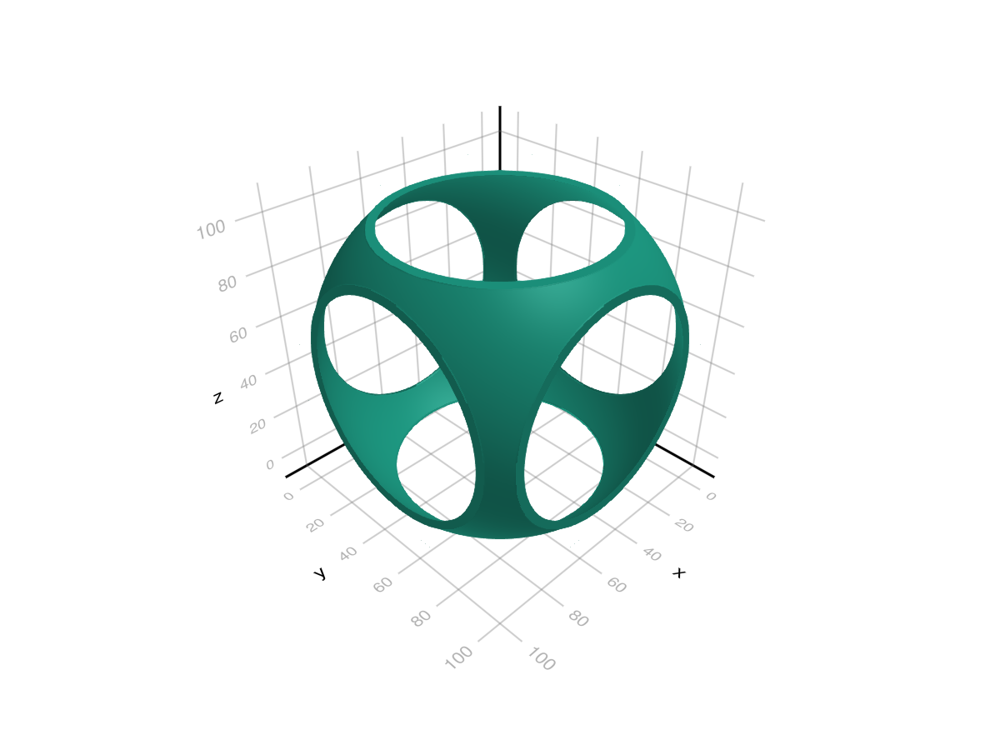
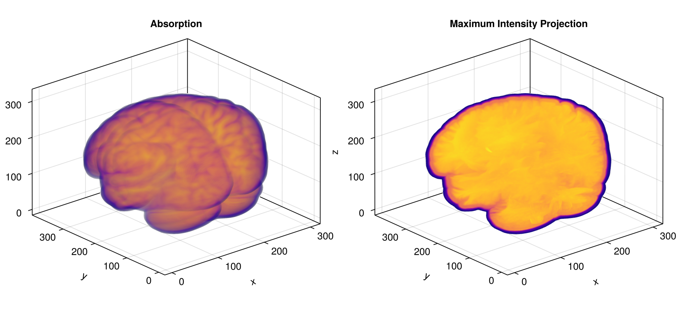
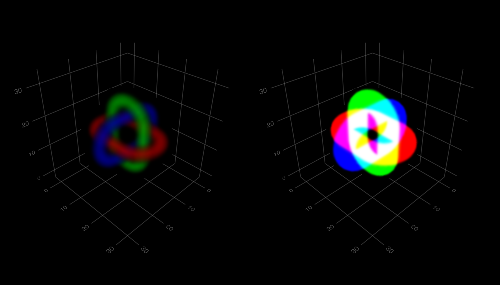
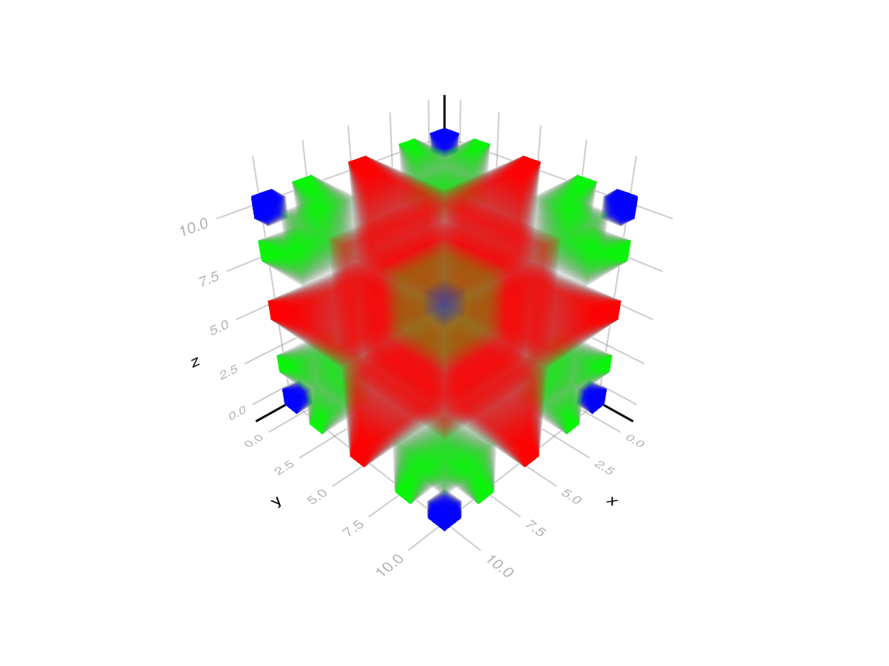

# volume {#volume}
<details class='jldocstring custom-block' open>
<summary><a id='MakieCore.volume-reference-plots-volume' href='#MakieCore.volume-reference-plots-volume'><span class="jlbinding">MakieCore.volume</span></a> <Badge type="info" class="jlObjectType jlFunction" text="Function" /></summary>


```julia
volume(volume_data)
volume(x, y, z, volume_data)
```


Plots a volume with optional physical dimensions `x, y, z`.

All volume plots are derived from casting rays for each drawn pixel. These rays intersect with the volume data to derive some color, usually based on the given colormap. How exactly the color is derived depends on the algorithm used.

**Plot type**

The plot type alias for the `volume` function is `Volume`.


<Badge type="info" class="source-link" text="source"><a href="https://github.com/MakieOrg/Makie.jl/blob/c1ff276792827f16c26b5ad51ea371f8a3759971/MakieCore/src/recipes.jl#L520-L614" target="_blank" rel="noreferrer">source</a></Badge>

</details>


## Examples {#Examples}

### Value based Algorithms (:absorption, :mip, :iso, counter) {#Value-based-Algorithms-:absorption,-:mip,-:iso,-counter}

Value based algorithms samples sample the colormap using values from volume data.
<a id="example-b7373af" />


```julia
using GLMakie
r = LinRange(-1, 1, 100)
cube = [(x.^2 + y.^2 + z.^2) for x = r, y = r, z = r]
contour(cube, alpha=0.5)
```



<a id="example-ecb8e89" />


```julia
cube_with_holes = cube .* (cube .> 1.4)
volume(cube_with_holes, algorithm = :iso, isorange = 0.05, isovalue = 1.7)
```



<a id="example-54ea49d" />


```julia
using GLMakie
using NIfTI
brain = niread(Makie.assetpath("brain.nii.gz")).raw
mini, maxi = extrema(brain)
normed = Float32.((brain .- mini) ./ (maxi - mini))

fig = Figure(size=(1000, 450))
# Make a colormap, with the first value being transparent
colormap = to_colormap(:plasma)
colormap[1] = RGBAf(0,0,0,0)
volume(fig[1, 1], normed, algorithm = :absorption, absorption=4f0, colormap=colormap, axis=(type=Axis3, title = "Absorption"))
volume(fig[1, 2], normed, algorithm = :mip, colormap=colormap, axis=(type=Axis3, title="Maximum Intensity Projection"))
fig
```




### RGB(A) Algorithms (:absorptionrgba, :additive) {#RGBA-Algorithms-:absorptionrgba,-:additive}

RGBA algorithms sample colors directly from the given volume data. If the data contains less than 4 dimensions the remaining dimensions are filled with 0 for the green and blue channel and 1 for the alpha channel.
<a id="example-780a687" />


```julia
using GLMakie
using LinearAlgebra
# Signed distance field for a chain Link (generates distance values from the
# surface of the shape with negative values being inside)
# based on https://iquilezles.org/articles/distfunctions/ "Link"
# (x,y,z) sample position, length between ends, shape radius, tube radius
function sdf(x, y, z, le, r1, r2)
    x, y, z = Vec3f(x, max(abs(y) - le, 0.0), z);
    return norm(Vec2f(sqrt(x*x + y*y) - r1, z)) - r2;
end

r = range(-5, 5, length=31)
data = map([(x,y,z) for x in r, y in r, z in r]) do (x,y,z)
    r = max(-sdf(x,y,z, 1.5, 2, 1), 0)
    g = max(-sdf(y,z,x, 1.5, 2, 1), 0)
    b = max(-sdf(z,x,y, 1.5, 2, 1), 0)
    # RGBAf(1+r, 1+g, 1+b, max(r, g, b) - 0.1)
    RGBAf(r, g, b, max(r, g, b))
end

f = Figure(backgroundcolor = :black, size = (700, 400))
volume(f[1, 1], data, algorithm = :absorptionrgba, absorption = 20)
volume(f[1, 2], data, algorithm = :additive)
f
```




### Indexing Algorithms (:indexedabsorption) {#Indexing-Algorithms-:indexedabsorption}

Indexing Algorithms interpret the value read from volume data as an index into the colormap. So effectively it reads `idx = round(Int, get(data, sample_pos))` and uses `colormap[idx]` as the color of the sample. Note that you can still use float data here, and without `interpolate = false` it will be interpolated.
<a id="example-19c63c0" />


```julia
using GLMakie
r = -5:5
data = map([(x,y,z) for x in r, y in r, z in r]) do (x,y,z)
    1 + min(abs(x), abs(y), abs(z))
end
colormap = [:red, :transparent, :transparent, RGBAf(0,1,0,0.5), :transparent, :blue]
volume(data, algorithm = :indexedabsorption, colormap = colormap,
    interpolate = false, absorption = 5)
```




## Attributes {#Attributes}

### absorption {#absorption}

Defaults to `1.0`

Absorption multiplier for algorithm = :absorption, :absorptionrgba and :indexedabsorption. This changes how much light each voxel absorbs.

### algorithm {#algorithm}

Defaults to `:mip`

Sets the volume algorithm that is used. Available algorithms are:
- `:iso`: Shows an isovalue surface within the given float data. For this only samples within `isovalue - isorange .. isovalue + isorange` are included in the final color of a pixel.
  
- `:absorption`: Accumulates color based on the float values sampled from volume data. At each ray step (starting from the front) a value is sampled from the volume data and then used to sample the colormap. The resulting color is weighted by the ray step size and blended the previously accumulated color. The weight of each step can be adjusted with the multiplicative `absorption` attribute.
  
- `:mip`: Shows the maximum intensity projection of the given float data. This derives the color of a pixel from the largest value sampled from the respective ray.
  
- `:absorptionrgba`: This algorithm matches :absorption, but samples colors directly from RGBA volume data. For each ray step a color is sampled from the data, weighted by the ray step size and blended with the previously accumulated color. Also considers `absorption`.
  
- `:additive`: Accumulates colors using `accumulated_color = 1 - (1 - accumulated_color) * (1 - sampled_color)` where `sampled_color` is a sample of volume data at the current ray step.
  
- `:indexedabsorption`: This algorithm acts the same as :absorption, but interprets the volume data as indices. They are used as direct indices to the colormap. Also considers `absorption`.
  

### alpha {#alpha}

Defaults to `1.0`

The alpha value of the colormap or color attribute. Multiple alphas like in `plot(alpha=0.2, color=(:red, 0.5)`, will get multiplied.

### backlight {#backlight}

Defaults to `0.0`

Sets a weight for secondary light calculation with inverted normals.

### clip_planes {#clip_planes}

Defaults to `automatic`

Clip planes offer a way to do clipping in 3D space. You can set a Vector of up to 8 `Plane3f` planes here, behind which plots will be clipped (i.e. become invisible). By default clip planes are inherited from the parent plot or scene. You can remove parent `clip_planes` by passing `Plane3f[]`.

### colormap {#colormap}

Defaults to `@inherit colormap :viridis`

Sets the colormap that is sampled for numeric `color`s. `PlotUtils.cgrad(...)`, `Makie.Reverse(any_colormap)` can be used as well, or any symbol from ColorBrewer or PlotUtils. To see all available color gradients, you can call `Makie.available_gradients()`.

### colorrange {#colorrange}

Defaults to `automatic`

The values representing the start and end points of `colormap`.

### colorscale {#colorscale}

Defaults to `identity`

The color transform function. Can be any function, but only works well together with `Colorbar` for `identity`, `log`, `log2`, `log10`, `sqrt`, `logit`, `Makie.pseudolog10` and `Makie.Symlog10`.

### depth_shift {#depth_shift}

Defaults to `0.0`

Adjusts the depth value of a plot after all other transformations, i.e. in clip space, where `-1 <= depth <= 1`. This only applies to GLMakie and WGLMakie and can be used to adjust render order (like a tunable overdraw).

### diffuse {#diffuse}

Defaults to `1.0`

Sets how strongly the red, green and blue channel react to diffuse (scattered) light.

### enable_depth {#enable_depth}

Defaults to `true`

Enables depth write for :iso so that volume correctly occludes other objects.

### fxaa {#fxaa}

Defaults to `true`

Adjusts whether the plot is rendered with fxaa (anti-aliasing, GLMakie only).

### highclip {#highclip}

Defaults to `automatic`

The color for any value above the colorrange.

### inspectable {#inspectable}

Defaults to `@inherit inspectable`

Sets whether this plot should be seen by `DataInspector`. The default depends on the theme of the parent scene.

### inspector_clear {#inspector_clear}

Defaults to `automatic`

Sets a callback function `(inspector, plot) -> ...` for cleaning up custom indicators in DataInspector.

### inspector_hover {#inspector_hover}

Defaults to `automatic`

Sets a callback function `(inspector, plot, index) -> ...` which replaces the default `show_data` methods.

### inspector_label {#inspector_label}

Defaults to `automatic`

Sets a callback function `(plot, index, position) -> string` which replaces the default label generated by DataInspector.

### interpolate {#interpolate}

Defaults to `true`

Sets whether the volume data should be sampled with interpolation.

### isorange {#isorange}

Defaults to `0.05`

Sets the maximum accepted distance from the isovalue for the :iso algorithm. `accepted = isovalue - isorange < value < isovalue + isorange`

### isovalue {#isovalue}

Defaults to `0.5`

Sets the target value for the :iso algorithm. `accepted = isovalue - isorange < value < isovalue + isorange`

### lowclip {#lowclip}

Defaults to `automatic`

The color for any value below the colorrange.

### material {#material}

Defaults to `nothing`

RPRMakie only attribute to set complex RadeonProRender materials.         _Warning_, how to set an RPR material may change and other backends will ignore this attribute

### model {#model}

Defaults to `automatic`

Sets a model matrix for the plot. This overrides adjustments made with `translate!`, `rotate!` and `scale!`.

### nan_color {#nan_color}

Defaults to `:transparent`

The color for NaN values.

### overdraw {#overdraw}

Defaults to `false`

Controls if the plot will draw over other plots. This specifically means ignoring depth checks in GL backends

### shading {#shading}

Defaults to `automatic`

Sets the lighting algorithm used. Options are `NoShading` (no lighting), `FastShading` (AmbientLight + PointLight) or `MultiLightShading` (Multiple lights, GLMakie only). Note that this does not affect RPRMakie.

### shininess {#shininess}

Defaults to `32.0`

Sets how sharp the reflection is.

### space {#space}

Defaults to `:data`

Sets the transformation space for box encompassing the plot. See `Makie.spaces()` for possible inputs.

### specular {#specular}

Defaults to `0.2`

Sets how strongly the object reflects light in the red, green and blue channels.

### ssao {#ssao}

Defaults to `false`

Adjusts whether the plot is rendered with ssao (screen space ambient occlusion). Note that this only makes sense in 3D plots and is only applicable with `fxaa = true`.

### transformation {#transformation}

Defaults to `:automatic`

No docs available.

### transparency {#transparency}

Defaults to `false`

Adjusts how the plot deals with transparency. In GLMakie `transparency = true` results in using Order Independent Transparency.

### visible {#visible}

Defaults to `true`

Controls whether the plot will be rendered or not.
