# voxels {#voxels}
<details class='jldocstring custom-block' open>
<summary><a id='MakieCore.voxels-reference-plots-voxels' href='#MakieCore.voxels-reference-plots-voxels'><span class="jlbinding">MakieCore.voxels</span></a> <Badge type="info" class="jlObjectType jlFunction" text="Function" /></summary>


```julia
voxels(x, y, z, chunk::Array{<:Real, 3})
voxels(chunk::Array{<:Real, 3})
```


Plots a chunk of voxels centered at 0. Optionally the placement and scaling of the chunk can be given as range-like x, y and z. (Only the extrema are considered here. Voxels are always uniformly sized.)

Internally voxels are represented as 8 bit unsigned integer, with `0x00` always being an invisible &quot;air&quot; voxel. Passing a chunk with matching type will directly set those values. Note that color handling is specialized for the internal representation and may behave a bit differently than usual.

Note that `voxels` is currently considered experimental and may still see breaking changes in patch releases.

**Plot type**

The plot type alias for the `voxels` function is `Voxels`.


<Badge type="info" class="source-link" text="source"><a href="https://github.com/MakieOrg/Makie.jl/blob/cefec3bc07a829ab04fb7edfbd5ae240496109fa/MakieCore/src/recipes.jl#L520-L632" target="_blank" rel="noreferrer">source</a></Badge>

</details>


## Examples {#Examples}

#### Basic Example {#Basic-Example}
<a id="example-a981a08" />


```julia
using GLMakie
# Same as volume example
r = LinRange(-1, 1, 100)
cube = [(x.^2 + y.^2 + z.^2) for x = r, y = r, z = r]
cube_with_holes = cube .* (cube .> 1.4)

# To match the volume example with isovalue=1.7 and isorange=0.05 we map all
# values outside the range (1.65..1.75) to invisible air blocks with is_air
f, a, p = voxels(-1..1, -1..1, -1..1, cube_with_holes, is_air = x -> !(1.65 <= x <= 1.75))
```

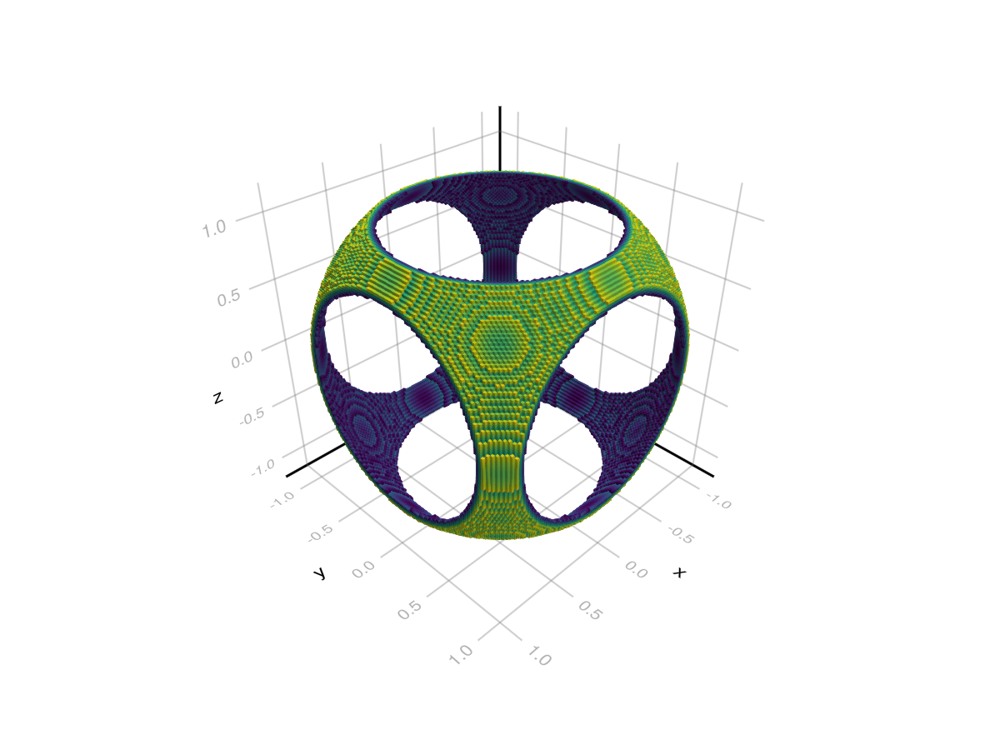


#### Gap Attribute {#Gap-Attribute}

The `gap` attribute allows you to specify a gap size between adjacent voxels. It is given in units of the voxel size (at `gap = 0`) so that `gap = 0` creates no gaps and `gap = 1` reduces the voxel size to 0. Note that this attribute only takes effect at values `gap > 0.01`.
<a id="example-2ec155f" />


```julia
using GLMakie
chunk = reshape(collect(1:27), 3, 3, 3)
voxels(chunk, gap = 0.33)
```

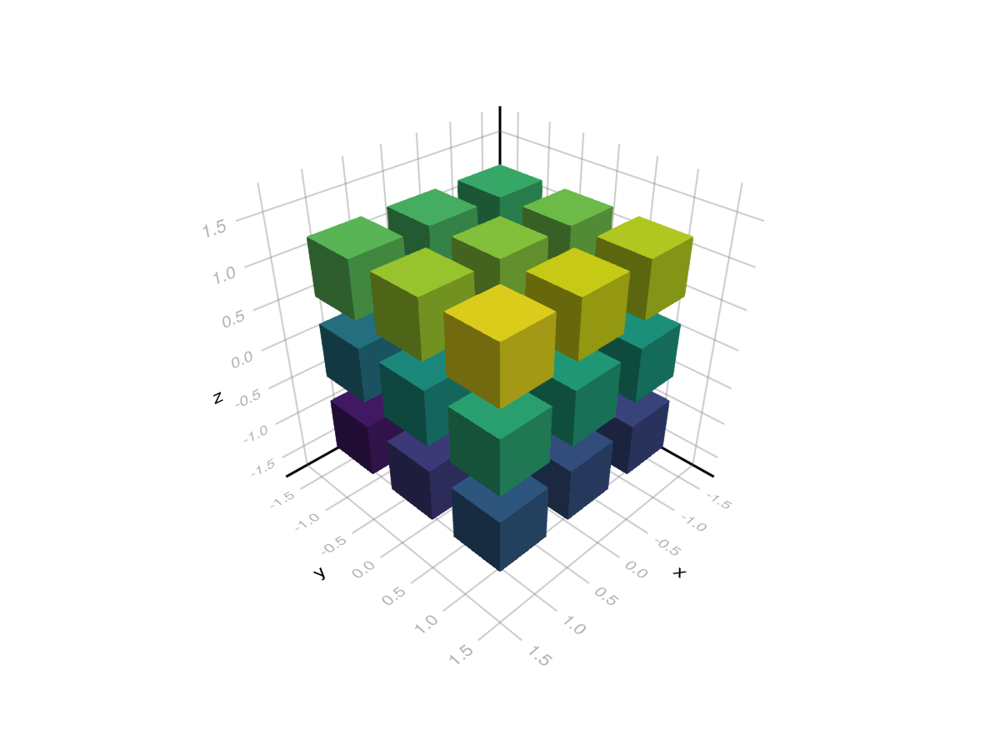


#### Color and the internal representation {#Color-and-the-internal-representation}

Voxels are represented as an `Array{UInt8, 3}` of voxel ids internally. In this representation the voxel id `0x00` is defined as an invisible air block. All other ids (0x01 - 0xff or 1 - 255) are visible and derive their color from the various color attributes. For `plot.color` specifically the voxel id acts as an index into an array of colors:
<a id="example-e345c35" />


```julia
using GLMakie
chunk = UInt8[
    1 0 2; 0 0 0; 3 0 4;;;
    0 0 0; 0 0 0; 0 0 0;;;
    5 0 6; 0 0 0; 7 0 8;;;
]
f, a, p = voxels(chunk, color = [:white, :red, :green, :blue, :black, :orange, :cyan, :magenta])
```

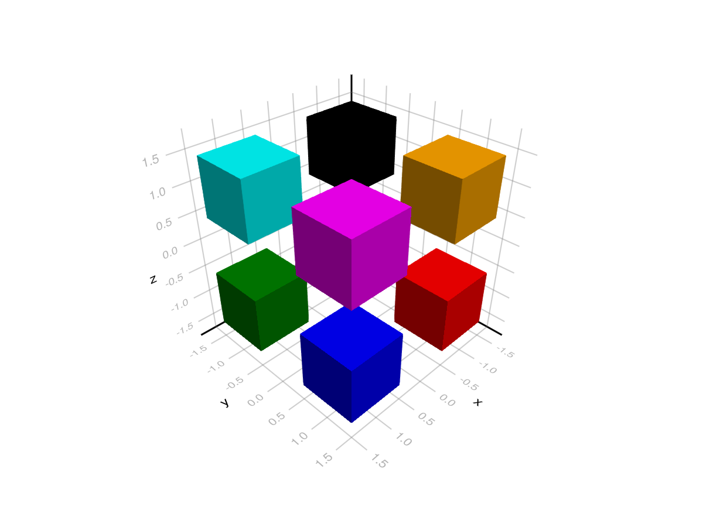


#### Colormaps {#Colormaps}

With non `UInt8` inputs, colormap attributes (colormap, colorrange, highclip, lowclip and colorscale) work as usual, with the exception of `nan_color` which is not applicable:
<a id="example-5210de1" />


```julia
using GLMakie
chunk = reshape(collect(1:512), 8, 8, 8)

f, a, p = voxels(chunk,
    colorrange = (65, 448), colorscale = log10,
    lowclip = :red, highclip = :orange,
    colormap = [:blue, :green]
)
```

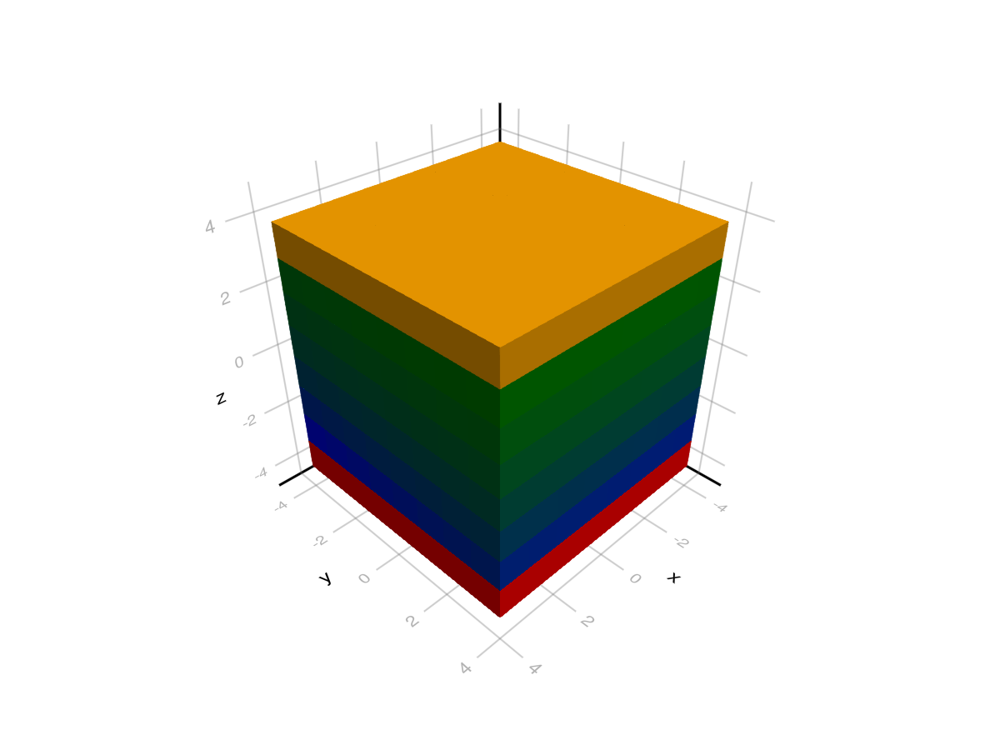


When passing voxel ids directly (i.e. an `Array{UInt8, 3}`) they are used to index a vector `[lowclip; sampled_colormap; highclip]`. This means id 1 maps to lowclip, 2..254 to colors of the colormap and 255 to highclip. `colorrange` and `colorscale` are ignored in this case.

#### Texture maps {#Texture-maps}

For texture mapping we need an image containing multiple textures which are to be mapped to voxels. As an example, we will use [Kenney&#39;s Voxel Pack](https://www.kenney.nl/assets/voxel-pack).
<a id="example-790676f" />


```julia
using GLMakie
using FileIO
texture = FileIO.load(Makie.assetpath("voxel_spritesheet.png"))
image(0..1, 0..1, texture, axis=(xlabel = "u", ylabel="v"))
```

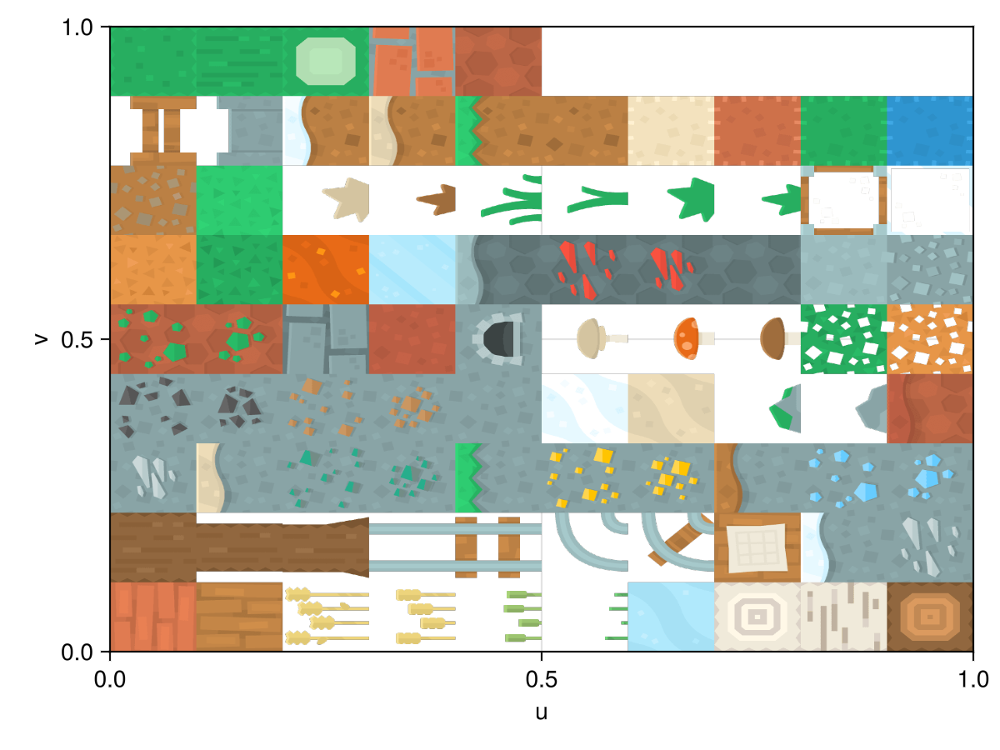


Voxels render with texture mapping when `color` is an image and `uv_transform` is defined. In this case uv (texture) coordinates are generated, transformed by `uv_transform` and then used to sample the image. Each voxel starts with a 0..1 uv range, which can be shown by using Makie&#39;s &quot;debug_texture&quot; with an identity transform. Here magenta corresponds to (0, 0), blue to (1, 0), red to (0, 1) and green to (1, 1).
<a id="example-f6f148b" />


```julia
using GLMakie
using FileIO, LinearAlgebra
texture = FileIO.load(Makie.assetpath("debug_texture.png"))
voxels(ones(UInt8, 3,3,3), uv_transform = [I], color = texture)
```

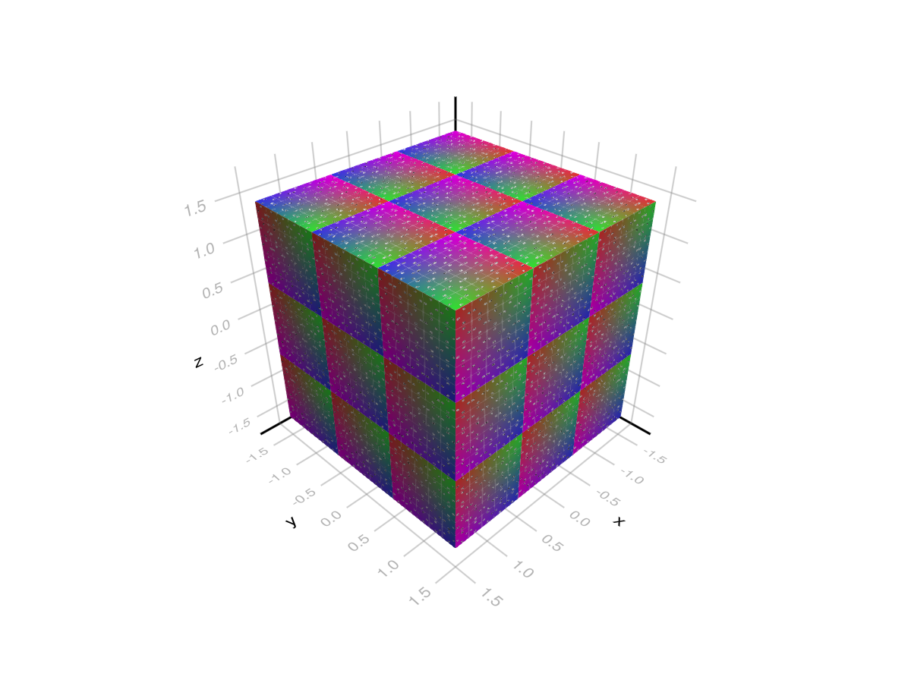


To do texture mapping we want to transform the 0..1 uv range to a smaller range corresponding to textures in the image. We can do that by defining a `uv_transform` per voxel id that includes a translation and scaling.
<a id="example-ddfb75c" />


```julia
using GLMakie
using FileIO

# load a sprite sheet with 10 x 9 textures
texture = FileIO.load(Makie.assetpath("voxel_spritesheet.png"))

# create a mapping of voxel id -> (translation, scale)
uvt = [(Point2f(x, y), Vec2f(1/10, 1/9))
    for x in range(0.0, 1.0, length = 11)[1:end-1]
    for y in range(0.0, 1.0, length = 10)[1:end-1]
]

# Define which textures/uvs apply to which voxels (0 is invisible/air)
chunk = UInt8[
    1 0 2; 0 0 0; 3 0 4;;;
    0 0 0; 0 0 0; 0 0 0;;;
    5 0 6; 0 0 0; 7 0 9;;;
]

# draw
voxels(chunk, uv_transform = uvt, color = texture)
```

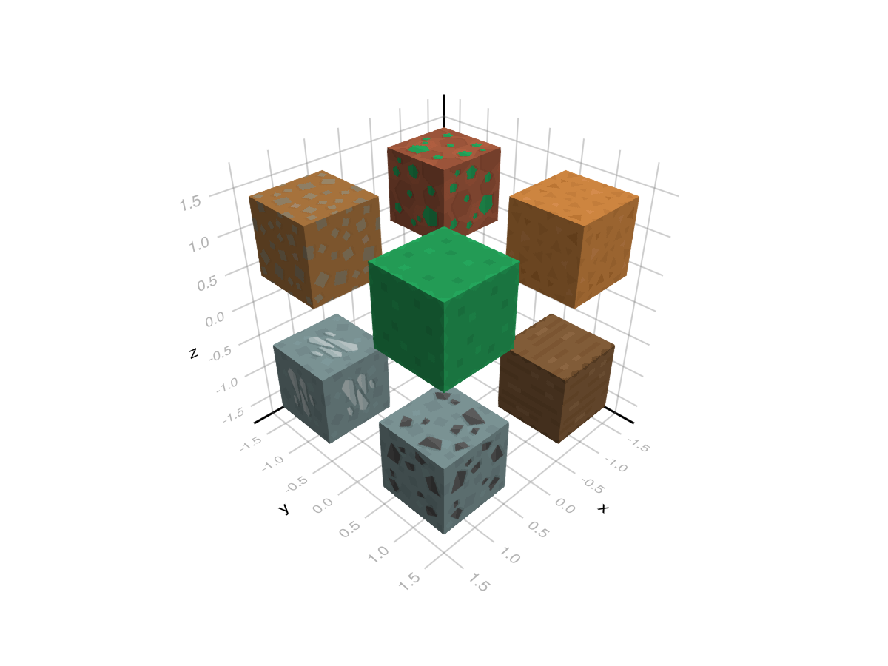


Texture mapping can also be done per voxel side by passing a `Matrix` of uv transforms. Here the first index correspond to the voxel id and the second to a side following the order: -x, -y, -z, +x, +y, +z.
<a id="example-bbe1888" />


```julia
using GLMakie
using FileIO

texture = FileIO.load(Makie.assetpath("voxel_spritesheet.png"))

# idx -> uv LRBT map for convenience. Note the change in order loop order
uvs = [
    (Point2f(x, y), Vec2f(1/10, 1/9))
    for y in range(0.0, 1.0, length = 10)[1:end-1]
    for x in range(0.0, 1.0, length = 11)[1:end-1]
]

# Create uvmap with sides (-x -y -z x y z) in second dimension
uvt = Matrix{Any}(undef, 5, 6)
uvt[1, :] = [uvs[9],  uvs[9],  uvs[8],  uvs[9],  uvs[9],  uvs[8]]  # 1 -> birch
uvt[2, :] = [uvs[11], uvs[11], uvs[10], uvs[11], uvs[11], uvs[10]] # 2 -> oak
uvt[3, :] = [uvs[2],  uvs[2],  uvs[2],  uvs[2],  uvs[2],  uvs[18]] # 3 -> crafting table
uvt[4, :] = [uvs[1],  uvs[1],  uvs[1],  uvs[1],  uvs[1],  uvs[1]]  # 4 -> planks
uvt[5, :] = [uvs[75], uvs[75], uvs[76], uvs[75], uvs[75], uvs[62]] # 5 -> dirt/grass

chunk = UInt8[
    1 0 1; 0 0 0; 1 0 5;;;
    0 0 0; 0 0 0; 0 0 0;;;
    2 0 2; 0 0 0; 3 0 4;;;
]

# rotate 0..1 texture coordinates first because the texture is rotated relative to what OpenGL expects
voxels(chunk, uv_transform = (uvt, :rotr90), color = texture)
```

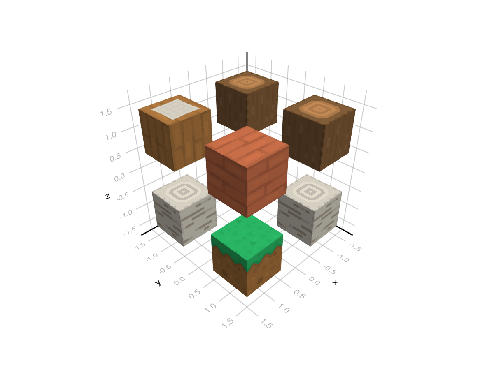


Note that `uv_transform` allows various input types. You can find more information on them with `?Makie.uv_transform`. In the most general case a uv transform is a `Makie.Mat{2, 3, Float32}` which is multiplied to `Vec3f(uv..., 1)`. The `(translation, scale)` syntax we used above can be written as `Makie.Mat{2, 3, Float32}(1/10, 0, 0, 1/9, x, y)`.

#### Updating Voxels {#Updating-Voxels}

The voxel plot is a bit different from other plot types which affects how you can and should update its data.

First you _can_ pass your data as an `Observable` and update that observable as usual:
<a id="example-742f2d2" />


```julia
using GLMakie
chunk = Observable(ones(8,8,8))
f, a, p = voxels(chunk, colorrange = (0, 1))
chunk[] = rand(8,8,8)
f
```

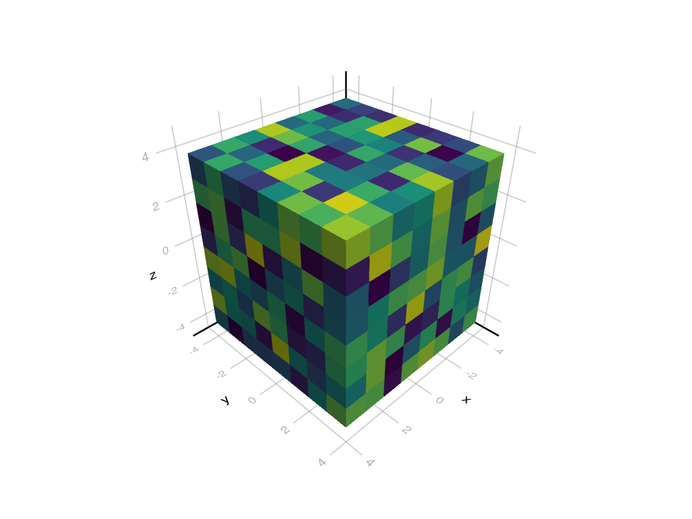


You can also update the data contained in the plot object. For this you can&#39;t index into the plot though, since that will return the converted voxel id data. Instead you need to index into `p.args`.
<a id="example-8d28dd2" />


```julia
using GLMakie
f, a, p = voxels(ones(8,8,8), colorrange = (0, 1))
p.args[end][] = rand(8,8,8)
f
```

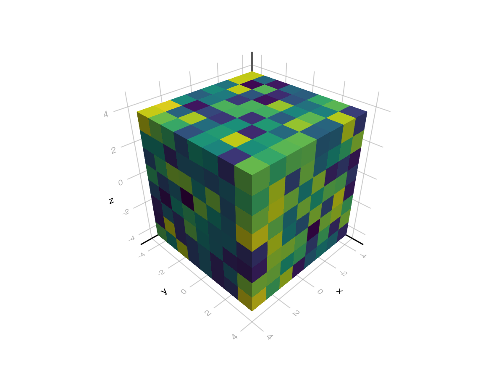


Both of these solutions triggers a full replacement of the input array (i.e. `chunk`), the internal representation (`plot.converted[4]`) and the texture on gpu. This can be quite slow and wasteful if you only want to update a small section of a large chunk. In that case you should instead update your input data without triggering an update (using `obs.val`) and then call `local_update(plot, is, js, ks)` to process the update:
<a id="example-6468eb3" />


```julia
using GLMakie
chunk = Observable(rand(64, 64, 64))
f, a, p = voxels(chunk, colorrange = (0, 1))
chunk.val[30:34, :, :] .= NaN # or p.args[end].val
Makie.local_update(p, 30:34, :, :)
f
```

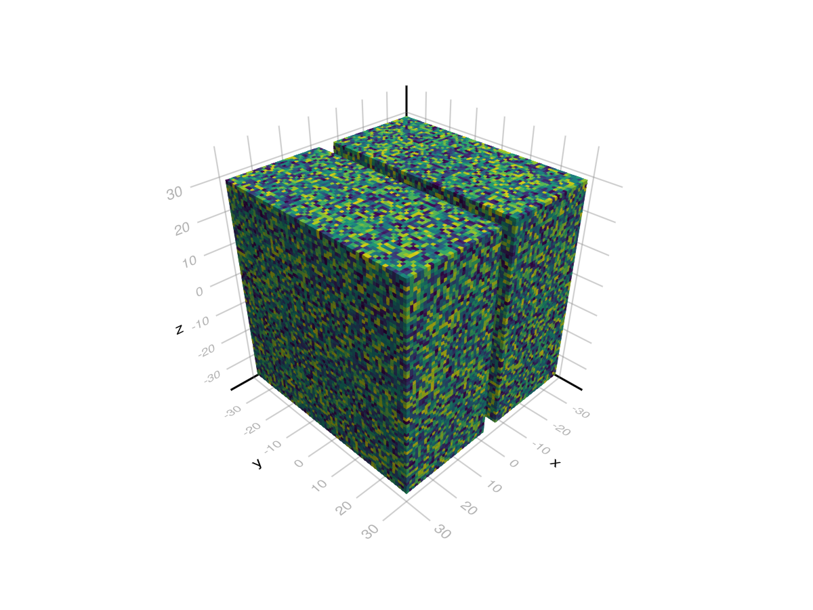


#### Picking Voxels {#Picking-Voxels}

The `pick` function is able to pick individual voxels in a voxel plot. The returned index is a flat index into the array passed to `voxels`, i.e. `plt.args[end][][idx]` will return the relevant data. One important thing to note here is that the returned index is a `UInt32` internally and thus has limited range. Very large voxel plots (~4.3 billion voxels or 2048 x 2048 x 1024) can reach this limit and trigger an integer overflow.

## Attributes {#Attributes}

### alpha {#alpha}

Defaults to `1.0`

The alpha value of the colormap or color attribute. Multiple alphas like in `plot(alpha=0.2, color=(:red, 0.5)`, will get multiplied.

### backlight {#backlight}

Defaults to `0.0`

Sets a weight for secondary light calculation with inverted normals.

### clip_planes {#clip_planes}

Defaults to `automatic`

Clip planes offer a way to do clipping in 3D space. You can set a Vector of up to 8 `Plane3f` planes here, behind which plots will be clipped (i.e. become invisible). By default clip planes are inherited from the parent plot or scene. You can remove parent `clip_planes` by passing `Plane3f[]`.

### color {#color}

Defaults to `nothing`

Sets colors per voxel id, skipping `0x00`. This means that a voxel with id 1 will grab `plot.colors[1]` and so on up to id 255. This can also be set to a Matrix of colors, i.e. an image for texture mapping.

### colormap {#colormap}

Defaults to `@inherit colormap :viridis`

Sets the colormap that is sampled for numeric `color`s. `PlotUtils.cgrad(...)`, `Makie.Reverse(any_colormap)` can be used as well, or any symbol from ColorBrewer or PlotUtils. To see all available color gradients, you can call `Makie.available_gradients()`.

### colorrange {#colorrange}

Defaults to `automatic`

The values representing the start and end points of `colormap`.

### colorscale {#colorscale}

Defaults to `identity`

The color transform function. Can be any function, but only works well together with `Colorbar` for `identity`, `log`, `log2`, `log10`, `sqrt`, `logit`, `Makie.pseudolog10` and `Makie.Symlog10`.

### depth_shift {#depth_shift}

Defaults to `0.0`

Adjusts the depth value of a plot after all other transformations, i.e. in clip space, where `-1 <= depth <= 1`. This only applies to GLMakie and WGLMakie and can be used to adjust render order (like a tunable overdraw).

### depthsorting {#depthsorting}

Defaults to `false`

Controls the render order of voxels. If set to `false` voxels close to the viewer are rendered first which should reduce overdraw and yield better performance. If set to `true` voxels are rendered back to front enabling correct order for transparent voxels.

### diffuse {#diffuse}

Defaults to `1.0`

Sets how strongly the red, green and blue channel react to diffuse (scattered) light.

### fxaa {#fxaa}

Defaults to `true`

Adjusts whether the plot is rendered with fxaa (anti-aliasing, GLMakie only).

### gap {#gap}

Defaults to `0.0`

Sets the gap between adjacent voxels in units of the voxel size. This needs to be larger than 0.01 to take effect.

### highclip {#highclip}

Defaults to `automatic`

The color for any value above the colorrange.

### inspectable {#inspectable}

Defaults to `@inherit inspectable`

Sets whether this plot should be seen by `DataInspector`. The default depends on the theme of the parent scene.

### inspector_clear {#inspector_clear}

Defaults to `automatic`

Sets a callback function `(inspector, plot) -> ...` for cleaning up custom indicators in DataInspector.

### inspector_hover {#inspector_hover}

Defaults to `automatic`

Sets a callback function `(inspector, plot, index) -> ...` which replaces the default `show_data` methods.

### inspector_label {#inspector_label}

Defaults to `automatic`

Sets a callback function `(plot, index, position) -> string` which replaces the default label generated by DataInspector.

### interpolate {#interpolate}

Defaults to `false`

Controls whether the texture map is sampled with interpolation (i.e. smoothly) or not (i.e. pixelated).

### is_air {#is_air}

Defaults to `x->begin
        #= /home/runner/work/Makie.jl/Makie.jl/MakieCore/src/basic_plots.jl:626 =#
        isnothing(x) || (ismissing(x) || isnan(x))
    end`

A function that controls which values in the input data are mapped to invisible (air) voxels.

### lowclip {#lowclip}

Defaults to `automatic`

The color for any value below the colorrange.

### material {#material}

Defaults to `nothing`

RPRMakie only attribute to set complex RadeonProRender materials.         _Warning_, how to set an RPR material may change and other backends will ignore this attribute

### model {#model}

Defaults to `automatic`

Sets a model matrix for the plot. This overrides adjustments made with `translate!`, `rotate!` and `scale!`.

### nan_color {#nan_color}

Defaults to `:transparent`

The color for NaN values.

### overdraw {#overdraw}

Defaults to `false`

Controls if the plot will draw over other plots. This specifically means ignoring depth checks in GL backends

### shading {#shading}

Defaults to `automatic`

Sets the lighting algorithm used. Options are `NoShading` (no lighting), `FastShading` (AmbientLight + PointLight) or `MultiLightShading` (Multiple lights, GLMakie only). Note that this does not affect RPRMakie.

### shininess {#shininess}

Defaults to `32.0`

Sets how sharp the reflection is.

### space {#space}

Defaults to `:data`

Sets the transformation space for box encompassing the plot. See `Makie.spaces()` for possible inputs.

### specular {#specular}

Defaults to `0.2`

Sets how strongly the object reflects light in the red, green and blue channels.

### ssao {#ssao}

Defaults to `false`

Adjusts whether the plot is rendered with ssao (screen space ambient occlusion). Note that this only makes sense in 3D plots and is only applicable with `fxaa = true`.

### transformation {#transformation}

Defaults to `:automatic`

No docs available.

### transparency {#transparency}

Defaults to `false`

Adjusts how the plot deals with transparency. In GLMakie `transparency = true` results in using Order Independent Transparency.

### uv_transform {#uv_transform}

Defaults to `nothing`

To use texture mapping `uv_transform` needs to be defined and `color` needs to be an image. The `uv_transform` can be given as a `Vector` where each index maps to a `UInt8` voxel id (skipping 0), or as a `Matrix` where the second index maps to a side following the order `(-x, -y, -z, +x, +y, +z)`. Each element acts as a `Mat{2, 3, Float32}` which is applied to `Vec3f(uv, 1)`, where uv&#39;s are generated to run from 0..1 for each voxel. The result is then used to sample the texture. UV transforms have a bunch of shorthands you can use, for example `(Point2f(x, y), Vec2f(xscale, yscale))`. They are listed in `?Makie.uv_transform`.

### uvmap {#uvmap}

Defaults to `nothing`

Deprecated - use uv_transform

### visible {#visible}

Defaults to `true`

Controls whether the plot will be rendered or not.
