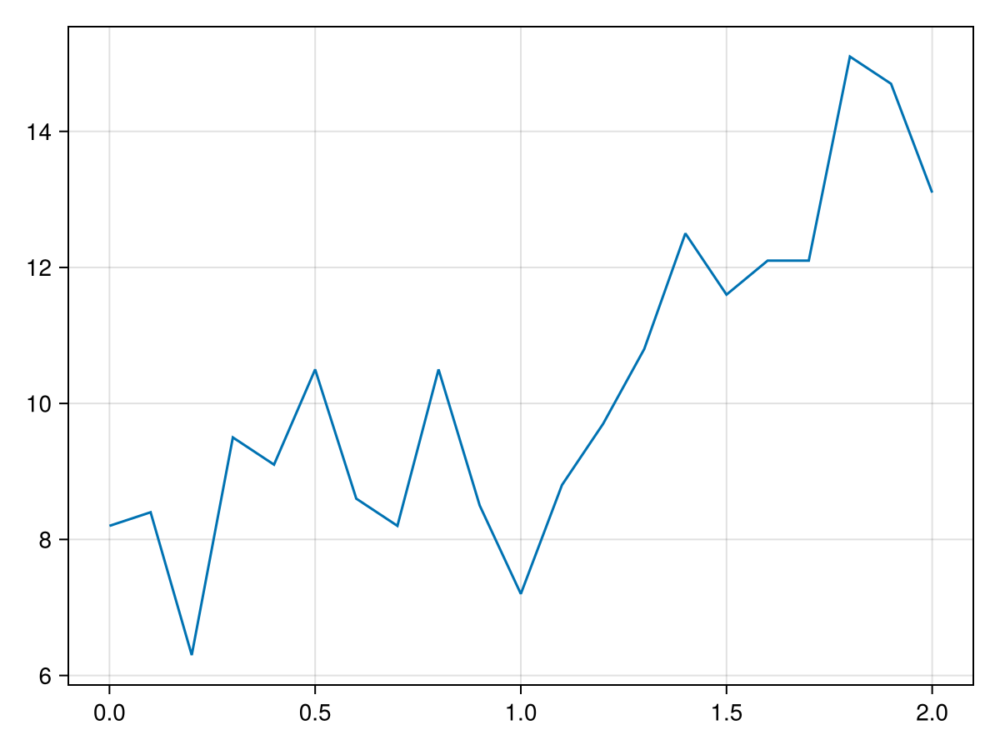
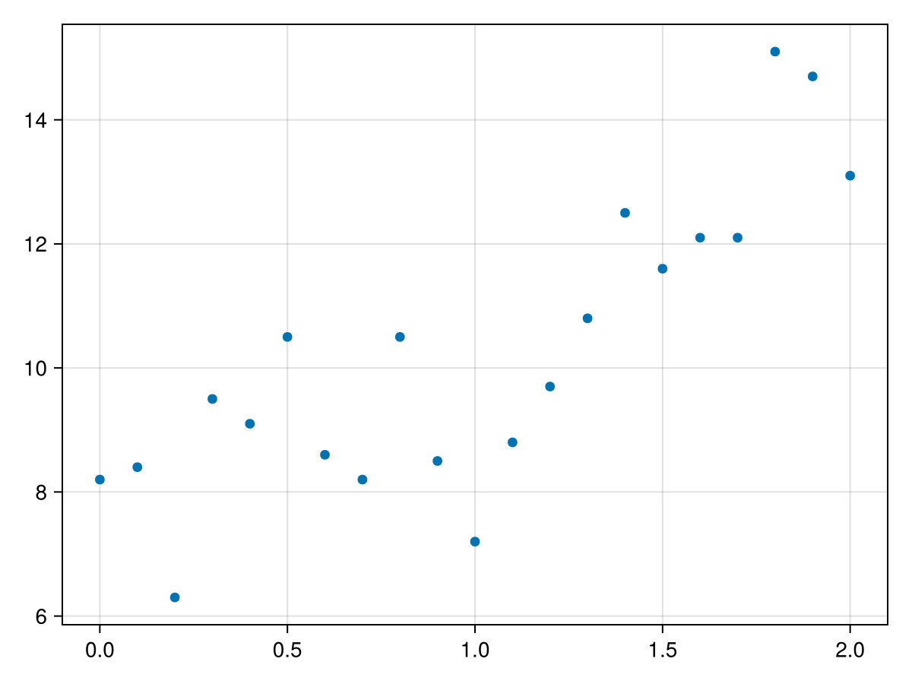
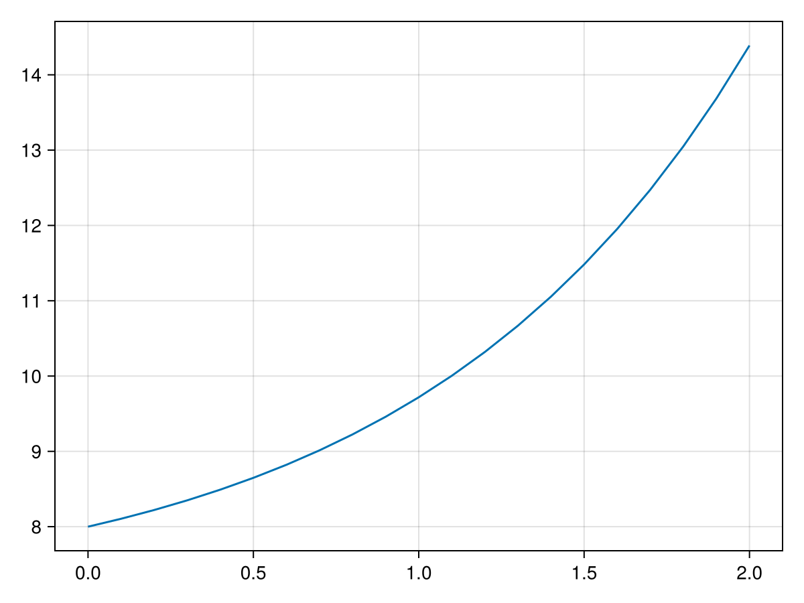
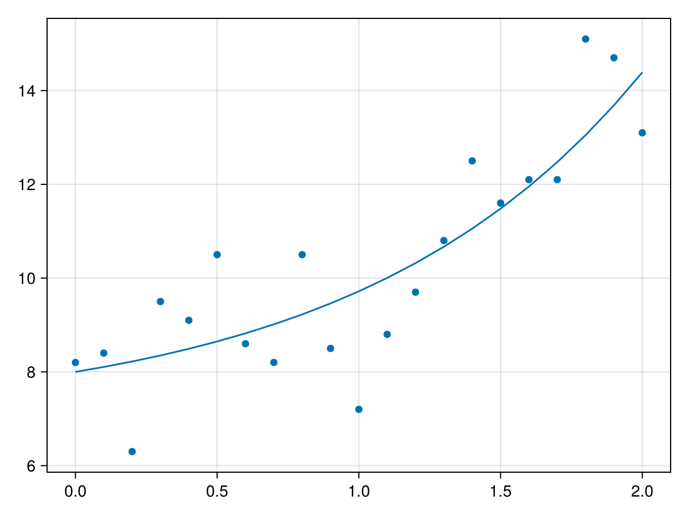
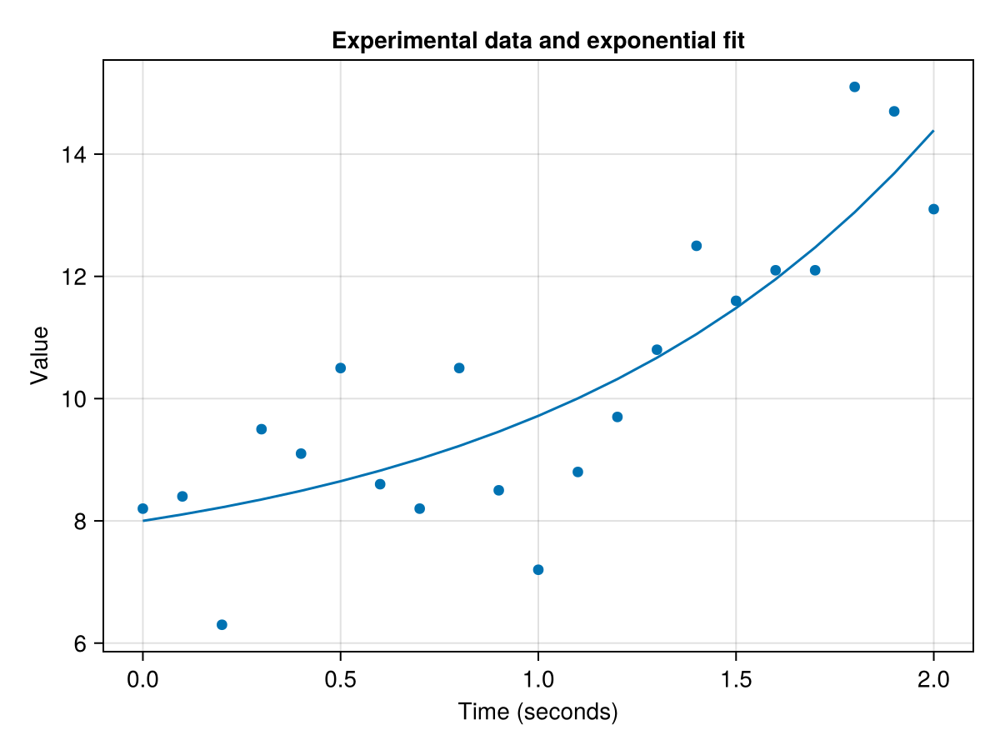
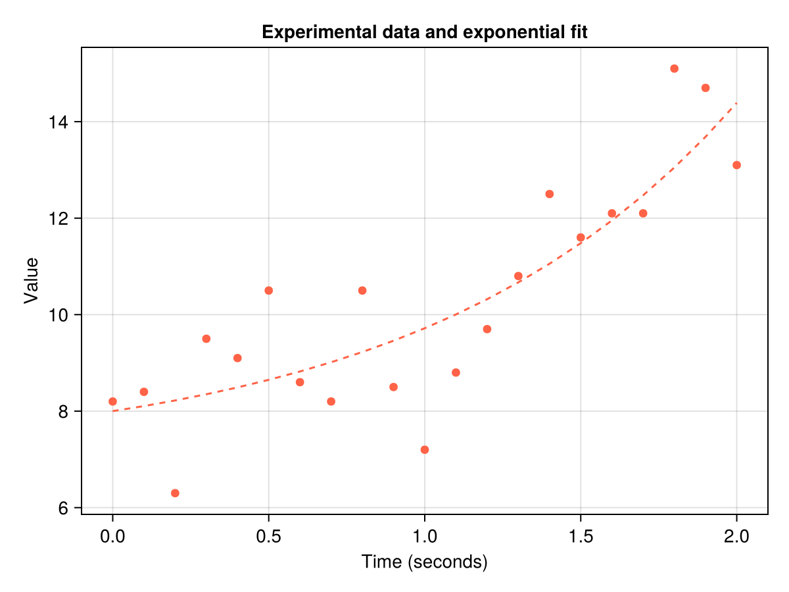
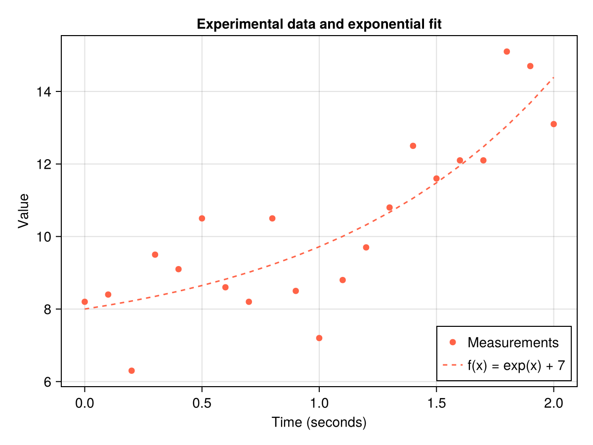

# Getting started {#Getting-started}

Welcome to Makie, the data visualization ecosystem for the Julia language!

This tutorial will show you how to get set up and create plots like this:


## Requirements {#Requirements}

You only need an internet connection and a reasonably recent Julia installation. If you don&#39;t have Julia installed, yet, follow the directions at [julialang.org/downloads/](https://julialang.org/downloads/).

Makie is available for Windows, Mac and Linux.

## Installation {#Installation}

We will be using the [CairoMakie](/explanations/backends/cairomakie#CairoMakie) package in this tutorial.

::: tip Info

Makie offers multiple [backend packages](/explanations/backends/backends#What-is-a-backend) that each have different strengths. CairoMakie is good at static 2D graphics and it should run on most computers as it uses only the CPU and does not need a GPU.

:::

First, create a new folder somewhere on your system and call it `makie_tutorial`. We are going to use that folder to install CairoMakie and to save plots.

Now, start Julia, for example by executing the command `julia` in a terminal.

In the Julia REPL (the **R**ead-**E**val-**P**rint-**L**oop which is what Julia&#39;s command line interface is called), change the active working directory to the `makie_tutorial` folder by executing this command, but be sure to replace the path with the location where you created the `makie_tutorial` folder:

```julia
cd("path/to/the/folder/makie_tutorial")
```


Now, make the `Pkg` package manager library available

```julia
using Pkg
```


Next, activate the current directory, also called `"."` (this means our `makie_tutorial` folder), as a Pkg environment:

```julia
Pkg.activate(".")
```


Now, we can install CairoMakie and all its dependencies by running:

```julia
Pkg.add("CairoMakie")
```


This command will probably take a while to finish. You will need an internet connection so all the necessary files can be downloaded.

After this process has completed, you should find a `Project.toml` and a `Manifest.toml` file in the `makie_tutorial` folder. Those files describe the new environment, the downloaded packages are stored somewhere else, in a central, shared location.

If everything has worked, you should be able to load CairoMakie now:

```julia
using CairoMakie
```


Congratulations, now we can start plotting!

## Plotting {#Plotting}

Run these two lines to make the &quot;data&quot; for our first plot available in your Julia session. It represents some imaginary measurements made over the span of two seconds.

```julia
seconds = 0:0.1:2
measurements = [8.2, 8.4, 6.3, 9.5, 9.1, 10.5, 8.6, 8.2, 10.5, 8.5, 7.2,
        8.8, 9.7, 10.8, 12.5, 11.6, 12.1, 12.1, 15.1, 14.7, 13.1]
```


Let&#39;s have a first look at this data as a line plot. Line plots are created with the [lines](/reference/plots/lines#lines) function in Makie.
<a id="example-eab3881" />


```julia
lines(seconds, measurements)
```




::: tip Info

Returning `lines(seconds, measurements)` in the REPL should show you the plot in some form. Which form it is depends on the context in which you have your Julia REPL running.

If you are in an IDE like VSCode with the Julia extension installed, the plot pane might have opened. If no other display is found, your OS&#39;s image viewing application or a browser should show the image.

:::

Let&#39;s try another plot function, to show each data point as a separate marker. The right function for that is [scatter](/reference/plots/scatter#scatter).
<a id="example-b2e288c" />


```julia
scatter(seconds, measurements)
```




Our goal is to show the measurement data together with a line representing an exponential fit. Let us pretend that the function we have &quot;fit&quot; is `f(x) = exp(x) + 7`. We can plot it as a line like this:
<a id="example-bf40092" />


```julia
lines(seconds, exp.(seconds) .+ 7)
```




Now, we&#39;d like to have the scatter and lines plots layered on top of each other.

You can plot into an existing axis with plotting functions that end with a `!`:
<a id="example-a9797fc" />


```julia
scatter(seconds, measurements)
lines!(seconds, exp.(seconds) .+ 7)
current_figure()
```




## Figure and Axis {#Figure-and-Axis}

So far, we have used two important objects in Makie only implicitly, the [Figure](/explanations/figure#Figures) and the [Axis](/reference/blocks/axis#Axis).

The `Figure` is the outermost container object. And an `Axis` is one type of axis object that can contain plots. An `Axis` can be placed in a `Figure` and then be plotted into. Let&#39;s try the previous plot with this system:
<a id="example-10c7a7f" />


```julia
f = Figure()
ax = Axis(f[1, 1])
scatter!(ax, seconds, measurements)
lines!(ax, seconds, exp.(seconds) .+ 7)
f
```


Both `scatter!` and `lines!` now explicitly plot into an `Axis` which we put into a `Figure`. `Axis(f[1, 1])` means that we put the `Axis` at the `Figure`&#39;s layout at position row 1, column 1.

We can now give our `Axis` a title, as well as x and y axis labels:
<a id="example-f60d465" />


```julia
f = Figure()
ax = Axis(f[1, 1],
    title = "Experimental data and exponential fit",
    xlabel = "Time (seconds)",
    ylabel = "Value",
)
scatter!(ax, seconds, measurements)
lines!(ax, seconds, exp.(seconds) .+ 7)
f
```




## Plot styling {#Plot-styling}

Plotting functions take many different style attributes as keyword arguments. Let&#39;s change the color of both plots to a red called `:tomato`, and the line style to `:dash`:
<a id="example-5f20f29" />


```julia
f = Figure()
ax = Axis(f[1, 1],
    title = "Experimental data and exponential fit",
    xlabel = "Time (seconds)",
    ylabel = "Value",
)
scatter!(ax, seconds, measurements, color = :tomato)
lines!(ax, seconds, exp.(seconds) .+ 7, color = :tomato, linestyle = :dash)
f
```




## Legend {#Legend}

The last element we&#39;re missing is the legend. One way to create a legend is by labelling plots with the `label` keyword and using the [`axislegend`](/api#Makie.axislegend-Tuple{Any,%20Vararg{Any}}) function:
<a id="example-5060ff4" />


```julia
f = Figure()
ax = Axis(f[1, 1],
    title = "Experimental data and exponential fit",
    xlabel = "Time (seconds)",
    ylabel = "Value",
)
scatter!(
    ax,
    seconds,
    measurements,
    color = :tomato,
    label = "Measurements"
)
lines!(
    ax,
    seconds,
    exp.(seconds) .+ 7,
    color = :tomato,
    linestyle = :dash,
    label = "f(x) = exp(x) + 7",
)
axislegend(position = :rb)
f
```




## Saving a Figure {#Saving-a-Figure}

Once we are satisfied with our plot, we can save it to a file using the [`save`](/api#FileIO.save-Tuple{String,%20Union{Figure,%20Makie.FigureAxisPlot,%20Scene}}) function. The most common formats are `png` for images and `svg` or `pdf` for vector graphics:

```julia
save("first_figure.png", f)
save("first_figure.svg", f)
save("first_figure.pdf", f)
```


You should now find the three files in your `makie_tutorial` folder.
