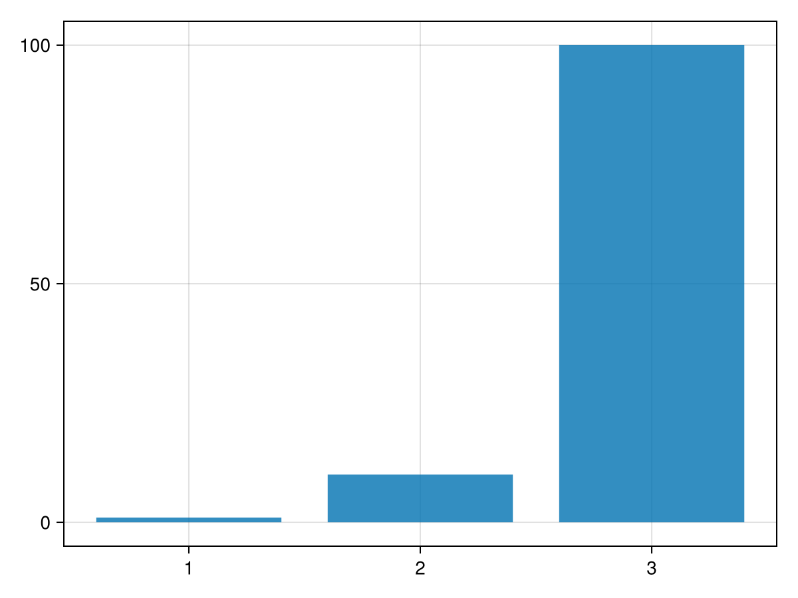
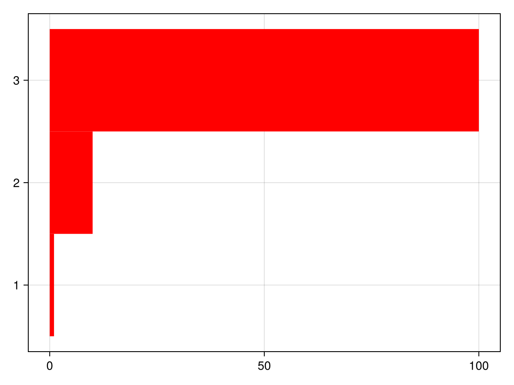

# Wrapping existing recipes for new types {#Wrapping-existing-recipes-for-new-types}

## Introduction {#Introduction}

There are multiple ways one can extend the functionalities of Makie, for example, user can define a totally new plot type from scratch. Another common use case is to &quot;teach&quot; Makie how to draw user-defined data structure for different existing recipes.

In this tutorial, we will show you how to teach Makie to plot our custom data type `MyHist` that is a simplified histogram type.

To define recipes, one only needs to use `MakieCore.jl`, this is especially handy when you&#39;re a package developer and want to avoid depend on the full Makie.jl. For demonstration purpose, this tutorial will use `CairoMakie.jl` to visualize things as we go.

```julia
using MakieCore, CairoMakie

struct MyHist
    bincounts
    bincenters
end
```


Our target type is the `MyHist`, which has two fields, as defined above. Roughly speaking, when we plot a histograms, we&#39;re talking about drawing a bar plot, where `bincenters` tells us where to draw these bars and `bincounts` tells us how high each bar is.

## BarPlot recipe – extend `Makie.convert_arguments` {#BarPlot-recipe-–-extend-Makie.convert_arguments}

The first recipe we want to teach Makie to draw is `BarPlot()`. As we allured to before, the two fields we have in the `MyHist` type basically tell us how to draw it as a BarPlot. Makie exposes the following method for this type of customization:

```julia
Makie.convert_arguments(P::Type{<:BarPlot}, h::MyHist) = convert_arguments(P, h.bincenters, h.bincounts)
```

<a id="example-c871eb8" />


```julia
h = MyHist([1, 10, 100], 1:3)

barplot(h)
```


## Hist recipe – override `Makie.plot!` {#Hist-recipe-–-override-Makie.plot!}

The second recipe we want to customize for our `MyHist` type is the `Hist()` recipe. This cannot be achieved by `convert_arguments` as we did for `BarPlot()`, because normally `Makie.hist()` takes raw data as input, but we already have the binned data in our `MyHist` type.

The first thing one might try is to override the `plot!` method for `Hist` recipe:
<a id="example-29be8cd" />


```julia
function Makie.plot!(plot::Hist{<:Tuple{<:MyHist}})
    barplot!(plot, plot[1])
    plot
end
h = MyHist([1, 10, 100], 1:3)
hist(h; color=:red, direction=:x)
```




This almost works, but we see that the keyword arguments are not passed to the `barplot!` function. To handle these attributes properly, we need to override/merge the default attributes of the underlying plot type (in this case, `BarPlot`) with the user-passed attributes. Since Makie 0.21, `shared_attributes` was introduced for this use case, which extracts all valid attributes for the target plot type:
<a id="example-c522f8d" />


```julia
function Makie.plot!(plot::Hist{<:Tuple{<:MyHist}})
    # Only forward valid attributes for BarPlot
    valid_attributes = Makie.shared_attributes(plot, BarPlot)
    barplot!(plot, valid_attributes, plot[1])
end
h = MyHist([1, 10, 100], 1:3)
hist(h; color=:red, direction=:x)
```



