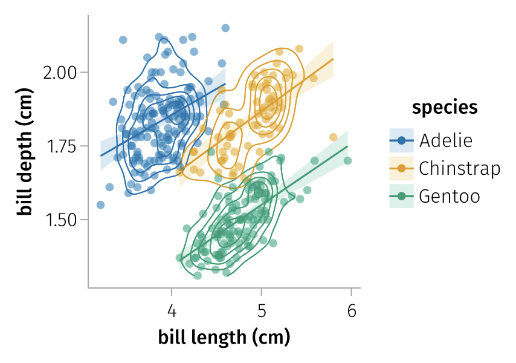
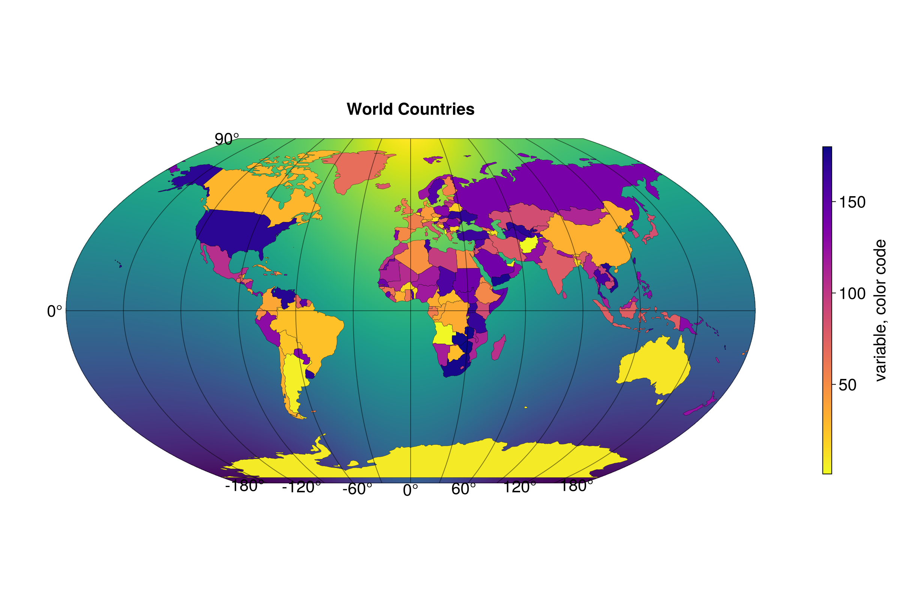
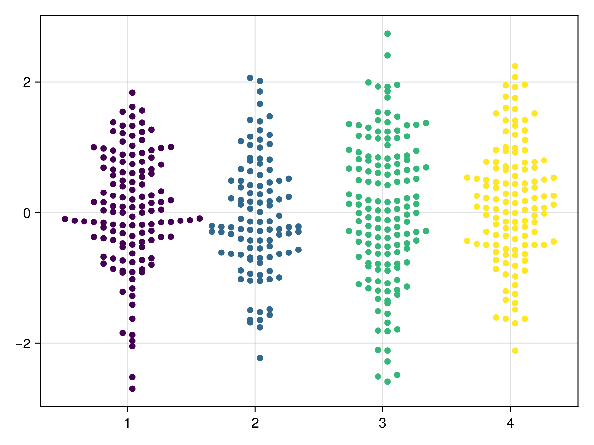

# Ecosystem

These packages and sites are maintained by third parties. If you install packages, keep an eye on version conflicts or downgrades as the Makie ecosystem is developing quickly so things break occasionally.

## [AlgebraOfGraphics.jl](https://github.com/MakieOrg/AlgebraOfGraphics.jl)

Grammar-of-graphics style plotting, inspired by ggplot2.

```@raw html

```

## [Beautiful Makie](https://beautiful.makie.org/dev/)

This third-party gallery contains many advanced examples.

```@raw html

```

## [GraphMakie.jl](https://github.com/MakieOrg/GraphMakie.jl)

Graphs with two- and three-dimensional layout algorithms.

```@raw html

```

## [GeoMakie.jl](https://github.com/MakieOrg/GeoMakie.jl)

Geographic plotting utilities including projections.

```@raw html

```

## [SwarmMakie.jl](https://github.com/MakieOrg/SwarmMakie.jl)

Beeswarm plots for Makie.jl! 

```@raw html

```
