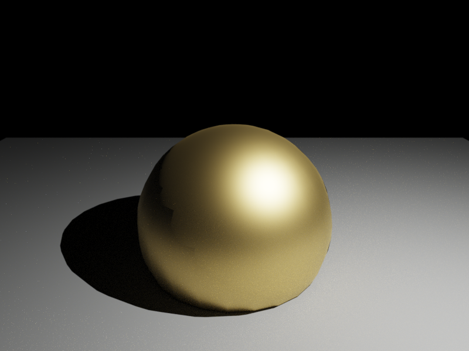
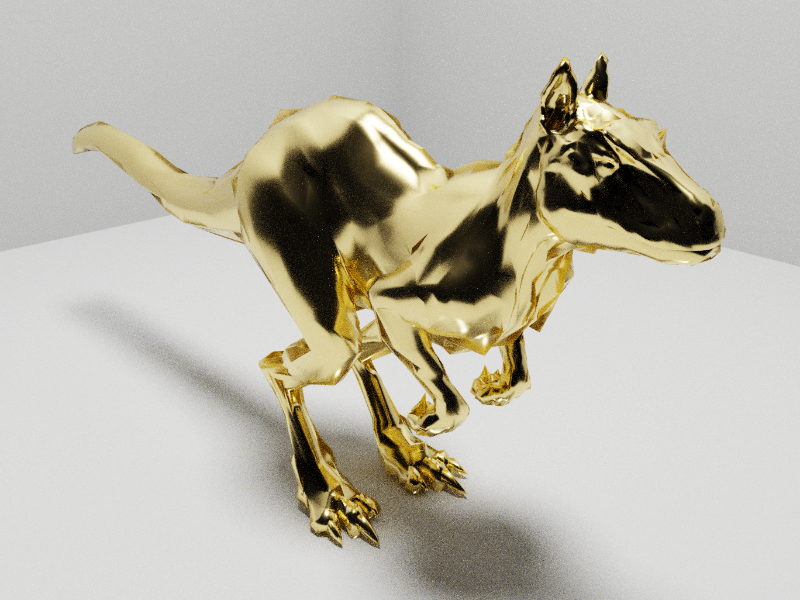
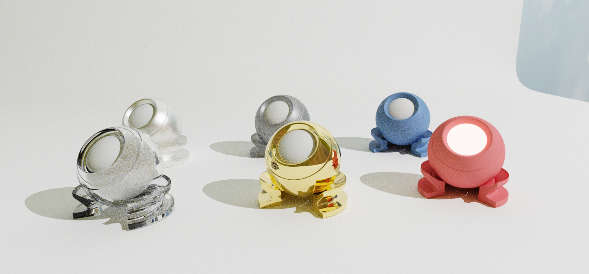
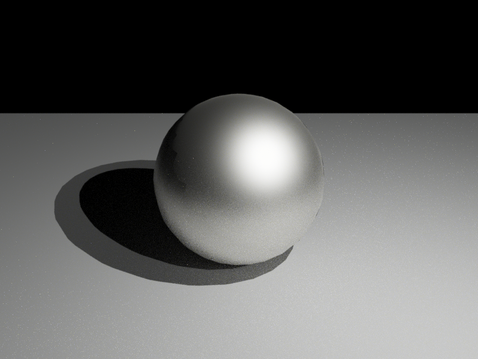
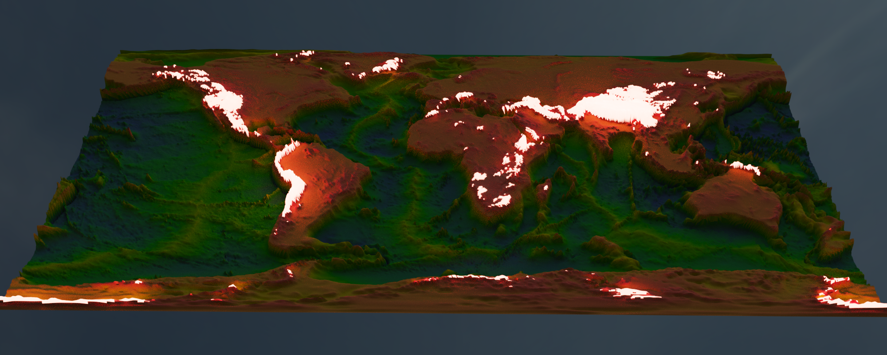
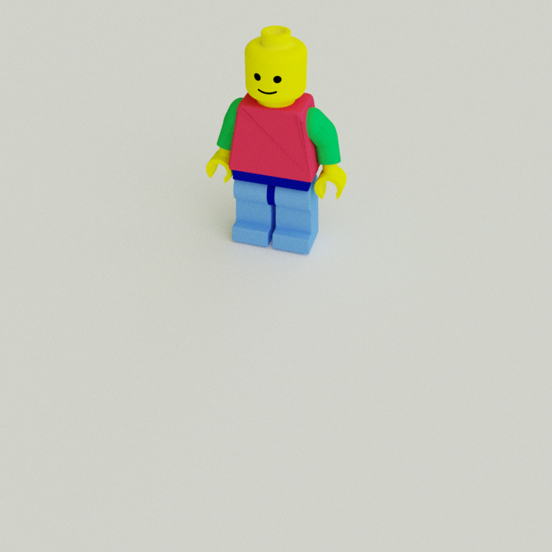
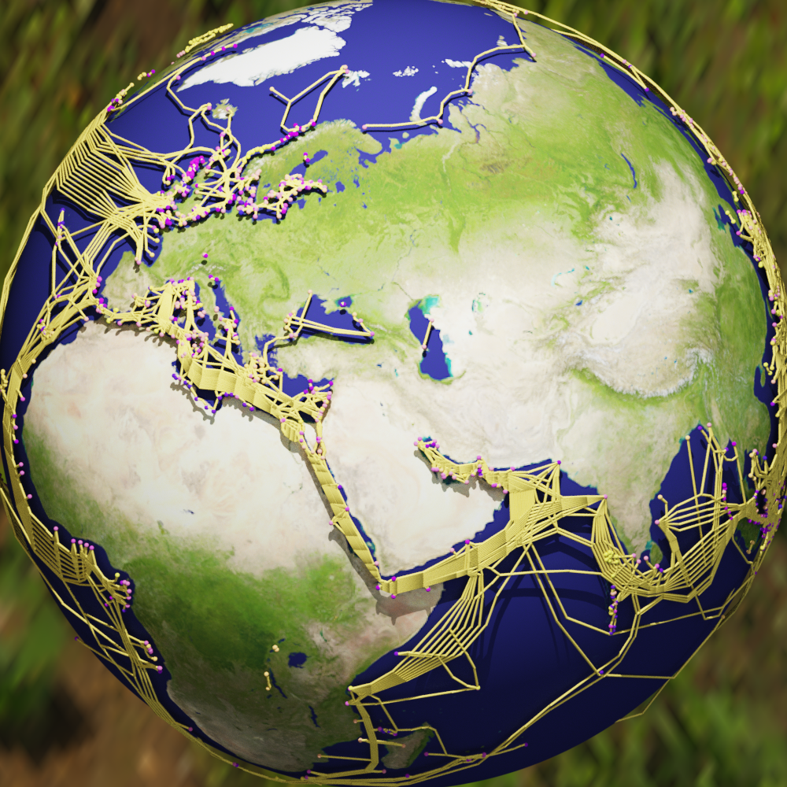

# RayMakie

RayMakie is a physically-based ray tracing backend for Makie, powered by [Hikari](https://github.com/SimonDanworpsers/Hikari.jl) -- a spectral wavefront path tracer matching [pbrt-v4](https://pbr-book.org/).

RayMakie runs on GPU via [Lava](https://github.com/SimonDanworpsers/Lava.jl) (Vulkan compute) and falls back to CPU via [KernelAbstractions.jl](https://github.com/JuliaGPU/KernelAbstractions.jl). It supports hardware ray tracing on AMD and NVIDIA GPUs.

## Getting started

```julia
using RayMakie

# RayMakie activates itself on import. Configure rendering:
RayMakie.activate!(
    exposure = 1.0,      # Exposure multiplier
    tonemap = :aces,     # Tonemapping (:aces, :reinhard, or nothing)
    gamma = 2.2,         # Gamma correction (nothing to disable)
)

# Create a scene with lights
scene = Scene(
    size = (800, 600);
    lights = [
        PointLight(RGBf(40, 40, 40), Vec3f(2, -1.5, 3)),
    ],
    ambient = RGBf(0.02, 0.02, 0.02),
)
cam3d!(scene)
update_cam!(scene, Vec3f(0, -4, 2), Vec3f(0, 0, 0.5), Vec3f(0, 0, 1))

# Add geometry with physically-based materials
mesh!(scene, Sphere(Point3f(0), 1f0); material = Hikari.Gold(roughness=0.05))

# Render
img = colorbuffer(scene)
save("gold_sphere.png", img)
```



Unlike rasterization backends, RayMakie produces physically accurate lighting including global illumination, caustics, and correct reflections/refractions.



## Activation and screen config

Activate the backend with `RayMakie.activate!()`:

```julia
# Default: GPU rendering with hardware ray tracing
RayMakie.activate!()

# Custom integrator settings
RayMakie.activate!(
    integrator = Hikari.VolPath(samples=64, max_depth=8),
    exposure = 1.5,
    tonemap = :aces,
    gamma = 2.2,
)

# CPU-only rendering (no GPU required)
using KernelAbstractions
RayMakie.activate!(device = KernelAbstractions.CPU())

# Enable AI denoising
RayMakie.activate!(denoise = true)
```

## Configuration options

| Option | Default | Description |
|--------|---------|-------------|
| `integrator` | `VolPath(hw_accel=true)` | Path tracing integrator |
| `exposure` | `1.0` | Exposure multiplier for HDR tonemapping |
| `tonemap` | `nothing` | Tonemapping operator (`:aces`, `:reinhard`, or `nothing`) |
| `gamma` | `nothing` | Gamma correction value (e.g. `2.2`) |
| `device` | `LavaBackend()` | Compute backend (GPU via Lava, or `CPU()`) |
| `denoise` | `false` | Enable AI denoising |
| `denoise_config` | `nothing` | Denoiser configuration (`Hikari.DenoiseConfig(...)`) |

## Materials

RayMakie uses Hikari's physically-based material system. Pass materials via the `material` keyword argument to `mesh!`, `surface!`, etc.

### Conductor presets

Hikari includes spectral IOR data for common metals:

```julia
# Polished metals
Hikari.Gold()
Hikari.Silver()
Hikari.Copper()
Hikari.Aluminum()

# Control roughness (0 = mirror, higher = matte)
Hikari.Gold(roughness=0.1)      # Brushed gold
Hikari.Silver(roughness=0.3)    # Matte silver
```

### Diffuse

```julia
# Lambertian diffuse
Hikari.Diffuse(Kd=(0.8, 0.2, 0.1))   # Red
Hikari.Diffuse(Kd=(0.5, 0.5, 0.5))   # Grey
```

### Dielectric (glass)

```julia
# Clear glass
Hikari.Dielectric(index=1.5)

# Frosted glass
Hikari.Dielectric(index=1.5, roughness=0.1)

# Diamond
Hikari.Dielectric(index=2.42)
```

### Mirror

```julia
Hikari.Mirror()                                  # Perfect mirror
Hikari.Mirror(Kr=(0.95, 0.93, 0.88))             # Gold-tinted
```

### Coated materials

```julia
# Clear-coated diffuse (car paint, varnished wood)
Hikari.CoatedDiffuse(reflectance=(0.8, 0.1, 0.1), roughness=0.05)

# Coated conductor (lacquered metal)
Hikari.CoatedConductor(roughness=0.05)
```

### Emissive (area lights)

```julia
# Emissive material for area lights
Hikari.Emissive(Le=(10, 10, 10), two_sided=true)
```

### Mix

```julia
# Blend between two materials
Hikari.MixMaterial(
    materials=(Hikari.Gold(), Hikari.Diffuse(Kd=(0.8, 0.1, 0.1))),
    amount=0.5,
)
```

## Materials showcase (materials.jl)

Hikari materials are plain Julia structs -- no context or material system needed.
This example uses the matball meshes shipped with Makie.

```julia
using RayMakie, GeometryBasics, FileIO

RayMakie.activate!(exposure=1.0, tonemap=:aces, gamma=2.2)

lights = [
    PointLight(RGBf(500, 500, 550), Vec3f(10, -10, 10)),
    DirectionalLight(RGBf(0.5, 0.5, 0.5), Vec3f(-1, 1, -1)),
]
scene = Scene(size=(1500, 700); lights=lights, ambient=RGBf(0.05, 0.05, 0.05))
cam3d!(scene)

matball_floor = load(assetpath("matball_floor.obj"))
matball_outer = load(assetpath("matball_outer.obj"))
matball_inner = load(assetpath("matball_inner.obj"))

mesh!(scene, matball_floor; color=:white)

materials = [
    Hikari.Dielectric(index=1.5)         Hikari.Silver(roughness=0.02);
    Hikari.Gold()                        Hikari.Dielectric(index=2.42, roughness=0.05);
    Hikari.Diffuse(Kd=(0.8, 0.2, 0.2))  Hikari.CoatedDiffuse(reflectance=(0.3, 0.5, 0.8), roughness=0.1);
]

for i in CartesianIndices(materials)
    x, y = Tuple(i)
    mat = materials[i]
    v = Vec3f(((x, y) .- (0.5 .* size(materials)) .- 0.5)..., 0)
    offset = 0.9 .* (v .- Vec3f(0, 3, 0))
    p_outer = mesh!(scene, matball_outer; material=mat)
    translate!(p_outer, offset)
    p_inner = mesh!(scene, matball_inner; material=Hikari.Diffuse(Kd=(0.8, 0.8, 0.8)))
    translate!(p_inner, offset)
end

cam = cameracontrols(scene)
cam.eyeposition[] = Vec3f(-0.3, -5.5, 0.9)
cam.lookat[] = Vec3f(0.5, 0, -0.5)
cam.upvector[] = Vec3f(0, 0, 1)
cam.fov[] = 35

img = colorbuffer(scene)
save("materials.png", img)
```



## Lighting

RayMakie supports all Makie light types with physically correct behavior:

- **PointLight**: Point light source, intensity encoded in RGB color values
- **DirectionalLight**: Distant parallel light (sun-like)
- **SpotLight**: Cone-shaped light with falloff
- **AmbientLight**: Uniform fill light
- **EnvironmentLight**: HDR environment map for image-based lighting
- **SunSkyLight**: Physically-based atmospheric sun and sky model
- Area lights via emissive meshes

```julia
using RayMakie, FileIO

scene = Scene(size=(800, 600);
    lights=[
        PointLight(RGBf(40, 40, 40), Vec3f(2, -2, 3)),
        DirectionalLight(RGBf(0.5, 0.5, 0.5), Vec3f(-1, 1, -1)),
    ],
    ambient=RGBf(0.01, 0.01, 0.01))
cam3d!(scene)

mesh!(scene, Sphere(Point3f(0), 1f0); material=Hikari.Silver(roughness=0.05))
mesh!(scene, Rect3f(Vec3f(-5, -5, -1.01), Vec3f(10, 10, 0.02));
    material=Hikari.Diffuse(Kd=(0.5, 0.5, 0.5)))

img = colorbuffer(scene)
```



### Environment lighting

For the most realistic results, use an HDR environment map:

```julia
using RayMakie, FileIO

env_img = load("studio.exr")  # Any HDR environment map
scene = Scene(size=(800, 600);
    lights=[EnvironmentLight(1.0, env_img)])
cam3d!(scene)

mesh!(scene, Sphere(Point3f(0), 1f0); material=Hikari.Gold(roughness=0.02))
img = colorbuffer(scene)
```

## Volumetric rendering

RayMakie supports participating media (fog, smoke, clouds) through Hikari's volume path tracer:

```julia
using RayMakie

scene = Scene(size=(512, 512);
    lights=[PointLight(RGBf(40, 40, 40), Vec3f(2, -2, 3))],
    ambient=RGBf(0.02, 0.02, 0.02))
cam3d!(scene)

# Add a sphere with subsurface scattering medium
mesh!(scene, Sphere(Point3f(0), 1f0);
    material=Hikari.MediumInterface(
        Hikari.Dielectric(index=1.5);
        inside=Hikari.HomogeneousMedium(sigma_a=(1,0.1,0.1), sigma_s=(5,5,5))))

img = colorbuffer(scene)
```

## Earth topography with emissive peaks (earth_topography.jl)

Mountain peaks glow using a per-pixel emissive texture combined with a colormap.
When passing a `MediumInterface` with `emission` as `material`, RayMakie automatically
merges the colormap into the base material's diffuse texture.

```julia
using NCDatasets, RayMakie, FileIO

dataset = NCDatasets.Dataset("ETOPO1_halfdegree.nc")
lon = dataset["lon"][:]
lat = dataset["lat"][:]
data = Float32.(dataset["ETOPO1avg"][:, :])
mini, maxi = extrema(data)
data_normed = ((data .- mini) ./ (maxi - mini))

# Emission texture: peaks above 70% elevation glow warm orange
emission_img = map(data_normed) do v
    v < 0.7f0 ? RGBf(0, 0, 0) : RGBf(v * 10, v * 2, v * 1.5)
end

RayMakie.activate!(exposure=1.0, tonemap=:aces, gamma=2.2)

env_img = load(Makie.assetpath("sunflowers_1k.hdr"))
lights = [
    EnvironmentLight(0.3, rotl90(env_img')),
    PointLight(RGBf(100, 100, 100), Vec3f(0, 100, 100)),
]
scene = Scene(size=(2000, 800); lights=lights, ambient=RGBf(0.01, 0.01, 0.01))
cam3d!(scene)

surface!(scene, lon, lat, data_normed .* 20;
    colormap=[:black, :midnightblue, :darkgreen, :olive, :brown, :tan, :white],
    colorrange=(0.0, 1.0) .* 20,
    material=Hikari.MediumInterface(
        Hikari.Diffuse(Kd=(0.5, 0.5, 0.5));
        emission=Hikari.Emissive(Le=emission_img, scale=1.0, two_sided=true)))

cam = cameracontrols(scene)
cam.eyeposition[] = Vec3f(3, -300, 300)
cam.lookat[] = Vec3f(0, 0, 0)
cam.upvector[] = Vec3f(0, 0, 1)
cam.fov[] = 23

save("topographie.png", scene)
```



## Animations (lego.jl)

Translations, camera and other observables can be animated with Makie's standard `record` API.

```julia
using MeshIO, FileIO, GeometryBasics, RayMakie

colors = Dict(
    "eyes" => "#000", "belt" => "#000059", "arm" => "#009925",
    "leg" => "#3369E8", "torso" => "#D50F25", "head" => "yellow", "hand" => "yellow",
)
origins = Dict(
    "arm_right" => Point3f(0.1427, -6.2127, 5.7342),
    "arm_left" => Point3f(0.1427, 6.2127, 5.7342),
    "leg_right" => Point3f(0, -1, -8.2),
    "leg_left" => Point3f(0, 1, -8.2),
)
rotation_axes = Dict(
    "arm_right" => Vec3f(0, -0.9828, 0.1848),
    "arm_left" => Vec3f(0, 0.9828, 0.1848),
    "leg_right" => Vec3f(0, -1, 0),
    "leg_left" => Vec3f(0, 1, 0),
)

function plot_part!(scene, parent, name)
    m = load(assetpath("lego_figure_" * name * ".stl"))
    color = colors[split(name, "_")[1]]
    trans = Transformation(parent)
    origin = get(origins, name, nothing)
    if !isnothing(origin)
        m = GeometryBasics.mesh(m, position = m.position .- origin)
        translate!(trans, origin)
    else
        translate!(trans, -Makie.transformation(parent).translation[])
    end
    return mesh!(scene, m; color=color, transformation=trans)
end

function plot_lego_figure(s)
    fig = Dict()
    fig["torso"] = plot_part!(s, s, "torso")
    fig["head"] = plot_part!(s, fig["torso"], "head")
    fig["eyes_mouth"] = plot_part!(s, fig["head"], "eyes_mouth")
    fig["arm_right"] = plot_part!(s, fig["torso"], "arm_right")
    fig["hand_right"] = plot_part!(s, fig["arm_right"], "hand_right")
    fig["arm_left"] = plot_part!(s, fig["torso"], "arm_left")
    fig["hand_left"] = plot_part!(s, fig["arm_left"], "hand_left")
    fig["belt"] = plot_part!(s, fig["torso"], "belt")
    fig["leg_right"] = plot_part!(s, fig["belt"], "leg_right")
    fig["leg_left"] = plot_part!(s, fig["belt"], "leg_left")
    translate!(fig["torso"], 0, 0, 20)
    mesh!(s, Rect3f(Vec3f(-400, -400, -2), Vec3f(800, 800, 2)); color=:white)
    return fig
end

RayMakie.activate!(exposure=1.0, tonemap=:aces, gamma=2.2)

lights = [
    EnvironmentLight(1.5, rotl90(load(assetpath("sunflowers_1k.hdr"))')),
    PointLight(RGBf(500, 500, 550), Vec3f(50, 0, 200)),
]
s = Scene(size=(500, 500); lights=lights)
cam3d!(s)
c = cameracontrols(s)
c.near[] = 5; c.far[] = 1000
update_cam!(s, c, Vec3f(100, 30, 80), Vec3f(0, 0, -10))
figure = plot_lego_figure(s)

a1 = LinRange(0, 0.25pi, 10)
angles = [a1; reverse(a1[1:end-1]); -a1[2:end]; reverse(-a1[1:end-1])]
translations = LinRange(0, 50, length(angles))

Makie.record(s, "lego_walk.mp4", zip(translations, angles)) do (translation, angle)
    for name in ["arm_left", "arm_right", "leg_left", "leg_right"]
        rotate!(figure[name], rotation_axes[name], angle)
    end
    translate!(figure["torso"], translation, 0, 20)
end
```



## Earth with submarine cables

Cables are rendered as emissive tube geometry, since RayMakie ray-traces all geometry in 3D.

```julia
using GeoMakie, RayMakie, FileIO, Downloads, LinearAlgebra
using GeoMakie: GeoJSON

urlPoints = "https://www.submarinecablemap.com/api/v3/landing-point/landing-point-geo.json"
urlCables = "https://www.submarinecablemap.com/api/v3/cable/cable-geo.json"
landPoints = GeoJSON.read(seekstart(Downloads.download(urlPoints, IOBuffer())))
landCables = GeoJSON.read(seekstart(Downloads.download(urlCables, IOBuffer())))

function toCartesian(lon, lat; r = 1.02f0)
    Point3f(r * cosd(lat) * cosd(lon), r * cosd(lat) * sind(lon), r * sind(lat))
end

toPoints3D = [toCartesian(GeoJSON.coordinates(f.geometry)...) for f in landPoints]

# Build cable line segments
cable_lines = Vector{Point3f}[]
for feat in landCables
    feat.geometry === nothing && continue
    for seg in GeoJSON.coordinates(feat.geometry)
        length(seg) >= 2 && push!(cable_lines, [toCartesian(p...) for p in seg])
    end
end

# Convert lines to tube meshes (ray-traceable geometry)
function lines_to_tubes(line_segments; radius=0.003f0, segments=4)
    verts = Point3f[]; tris = TriangleFace{Int}[]
    for points in line_segments
        for i in 1:(length(points)-1)
            dir = Vec3f(points[i+1]) - Vec3f(points[i])
            len = norm(dir); len < 1e-8 && continue
            d = dir / len
            up = abs(dot(d, Vec3f(0,0,1))) < 0.99f0 ? Vec3f(0,0,1) : Vec3f(1,0,0)
            u = normalize(cross(d, up)); v = cross(d, u)
            off = length(verts)
            for p in (points[i], points[i+1]), j in 0:(segments-1)
                a = 2f0 * Float32(pi) * j / segments
                s, c = sincos(a)
                push!(verts, Point3f(Vec3f(p) + radius * (c * u + s * v)))
            end
            for j in 0:(segments-1)
                jn = mod(j+1, segments)
                push!(tris, TriangleFace{Int}(off+j+1, off+segments+j+1, off+jn+1))
                push!(tris, TriangleFace{Int}(off+jn+1, off+segments+j+1, off+segments+jn+1))
            end
        end
    end
    Mesh(verts, tris)
end

RayMakie.activate!(exposure=1.0, tonemap=:aces, gamma=2.2)
env_img = load(Makie.assetpath("sunflowers_1k.hdr"))
lights = [EnvironmentLight(0.5, rotl90(env_img')), PointLight(RGBf(30, 30, 30), Vec3f(1, 1, 3))]
scene = Scene(size=(1000, 1000); lights=lights, ambient=RGBf(0.01, 0.01, 0.01))
cam3d!(scene)

# Earth sphere
n = 128; theta = LinRange(0, pi, n); phi = LinRange(-pi, pi, 2n)
xe = [cos(p)*sin(t) for t in theta, p in phi]
ye = [sin(p)*sin(t) for t in theta, p in phi]
ze = [cos(t) for t in theta, p in phi]
surface!(scene, xe, ye, ze; color=load(Makie.assetpath("earth.png")))

# Cables as colored tubes
mesh!(scene, lines_to_tubes(cable_lines); color=RGBf(1.0, 0.8, 0.2))

# Landing points
meshscatter!(scene, toPoints3D; color=1:length(toPoints3D), markersize=0.005, colormap=:plasma)

cam = cameracontrols(scene)
cam.eyeposition[] = Vec3f(3, 3, 3)
cam.lookat[] = Vec3f(0, 0, 0)
cam.fov[] = 22

save("submarine_cables.png", scene)
```



## Converting pbrt scenes

RayMakie can load pbrt-v4 scene files and render them through the Makie pipeline, useful for testing and comparison:

```julia
using RayMakie

result = RayMakie.pbrt_to_makie("scene.pbrt")
RayMakie.activate!(exposure=1.0, tonemap=:aces, gamma=2.2)
img = colorbuffer(result.scene)
```

This exercises the exact same conversion path a user would hit when building scenes with Makie's API, making it useful for validating that light and material values produce correct results.

## Differences from other backends

| Feature | GLMakie | RayMakie |
|---------|---------|----------|
| Rendering | Real-time rasterization | Offline path tracing |
| Global illumination | No | Yes |
| Reflections | Screen-space only | Physically correct |
| Refractions | No | Yes (with caustics) |
| Shadows | Shadow mapping | Ray-traced (soft) |
| Materials | Phong/Blinn-Phong | Physically-based (pbrt-v4) |
| Performance | Interactive (60fps+) | Seconds per frame |
| GPU support | OpenGL | Vulkan compute + HW RT |

## Migrating from RPRMakie

RayMakie replaces the experimental RPRMakie backend. Key differences:

| RPRMakie | RayMakie |
|----------|----------|
| `RPR.Chrome(matsys)` | `Hikari.Silver(roughness=0.02)` or `Hikari.Conductor(...)` |
| `RPR.Glass(matsys)` | `Hikari.Dielectric(index=1.5)` |
| `RPR.DiffuseMaterial(matsys)` | `Hikari.Diffuse(Kd=...)` |
| `RPR.SurfaceGoldX(matsys)` | `Hikari.Gold()` |
| `RPR.EmissiveMaterial(matsys)` | `Hikari.Emissive(Le=...)` |
| `RPR.Plastic(matsys)` | `Hikari.CoatedDiffuse(...)` |
| `RPR.UberMaterial(matsys)` | Use specific material type |
| `RPRMakie.Screen(scene; iterations=N)` | `RayMakie.activate!(integrator=VolPath(samples=N))` |
| `LScene(fig[1,1]; scenekw=(lights=...,))` | `Scene(size=...; lights=...)` |
| `RPRMakie.replace_scene_rpr!(...)` | Not needed (RayMakie renders directly) |

RayMakie materials don't require a context or material system object. They are plain Julia structs:

```julia
# RPRMakie (old):
screen = RPRMakie.Screen(scene; iterations=400, plugin=RPR.Northstar)
mat = RPR.Chrome(screen.matsys)
mesh!(ax, sphere; material=mat)

# RayMakie (new):
RayMakie.activate!(integrator=Hikari.VolPath(samples=64))
mesh!(scene, sphere; material=Hikari.Silver(roughness=0.02))
img = colorbuffer(scene)
```
