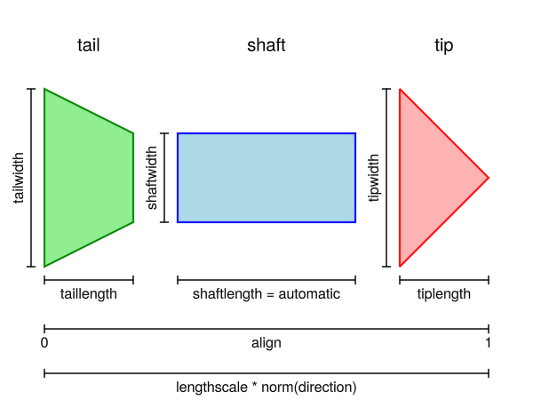

# arrows

Arrows are split into two plot types, `arrows2d` and `arrows3d`.
They differ in the arrow markers they create - `arrows2d` creates 2D arrows and `arrows3d` creates 3D arrows.
Both can be used with 2D and 3D coordinates.

```@shortdocs; canonical=false
arrows2d
```

```@shortdocs; canonical=false
arrows3d
```

## Examples

```@figure
f = Figure(size = (800, 800))
Axis(f[1, 1], backgroundcolor = "black")

xs = LinRange(0, 2pi, 20)
ys = LinRange(0, 3pi, 20)
us = [sin(x) * cos(y) for x in xs, y in ys]
vs = [-cos(x) * sin(y) for x in xs, y in ys]
strength = vec(sqrt.(us .^ 2 .+ vs .^ 2))

arrows2d!(xs, ys, us, vs, lengthscale = 0.2, color = strength)

f
```

```@figure backend=GLMakie
ps = [Point3f(x, y, z) for x in -5:2:5 for y in -5:2:5 for z in -5:2:5]
ns = map(p -> 0.1 * Vec3f(p[2], p[3], p[1]), ps)
arrows3d(
    ps, ns,
    shaftcolor = :gray, tipcolor = :black,
    align = :center, axis=(type=Axis3,)
)
```

```@figure backend=GLMakie
using LinearAlgebra

ps = [Point3f(x, y, z) for x in -5:2:5 for y in -5:2:5 for z in -5:2:5]
ns = map(p -> 0.1 * Vec3f(p[2], p[3], p[1]), ps)
lengths = norm.(ns)
arrows3d(
    ps, ns, color = lengths, lengthscale = 1.5,
    align = :center, axis=(type=Axis3,)
)
```

`arrows` can also take a function `f(x::Point{N})::Point{N}` which returns the arrow vector when given the arrow's origin.

```@figure
fig = Figure(size = (800, 800))
ax = Axis(fig[1, 1], backgroundcolor = "black")
xs = LinRange(0, 2pi, 20)
ys = LinRange(0, 3pi, 20)
# explicit method
us = [sin(x) * cos(y) for x in xs, y in ys]
vs = [-cos(x) * sin(y) for x in xs, y in ys]
strength = vec(sqrt.(us .^ 2 .+ vs .^ 2))
# function method
arrow_fun(x) = Point2f(sin(x[1])*cos(x[2]), -cos(x[1])*sin(x[2]))
arrows2d!(ax, xs, ys, arrow_fun, lengthscale = 0.3, color = strength)
fig
```

### Arrow Components & Details



#### Arrow Length

The target size of each arrow is determined by its direction vector (second plot argument), `normalize` and `lengthscale`.
From tail to tip, the length is given as `lengthscale * norm(direction)`.
If `normalize = true` the direction is normalized first, i.e. the length becomes just `lengthscale`.

There is also the option to treat the second plot argument as the arrows endpoint with `argmode = :endpoint`.
In this case the directions are determined as `direction = endpoint - startpoint` and then follow the same principles.

#### Scaling

Arrow markers are separated into 3 components, a tail, a shaft and a tip.
Each component comes with a length and width/radius (2D/3D) which determines its size.
In 2D the sizes are given in pixel units by default (dependent on `markerspace`).
In 3D they are given in relative units if `markerscale = automatic` (default) or data space units scaled by `markerscale` otherwise.
To fit arrows to the length determined by `directions`, `lengthscale` and `normalize`, the `shaftlength` varies between `minshaftlength` and `maxshaftlength` if it is not explicitly set.
Outside of this range or if it is explicitly set, all arrow lengths and widths/radii are scaled by a common factor instead.

#### Shapes

The base shape of each component is given by the `tail`, `shaft` and `tip` attributes.
For arrows2d these can be anything compatible with `poly`, e.g. a 2D mesh, Polygon or Vector of points.
Each component should be defined in a 0..1 x -0.5..0.5 range, where +x is the direction of the arrow.
The shape can also be constructed by a callback function `f(length, width, metrics)` returning something poly-compatible.
It is given the final length and width of the component as well as the all the other final lengths and widths through metrics.
For arrows3d they should be a mesh or GeometryPrimitive defined in a -0.5..0.5 x -0.5..0.5 x 0..1 range.
Here +z is the direction of the arrow.

#### Alignment

With `argmode = :direction` (default) arrows are aligned relative to the given positions (first argument).
If `align = :tail` (or 0) the arrow will start at the respective position, `align = :center` (0.5) will centered and with `align = :tip` (1.0) it will end at the position.
`align` can also take values outside the 0..1 range to create a gap between the position and the arrow marker.

If `argmode = :endpoint` alignment works differently and only takes effect if `normalize = true` or `lengthscale != 1`.
Here `align` determines a point `p = startpoint + align * (endpoint - startpoint)` which aligns with same fraction of the arrow marker.
So for example `align = 0.5` (:center) aligns the midpoint between the plot arguments with the midpoint of each arrow marker.
If the length of arrows is scaled down, this will create a matching gap on either side of the arrow.


```@figure
f = Figure(size = (500, 500))

a = Axis(f[1,1], aspect = DataAspect())
ps = [Point2f(cos(a), sin(a)) for a in range(0, 2pi, length=21)[1:end-1]]
scatter!(ps, marker = Circle, color = :transparent, strokewidth = 1)

# Double headed arrow between two points, filling half the distance with
# :center alignment
p = arrows2d!(
    ps, [ps[2:end]..., ps[1]], color = (:blue, 0.5),
    align = :center, lengthscale = 0.5, argmode = :endpoint,
    tail = Point2f[(0, 0), (1, -0.5), (1, 0.5)], taillength = 8
)

# arrow pointing away from ps with a 0.2 gap between the tail and ps
arrows2d!(
    ps, ps, color = eachindex(ps), align = -0.2,
    colormap = :rainbow, lengthscale = 0.5
)

# arrow pointing to ps with a 0.2 gap between the tip and ps
arrows2d!(
    ps, ps, color = eachindex(ps), align = 1.2,
    colormap = :rainbow, lengthscale = 0.5
)
f
```

```@figure
ps = Point2f.(1:5, 0)
vs = Vec2f.(0, 2 .^ (1:2:10))

fig = Figure()

ax = Axis(fig[1, 1], title = "Always scale, never elongate")
arrows2d!(ax, ps, vs, shaftlength = 16)
ax = Axis(fig[2, 1])
# x and y coordinates are on different scales, so radius (x) and length (y) are too
arrows3d!(ax, ps, vs, shaftlength = 50,
    tipradius = 0.1, tiplength = 20, shaftradius = 0.02)

ax = Axis(fig[1, 2], title = "Never scale, always elongate")
arrows2d!(ax, ps, vs, minshaftlength = 0)
ax = Axis(fig[2, 2])
arrows3d!(ax, ps, vs, minshaftlength = 0,
    markerscale = 1, tiplength = 30)

fig
```

## Attributes

### Arrows2D

```@attrdocs
Arrows2D
```

### Arrows3D

```@attrdocs
Arrows3D
```
