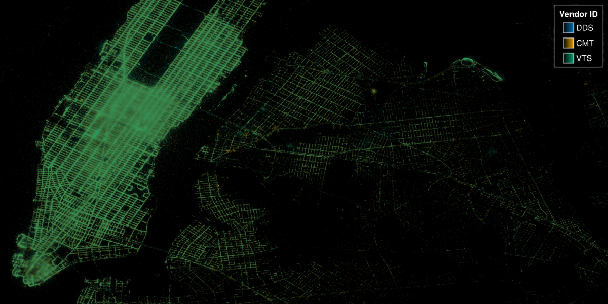

# datashader

```
f, ax, pl = datashader(args...; kw...) # return a new figure, axis, and plot
   ax, pl = datashader(f[row, col], args...; kw...) # creates an axis in a subfigure grid position
       pl = datashader!(ax::Union{Scene, AbstractAxis}, args...; kw...) # Creates a plot in the given axis or scene.
SpecApi.Datashader(args...; kw...) # Creates a SpecApi plot, which can be used in `S.Axis(plots=[plot])`.
```

## Examples

### Airports

```@figure backend=GLMakie
using DelimitedFiles

airports = Point2f.(eachrow(readdlm(assetpath("airportlocations.csv"))))
fig, ax, ds = datashader(airports,
    colormap=[:white, :black],
    # for documentation output we shouldn't calculate the image async,
    # since it won't wait for the render to finish and inline a blank image
    async = false,
    figure = (; figure_padding=0, size=(360*2, 160*2))
)
Colorbar(fig[1, 2], ds, label="Number of airports")
hidedecorations!(ax); hidespines!(ax)
fig
```

### Mean aggregation

The `AggMean` aggregation type requires `Point3`s where the mean is taken over the z values of all points that fall into the same x/y bin.

```@figure backend=GLMakie
with_z(p2) = Point3f(p2..., cos(p2[1]) * sin(p2[2]))
points = randn(Point2f, 100_000)
points_with_z = map(with_z, points)

f = Figure()
ax = Axis(f[1, 1], title = "AggMean")
datashader!(ax, points_with_z, agg = Makie.AggMean(), operation = identity)
ax2 = Axis(f[1, 2], title = "AggMean binsize = 3")
datashader!(ax2, points_with_z, agg = Makie.AggMean(), operation = identity, binsize = 3)
f
```

### Strange Attractors

```@figure backend=GLMakie
# Taken from Lazaro Alonso in Beautiful Makie:
# https://beautiful.makie.org/dev/examples/generated/2d/datavis/strange_attractors/?h=cliffo#trajectory
Clifford((x, y), a, b, c, d) = Point2f(sin(a * y) + c * cos(a * x), sin(b * x) + d * cos(b * y))

function trajectory(fn, x0, y0, kargs...; n=1000) #  kargs = a, b, c, d
    xy = zeros(Point2f, n + 1)
    xy[1] = Point2f(x0, y0)
    @inbounds for i in 1:n
        xy[i+1] = fn(xy[i], kargs...)
    end
    return xy
end

cargs = [[0, 0, -1.3, -1.3, -1.8, -1.9],
    [0, 0, -1.4, 1.6, 1.0, 0.7],
    [0, 0, 1.7, 1.7, 0.6, 1.2],
    [0, 0, 1.7, 0.7, 1.4, 2.0],
    [0, 0, -1.7, 1.8, -1.9, -0.4],
    [0, 0, 1.1, -1.32, -1.03, 1.54],
    [0, 0, 0.77, 1.99, -1.31, -1.45],
    [0, 0, -1.9, -1.9, -1.9, -1.0],
    [0, 0, 0.75, 1.34, -1.93, 1.0],
    [0, 0, -1.32, -1.65, 0.74, 1.81],
    [0, 0, -1.6, 1.6, 0.7, -1.0],
    [0, 0, -1.7, 1.5, -0.5, 0.7]
]

fig = Figure(size=(1000, 1000))
fig_grid = CartesianIndices((3, 4))
cmap = to_colormap(:BuPu_9)
cmap[1] = RGBAf(1, 1, 1, 1) # make sure background is white

let
    # locally, one can go pretty high with n_points,
    # e.g. 4*(10^7), but we don't want the docbuild to become too slow.
    n_points = 10^6
    for (i, arg) in enumerate(cargs)
        points = trajectory(Clifford, arg...; n=n_points)
        r, c = Tuple(fig_grid[i])
        ax, plot = datashader(fig[r, c], points;
            colormap=cmap,
            async=false,
            axis=(; title=join(string.(arg), ", ")))
        hidedecorations!(ax)
        hidespines!(ax)
    end
end
rowgap!(fig.layout,5)
colgap!(fig.layout,1)
fig
```

### Bigger examples

Timings in the comments are from running this on a 32gb Ryzen 5800H laptop. Both examples aren't fully optimized yet, and just use raw, unsorted, memory mapped Point2f arrays. In the future, we'll want to add acceleration structures to optimize access to sub-regions.

#### 14 million point NYC taxi dataset

```julia
using GLMakie, Downloads, Parquet2
bucket = "https://ursa-labs-taxi-data.s3.us-east-2.amazonaws.com"
year = 2009
month = "01"
filename = join([year, month, "data.parquet"], "/")
out = joinpath("$year-$month-data.parquet")
url = bucket * "/" * filename
Downloads.download(url, out)
# Loading ~1.5s
@time begin
    ds = Parquet2.Dataset(out)
    dlat = Parquet2.load(ds, "dropoff_latitude")
    dlon = Parquet2.load(ds, "dropoff_longitude")
    # One could use struct array here, but dlon/dlat are
    # a custom array type from Parquet2 supporting missing and some other things, which slows the whole thing down.
    # points = StructArray{Point2f}((dlon, dlat))
    points = Point2f.(dlon, dlat)
    groups = Parquet2.load(ds, "vendor_id")
end

# ~0.06s
@time begin
    f, ax, dsplot = datashader(points;
        colormap=:fire,
        axis=(; type=Axis, autolimitaspect = 1),
        figure=(;figure_padding=0, size=(1200, 600))
    )
    # Zoom into the hotspot
    limits!(ax, Rect2f(-74.175, 40.619, 0.5, 0.25))
    # make image fill the whole screen
    hidedecorations!(ax)
    hidespines!(ax)
    display(f)
end
```

```@raw html
<video mute autoplay loop playsinline controls src="/assets/datashader-14million.mp4" />
```

#### 2.7 billion OSM GPS points

Download the data from [OSM GPS points](https://planet.osm.org/gps/simple-gps-points-120604.csv.xz) and use the [updated script](https://gist.github.com/SimonDanisch/69788fce47c13020d9ae9dbe08546f89#file-datashader-2-7-billion-points-jl) from [drawing-2-7-billion-points-in-10s](https://medium.com/hackernoon/drawing-2-7-billion-points-in-10s-ecc8c85ca8fa) to convert the CSV to a binary blob that we can memory map.

```julia
using GLMakie, Mmap
path = "gpspoints.bin"

points = Mmap.mmap(open(path, "r"), Vector{Point2f});
# ~ 26s
@time begin
    f, ax, pl = datashader(
        points;
        # For a big dataset its interesting to see how long each aggregation takes
        show_timings = true,
        # Use a local operation which is faster to calculate and looks good!
        local_operation=x-> log10(x + 1),
        #=
            in the code we used to save the binary, we had the points in the wrong order.
            A good chance to demonstrate the `point_transform` argument,
            Which gets applied to every point before aggregating it
        =#
        point_transform=reverse,
        axis=(; type=Axis, autolimitaspect = 1),
        figure=(;figure_padding=0, size=(1200, 600))
    )
    hidedecorations!(ax)
    hidespines!(ax)
    display(f)
end
```

```
aggregation took 1.395s
aggregation took 1.176s
aggregation took 0.81s
aggregation took 0.791s
aggregation took 0.729s
aggregation took 1.272s
aggregation took 1.117s
aggregation took 0.866s
aggregation took 0.724s
```

```@raw html
<video mute autoplay loop playsinline controls src="/assets/datashader_2-7_billion.mp4" />
```

### Categorical Data

There are two ways to plot categorical data right now:

```julia
datashader(one_category_per_point, points)
datashader(Dict(:category_a => all_points_a, :category_b => all_points_b))
```

The type of the category doesn't matter, but will get converted to strings internally, to be displayed nicely in the legend. Categories are currently aggregated in one Canvas per category, and then overlaid with alpha blending.

```@figure backend=GLMakie
normaldist = randn(Point2f, 1_000_000)
ds1 = normaldist .+ (Point2f(-1, 0),)
ds2 = normaldist .+ (Point2f(1, 0),)
fig, ax, pl = datashader(Dict("a" => ds1, "b" => ds2); async = false)
hidedecorations!(ax)
fig
```

We can also reuse the previous NYC example for a categorical plot:

```julia
@time begin
    f = Figure(figure_padding=0, size=(1200, 600))
    ax = Axis(
        f[1, 1],
        autolimitaspect=1,
        limits=(-74.022, -73.827, 40.696, 40.793),
        backgroundcolor=:black
    )
    datashader!(ax, groups, points)
    hidedecorations!(ax)
    hidespines!(ax)
    # Create a styled legend
    axislegend("Vendor ID"; titlecolor=:white, framecolor=:grey, polystrokewidth=2, polystrokecolor=(:white, 0.5), rowgap=10, backgroundcolor=:black, labelcolor=:white)
    display(f)
end
```



### Advanced API

The `datashader` recipe makes it very simple to get started, and is also efficiently implemented so that most changes like `f, ax, pl = datashader(...); pl.colorrange=new_range; pl.operation=log10` won't redo the aggregation. But if you still need more manual control, one can also use the underlying `Canvas` API directly for more manual control:

See the [online documentation](https://docs.makie.org/stable/reference/plots/datashader) for rendered examples.

## Attributes

### `transparency`

**Default:** `false`

Adjusts how the plot deals with transparency. In GLMakie `transparency = true` results in using Order Independent Transparency.

### `alpha`

**Default:** `1.0`

The alpha value of the colormap or color attribute. Multiple alphas like in `plot(alpha=0.2, color=(:red, 0.5)`, will get multiplied.

### `colormap`

**Default:** `@inherit colormap :viridis`

Sets the colormap that is sampled for numeric `color`s. `PlotUtils.cgrad(...)`, `Makie.Reverse(any_colormap)` can be used as well, or any symbol from ColorBrewer or PlotUtils. To see all available color gradients, you can call `Makie.available_gradients()`.

### `visible`

**Default:** `true`

Controls whether the plot gets rendered or not.

### `point_transform`

**Default:** `identity`

Function which gets applied to every point before aggregating it.

### `local_operation`

**Default:** `identity`

Function which gets called on each element after the aggregation (`map!(x-> local_operation(x), final_aggregation_result)`).

### `space`

**Default:** `:data`

Sets the transformation space for box encompassing the plot. See `Makie.spaces()` for possible inputs.

### `inspector_hover`

**Default:** `automatic`

Sets a callback function `(inspector, plot, index) -> ...` which replaces the default `show_data` methods.

### `clip_planes`

**Default:** `@inherit clip_planes automatic`

Clip planes offer a way to do clipping in 3D space. You can set a Vector of up to 8 `Plane3f` planes here, behind which plots will be clipped (i.e. become invisible). By default clip planes are inherited from the parent plot or scene. You can remove parent `clip_planes` by passing `Plane3f[]`.

### `colorscale`

**Default:** `identity`

The color transform function. Can be any function, but only works well together with `Colorbar` for `identity`, `log`, `log2`, `log10`, `sqrt`, `logit`, `Makie.pseudolog10`, `Makie.Symlog10`, `Makie.AsinhScale`, `Makie.SinhScale`, `Makie.LogScale`, `Makie.LuptonAsinhScale`, and `Makie.PowerScale`.

### `async`

**Default:** `true`

Will calculate `get_aggregation` in a task, and skip any zoom/pan updates while busy. Great for interaction, but must be disabled for saving to e.g. png or when inlining in Documenter.

### `ssao`

**Default:** `false`

Adjusts whether the plot is rendered with ssao (screen space ambient occlusion). Note that this only makes sense in 3D plots and is only applicable with `fxaa = true`.

### `highclip`

**Default:** `automatic`

The color for any value above the colorrange.

### `method`

**Default:** `AggThreads()`

Can be `AggThreads()` or `AggSerial()` for threaded vs. serial aggregation.

### `inspector_label`

**Default:** `automatic`

Sets a callback function `(plot, index, position) -> string` which replaces the default label generated by DataInspector.

### `nan_color`

**Default:** `:transparent`

The color for NaN values.

### `agg`

**Default:** `AggCount{Float32}()`

Can be `AggCount()`, `AggAny()` or `AggMean()`. Be sure, to use the correct element type e.g. `AggCount{Float32}()`, which needs to accommodate the output of `local_operation`. User-extensible by overloading:

```julia
struct MyAgg{T} <: Makie.AggOp end
MyAgg() = MyAgg{Float64}()
Makie.Aggregation.null(::MyAgg{T}) where {T} = zero(T)
Makie.Aggregation.embed(::MyAgg{T}, x) where {T} = convert(T, x)
Makie.Aggregation.merge(::MyAgg{T}, x::T, y::T) where {T} = x + y
Makie.Aggregation.value(::MyAgg{T}, x::T) where {T} = x
```

### `interpolate`

**Default:** `false`

If the resulting image should be displayed interpolated. Note that interpolation can make NaN-adjacent bins also NaN in some backends, for example due to interpolation schemes used in GPU hardware. This can make it look like there are more NaN bins than there actually are.

### `overdraw`

**Default:** `false`

Controls if the plot will draw over other plots. This specifically means ignoring depth checks in GL backends

### `transformation`

**Default:** `:automatic`

Controls the inheritance or directly sets the transformations of a plot. Transformations include the transform function and model matrix as generated by `translate!(...)`, `scale!(...)` and `rotate!(...)`. They can be set directly by passing a `Transformation()` object or inherited from the parent plot or scene. Inheritance options include:

  * `:automatic`: Inherit transformations if the parent and child `space` is compatible
  * `:inherit`: Inherit transformations
  * `:inherit_model`: Inherit only model transformations
  * `:inherit_transform_func`: Inherit only the transform function
  * `:nothing`: Inherit neither, fully disconnecting the child's transformations from the parent

Another option is to pass arguments to the `transform!()` function which then get applied to the plot. For example `transformation = (:xz, 1.0)` which rotates the `xy` plane to the `xz` plane and translates by `1.0`. For this inheritance defaults to `:automatic` but can also be set through e.g. `(:nothing, (:xz, 1.0))`.

### `operation`

**Default:** `automatic`

Defaults to `Makie.equalize_histogram` function which gets called on the whole get*aggregation array before display (`operation(final*aggregation_result)`).

### `model`

**Default:** `automatic`

Sets a model matrix for the plot. This overrides adjustments made with `translate!`, `rotate!` and `scale!`.

### `depth_shift`

**Default:** `0.0`

Adjusts the depth value of a plot after all other transformations, i.e. in clip space, where `-1 <= depth <= 1`. This only applies to GLMakie and WGLMakie and can be used to adjust render order (like a tunable overdraw).

### `colorrange`

**Default:** `automatic`

The values representing the start and end points of `colormap`.

### `binsize`

**Default:** `1`

Factor defining how many bins one wants per screen pixel. Set to n > 1 if you want a coarser image.

### `show_timings`

**Default:** `false`

Set to `true` to show how long it takes to aggregate each frame.

### `inspectable`

**Default:** `@inherit inspectable`

Sets whether this plot should be seen by `DataInspector`. The default depends on the theme of the parent scene.

### `fxaa`

**Default:** `true`

Adjusts whether the plot is rendered with fxaa (fast approximate anti-aliasing, GLMakie only). Note that some plots implement a better native anti-aliasing solution (scatter, text, lines). For them `fxaa = true` generally lowers quality. Plots that show smoothly interpolated data (e.g. image, surface) may also degrade in quality as `fxaa = true` can cause blurring.

### `inspector_clear`

**Default:** `automatic`

Sets a callback function `(inspector, plot) -> ...` for cleaning up custom indicators in DataInspector.

### `lowclip`

**Default:** `automatic`

The color for any value below the colorrange.
