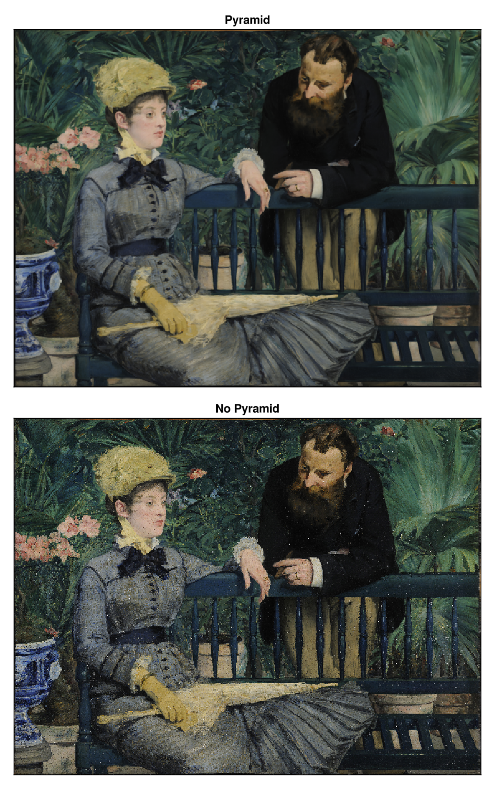

# heatmap

```@shortdocs; canonical=false
heatmap
```

## Examples

### Two vectors and a matrix

In this example, `x` and `y` specify the points around which the heatmap cells are placed.

```@figure
f = Figure()
ax = Axis(f[1, 1])

centers_x = 1:5
centers_y = 6:10
data = reshape(1:25, 5, 5)

heatmap!(ax, centers_x, centers_y, data)

scatter!(ax, [(x, y) for x in centers_x for y in centers_y], color=:white, strokecolor=:black, strokewidth=1)

f
```

The same approach works for irregularly spaced cells.
Note how the rectangles are not centered around the points, because the boundaries are between adjacent points like voronoi cells.

```@figure
f = Figure()
ax = Axis(f[1, 1])

centers_x = [1, 2, 4, 7, 11]
centers_y = [6, 7, 9, 12, 16]
data = reshape(1:25, 5, 5)

heatmap!(ax, centers_x, centers_y, data)

scatter!(ax, [(x, y) for x in centers_x for y in centers_y], color=:white, strokecolor=:black, strokewidth=1)
f
```

If we add one more element to `x` and `y`, they now specify the edges of the rectangular cells.
Here's a regular grid:

```@figure
f = Figure()
ax = Axis(f[1, 1])

edges_x = 1:6
edges_y = 7:12
data = reshape(1:25, 5, 5)

heatmap!(ax, edges_x, edges_y, data)

scatter!(ax, [(x, y) for x in edges_x for y in edges_y], color=:white, strokecolor=:black, strokewidth=1)
f
```

We can do the same with an irregular grid as well:

```@figure
f = Figure()
ax = Axis(f[1, 1])

borders_x = [1, 2, 4, 7, 11, 16]
borders_y = [6, 7, 9, 12, 16, 21]
data = reshape(1:25, 5, 5)

heatmap!(ax, borders_x, borders_y, data)
scatter!(ax, [(x, y) for x in borders_x for y in borders_y], color=:white, strokecolor=:black, strokewidth=1)
f
```

### Using a `Function` instead of a `Matrix`

When using a `Function` of the form `(i, j) -> v` as the `values` argument, it is evaluated over the grid spanned by `x` and `y`.

```@figure
function mandelbrot(x, y)
    z = c = x + y*im
    for i in 1:30.0; abs(z) > 2 && return i; z = z^2 + c; end; 0
end

heatmap(-2:0.001:1, -1.1:0.001:1.1, mandelbrot,
    colormap = Reverse(:deep))
```

### Three vectors

There must be no duplicate combinations of x and y, but it is allowed to leave out values.

```@figure
xs = [1, 2, 3, 1, 2, 3, 1, 2, 3]
ys = [1, 1, 1, 2, 2, 2, 3, 3, 3]
zs = [1, 2, 3, 4, 5, 6, 7, 8, NaN]

heatmap(xs, ys, zs)
```

### Colorbar for single heatmap

To get a scale for what the colors represent, add a colorbar. The colorbar is
placed within the figure in the first argument, and the scale and colormap can be
conveniently set by passing the relevant heatmap to it.

```@figure
xs = range(0, 2π, length=100)
ys = range(0, 2π, length=100)
zs = [sin(x*y) for x in xs, y in ys]

fig, ax, hm = heatmap(xs, ys, zs)
Colorbar(fig[:, end+1], hm)

fig
```

### Colorbar for multiple heatmaps

When there are several heatmaps in a single figure, it can be useful
to have a single colorbar represent all of them. It is important to then
have synchronized scales and colormaps for the heatmaps and colorbar. This is done by
setting the colorrange explicitly, so that it is independent of the data shown by
that particular heatmap.

Since the heatmaps in the example below have the same colorrange and colormap, any of them
can be passed to `Colorbar` to give the colorbar the same attributes. Alternatively,
the colorbar attributes can be set explicitly.

```@figure
xs = range(0, 2π, length=100)
ys = range(0, 2π, length=100)
zs1 = [sin(x*y) for x in xs, y in ys]
zs2 = [2sin(x*y) for x in xs, y in ys]

joint_limits = (-2, 2)  # here we pick the limits manually for simplicity instead of computing them

fig, ax1, hm1 = heatmap(xs, ys, zs1,  colorrange = joint_limits)
ax2, hm2 = heatmap(fig[1, end+1], xs, ys, zs2, colorrange = joint_limits)

Colorbar(fig[:, end+1], hm1)                     # These three
Colorbar(fig[:, end+1], hm2)                     # colorbars are
Colorbar(fig[:, end+1], colorrange = joint_limits)  # equivalent

fig
```


### Using a custom colorscale

One can define a custom (color)scale using the `ReversibleScale` type. When the transformation is simple enough (`log`, `sqrt`, ...), the inverse transform is automatically deduced.

```@figure
x = 10.0.^(1:0.1:4)
y = 1.0:0.1:5.0
z = broadcast((x, y) -> x - 10, x, y')

scale = ReversibleScale(x -> asinh(x / 2) / log(10), x -> 2sinh(log(10) * x))
fig, ax, hm = heatmap(x, y, z; colorscale = scale, axis = (; xscale = scale))
Colorbar(fig[1, 2], hm)

fig
```

## Plotting large Heatmaps

You can wrap your data into `Makie.Resampler`, to automatically resample large heatmaps only for the viewing area.
When zooming in, it will update the resampled version, to show it at best fidelity.
It blocks updates while any mouse or keyboard button is pressed, to not spam e.g. WGLMakie with data updates.
This goes well with `Axis(figure; zoombutton=Keyboard.left_control)`.
You can disable this behavior with:

`Resampler(data; update_while_button_pressed=true)`.


Example:

```julia
using Downloads, FileIO, GLMakie
# 30000×22943 image
path = Downloads.download("https://upload.wikimedia.org/wikipedia/commons/7/7e/In_the_Conservatory.jpg")
img = rotr90(load(path))
f, ax, pl = heatmap(Resampler(img); axis=(; aspect=DataAspect()), figure=(;size=size(img)./20))
hidedecorations!(ax)
f
```
```@raw html
<video mute autoplay loop playsinline controls src="/assets/heatmap-resampler.mp4" />
```

For better down sampling quality we recommend using `Makie.Pyramid` (might be moved to another package), which creates a simple gaussian pyramid for efficient and artifact free down sampling:

```julia
pyramid = Makie.Pyramid(img)
fsize = (size(img) ./ 30) .* (1, 2)
fig, ax, pl = heatmap(Resampler(pyramid);
    axis=(; aspect=DataAspect(), title="Pyramid"), figure=(; size=fsize))
hidedecorations!(ax)
ax, pl = heatmap(fig[2, 1], Resampler(img1);
    axis=(; aspect=DataAspect(), title="No Pyramid"))
hidedecorations!(ax)
save("heatmap-pyramid.png", fig)
```


Any other Array type is allowed in `Resampler`, and it may also implement it's own interpolation strategy by overloading:
```julia
function (array::ArrayType)(xrange::LinRange, yrange::LinRange)
    ...
end
```

## Attributes

```@attrdocs
Heatmap
```
