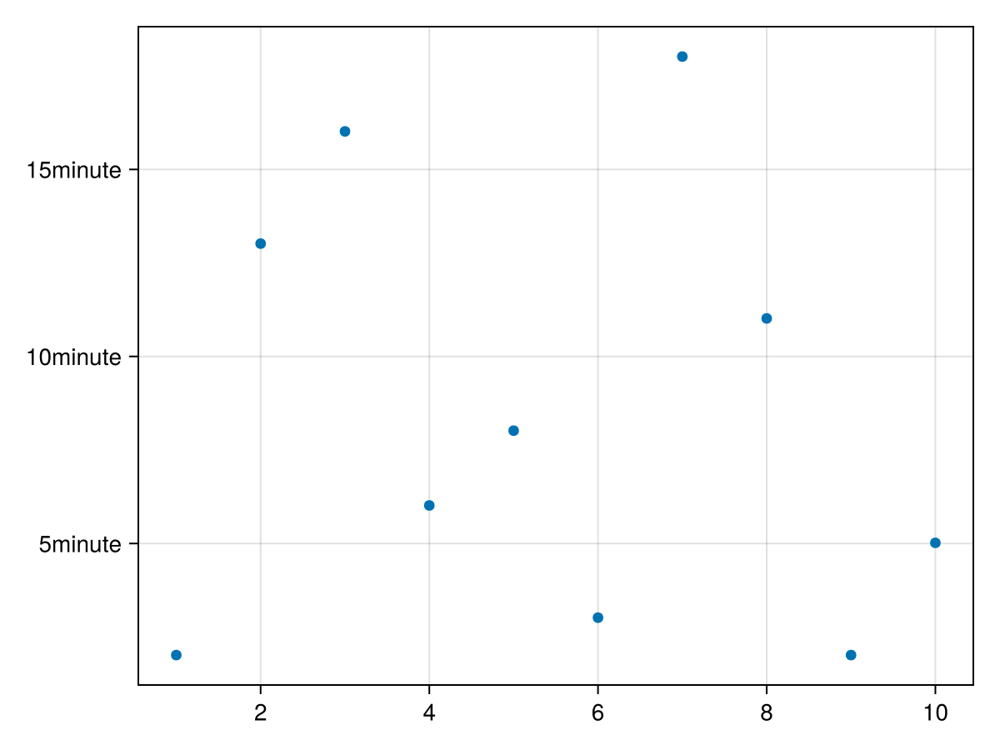
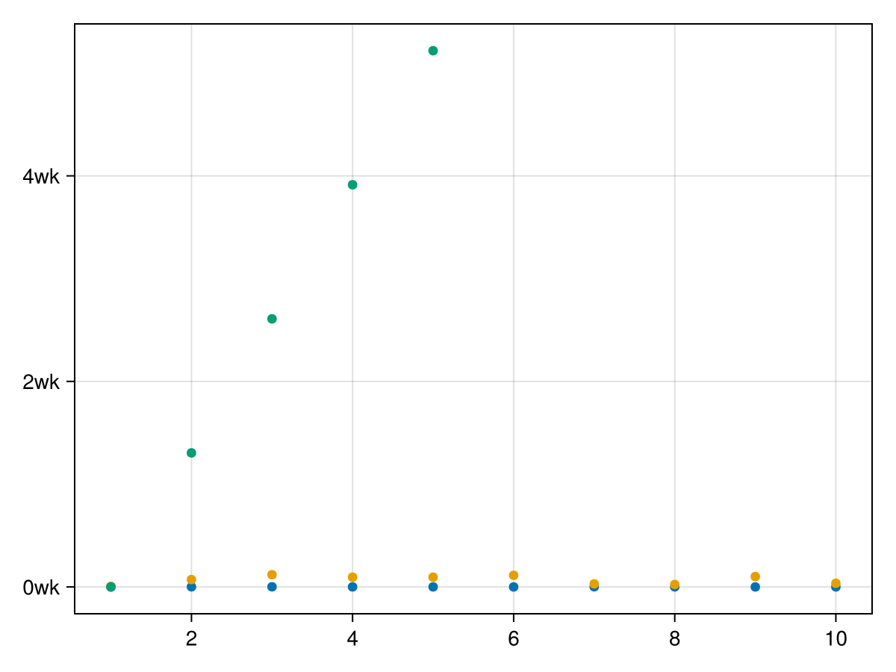
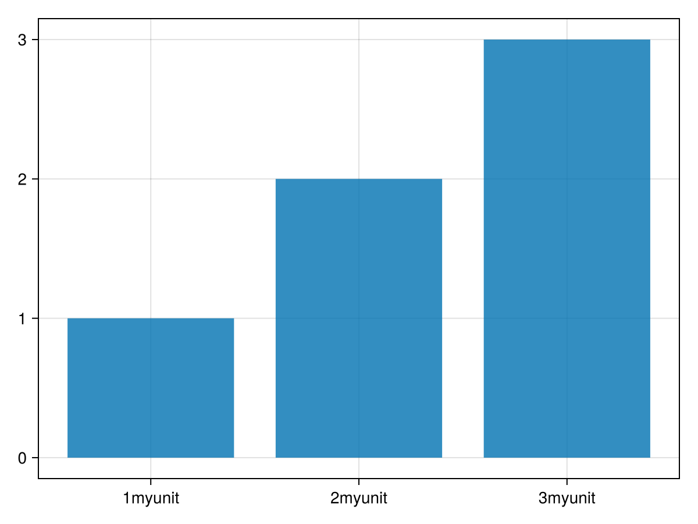

# Dimension conversions {#Dimension-conversions}

Starting with Makie v0.21, support for types like units, categorical values and dates has been added. They are converted to a plottable representation by dim(ension) converts, which also take care of axis ticks. In the following sections we will explain their usage and how to extend the interface with your own types.

## Examples {#Examples}

The basic usage is as easy as replacing numbers with any supported type, e.g. `Dates.Second`:
<a id="example-a402480" />


```julia
using CairoMakie
using CairoMakie, Makie.Dates, Makie.Unitful

f, ax, pl = scatter(rand(Second(1):Second(60):Second(20*60), 10))
```




Once an axis dimension is set to a certain unit, one must plot into that axis with compatible units. So e.g. hours work, since they&#39;re compatible with the unitful conversion:
<a id="example-670b138" />


```julia
scatter!(ax, rand(Hour(1):Hour(1):Hour(20), 10))
# Unitful works as well
scatter!(ax, LinRange(0u"yr", 0.1u"yr", 5))
f
```




Note that the units displayed in ticks will adjust to the given range of values.

Going back to just numbers errors since the axis is unitful now:

```julia
try
    scatter!(ax, 1:4)
catch e
    return e
end
```


Similarly, trying to plot units into a unitless axis dimension errors too, since otherwise it would alter the meaning of the previous plotted values:

```julia
try
    scatter!(ax, LinRange(0u"yr", 0.1u"yr", 10), rand(Hour(1):Hour(1):Hour(20), 10))
catch e
    return e
end
```


you can access the conversion via `ax.dim1_conversion` and `ax.dim2_conversion`:

```julia
(ax.dim1_conversion[], ax.dim2_conversion[])
```


And set them accordingly:

```julia
f = Figure()
ax = Axis(f[1, 1]; dim1_conversion=Makie.CategoricalConversion())
```


### Limitations {#Limitations}
- For now, dim conversions only works for vectors with supported types for the x and y arguments for the standard 2D Axis. It&#39;s setup to generalize to other Axis types, but the full integration hasn&#39;t been done yet.
  
- Keywords like `direction=:y` in e.g. Barplot will not propagate to the Axis correctly, since the first argument is currently always x and second always y. We&#39;re still trying to figure out how to solve this properly
  
- Categorical values need to be wrapped in `Categorical`, since it&#39;s hard to find a good type that isn&#39;t ambiguous when defaulting to a categorical conversion. You can find a work around in the docs.
  
- Date Time ticks simply use `PlotUtils.optimize_datetime_ticks` which is also used by Plots.jl. It doesn&#39;t generate optimally readable ticks yet and can generate overlaps and goes out of axis bounds quickly. This will need more polish to create readable ticks as default.
  
- To properly apply dim conversions only when applicable, one needs to use the new undocumented `@recipe` macro and define a conversion target type. This means user recipes only work if they pass through the arguments to any basic plotting type without conversion.
  

### Current conversions in Makie {#Current-conversions-in-Makie}
<details class='jldocstring custom-block' open>
<summary><a id='Makie.CategoricalConversion' href='#Makie.CategoricalConversion'><span class="jlbinding">Makie.CategoricalConversion</span></a> <Badge type="info" class="jlObjectType jlType" text="Type" /></summary>


```julia
CategoricalConversion(; sortby=identity)
```


Categorical conversion. Gets chosen automatically only for `Categorical(array_of_objects)` and `Enums` right now. The categories work with any sortable value though, so one can always do `Axis(fig; dim1_conversion=CategoricalConversion())`, to use it for other categories. One can use `CategoricalConversion(sortby=func)`, to change the sorting, or make unsortable objects sortable.

**Examples**

```julia
# Ticks get chosen automatically as categorical
scatter(1:4, Categorical(["a", "b", "c", "a"]))
```


```julia
# Explicitly set them for other types:
struct Named
    value
end
Base.show(io::IO, s::SomeStruct) = println(io, "[$(s.value)]")

conversion = Makie.CategoricalConversion(sortby=x->x.value)
barplot(Named.([:a, :b, :c]), 1:3, axis=(dim1_conversion=conversion,))
```


<Badge type="info" class="source-link" text="source"><a href="https://github.com/MakieOrg/Makie.jl/blob/f5fbbfb4328fb1bb82ddf663ef4cba4b04da2f84/src/dim-converts/categorical-integration.jl#L1-L26" target="_blank" rel="noreferrer">source</a></Badge>

</details>

<details class='jldocstring custom-block' open>
<summary><a id='Makie.UnitfulConversion' href='#Makie.UnitfulConversion'><span class="jlbinding">Makie.UnitfulConversion</span></a> <Badge type="info" class="jlObjectType jlType" text="Type" /></summary>


```julia
UnitfulConversion(unit=automatic; units_in_label=false)
```


Allows to plot arrays of unitful objects into an axis.

**Arguments**
- `unit=automatic`: sets the unit as conversion target. If left at automatic, the best unit will be chosen for all plots + values plotted to the axis (e.g. years for long periods, or km for long distances, or nanoseconds for short times).
  
- `units_in_label=true`: controls, whether plots are shown in the label_prefix of the axis labels, or in the tick labels
  

**Examples**

```julia
using Unitful, CairoMakie

# UnitfulConversion will get chosen automatically:
scatter(1:4, [1u"ns", 2u"ns", 3u"ns", 4u"ns"])
```


Fix unit to always use Meter &amp; display unit in the ylabel:

```julia
uc = Makie.UnitfulConversion(u"m"; units_in_label=false)
scatter(1:4, [0.01u"km", 0.02u"km", 0.03u"km", 0.04u"km"]; axis=(dim2_conversion=uc, ylabel="y (m)"))
```


<Badge type="info" class="source-link" text="source"><a href="https://github.com/MakieOrg/Makie.jl/blob/f5fbbfb4328fb1bb82ddf663ef4cba4b04da2f84/src/dim-converts/unitful-integration.jl#L121-L145" target="_blank" rel="noreferrer">source</a></Badge>

</details>

<details class='jldocstring custom-block' open>
<summary><a id='Makie.DateTimeConversion' href='#Makie.DateTimeConversion'><span class="jlbinding">Makie.DateTimeConversion</span></a> <Badge type="info" class="jlObjectType jlType" text="Type" /></summary>


```julia
DateTimeConversion(type=Automatic; k_min=automatic, k_max=automatic, k_ideal=automatic)
```


Creates conversion and conversions for Date, DateTime and Time. For other time units one should use `UnitfulConversion`, which work with e.g. Seconds.

For DateTimes `PlotUtils.optimize_datetime_ticks` is used for getting the conversion, otherwise `axis.(x/y)ticks` are used on the integer representation of the date.

**Arguments**
- `type=automatic`: when left at automatic, the first plot into the axis will determine the type. Otherwise, one can set this to `Time`, `Date`, or `DateTime`.
  

**Examples**

```julia
date_time = DateTime("2021-10-27T11:11:55.914")
date_time_range = range(date_time, step=Week(5), length=10)
# Automatically chose xticks as DateTeimeTicks:
scatter(date_time_range, 1:10)

# explicitly chose DateTimeConversion and use it to plot unitful values into it and display in the `Time` format:
using Makie.Unitful
conversion = Makie.DateTimeConversion(Time)
scatter(1:4, (1:4) .* u"s", axis=(dim2_conversion=conversion,))
```


<Badge type="info" class="source-link" text="source"><a href="https://github.com/MakieOrg/Makie.jl/blob/f5fbbfb4328fb1bb82ddf663ef4cba4b04da2f84/src/dim-converts/dates-integration.jl#L20-L44" target="_blank" rel="noreferrer">source</a></Badge>

</details>


## Developer docs {#Developer-docs}

You can overload the API to define your own dim converts by overloading the following functions:
<a id="example-4f0b410" />


```julia
struct MyDimConversion <: Makie.AbstractDimConversion end

# The type you target with the dim conversion
struct MyUnit
    value::Float64
end

# This is currently needed because `expand_dimensions` can only be narrowly defined for `Vector{<:Real}` in Makie.
# So, if you want to make `plot(some_y_values)` work for your own types, you need to define this method:
Makie.expand_dimensions(::PointBased, y::AbstractVector{<:MyUnit}) = (keys(y.values), y)

function Makie.needs_tick_update_observable(conversion::MyDimConversion)
    # return an observable that indicates when ticks need to update e.g. in case the unit changes or new categories get added.
    # For a simple unit conversion this is not needed, so we return nothing.
    return nothing
end

# Indicate that this type should be converted using MyDimConversion
# The Type gets extracted via `Makie.get_element_type(plot_argument_for_dim_n)`
# so e.g. `plot(1:10, ["a", "b", "c"])` would call `Makie.get_element_type(["a", "b", "c"])` and return `String` for axis dim 2.
Makie.create_dim_conversion(::Type{MyUnit}) = MyDimConversion()

# This function needs to be overloaded too, even though it's redundant to the above in a sense.
# We did not want to use `hasmethod(MakieCore.should_dim_convert, (MyDimTypes,))` because it can be slow and error prown.
Makie.MakieCore.should_dim_convert(::Type{MyUnit}) = true

# The non observable version of the actual conversion function
# This is needed to convert axis limits, and should be a pure version of the below `convert_dim_observable`
function Makie.convert_dim_value(::MyDimConversion, values)
    return [v.value for v in values]
end

function Makie.convert_dim_observable(conversion::MyDimConversion, values_obs::Observable, deregister)
    # Do the actual conversion here
    # Most complex dim conversions need to operate on the observable (e.g. to create a Dict of all used categories), so `convert_dim_value` alone is not enough.
    result = Observable(Float64[])
    f = on(values_obs; update=true) do values
        result[] = Makie.convert_dim_value(conversion, values)
    end

    # any observable operation like `on` or `map` should be pushed to `deregister`, to clean up state properly if e.g. the plot gets destroyed.
    # for `result = map(func, values_obs)` one can use `append!(deregister, result.inputs)`
    push!(deregister, f)
    return result
end

function Makie.get_ticks(::MyDimConversion, user_set_ticks, user_dim_scale, user_formatter, limits_min, limits_max)
    # Don't do anything special to ticks for this example, just append `myunit` to the labels and leave the rest to Makie's usual tick finding methods.
    ticknumbers, ticklabels = Makie.get_ticks(user_set_ticks, user_dim_scale, user_formatter, limits_min,
                                        limits_max)
    return ticknumbers, ticklabels .* "myunit"
end

barplot([MyUnit(1), MyUnit(2), MyUnit(3)], 1:3)
```




For more complex examples, you should look at the implementation in: `Makie/src/dim-converts`.

The conversions get applied in the function `Makie.conversion_pipeline` in `Makie/src/interfaces.jl`.
