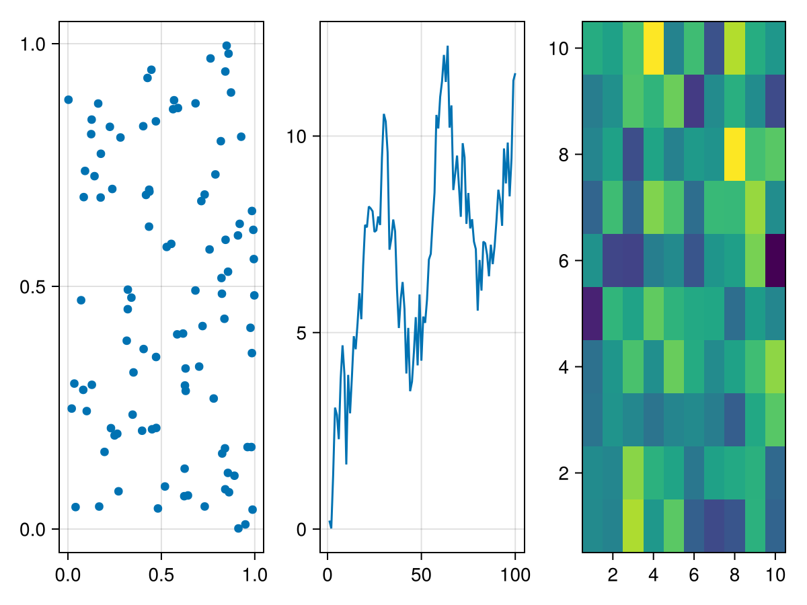
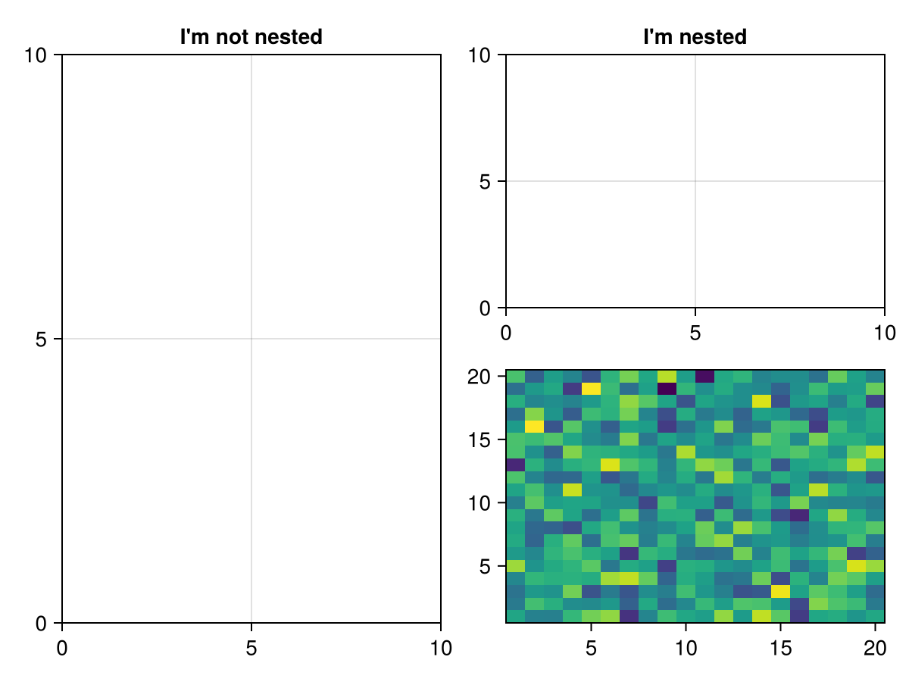
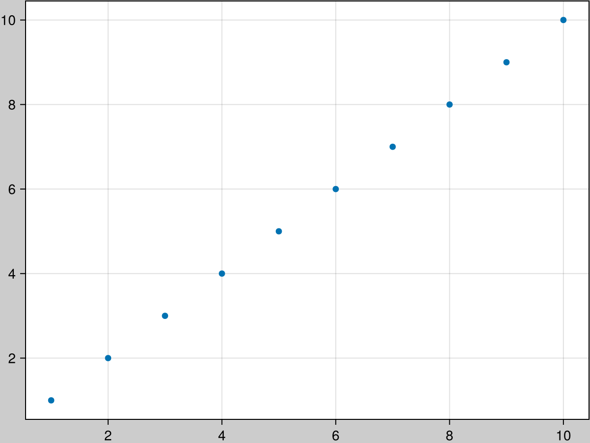
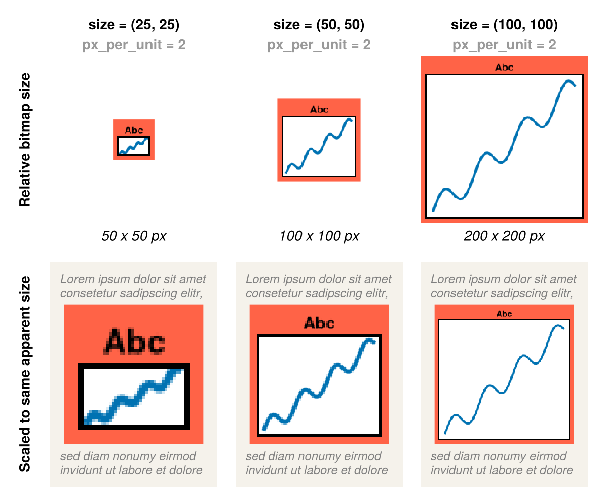
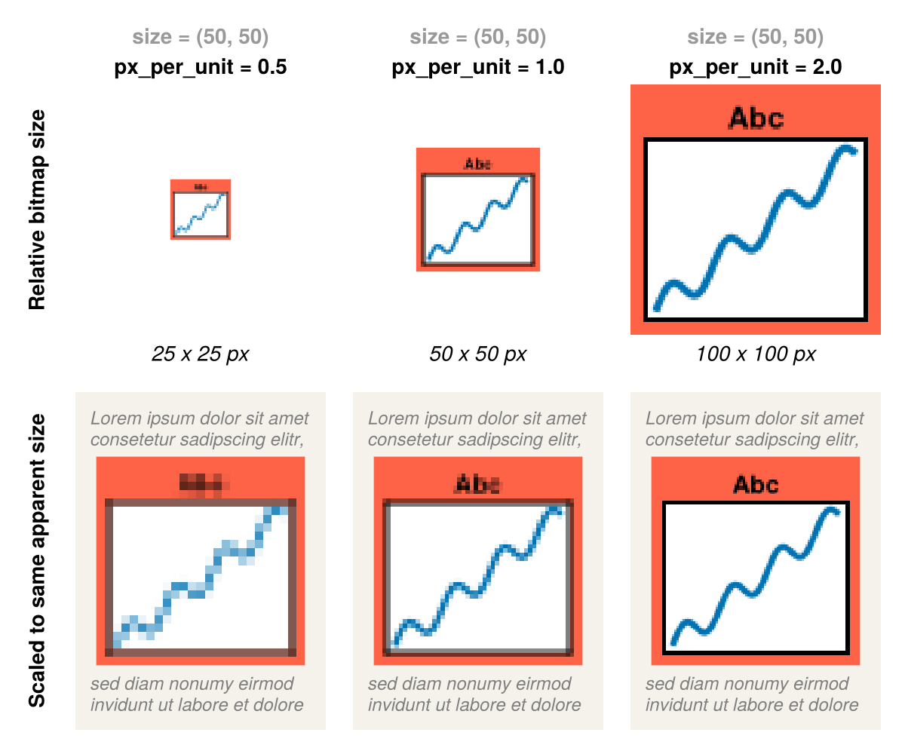

# Figures {#Figures}

The `Figure` object contains a top-level `Scene` and a `GridLayout`, as well as a list of blocks that have been placed into it, like `Axis`, `Colorbar`, `Slider`, `Legend`, etc.

## Creating a Figure {#Creating-a-Figure}

You can create a figure explicitly with the `Figure()` function, and set attributes of the underlying scene. The most important one of which is the `size`.

```julia
f = Figure()
f = Figure(size = (600, 400))
```


A figure is also created implicitly when you use simple, non-mutating plotting commands like `plot()`, `scatter()`, `lines()`, etc. Because these commands also create an axis for the plot to live in and the plot itself, they return a compound object `FigureAxisPlot`, which just stores these three parts. To access the figure you can either destructure that object into its three parts or access the figure field directly.

```julia
figureaxisplot = scatter(rand(100, 2))
figure = figureaxisplot.figure

# destructuring syntax
figure, axis, plot = scatter(rand(100, 2))

# you can also ignore components
figure, = scatter(rand(100, 2))
```


You can pass arguments to the created figure in a dict-like object to the special `figure` keyword:

```julia
scatter(rand(100, 2), figure = (size = (600, 400),))
```


## Placing Blocks into a Figure {#Placing-Blocks-into-a-Figure}

All Blocks take their parent figure as the first argument, then you can place them in the figure layout via indexing syntax.

```julia
f = Figure()
ax = f[1, 1] = Axis(f)
sl = f[2, 1] = Slider(f)
```


## GridPositions and GridSubpositions {#GridPositions-and-GridSubpositions}

The indexing syntax of `Figure` is implemented to work seamlessly with layouting. If you index into the figure, a `GridPosition` object that stores this indexing operation is created. This object can be used to plot a new axis into a certain layout position in the figure, for example like this:
<a id="example-3cc4bd9" />


```julia
using CairoMakie
f = Figure()
pos = f[1, 1]
scatter(pos, rand(100, 2))

pos2 = f[1, 2]
lines(pos2, cumsum(randn(100)))

# you don't have to store the position in a variable first, of course
heatmap(f[1, 3], randn(10, 10))

f
```




You can also index further into a `GridPosition`, which creates a `GridSubposition`. With `GridSubposition`s you can describe positions in arbitrarily nested grid layouts. Often, a desired plot layout can only be achieved with nesting, and repeatedly indexing makes this easy.
<a id="example-be23118" />


```julia
using CairoMakie
f = Figure()

f[1, 1] = Axis(f, title = "I'm not nested")
f[1, 2][1, 1] = Axis(f, title = "I'm nested")

# plotting into nested positions also works
heatmap(f[1, 2][2, 1], randn(20, 20))

f
```




All nested GridLayouts that don&#39;t exist yet, but are needed for a nested plotting call, are created in the background automatically.

::: tip Note

The `GridLayout`s that are implicitly created when using `GridSubpositions` are not directly available in the return value for further manipulation. You can instead retrieve them after the fact with the `content` function, for example, as explained in the following section.

:::

## Figure padding {#Figure-padding}

You can change the amount of whitespace (margin) around the figure content with the keyword `figure_padding`. This takes either a number for all four sides, or a tuple of four numbers for left, right, bottom, top. You can also theme this setting with `set_theme!(figure_padding = 30)`, for example.
<a id="example-8f7c775" />


```julia
using CairoMakie
f = Figure(figure_padding = 1, backgroundcolor = :gray80)

Axis(f[1, 1])
scatter!(1:10)

f
```




## Retrieving Objects From A Figure {#Retrieving-Objects-From-A-Figure}

Sometimes users are surprised that indexing into a figure does not retrieve the object placed at that position. This is because the `GridPosition` is needed for plotting, and returning content objects directly would take away that possibility. Furthermore, a `GridLayout` can hold multiple objects at the same position, or have partially overlapping content, so it&#39;s not well-defined what should be returned given a certain index.

To retrieve objects from a Figure you can instead use indexing plus the `contents` or `content` functions. The `contents` function returns a Vector of all objects found at the given `GridPosition`. You can use the `exact = true` keyword argument so that the position has to match exactly, otherwise objects contained in that position are also returned.

```julia
f = Figure()
box = f[1:3, 1:2] = Box(f)
ax = f[1, 1] = Axis(f)

contents(f[1, 1]) == [ax]
contents(f[1:3, 1:2]) == [box, ax]
contents(f[1:3, 1:2], exact = true) == [box]
```


If you use `contents` on a `GridSubposition`, the `exact` keyword only refers to the lowest-level grid layout, all upper levels have to match exactly.

```julia
f = Figure()
ax = f[1, 1][2, 3] = Axis(f)

contents(f[1, 1][2, 3]) == [ax]
contents(f[1:2, 1:2][2, 3]) == [] # the upper level has to match exactly
```


Often, you will expect only one object at a certain position and you want to work directly with it, without retrieving it from the Vector returned by `contents`. In that case, use the `content` function instead. It works equivalently to `only(contents(pos, exact = true))`, so it errors if it can&#39;t return exactly one object from an exact given position.

```julia
f = Figure()
ax = f[1, 1] = Axis(f)

contents(f[1, 1]) == [ax]
content(f[1, 1]) == ax
```


## Figure size and resolution {#Figure-size-and-resolution}

In Makie, the **size** of a `Figure` is unitless. That is because `Figure`s can be rendered as images or vector graphics or displayed in interactive windows. The actual physical size of those outputs depends on multiple factors such as screen sizes which are often outside of Makie&#39;s control, so we don&#39;t want to promise correct output size under all circumstances for a hypothetical `Figure(size = (4cm, 5cm))`.

The `size` of a `Figure` first and foremost tells you how much space there is for `Axis` objects and other content. For example, `fontsize` or `Axis(width = ..., height = ...)` are also unitless, but they can be understood relative to the figure size. If there is not enough space in your `Figure`, you can either increase its `size` or decrease the size of the content (for example with smaller fontsizes). However, we don&#39;t _only_ care about the `size` of the `Figure` relative to the sizes of its contents. It also has a meaning when we think about how big or small our `Figure` will look when rendered on all the different possible output devices.

Now, although Makie uses unitless numbers for figure size, it is set up by default such that these numbers can actually be thought of as CSS pixels. We have chosen this convention to simplify using Makie in web contexts which includes browser-based tools like Pluto, Jupyter notebooks or editors like VSCode. All of these use CSS to control the appearance of objects.

At default settings, a `Figure` of size `(600, 450)` will be displayed at a size of 600 x 450 CSS pixels in web contexts (if Makie renders via the `text/html` or `image/svg+xml` MIME types). This is true irrespective of its **resolution**, i.e., how many pixels the output bitmap has. The image will be annotated with `width = "600px" height = "450px"` so that browsers will know the intended display size.

The CSS pixel is a physical unit (1 px == 1/96 inch) but of course browsers display content on many different screens and at many different zoom levels, so you would usually not expect an element of 96px width to be exactly 1 inch wide at any given time. But even if we don&#39;t know what physical size our plots will have on our screens, we want them to fit in well next to other content and text, so we want to match the sizes conventionally used on today&#39;s systems. For example, a common fontsize is `12 pt`, which is equivalent to `16 px` (1 px == 3/4 pt).

This also applies to pdf outputs. When preparing plots for publications, we usually want to match font sizes of their plots to the base document, for example 12pt. But today we don&#39;t usually print pdfs on paper at their intended physical dimensions. Often, they are read on mobile devices where they are zoomed in and out, so any given text will rarely be at 12pt physically.

While vector graphics are always rendered sharply at a given zoom level, for bitmaps, the actual number of pixels decides at what zoom level or viewing distance they look sharp or blurry. This &quot;sharpness&quot; factor is often specified in `dpi` or dots per inch. Again, the &quot;inch&quot; here should not be expected to always match an actual physical inch (like in the printing days) because of the way we zoom in and out on digital screens. But if we conventionally use CSS pixels to describe sizes, we can also use `dpi` and we&#39;ll know what sharpness to expect on typical devices and typical zoom levels.

To sum up, we have two factors that affect the rendered output of a Makie `Figure`. Its **size**, which determines the space available for content and the display size when interpreted in units like CSS pixels, and the **resolution** or sharpness in terms of pixel density or `dpi`. For vector graphics we only care about the size factor (unless we&#39;re embedding rasterized bitmaps in them).

### The `px_per_unit` factor {#The-px_per_unit-factor}

If we display a `Figure(size = (600, 450))` in a web context, by Makie&#39;s convention the image will be annotated with `width = "600px" height = "450px"`. But how many pixels does the actual bitmap have, i.e., how sharp is the image?

This is controlled by the `px_per_unit` setting when rendering a figure as bitmap or saving a figure via `save`. This is `2` by default when rendering out bitmaps because many modern screens map 2x2 screen pixels to 1x1 CSS pixels (for example Apple&#39;s &quot;retina displays&quot;). If you want to be able to zoom in more and still have good resolution, you need to increase the `px_per_unit` value so images have even more pixels.

Here are two images that show how `size` and `px_per_unit` affect the visual appearance of your plots. You can remember two simple heuristics:
> 
> Increasing `size` gives you more space for your content and a larger bitmap. When scaled to the same size in an output context (a pdf document for example), a figure with larger `size` will appear to have smaller content.
> 



> 
> Increasing `px_per_unit` leaves the space for your content the same but gives a larger bitmap due to higher resolution. When scaled to the same size in an output context (a pdf document for example), a figure with larger `px_per_unit` will appear to have the same content, but sharper.
> 




There is also a `pt_per_unit` factor with which you can scale the output for vector graphics up or down. But if you keep with the convention that Makie&#39;s unitless numbers are actually CSS pixels, you can leave the default `pt_per_unit` at 0.75 and get size-matched bitmaps and vector graphics automatically.
