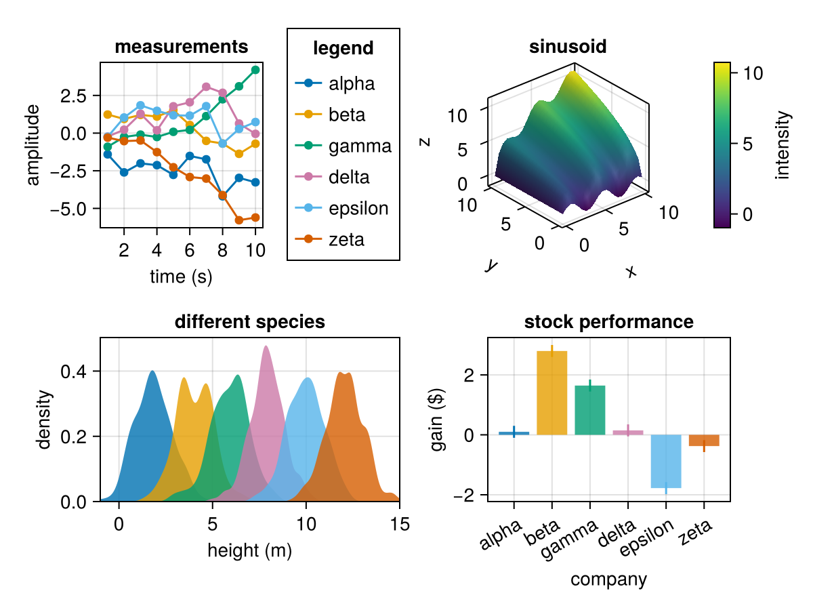
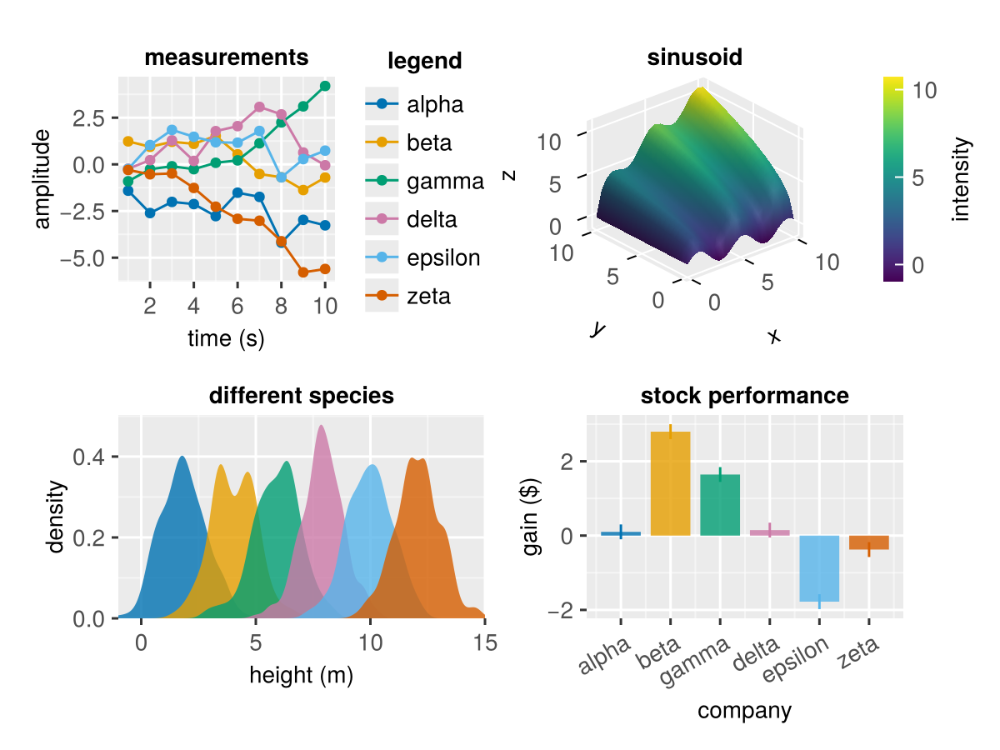
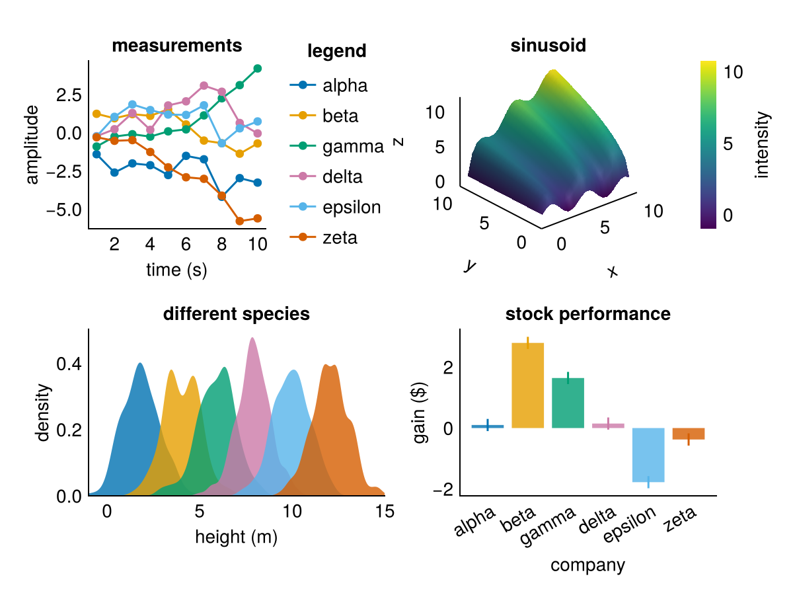
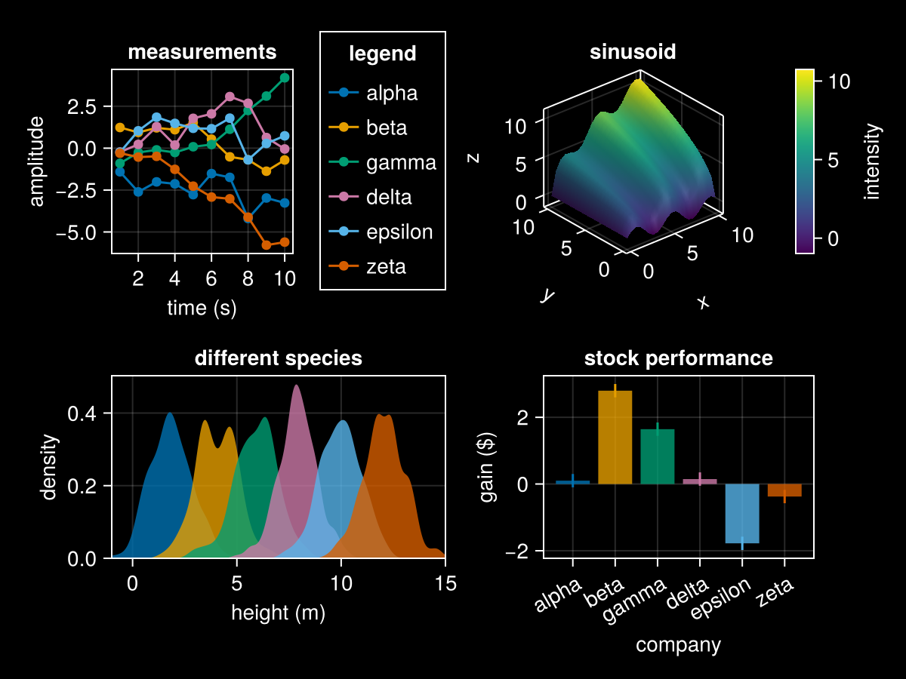
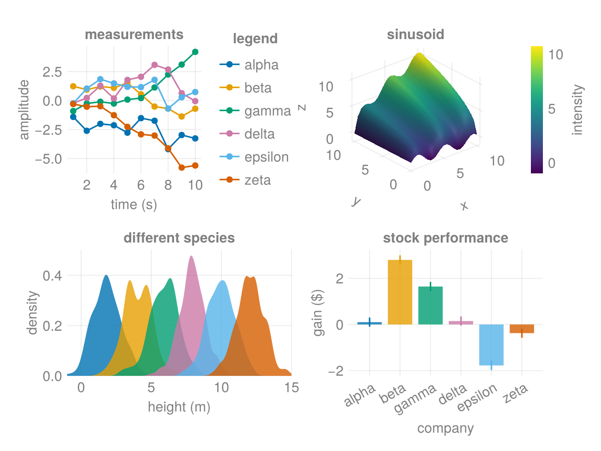
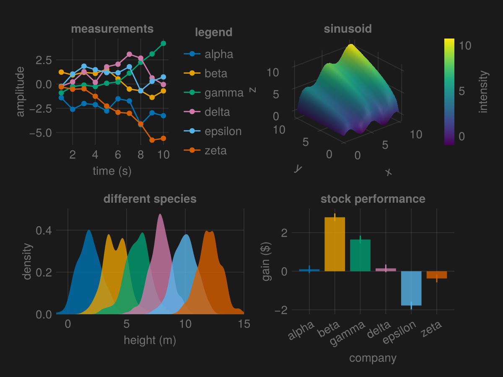
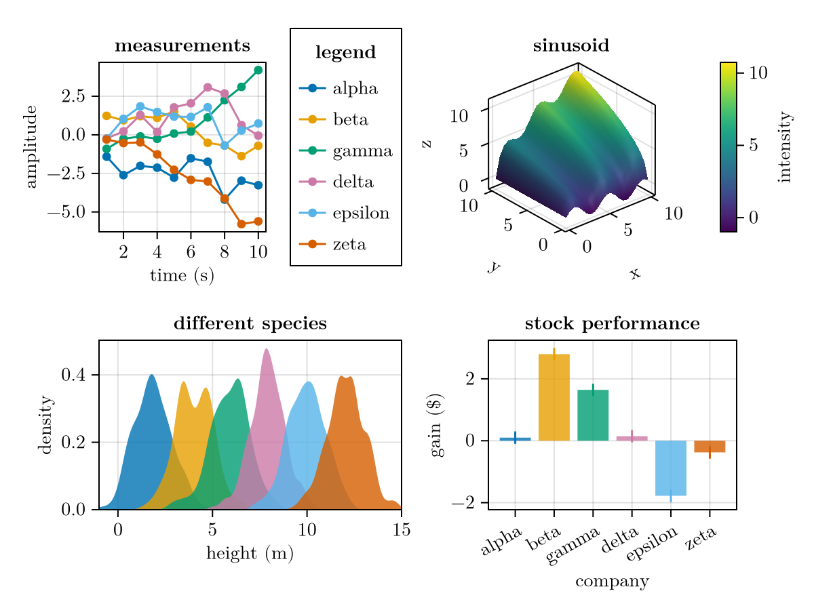

# Predefined themes {#Predefined-themes}

Makie has a few predefined themes. Here you can see the same example figure with these different themes applied.

```julia
using CairoMakie
using Random


function demofigure()
    Random.seed!(2)

    f = Figure()
    ax = Axis(f[1, 1],
        title = "measurements",
        xlabel = "time (s)",
        ylabel = "amplitude")

    labels = ["alpha", "beta", "gamma", "delta", "epsilon", "zeta"]
    for i in 1:6
        y = cumsum(randn(10)) .* (isodd(i) ? 1 : -1)
        lines!(y, label = labels[i])
        scatter!(y, label = labels[i])
    end

    Legend(f[1, 2], ax, "legend", merge = true)

    Axis3(f[1, 3],
        viewmode = :stretch,
        zlabeloffset = 40,
        title = "sinusoid")

    s = surface!(0:0.5:10, 0:0.5:10, (x, y) -> sqrt(x * y) + sin(1.5x))

    Colorbar(f[1, 4], s, label = "intensity")

    ax = Axis(f[2, 1:2],
        title = "different species",
        xlabel = "height (m)",
        ylabel = "density",)
    for i in 1:6
        y = randn(200) .+ 2i
        density!(y)
    end
    tightlimits!(ax, Bottom())
    xlims!(ax, -1, 15)

    Axis(f[2, 3:4],
        title = "stock performance",
        xticks = (1:6, labels),
        xlabel = "company",
        ylabel = "gain (\$)",
        xticklabelrotation = pi/6)
    for i in 1:6
        data = randn(1)
        barplot!([i], data)
        rangebars!([i], data .- 0.2, data .+ 0.2)
    end

    f
end
```


```
demofigure (generic function with 1 method)
```


## Default theme {#Default-theme}
<a id="example-2c3032d" />


```julia
demofigure()
```




## theme_ggplot2 {#theme_ggplot2}
<a id="example-4d283bf" />


```julia
with_theme(demofigure, theme_ggplot2())
```




## theme_minimal {#theme_minimal}
<a id="example-75be361" />


```julia
with_theme(demofigure, theme_minimal())
```




## theme_black {#theme_black}
<a id="example-f939a90" />


```julia
with_theme(demofigure, theme_black())
```




## theme_light {#theme_light}
<a id="example-fac403f" />


```julia
with_theme(demofigure, theme_light())
```




## theme_dark {#theme_dark}
<a id="example-b84ecba" />


```julia
with_theme(demofigure, theme_dark())
```




## theme_latexfonts {#theme_latexfonts}

See also [more general documentation on Makie and LaTeX](/explanations/latex#LaTeX).
<a id="example-9b9124c" />


```julia
with_theme(demofigure, theme_latexfonts())
```



