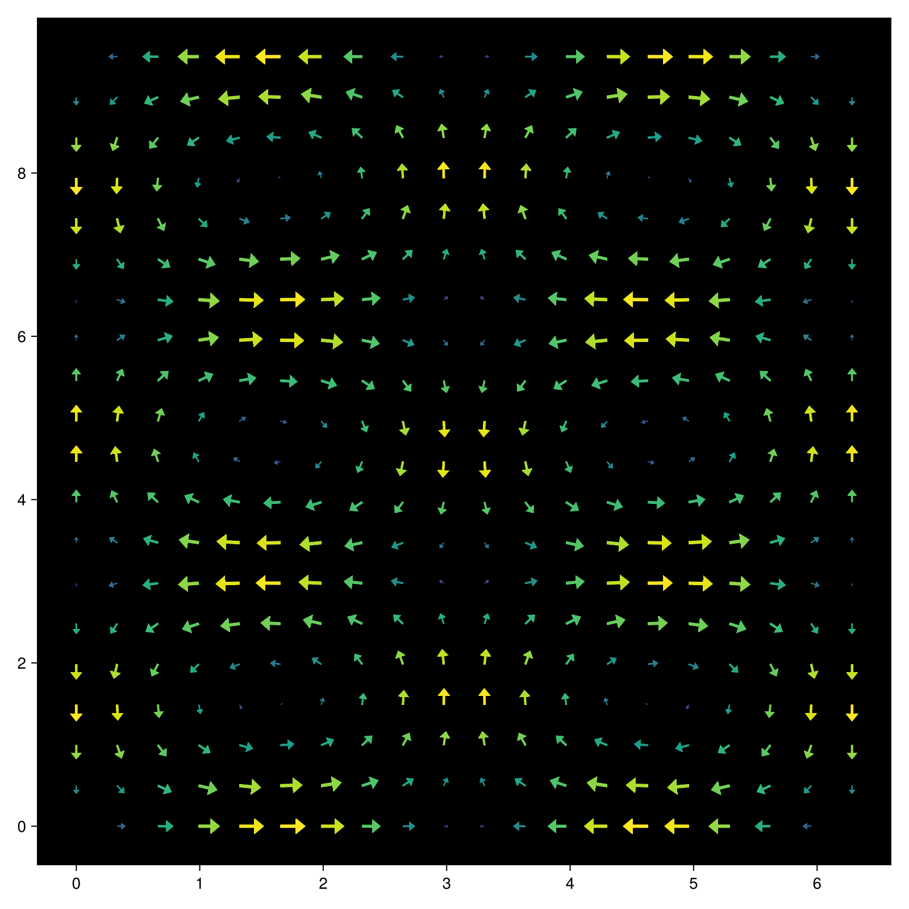
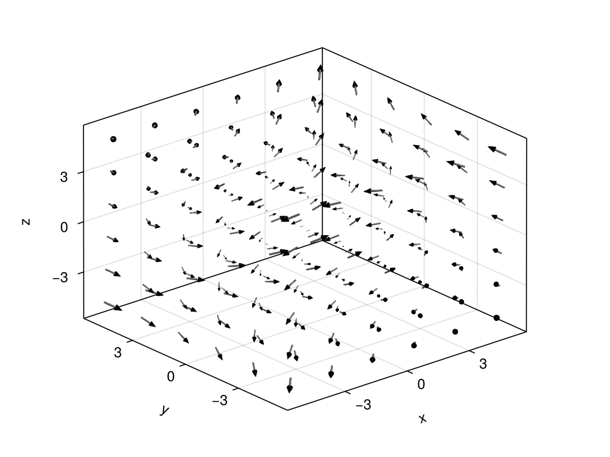
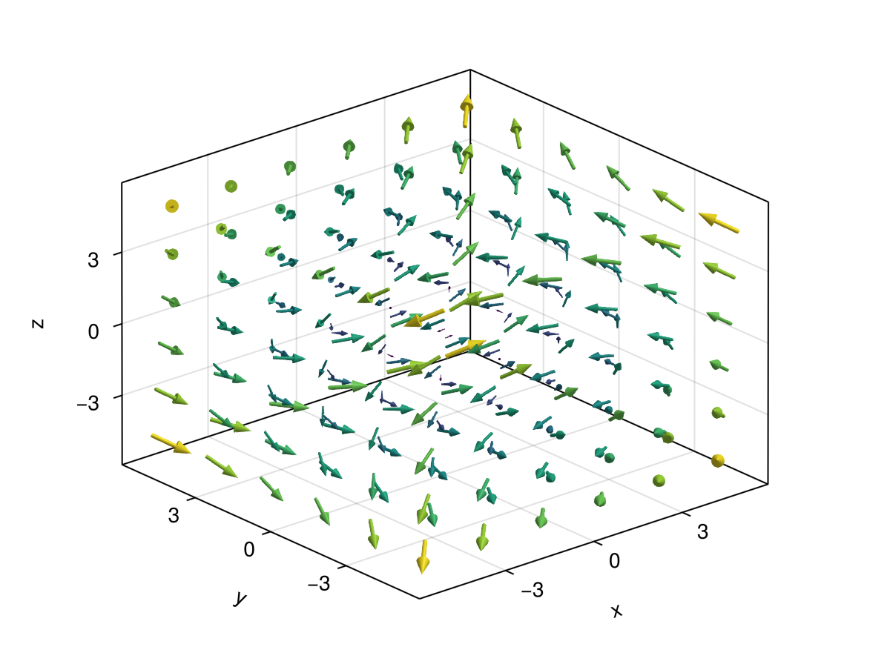
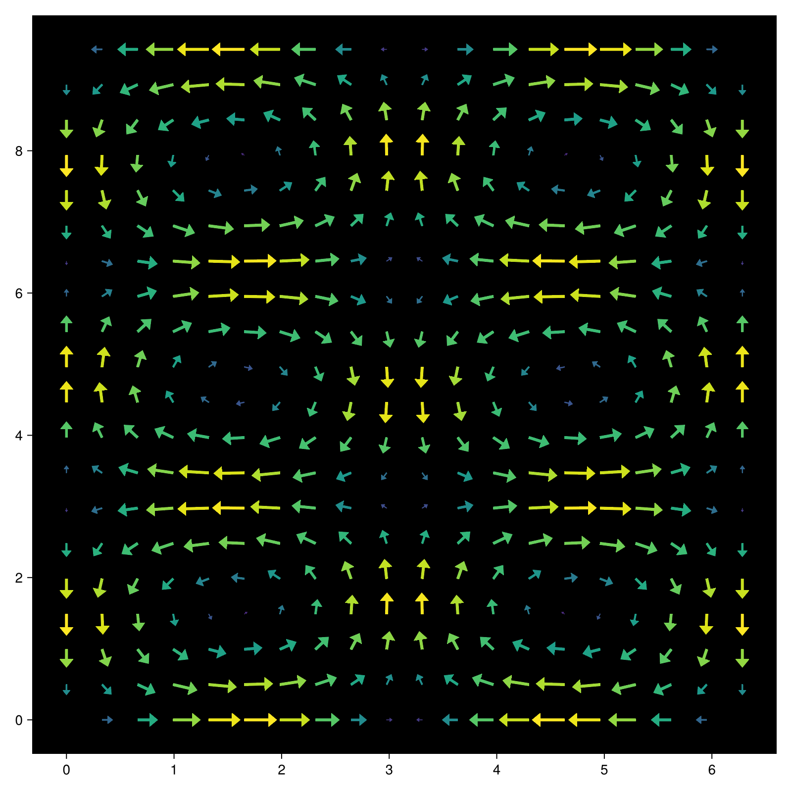
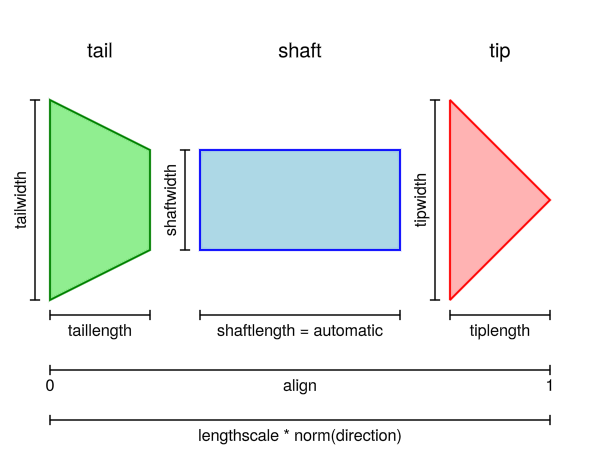
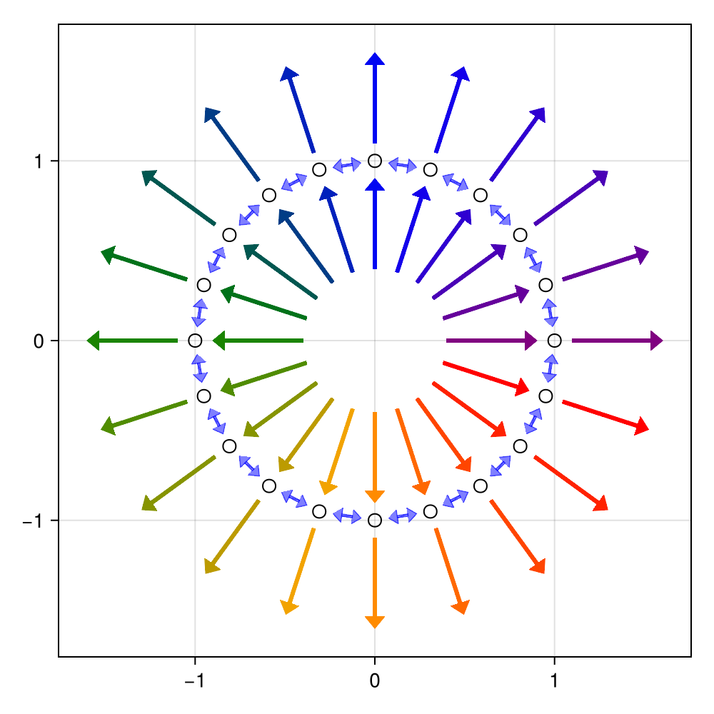
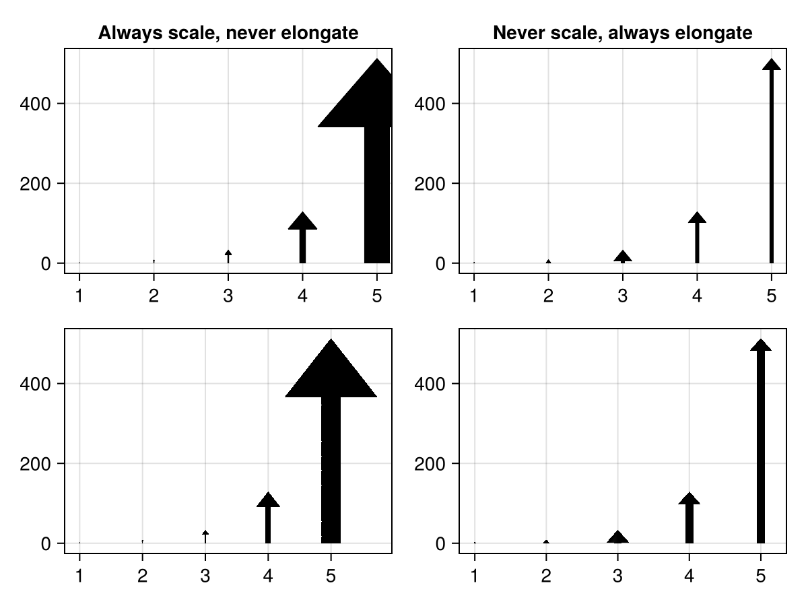

# arrows {#arrows}

Arrows are split into two plot types, `arrows2d` and `arrows3d`. They differ in the arrow markers they create - `arrows2d` creates 2D arrows and `arrows3d` creates 3D arrows. Both can be used with 2D and 3D coordinates.
<details class='jldocstring custom-block' open>
<summary><a id='Makie.arrows2d-reference-plots-arrows' href='#Makie.arrows2d-reference-plots-arrows'><span class="jlbinding">Makie.arrows2d</span></a> <Badge type="info" class="jlObjectType jlFunction" text="Function" /></summary>


```julia
arrows2d(points, directions; kwargs...)
arrows2d(x, y, [z], u, v, [w])
arrows2d(x, y, [z], f::Function)
```


Plots arrows as 2D shapes.

Their positions are given by a vector of `points` or component vectors `x`, `y` and optionally `z`. A single point or value of `x`, `y` and `z` is also allowed. Which part of the arrow is aligned with the position depends on the `align` attribute.

Their directions are given by a vector of `directions` or component vectors `u`, `v` and optionally `w` just like positions. Additionally they can also be calculated by a function `f` which should return a `Point` or `Vec` for each arrow `position::Point`. Note that direction can also be interpreted as end points with `argmode = :endpoint`.

**Plot type**

The plot type alias for the `arrows2d` function is `Arrows2D`.


<Badge type="info" class="source-link" text="source"><a href="https://github.com/MakieOrg/Makie.jl/blob/f5fbbfb4328fb1bb82ddf663ef4cba4b04da2f84/MakieCore/src/recipes.jl#L520-L666" target="_blank" rel="noreferrer">source</a></Badge>

</details>

<details class='jldocstring custom-block' open>
<summary><a id='Makie.arrows3d-reference-plots-arrows' href='#Makie.arrows3d-reference-plots-arrows'><span class="jlbinding">Makie.arrows3d</span></a> <Badge type="info" class="jlObjectType jlFunction" text="Function" /></summary>


```julia
arrows3d(points, directions; kwargs...)
arrows3d(x, y, [z], u, v, [w])
arrows3d(x, y, [z], f::Function)
```


Plots arrows as 3D shapes.

Their positions are given by a vector of `points` or component vectors `x`, `y` and optionally `z`. A single point or value of `x`, `y` and `z` is also allowed. Which part of the arrow is aligned with the position depends on the `align` attribute.

Their directions are given by a vector of `directions` or component vectors `u`, `v` and optionally `w` just like positions. Additionally they can also be calculated by a function `f` which should return a `Point` or `Vec` for each arrow `position::Point`. Note that direction can also be interpreted as end points with `argmode = :endpoint`.

**Plot type**

The plot type alias for the `arrows3d` function is `Arrows3D`.


<Badge type="info" class="source-link" text="source"><a href="https://github.com/MakieOrg/Makie.jl/blob/f5fbbfb4328fb1bb82ddf663ef4cba4b04da2f84/MakieCore/src/recipes.jl#L520-L668" target="_blank" rel="noreferrer">source</a></Badge>

</details>


## Examples {#Examples}
<a id="example-fa7158c" />


```julia
using CairoMakie
f = Figure(size = (800, 800))
Axis(f[1, 1], backgroundcolor = "black")

xs = LinRange(0, 2pi, 20)
ys = LinRange(0, 3pi, 20)
us = [sin(x) * cos(y) for x in xs, y in ys]
vs = [-cos(x) * sin(y) for x in xs, y in ys]
strength = vec(sqrt.(us .^ 2 .+ vs .^ 2))

arrows2d!(xs, ys, us, vs, lengthscale = 0.2, color = strength)

f
```



<a id="example-719bc52" />


```julia
using GLMakie
ps = [Point3f(x, y, z) for x in -5:2:5 for y in -5:2:5 for z in -5:2:5]
ns = map(p -> 0.1 * Vec3f(p[2], p[3], p[1]), ps)
arrows3d(
    ps, ns,
    shaftcolor = :gray, tipcolor = :black,
    align = :center, axis=(type=Axis3,)
)
```



<a id="example-5b838db" />


```julia
using GLMakie
using LinearAlgebra

ps = [Point3f(x, y, z) for x in -5:2:5 for y in -5:2:5 for z in -5:2:5]
ns = map(p -> 0.1 * Vec3f(p[2], p[3], p[1]), ps)
lengths = norm.(ns)
arrows3d(
    ps, ns, color = lengths, lengthscale = 1.5,
    align = :center, axis=(type=Axis3,)
)
```




`arrows` can also take a function `f(x::Point{N})::Point{N}` which returns the arrow vector when given the arrow&#39;s origin.
<a id="example-303a773" />


```julia
using CairoMakie
fig = Figure(size = (800, 800))
ax = Axis(fig[1, 1], backgroundcolor = "black")
xs = LinRange(0, 2pi, 20)
ys = LinRange(0, 3pi, 20)
# explicit method
us = [sin(x) * cos(y) for x in xs, y in ys]
vs = [-cos(x) * sin(y) for x in xs, y in ys]
strength = vec(sqrt.(us .^ 2 .+ vs .^ 2))
# function method
arrow_fun(x) = Point2f(sin(x[1])*cos(x[2]), -cos(x[1])*sin(x[2]))
arrows2d!(ax, xs, ys, arrow_fun, lengthscale = 0.3, color = strength)
fig
```




### Arrow Components &amp; Details {#Arrow-Components-and-Details}





#### Arrow Length {#Arrow-Length}

The target size of each arrow is determined by its direction vector (second plot argument), `normalize` and `lengthscale`. From tail to tip, the length is given as `lengthscale * norm(direction)`. If `normalize = true` the direction is normalized first, i.e. the length becomes just `lengthscale`.

There is also the option to treat the second plot argument as the arrows endpoint with `argmode = :endpoint`. In this case the directions are determined as `direction = endpoint - startpoint` and then follow the same principles.

#### Scaling {#Scaling}

Arrow markers are separated into 3 components, a tail, a shaft and a tip. Each component comes with a length and width/radius (2D/3D) which determines its size. In 2D the sizes are given in pixel units by default (dependent on `markerspace`). In 3D they are given in relative units if `markerscale = automatic` (default) or data space units scaled by `markerscale` otherwise. To fit arrows to the length determined by `directions`, `lengthscale` and `normalize`, the `shaftlength` varies between `minshaftlength` and `maxshaftlength` if it is not explicitly set. Outside of this range or if it is explicitly set, all arrow lengths and widths/radii are scaled by a common factor instead.

#### Shapes {#Shapes}

The base shape of each component is given by the `tail`, `shaft` and `tip` attributes. For arrows2d these can be anything compatible with `poly`, e.g. a 2D mesh, Polygon or Vector of points. Each component should be defined in a 0..1 x -0.5..0.5 range, where +x is the direction of the arrow. The shape can also be constructed by a callback function `f(length, width, metrics)` returning something poly-compatible. It is given the final length and width of the component as well as the all the other final lengths and widths through metrics. For arrows3d they should be a mesh or GeometryPrimitive defined in a -0.5..0.5 x -0.5..0.5 x 0..1 range. Here +z is the direction of the arrow.

#### Alignment {#Alignment}

With `argmode = :direction` (default) arrows are aligned relative to the given positions (first argument). If `align = :tail` (or 0) the arrow will start at the respective position, `align = :center` (0.5) will centered and with `align = :tip` (1.0) it will end at the position. `align` can also take values outside the 0..1 range to create a gap between the position and the arrow marker.

If `argmode = :endpoint` alignment works differently and only takes effect if `normalize = true` or `lengthscale != 1`. Here `align` determines a point `p = startpoint + align * (endpoint - startpoint)` which aligns with same fraction of the arrow marker. So for example `align = 0.5` (:center) aligns the midpoint between the plot arguments with the midpoint of each arrow marker. If the length of arrows is scaled down, this will create a matching gap on either side of the arrow.
<a id="example-8e3fbff" />


```julia
using CairoMakie
f = Figure(size = (500, 500))

a = Axis(f[1,1], aspect = DataAspect())
ps = [Point2f(cos(a), sin(a)) for a in range(0, 2pi, length=21)[1:end-1]]
scatter!(ps, marker = Circle, color = :transparent, strokewidth = 1)

# Double headed arrow between two points, filling half the distance with
# :center alignment
p = arrows2d!(
    ps, [ps[2:end]..., ps[1]], color = (:blue, 0.5),
    align = :center, lengthscale = 0.5, argmode = :endpoint,
    tail = Point2f[(0, 0), (1, -0.5), (1, 0.5)], taillength = 8
)

# arrow pointing away from ps with a 0.2 gap between the tail and ps
arrows2d!(
    ps, ps, color = eachindex(ps), align = -0.2,
    colormap = :rainbow, lengthscale = 0.5
)

# arrow pointing to ps with a 0.2 gap between the tip and ps
arrows2d!(
    ps, ps, color = eachindex(ps), align = 1.2,
    colormap = :rainbow, lengthscale = 0.5
)
f
```



<a id="example-5316b29" />


```julia
using CairoMakie
ps = Point2f.(1:5, 0)
vs = Vec2f.(0, 2 .^ (1:2:10))

fig = Figure()

ax = Axis(fig[1, 1], title = "Always scale, never elongate")
arrows2d!(ax, ps, vs, shaftlength = 16)
ax = Axis(fig[2, 1])
# x and y coordinates are on different scales, so radius (x) and length (y) are too
arrows3d!(ax, ps, vs, shaftlength = 50,
    tipradius = 0.1, tiplength = 20, shaftradius = 0.02)

ax = Axis(fig[1, 2], title = "Never scale, always elongate")
arrows2d!(ax, ps, vs, minshaftlength = 0)
ax = Axis(fig[2, 2])
arrows3d!(ax, ps, vs, minshaftlength = 0,
    markerscale = 1, tiplength = 30)

fig
```




## Attributes {#Attributes}

### Arrows2D {#Arrows2D}

### align {#align}

Defaults to `:tail`

Sets the alignment of the arrow, i.e. which part of the arrow is placed at the given positions.
- `align = :tail` or `align = 0` places the arrow tail at the given position. This makes the arrow point away from that position.
  
- `align = :center` or `align = 0.5` places the arrow center (based on its total length) at the given position
  
- `align = :tip` or `align = 1.0` places the tip of the arrow at the given position. This makes the arrow point to that position.
  

Values outside of (0, 1) can also be used to create gaps between the arrow and its anchor position.

With `argmode = :endpoint` alignment is not relative to the first argument passed to arrows. Instead the given fraction of the arrow marker is aligned to the fraction between the start and end point of the arrow. So `align = :center` will align the center of the arrow marker with the center between the passed positions. Because of this `align` only has an effect here if `normalize = true` or if `lengthscale != 1`.

### alpha {#alpha}

Defaults to `1.0`

The alpha value of the colormap or color attribute. Multiple alphas like in `plot(alpha=0.2, color=(:red, 0.5)`, will get multiplied.

### argmode {#argmode}

Defaults to `:direction`

Controls whether the second argument is interpreted as a :direction or as an :endpoint.

### clip_planes {#clip_planes}

Defaults to `automatic`

Clip planes offer a way to do clipping in 3D space. You can set a Vector of up to 8 `Plane3f` planes here, behind which plots will be clipped (i.e. become invisible). By default clip planes are inherited from the parent plot or scene. You can remove parent `clip_planes` by passing `Plane3f[]`.

### color {#color}

Defaults to `:black`

Sets the color of the arrow. Can be overridden separately using `tailcolor`, `shaftcolor` and `tipcolor`.

### colormap {#colormap}

Defaults to `@inherit colormap :viridis`

Sets the colormap that is sampled for numeric `color`s. `PlotUtils.cgrad(...)`, `Makie.Reverse(any_colormap)` can be used as well, or any symbol from ColorBrewer or PlotUtils. To see all available color gradients, you can call `Makie.available_gradients()`.

### colorrange {#colorrange}

Defaults to `automatic`

The values representing the start and end points of `colormap`.

### colorscale {#colorscale}

Defaults to `identity`

The color transform function. Can be any function, but only works well together with `Colorbar` for `identity`, `log`, `log2`, `log10`, `sqrt`, `logit`, `Makie.pseudolog10` and `Makie.Symlog10`.

### depth_shift {#depth_shift}

Defaults to `0.0`

Adjusts the depth value of a plot after all other transformations, i.e. in clip space, where `-1 <= depth <= 1`. This only applies to GLMakie and WGLMakie and can be used to adjust render order (like a tunable overdraw).

### fxaa {#fxaa}

Defaults to `true`

Adjusts whether the plot is rendered with fxaa (anti-aliasing, GLMakie only).

### highclip {#highclip}

Defaults to `automatic`

The color for any value above the colorrange.

### inspectable {#inspectable}

Defaults to `@inherit inspectable`

Sets whether this plot should be seen by `DataInspector`. The default depends on the theme of the parent scene.

### inspector_clear {#inspector_clear}

Defaults to `automatic`

Sets a callback function `(inspector, plot) -> ...` for cleaning up custom indicators in DataInspector.

### inspector_hover {#inspector_hover}

Defaults to `automatic`

Sets a callback function `(inspector, plot, index) -> ...` which replaces the default `show_data` methods.

### inspector_label {#inspector_label}

Defaults to `automatic`

Sets a callback function `(plot, index, position) -> string` which replaces the default label generated by DataInspector.

### lengthscale {#lengthscale}

Defaults to `1.0`

Scales the length of the arrow (as calculated from directions) by some factor.

### lowclip {#lowclip}

Defaults to `automatic`

The color for any value below the colorrange.

### markerspace {#markerspace}

Defaults to `:pixel`

Sets the space of arrow metrics like tipwidth, tiplength, etc.

### maxshaftlength {#maxshaftlength}

Defaults to `Inf`

Sets the maximum shaft length, see `shaftlength`.

### minshaftlength {#minshaftlength}

Defaults to `10`

Sets the minimum shaft length, see `shaftlength`.

### model {#model}

Defaults to `automatic`

Sets a model matrix for the plot. This overrides adjustments made with `translate!`, `rotate!` and `scale!`.

### nan_color {#nan_color}

Defaults to `:transparent`

The color for NaN values.

### normalize {#normalize}

Defaults to `false`

If set to true, normalizes `directions`.

### overdraw {#overdraw}

Defaults to `false`

Controls if the plot will draw over other plots. This specifically means ignoring depth checks in GL backends

### shaft {#shaft}

Defaults to `Rect2f(0, -0.5, 1, 1)`

Sets the shape of the arrow shaft in units relative to the shaftwidth and shaftlength. The arrow shape extends left to right (towards increasing x) and should be defined in a 0..1 by -0.5..0.5 range.

### shaftcolor {#shaftcolor}

Defaults to `automatic`

Sets the color of the arrow shaft. Defaults to `color`

### shaftlength {#shaftlength}

Defaults to `automatic`

Sets the length of the arrow shaft. When set to `automatic` the length of the shaft will be derived from the length of the arrow, the `taillength` and the `tiplength`. If the results falls outside `minshaftlength` to `maxshaftlength` it is clamped and  all lengths and widths are scaled to fit. If the `shaftlength` is set to a value, the lengths and widths of the arrow are always scaled.

### shaftwidth {#shaftwidth}

Defaults to `3`

Sets the width of the arrow shaft. This width may get scaled down if the total arrow length exceeds the available space for the arrow.

### space {#space}

Defaults to `:data`

Sets the transformation space for box encompassing the plot. See `Makie.spaces()` for possible inputs.

### ssao {#ssao}

Defaults to `false`

Adjusts whether the plot is rendered with ssao (screen space ambient occlusion). Note that this only makes sense in 3D plots and is only applicable with `fxaa = true`.

### strokemask {#strokemask}

Defaults to `0.75`

Arrows2D relies on mesh rendering to draw arrows, which doesn&#39;t anti-alias well when the mesh gets thin. To mask this issue an outline is drawn over the mesh with lines. The width of that outline is given by `strokemask`. Setting this to `0` may improve transparent arrows.

### tail {#tail}

Defaults to `arrowtail2d`

Sets the shape of the arrow tail in units relative to the tailwidth and taillength. The arrow shape extends left to right (towards increasing x) and should be defined in a 0..1 by -0.5..0.5 range.

### tailcolor {#tailcolor}

Defaults to `automatic`

Sets the color of the arrow tail. Defaults to `color`

### taillength {#taillength}

Defaults to `0`

Sets the length of the arrow tail. This length may get scaled down if the total arrow length exceeds the available space for the arrow. Setting this to 0 will result in no tail being drawn.

### tailwidth {#tailwidth}

Defaults to `14`

Sets the width of the arrow tail. This width may get scaled down if the total arrow length exceeds the available space for the arrow.

### tip {#tip}

Defaults to `Point2f[(0, -0.5), (1, 0), (0, 0.5)]`

Sets the shape of the arrow tip in units relative to the tipwidth and tiplength. The arrow shape extends left to right (towards increasing x) and should be defined in a 0..1 by -0.5..0.5 range.

### tipcolor {#tipcolor}

Defaults to `automatic`

Sets the color of the arrow tip. Defaults to `color`

### tiplength {#tiplength}

Defaults to `8`

Sets the length of the arrow tip. This length may get scaled down if the total arrow length exceeds the available space for the arrow. Setting this to 0 will result in no tip being drawn.

### tipwidth {#tipwidth}

Defaults to `14`

Sets the width of the arrow tip. This width may get scaled down if the total arrow length exceeds the available space for the arrow.

### transformation {#transformation}

Defaults to `:automatic`

No docs available.

### transparency {#transparency}

Defaults to `false`

Adjusts how the plot deals with transparency. In GLMakie `transparency = true` results in using Order Independent Transparency.

### visible {#visible}

Defaults to `true`

Controls whether the plot will be rendered or not.

### Arrows3D {#Arrows3D}

### align {#align-2}

Defaults to `:tail`

Sets the alignment of the arrow, i.e. which part of the arrow is placed at the given positions.
- `align = :tail` or `align = 0` places the arrow tail at the given position. This makes the arrow point away from that position.
  
- `align = :center` or `align = 0.5` places the arrow center (based on its total length) at the given position
  
- `align = :tip` or `align = 1.0` places the tip of the arrow at the given position. This makes the arrow point to that position.
  

Values outside of (0, 1) can also be used to create gaps between the arrow and its anchor position.

With `argmode = :endpoint` alignment is not relative to the first argument passed to arrows. Instead the given fraction of the arrow marker is aligned to the fraction between the start and end point of the arrow. So `align = :center` will align the center of the arrow marker with the center between the passed positions. Because of this `align` only has an effect here if `normalize = true` or if `lengthscale != 1`.

### alpha {#alpha-2}

Defaults to `1.0`

The alpha value of the colormap or color attribute. Multiple alphas like in `plot(alpha=0.2, color=(:red, 0.5)`, will get multiplied.

### argmode {#argmode-2}

Defaults to `:direction`

Controls whether the second argument is interpreted as a :direction or as an :endpoint.

### clip_planes {#clip_planes-2}

Defaults to `automatic`

Clip planes offer a way to do clipping in 3D space. You can set a Vector of up to 8 `Plane3f` planes here, behind which plots will be clipped (i.e. become invisible). By default clip planes are inherited from the parent plot or scene. You can remove parent `clip_planes` by passing `Plane3f[]`.

### color {#color-2}

Defaults to `:black`

Sets the color of the arrow. Can be overridden separately using `tailcolor`, `shaftcolor` and `tipcolor`.

### colormap {#colormap-2}

Defaults to `@inherit colormap :viridis`

Sets the colormap that is sampled for numeric `color`s. `PlotUtils.cgrad(...)`, `Makie.Reverse(any_colormap)` can be used as well, or any symbol from ColorBrewer or PlotUtils. To see all available color gradients, you can call `Makie.available_gradients()`.

### colorrange {#colorrange-2}

Defaults to `automatic`

The values representing the start and end points of `colormap`.

### colorscale {#colorscale-2}

Defaults to `identity`

The color transform function. Can be any function, but only works well together with `Colorbar` for `identity`, `log`, `log2`, `log10`, `sqrt`, `logit`, `Makie.pseudolog10` and `Makie.Symlog10`.

### depth_shift {#depth_shift-2}

Defaults to `0.0`

Adjusts the depth value of a plot after all other transformations, i.e. in clip space, where `-1 <= depth <= 1`. This only applies to GLMakie and WGLMakie and can be used to adjust render order (like a tunable overdraw).

### fxaa {#fxaa-2}

Defaults to `true`

Adjusts whether the plot is rendered with fxaa (anti-aliasing, GLMakie only).

### highclip {#highclip-2}

Defaults to `automatic`

The color for any value above the colorrange.

### inspectable {#inspectable-2}

Defaults to `@inherit inspectable`

Sets whether this plot should be seen by `DataInspector`. The default depends on the theme of the parent scene.

### inspector_clear {#inspector_clear-2}

Defaults to `automatic`

Sets a callback function `(inspector, plot) -> ...` for cleaning up custom indicators in DataInspector.

### inspector_hover {#inspector_hover-2}

Defaults to `automatic`

Sets a callback function `(inspector, plot, index) -> ...` which replaces the default `show_data` methods.

### inspector_label {#inspector_label-2}

Defaults to `automatic`

Sets a callback function `(plot, index, position) -> string` which replaces the default label generated by DataInspector.

### lengthscale {#lengthscale-2}

Defaults to `1.0`

Scales the length of the arrow (as calculated from directions) by some factor.

### lowclip {#lowclip-2}

Defaults to `automatic`

The color for any value below the colorrange.

### markerscale {#markerscale}

Defaults to `automatic`

Scales all arrow components, i.e. all radii and lengths (including min/maxshaftlength). When set to `automatic` the scaling factor is based on the boundingbox of the given data. This does not affect the mapping between arrows and directions.

### maxshaftlength {#maxshaftlength-2}

Defaults to `Inf`

Sets the maximum shaft length, see `shaftlength`

### minshaftlength {#minshaftlength-2}

Defaults to `0.6`

Sets the minimum shaft length, see `shaftlength`.

### model {#model-2}

Defaults to `automatic`

Sets a model matrix for the plot. This overrides adjustments made with `translate!`, `rotate!` and `scale!`.

### nan_color {#nan_color-2}

Defaults to `:transparent`

The color for NaN values.

### normalize {#normalize-2}

Defaults to `false`

If set to true, normalizes `directions`.

### overdraw {#overdraw-2}

Defaults to `false`

Controls if the plot will draw over other plots. This specifically means ignoring depth checks in GL backends

### quality {#quality}

Defaults to `32`

Sets the number of vertices used when generating meshes for the arrow tail, shaft and cone. More vertices will improve the roundness of the mesh but be more costly.

### shaft {#shaft-2}

Defaults to `Cylinder(Point3f(0, 0, 0), Point3f(0, 0, 1), 0.5)`

Sets the mesh of the arrow shaft. The mesh should be defined in a Rect3(-0.5, -0.5, 0.0, 1, 1, 1) where +z is direction of the arrow. Anything outside this box will extend outside the area designated to the arrow shaft.

### shaftcolor {#shaftcolor-2}

Defaults to `automatic`

Sets the color of the arrow shaft. Defaults to `color`

### shaftlength {#shaftlength-2}

Defaults to `automatic`

Sets the length of the arrow shaft. When set to `automatic` the length of the shaft will be derived from the length of the arrow, the `taillength` and the `tiplength`. If the results falls outside `minshaftlength` to `maxshaftlength` it is clamped and  all lengths and widths are scaled to fit. If the `shaftlength` is set to a value, the lengths and widths of the arrow are always scaled.

### shaftradius {#shaftradius}

Defaults to `0.05`

Sets the width of the arrow shaft. This width may get scaled down if the total arrow length exceeds the available space for the arrow.

### space {#space-2}

Defaults to `:data`

Sets the transformation space for box encompassing the plot. See `Makie.spaces()` for possible inputs.

### ssao {#ssao-2}

Defaults to `false`

Adjusts whether the plot is rendered with ssao (screen space ambient occlusion). Note that this only makes sense in 3D plots and is only applicable with `fxaa = true`.

### tail {#tail-2}

Defaults to `Cylinder(Point3f(0, 0, 0), Point3f(0, 0, 1), 0.5)`

Sets the mesh of the arrow tail. The mesh should be defined in a Rect3(-0.5, -0.5, 0.0, 1, 1, 1) where +z is direction of the arrow. Anything outside this box will extend outside the area designated to the arrow tail.

### tailcolor {#tailcolor-2}

Defaults to `automatic`

Sets the color of the arrow tail. Defaults to `color`

### taillength {#taillength-2}

Defaults to `0`

Sets the length of the arrow tail. This length may get scaled down if the total arrow length exceeds the available space for the arrow. Setting this to 0 will result in no tail being drawn.

### tailradius {#tailradius}

Defaults to `0.15`

Sets the width of the arrow tail. This width may get scaled down if the total arrow length exceeds the available space for the arrow.

### tip {#tip-2}

Defaults to `Cone(Point3f(0, 0, 0), Point3f(0, 0, 1), 0.5)`

Sets the mesh of the arrow tip. The mesh should be defined in a Rect3(-0.5, -0.5, 0.0, 1, 1, 1) where +z is direction of the arrow. Anything outside this box will extend outside the area designated to the arrow tip.

### tipcolor {#tipcolor-2}

Defaults to `automatic`

Sets the color of the arrow tip. Defaults to `color`

### tiplength {#tiplength-2}

Defaults to `0.4`

Sets the length of the arrow tip. This length may get scaled down if the total arrow length exceeds the available space for the arrow. Setting this to 0 will result in no tip being drawn.

### tipradius {#tipradius}

Defaults to `0.15`

Sets the width of the arrow tip. This width may get scaled down if the total arrow length exceeds the available space for the arrow.

### transformation {#transformation-2}

Defaults to `:automatic`

No docs available.

### transparency {#transparency-2}

Defaults to `false`

Adjusts how the plot deals with transparency. In GLMakie `transparency = true` results in using Order Independent Transparency.

### visible {#visible-2}

Defaults to `true`

Controls whether the plot will be rendered or not.
