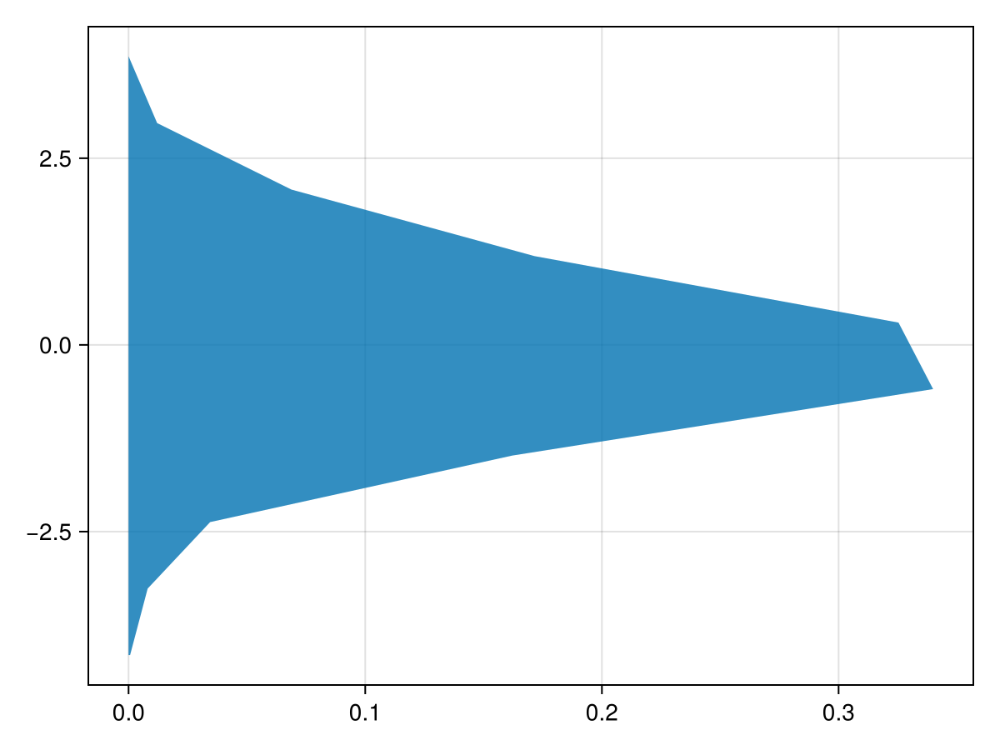
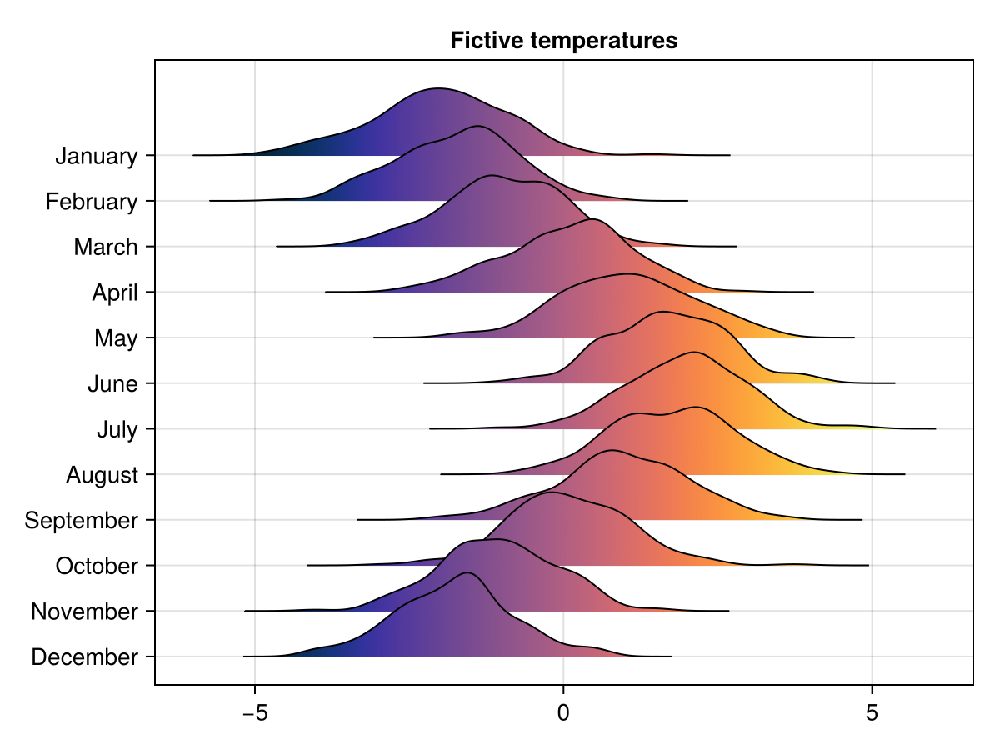
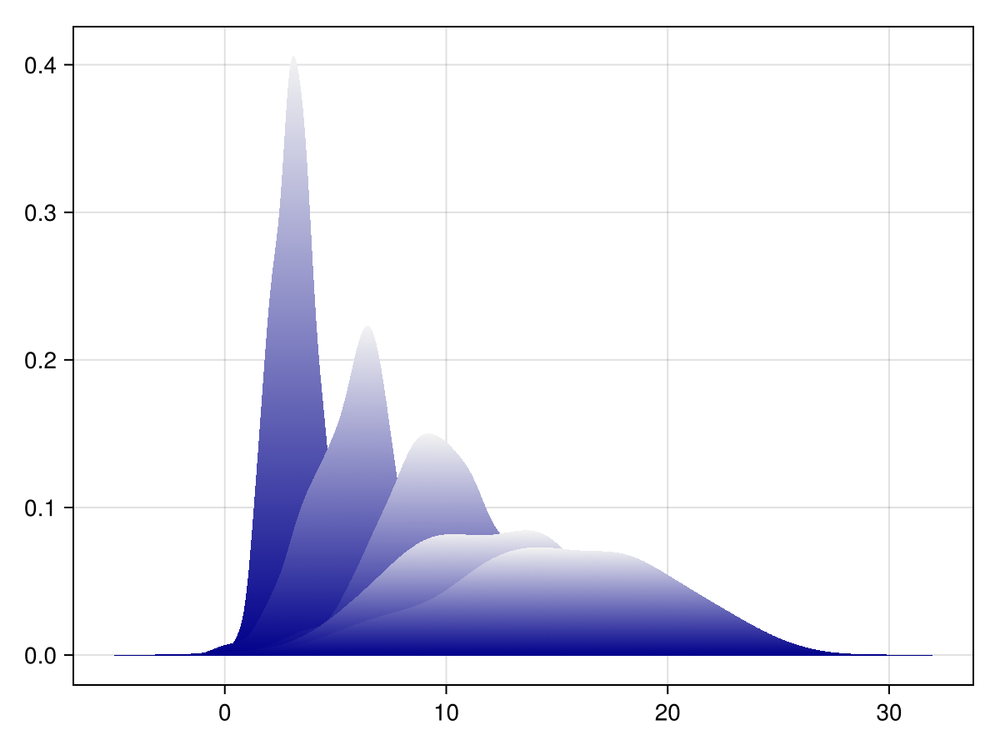
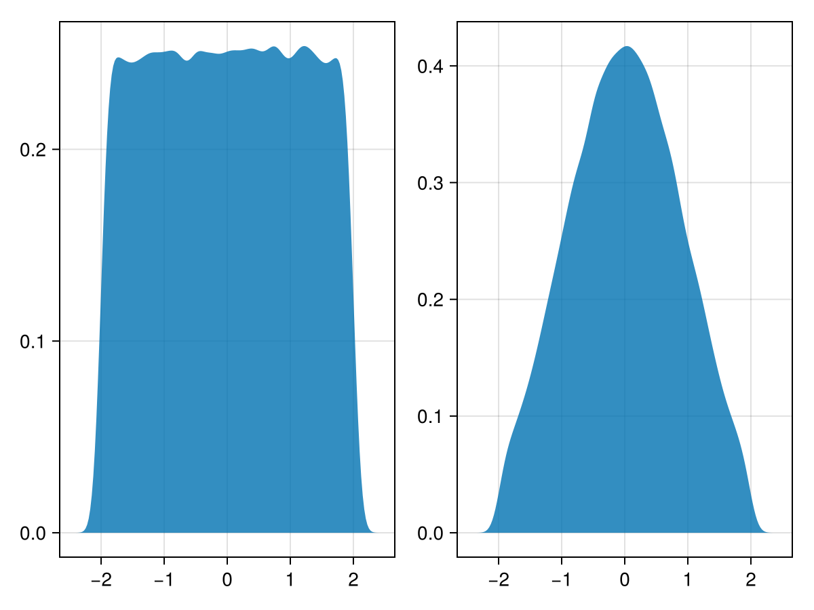

# density {#density}
<details class='jldocstring custom-block' open>
<summary><a id='Makie.density-reference-plots-density' href='#Makie.density-reference-plots-density'><span class="jlbinding">Makie.density</span></a> <Badge type="info" class="jlObjectType jlFunction" text="Function" /></summary>


```julia
density(values)
```


Plot a kernel density estimate of `values`.

**Plot type**

The plot type alias for the `density` function is `Density`.


<Badge type="info" class="source-link" text="source"><a href="https://github.com/MakieOrg/Makie.jl/blob/f5fbbfb4328fb1bb82ddf663ef4cba4b04da2f84/MakieCore/src/recipes.jl#L520-L569" target="_blank" rel="noreferrer">source</a></Badge>

</details>


## Examples {#Examples}
<a id="example-532e058" />


```julia
using CairoMakie
f = Figure()
Axis(f[1, 1])

density!(randn(200))
density!(randn(200) .+ 2, alpha = 0.8)

f
```


<a id="example-892ca46" />


```julia
using CairoMakie
f = Figure()
Axis(f[1, 1])

density!(randn(200), direction = :y, npoints = 10)

f
```



<a id="example-dcf2394" />


```julia
using CairoMakie
f = Figure()
Axis(f[1, 1])

density!(randn(200), color = (:red, 0.3),
    strokecolor = :red, strokewidth = 3, strokearound = true)

f
```


<a id="example-cffff4c" />


```julia
using CairoMakie
f = Figure()
Axis(f[1, 1])

vectors = [randn(1000) .+ i/2 for i in 0:5]

for (i, vector) in enumerate(vectors)
    density!(vector, offset = -i/4, color = (:slategray, 0.4),
        bandwidth = 0.1)
end

f
```


#### Gradients {#Gradients}

You can color density plots with gradients by choosing `color = :x` or `:y`, depending on the `direction` attribute.
<a id="example-3405325" />


```julia
using CairoMakie
months = ["January", "February", "March", "April",
    "May", "June", "July", "August", "September",
    "October", "November", "December"]

f = Figure()
Axis(f[1, 1], title = "Fictive temperatures",
    yticks = ((1:12) ./ 4,  reverse(months)))

for i in 12:-1:1
    d = density!(randn(200) .- 2sin((i+3)/6*pi), offset = i / 4,
        color = :x, colormap = :thermal, colorrange = (-5, 5),
        strokewidth = 1, strokecolor = :black)
    # this helps with layering in GLMakie
    translate!(d, 0, 0, -0.1i)
end
f
```




Due to technical limitations, if you color the `:vertical` dimension (or :horizontal with direction = :y), only a colormap made with just two colors can currently work:
<a id="example-374994f" />


```julia
using CairoMakie
f = Figure()
Axis(f[1, 1])
for x in 1:5
    d = density!(x * randn(200) .+ 3x,
        color = :y, colormap = [:darkblue, :gray95])
end
f
```




#### Using statistical weights {#Using-statistical-weights}
<a id="example-28874e0" />


```julia
using CairoMakie
using Distributions


N = 100_000
x = rand(Uniform(-2, 2), N)

w = pdf.(Normal(), x)

fig = Figure()
density(fig[1,1], x)
density(fig[1,2], x, weights = w)

fig
```




## Attributes {#Attributes}

### alpha {#alpha}

Defaults to `1.0`

The alpha value of the colormap or color attribute. Multiple alphas like in plot(alpha=0.2, color=(:red, 0.5), will get multiplied.

### bandwidth {#bandwidth}

Defaults to `automatic`

Kernel density bandwidth, determined automatically if `automatic`.

### boundary {#boundary}

Defaults to `automatic`

Boundary of the density estimation, determined automatically if `automatic`.

### color {#color}

Defaults to `@inherit patchcolor`

Usually set to a single color, but can also be set to `:x` or `:y` to color with a gradient. If you use `:y` when `direction = :x` (or vice versa), note that only 2-element colormaps can work correctly.

### colormap {#colormap}

Defaults to `@inherit colormap`

No docs available.

### colorrange {#colorrange}

Defaults to `Makie.automatic`

No docs available.

### colorscale {#colorscale}

Defaults to `identity`

No docs available.

### cycle {#cycle}

Defaults to `[:color => :patchcolor]`

No docs available.

### direction {#direction}

Defaults to `:x`

The dimension along which the `values` are distributed. Can be `:x` or `:y`.

### inspectable {#inspectable}

Defaults to `@inherit inspectable`

No docs available.

### linestyle {#linestyle}

Defaults to `nothing`

No docs available.

### npoints {#npoints}

Defaults to `200`

The resolution of the estimated curve along the dimension set in `direction`.

### offset {#offset}

Defaults to `0.0`

Shift the density baseline, for layering multiple densities on top of each other.

### strokearound {#strokearound}

Defaults to `false`

No docs available.

### strokecolor {#strokecolor}

Defaults to `@inherit patchstrokecolor`

No docs available.

### strokewidth {#strokewidth}

Defaults to `@inherit patchstrokewidth`

No docs available.

### weights {#weights}

Defaults to `automatic`

Assign a vector of statistical weights to `values`.
