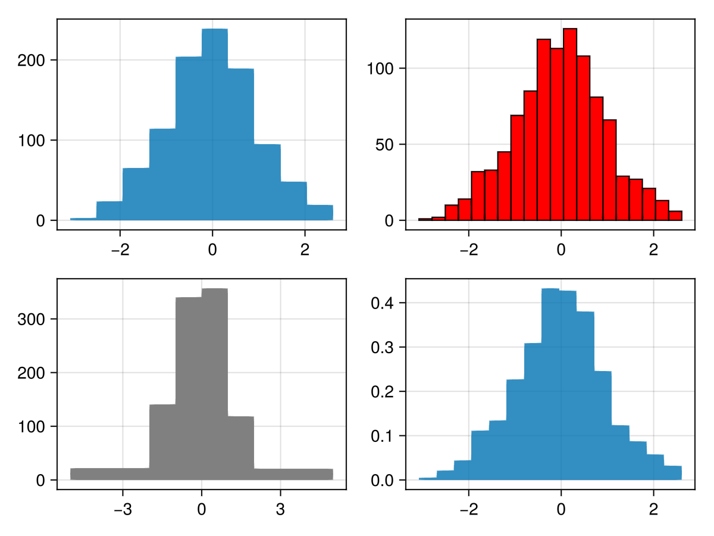
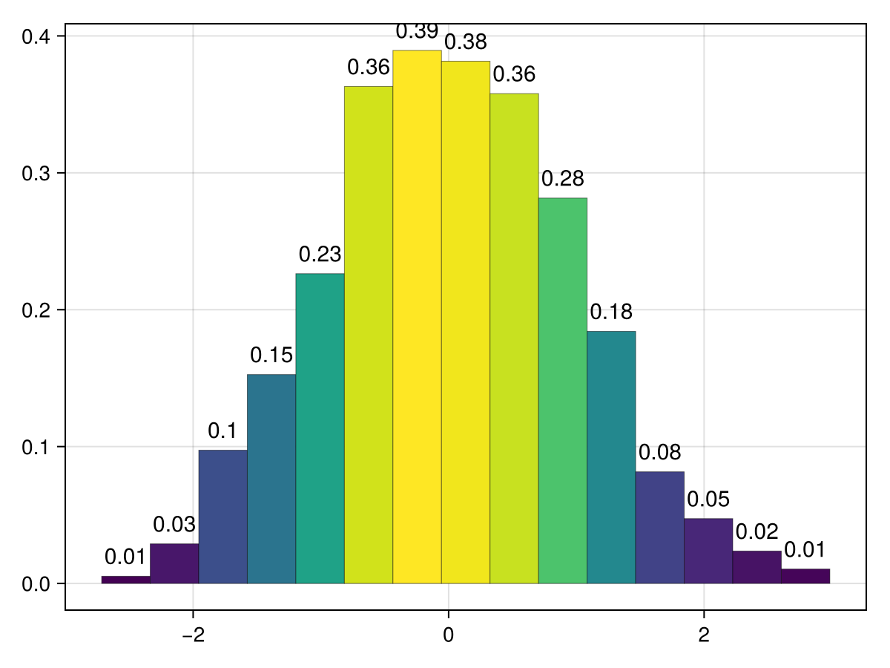
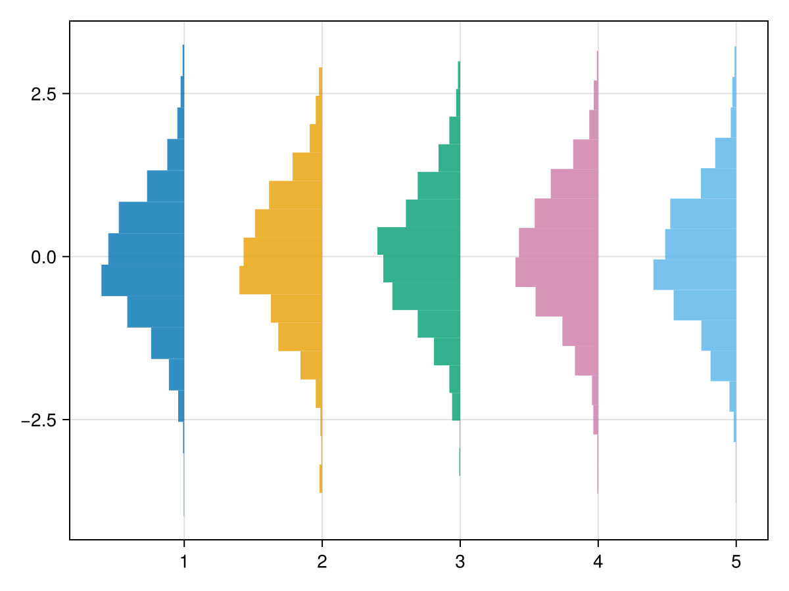
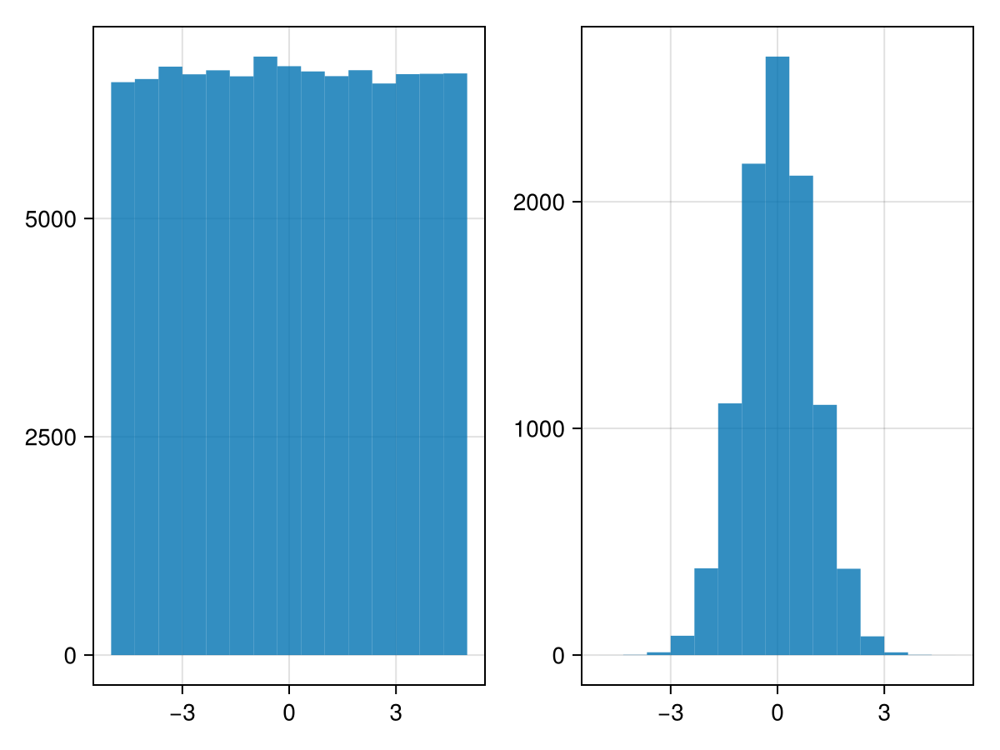

# hist {#hist}
<details class='jldocstring custom-block' open>
<summary><a id='Makie.hist-reference-plots-hist' href='#Makie.hist-reference-plots-hist'><span class="jlbinding">Makie.hist</span></a> <Badge type="info" class="jlObjectType jlFunction" text="Function" /></summary>


```julia
hist(values)
```


Plot a histogram of `values`.

**Plot type**

The plot type alias for the `hist` function is `Hist`.


<Badge type="info" class="source-link" text="source"><a href="https://github.com/MakieOrg/Makie.jl/blob/f5fbbfb4328fb1bb82ddf663ef4cba4b04da2f84/MakieCore/src/recipes.jl#L520-L591" target="_blank" rel="noreferrer">source</a></Badge>

</details>


## Examples {#Examples}
<a id="example-63fa291" />


```julia
using GLMakie
data = randn(1000)

f = Figure()
hist(f[1, 1], data, bins = 10)
hist(f[1, 2], data, bins = 20, color = :red, strokewidth = 1, strokecolor = :black)
hist(f[2, 1], data, bins = [-5, -2, -1, 0, 1, 2, 5], color = :gray)
hist(f[2, 2], data, normalization = :pdf)
f
```




#### Histogram with labels {#Histogram-with-labels}

You can use all the same arguments as [`barplot`](/reference/plots/barplot#barplot):
<a id="example-10f1369" />


```julia
using CairoMakie
data = randn(1000)

hist(data, normalization = :pdf, bar_labels = :values,
     label_formatter=x-> round(x, digits=2), label_size = 15,
     strokewidth = 0.5, strokecolor = (:black, 0.5), color = :values)
```




#### Moving histograms {#Moving-histograms}

With `scale_to`, and `offset`, one can put multiple histograms into the same plot. Note, that offset automatically sets fillto, to move the whole barplot. Also, one can use a negative `scale_to` amount to flip the histogram, or `scale_to=:flip` to flip the direction of the bars without changing their height.
<a id="example-78eb54b" />


```julia
using CairoMakie
fig = Figure()
ax = Axis(fig[1, 1])
for i in 1:5
     hist!(ax, randn(1000), scale_to=-0.6, offset=i, direction=:x)
end
fig
```




#### Using statistical weights {#Using-statistical-weights}
<a id="example-23a29c8" />


```julia
using CairoMakie
using Distributions


N = 100_000
x = rand(Uniform(-5, 5), N)

w = pdf.(Normal(), x)

fig = Figure()
hist(fig[1,1], x)
hist(fig[1,2], x, weights = w)

fig
```




## Attributes {#Attributes}

### bar_labels {#bar_labels}

Defaults to `nothing`

No docs available.

### bins {#bins}

Defaults to `15`

Can be an `Int` to create that number of equal-width bins over the range of `values`. Alternatively, it can be a sorted iterable of bin edges.

### color {#color}

Defaults to `@inherit patchcolor`

Color can either be:
- a vector of `bins` colors
  
- a single color
  
- `:values`, to color the bars with the values from the histogram
  

### cycle {#cycle}

Defaults to `[:color => :patchcolor]`

No docs available.

### direction {#direction}

Defaults to `:y`

Set the direction of the bars.

### fillto {#fillto}

Defaults to `automatic`

Defines where the bars start.

### flip_labels_at {#flip_labels_at}

Defaults to `Inf`

No docs available.

### gap {#gap}

Defaults to `0`

Gap between the bars (see barplot).

### label_color {#label_color}

Defaults to `@inherit textcolor`

No docs available.

### label_font {#label_font}

Defaults to `@inherit font`

No docs available.

### label_formatter {#label_formatter}

Defaults to `bar_label_formatter`

No docs available.

### label_offset {#label_offset}

Defaults to `5`

No docs available.

### label_size {#label_size}

Defaults to `20`

No docs available.

### normalization {#normalization}

Defaults to `:none`

Allows to normalize the histogram. Possible values are:
- `:pdf`: Normalize by sum of weights and bin sizes. Resulting histogram  has norm 1 and represents a PDF.
  
- `:density`: Normalize by bin sizes only. Resulting histogram represents  count density of input and does not have norm 1. Will not modify the  histogram if it already represents a density (`h.isdensity == 1`).
  
- `:probability`: Normalize by sum of weights only. Resulting histogram  represents the fraction of probability mass for each bin and does not have  norm 1.
  
- `:none`: Do not normalize.
  

### offset {#offset}

Defaults to `0.0`

Adds an offset to every value.

### over_background_color {#over_background_color}

Defaults to `automatic`

No docs available.

### over_bar_color {#over_bar_color}

Defaults to `automatic`

No docs available.

### scale_to {#scale_to}

Defaults to `nothing`

Allows to scale all values to a certain height. This can also be set to `:flip` to flip the direction of histogram bars without scaling them to a common height.

### strokecolor {#strokecolor}

Defaults to `@inherit patchstrokecolor`

No docs available.

### strokewidth {#strokewidth}

Defaults to `@inherit patchstrokewidth`

No docs available.

### weights {#weights}

Defaults to `automatic`

Allows to statistically weight the observations.
