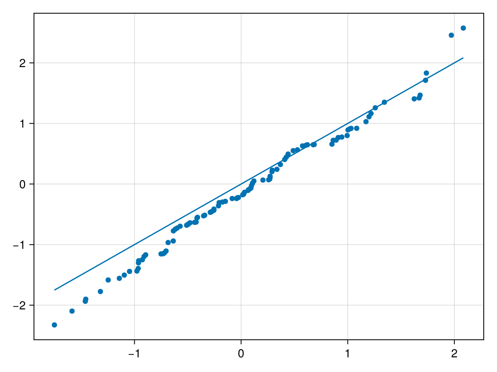

# qqplot {#qqplot}
<details class='jldocstring custom-block' open>
<summary><a id='Makie.qqplot-reference-plots-qqplot' href='#Makie.qqplot-reference-plots-qqplot'><span class="jlbinding">Makie.qqplot</span></a> <Badge type="info" class="jlObjectType jlFunction" text="Function" /></summary>


```julia
qqplot(x, y; kwargs...)
```


Draw a Q-Q plot, comparing quantiles of two distributions. `y` must be a list of samples, i.e., `AbstractVector{<:Real}`, whereas `x` can be
- a list of samples,
  
- an abstract distribution, e.g. `Normal(0, 1)`,
  
- a distribution type, e.g. `Normal`.
  

In the last case, the distribution type is fitted to the data `y`.

The attribute `qqline` (defaults to `:none`) determines how to compute a fit line for the Q-Q plot. Possible values are the following.
- `:identity` draws the identity line.
  
- `:fit` computes a least squares line fit of the quantile pairs.
  
- `:fitrobust` computes the line that passes through the first and third quartiles of the distributions.
  
- `:none` omits drawing the line.
  

Broadly speaking, `qqline = :identity` is useful to see if `x` and `y` follow the same distribution, whereas `qqline = :fit` and `qqline = :fitrobust` are useful to see if the distribution of `y` can be obtained from the distribution of `x` via an affine transformation.

**Plot type**

The plot type alias for the `qqplot` function is `QQPlot`.


<Badge type="info" class="source-link" text="source"><a href="https://github.com/MakieOrg/Makie.jl/blob/f5fbbfb4328fb1bb82ddf663ef4cba4b04da2f84/MakieCore/src/recipes.jl#L520-L594" target="_blank" rel="noreferrer">source</a></Badge>

</details>


## Examples {#Examples}

Test if `xs` and `ys` follow the same distribution.
<a id="example-339c7f4" />


```julia
using CairoMakie
xs = randn(100)
ys = randn(100)

qqplot(xs, ys, qqline = :identity)
```




## Attributes {#Attributes}

### clip_planes {#clip_planes}

Defaults to `automatic`

Clip planes offer a way to do clipping in 3D space. You can set a Vector of up to 8 `Plane3f` planes here, behind which plots will be clipped (i.e. become invisible). By default clip planes are inherited from the parent plot or scene. You can remove parent `clip_planes` by passing `Plane3f[]`.

### color {#color}

Defaults to `@inherit linecolor`

Control color of both line and markers (if `markercolor` is not specified).

### cycle {#cycle}

Defaults to `[:color]`

No docs available.

### depth_shift {#depth_shift}

Defaults to `0.0`

Adjusts the depth value of a plot after all other transformations, i.e. in clip space, where `-1 <= depth <= 1`. This only applies to GLMakie and WGLMakie and can be used to adjust render order (like a tunable overdraw).

### fxaa {#fxaa}

Defaults to `true`

Adjusts whether the plot is rendered with fxaa (anti-aliasing, GLMakie only).

### inspectable {#inspectable}

Defaults to `@inherit inspectable`

Sets whether this plot should be seen by `DataInspector`. The default depends on the theme of the parent scene.

### inspector_clear {#inspector_clear}

Defaults to `automatic`

Sets a callback function `(inspector, plot) -> ...` for cleaning up custom indicators in DataInspector.

### inspector_hover {#inspector_hover}

Defaults to `automatic`

Sets a callback function `(inspector, plot, index) -> ...` which replaces the default `show_data` methods.

### inspector_label {#inspector_label}

Defaults to `automatic`

Sets a callback function `(plot, index, position) -> string` which replaces the default label generated by DataInspector.

### linestyle {#linestyle}

Defaults to `nothing`

No docs available.

### linewidth {#linewidth}

Defaults to `@inherit linewidth`

No docs available.

### marker {#marker}

Defaults to `@inherit marker`

No docs available.

### markercolor {#markercolor}

Defaults to `automatic`

No docs available.

### markersize {#markersize}

Defaults to `@inherit markersize`

No docs available.

### model {#model}

Defaults to `automatic`

Sets a model matrix for the plot. This overrides adjustments made with `translate!`, `rotate!` and `scale!`.

### overdraw {#overdraw}

Defaults to `false`

Controls if the plot will draw over other plots. This specifically means ignoring depth checks in GL backends

### space {#space}

Defaults to `:data`

Sets the transformation space for box encompassing the plot. See `Makie.spaces()` for possible inputs.

### ssao {#ssao}

Defaults to `false`

Adjusts whether the plot is rendered with ssao (screen space ambient occlusion). Note that this only makes sense in 3D plots and is only applicable with `fxaa = true`.

### strokecolor {#strokecolor}

Defaults to `@inherit markerstrokecolor`

No docs available.

### strokewidth {#strokewidth}

Defaults to `@inherit markerstrokewidth`

No docs available.

### transformation {#transformation}

Defaults to `:automatic`

No docs available.

### transparency {#transparency}

Defaults to `false`

Adjusts how the plot deals with transparency. In GLMakie `transparency = true` results in using Order Independent Transparency.

### visible {#visible}

Defaults to `true`

Controls whether the plot will be rendered or not.
