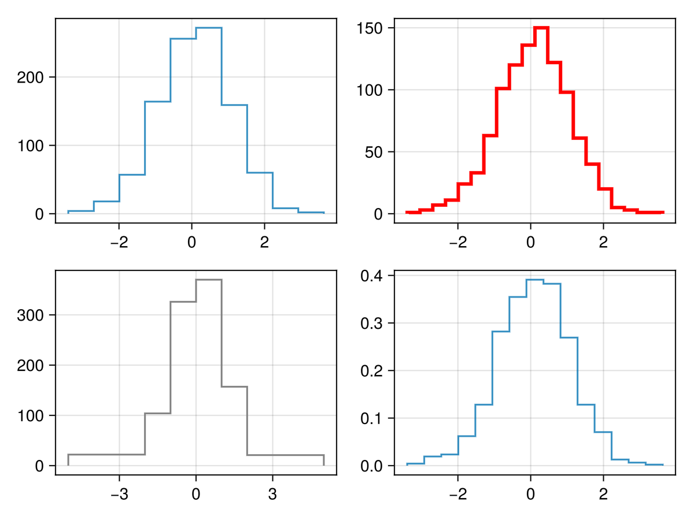

# stephist {#stephist}
<details class='jldocstring custom-block' open>
<summary><a id='Makie.stephist-reference-plots-stephist' href='#Makie.stephist-reference-plots-stephist'><span class="jlbinding">Makie.stephist</span></a> <Badge type="info" class="jlObjectType jlFunction" text="Function" /></summary>


```julia
stephist(values)
```


Plot a step histogram of `values`.

**Plot type**

The plot type alias for the `stephist` function is `StepHist`.


<Badge type="info" class="source-link" text="source"><a href="https://github.com/MakieOrg/Makie.jl/blob/f5fbbfb4328fb1bb82ddf663ef4cba4b04da2f84/MakieCore/src/recipes.jl#L520-L558" target="_blank" rel="noreferrer">source</a></Badge>

</details>


## Examples {#Examples}
<a id="example-ce3445a" />


```julia
using GLMakie
data = randn(1000)

f = Figure()
stephist(f[1, 1], data, bins = 10)
stephist(f[1, 2], data, bins = 20, color = :red, linewidth = 3)
stephist(f[2, 1], data, bins = [-5, -2, -1, 0, 1, 2, 5], color = :gray)
stephist(f[2, 2], data, normalization = :pdf)
f
```




For more examples, see `hist`.

## Attributes {#Attributes}

### bins {#bins}

Defaults to `15`

Can be an `Int` to create that number of equal-width bins over the range of `values`. Alternatively, it can be a sorted iterable of bin edges.

### color {#color}

Defaults to `@inherit patchcolor`

No docs available.

### cycle {#cycle}

Defaults to `[:color => :patchcolor]`

No docs available.

### linestyle {#linestyle}

Defaults to `:solid`

No docs available.

### linewidth {#linewidth}

Defaults to `@inherit linewidth`

No docs available.

### normalization {#normalization}

Defaults to `:none`

Allows to apply a normalization to the histogram. Possible values are:
- `:pdf`: Normalize by sum of weights and bin sizes. Resulting histogram has norm 1 and represents a PDF.
  
- `:density`: Normalize by bin sizes only. Resulting histogram represents count density of input and does not have norm 1. Will not modify the histogram if it already represents a density (`h.isdensity == 1`).
  
- `:probability`: Normalize by sum of weights only. Resulting histogram represents the fraction of probability mass for each bin and does not have norm 1.
  
- `:none`: Do not normalize.
  

### scale_to {#scale_to}

Defaults to `nothing`

Allows to scale all values to a certain height.

### weights {#weights}

Defaults to `automatic`

Allows to provide statistical weights.
