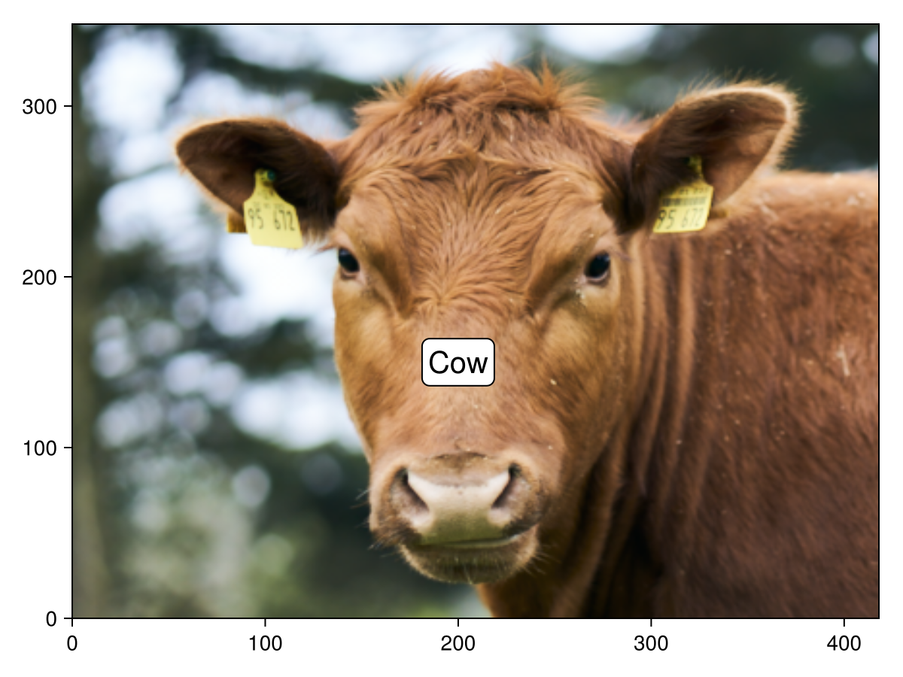
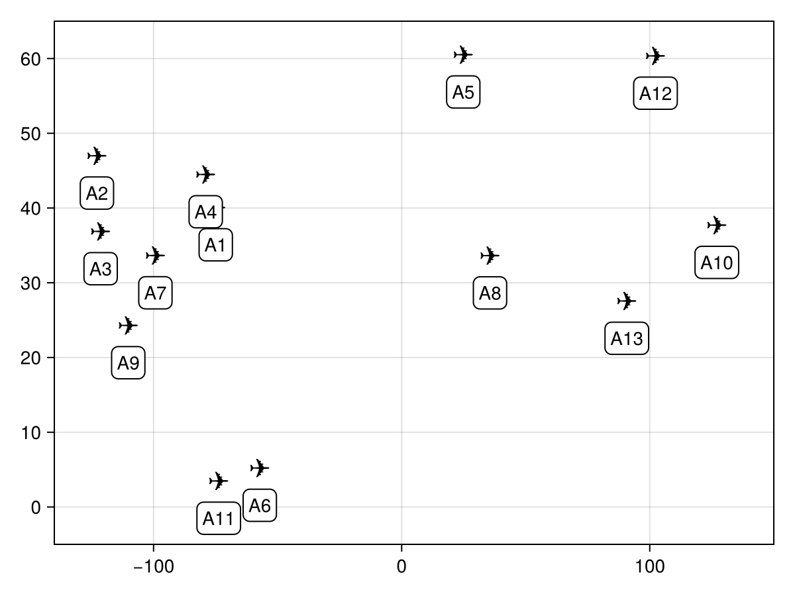
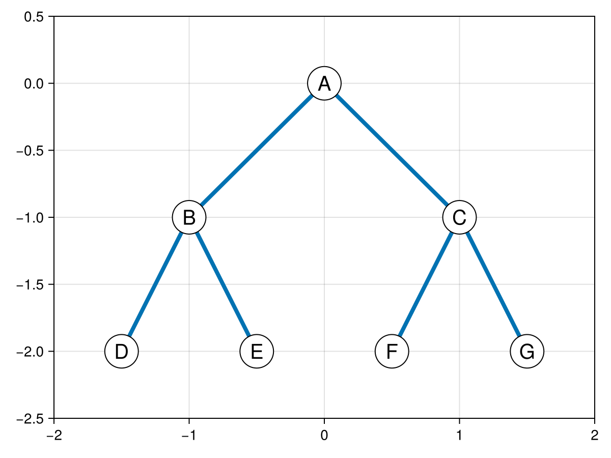
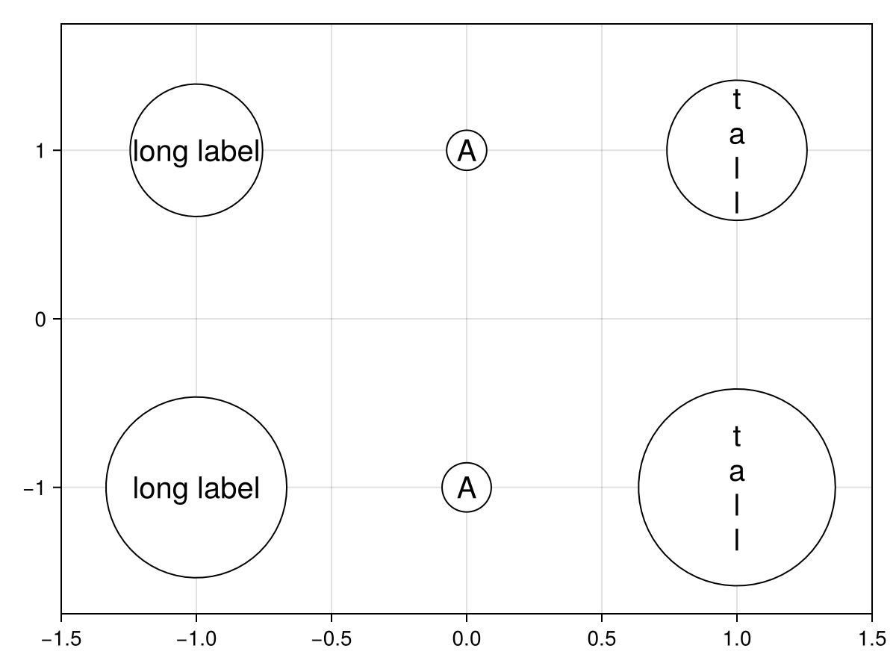

# textlabel {#textlabel}
<details class='jldocstring custom-block' open>
<summary><a id='Makie.textlabel-reference-plots-textlabel' href='#Makie.textlabel-reference-plots-textlabel'><span class="jlbinding">Makie.textlabel</span></a> <Badge type="info" class="jlObjectType jlFunction" text="Function" /></summary>


```julia
textlabel(positions, text; attributes...)
textlabel(position; text, attributes...)
textlabel(text_position; attributes...)
```


Plots the given text(s) with a background(s) at the given position(s).

**Plot type**

The plot type alias for the `textlabel` function is `TextLabel`.


<Badge type="info" class="source-link" text="source"><a href="https://github.com/MakieOrg/Makie.jl/blob/f5fbbfb4328fb1bb82ddf663ef4cba4b04da2f84/MakieCore/src/recipes.jl#L520-L642" target="_blank" rel="noreferrer">source</a></Badge>

</details>


## Examples {#Examples}
<a id="example-82558ac" />


```julia
using CairoMakie
using CairoMakie
using FileIO

f, a, p = image(rotr90(load(assetpath("cow.png"))))
textlabel!(a, Point2f(200, 150), text = "Cow", fontsize = 20)
f
```



<a id="example-187def3" />


```julia
using CairoMakie
using CairoMakie
using DelimitedFiles
loc = readdlm(assetpath("airportlocations.csv"))

f, a, p = scatter(
    loc[1:5004:end, :], marker = '✈', markersize = 20, color = :black
)
textlabel!(
    a, loc[1:5004:end, :], text = ["A$i" for i in axes(loc[1:5004:end, :], 1)],
    offset = (0, -20), text_align = (:center, :top)
)

xlims!(a, -140, 150)
ylims!(a, -5, 65)

f
```




### Custom Background Shapes {#Custom-Background-Shapes}

The background shape can be adjusted with the `shape` attribute. It can be anything that converts to a vector of points through `convert_arguments`, e.g. a GeometryPrimitive, a BezierPath, a vector of points, etc. These points are then transformed to fit the text bounding box of the label. More specifically, they are transformed such that `shape_limits` gets scaled up to the text bounding box plus padding.

Let&#39;s consider using a `Circle(Point2f(0), 1f0)` as our background shape. We want the text to fit inside the circle, so we want the text boundingbox to relate to an inner bounding box of the circle. We can choose this to be a square from `-sqrt(0.5) .. sqrt(0.5)` resulting in `shape_limits = Rect2f(-sqrt(0.5), -sqrt(0.5), sqrt(2), sqrt(2))`:
<a id="example-4fe85d5" />


```julia
using CairoMakie
using CairoMakie

ps = Point2f[
    (0, 0),
    (-1, -1), (1, -1),
    (-1.5, -2), (-0.5, -2), (0.5, -2), (1.5, -2)
]
f,a,p = textlabel(
    ps,
    ["A", "B", "C", "D",  "E", "F", "G"],
    fontsize = 20, padding = 0,
    shape = Circle(Point2f(0), 1f0),
    shape_limits = Rect2f(-sqrt(0.5), -sqrt(0.5), sqrt(2), sqrt(2)),
    keep_aspect = true
)
linesegments!(a, [
    ps[1], ps[2], ps[1], ps[3],
    ps[2], ps[4], ps[2], ps[5], ps[3], ps[6], ps[3], ps[7]
], linewidth = 4)

xlims!(a, -2, 2)
ylims!(a, -2.5, 0.5)
f
```




Another option for `shape` is to pass a function that constructs an already transformed vector of points from a translation and scale. If `shape_limits = Rect2f(0,0,1,1)` those are the origin and size of text boundingbox plus padding. This can be used, for example, to construct a circle that more tightly fits the text bounding box:
<a id="example-19f4b5e" />


```julia
using CairoMakie
using CairoMakie
using GeometryBasics
using LinearAlgebra

function build_shape(origin, size)
    radius = norm(0.5 * size)
    center = Point2f(origin + 0.5 * size)
    return coordinates(Circle(center, radius))
end

f, a, p = textlabel(
    [-1, 0, 1], [1, 1, 1], ["long label", "A", "t\na\nl\nl"],
    shape = build_shape, fontsize = 20, padding = 0
)
textlabel!(
    a, [-1, 0, 1], [-1, -1, -1], ["long label", "A", "t\na\nl\nl"],
    shape = Circle(Point2f(0), 1f0), fontsize = 20, padding = 0,
    shape_limits = Rect2f(-sqrt(0.5), -sqrt(0.5), sqrt(2), sqrt(2)),
    keep_aspect = true
)
xlims!(a, -1.5, 1.5)
ylims!(a, -1.75, 1.75)
f
```




## Attributes {#Attributes}

### alpha {#alpha}

Defaults to `1.0`

Sets the alpha value (opaqueness) of the background.

### background_color {#background_color}

Defaults to `:white`

Sets the color of the background. Can be a `Vector{<:Colorant}` for per vertex colors, a single `Colorant` or an `<: AbstractPattern` to cover the poly with a regular pattern, e.g. for hatching.

### clip_planes {#clip_planes}

Defaults to `Plane3f[]`

Clip planes offer a way to do clipping in 3D space. You can set a Vector of up to 8 `Plane3f` planes here, behind which plots will be clipped (i.e. become invisible). By default clip planes are inherited from the parent plot or scene. You can remove parent `clip_planes` by passing `Plane3f[]`.

### cornerradius {#cornerradius}

Defaults to `5.0`

Sets the corner radius when given a Rect2 background shape.

### cornervertices {#cornervertices}

Defaults to `10`

Sets the number of vertices involved in a rounded corner. Must be at least 2.

### depth_shift {#depth_shift}

Defaults to `0.0`

Adjusts the depth value of the textlabel after all other transformations, i.e. in clip space where `-1 <= depth <= 1`. This only applies to GLMakie and WGLMakie and can be used to adjust render order (like a tunable overdraw).

### draw_on_top {#draw_on_top}

Defaults to `true`

Controls whether the textlabel is drawn in front (true, default) or at a depth appropriate to its position.

### font {#font}

Defaults to `@inherit font`

Sets the font. Can be a `Symbol` which will be looked up in the `fonts` dictionary or a `String` specifying the (partial) name of a font or the file path of a font file

### fonts {#fonts}

Defaults to `@inherit fonts`

Used as a dictionary to look up fonts specified by `Symbol`, for example `:regular`, `:bold` or `:italic`.

### fontsize {#fontsize}

Defaults to `@inherit fontsize`

The fontsize in pixel units.

### fxaa {#fxaa}

Defaults to `false`

Controls whether the background renders with fxaa (anti-aliasing, GLMakie only). This is set to `false` by default to prevent artifacts around text.

### inspectable {#inspectable}

Defaults to `@inherit inspectable`

Adjusts whether the plot is rendered with ssao (screen space ambient occlusion). Note that this only makes sense in 3D plots and is only applicable with `fxaa = true`.

### inspector_clear {#inspector_clear}

Defaults to `automatic`

Sets a callback function `(inspector, plot) -> ...` for cleaning up custom indicators in DataInspector.

### inspector_hover {#inspector_hover}

Defaults to `automatic`

Sets a callback function `(inspector, plot, index) -> ...` which replaces the default `show_data` methods.

### inspector_label {#inspector_label}

Defaults to `automatic`

Sets a callback function `(plot, index, position) -> string` which replaces the default label generated by DataInspector.

### joinstyle {#joinstyle}

Defaults to `@inherit joinstyle`

Controls the rendering of outline corners. Options are `:miter` for sharp corners, `:bevel` for &quot;cut off&quot; corners, and `:round` for rounded corners. If the corner angle is below `miter_limit`, `:miter` is equivalent to `:bevel` to avoid long spikes.

### justification {#justification}

Defaults to `automatic`

Sets the alignment of text with respect to its bounding box. Can be `:left, :center, :right` or a fraction. Will default to the horizontal alignment in `text_align`.

### keep_aspect {#keep_aspect}

Defaults to `false`

Controls whether the aspect ratio of the background shape is kept during rescaling

### lineheight {#lineheight}

Defaults to `1.0`

The lineheight multiplier.

### linestyle {#linestyle}

Defaults to `nothing`

Sets the dash pattern of the outline. Options are `:solid` (equivalent to `nothing`), `:dot`, `:dash`, `:dashdot` and `:dashdotdot`. These can also be given in a tuple with a gap style modifier, either `:normal`, `:dense` or `:loose`. For example, `(:dot, :loose)` or `(:dashdot, :dense)`.

For custom patterns have a look at [`Makie.Linestyle`](/api#Makie.Linestyle).

### miter_limit {#miter_limit}

Defaults to `@inherit miter_limit`

Sets the minimum inner join angle below which miter joins truncate. See also `Makie.miter_distance_to_angle`.

### offset {#offset}

Defaults to `(0.0, 0.0)`

The offset of the textlabel from the given position in `markerspace` units.

### overdraw {#overdraw}

Defaults to `false`

Controls if the plot will draw over other plots. This specifically means ignoring depth checks in GL backends

### padding {#padding}

Defaults to `4`

Sets the padding between the text bounding box and background shape.

### position {#position}

Defaults to `(0, 0)`

Deprecated: Specifies the position of the text. Use the positional argument to `text` instead.

### shading {#shading}

Defaults to `NoShading`

Controls whether the background reacts to light.

### shape {#shape}

Defaults to `Rect2f(0, 0, 1, 1)`

Controls the shape of the background. Can be a GeometryPrimitive, mesh or function `(origin, size) -> coordinates`. The former two options are automatically rescaled to the padded bounding box of the rendered text. By default (0, 0) will be the lower left corner and (1, 1) the upper right corner of the padded bounding box. See `shape_limits`.

### shape_limits {#shape_limits}

Defaults to `Rect2f(0, 0, 1, 1)`

Sets the coordinates in `shape` space that should be transformed to match the size of the text bounding box. For example, `shape_limits = Rect2f(-1, -1, 2, 2)` results in transforming (-1, 1) to the lower left corner of the padded text bounding box and (1, 1) to the upper right corner. If the `shape` contains coordinates outside this range, they will rendered outside the padded text bounding box.

### space {#space}

Defaults to `:data`

sets the transformation space for box encompassing the plot. See `Makie.spaces()` for possible inputs.

### stroke_alpha {#stroke_alpha}

Defaults to `1.0`

Sets the alpha value (opaqueness) of the background outline.

### strokecolor {#strokecolor}

Defaults to `:black`

Sets the color of the outline around the background

### strokewidth {#strokewidth}

Defaults to `1`

Sets the width of the outline.

### text {#text}

Defaults to `""`

Specifies one piece of text or a vector of texts to show, where the number has to match the number of positions given. Makie supports `String` which is used for all normal text and `LaTeXString` which layouts mathematical expressions using `MathTeXEngine.jl`.

### text_align {#text_align}

Defaults to `(:center, :center)`

Sets the alignment of the string with respect to `position`. Uses `:left, :center, :right, :top, :bottom, :baseline` or fractions.

### text_alpha {#text_alpha}

Defaults to `1.0`

Sets the alpha value (opaqueness) of the text.

### text_color {#text_color}

Defaults to `@inherit textcolor`

Sets the color of the text. One can set one color per glyph by passing a `Vector{<:Colorant}` or one colorant for the whole text.

### text_fxaa {#text_fxaa}

Defaults to `false`

Controls whether the text renders with fxaa (anti-aliasing, GLMakie only). Setting this to true will reduce text quality.

### text_glowcolor {#text_glowcolor}

Defaults to `(:black, 0.0)`

Sets the color of the glow effect around text.

### text_glowwidth {#text_glowwidth}

Defaults to `0.0`

Sets the size of a glow effect around text.

### text_rotation {#text_rotation}

Defaults to `0.0`

Rotates the text around the given position. This affects the size of the textlabel but not its rotation

### text_strokecolor {#text_strokecolor}

Defaults to `(:black, 0.0)`

Sets the color of the outline around text.

### text_strokewidth {#text_strokewidth}

Defaults to `0`

Sets the width of the outline around text.

### transparency {#transparency}

Defaults to `false`

Adjusts how the plot deals with transparency. In GLMakie `transparency = true` results in using Order Independent Transparency.

### visible {#visible}

Defaults to `true`

Controls whether the plot will be rendered or not.

### word_wrap_width {#word_wrap_width}

Defaults to `-1`

Specifies a linewidth limit for text. If a word overflows this limit, a newline is inserted before it. Negative numbers disable word wrapping.
