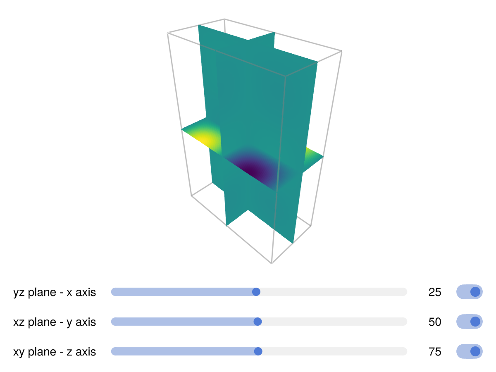

# volumeslices {#volumeslices}
<details class='jldocstring custom-block' open>
<summary><a id='Makie.volumeslices-reference-plots-volumeslices' href='#Makie.volumeslices-reference-plots-volumeslices'><span class="jlbinding">Makie.volumeslices</span></a> <Badge type="info" class="jlObjectType jlFunction" text="Function" /></summary>


```julia
volumeslices(x, y, z, v)
```


Draws heatmap slices of the volume v

**Plot type**

The plot type alias for the `volumeslices` function is `VolumeSlices`.


<Badge type="info" class="source-link" text="source"><a href="https://github.com/MakieOrg/Makie.jl/blob/f5fbbfb4328fb1bb82ddf663ef4cba4b04da2f84/MakieCore/src/recipes.jl#L520-L585" target="_blank" rel="noreferrer">source</a></Badge>

</details>


## Examples {#Examples}
<a id="example-aea96c7" />


```julia
using GLMakie
fig = Figure()
ax = LScene(fig[1, 1], show_axis=false)

x = LinRange(0, π, 50)
y = LinRange(0, 2π, 100)
z = LinRange(0, 3π, 150)

sgrid = SliderGrid(
    fig[2, 1],
    (label = "yz plane - x axis", range = 1:length(x)),
    (label = "xz plane - y axis", range = 1:length(y)),
    (label = "xy plane - z axis", range = 1:length(z)),
)

lo = sgrid.layout
nc = ncols(lo)

vol = [cos(X)*sin(Y)*sin(Z) for X ∈ x, Y ∈ y, Z ∈ z]
plt = volumeslices!(ax, x, y, z, vol)

# connect sliders to `volumeslices` update methods
sl_yz, sl_xz, sl_xy = sgrid.sliders

on(sl_yz.value) do v; plt[:update_yz][](v) end
on(sl_xz.value) do v; plt[:update_xz][](v) end
on(sl_xy.value) do v; plt[:update_xy][](v) end

set_close_to!(sl_yz, .5length(x))
set_close_to!(sl_xz, .5length(y))
set_close_to!(sl_xy, .5length(z))

# add toggles to show/hide heatmaps
hmaps = [plt[Symbol(:heatmap_, s)][] for s ∈ (:yz, :xz, :xy)]
toggles = [Toggle(lo[i, nc + 1], active = true) for i ∈ 1:length(hmaps)]

map(zip(hmaps, toggles)) do (h, t)
    connect!(h.visible, t.active)
end

# cam3d!(ax.scene, projectiontype=Makie.Orthographic)

fig
```




## Attributes {#Attributes}

### alpha {#alpha}

Defaults to `1.0`

The alpha value of the colormap or color attribute. Multiple alphas like in `plot(alpha=0.2, color=(:red, 0.5)`, will get multiplied.

### bbox_color {#bbox_color}

Defaults to `RGBAf(0.5, 0.5, 0.5, 0.5)`

No docs available.

### bbox_visible {#bbox_visible}

Defaults to `true`

No docs available.

### clip_planes {#clip_planes}

Defaults to `automatic`

Clip planes offer a way to do clipping in 3D space. You can set a Vector of up to 8 `Plane3f` planes here, behind which plots will be clipped (i.e. become invisible). By default clip planes are inherited from the parent plot or scene. You can remove parent `clip_planes` by passing `Plane3f[]`.

### colormap {#colormap}

Defaults to `@inherit colormap :viridis`

Sets the colormap that is sampled for numeric `color`s. `PlotUtils.cgrad(...)`, `Makie.Reverse(any_colormap)` can be used as well, or any symbol from ColorBrewer or PlotUtils. To see all available color gradients, you can call `Makie.available_gradients()`.

### colorrange {#colorrange}

Defaults to `automatic`

The values representing the start and end points of `colormap`.

### colorscale {#colorscale}

Defaults to `identity`

The color transform function. Can be any function, but only works well together with `Colorbar` for `identity`, `log`, `log2`, `log10`, `sqrt`, `logit`, `Makie.pseudolog10` and `Makie.Symlog10`.

### depth_shift {#depth_shift}

Defaults to `0.0`

Adjusts the depth value of a plot after all other transformations, i.e. in clip space, where `-1 <= depth <= 1`. This only applies to GLMakie and WGLMakie and can be used to adjust render order (like a tunable overdraw).

### fxaa {#fxaa}

Defaults to `true`

Adjusts whether the plot is rendered with fxaa (anti-aliasing, GLMakie only).

### highclip {#highclip}

Defaults to `automatic`

The color for any value above the colorrange.

### inspectable {#inspectable}

Defaults to `@inherit inspectable`

Sets whether this plot should be seen by `DataInspector`. The default depends on the theme of the parent scene.

### inspector_clear {#inspector_clear}

Defaults to `automatic`

Sets a callback function `(inspector, plot) -> ...` for cleaning up custom indicators in DataInspector.

### inspector_hover {#inspector_hover}

Defaults to `automatic`

Sets a callback function `(inspector, plot, index) -> ...` which replaces the default `show_data` methods.

### inspector_label {#inspector_label}

Defaults to `automatic`

Sets a callback function `(plot, index, position) -> string` which replaces the default label generated by DataInspector.

### interpolate {#interpolate}

Defaults to `false`

Sets whether colors should be interpolated

### lowclip {#lowclip}

Defaults to `automatic`

The color for any value below the colorrange.

### model {#model}

Defaults to `automatic`

Sets a model matrix for the plot. This overrides adjustments made with `translate!`, `rotate!` and `scale!`.

### nan_color {#nan_color}

Defaults to `:transparent`

The color for NaN values.

### overdraw {#overdraw}

Defaults to `false`

Controls if the plot will draw over other plots. This specifically means ignoring depth checks in GL backends

### space {#space}

Defaults to `:data`

Sets the transformation space for box encompassing the plot. See `Makie.spaces()` for possible inputs.

### ssao {#ssao}

Defaults to `false`

Adjusts whether the plot is rendered with ssao (screen space ambient occlusion). Note that this only makes sense in 3D plots and is only applicable with `fxaa = true`.

### transformation {#transformation}

Defaults to `:automatic`

No docs available.

### transparency {#transparency}

Defaults to `false`

Adjusts how the plot deals with transparency. In GLMakie `transparency = true` results in using Order Independent Transparency.

### visible {#visible}

Defaults to `true`

Controls whether the plot will be rendered or not.
