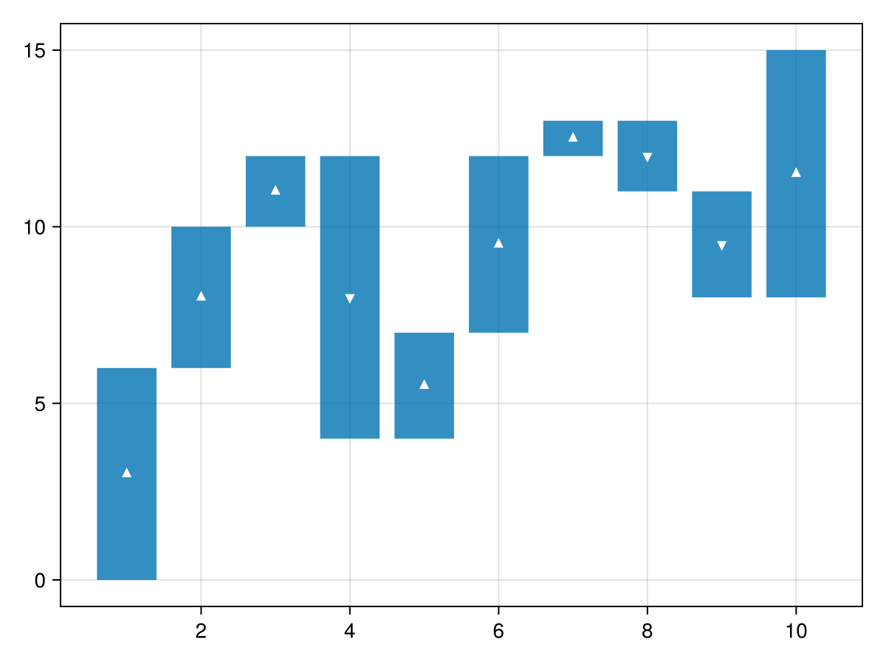
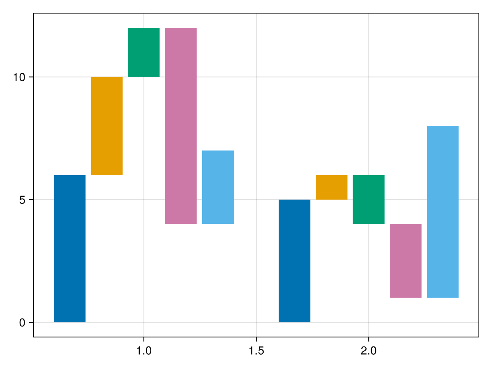
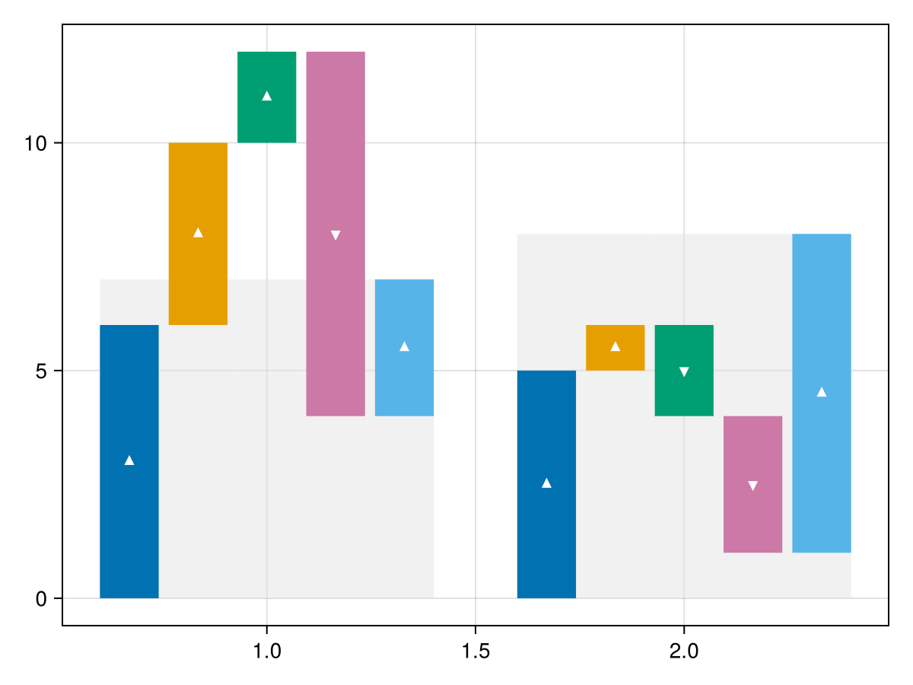
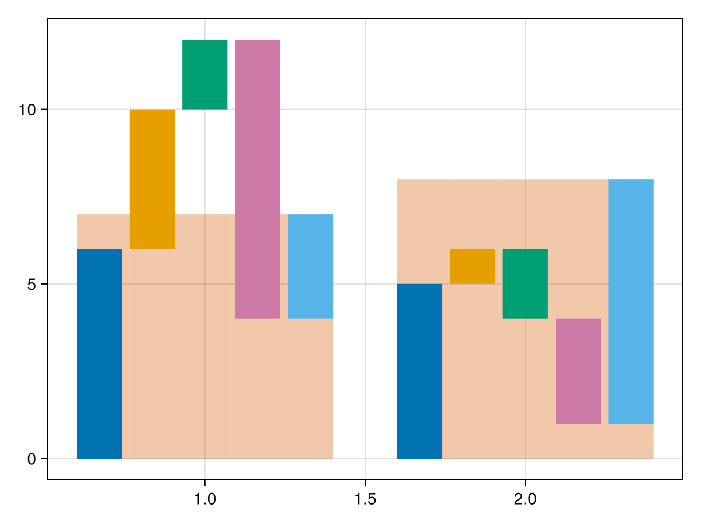
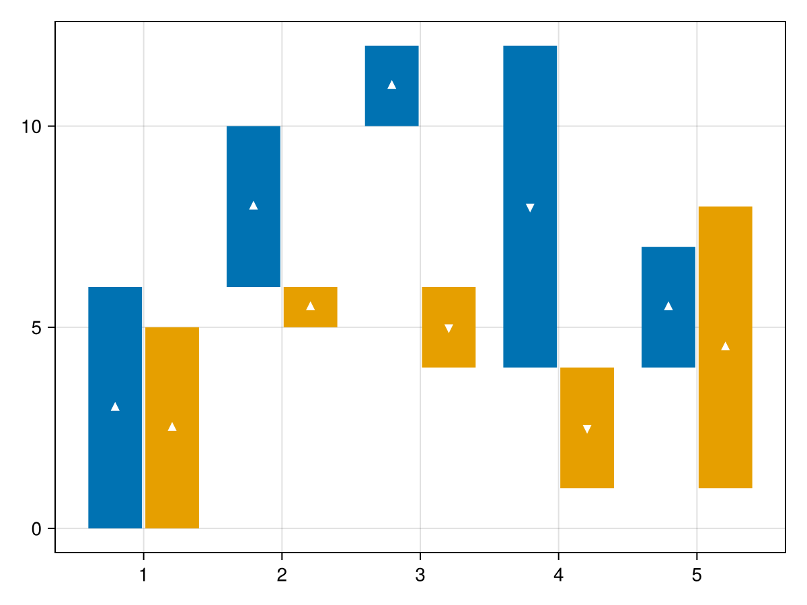

# waterfall {#waterfall}
<details class='jldocstring custom-block' open>
<summary><a id='Makie.waterfall-reference-plots-waterfall' href='#Makie.waterfall-reference-plots-waterfall'><span class="jlbinding">Makie.waterfall</span></a> <Badge type="info" class="jlObjectType jlFunction" text="Function" /></summary>


```julia
waterfall(x, y; kwargs...)
```


Plots a [waterfall chart](https://en.wikipedia.org/wiki/Waterfall_chart) to visualize individual positive and negative components that add up to a net result as a barplot with stacked bars next to each other.

**Plot type**

The plot type alias for the `waterfall` function is `Waterfall`.


<Badge type="info" class="source-link" text="source"><a href="https://github.com/MakieOrg/Makie.jl/blob/f5fbbfb4328fb1bb82ddf663ef4cba4b04da2f84/MakieCore/src/recipes.jl#L520-L562" target="_blank" rel="noreferrer">source</a></Badge>

</details>


## Examples {#Examples}
<a id="example-ad092b7" />


```julia
using CairoMakie
y = [6, 4, 2, -8, 3, 5, 1, -2, -3, 7]

waterfall(y)
```


The direction of the bars might be easier to parse with some visual support.
<a id="example-d3a497e" />


```julia
using CairoMakie
y = [6, 4, 2, -8, 3, 5, 1, -2, -3, 7]

waterfall(y, show_direction=true)
```




You can customize the markers that indicate the bar directions.
<a id="example-fc697db" />


```julia
using CairoMakie
y = [6, 4, 2, -8, 3, 5, 1, -2, -3, 7]

waterfall(y, show_direction=true, marker_pos=:cross, marker_neg=:hline, direction_color=:gold)
```


If the `dodge` attribute is provided, bars are stacked by `dodge`.
<a id="example-9d6de1d" />


```julia
using CairoMakie
colors = Makie.wong_colors()
x = repeat(1:2, inner=5)
y = [6, 4, 2, -8, 3, 5, 1, -2, -3, 7]
group = repeat(1:5, outer=2)

waterfall(x, y, dodge=group, color=colors[group])
```




It can be easier to compare final results of different groups if they are shown in the background.
<a id="example-e4fcc5d" />


```julia
using CairoMakie
colors = Makie.wong_colors()
x = repeat(1:2, inner=5)
y = [6, 4, 2, -8, 3, 5, 1, -2, -3, 7]
group = repeat(1:5, outer=2)

waterfall(x, y, dodge=group, color=colors[group], show_direction=true, show_final=true)
```




The color of the final bars in the background can be modified.
<a id="example-eb65a86" />


```julia
using CairoMakie
colors = Makie.wong_colors()
x = repeat(1:2, inner=5)
y = [6, 4, 2, -8, 3, 5, 1, -2, -3, 7]
group = repeat(1:5, outer=2)

waterfall(x, y, dodge=group, color=colors[group], show_final=true, final_color=(colors[6], 1//3))
```




You can also specify to stack grouped waterfall plots by `x`.
<a id="example-68b3946" />


```julia
using CairoMakie
colors = Makie.wong_colors()
x = repeat(1:5, outer=2)
y = [6, 4, 2, -8, 3, 5, 1, -2, -3, 7]
group = repeat(1:2, inner=5)

waterfall(x, y, dodge=group, color=colors[group], show_direction=true, stack=:x)
```




## Attributes {#Attributes}

### color {#color}

Defaults to `@inherit patchcolor`

No docs available.

### cycle {#cycle}

Defaults to `[:color => :patchcolor]`

No docs available.

### direction_color {#direction_color}

Defaults to `@inherit backgroundcolor`

No docs available.

### dodge {#dodge}

Defaults to `automatic`

No docs available.

### dodge_gap {#dodge_gap}

Defaults to `0.03`

No docs available.

### final_color {#final_color}

Defaults to `plot_color(:grey90, 0.5)`

No docs available.

### final_dodge_gap {#final_dodge_gap}

Defaults to `0`

No docs available.

### final_gap {#final_gap}

Defaults to `automatic`

No docs available.

### gap {#gap}

Defaults to `0.2`

No docs available.

### marker_neg {#marker_neg}

Defaults to `:dtriangle`

No docs available.

### marker_pos {#marker_pos}

Defaults to `:utriangle`

No docs available.

### n_dodge {#n_dodge}

Defaults to `automatic`

No docs available.

### show_direction {#show_direction}

Defaults to `false`

No docs available.

### show_final {#show_final}

Defaults to `false`

No docs available.

### stack {#stack}

Defaults to `automatic`

No docs available.

### width {#width}

Defaults to `automatic`

No docs available.
