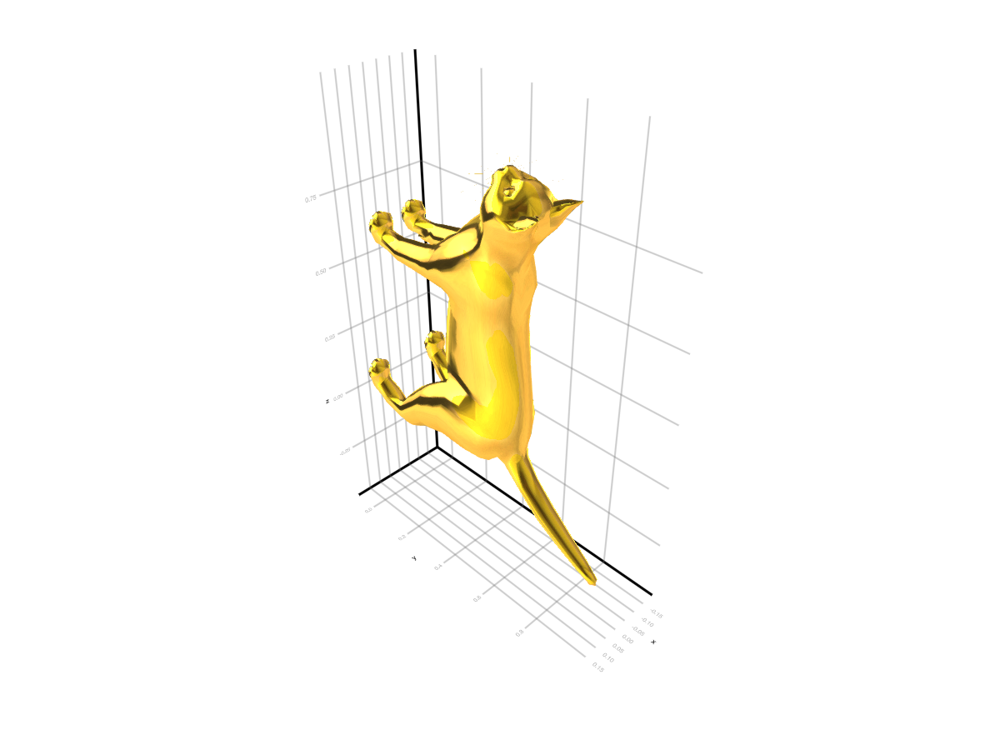

# Matcap {#Matcap}

A matcap (material capture) is a texture which is applied based on the normals of a given mesh. They typically include complex materials and lighting and offer a cheap way to apply those to any mesh. You may pass a matcap via the `matcap` attribute of a `mesh`, `meshscatter` or `surface` plot. Setting `shading = NoShading` is suggested. You can find a lot matcaps [here](https://github.com/nidorx/matcaps).

## Example {#Example}
<a id="example-52b51a0" />


```julia
using GLMakie
using FileIO

catmesh = FileIO.load(assetpath("cat.obj"))
gold = FileIO.load(download("https://raw.githubusercontent.com/nidorx/matcaps/master/1024/E6BF3C_5A4719_977726_FCFC82.png"))

mesh(catmesh, matcap=gold, shading = NoShading)
```


```
┌ Error: obj file contains references to .mtl files, but none could be found. Expected: ["cat.mtl"] in /home/runner/work/Makie.jl/Makie.jl/assets.
└ @ MeshIO ~/.julia/packages/MeshIO/jBkmz/src/io/obj.jl:157
```



