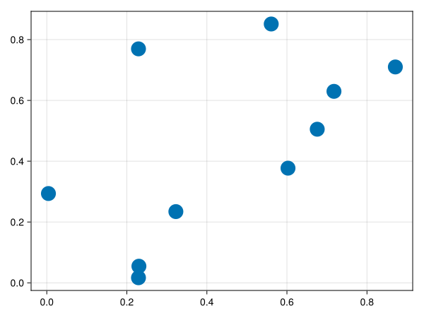
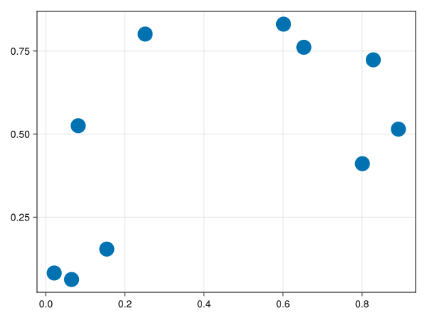

# CairoMakie {#CairoMakie}

[CairoMakie](https://github.com/MakieOrg/Makie.jl/tree/master/CairoMakie) uses Cairo.jl to draw vector graphics to SVG and PDF. You should use it if you want to achieve the highest-quality plots for publications, as the rendering process of the GL backends works via bitmaps and is geared more towards speed than pixel-perfection.

## Activation and screen config {#Activation-and-screen-config}

Activate the backend by calling `CairoMakie.activate!()` with the following options:
<details class='jldocstring custom-block' open>
<summary><a id='CairoMakie.activate!' href='#CairoMakie.activate!'><span class="jlbinding">CairoMakie.activate!</span></a> <Badge type="info" class="jlObjectType jlFunction" text="Function" /></summary>


```julia
CairoMakie.activate!(; screen_config...)
```


Sets CairoMakie as the currently active backend and also allows to quickly set the `screen_config`. Note, that the `screen_config` can also be set permanently via `Makie.set_theme!(CairoMakie=(screen_config...,))`.

**Arguments one can pass via `screen_config`:**
- `px_per_unit = 2.0`
  
- `pt_per_unit = 0.75`
  
- `antialias::Union{Symbol, Int} = :best`: antialias modus Cairo uses to draw. Applicable options: `[:best => Cairo.ANTIALIAS_BEST, :good => Cairo.ANTIALIAS_GOOD, :subpixel => Cairo.ANTIALIAS_SUBPIXEL, :none => Cairo.ANTIALIAS_NONE]`.
  
- `visible::Bool`: if true, a browser/image viewer will open to display rendered output.
  
- `pdf_version::String = nothing`: the version of output PDFs. Applicable options are `"1.4"`, `"1.5"`, `"1.6"`, `"1.7"`, or `nothing`, which leaves the PDF version unrestricted.
  


<Badge type="info" class="source-link" text="source"><a href="https://github.com/MakieOrg/Makie.jl/blob/406a09fe6f430d0a43f0f3cf1a876583e9bafbf5/CairoMakie/src/screen.jl#L130-L139" target="_blank" rel="noreferrer">source</a></Badge>

</details>


#### Inline Plot Type {#Inline-Plot-Type}

You can choose the type of plot that is displayed inline in, e.g., VSCode, Pluto.jl, or any other environment, by setting it via the `activate!` function.

```julia
CairoMakie.activate!(type = "png")
CairoMakie.activate!(type = "svg")
```


#### Z-Order {#Z-Order}

CairoMakie as a 2D engine has no concept of z-clipping, therefore its 3D capabilities are quite limited. The z-values of 3D plots will have no effect and will be projected flat onto the canvas. Z-layering is approximated by sorting all plot objects by their z translation value before drawing, after that by parent scene and then insertion order. Therefore, if you want to draw something on top of something else, but it ends up below, try translating it forward via `translate!(obj, 0, 0, some_positive_z_value)`.

#### Selective Rasterization {#Selective-Rasterization}

By setting the `rasterize` attribute of a plot, you can tell CairoMakie that this plot needs to be rasterized when saving, even if saving to a vector backend.  This can be very useful for large meshes, surfaces or even heatmaps if on an irregular grid.

Assuming that you have a `Plot` object `plt`, you can set `plt.rasterize = true` for simple rasterization, or you can set `plt.rasterize = scale::Int`, where `scale` represents the scaling factor for the image surface.

For example, if your Scene&#39;s size is `(800, 600)`, by setting `scale=2`, the rasterized image embedded in the vector graphic will have a resolution of `(1600, 1200)`.

You can deactivate this rasterization by setting `plt.rasterize = false`.

Example:
<a id="example-943279f" />


```julia
using CairoMakie
v = rand(10,2)
scatter(v[:,1], v[:,2], rasterize = true, markersize = 30.0)
```




If you zoom in, you will see a pretty badly pixelated image - this is because the rasterization density is set to 1 `px` per `pt`.  Setting `rasterize=10` makes this a lot smoother:
<a id="example-8020c20" />


```julia
using CairoMakie
v = rand(10,2)
scatter(v[:,1], v[:,2], rasterize = 10, markersize = 30.0)
```




#### PDF version {#PDF-version}

The version of output PDFs can be restricted via the `pdf_version` argument of the screen config. Conveniently, it can be also passed as an argument of the `save` function:

```julia
using CairoMakie
fig = Figure()
save("figure.pdf", fig, pdf_version="1.4")
```

